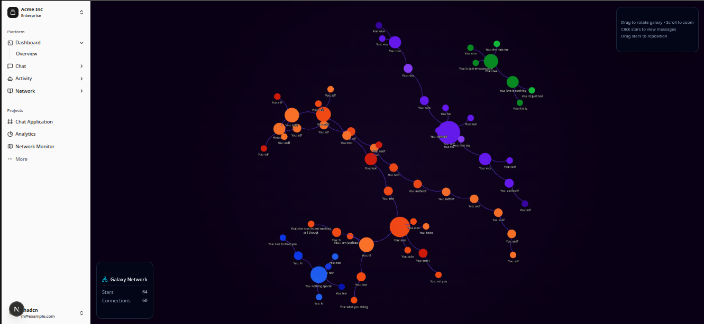
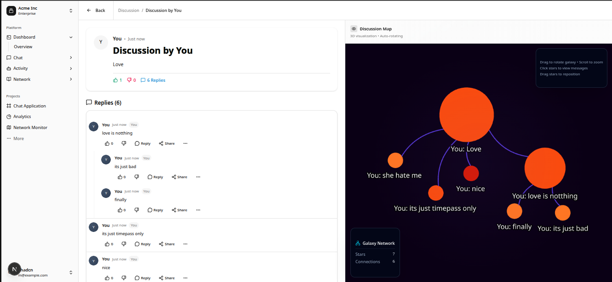
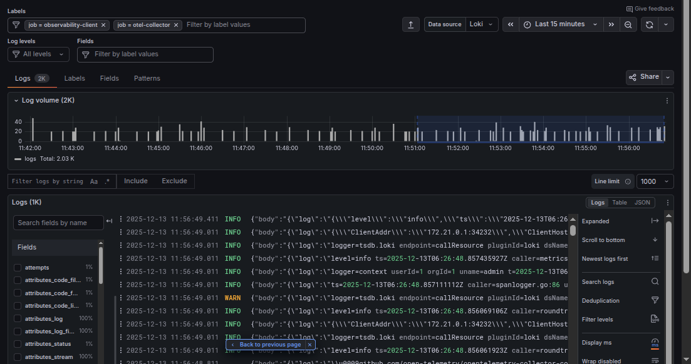
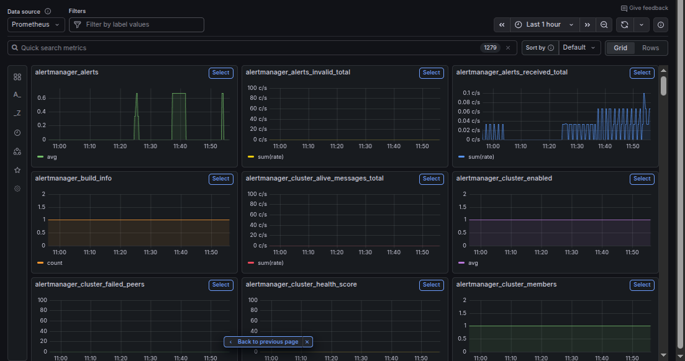
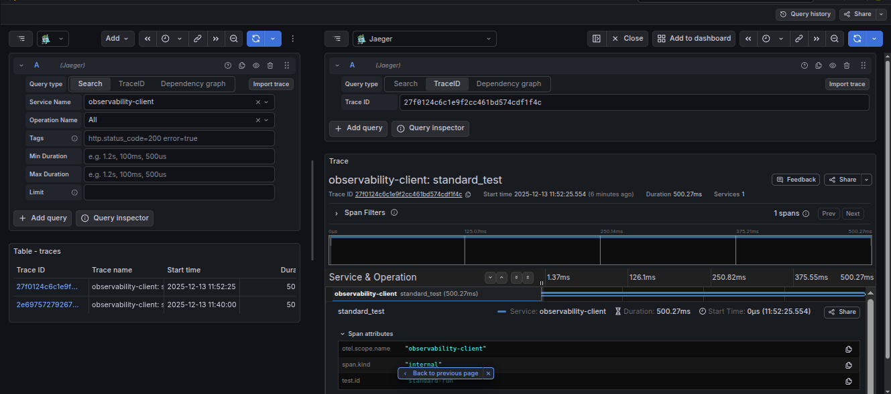

# LLM Observability Platform

A comprehensive Python-based observability platform for Large Language Models (LLMs) with chat interface, container orchestration, monitoring, and advanced analytics capabilities.

## LLM Web Interface

Our platform features a modern, responsive web interface for interacting with LLM models. The interface includes advanced visualization and chat capabilities.


  <h3>3D Discussion Interface</h3>
  
  <p>Interactive 3D visualization of chat discussions showing conversation flow and relationships</p>
  
  <h3>Chat Interface</h3>
  
  <p>Feature-rich chat interface with message threading, markdown support, and context-aware suggestions</p>


## Features

- **Interactive Chat Interface**: Streamlit-based web UI for chatting with LLM models
- **Model Selection**: Support for multiple LLM categories and models from Cloudflare
- **Conversation History**: Persistent chat history with user sessions
- **Deep Analysis**: Advanced emotional and meta-analysis of conversations and LLM responses
- **Container Orchestration**: Docker-based deployment with automatic scaling
- **Observability Suite**: Comprehensive monitoring for LLM performance, usage metrics, and behavioral analytics
- **Health Monitoring**: Real-time health checks and alerting for LLM services
- **Performance Tracking**: Detailed metrics on response times, token usage, and model performance
- **Multi-Cloud Support**: Deployment options for Fly.io and Render

## Project Structure

```
llm-chatbot-python/
├── service/llm_chat_app/          # Main application
│   ├── app/                       # Streamlit web interface
│   ├── core/                      # Core business logic
│   ├── worker/                    # Background workers and workflows
│   └── requirements.txt           # Python dependencies
├── infrastructure/                # Infrastructure components
│   ├── orchestrator/              # Container management
│   └── observability/    # Monitoring and logging
├── deployment/                    # Deployment configurations
├── docs/                          # Documentation
└── shared/                        # Shared utilities
```

## Quick Start

### Prerequisites

- Python 3.10+
- Docker and Docker Compose
- MongoDB (see setup below)

### MongoDB Setup

1. **Create Docker Networks** (if they don't exist):
   ```bash
   docker network create --driver bridge observability-network || true
   docker network create --driver bridge data-network || true
   docker network create --driver bridge messaging-network || true
   docker network create --driver bridge cicd-network || true
   docker network create --driver bridge temporal-network || true
   ```

2. **Copy environment template**:
   ```bash
   cp .env.template .env
   ```

3. **Start MongoDB**:
   ```bash
   python infrastructure/orchestrator/trigger/setup/start_mongodb.py
   ```

4. **Setup Service Worker**:
   ```bash
   python infrastructure/orchestrator/workers/service_setup_worker.py
   ```

5. **Access MongoDB**:
   - **Mongo Express**: https://scaibu.mongoexpress/
     - Username: admin
     - Password: MongoExpressPassword123!


### Infrastructure Setup

1. **Start Temporal Orchestrator:**
```bash
cd infrastructure/orchestrator
docker-compose -f temporal-orchestrator-compose.yaml up -d
```

2. **Verify Temporal Services:**
```bash
curl http://localhost:7233/api/v1/namespaces/default  # Temporal API
curl http://localhost:8080/namespaces/default/workflows  # Web UI
docker exec temporal-postgresql psql -U temporal -d temporal -c "SELECT 1;"
```

3. **Start Observability Components:**
```bash
# Start logging pipeline
python infrastructure/orchestrator/trigger/logging_pipeline/start.py
```

### Application Setup

1. **Install Dependencies:**
```bash
cd service/llm_chat_app
python -m venv .venv
source .venv/bin/activate
pip install -r requirements.txt
```

2. **Configure Environment:**
```bash
cp .env.llm_chat_app.example .env.llm_chat_app
# Required variables:
# CLOUDFLARE_API_TOKEN, CLOUDFLARE_ACCOUNT_ID
# NEO4J_URI, NEO4J_USER, NEO4J_PASSWORD
# TEMPORAL_HOST=localhost:7233
```

3. **Start LLM Chat Application:**
```bash
streamlit run app/streamlit_app.py --server.port 8501
```

## Configuration

### Environment Variables

**Core Application (.env.llm_chat_app):**
- `CLOUDFLARE_API_TOKEN`: Cloudflare Workers AI API token
- `CLOUDFLARE_ACCOUNT_ID`: Your Cloudflare account ID
- `NEO4J_URI`: Neo4j database connection (bolt://localhost:7687)
- `NEO4J_USER`: Neo4j username
- `NEO4J_PASSWORD`: Neo4j password
- `TEMPORAL_HOST`: Temporal server address (localhost:7233)
- `LOKI_URL`: Loki endpoint for log aggregation
- `PROMETHEUS_URL`: Prometheus endpoint for metrics

**Infrastructure Configuration:**
- **Temporal**: PostgreSQL backend with dynamic config in `dynamicconfig/development-sql.yaml`
- **Docker Networks**: Isolated `observability-network` for service communication
- **Resource Limits**: 256MB memory, 0.5 CPU per observability container
- **Health Checks**: Automatic container health monitoring with retries

### Service Discovery

**Available Components:**
- **Logging Pipeline**: Loki log aggregation with container discovery
- **Metrics Pipeline**: Prometheus metrics collection and Grafana dashboards
- **Tracing Pipeline**: OpenTelemetry tracing with distributed systems support
- **AI Proxy Service**: Containerized LLM API proxy with monitoring

### Docker Deployment

1. Build the container:
```bash
docker build -t llm-chatbot .
```

2. Run with Docker Compose:
```bash
docker-compose up -d
```

## Development

### Workflow Development

**Adding New Activities:**
```python
# activities/my_new_activity.py
from temporalio import activity
import asyncio

@activity.defn
async def my_new_activity(arg: str) -> str:
    await asyncio.sleep(0.1)
    return f"done:{arg}"
```

**Creating Workflows:**
```python
# workflows/my_new_workflow.py
from datetime import timedelta
from temporalio import workflow
from temporalio.common import RetryPolicy

@workflow.defn
class MyNewWorkflow:
    @workflow.run
    async def run(self, param: str) -> str:
        result = await workflow.execute_activity(
            my_new_activity,
            param,
            start_to_close_timeout=timedelta(minutes=2),
            retry_policy=RetryPolicy(maximum_attempts=3),
        )
        return result
```

**Worker Implementation:**
```python
# workers/my_new_worker.py
async def main():
    client = await Client.connect("localhost:7233")
    worker = Worker(
        client,
        task_queue="my-new-task-queue",
        workflows=[MyNewWorkflow],
        activities=[my_new_activity]
    )
    await worker.run()
```

### Code Style Requirements

**Python (Pylint):**
- Naming: `snake_case` for variables/functions, `PascalCase` for classes
- Limits: 5 function args, 50 statements per function, 12 branches
- Python 3.12+ compatibility required

**YAML:**
- 2-space indentation, single quotes
- 120 character line length maximum
- No trailing spaces, max 2 consecutive empty lines

### Git Workflow

All changes follow automated workflow:
```bash
git add .
git commit -m "Auto-commit: $(date '+%Y-%m-%d %H:%M:%S')"
git push
```

Conflict handling:
```bash
git pull  # Auto-merge if possible
# Manual review required if merge fails
```

## Architecture Overview

This platform is built on **Temporal.io orchestration** for managing containerized services with a comprehensive observability stack.

### Core Infrastructure Components

**Temporal Orchestration System:**
- **Temporal Server**: Workflow state management and durability (PostgreSQL-backed)
- **Activities**: Individual operations (container start/stop, monitoring, configuration)
- **Workflows**: Orchestration logic coordinating activities with retry policies
- **Workers**: Execute workflows on dedicated task queues per service
- **Web UI**: Real-time workflow monitoring at http://localhost:8080

**Observability Platform:**
- **Loki**: Log aggregation with automatic Docker container discovery
- **Prometheus**: Metrics collection with auto-discovery of endpoints
- **Grafana**: Unified dashboards for logs, metrics, and traces
- **OpenTelemetry**: Standardized telemetry collection and processing
- **Tempo**: Distributed tracing with OTLP support

**Container Management:**
- **BaseContainerManager**: Thread-safe Docker client with resource limits
- **ServiceManager**: Multi-container orchestration with dependency resolution
- **Health Monitoring**: Real-time container health checks and alerting
- **Network Management**: Isolated observability network for service communication

### Service Architecture

The platform follows a **microservices pattern** with:
- **Conditional Service Activation**: Services only run when explicitly requested
- **Shared Infrastructure**: Common databases and message brokers with isolation
- **Event-Driven Communication**: Kafka for async, GraphQL for sync operations
- **Auto-Discovery**: Automatic detection of Docker containers and K8s pods for observability

### Key Features

**LLM-Specific Observability:**
- **Deep Analysis**: Emotional and meta-analysis of LLM conversations and responses
- **Performance Tracking**: Response times, token usage, and model performance metrics
- **Behavioral Analytics**: Pattern recognition in LLM interactions and outputs
- **Health Monitoring**: Real-time LLM service health with automatic failover

**Infrastructure Automation:**
- **Temporal Workflows**: Orchestration of container lifecycle and configuration
- **Service Management**: Multi-container orchestration with dependencies
- **Resource Management**: Container scaling and resource allocation

## Deployment Options

### Docker Compose
```bash
# Temporal orchestrator
docker-compose -f infrastructure/orchestrator/temporal-orchestrator-compose.yaml up -d

# Start specific services via Temporal workflows
python infrastructure/orchestrator/trigger/logging_pipeline/start.py
python infrastructure/orchestrator/trigger/metrics_pipeline/start.py
python infrastructure/orchestrator/trigger/tracing_pipeline/start.py
```

### Cloud Platforms

**Fly.io:**
```bash
cd service/llm_chat_app
fly launch --build-only
fly deploy
```

**Render:**
- Automated deployment via `worker/workflows/render_deploy_workflow.py`
- Zero-dockerfile deployment with automatic environment detection

## Observability Features

### LLM-Specific Monitoring

**Performance Metrics:**
- Response time tracking and analysis
- Token usage and cost monitoring
- Error rates and failure pattern detection
- User session management

**Deep Analysis:**
- **Emotional State Analysis**: Core emotion detection with intensity scoring
- **Meta-Cognitive Tracking**: Higher-level reasoning pattern analysis
- **Conversation Flow**: Topic transitions and engagement metrics
- **Quality Assessment**: Response coherence and relevance scoring

### Infrastructure Observability

**Log Management:**
- Loki-based log aggregation
- Structured logging with correlation IDs
- Container log collection and processing

**Metrics Collection:**
- Prometheus metrics endpoint discovery
- Grafana dashboard integration
- Performance and usage tracking

**Distributed Tracing:**
- OpenTelemetry OTLP trace collection
- Service dependency mapping
- Request flow visualization

### Visualizations

<div align="center">
  <h4>Loki Logs Dashboard</h4>
  
  
  <h4>Metrics (Prometheus/Grafana)</h4>
  
  
  <h4>Distributed Tracing (Jaeger)</h4>
  
</div>

## Observability Setup Guide 🚀

For a step-by-step guide on how to deploy, configure, and use the observability stack (even for non-developers), please refer to our detailed documentation:

👉 **[Setup Observability Stack (Detailed Guide)](infrastructure/observability/SETUP_OBSERVABILITY_STACK.md)**

This guide covers:
- **One-Command Deployment**
- **How to view Logs, Metrics, and Traces**
- **How to create Alerts**
- **Using the Python Client**

## Contributing

1. Fork the repository
2. Create a feature branch
3. Make your changes
4. Ensure all linting rules pass
5. Submit a pull request

## Important Links

**Connect with Scaibu:**
- **Email**: chief.stategist.j@gmail.com
- **Medium**: https://medium.com/@scaibu
- **LinkedIn**: https://www.linkedin.com/in/chiefj/
- **Twitter**: https://x.com/ChiefErj
- **Instagram**: https://www.instagram.com/chief._.jaydeep/
- **Discord Server**: https://discord.com/invite/FzZPnjZa
- **Website**: https://scaibu.lovable.app/
- **Service Booking**: https://topmate.io/jaydeep_wagh/1194002
