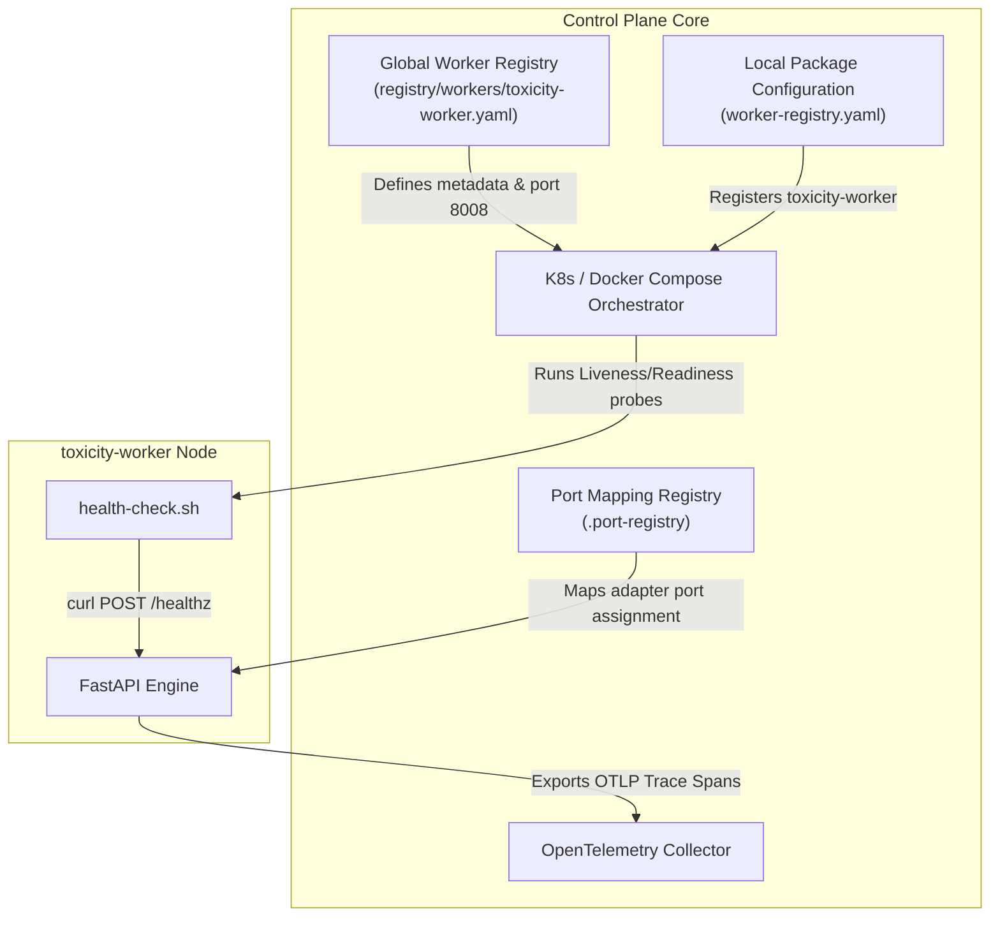
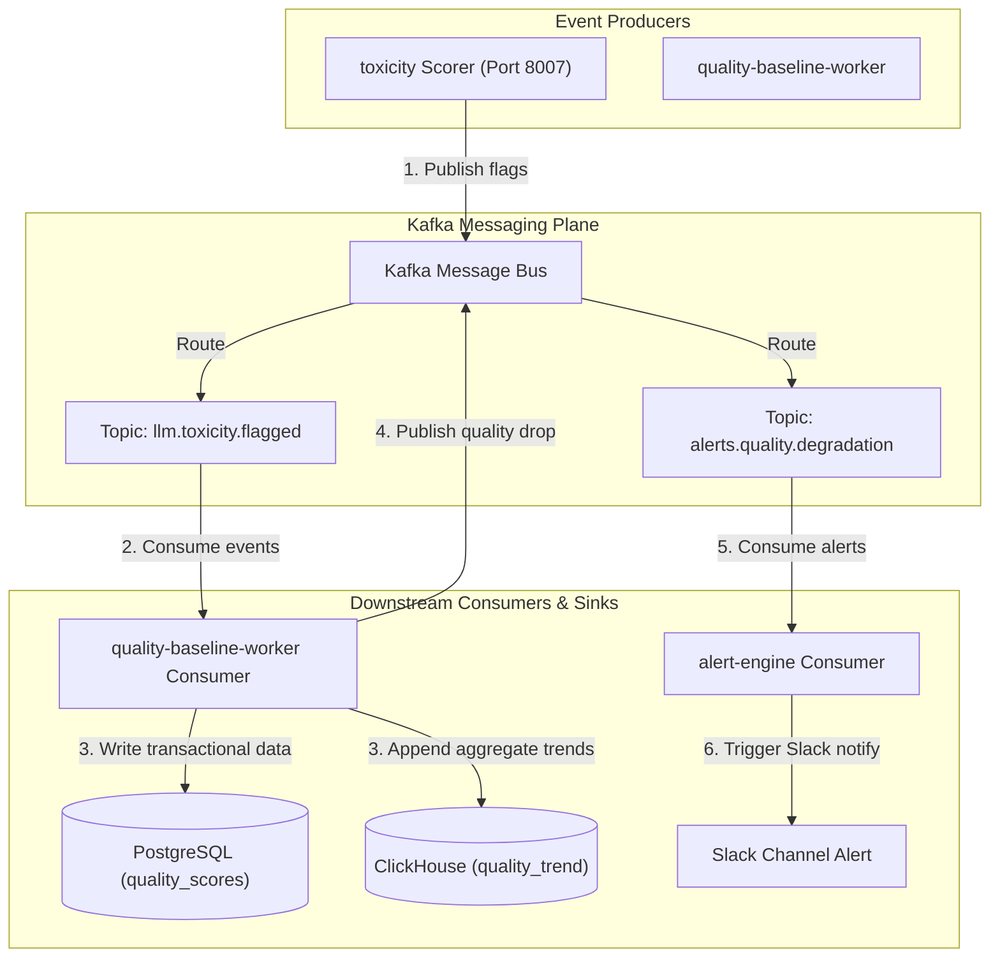
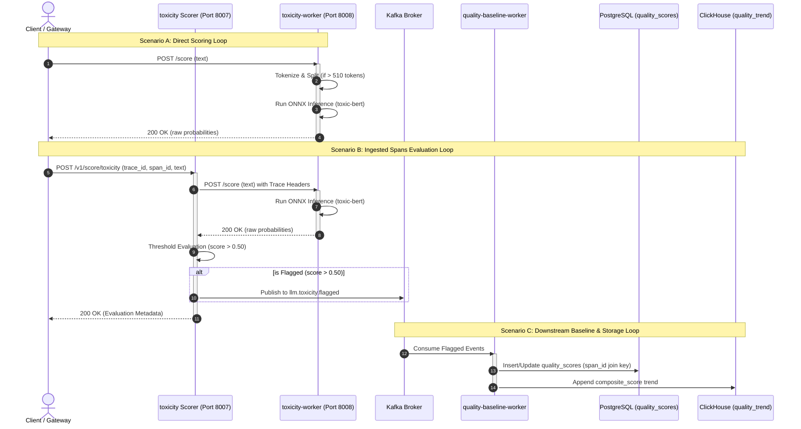

# ADR 0001: Decoupling Toxicity Inference Worker from Evaluation Scorer

## Status
Accepted

## Context
The LLM Observability Platform requires multi-label toxicity classification for LLM responses. Currently, the platform implements a `toxicity` scorer service (running on port `8007`) that tokenizes text, loads model weights locally, runs inference, evaluates thresholds, and emits flagged events to Kafka.

However, executing CPU-heavy machine learning model inference within the event processing and evaluation loops presents several architectural drawbacks:
1. **Resource Scarcity and Cold Starts**: Model loading consumes substantial memory and causes long initial startup times.
2. **Scaling Inefficiency**: Scaling out the evaluation orchestrators (which run Kafka consumers and HTTP REST routing) is cheap, whereas scaling out ML inference containers is expensive.
3. **No Direct Path for Real-time Gateway Scoring**: Gateway services requiring pure, high-throughput, low-latency toxicity predictions (Timeout SLO: 200ms) would otherwise be forced to run heavy local inference packages or wrap complex evaluation pipelines.

---

## 1. Control Plane Architecture

The Control Plane manages service registration, configuration injection, lifecycle checks (startup, liveness, and readiness probes), and trace context collection across the platform:



---

## 2. Data / Processing Plane Architecture

The Data & Processing Plane coordinates synchronous HTTP request paths, text tokenization, ONNX Runtime CPU sequence inference, and scoring delegate tasks:

```mermaid
graph TD
    subgraph Client Layer
        Gateway["Platform API Gateway"]
        CLI["Developer CLI Tool"]
    end

    subgraph toxicity Scorer (Port 8007)
        ScorerAPI["FastAPI REST Controller"]
        Rules["Features / Evaluation Rules"]
    end

    subgraph toxicity-worker (Port 8008)
        WorkerAPI["FastAPI REST Controller"]
        InferenceService["score_toxicity Service"]
        ONNXAdapter["DetoxifyOnnxAdapter"]
        ONNXRuntime["ONNX Runtime CPU"]
        Tokenizer["toxic-bert Tokenizer"]
    end

    Gateway -->|1. Direct score inference| WorkerAPI
    CLI -->|1. CLI test scoring| WorkerAPI
    Gateway -->|2. Scorer pipeline request| ScorerAPI
    ScorerAPI -->|3. Evaluate business logic| Rules
    Rules -->|4. HTTP POST /score| WorkerAPI

    WorkerAPI --> InferenceService
    InferenceService --> ONNXAdapter
    ONNXAdapter --> Tokenizer
    ONNXAdapter --> ONNXRuntime
```

---

## 3. Messaging Plane Architecture

The Messaging Plane handles asynchronous event distribution, streaming metrics aggregation, transactional database storage, and alerting triggers:



---

## Detailed Sequence Diagram (Data Flow Lifecycle)

This sequence diagram details the end-to-end trace interaction starting from direct client requests to downstream baseline database ingestion:



---

## Hexagonal Architecture Diagram (ports and adapters)

The diagram below details the decoupled dependency direction of `toxicity-worker`. Notice that dependency arrows always point inward toward the core domain logic, isolating ONNX and FastAPI dependencies in the adapters layer:

```mermaid
graph TD
    subgraph Primary Adapters (API Layer)
        FastAPI["FastAPI REST Controller"]
        HealthHandler["Healthz REST Handler"]
        ScoreHandler["Score REST Handler"]
    end

    subgraph Core Domain (Business Logic & Contracts)
        Service["score_toxicity Service"]
        ScorerPort["ToxicityScorerPort (Interface)"]
        Types["Toxicity Types & Schema Models"]
    end

    subgraph Secondary Adapters (Infrastructure Layer)
        ONNXAdapter["DetoxifyOnnxAdapter"]
        ONNXRuntime["ONNX Runtime CPU"]
        Tokenizer["toxic-bert Tokenizer"]
    end

    FastAPI --> ScoreHandler
    FastAPI --> HealthHandler
    ScoreHandler --> Service
    Service --> ScorerPort
    Service --> Types
    ONNXAdapter -- Implements --> ScorerPort
    ONNXAdapter --> Tokenizer
    ONNXAdapter --> ONNXRuntime

    style Service fill:#d4edda,stroke:#28a745,stroke-width:2px
    style ScorerPort fill:#cce5ff,stroke:#004085,stroke-width:2px
```

---

## Platform Integration & Dependency Tree

The following diagram maps the entire lifecycle, starting from the client request through the decoupled toxicity services, downstream storage adapters, analytical engines, dashboard metrics, alerting mechanisms, and operational SLOs:

```text
[Input Sources]
 ├── Platform API Gateway / Client Request (Direct Scoring)
 │    └── POST /score ──► [toxicity-worker (Port 8008)] (Stateless Model Service)
 │                         ├── Tokenize Input & Check Token Count
 │                         ├── If <= 510: Single-pass ONNX Inference (unitary/toxic-bert)
 │                         └── If > 510:  Dual-pass ONNX Inference & Combined max() Score
 │
 └── Ingested Spans (Asynchronous Evaluation Loop)
      └── POST /v1/score/toxicity ──► [toxicity Scorer (Port 8007)] (Orchestrator)
                                       ├── Runs Scorer evaluation rules (Threshold > 0.50)
                                       ├── If Flagged: Emit to Kafka topic 'llm.toxicity.flagged'
                                       └── Writes Evaluation Records (with span_id join key)
                                            │
                                            ▼
                               [quality-baseline-worker]
                               /                       \
                              /                         \
                             ▼                           ▼
                 PostgreSQL (quality_scores)       ClickHouse (quality_trend)
                 (Direct Real-Time Storage)        (Aggregated Historical Trends)
                 /           │            \                       │
                /            │             \                      │
               /             │              \                     │
              ▼              ▼               ▼                    ▼
     [POST-DEP-Q-01]  [POST-DEP-Q-02]  [POST-DEP-Q-03]     [POST-DEP-Q-02]
     Layer 5 Prompt   Grafana Recent   SLO Monitoring      Grafana 30-Day
      Intelligence      Dashboards      (Prometheus & PG)     Dashboards
     (avg_quality_     (Toxicity queue  (SLO-Q-01/02/03)   (Composite score
     score per cluster) depth / Flags)   - P95 Latency      trends per model)
                                         - Sample Rates
                                         - Human Review
                                               │
                                               ▼
                                         [Quality Drop]
                                               │
                                               ▼ (Kafka topic: alerts.quality.degradation)
                                        [POST-DEP-Q-04]
                                        [alert-engine]
                                               │
                                               ▼
                                      (Slack Slack Alert)
                                 "Quality drop: {model}/{endpoint}
                                  — {current_avg} vs {baseline}"
```

---

## Detailed Step-by-Step Relationships

The system components are connected via the following detailed operational and data-flow pathways:

### 1. Gateway Client to `toxicity-worker` (Port 8008)
*   **Connection**: Direct HTTP REST Client calling `POST /score`.
*   **Payload Contract**: Sends `{"text": "..."}`. Returns raw floating point scores for the 6 toxicity labels, plus `long_response_strategy` if dual-pass was triggered.
*   **Latency constraint**: Must complete within **200ms SLO**.

### 2. `toxicity` Scorer (Port 8007) to `toxicity-worker` (Port 8008)
*   **Connection**: Downstream HTTP request over private VPC/network.
*   **Relationship**: The `toxicity` scorer delegates raw text scoring to `toxicity-worker`. By querying port 8008 via an HTTP adapter, the scorer is completely freed from loading ONNX runtimes and model weights in its own container.
*   **Context Propagation**: The incoming `traceparent` (Trace ID + Span ID) headers from the scorer are read by the worker to link parent/child OpenTelemetry spans.

### 3. `toxicity` Scorer (Port 8007) to Kafka event loop
*   **Connection**: Kafka producer (`confluent-kafka`).
*   **Relationship**: When the toxicity score returned by `toxicity-worker` exceeds `0.50`, the scorer flags the response (`TOXIC_RESPONSE`) and publishes a message containing `trace_id`, `span_id`, and label scores to the `llm.toxicity.flagged` Kafka topic.

### 4. Kafka event loop to `quality-baseline-worker`
*   **Connection**: Kafka consumer group.
*   **Relationship**: The `quality-baseline-worker` consumes flagged events from `llm.toxicity.flagged` and general span metrics. It processes them to compute baseline score deviations and registers records for storage.

### 5. `quality-baseline-worker` to Databases (PostgreSQL and ClickHouse)
*   **Connection**: SQL Client / DB Connection Pools.
*   **PostgreSQL (`quality_scores` table)**: Real-time transactional write of scores and flag status (joined on `span_id`).
*   **ClickHouse (`quality_trend` table)**: High-throughput columnar append of rolling composite score trends.
*   **Failure Mode**: If `quality-baseline-worker` goes offline, PostgreSQL tables stop updating immediately, and ClickHouse data goes stale.

### 6. PostgreSQL (`quality_scores`) to Prompt Intelligence (Layer 5)
*   **Connection**: SQL Query `SELECT avg(score) FROM quality_scores WHERE span_id IN (...)`.
*   **Relationship**: Sourced via `span_id` as the primary join key. Prompt Intelligence aggregates average quality metrics per text cluster using these scores.

### 7. Databases to Grafana Quality Dashboards
*   **ClickHouse Connection**: Queries composite trends over 30 days to plot overall model performance.
*   **PostgreSQL Connection**: Queries recent flags and queue depth (`WHERE review_status = 'pending'`) for human moderators.
*   **Alert State**: If ClickHouse data is > 24 hours stale, Grafana displays the message: *"Quality trend data older than 24 hours — baseline worker may be down."*

### 8. PostgreSQL and Prometheus to SLO Monitors
*   **SLO-Q-01 (Latency)**: Prometheus scrapes latency metrics from HTTP server endpoints to track `pipeline_latency_ms` (SLO limit: P95 < 60s).
*   **SLO-Q-02 (Sample Rate)**: Sourced by Prometheus ratio calculation of sampled vs unsampled spans.
*   **SLO-Q-03 (Review SLO)**: Queries PostgreSQL `quality_scores` for `quality_flags` containing `TOXIC_RESPONSE` to verify they are processed by moderators within 24 hours.

### 9. Database/Evaluation to `alert-engine` via Kafka
*   **Connection**: Kafka producer/consumer (`alerts.quality.degradation` topic).
*   **Relationship**: If the baseline worker detects that the average quality score drops below baseline, it publishes a quality degradation event. The `alert-engine` consumes this event and formats a Slack alert containing `{model}`, `{endpoint}`, `{current_avg}`, and `{baseline}`.

---

## Detailed Logic Dependencies & Component Importance

To guarantee system stability, the following logical dependencies must be strictly preserved across deployments:

```text
[Gateway Ingestion / span_id Generation]
                  │
                  ▼ (span_id must propagate identically)
    [POST-DEP-Q-01: Prompt Intelligence] ◄─── (Join Key: span_id)
                  │
                  ▼ (Failure: Mismatch breaks clustering evaluation)
       [PostgreSQL: quality_scores] ◄──────── (Join Key: span_id)
```

### 1. `span_id` Trace Compatibility (POST-DEP-Q-01)
*   **Logical Dependency**: Layer 5 Prompt Intelligence joins PG `quality_scores` and `cluster_assignments` via the `span_id` field.
*   **System Importance**: Both the gateway tracing headers and the `toxicity` evaluation record must use the identical, unaltered `span_id` string from `llm.spans.sampled`. Any mutation or mismatch of the join key during trace context propagation breaks Prompt Intelligence clustering immediately, leading to missing data in average quality tracking.
*   **Verification Rule**: Covered by API integration tests that simulate full-trip tracing headers.

### 2. ClickHouse Trend Consistency & Baseline Worker Status (POST-DEP-Q-02)
*   **Logical Dependency**: Grafana plots 30-day composite trends from ClickHouse `quality_trend` (written by `quality-baseline-worker`).
*   **System Importance**: If `quality-baseline-worker` halts or crashes, ClickHouse aggregate queries return stale, historical metrics that fail to reflect ongoing degradations. 
*   **Recovery Safeguard**: Grafana queries include a check for the last written timestamp. If the max data timestamp is $> 24$ hours old, Grafana displays a banner warning: *"Quality trend data older than 24 hours — baseline worker may be down."* This prevents operators from relying on stale baseline data.

### 3. End-to-End Latency Target (POST-DEP-Q-03 / SLO-Q-01)
*   **Logical Dependency**: Prometheus tracks `pipeline_latency_ms` histogram across all processing stages.
*   **System Importance**: The P95 pipeline latency must remain under 60,000ms. Since the `toxicity-worker` performs dual-pass sequence evaluation on long texts, its own inference latency directly affects this downstream SLO. If CPU saturation occurs in `toxicity-worker`, the pipeline backed-up state triggers pager alerts.

### 4. Toxicity Review Moderation Queue (POST-DEP-Q-03 / SLO-Q-03)
*   **Logical Dependency**: Human review queues query PostgreSQL where `review_status = 'pending'` and `'TOXIC_RESPONSE' in quality_flags`.
*   **System Importance**: Flagged responses must be audited by human moderators within 24 hours (95% target). If event emission delays occur at the Kafka producer stage in the scorer, the moderation queue is delayed, violating the 24h service level objective.

### 5. Alert Engine Topic Subscriptions (POST-DEP-Q-04)
*   **Logical Dependency**: The `alert-engine` must consume alerts from the `alerts.quality.degradation` topic.
*   **System Importance**: If the `alert-engine` consumer group fails to subscribe to this topic, quality drop events (where a model's current average score drops significantly below baseline) will accumulate unconsumed in Kafka. Due to the 1-day retention limit, these critical notifications will be permanently lost after 24 hours, leaving engineers blind to system quality degradation.

---

## Decision
We will introduce a new service package, `toxicity-worker`, designed as a dedicated, stateless model inference server (Model-as-a-Service) on port `8008`.

1. **Separation of Concerns**:
   - `toxicity-worker` (Port `8008`) is responsible solely for raw multi-label classification (using `unitary/toxic-bert` via `optimum[onnxruntime]` on CPU) over a clean, flat REST API (`POST /score`). It is stateless and does not interact with Kafka, databases, or downstream evaluation rules.
   - `toxicity` Scorer (Port `8007`) acts as the orchestrator/evaluator, handling domain business logic (threshold mapping, skipped rules) and system events (Kafka publishing to `llm.toxicity.flagged`).
2. **Resource Constraints**:
   - Limit the inference worker: CPU requests/limits: `500m`/`1000m`, Memory requests/limits: `512Mi`/`1Gi`.
3. **API Contracts**:
   - Worker implements `POST /score` taking `{"text": "..."}` and returning flat probabilities.
   - Worker implements `POST /healthz` for health checks.
4. **Code Decoupling**:
   - Zero shared code or packages between the two services to satisfy worker isolation principles.

## Consequences
- **Improved Observability**: Telemetry spans and metrics are isolated. Inference latency and processing latency are monitored independently.
- **Resource Efficiency**: High-throughput CPU/GPU autoscaling can be dedicated exclusively to the `toxicity-worker` deployment.
- **Microservices Compliance**: Adheres to the platform's Hexagonal Architecture and Worker registry guidelines.
