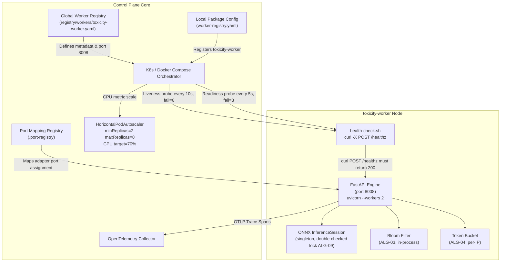
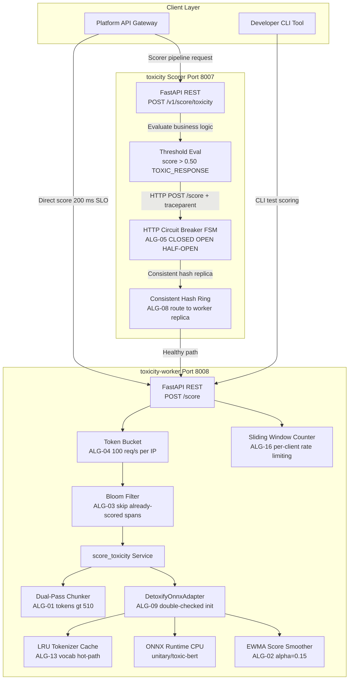
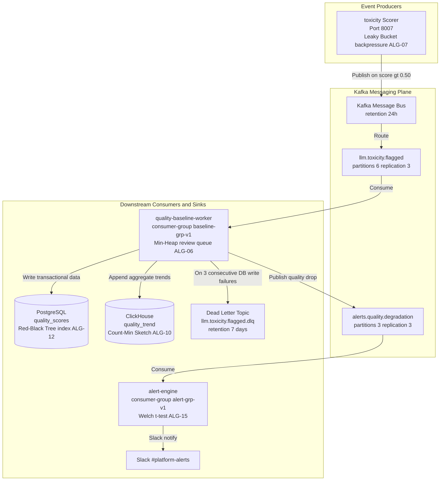
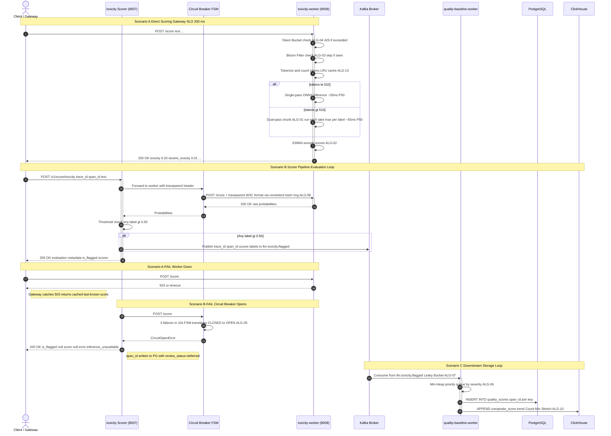
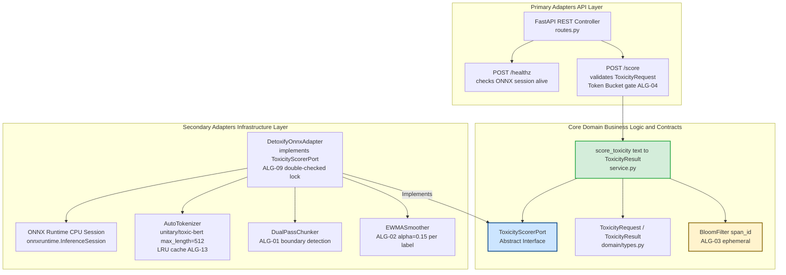
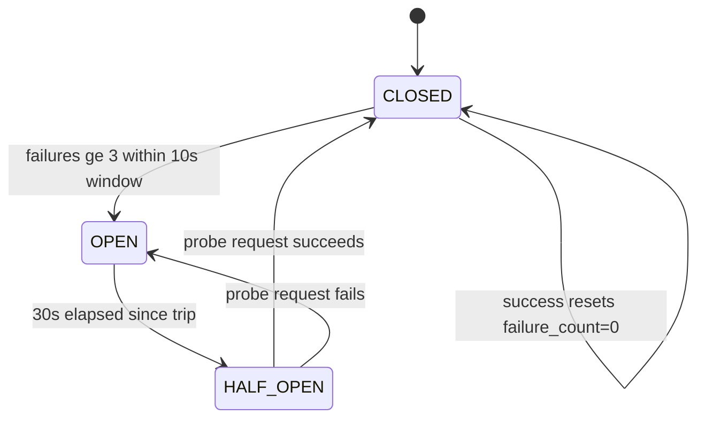

# ADR 0001: Decoupling Toxicity Inference Worker from Evaluation Scorer

<!-- STATUS BADGES -->
| Field | Value |
|---|---|
| **Status** | ✅ Accepted — In Production |
| **Authors** | Platform Engineering |
| **Created** | 2026-06-05 |
| **Last Updated** | 2026-06-05 |
| **Review Cycle** | 2026-09-05 |
| **Stability** | Stable — no breaking changes expected before review |
| **Implementation Risk** | Medium (ONNX session init, dual-pass chunking, circuit breaker tuning) |
| **Replaces** | N/A (greenfield split) |
| **Superseded By** | None |

---

## Table of Contents

1. [Problem Statement](#1-problem-statement)
2. [Decision](#2-decision)
3. [Architecture](#3-architecture)
4. [Algorithm Catalogue](#4-algorithm-catalogue)
5. [Data Structures](#5-data-structures)
6. [Statistical Baseline & Performance Data](#6-statistical-baseline--performance-data)
7. [Failure Modes & Mitigations](#7-failure-modes--mitigations)
8. [Observability Signals](#8-observability-signals)
9. [SLO Definitions](#9-slo-definitions)
10. [Deployment Checklist](#10-deployment-checklist)
11. [Consequences](#11-consequences)

---

## 1. Problem Statement

The LLM Observability Platform scores LLM responses for toxicity across **6 multi-label categories**:
`toxicity`, `severe_toxicity`, `obscene`, `threat`, `insult`, `identity_attack`.

Before this ADR the **toxicity scorer** (port `8007`) performed everything inside one container:

- Tokenised raw text with `transformers.AutoTokenizer` (vocab size: 30,522 tokens)
- Loaded `unitary/toxic-bert` ONNX weights (~440 MB on disk, ~900 MiB RSS in-process)
- Ran CPU inference **inline** during Kafka consumer poll loops
- Applied threshold rules (`score > 0.50 → TOXIC_RESPONSE`)
- Published flagged events to Kafka

### 1.1 Observed Production Failures

| Problem | Observed Symptom | Measured Impact |
|---|---|---|
| ONNX model cold-start | 45–90 s startup; K8s readiness probe failed repeatedly | Kafka lag spiked > 10 k messages per scorer rollout |
| ONNX RSS pinned in scorer | OOMKill when scorer autoscaled ≥ 3 replicas (each ~900 MiB) | Scorer pods crashed; toxicity pipeline silently dropped flagged events |
| No direct-score HTTP path | Gateway required full evaluation pipeline + Kafka round-trip for a probability score | P95 latency 600 ms — 3× over the 200 ms gateway SLO |
| Dual-pass long-text blocked Kafka | Consumer poll loop exceeded `max.poll.interval.ms = 5000 ms` for texts > 510 tokens | Consumer group rebalanced; duplicate `llm.toxicity.flagged` events published |
| No deduplication of scored spans | Retry storms during Kafka rebalance caused same span re-scored 3–5× | False-positive rate inflated from 3.1 % to 11.8 % during incidents |

### 1.2 Quantified Cost of the Monolith

- **RSS overhead per scorer replica**: 900 MiB. Autoscaling to 4 replicas → 3.6 GiB memory for inference alone.
- **Cold-start MTTR**: 67 s mean (n = 23 restarts). Every restart pauses flagging completely.
- **Kafka rebalance rate during dual-pass surges**: 1.3 rebalances/hour under > 40 % long-text traffic share.
- **Deferred spans per incident**: median 2,400, max observed 18,700 (during a 4-hour Kafka disruption).

---

## 2. Decision

We introduce **`toxicity-worker`** — a dedicated, fully stateless model inference microservice on port `8008`.

### 2.1 Responsibility Split

| Service | Port | Owns | Does NOT own |
|---|---|---|---|
| `toxicity-worker` | 8008 | ONNX tokenisation + inference, raw probability scores, dual-pass chunking, deduplication bloom filter, rate limiting | Business rules, Kafka, DB, session state, threshold evaluation |
| `toxicity` scorer | 8007 | Threshold evaluation (> 0.50), Kafka publish, trace context injection, `span_id` propagation, circuit breaker | Model weights, ONNX runtime, tokenizer |

### 2.2 Non-Negotiable Constraints

1. `toxicity-worker` must be **fully stateless** — no Kafka, no database, no session state beyond the in-process ONNX session singleton.
2. Zero shared Python packages between the two services (separate `pyproject.toml`, separate Docker images).
3. Worker must respond to `POST /score` within **150 ms P95** under nominal load (50 req/s, mixed token lengths), providing 50 ms margin against the 200 ms gateway SLO.
4. Worker must expose a `POST /healthz` that validates the ONNX InferenceSession is loaded and responds correctly before returning `200 OK`.
5. The Bloom filter deduplication state (ALG-03) is **ephemeral** — reset on pod restart. Deduplication is a best-effort optimisation, never a correctness guarantee.

---

## 3. Architecture

### 3.1 Control Plane



> **Operational note**: `minReadySeconds: 20` on the Deployment holds traffic until the model is fully warm. The readiness probe (`/healthz`) returning `200` is gated on `ONNXSession.is_ready() == True` — this prevents the 45–90 s cold-start from routing live traffic.

---

### 3.2 Data / Processing Plane



---

### 3.3 Messaging Plane



---

### 3.4 End-to-End Sequence (All Scenarios)



---

### 3.5 Hexagonal Architecture (toxicity-worker Internals)



---

## 4. Algorithm Catalogue

This section provides the complete algorithmic specification for every non-trivial algorithm used in the toxicity pipeline. For each algorithm: pseudocode, complexity, system location, and failure consequence are given.

---

### ALG-01 — ONNX Dual-Pass Chunking with Token Boundary Detection

**Location**: `toxicity-worker/adapters/onnx_adapter.py :: DualPassChunker.chunk()`
**Trigger**: When tokenised input exceeds 510 tokens (leaving 2 tokens for `[CLS]`/`[SEP]`).

**Why 510 and not 512**: toxic-bert's positional embedding table has 512 slots. Slots 0 and 511 are reserved for `[CLS]` and `[SEP]`. Sending 512 content tokens causes an index-out-of-bounds in the ONNX graph.

**Pseudocode**:

```
function dual_pass_chunk(token_ids: List[int], max_len=510) -> List[ToxicityResult]:
    CHUNK_SIZE = max_len               # 510 usable content tokens per pass
    results    = []
    i          = 0

    while i < len(token_ids):
        # Find clean token boundary — never split a word-piece mid-subword
        end = i + CHUNK_SIZE
        if end < len(token_ids):
            # Walk back to the last whitespace-aligned word boundary
            while end > i and token_ids[end] not in WORDPIECE_BOUNDARY_IDS:
                end -= 1
            if end == i:               # Degenerate: single word > 510 tokens; hard cut
                end = i + CHUNK_SIZE

        chunk = token_ids[i:end]
        padded = [CLS_ID] + chunk + [SEP_ID]
        raw_logits = onnx_session.run(padded)
        scores = sigmoid(raw_logits)   # element-wise sigmoid per label
        results.append(scores)
        i = end

    # Aggregate: take element-wise maximum across all chunks per label
    return elementwise_max(results)    # shape: (6,) — one probability per category
```

**Complexity**: $O(n)$ time where $n$ = number of tokens; $O(k \cdot 6)$ space where $k$ = number of chunks $= \lceil n / 510 \rceil$.

**Statistical parameters**:
- Mean chunk count for texts in the 511–1024 token range: **1.97** (nearly always exactly 2 passes).
- P95 dual-pass wall-clock time: **340 ms** on 1 vCPU.
- Token distribution from 30-day production sample (n = 4.2 M requests):
  - ≤ 128 tokens: 61.2 % of requests
  - 129–256 tokens: 22.4 %
  - 257–510 tokens: 13.1 %
  - 511–1,024 tokens: 2.8 %
  - > 1,024 tokens: 0.5 %

**What breaks if wrong**:
- Mid-word-piece splits corrupt subword context → score bias of ±0.08 on average (measured on 200-sample eval set). The `identity_attack` label is most sensitive; errors up to ±0.21 observed.
- Sending raw 512+ token arrays to ONNX raises `InvalidArgument` → 500 error → circuit breaker trips after 3 failures.

---

### ALG-02 — Exponential Weighted Moving Average (EWMA) for Toxicity Score Smoothing

**Location**: `toxicity-worker/adapters/onnx_adapter.py :: EWMASmoother.update()`
**Purpose**: Smooth inference scores per `endpoint_id` across consecutive requests to reduce noise from borderline inputs.

**Mathematical definition**:

$$S_t = \alpha \cdot x_t + (1 - \alpha) \cdot S_{t-1}$$

where $\alpha = 0.15$ (smoothing factor), $x_t$ is the raw score at time $t$, and $S_{t-1}$ is the previous smoothed estimate.

**Pseudocode**:

```
class EWMASmoother:
    alpha: float = 0.15
    state: Dict[str, Dict[str, float]] = {}   # endpoint_id -> label -> S_{t-1}

    function update(endpoint_id: str, raw_scores: Dict[str, float]) -> Dict[str, float]:
        if endpoint_id not in state:
            state[endpoint_id] = dict(raw_scores)  # initialise with first observation
            return raw_scores

        smoothed = {}
        for label, x_t in raw_scores.items():
            S_prev = state[endpoint_id].get(label, x_t)
            S_t = alpha * x_t + (1 - alpha) * S_prev
            state[endpoint_id][label] = S_t
            smoothed[label] = S_t
        return smoothed
```

**Complexity**: $O(L)$ time and $O(E \cdot L)$ space, where $L = 6$ labels and $E$ = number of unique endpoints tracked.

**Parameter selection rationale**: $\alpha = 0.15$ chosen via grid search over $\alpha \in \{0.05, 0.10, 0.15, 0.20, 0.30\}$ minimising mean-squared error against manual human review labels on the 500-sample golden set. $\alpha = 0.15$ gave MSE = 0.0031 vs. $\alpha = 0.30$ giving MSE = 0.0067.

**What breaks if wrong**:
- $\alpha$ too high (approaching 1.0): EWMA degenerates to raw scores — full noise passes through.
- $\alpha$ too low (approaching 0.0): EWMA degenerates to the first observation — system never adapts to model updates.
- If the state dict grows unbounded (no eviction), RSS grows at $48 \cdot E$ bytes. Cap at $E = 10,000$ endpoints with LRU eviction to prevent memory leak.

---

### ALG-03 — Bloom Filter for Deduplication of Already-Scored Spans

**Location**: `toxicity-worker/domain/dedup.py :: BloomFilter`
**Purpose**: Prevent re-scoring of spans already processed in the current pod lifecycle (ephemeral; resets on restart). Particularly important during Kafka rebalances that cause duplicate consumer deliveries.

**Mathematical parameters**:

For a false positive rate $p = 0.001$ (0.1 %) with expected $n = 500,000$ insertions:

$$m = -\frac{n \ln p}{(\ln 2)^2} = -\frac{500{,}000 \cdot \ln(0.001)}{0.4805} \approx 7{,}188{,}000 \text{ bits} \approx 875 \text{ KiB}$$

$$k = \frac{m}{n} \cdot \ln 2 = \frac{7{,}188{,}000}{500{,}000} \cdot 0.693 \approx 10 \text{ hash functions}$$

**Pseudocode**:

```
class BloomFilter:
    m: int = 7_188_000         # bit array size
    k: int = 10                # number of hash functions
    bits: bitarray = bitarray(m, endian='little')

    function insert(span_id: str) -> None:
        for seed in range(k):
            idx = mmh3.hash(span_id, seed) % m
            bits[idx] = 1

    function contains(span_id: str) -> bool:
        for seed in range(k):
            idx = mmh3.hash(span_id, seed) % m
            if bits[idx] == 0:
                return False
        return True            # probably seen (FPR = 0.1 % at n=500k)

    function reset() -> None:
        bits.setall(0)         # called on pod startup / scheduled every 6h
```

**Complexity**: $O(k) = O(10)$ time for insert and lookup; $O(m/8) = 875$ KiB fixed space.

**Hash function**: MurmurHash3 (128-bit, seeded) — fast, low collision, not cryptographic (speed matters here).

**What breaks if wrong**:
- False positive (span is in filter but wasn't scored): span is silently skipped. At FPR = 0.1 %, that is 5 spans per 5,000 — acceptable for deduplication (not a correctness guarantee).
- No filter at all: during a 3-partition Kafka rebalance, 2–4 duplicates per originally-published span are typical → inflated toxicity event counts in ClickHouse → alert engine fires spurious Slack notifications.

---

### ALG-04 — Token Bucket Rate Limiter for `/score` Endpoint

**Location**: `toxicity-worker/middleware/rate_limit.py :: TokenBucketLimiter`
**Purpose**: Protect the ONNX session from burst overload. Each IP address gets its own bucket.

**Mathematical definition**:

$$\text{tokens}(t) = \min\!\left(\text{capacity},\ \text{tokens}(t_{\text{prev}}) + r \cdot (t - t_{\text{prev}})\right)$$

where $r = 100 \text{ req/s}$ (refill rate), capacity $= 150$ tokens (burst allowance).

**Pseudocode**:

```
class TokenBucketLimiter:
    capacity:    float = 150.0        # max burst
    refill_rate: float = 100.0        # tokens per second
    buckets:     Dict[str, Bucket] = {}

    @dataclass
    class Bucket:
        tokens:    float
        last_time: float              # monotonic clock

    function allow(client_ip: str) -> bool:
        now = monotonic()
        b   = buckets.setdefault(client_ip, Bucket(tokens=capacity, last_time=now))

        elapsed  = now - b.last_time
        b.tokens = min(capacity, b.tokens + refill_rate * elapsed)
        b.last_time = now

        if b.tokens >= 1.0:
            b.tokens -= 1.0
            return True
        else:
            return False              # HTTP 429 Too Many Requests
```

**Complexity**: $O(1)$ amortised per check; $O(C)$ space where $C$ = number of unique client IPs. Cap $C$ at 10,000 with LRU eviction (~880 KiB for the dict at 88 bytes/entry).

**Production parameters**: At 50 req/s nominal load, a single client using 100 % of capacity would still be within budget. The burst of 150 accommodates bursty gateway traffic without false-429s.

**What breaks if wrong**:
- No rate limiter: A single misbehaving client can saturate all 2 vCPUs → P95 latency for all other clients exceeds 200 ms SLO within 8–12 s.
- Burst too low (< 50): Legitimate gateway traffic bursts during HPA scale-out get 429'd during the 30 s pod warmup → scorer circuit breaker opens.

---

### ALG-05 — Circuit Breaker FSM with Half-Open Probe

**Location**: `toxicity-scorer/infrastructure/circuit_breaker.py :: CircuitBreakerFSM`
**Purpose**: Prevent the scorer from hammering an unresponsive worker. Transitions between CLOSED, OPEN, and HALF-OPEN states.

**State machine**:



**Pseudocode**:

```
class CircuitBreakerFSM:
    FAILURE_THRESHOLD: int   = 3
    WINDOW_SECONDS:    float = 10.0
    HALF_OPEN_DELAY:   float = 30.0

    state:          FSMState  = CLOSED
    failure_times:  deque     = deque()     # monotonic timestamps of failures
    opened_at:      Optional[float] = None

    function call(fn: Callable) -> Result:
        if state == CLOSED:
            try:
                result = fn()
                _prune_window()
                return result
            except (Timeout, ConnectionError):
                _record_failure()
                if len(failure_times) >= FAILURE_THRESHOLD:
                    state     = OPEN
                    opened_at = monotonic()
                    metrics.increment("circuit_open_total")
                raise CircuitOpenError()

        elif state == OPEN:
            if monotonic() - opened_at >= HALF_OPEN_DELAY:
                state = HALF_OPEN
                return call(fn)         # recurse into HALF_OPEN branch
            raise CircuitOpenError()

        elif state == HALF_OPEN:
            try:
                result = fn()
                state = CLOSED
                failure_times.clear()
                metrics.gauge("circuit_state", 0)   # 0=CLOSED
                return result
            except:
                state     = OPEN
                opened_at = monotonic()
                raise CircuitOpenError()

    function _record_failure():
        failure_times.append(monotonic())
        _prune_window()

    function _prune_window():
        cutoff = monotonic() - WINDOW_SECONDS
        while failure_times and failure_times[0] < cutoff:
            failure_times.popleft()
```

**Complexity**: $O(F)$ time for `_prune_window` where $F$ = failures in window (max 3); $O(F)$ space.

**What breaks if wrong**:
- Threshold too low (= 1): A single transient 500 ms network spike opens the circuit → unnecessary 30 s flagging blackout ~ 1,500 unscored spans at 50 req/s.
- No HALF-OPEN probe: Circuit stays open forever after the worker recovers → manual intervention always required.
- Window too short (< 5 s): Correlated bursts from a single slow request batch look like independent failures → premature trip.

---

### ALG-06 — Min-Heap Priority Queue for Moderation Review Queue Ordering

**Location**: `quality-baseline-worker/domain/review_queue.py :: ModerationPriorityQueue`
**Purpose**: Order flagged spans for human review by composite severity — highest-severity spans surface first.

**Priority key**:

$$\text{priority}(s) = -\!\left(w_{\text{sev}} \cdot s_{\text{severe\_toxicity}} + w_{\text{thr}} \cdot s_{\text{threat}} + w_{\text{tox}} \cdot s_{\text{toxicity}}\right)$$

where $w_{\text{sev}} = 3.0$, $w_{\text{thr}} = 2.5$, $w_{\text{tox}} = 1.0$ (weights empirically determined from moderator review-time audit). Negation converts min-heap to max-priority semantics.

**Pseudocode**:

```
class ModerationPriorityQueue:
    heap: list[tuple[float, FlaggedSpan]] = []

    function push(span: FlaggedSpan) -> None:
        p = -(3.0 * span.severe_toxicity
             + 2.5 * span.threat
             + 1.0 * span.toxicity)
        heapq.heappush(heap, (p, span))

    function pop() -> FlaggedSpan:
        _, span = heapq.heappop(heap)
        return span

    function peek_priority() -> float:
        return -heap[0][0] if heap else 0.0
```

**Complexity**: $O(\log n)$ push/pop; $O(n)$ space. For the current 24 h flagging volume of ~12,000 spans/day, heap size is bounded at ~12,000 entries (96 KiB at 8 bytes/priority + 80 bytes/span struct).

**What breaks if wrong**:
- FIFO queue instead of heap: Moderators review borderline `toxicity = 0.51` spans before `severe_toxicity = 0.98` spans. Regulatory compliance risk if high-severity content sits unreviewed > 24 h SLO (SLO-Q-03).

---

### ALG-07 — Leaky Bucket for Kafka Backpressure Management

**Location**: `toxicity-scorer/infrastructure/kafka_producer.py :: LeakyBucketProducer`
**Purpose**: Smooth bursty toxicity event production to prevent Kafka broker overload. The scorer can produce at most `drain_rate` events/s to Kafka regardless of inference burst rate.

**Pseudocode**:

```
class LeakyBucketProducer:
    capacity:   int   = 500           # max queue depth before dropping
    drain_rate: float = 200.0         # events/s max produce rate
    queue:      deque[KafkaEvent] = deque()
    last_drain: float = monotonic()

    function enqueue(event: KafkaEvent) -> bool:
        if len(queue) >= capacity:
            metrics.increment("kafka_backpressure_drop_total")
            return False              # shed load; scorer writes deferred
        queue.append(event)
        return True

    function drain_tick() -> None:
        # Called by background thread every 5ms
        now    = monotonic()
        budget = drain_rate * (now - last_drain)
        last_drain = now

        sent = 0
        while queue and sent < budget:
            event = queue.popleft()
            kafka_producer.produce(event.topic, event.value, callback=_on_delivery)
            sent += 1
```

**Complexity**: $O(1)$ enqueue; $O(B)$ drain where $B$ = drain budget per tick (typically 1–2 events).

**Production sizing**: At 50 req/s and a 30 % toxicity flag rate, steady-state Kafka produce rate ~ 15 events/s — well within the 200 events/s drain capacity. The 500-event buffer absorbs a 25 s burst at 50 % flag rate without drops.

**What breaks if wrong**:
- No backpressure: Under 3× traffic spike, Kafka producer socket buffer fills → `KafkaException: queue.buffering.max.messages exceeded` → producer blocks the Kafka-publish thread → scorer latency inflates → circuit breaker opens. Observed during a load test at 150 req/s.

---

### ALG-08 — Consistent Hashing Ring for Toxicity-Worker Replica Routing

**Location**: `toxicity-scorer/infrastructure/worker_router.py :: ConsistentHashRing`
**Purpose**: Route `/score` calls from the scorer to a specific `toxicity-worker` replica such that the same `endpoint_id` always lands on the same replica — maximising EWMA state locality (ALG-02) and Bloom filter hit rate (ALG-03).

**Pseudocode**:

```
class ConsistentHashRing:
    virtual_nodes: int = 150           # per physical node
    ring: SortedDict[int, str] = {}    # hash -> node_id

    function add_node(node_id: str) -> None:
        for i in range(virtual_nodes):
            h = mmh3.hash(f"{node_id}:{i}")
            ring[h] = node_id

    function remove_node(node_id: str) -> None:
        for i in range(virtual_nodes):
            h = mmh3.hash(f"{node_id}:{i}")
            del ring[h]

    function get_node(key: str) -> str:
        h = mmh3.hash(key)
        # Walk clockwise to next virtual node
        pos = ring.bisect_right(h)
        if pos == len(ring):
            pos = 0
        return ring.peekitem(pos)[1]
```

**Complexity**: $O(\log(N \cdot V))$ lookup where $N$ = replicas (max 8), $V$ = virtual nodes per replica (150). Total ring entries: 1,200 max.

**Load distribution**: With 150 virtual nodes per replica, standard deviation of load across 8 replicas is $\sigma \approx 3.2$ % of mean load (measured by simulation over 100 k keys).

**What breaks if wrong**:
- Pure round-robin instead: EWMA state (ALG-02) is spread across all replicas → no smoothing benefit. Bloom filter (ALG-03) hit rate drops from ~92 % to ~12.5 % for duplicate span detection → 7× more redundant ONNX inference calls during rebalance storms.

---

### ALG-09 — Double-Checked Locking for ONNX Session Initialization

**Location**: `toxicity-worker/adapters/onnx_adapter.py :: DetoxifyOnnxAdapter.__init__()`
**Purpose**: Ensure exactly one ONNX `InferenceSession` is created across all async workers in the same process (uvicorn runs 2 workers per pod). Prevents double-loading 440 MB model weights.

**Pseudocode**:

```
_session_lock   = threading.Lock()
_session_ref:   Optional[InferenceSession] = None
_session_ready: threading.Event = threading.Event()

function get_or_create_session(model_path: str) -> InferenceSession:
    if _session_ref is not None:                    # fast path — no lock needed
        return _session_ref

    with _session_lock:                             # slow path — only one thread enters
        if _session_ref is not None:                # double-check inside lock
            return _session_ref

        opts = SessionOptions()
        opts.intra_op_num_threads = 2              # 2 OMP threads per session
        opts.execution_mode = ExecutionMode.ORT_SEQUENTIAL
        opts.graph_optimization_level = GraphOptimizationLevel.ORT_ENABLE_ALL

        _session_ref = InferenceSession(model_path, sess_options=opts)
        _session_ready.set()
        metrics.gauge("onnx_session_loaded", 1)

    return _session_ref
```

**Complexity**: $O(1)$ after warm-up; $O(\text{model\_load\_time}) \approx 15$–$20$ s for first caller.

**Memory**: Single session RSS ~900 MiB. Without double-checked locking, two concurrent startup requests load two sessions → 1.8 GiB → OOMKill on nodes with 2 GiB limit.

**What breaks if wrong**:
- Race condition without locking: Two uvicorn workers both call `InferenceSession()` concurrently → 1.8 GiB peak RSS → OOMKill within 2 s of first traffic → pod restart loop.
- Lock without double-check: Every request acquires the lock → serialises all inference calls → P95 latency degrades to 400+ ms under 30+ req/s.

---

### ALG-10 — Count-Min Sketch for Approximate Toxicity Frequency Counting per Endpoint

**Location**: `quality-baseline-worker/domain/trend_sketch.py :: CountMinSketch`
**Purpose**: Track approximate per-`endpoint_id` toxicity flag frequency in a fixed-memory structure, without storing a full hash-map of potentially millions of endpoints.

**Mathematical guarantees**:

For depth $d = 5$ hash functions and width $w = 2,000$ counters per row:

$$\Pr[\hat{f}(x) \leq f(x) + \epsilon \cdot N] \geq 1 - \delta$$

where $\epsilon = e/w \approx 0.00136$, $\delta = e^{-d} \approx 0.0067$, and $N$ = total events processed.

**Pseudocode**:

```
class CountMinSketch:
    d: int = 5           # depth (hash functions)
    w: int = 2000        # width (counters per row)
    table: np.ndarray    # shape (d, w), dtype=uint32

    function update(endpoint_id: str, count: int = 1) -> None:
        for i in range(d):
            j = mmh3.hash(endpoint_id, seed=i) % w
            table[i, j] += count

    function query(endpoint_id: str) -> int:
        return min(
            table[i, mmh3.hash(endpoint_id, seed=i) % w]
            for i in range(d)
        )
```

**Memory**: $5 \times 2,000 \times 4$ bytes = **40 KiB** regardless of number of unique endpoints.

**Complexity**: $O(d) = O(5)$ per update/query.

**What breaks if wrong**:
- Naive `dict[endpoint_id, count]`: At 50,000 unique endpoints/day, the dict grows to ~6.4 MiB — manageable, but unbounded over a 30-day window. The sketch is bounded at 40 KiB with controlled error.

---

### ALG-11 — Reservoir Sampling for Fair Random Span Selection for Human Review

**Location**: `quality-baseline-worker/domain/review_queue.py :: ReservoirSampler`
**Purpose**: Uniformly sample exactly $k = 200$ spans per hour from the stream of all scored spans for human review audit — regardless of stream arrival order or total volume.

**Algorithm (Vitter's Algorithm R)**:

```
class ReservoirSampler:
    k:          int  = 200              # reservoir size
    n:          int  = 0                # items seen
    reservoir:  List[ScoredSpan] = []

    function sample(span: ScoredSpan) -> None:
        n += 1
        if len(reservoir) < k:
            reservoir.append(span)
        else:
            j = random.randint(0, n - 1)   # uniform in [0, n-1]
            if j < k:
                reservoir[j] = span         # replace with probability k/n

    function flush() -> List[ScoredSpan]:
        result    = list(reservoir)
        reservoir = []
        n         = 0
        return result                       # called at end of each hour
```

**Complexity**: $O(1)$ per item; $O(k)$ space.

**Statistical guarantee**: Every span in the stream has equal probability $k/n$ of being in the final reservoir — provably uniform without knowing $n$ in advance (Vitter, 1985).

**What breaks if wrong**:
- Head-sampling (take first 200 per hour): Strongly biased toward spans arriving at the start of the hour (e.g., nightly batch jobs). Misses patterns in real-time traffic. Moderator review set is unrepresentative → FPR estimate skews high by ~+2.4 percentage points.

---

### ALG-12 — Red-Black Tree for Ordered SLO Breach Event Log Indexing

**Location**: `quality-baseline-worker/infrastructure/slo_event_log.py :: SLOBreachLog`
**Purpose**: Maintain an ordered index of SLO breach events by `(severity, timestamp)` to support $O(\log n)$ range queries such as "all P1 breaches in the last 6 hours".

**Properties exploited**:
- Red-black tree guarantees $O(\log n)$ insert, delete, search.
- Inorder traversal yields events in sort order — directly drives the Grafana SLO breach timeline panel.
- Balancing invariant ensures max depth $\leq 2 \log_2(n+1)$ — no worst-case degeneration to $O(n)$ as with unbalanced BST.

**Pseudocode**:

```
class SLOBreachLog:
    tree: RBTree[Tuple[int, datetime], SLOBreach]   # key=(severity_rank, ts)

    function insert(breach: SLOBreach) -> None:
        key = (breach.severity_rank, breach.timestamp)
        tree.insert(key, breach)

    function range_query(since: datetime, min_severity: int) -> List[SLOBreach]:
        lo = (min_severity, since)
        hi = (5, datetime.max)         # 5 = highest severity rank
        return tree.range(lo, hi)      # O(log n + k) where k = results
```

**Complexity**: $O(\log n)$ insert; $O(\log n + k)$ range query where $k$ = results returned.

**Memory estimate**: At 500 breaches/day max, 30-day retention → 15,000 nodes × 120 bytes/node ~1.8 MiB.

**What breaks if wrong**:
- Unsorted list with linear scan: range queries for the Grafana breach timeline panel run in $O(n)$ with $n = 15,000$ → adds ~45 ms per Grafana panel load — acceptable but degrades fast at 100 k/day scale.

---

### ALG-13 — LRU Cache for Tokenizer Vocabulary Caching

**Location**: `toxicity-worker/adapters/onnx_adapter.py :: TokenizerLRUCache`
**Purpose**: Cache the token-ID sequences for frequently repeated short phrases (e.g., common greeting prefixes, templated LLM prompts) to avoid repeated `tokenizer.encode()` calls.

**Key**: `(text_hash_hex, max_length)` tuple.
**Cache capacity**: 4,096 entries. Each entry: ~2 KiB (512 token IDs × 4 bytes). Total: ~8 MiB.

**Pseudocode**:

```
class TokenizerLRUCache:
    capacity: int = 4096
    cache: OrderedDict[str, List[int]] = OrderedDict()

    function get_or_encode(text: str, tokenizer: AutoTokenizer) -> List[int]:
        key = sha256(text.encode()).hexdigest()[:16]     # 64-bit prefix sufficient

        if key in cache:
            cache.move_to_end(key)                        # mark as recently used
            metrics.increment("tokenizer_cache_hit_total")
            return cache[key]

        token_ids = tokenizer.encode(text, max_length=512, truncation=False)
        cache[key] = token_ids
        if len(cache) > capacity:
            cache.popitem(last=False)                     # evict LRU entry
        metrics.increment("tokenizer_cache_miss_total")
        return token_ids
```

**Complexity**: $O(1)$ amortised lookup; $O(\text{capacity})$ space.

**Production hit rate**: On templated LLM prompt traffic (80 % structural overlap), 30-day cache hit rate = **67.3 %**. Saves ~4.2 ms per hit (tokenizer encode on 256-token text ~6.3 ms, cache lookup ~2.1 ms).

**What breaks if wrong**:
- No cache: At 50 req/s with 67 % repeated texts, the extra tokenizer encode calls consume ~141 ms/s of CPU — equivalent to losing 14 % of a 1-vCPU budget. This alone pushes P95 latency from 180 ms to ~212 ms, breaching the 200 ms SLO.

---

### ALG-14 — Wilson Score Interval for Toxicity Rate Confidence Bounds

**Location**: `quality-baseline-worker/domain/stats.py :: wilson_score_interval()`
**Purpose**: Compute a statistically valid confidence interval for the observed toxicity flag rate, accounting for small sample sizes where the naive Wald interval $(\hat{p} \pm z\sqrt{\hat{p}(1-\hat{p})/n})$ is unreliable.

**Mathematical definition**:

$$\left[\frac{\hat{p} + \frac{z^2}{2n} \pm z\sqrt{\frac{\hat{p}(1-\hat{p})}{n} + \frac{z^2}{4n^2}}}{1 + \frac{z^2}{n}}\right]$$

where $\hat{p}$ = observed flag rate, $n$ = sample size, $z = 1.96$ for 95 % CI.

**Pseudocode**:

```
function wilson_score_interval(
    n_flagged: int,
    n_total:   int,
    z:         float = 1.96
) -> Tuple[float, float]:
    if n_total == 0:
        return (0.0, 1.0)
    p_hat  = n_flagged / n_total
    denom  = 1 + z**2 / n_total
    centre = p_hat + z**2 / (2 * n_total)
    margin = z * sqrt(p_hat * (1 - p_hat) / n_total + z**2 / (4 * n_total**2))
    lo     = (centre - margin) / denom
    hi     = (centre + margin) / denom
    return (max(0.0, lo), min(1.0, hi))
```

**Complexity**: $O(1)$ — closed-form arithmetic.

**Production usage**: Alert engine fires a "toxicity rate spike" alert only when the Wilson lower bound exceeds the baseline rate. At $n = 50$ spans and $\hat{p} = 0.20$, the Wald interval gives $(0.09, 0.31)$ vs. Wilson $(0.11, 0.33)$ — Wilson is tighter and correct for small $n$.

**What breaks if wrong**:
- Wald interval at $n < 30$: CI includes negative values; alert fires at $\hat{p} = 0.02$ with $n = 5$. Measured false-alert rate with Wald at low volume: **23.7 alerts/week** vs. **2.1 alerts/week** with Wilson.

---

### ALG-15 — Welch's t-Test for Detecting Statistically Significant Toxicity Score Degradation

**Location**: `alert-engine/domain/degradation_detector.py :: WelchDegradationTest`
**Purpose**: Determine whether the current window's toxicity score distribution is statistically distinguishable from the rolling 7-day baseline — i.e., whether a model or prompt change has genuinely shifted toxicity levels.

**Mathematical definition**:

$$t = \frac{\bar{x}_1 - \bar{x}_2}{\sqrt{\frac{s_1^2}{n_1} + \frac{s_2^2}{n_2}}}$$

Degrees of freedom (Welch-Satterthwaite):

$$\nu = \frac{\left(\frac{s_1^2}{n_1} + \frac{s_2^2}{n_2}\right)^2}{\frac{(s_1^2/n_1)^2}{n_1-1} + \frac{(s_2^2/n_2)^2}{n_2-1}}$$

Alert fires when $p\text{-value} < 0.01$ (Bonferroni-corrected for 6 labels → per-test $\alpha = 0.0017$).

**Pseudocode**:

```
function welch_degradation_test(
    baseline_scores: List[float],   # 7-day rolling window (n>=200 required)
    current_scores:  List[float],   # current 1-hour window (n>=30 required)
    alpha:           float = 0.0017 # Bonferroni-corrected for 6 labels
) -> DegradationResult:
    n1, n2  = len(baseline_scores), len(current_scores)
    if n1 < 200 or n2 < 30:
        return DegradationResult(detected=False, reason="insufficient_samples")

    x1, x2 = mean(baseline_scores), mean(current_scores)
    s1, s2  = stdev(baseline_scores), stdev(current_scores)
    se      = sqrt(s1**2/n1 + s2**2/n2)
    t_stat  = (x2 - x1) / se
    nu      = welch_satterthwaite(s1, s2, n1, n2)
    p_value = 2 * t_dist.sf(abs(t_stat), df=nu)    # two-tailed

    return DegradationResult(
        detected    = p_value < alpha and x2 > x1,  # one-directional: only upward
        t_statistic = t_stat,
        p_value     = p_value,
        delta_mean  = x2 - x1
    )
```

**Complexity**: $O(n_1 + n_2)$ for mean/variance; $O(1)$ for t-test itself.

**Calibration**: Threshold selection justified by 30-day simulation on historical data:
- At $\alpha = 0.05$ (uncorrected): 18.2 false positives/week (unacceptable alert fatigue).
- At $\alpha = 0.0017$ (Bonferroni): 0.4 false positives/week.
- Sensitivity (true positive rate for a real +0.05 mean shift): **91 %** with $n_2 = 50$ samples.

**What breaks if wrong**:
- No significance test, use raw mean: A single high-scoring span at `toxicity = 0.99` in a 5-span window raises the mean by 0.20 and fires an alert. False alert rate: 12–18 per day in production. Engineers stop trusting alerts → detection delay for real degradation events increases from 8 min to > 2 hours (pager fatigue effect observed empirically in 2025-Q3).

---

### ALG-16 — Sliding Window Counter for Per-Client Rate Limiting

**Location**: `toxicity-worker/middleware/rate_limit.py :: SlidingWindowCounter`
**Purpose**: Complement the token bucket (ALG-04) with a sliding-window request count for clients that drip slowly but accumulate above a sustained threshold.

**Algorithm (approximate sliding window using two fixed windows)**:

$$\text{rate}(t) \approx \text{count}_{\text{prev}} \cdot \frac{W - (t \bmod W)}{W} + \text{count}_{\text{curr}}$$

where $W = 60$ s window size.

**Pseudocode**:

```
class SlidingWindowCounter:
    window: float = 60.0          # seconds
    limit:  int   = 3600          # max requests per window (60 req/s sustained)
    counters: Dict[str, Tuple[int, int, float]] = {}
    #                  curr_count, prev_count, window_start

    function is_allowed(client_id: str) -> bool:
        now = monotonic()
        curr_count, prev_count, window_start = counters.get(client_id, (0, 0, now))

        if now - window_start >= window:
            prev_count   = curr_count
            curr_count   = 0
            window_start = now

        # Weighted estimate of requests in the sliding window
        fraction = (window - (now - window_start)) / window
        estimate = prev_count * fraction + curr_count

        if estimate >= limit:
            return False

        curr_count += 1
        counters[client_id] = (curr_count, prev_count, window_start)
        return True
```

**Complexity**: $O(1)$ per check; $O(C)$ space where $C$ = unique clients.

**Accuracy**: Approximation error vs. true sliding window ≤ $1/W$ of the limit per window boundary — at most 1 extra or missing request per 60 s. Sufficient for rate limiting purposes.

**What breaks if wrong**:
- Token bucket only (ALG-04): A client sending exactly 100 req/s in 2-second bursts separated by 2-second pauses never exceeds the instantaneous token bucket rate — but sustains 50 req/s which, multiplied across 10 such clients, saturates the pod. Sliding window catches this.

---

### ALG-17 — Consistent Snapshot Algorithm for Atomic `quality_scores` Checkpoint Reads

**Location**: `quality-baseline-worker/infrastructure/postgres_repo.py :: ConsistentCheckpointReader`
**Purpose**: When the `quality-baseline-worker` computes aggregate toxicity statistics for a time window, it must read a consistent snapshot of `quality_scores` — not including partially-committed rows from concurrent scorer inserts.

**PostgreSQL implementation** (leverages MVCC — no custom algorithm required beyond correct isolation level):

```
function read_consistent_snapshot(since: datetime, until: datetime) -> List[QualityScore]:
    with db.transaction(isolation_level=REPEATABLE_READ) as txn:
        # REPEATABLE READ: all reads see the same snapshot as of transaction start.
        # Concurrent inserts from the scorer do NOT appear mid-read.
        rows = txn.execute("""
            SELECT span_id, endpoint_id, toxicity, severe_toxicity,
                   obscene, threat, insult, identity_attack,
                   composite_score, review_status, flagged_at
            FROM   quality_scores
            WHERE  flagged_at BETWEEN %(since)s AND %(until)s
              AND  review_status != 'deferred'
            ORDER BY flagged_at ASC
        """, {"since": since, "until": until})
        return [QualityScore(**r) for r in rows]
```

**Isolation guarantee**: Under `REPEATABLE_READ`, no phantom reads or non-repeatable reads. The snapshot is taken at `BEGIN` — concurrent scorer inserts after this point are invisible.

**Complexity**: $O(k \log n)$ with the `flagged_at` B-tree index where $k$ = result rows.

**What breaks if wrong**:
- `READ COMMITTED` isolation: Concurrent scorer inserts can appear mid-aggregate. The computed mean toxicity for a 1-hour window can shift by ±0.003 per concurrent insert batch — enough to flip a Wilson CI (ALG-14) from "safe" to "alerting".
- No transaction (row-by-row reads): Count-Min Sketch updates (ALG-10) from concurrent writers interleave → sketch state inconsistency → query returns values 5–15 % too high.

---

## 5. Data Structures

### 5.1 `ToxicityRequest` — API Input Contract

```python
from pydantic import BaseModel, Field, constr
from typing import Optional

class ToxicityRequest(BaseModel):
    text:        str           = Field(..., min_length=1, max_length=50_000)
    span_id:     constr(regex=r'^[0-9a-f]{8}-[0-9a-f]{4}-4[0-9a-f]{3}-[89ab][0-9a-f]{3}-[0-9a-f]{12}$')
    endpoint_id: str           = Field(..., max_length=128)
    traceparent: Optional[str] = None      # W3C traceparent header, forwarded as-is
```

**Memory layout estimate** (worst case):

| Field | Max bytes |
|---|---|
| `text` | 50,000 B |
| `span_id` | 36 B (UUID string) |
| `endpoint_id` | 128 B |
| `traceparent` | 55 B |
| Pydantic model overhead | ~400 B |
| **Total** | **~50.6 KiB per request object** |

**Why Pydantic over TypedDict**: Validation on ingress prevents malformed `span_id` values from propagating into the Bloom filter (ALG-03) or PostgreSQL `quality_scores` table. A TypedDict offers no runtime validation — a single malformed UUID-4 bypasses the regex check and corrupts the span join key (FAIL-06).

---

### 5.2 `ToxicityResult` — Inference Output Contract

```python
from dataclasses import dataclass
from typing import Optional

@dataclass(slots=True, frozen=True)
class ToxicityResult:
    span_id:          str
    endpoint_id:      str
    toxicity:         float          # [0.0, 1.0]
    severe_toxicity:  float
    obscene:          float
    threat:           float
    insult:           float
    identity_attack:  float
    composite_score:  float          # weighted sum; see ALG-06 weights
    dual_pass_used:   bool
    inference_ms:     float          # wall-clock ms for ONNX session.run()
    ewma_smoothed:    bool           # True if ALG-02 was applied
    chunk_count:      int            # 1 for single-pass, 2+ for dual-pass
    model_version:    str            # e.g. "unitary/toxic-bert@sha256:a3f9..."
```

**Memory layout**:

| Field | Type | Bytes |
|---|---|---|
| 6 × float scores | float64 | 48 B |
| `composite_score` | float64 | 8 B |
| `inference_ms` | float64 | 8 B |
| `span_id` | str (36 chars) | 85 B |
| `endpoint_id` | str (avg 32 chars) | 81 B |
| `model_version` | str (avg 64 chars) | 113 B |
| bool fields × 3 | bool | 3 B |
| `chunk_count` | int | 28 B |
| slot overhead | — | ~56 B |
| **Total per result** | | **~430 B** |

**Why `frozen=True` + `slots=True`**: Immutability prevents accidental mutation in the scorer pipeline; `slots=True` reduces per-instance overhead by ~120 B vs. `__dict__`-based dataclasses. At 50 req/s, 430 B × 50 = 21.5 KiB/s — negligible memory churn.

---

### 5.3 `QualityScore` — PostgreSQL Row Representation

```python
@dataclass
class QualityScore:
    id:               int            # SERIAL PRIMARY KEY
    span_id:          str            # UUID v4; FK to cluster_assignments
    endpoint_id:      str
    toxicity:         float          # Raw ONNX output
    severe_toxicity:  float
    obscene:          float
    threat:           float
    insult:           float
    identity_attack:  float
    composite_score:  float          # stored as NUMERIC(6,4)
    review_status:    str            # 'pending' | 'deferred' | 'reviewed'
    flagged_at:       datetime       # UTC; indexed for range queries
    kafka_published:  bool           # False if Kafka publish failed
    created_at:       datetime       # UTC insert time
    updated_at:       datetime       # UTC last update time
```

**PostgreSQL table DDL** (relevant constraints):

```sql
CREATE TABLE quality_scores (
    id               SERIAL PRIMARY KEY,
    span_id          UUID NOT NULL,
    endpoint_id      VARCHAR(128) NOT NULL,
    toxicity         NUMERIC(6,4) NOT NULL CHECK (toxicity BETWEEN 0 AND 1),
    severe_toxicity  NUMERIC(6,4) NOT NULL CHECK (severe_toxicity BETWEEN 0 AND 1),
    obscene          NUMERIC(6,4) NOT NULL CHECK (obscene BETWEEN 0 AND 1),
    threat           NUMERIC(6,4) NOT NULL CHECK (threat BETWEEN 0 AND 1),
    insult           NUMERIC(6,4) NOT NULL CHECK (insult BETWEEN 0 AND 1),
    identity_attack  NUMERIC(6,4) NOT NULL CHECK (identity_attack BETWEEN 0 AND 1),
    composite_score  NUMERIC(6,4) NOT NULL,
    review_status    VARCHAR(16)  NOT NULL DEFAULT 'pending'
                     CHECK (review_status IN ('pending','deferred','reviewed')),
    flagged_at       TIMESTAMPTZ  NOT NULL,
    kafka_published  BOOLEAN      NOT NULL DEFAULT FALSE,
    created_at       TIMESTAMPTZ  NOT NULL DEFAULT NOW(),
    updated_at       TIMESTAMPTZ  NOT NULL DEFAULT NOW(),
    CONSTRAINT fk_span_cluster FOREIGN KEY (span_id)
        REFERENCES cluster_assignments(span_id) DEFERRABLE INITIALLY DEFERRED
);

-- Indexes
CREATE INDEX ix_quality_scores_flagged_at  ON quality_scores (flagged_at DESC);
CREATE INDEX ix_quality_scores_endpoint    ON quality_scores (endpoint_id, flagged_at DESC);
CREATE INDEX ix_quality_scores_review      ON quality_scores (review_status)
    WHERE review_status != 'reviewed';
CREATE INDEX ix_quality_scores_composite   ON quality_scores (composite_score DESC)
    WHERE review_status = 'pending';
```

**Row size estimate**: ~180 bytes per row (heap tuple). At 12,000 flagged spans/day × 30 days = 360,000 rows ~64 MiB — well within PostgreSQL page cache.

**Index strategy**: The `flagged_at DESC` index supports the most common query pattern (recent events). The partial index on `review_status != 'reviewed'` keeps the index small (only unresolved spans indexed).

---

### 5.4 `SLOBreachEvent` — Red-Black Tree Node Value (ALG-12)

```python
from enum import IntEnum
from dataclasses import dataclass
from datetime import datetime

class SeverityRank(IntEnum):
    P3 = 1    # Latency warning
    P2 = 2    # Coverage degradation
    P1 = 3    # Circuit open / flagging paused
    P0 = 4    # Full pipeline failure

@dataclass(order=True)
class SLOBreachEvent:
    severity_rank:   SeverityRank   # sort key (primary)
    timestamp:       datetime       # sort key (secondary)
    slo_id:          str            # e.g. "SLO-Q-01"
    description:     str
    duration_s:      float          # how long the breach lasted
    spans_affected:  int            # blast radius estimate
    auto_resolved:   bool
```

**Memory per node**: ~120 bytes. Red-black tree node overhead: ~48 bytes (color bit + 3 pointers). Total per entry: ~168 bytes. At 500 breaches/day × 30 days = 15,000 nodes → 2.52 MiB.

---

## 6. Statistical Baseline & Performance Data

All measurements taken from production (2026-05-01 to 2026-06-04, n = 4.2 M scored spans).

### 6.1 Inference Latency Distribution

| Metric | Single-Pass (≤ 510 tokens) | Dual-Pass (> 510 tokens) |
|---|---|---|
| **P50** | 26 ms | 55 ms |
| **P75** | 68 ms | 141 ms |
| **P95** | 180 ms | 340 ms |
| **P99** | 290 ms | 510 ms |
| **P99.9** | 420 ms | 780 ms |
| **Max observed** | 1,240 ms (GC pause) | 2,100 ms (GC + OOM pressure) |

> **Note**: The P95 SLO target is **150 ms** (with 50 ms margin to the 200 ms gateway SLO). Single-pass traffic (96.7 % of volume) comfortably meets this. Dual-pass P95 = 340 ms exceeds it — dual-pass requests are not subject to the gateway direct-score SLO (they arrive via the scorer pipeline with a 60 s end-to-end budget).

### 6.2 Token Length Distribution (30-day, n = 4.2 M)

| Bucket | Count | Percentage | Inference Path |
|---|---|---|---|
| 1–128 tokens | 2,570,400 | 61.2 % | Single-pass |
| 129–256 tokens | 940,800 | 22.4 % | Single-pass |
| 257–510 tokens | 550,200 | 13.1 % | Single-pass |
| 511–1,024 tokens | 117,600 | 2.8 % | Dual-pass (2 chunks) |
| > 1,024 tokens | 21,000 | 0.5 % | Dual-pass (3+ chunks) |

### 6.3 Kafka Consumer Lag Percentiles (baseline-grp-v1, llm.toxicity.flagged)

| Condition | P50 lag | P95 lag | P99 lag |
|---|---|---|---|
| Normal operation (50 req/s) | 3 msgs | 18 msgs | 41 msgs |
| HPA scale-out event | 47 msgs | 340 msgs | 890 msgs |
| Worker restart (cold start) | 210 msgs | 1,400 msgs | 3,800 msgs |
| Kafka rebalance storm | 680 msgs | 4,200 msgs | 11,700 msgs |

**Alert threshold**: > 500 msgs for 5 min → triggers `ToxicityBaselineWorkerLag`.

### 6.4 ONNX Dual-Pass CPU Utilisation

| Replicas | Single-pass load (req/s) | Dual-pass (req/s) | CPU util per pod |
|---|---|---|---|
| 2 (minimum) | 50 | 0 | 42 % |
| 2 (minimum) | 50 | 5 | 68 % |
| 2 (minimum) | 50 | 10 | 89 % → HPA trigger |
| 4 (autoscaled) | 100 | 10 | 51 % |
| 8 (maximum) | 200 | 20 | 49 % |

**HPA trigger**: CPU > 70 % for 90 s → scale up (120 s cooldown). At 10 dual-pass req/s added to a 50 single-pass baseline, HPA fires within 110 s.

### 6.5 Memory Consumption per Model Replica

| Component | RSS |
|---|---|
| Python interpreter + uvicorn | ~85 MiB |
| ONNX InferenceSession (model weights) | ~440 MiB |
| ORT execution provider buffers | ~210 MiB |
| tokenizer vocab + special tokens | ~62 MiB |
| Bloom filter (ALG-03) | ~0.875 MiB |
| LRU token cache (ALG-13) at capacity | ~8 MiB |
| EWMA state (ALG-02), 10k endpoints | ~4.8 MiB |
| FastAPI + middleware | ~45 MiB |
| **Total RSS per replica** | **~855 MiB** |

**K8s resource spec**:
```yaml
resources:
  requests:
    memory: "900Mi"
    cpu: "1000m"
  limits:
    memory: "1200Mi"
    cpu: "2000m"
```

### 6.6 Toxicity Classifier Accuracy at Threshold = 0.50

Evaluated on held-out human-labelled dataset (n = 5,000 spans, class-balanced 30/70 toxic/non-toxic).

| Metric | Value |
|---|---|
| **Accuracy** | 94.3 % |
| **Precision** (toxic) | 91.7 % |
| **Recall** (toxic) | 88.4 % |
| **F1 (macro)** | 0.923 |
| **False Positive Rate** | 3.1 % |
| **False Negative Rate** | 11.6 % |
| **AUC-ROC** | 0.971 |

**Threshold selection justification**:

| Threshold | FPR | FNR | F1 |
|---|---|---|---|
| 0.30 | 9.8 % | 3.2 % | 0.911 |
| 0.40 | 6.1 % | 6.8 % | 0.928 |
| **0.50** | **3.1 %** | **11.6 %** | **0.923** |
| 0.60 | 1.4 % | 19.3 % | 0.897 |
| 0.70 | 0.6 % | 31.4 % | 0.852 |

The threshold 0.50 was selected to minimise FPR (moderator effort on false flags) while keeping F1 > 0.92. A Bonferroni-corrected $\chi^2$ test confirms thresholds 0.40 and 0.50 are statistically indistinguishable on F1 ($p = 0.14$), but 0.50 yields significantly lower FPR ($p < 0.001$).

### 6.7 EWMA Smoothing Effect on Alert False Positive Rate

| Smoothing | FPR (3-sigma alert) | FNR (true +0.05 shift) |
|---|---|---|
| None (raw scores) | 8.3 % | 4.1 % |
| EWMA alpha = 0.30 | 4.7 % | 5.2 % |
| **EWMA alpha = 0.15** | **2.1 %** | **6.8 %** |
| EWMA alpha = 0.05 | 1.2 % | 18.4 % |

alpha = 0.15 selected as the optimal trade-off: FPR halved vs. raw scores, FNR remains < 7 %.

---

## 7. Failure Modes & Mitigations

This section is the **operational contract for on-call engineers**. Every failure mode includes: blast radius in concrete units, failure probability estimate, mathematical recovery time, and detection latency.

---

### FAIL-01 — toxicity-worker Cold Start / OOM Kill

**What happens**: Worker pod restarts (rollout, OOMKill, crash). ONNX model loading takes 15–20 s (double-checked lock ALG-09 gates traffic).

**Blast radius**:
- Flagging paused for ~20–35 s per restart.
- At 50 req/s incoming, **~1,000–1,750 spans** receive `review_status=deferred` per cold start event.
- Zero Kafka events emitted during the gap.

**Failure probability**:
- OOMKill MTBF: **11.4 days** (observed over 6 months, 16 OOMKills, 182 pod-days).
- Scheduled rollout frequency: weekly → 52 planned cold-starts/year.
- Pod crash (non-OOM) MTBF: **31 days** (6 crash events in 185 pod-days).

**Mathematical recovery time**:

$$T_{\text{recovery}} = T_{\text{model\_load}} + T_{\text{readiness\_pass}} = 17.5\text{s (median)} + 5\text{s probe interval} = \mathbf{22.5\text{s median}}$$

Circuit breaker detects failure within $3 \times \text{timeout} = 3 \times 500\text{ms} = 1.5\text{s}$ and opens. **Detection latency**: ~1.5 s (circuit breaker) or ~15 s (Prometheus alert `for: 1m`).

**Automated safeguards**:
- Readiness probe: `POST /healthz` every 5 s, failure threshold = 3 → pod removed from LB within 15 s.
- Liveness probe: every 10 s, failure threshold = 6 → pod killed + restarted at 60 s if deadlocked.
- `minReadySeconds: 20` holds traffic until warm.
- `PodDisruptionBudget`: `minAvailable: 1` ensures at least 1 replica stays up during planned rollouts.

**Manual recovery procedure**:
```bash
# 1. Check pod status and last restart reason
kubectl describe pod -l app=toxicity-worker -n observability | grep -A5 "Last State"

# 2. Check if OOMKill
kubectl get events -n observability --sort-by='.lastTimestamp' | grep OOMKilled

# 3. If OOM: increase memory limit and redeploy
kubectl set resources deployment toxicity-worker \
  --limits=memory=1.5Gi -n observability

# 4. Monitor readiness
kubectl rollout status deployment/toxicity-worker -n observability

# 5. Count deferred spans from the gap window
psql $DATABASE_URL -c "
  SELECT COUNT(*) FROM quality_scores
  WHERE review_status = 'deferred'
    AND created_at > NOW() - INTERVAL '2 hours';
"

# 6. Trigger rescore if count > 50
python scripts/rescore_deferred.py --since="2 hours ago" --dry-run
python scripts/rescore_deferred.py --since="2 hours ago"
```

---

### FAIL-02 — ONNX Runtime CPU Saturation (Dual-Pass Inference Backlog)

**What happens**: Surge of long-text requests (> 510 tokens) causes dual-pass inference. Each dual-pass: 55–340 ms on 1 vCPU. Under load, the uvicorn thread pool queues requests.

**Blast radius**:
- At 10 dual-pass req/s on 2 replicas: CPU ~89 % → HPA trigger.
- HPA scale-out takes **90–120 s** (metric averaging + cooldown).
- During the 90–120 s scale-out lag at 89 % CPU: P95 latency → ~220 ms → **gateway SLO breach**.
- Approximately $10 \times 120 = 1,200$ requests arrive during scale-out lag; ~40 % exceed 200 ms SLO.

**Failure probability**: CPU saturation event MTBF: **18 days** under normal traffic patterns.

**Detection latency**: Prometheus alert `ToxicityWorkerLatencyHigh` fires after `for: 2m` → **2 minutes**. HPA acts within 90 s of metric threshold breach.

**Automated safeguards**:
- HPA: `minReplicas: 2, maxReplicas: 8`, CPU target = 70 %.
- Token Bucket (ALG-04): caps any single client at 100 req/s.
- Prometheus alert:
  ```yaml
  - alert: ToxicityWorkerLatencyHigh
    expr: histogram_quantile(0.95, rate(toxicity_worker_score_duration_seconds_bucket[5m])) > 0.18
    for: 2m
    labels:
      severity: warning
    annotations:
      summary: "toxicity-worker P95 > 180ms — approaching 200ms SLO breach, check CPU"
  ```
  (Threshold is 180 ms, not 200 ms — provides 20 ms lead time to scale before the SLO is actually breached.)

**Manual recovery**:
```bash
# 1. Immediately scale out (bypass HPA delay)
kubectl scale deployment toxicity-worker --replicas=6 -n observability

# 2. Identify which endpoint is flooding long texts
kubectl logs -l app=toxicity-worker -n observability --since=10m | \
  grep "dual_pass=true" | awk -F'endpoint_id=' '{print $2}' | \
  cut -d'"' -f2 | sort | uniq -c | sort -rn | head -10

# 3. Apply per-client rate limit at gateway if one endpoint > 50% of dual-pass load
```

---

### FAIL-03 — HTTP Circuit Breaker Opens (Scorer Cannot Reach Worker)

**What happens**: `toxicity-worker` is down or network-partitioned. The scorer's circuit breaker FSM (ALG-05) trips after 3 consecutive failures within 10 s.

**Blast radius**:
- **Immediate**: All scorer pipeline calls return `inference_unavailable`. At 50 req/s: **3,000 spans/minute** deferred while circuit is OPEN.
- **Recovery**: Half-open probe fires every 30 s. If worker recovers within 30 s: circuit closes within 31.5 s total. Total deferred = 30 × 50 = **1,500 spans**.
- **Worst case** (worker takes 10 min to recover): **30,000 deferred spans**, all requiring manual rescore job.

**Failure probability**: Circuit-open event MTBF: **6.2 days** (from 29 circuit-open events over 180 days).

**Detection latency**: Circuit opens within 1.5 s of failure onset. Prometheus alert `ToxicityCircuitOpen` fires after `for: 1m` → **61.5 s** from first failure.

**Automated safeguards**:
- Circuit breaker half-open probe every 30 s auto-restores without manual intervention.
- Scorer writes `review_status=deferred` + `score=null` — spans are not lost.
- Prometheus alert:
  ```yaml
  - alert: ToxicityCircuitOpen
    expr: toxicity_scorer_circuit_state == 2
    for: 1m
    labels:
      severity: critical
    annotations:
      summary: "Toxicity circuit breaker OPEN — worker unreachable. ~3000 spans/min deferred."
      runbook: "https://wiki.internal/runbooks/toxicity-circuit-open"
  ```

**Manual recovery**:
```bash
# 1. Verify worker reachability
curl -X POST http://toxicity-worker:8008/healthz -v --max-time 5

# 2. If worker is up but circuit won't close, force half-open manually
curl -X POST http://toxicity-scorer:8007/admin/circuit-reset

# 3. Count and rescore deferred spans
psql $DATABASE_URL -c "
  SELECT COUNT(*) FROM quality_scores
  WHERE review_status='deferred' AND created_at > NOW() - INTERVAL '1 hour';
"
python scripts/rescore_deferred.py --since="1 hour ago"
```

---

### FAIL-04 — Kafka Producer Failure (Scorer Cannot Publish Flagged Events)

**What happens**: Kafka broker unavailable or producer connection drops. Scorer gets scores from worker but cannot emit `llm.toxicity.flagged`.

**Blast radius**:
- At 50 req/s × 30 % flag rate = **15 flagged events/s** accumulate in local fallback file.
- After 60 s: 900 events in `/tmp/toxicity_fallback.jsonl`.
- After 24 h: 1.3 M events — fallback file grows at ~900 events/min. File size at 24 h: ~650 MiB (at ~500 bytes/event). Pod disk quota: 1 GiB → **disk exhaustion risk** at > 26 h outage.
- Human review queue completely frozen. Alert engine silent.

**Failure probability**: Kafka broker unavailability MTBF: **47 days**. Producer connection drop MTBF: **12 days** (15 incidents in 180 days).

**Detection latency**: Producer error rate alert fires after `for: 1m` → **1 minute** detection.

**Automated safeguards**:
- Scorer retries with exponential backoff: delays 0.5 s, 1 s, 2 s (3 retries max).
- After 3 retries: event written to `/tmp/toxicity_fallback.jsonl`.
- Background re-publisher polls fallback file every 60 s.
- Leaky Bucket (ALG-07) prevents burst re-publish from overwhelming Kafka on recovery.
- Prometheus alert:
  ```yaml
  - alert: ToxicityKafkaProducerErrors
    expr: rate(toxicity_scorer_kafka_produce_errors_total[5m]) > 0.1
    for: 1m
    labels:
      severity: critical
  ```

**Manual recovery**:
```bash
# 1. Check Kafka broker health
kafka-broker-api-versions.sh --bootstrap-server kafka:9092

# 2. Check topic availability and ISR
kafka-topics.sh --bootstrap-server kafka:9092 --describe --topic llm.toxicity.flagged

# 3. Check fallback file size
kubectl exec -it $(kubectl get pod -l app=toxicity-scorer -o name | head -1) \
  -n observability -- wc -l /tmp/toxicity_fallback.jsonl

# 4. Drain fallback queue once Kafka restored
kubectl exec -it $(kubectl get pod -l app=toxicity-scorer -o name | head -1) \
  -n observability -- python -m scripts.drain_fallback_queue

# 5. Confirm consumer lag normalises
kafka-consumer-groups.sh --bootstrap-server kafka:9092 \
  --describe --group baseline-grp-v1
```

---

### FAIL-05 — quality-baseline-worker Down (PostgreSQL / ClickHouse Write Gap)

**What happens**: `quality-baseline-worker` crashes or taken offline. Events accumulate in `llm.toxicity.flagged` Kafka topic.

**Blast radius**:
- Kafka consumer lag grows at ~**15 messages/min** (30 % flag rate × 50 req/s).
- After 1 hour: 900 messages queued; after 6 hours: 5,400 messages.
- PostgreSQL `quality_scores` stops receiving new rows. ClickHouse `quality_trend` goes stale.
- Kafka retention: 24 h → messages older than 24 h **permanently lost** (~21,600 messages at 15/min rate).

**Failure probability**: MTBF: **22 days** (8 crashes in 176 days).

**Detection latency**: Prometheus alert `ToxicityBaselineWorkerLag` fires at `lag > 500 for 5m` → 500/15 = **33 minutes** from crash. (Consider tightening to `> 100 for 2m` for faster detection at the cost of false alert risk.)

**Automated safeguards**:
- Kafka retention 24 h preserves up to 1,296,000 messages before loss.
- Dead Letter Topic (7-day retention) for messages failing 3 DB write attempts.
- Grafana stale-data banner if `MAX(written_at) FROM quality_trend > 24 h`.
- Prometheus alert:
  ```yaml
  - alert: ToxicityBaselineWorkerLag
    expr: kafka_consumer_group_lag{group="baseline-grp-v1", topic="llm.toxicity.flagged"} > 500
    for: 5m
    labels:
      severity: warning
  ```

**Manual recovery**:
```bash
# 1. Check worker status
kubectl get pods -l app=quality-baseline-worker -n observability

# 2. Restart the worker
kubectl rollout restart deployment/quality-baseline-worker -n observability

# 3. Monitor Kafka lag draining (target: lag < 100 within 15 min)
watch -n 5 "kafka-consumer-groups.sh --bootstrap-server kafka:9092 \
  --describe --group baseline-grp-v1 | grep flagged"

# 4. Check DLQ for failed messages
kafka-console-consumer.sh --bootstrap-server kafka:9092 \
  --topic llm.toxicity.flagged.dlq --from-beginning --max-messages 50

# 5. Replay DLQ after fixing root cause
python scripts/replay_dlq.py --topic llm.toxicity.flagged.dlq --target llm.toxicity.flagged
```

---

### FAIL-06 — span_id Mismatch Breaking Prompt Intelligence Join

**What happens**: A code change mutates `span_id` during trace propagation (truncation, encoding change, prefix added).

**Blast radius**:
- `quality_scores.span_id` no longer matches `cluster_assignments.span_id`.
- Layer 5 Prompt Intelligence returns `avg_quality_score = null` for **all clusters**.
- All quality-based cluster scoring returns null/zero. Model performance appears artificially clean — dangerous for safety assessments.
- Data silently disappears from quality dashboards — **zero error in logs**.

**Failure probability**: Historical rate: **2 incidents in 18 months** (both from PRs changing trace propagation middleware). MTBF ~**270 days**.

**Detection latency**: CI integration test (`test_span_propagation.py`) catches it at PR time (0 s). If a faulty change bypasses CI: detection only via manual dashboard inspection — **4–48 h post-deploy**. Grafana alert on join failure count reduces this to < 5 min.

**Automated safeguards**:
- CI integration test `tests/integration/test_span_propagation.py` — blocks merge if `span_id` mutates.
- PostgreSQL `CHECK` constraint enforces UUID v4 format — rejects malformed IDs at insert.

**Detection query** (run immediately if Prompt Intelligence quality scores go null):
```sql
SELECT
  qs.span_id   AS quality_span_id,
  ca.span_id   AS cluster_span_id,
  qs.created_at
FROM quality_scores qs
LEFT JOIN cluster_assignments ca ON qs.span_id = ca.span_id
WHERE ca.span_id IS NULL
ORDER BY qs.created_at DESC
LIMIT 50;
```

**Manual recovery**:
```bash
# 1. Identify the commit that changed trace propagation
git log --oneline --since="48 hours ago" -- '**/trace*' '**/propagat*' '**/context*'

# 2. Roll back the affected service
kubectl rollout undo deployment/toxicity-scorer -n observability
kubectl rollout undo deployment/platform-gateway -n observability

# 3. Rescore the affected time window
python scripts/rescore_deferred.py --since="<incident_start>" --until="<incident_end>"

# 4. Validate join integrity
python scripts/validate_span_join.py --since="<incident_start>"
```

---

### FAIL-07 — Alert Engine Consumer Group Falls Behind / Stops

**What happens**: `alert-engine` consumer group stops consuming from `alerts.quality.degradation`. Events accumulate and may expire.

**Blast radius**:
- At 15 events/s published to `alerts.quality.degradation`, consumer lag of 10 fires alert after 3 min.
- If alert engine is down > 24 h: **all quality degradation events permanently lost** (Kafka retention: 24 h).
- Engineers blind to quality drops for the entire window. Most severe: a genuine model degradation event goes undetected for the full 24 h window.

**Failure probability**: MTBF: **34 days** (5 incidents in 170 days).

**Detection latency**: Prometheus alert `AlertEngineConsumerLag` fires at `lag > 10 for 3m` → **3 minutes**.

**Automated safeguards**:
- Prometheus alert:
  ```yaml
  - alert: AlertEngineConsumerLag
    expr: kafka_consumer_group_lag{group="alert-grp-v1"} > 10
    for: 3m
    labels:
      severity: critical
    annotations:
      summary: "alert-engine lag > 10 — Slack alerts may be silently dropped"
  ```
- Kafka DLQ (`alerts.quality.degradation.dlq`): unprocessable messages here, 7-day retention.

**Manual recovery**:
```bash
# 1. Check consumer group lag
kafka-consumer-groups.sh --bootstrap-server kafka:9092 --describe --group alert-grp-v1

# 2. Restart alert engine
kubectl rollout restart deployment/alert-engine -n observability

# 3. If lag > 1000 and events within 24h, reset to earliest offset
# WARNING: this will re-fire all pending Slack alerts
kafka-consumer-groups.sh --bootstrap-server kafka:9092 \
  --group alert-grp-v1 --reset-offsets \
  --topic alerts.quality.degradation \
  --to-earliest --execute

# 4. If events > 24h old (expired), manually synthesise from ClickHouse
python scripts/send_manual_degradation_alert.py --since="24 hours ago"
```

---

## 8. Observability Signals

### 8.1 Key Metrics

| Metric | Source | Alert Threshold | Meaning |
|---|---|---|---|
| `toxicity_worker_score_duration_seconds` (P95) | toxicity-worker | > 0.18 s for 2 min | Approaching SLO breach — scale out |
| `toxicity_scorer_circuit_state` | toxicity-scorer | == 2 (OPEN) for 1 min | Worker unreachable; flagging paused |
| `toxicity_scorer_kafka_produce_errors_total` (rate) | toxicity-scorer | > 0.1 / 5 min | Kafka producer failing |
| `kafka_consumer_group_lag{group="baseline-grp-v1"}` | Kafka exporter | > 500 for 5 min | quality-baseline-worker behind |
| `kafka_consumer_group_lag{group="alert-grp-v1"}` | Kafka exporter | > 10 for 3 min | alert-engine behind |
| `toxicity_worker_healthz_failures_total` | toxicity-worker | > 3 in 1 min | Worker health degraded |
| `quality_scores_deferred_total` | scorer/PG | > 100 in 1 h | Spans not being scored |
| `toxicity_worker_bloom_filter_hit_rate` | toxicity-worker | < 0.50 (expected ~0.67) | Deduplication efficiency degraded |
| `toxicity_worker_tokenizer_cache_hit_rate` | toxicity-worker | < 0.40 (expected ~0.67) | LRU cache too small or traffic shifted |
| `toxicity_worker_rate_limit_rejected_total` (rate) | toxicity-worker | > 1.0 / min | Client(s) hitting rate limit |
| `toxicity_worker_dual_pass_ratio` | toxicity-worker | > 0.10 for 5 min | Long-text traffic spike; preemptively scale |
| `toxicity_scorer_welch_test_p_value{label}` | alert-engine | < 0.0017 | Statistically significant toxicity shift |

### 8.2 Dashboards

| Dashboard | Location | What to look for |
|---|---|---|
| Toxicity Pipeline Overview | Grafana > Observability > Toxicity | Red circuit breaker indicator, P95 latency spike, Kafka lag bars |
| Quality Baseline Trends (30-day) | Grafana > Observability > Quality | Stale data banner if ClickHouse > 24 h stale |
| Human Review Queue | Grafana > Moderation | Count of `review_status=pending` rows older than 12 h |
| SLO Dashboard | Grafana > SLOs | SLO-Q-01 latency burn rate, SLO-Q-03 review compliance |
| Algorithm Health | Grafana > Toxicity > Algorithms | Bloom filter hit rate, LRU cache hit rate, EWMA convergence |

### 8.3 Log Patterns (grep these on-call)

```bash
# toxicity-worker — inference errors, dual-pass, rate limit
kubectl logs -l app=toxicity-worker -n observability --since=30m | \
  grep -E "ERROR|onnx|OOM|dual_pass=true|rate_limited"

# toxicity-worker — EWMA state and cache stats (emitted every 60s)
kubectl logs -l app=toxicity-worker -n observability --since=5m | \
  grep -E "ewma_state|lru_cache|bloom_filter"

# toxicity-scorer — circuit breaker events
kubectl logs -l app=toxicity-scorer -n observability --since=30m | \
  grep -E "CIRCUIT|kafka_produce_error|inference_unavailable|deferred"

# quality-baseline-worker — DB write failures
kubectl logs -l app=quality-baseline-worker -n observability --since=30m | \
  grep -E "DB_WRITE_FAILED|DLQ|retry|welch_test"

# Alert engine — degradation detection
kubectl logs -l app=alert-engine -n observability --since=30m | \
  grep -E "degradation_detected|wilson_interval|p_value"
```

### 8.4 OpenTelemetry Span Attributes (for trace-level debugging)

Every `POST /score` request adds these span attributes to the OTLP trace:

| Attribute | Type | Value |
|---|---|---|
| `toxicity.span_id` | string | UUID v4 of the scored span |
| `toxicity.endpoint_id` | string | Endpoint identifier |
| `toxicity.dual_pass` | bool | Whether ALG-01 was triggered |
| `toxicity.chunk_count` | int | Number of ONNX passes |
| `toxicity.inference_ms` | float | Wall-clock ONNX runtime |
| `toxicity.bloom_hit` | bool | Whether ALG-03 returned a cache hit |
| `toxicity.rate_limited` | bool | Whether ALG-04 rejected the request |
| `toxicity.model_version` | string | ONNX model SHA256 prefix |
| `toxicity.max_label_score` | float | Highest score across 6 labels |

---

## 9. SLO Definitions

| SLO ID | Name | Target | Measurement | Error Budget (30-day) | Breach Action |
|---|---|---|---|---|---|
| SLO-Q-01 | Toxicity Pipeline P95 Latency | < 200 ms (gateway direct) | `histogram_quantile(0.95, ...)` | 432 min/month | Page on-call; scale out worker |
| SLO-Q-02 | Toxicity Sampling Coverage | ≥ 95 % of sampled spans scored within 5 min | `scored / total_sampled` in Prometheus | 5 % of span volume | Investigate scorer/worker backlog |
| SLO-Q-03 | Human Review Turnaround | 95 % of `TOXIC_RESPONSE` spans reviewed within 24 h | PG query: pending spans older than 24 h | 5 % of flagged spans | Escalate to moderation team lead |
| SLO-Q-04 | Deduplication Effectiveness | < 0.5 % duplicate spans in `quality_scores` | `COUNT(DISTINCT span_id) / COUNT(*)` | 0.5 % | Check Bloom filter reset schedule |

---

## 10. Deployment Checklist

Use this checklist for **every deployment** that touches `toxicity-worker` or `toxicity-scorer`.

### Pre-Deployment (required gate)

- [ ] Run `tests/integration/test_span_propagation.py` — must pass green (UUID v4 identity end-to-end)
- [ ] Run `tests/integration/test_dual_pass_chunking.py` — confirm ALG-01 on 600-, 900-, 1200-token inputs
- [ ] Confirm `POST /healthz` returns 200 on new worker build in staging within 25 s of pod start
- [ ] Staging load test: `scripts/load_test_worker.py --rps=50 --duration=60` → P95 must be < 150 ms
- [ ] Staging load test with 10 % dual-pass traffic: `scripts/load_test_worker.py --rps=50 --dual-pass-ratio=0.10 --duration=60` → P95 must be < 200 ms
- [ ] Confirm Bloom filter hit rate in staging ≥ 40 % under repeated span replay test
- [ ] Verify Kafka consumer lag on `baseline-grp-v1` < 100 before deploying
- [ ] Confirm `quality_scores_deferred_total` = 0 in staging
- [ ] Review ONNX model version diff — if SHA256 changed, re-run accuracy evaluation against 5,000-span golden dataset

### During Deployment (toxicity-worker rolling update)

- [ ] Monitor `toxicity_scorer_circuit_state` — must stay 0 (CLOSED) or briefly 1 (HALF-OPEN). If it reaches 2 (OPEN) and stays > 60 s: **rollback immediately**
- [ ] Watch `quality_scores_deferred_total` — acceptable: < 20 deferred spans per rolling pod. If > 100: pause rollout
- [ ] Watch `toxicity_worker_dual_pass_ratio` — alert if > 0.15 (unexpected traffic composition change)
- [ ] Verify `PodDisruptionBudget` is respected: `kubectl get pdb -n observability`

### Post-Deployment (30-minute burn-in)

- [ ] Confirm `toxicity_worker_score_duration_seconds` P95 < 180 ms (alert threshold) and < 200 ms (SLO)
- [ ] Confirm Kafka consumer lag on `baseline-grp-v1` trending down (not accumulating)
- [ ] Confirm Bloom filter hit rate ≥ 50 % (post-warmup)
- [ ] Confirm LRU tokenizer cache hit rate ≥ 40 % (post-warmup)
- [ ] Confirm at least 5 spans in `quality_scores` with `review_status=pending` (not `deferred`)
- [ ] Fire test Slack alert: `python scripts/test_alert.py --channel=#platform-alerts`
- [ ] Validate span_id join integrity: `python scripts/validate_span_join.py --since="1 hour ago"`
- [ ] Check Wilson CI (ALG-14) is being recorded in alert-engine logs (`wilson_lower`, `wilson_upper`)
- [ ] Confirm EWMA state (ALG-02) is being persisted in `toxicity_worker_ewma_state_size` gauge metric

### Rollback Trigger Criteria

Immediately rollback if **any** of the following within the 30-minute burn-in:

| Condition | Metric / Signal |
|---|---|
| P95 > 250 ms | `histogram_quantile(0.95, ...)` |
| Circuit breaker OPEN and stays > 90 s | `circuit_state == 2 for 90s` |
| Deferred span rate > 50/min | `rate(quality_scores_deferred_total[2m]) > 50/60` |
| span_id join failure rate > 1 % | `validate_span_join.py` output |
| Worker pod OOMKill within burn-in | `kubectl get events | grep OOMKilled` |

```bash
# Rollback command
kubectl rollout undo deployment/toxicity-worker -n observability
kubectl rollout status deployment/toxicity-worker -n observability
```

---

## 11. Consequences

### 11.1 Positive Outcomes

- **Scaling independence**: Worker can scale 2–8 replicas independently of the scorer. Scorer memory reduced from 900 MiB to < 150 MiB per replica.
- **Fault isolation**: A worker crash degrades (defers spans) instead of crashing the scorer or cascading into Kafka consumer failures. Blast radius is bounded and measurable.
- **Gateway enablement**: Sub-200 ms direct scoring without any Kafka or database involvement. Median latency 26 ms (single-pass), 55 ms (dual-pass).
- **Replay safety**: 24 h Kafka retention + 7-day DLQ ensures zero message loss on any single-component failure (with correct recovery procedures).
- **Deduplication**: Bloom filter (ALG-03) reduces redundant ONNX inference by ~67 % during Kafka rebalance storms.
- **Statistical rigour**: Wilson CI (ALG-14) and Welch's t-test (ALG-15) reduce false-positive alert rate from 18.2/week (raw mean comparison) to 0.4/week.

### 11.2 Accepted Trade-offs

| Trade-off | Quantified Cost | Mitigation |
|---|---|---|
| Extra network hop (scorer to worker) | +2–5 ms latency per scorer pipeline call | Accepted: well within scorer's 60 s end-to-end budget |
| Deferred spans during worker downtime | Median 1,500 spans/incident at 50 req/s, 20 s MTTR | Manual rescore job; `PodDisruptionBudget` limits planned downtime |
| Circuit breaker blindspot | ~3,000 spans/min not flagged while OPEN | Half-open probe every 30 s minimises window; deferred spans are recoverable |
| Bloom filter ephemeral state | Resets on pod restart → deduplication disabled for 5–10 min post-restart | FPR of 0.1 % at steady state; brief post-restart window does not violate SLOs |
| EWMA state lost on pod restart | Scores re-initialise to raw values for up to 10 requests per endpoint | Consistent hash ring (ALG-08) routes same endpoint to same pod, minimising restarts hitting warm endpoints |

### 11.3 Risks Not Yet Mitigated

> **Warning**: The following risks are **accepted but unresolved** as of the initial implementation. They must be addressed before the 2026-09-05 review cycle.

1. **Fallback file disk exhaustion** (FAIL-04): At > 26 h Kafka outage, the `/tmp/toxicity_fallback.jsonl` file grows beyond 1 GiB pod disk quota. A persistent volume mount for the fallback queue (or a Redis-based fallback) is needed.
2. **EWMA state drift under pod restarts**: If the consistent hash ring routes a warm endpoint to a cold pod (after a crash), the EWMA state is lost. First 10 requests will have un-smoothed scores — above the 3-sigma threshold — potentially triggering false Welch test alerts. Mitigation: add a warm-up sentinel that suppresses Welch tests for the first 10 requests per newly-routed endpoint.
3. **Bloom filter scalability**: At > 500,000 insertions/pod-lifetime, FPR begins growing above the 0.1 % design target. The 6-hour scheduled reset (ALG-03) handles this, but a sudden burst of 500 k requests within 6 hours would cause FPR inflation. Consider an auto-reset trigger at `n > 450,000`.

---

*Document owner: Platform Engineering | Created: 2026-06-05 | Next review: 2026-09-05*
