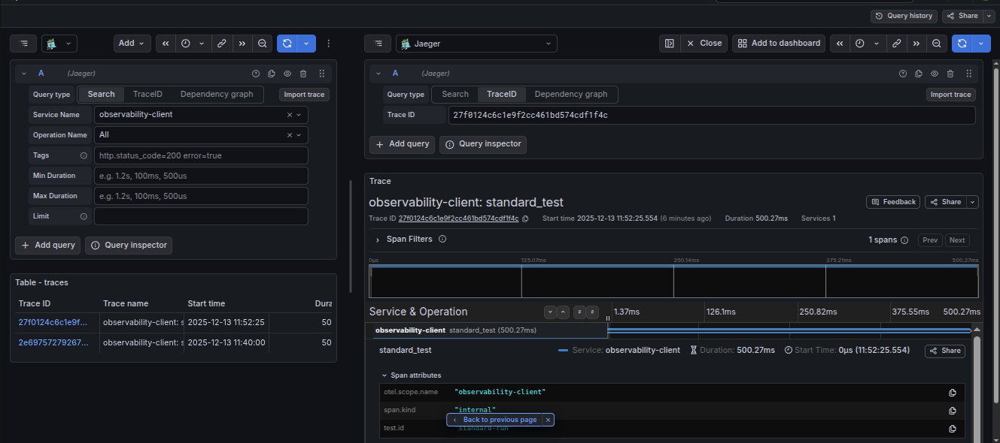
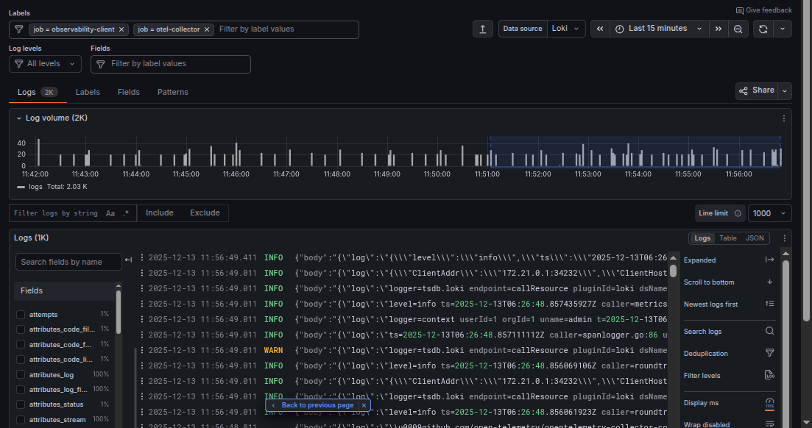

# Prometheus Metrics & Grafana

The SDK ships four pre-built Grafana dashboards and a Prometheus scrape pipeline. Everything is auto-provisioned inside the all-in-one container.

---

## Architecture

```
instrumentation-sdk
        │
        ▼
  FastAPI REST API ──► Tempo  (traces)
        │
        ▼
   Prometheus ──────► Grafana
  localhost:9090        localhost:3002
```

---

## Quick Start

```bash
llm-observe start
open http://localhost:3002   # admin / admin
```

Navigate to **Dashboards → LLM Observability** to see all four dashboards.

---

## Dashboards

### 1. LLM Latency & TTFT
`http://localhost:3002/d/llm-latency-ttft-dashboard`

| Panel | What it shows |
|---|---|
| Latency Percentiles (p50/p95/p99) | End-to-end call latency by model |
| TTFT Percentiles | Time to first token for streaming |
| Avg Latency vs Avg TTFT | Bar chart comparison per model |

### 2. LLM Cost Dashboard
`http://localhost:3002/d/llm-cost-dashboard`

| Panel | What it shows |
|---|---|
| Cumulative Cost Over Time | USD cost per service + model |
| Cost Distribution by Model | Donut chart |
| Cost Distribution by Service | Horizontal bar chart |

### 3. LLM Error & Retry
`http://localhost:3002/d/llm-error-retry-dashboard`

| Panel | What it shows |
|---|---|
| Success vs Error Rate | Stacked time series |
| Finish Reason Distribution | `stop`, `length`, `content_filter` |
| Retry Rate (%) | Gauge |

### 4. LLM Security & Safety
`http://localhost:3002/d/llm-security-safety-dashboard`

| Panel | What it shows |
|---|---|
| PII Detection Rate | Detections/sec by service |
| Injection Attempts Rate | Attempts/sec by service |
| Total Security Violations | Cumulative count |

---

## Screenshots


*Prometheus scraping LLM metrics every 5 seconds*


*Grafana Tempo showing distributed traces from LLM calls*


*Structured logs aggregated via Loki*

---

## Initialize the Metrics Pipeline

```bash
curl -X POST http://localhost:8002/v1/metrics/init \
  -H "Content-Type: application/json" \
  -d '{"port": 9464}'
```
```json
{"initialized": true, "message": "Metrics pipeline initialized"}
```

```bash
curl http://localhost:8002/v1/metrics/health
```
```json
{"initialized": true, "message": "Metrics pipeline is active"}
```

---

## Record a Span Manually

```bash
curl -X POST http://localhost:8002/v1/metrics/record \
  -H "Content-Type: application/json" \
  -d '{
    "model": "gpt-4o", "provider": "openai", "service_name": "chat-api",
    "prompt_tokens": 150, "completion_tokens": 80,
    "latency_ms_total": 420, "latency_ms_ttft": 95,
    "finish_reason": "stop", "status": "success",
    "pii_detected": false, "injection_attempt": false, "retry_count": 0
  }'
```
```json
{"recorded": true, "cost_usd_micro": 1950, "price_version": "2025-01-15"}
```

---

## Prometheus Metrics Reference

Scraped from `http://localhost:9464/metrics` every 5 seconds.

| Metric | Type | Labels |
|---|---|---|
| `llm_tokens_total` | Counter | `model`, `provider`, `service_name`, `token_type` |
| `llm_cost_usd_micro_total` | Counter | `model`, `provider`, `service_name` |
| `llm_latency_ms_total` | Histogram | `model`, `provider`, `service_name` |
| `llm_latency_ms_ttft` | Histogram | `model`, `provider`, `service_name` |
| `llm_pii_detected_total` | Counter | `service_name` |
| `llm_injection_attempts_total` | Counter | `service_name` |
| `llm_finish_reason_total` | Counter | `model`, `provider`, `service_name`, `finish_reason` |
| `llm_spans_total` | Counter | `model`, `provider`, `service_name`, `status`, `has_retries` |

---

## Add a New Model Price

Edit `config/model_prices.yaml`:

```yaml
- model: gpt-5
  provider: openai
  input_price_per_1m: 10.00
  output_price_per_1m: 30.00
  version: "2026-01-01"
```

Then restart:
```bash
docker restart instrumentation-sdk-api
```

---

## Dashboard Hot-Reload

| File changed | Action |
|---|---|
| `config/model_prices.yaml` | Restart container |
| `config/patterns.yaml` | Restart container |
| `build/dashboards/*.json` | Auto hot-reloaded ✅ (every 30s) |

---

## Next: [REST Management API](../reference/REST-Management-API.md)
