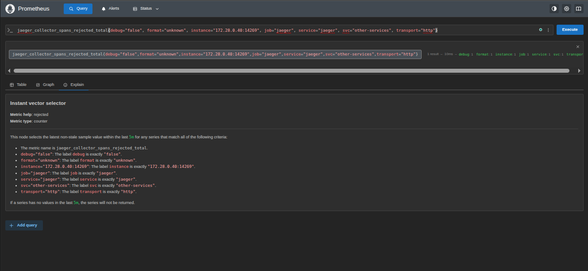

# Installation & Quick Start

Get your first span captured in under 5 minutes.

---

## Install

```bash
pip install instrumentation-sdk
```

---

## How It Fits Together

```
pip install instrumentation-sdk
         │
         ▼
Your Python App
  + one line: init_auto_instrumentation()
         │
         ▼
  instrumentation-sdk
         │
    ┌────┴────┐
    ▼         ▼
  API        Grafana
localhost:8002  localhost:3002
```

---

## Option A — Auto-Instrumentation (Zero Code Changes)

Drop this at the top of your app. Every OpenAI / Anthropic / LiteLLM / LangChain call is tracked automatically.

```python
from instrumentation_sdk import init_auto_instrumentation

init_auto_instrumentation()  # call once, at startup

# From here, all LLM calls are tracked — no other changes needed
import openai
client = openai.AsyncOpenAI()
response = await client.chat.completions.create(
    model="gpt-4o",
    messages=[{"role": "user", "content": "Hello!"}]
)
```

!!! tip "Best for"
    Existing apps where you don't want to change any LLM call code.

---

## Option B — Manual Span (Decorator)

```python
from instrumentation_sdk import llm_observe

@llm_observe(service="my-app", endpoint="chat")
async def ask_llm(prompt: str):
    # your existing LLM code here
    return response
```

!!! tip "Best for"
    When you want to tag specific functions with a service name and endpoint.

---

## Option C — Manual Span (Context Manager)

```python
from instrumentation_sdk import llm_span

async with llm_span(model="gpt-4o", provider="openai") as span:
    response = await client.chat.completions.create(...)
    span.set_metadata("prompt_tokens", response.usage.prompt_tokens)
```

!!! tip "Best for"
    When you need to attach token counts or custom metadata from the actual response.

---

## Start the Observability Stack

```bash
llm-observe start
```

This launches the all-in-one container:

| Service | URL |
|---|---|
| FastAPI REST API | `http://localhost:8002` |
| Grafana Dashboards | `http://localhost:3002` |
| Prometheus | `http://localhost:9090` |
| OTLP / Tempo | `localhost:4317` |

---

## Verify It's Working

### 1. Trigger a test span

```bash
curl -X POST http://localhost:8002/v1/instrumentation/test-call \
  -H "Content-Type: application/json" \
  -d '{"method": "httpx", "provider": "openai"}'
```

Expected response:
```json
{"success": true, "message": "Test call triggered via httpx for openai"}
```

### 2. Check Grafana

Open `http://localhost:3002` → **LLM Observability** folder → pick any dashboard.
Spans appear within **5–10 seconds**.


*Grafana showing LLM latency, token usage and cost metrics*

---

## Supported LLM Providers

| Provider | Client | What's patched |
|---|---|---|
| OpenAI | `openai.AsyncOpenAI` / `openai.OpenAI` | `chat.completions.create` |
| Anthropic | `anthropic.AsyncAnthropic` / `anthropic.Anthropic` | `messages.create` |
| LiteLLM | `litellm` module | `acompletion` / `completion` |
| LangChain | Any `BaseChatModel` subclass | `ainvoke` / `invoke` |
| Generic HTTP | `httpx`, `requests` | Any call matching known LLM URLs |

---

## Next Steps

- [Auto-Instrumentation](../instrumentation/Auto-Instrumentation.md) — detailed provider config
- [Manual Spans — Context Manager](../instrumentation/Manual-Spans-Context-Manager.md) — set metadata mid-call
- [Docker & CLI Deployment](../reference/Docker-and-CLI-Deployment.md) — production deployment
