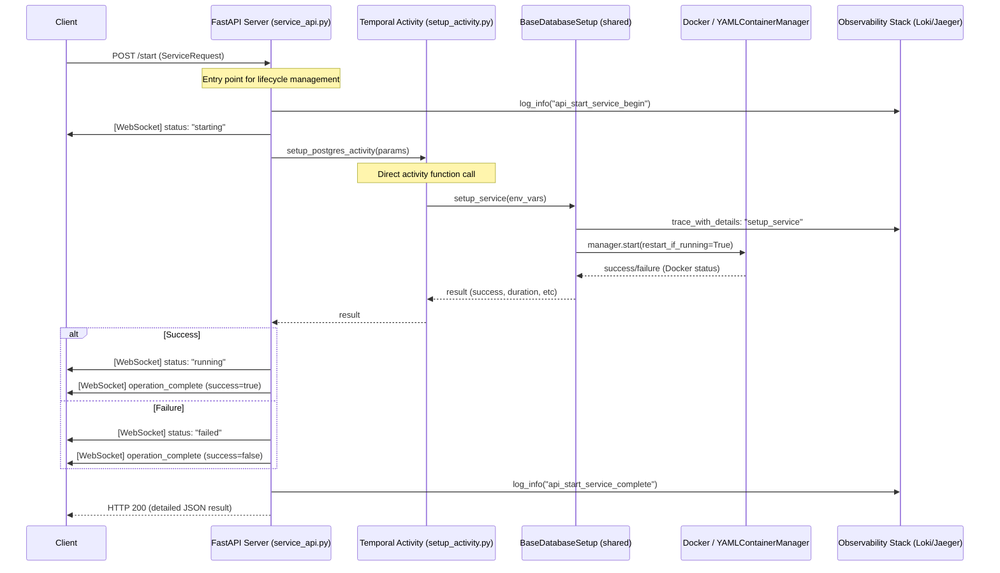

# Service Management API Documentation

This document explains how the centralized Service Management API Layer works and how to get started with it.

## Overview

The Service Management API Layer provides a standardized way to manage the lifecycle of database and messaging services within the LLM Observability Platform. It abstracts the complexity of Temporal activities and Docker Compose commands into simple RESTful endpoints and real-time WebSocket updates.

## Architecture & Workflow

The following sequence diagram illustrates the end-to-end flow when a client requests to start a service (e.g., PostgreSQL).



### Key Components

1.  **FastAPI Service**: Each service (e.g., `postgres`, `kafka`) runs its own FastAPI instance.
2.  **Shared Base (`base_service_api.py`)**: Centralizes logic for WebSockets, container status inspection, and batch operations.
3.  **ConnectionManager**: Manages active WebSocket connections for real-time status broadcasting.
4.  **Observability Integration**: Automatically logs events and records traces via `ObservabilityClient`.

## Getting Started

### 1. Prerequisites
Ensure you have the environment set up and Docker running.

### 2. Starting a Service API
You can start any individual service API server. For example, to start the PostgreSQL management API:

```bash
cd /home/btpl-lap-22/prod/llm-observability-platform
python3 infrastructure/database/postgres/api/service_api.py
```

By default, each service is assigned a unique port (Postgres: 8100, MongoDB: 8101, etc.).

### 3. Making Requests

#### Check Service Status
```bash
curl http://localhost:8100/status
```

#### Start Service
```bash
curl -X POST http://localhost:8100/start -H "Content-Type: application/json" -d '{"env_vars": {"CUSTOM_KEY": "value"}}'
```

#### Get List of All Database Services
```bash
curl http://localhost:8100/services
```

### 4. Real-time Status via WebSockets
Connect to the WebSocket endpoint to receive live updates during operations.

**Endpoint:** `ws://localhost:8100/ws/status`

**Example WebSocket Client (JS):**
```javascript
const socket = new WebSocket('ws://localhost:8100/ws/status');
socket.onmessage = (event) => {
    const data = JSON.parse(event.data);
    console.log("Received status update:", data);
};
```

## API Endpoint Reference

| Method | Path | Description |
| :--- | :--- | :--- |
| `POST` | `/start` | Starts the service. Accepts optional `env_vars`. |
| `POST` | `/stop` | Stops the service. Accepts optional `env_vars`. |
| `GET` | `/status` | Returns the current real-time container status. |
| `POST` | `/start-batch` | Starts multiple services (requires `services` list). |
| `POST` | `/stop-batch` | Stops multiple services (requires `services` list). |
| `GET` | `/services` | Lists all available database services and their configurations. |
| `WS` | `/ws/status` | WebSocket endpoint for real-time operation streaming. |

## Observability & Logging
All API actions are logged with `api_*` prefixes in Loki. You can search for `api_start_service_begin` or `api_stop_service_complete` to audit service lifecycle changes.
