# Database Query Monitoring API Documentation

## 📊 Overview

This document provides comprehensive API documentation for the database query monitoring system supporting 6 databases: MongoDB, Neo4j, PostgreSQL, Cassandra, Redis, and Qdrant.

## 🏗️ Architecture Flow

```mermaid
graph TB
    Client[Client Application] --> API[FastAPI Gateway]
    
    API --> MongoDB[MongoDB Monitoring]
    API --> Neo4j[Neo4j Monitoring]
    API --> PostgreSQL[PostgreSQL Monitoring]
    API --> Cassandra[Cassandra Monitoring]
    API --> Redis[Redis Monitoring]
    API --> Qdrant[Qdrant Monitoring]
    API --> Shared[Shared Analyzer API]
    
    MongoDB --> Collector1[Query Collector]
    MongoDB --> Analyzer1[Query Analyzer]
    MongoDB --> Exporter1[Metrics Exporter]
    MongoDB --> Client1[Monitoring Client]
    
    Neo4j --> Collector2[Query Collector]
    Neo4j --> Analyzer2[Query Analyzer]
    Neo4j --> Exporter2[Metrics Exporter]
    Neo4j --> Client2[Monitoring Client]
    
    PostgreSQL --> Collector3[Query Collector]
    PostgreSQL --> Analyzer3[Query Analyzer]
    PostgreSQL --> Exporter3[Metrics Exporter]
    PostgreSQL --> Client3[Monitoring Client]
    
    Cassandra --> Collector4[Query Collector]
    Cassandra --> Analyzer4[Query Analyzer]
    Cassandra --> Exporter4[Metrics Exporter]
    Cassandra --> Client4[Monitoring Client]
    
    Redis --> Collector5[Query Collector]
    Redis --> Analyzer5[Query Analyzer]
    Redis --> Exporter5[Metrics Exporter]
    Redis --> Client5[Monitoring Client]
    
    Qdrant --> Collector6[Query Collector]
    Qdrant --> Analyzer6[Query Analyzer]
    Qdrant --> Exporter6[Metrics Exporter]
    Qdrant --> Client6[Monitoring Client]
    
    Collector1 --> Metrics[Prometheus/JSON Metrics]
    Collector2 --> Metrics
    Collector3 --> Metrics
    Collector4 --> Metrics
    Collector5 --> Metrics
    Collector6 --> Metrics
    
    Shared --> CrossDB[Cross-Database Analysis]
    Shared --> Comparison[Performance Comparison]
    Shared --> Health[Health Overview]
    Shared --> Aggregation[Metrics Aggregation]
```



## 📋 Database Schema Tables

### MongoDB Tables
```sql
-- Query Metrics Collection
db.query_metrics {
  _id: ObjectId,
  query_hash: String,
  query_type: String,
  database: String,
  collection: String,
  execution_time_ms: Number,
  status: String,
  performance_level: String,
  timestamp: Date,
  affected_rows: Number,
  error_message: String,
  plan_details: Object
}

-- Performance Reports
db.performance_reports {
  _id: ObjectId,
  database: String,
  period_start: Date,
  period_end: Date,
  total_queries: Number,
  slow_queries: Number,
  avg_execution_time_ms: Number,
  performance_distribution: Object,
  top_slow_queries: Array,
  recommendations: Array,
  created_at: Date
}
```

### Neo4j Tables
```cypher
// Query Metrics Nodes
(:QueryMetric {
  query_hash: String,
  query_type: String,
  database: String,
  execution_time_ms: Float,
  status: String,
  performance_level: String,
  timestamp: DateTime,
  affected_rows: Integer,
  error_message: String
})

// Performance Analysis Relationships
(:QueryMetric)-[:HAS_PERFORMANCE]->(:PerformanceLevel {
  level: String,
  score: Float
})

(:QueryMetric)-[:BELONGS_TO]->(:Database {
  name: String,
  type: String
})
```

### PostgreSQL Tables
```sql
-- Query Metrics Table
CREATE TABLE query_metrics (
  id SERIAL PRIMARY KEY,
  query_hash VARCHAR(255) NOT NULL,
  query_type VARCHAR(50) NOT NULL,
  database VARCHAR(100) NOT NULL,
  table_name VARCHAR(100),
  execution_time_ms DECIMAL(10,2) NOT NULL,
  status VARCHAR(20) NOT NULL,
  performance_level VARCHAR(20) NOT NULL,
  timestamp TIMESTAMP WITH TIME ZONE DEFAULT NOW(),
  affected_rows INTEGER,
  error_message TEXT,
  plan_details JSONB
);

-- Performance Reports Table
CREATE TABLE performance_reports (
  id SERIAL PRIMARY KEY,
  database VARCHAR(100) NOT NULL,
  period_start TIMESTAMP WITH TIME ZONE NOT NULL,
  period_end TIMESTAMP WITH TIME ZONE NOT NULL,
  total_queries INTEGER NOT NULL,
  slow_queries INTEGER NOT NULL,
  avg_execution_time_ms DECIMAL(10,2) NOT NULL,
  performance_distribution JSONB NOT NULL,
  top_slow_queries JSONB NOT NULL,
  recommendations TEXT[],
  created_at TIMESTAMP WITH TIME ZONE DEFAULT NOW()
);
```

### Cassandra Tables
```cql
-- Query Metrics Table
CREATE TABLE query_metrics (
  query_hash text PRIMARY KEY,
  query_type text,
  database text,
  table_name text,
  execution_time_ms decimal,
  status text,
  performance_level text,
  timestamp timestamp,
  affected_rows bigint,
  error_message text,
  plan_details text
) WITH CLUSTERING ORDER BY (timestamp DESC);

-- Performance Reports Table
CREATE TABLE performance_reports (
  id uuid PRIMARY KEY,
  database text,
  period_start timestamp,
  period_end timestamp,
  total_queries bigint,
  slow_queries bigint,
  avg_execution_time_ms decimal,
  performance_distribution text,
  top_slow_queries text,
  recommendations list<text>,
  created_at timestamp
);
```

### Redis Data Structures
```redis
# Query Metrics (Hash)
HMSET query_metrics:{query_hash}
  query_type "GET"
  database "redis"
  execution_time_ms 45.5
  status "SUCCESS"
  performance_level "FAST"
  timestamp "2026-05-06T16:13:00Z"
  affected_rows 1

# Performance Reports (Hash)
HMSET performance_reports:{report_id}
  database "redis"
  period_start "2026-05-05T16:13:00Z"
  period_end "2026-05-06T16:13:00Z"
  total_queries 1500
  slow_queries 5
  avg_execution_time_ms 25.3

# Slow Queries List (Sorted by execution time)
ZADD slow_queries 1500.0 "query_hash_1"
ZADD slow_queries 1200.0 "query_hash_2"
```

### Qdrant Collections
```json
// Query Metrics Collection
{
  "name": "query_metrics",
  "vectors": {
    "size": 128,
    "distance": "Cosine"
  },
  "payload_schema": {
    "query_hash": "keyword",
    "query_type": "keyword", 
    "database": "keyword",
    "execution_time_ms": "float",
    "status": "keyword",
    "performance_level": "keyword",
    "timestamp": "datetime",
    "affected_rows": "integer"
  }
}

// Performance Reports Collection
{
  "name": "performance_reports", 
  "vectors": {
    "size": 64,
    "distance": "Euclidean"
  },
  "payload_schema": {
    "database": "keyword",
    "period_start": "datetime",
    "period_end": "datetime",
    "total_queries": "integer",
    "slow_queries": "integer",
    "avg_execution_time_ms": "float"
  }
}
```

---

## 🔗 API Endpoints Documentation

### 📊 MongoDB API (15 Endpoints)

#### Query Execution & Monitoring
```http
POST /mongodb/queries/execute
Content-Type: application/json

{
  "query": "db.users.find({status: 'active'})",
  "params": {},
  "collection": "users"
}
```

```http
GET /mongodb/queries/slow?threshold_ms=1000&limit=50
```

```http
GET /mongodb/queries/performance?period_minutes=60
```

#### Query Analysis
```http
POST /mongodb/queries/analyze
Content-Type: application/json

{
  "query": "db.users.find({status: 'active'})",
  "database": "scaibu_default"
}
```

```http
GET /mongodb/queries/explain?query=db.users.find({status: 'active'})&database=scaibu_default
```

```http
POST /mongodb/queries/indexes/suggest
Content-Type: application/json

{
  "query": "db.users.find({email: 'test@example.com'})",
  "database": "scaibu_default"
}
```

#### Performance Reports
```http
POST /mongodb/queries/reports/performance
Content-Type: application/json

{
  "database": "scaibu_default",
  "period_hours": 24
}
```

#### Health & Issues
```http
GET /mongodb/queries/issues
```

```http
GET /mongodb/queries/analysis/slow?hours=24
```

```http
GET /mongodb/queries/health
```

#### Metrics & Export
```http
GET /mongodb/queries/metrics
```

```http
GET /mongodb/queries/metrics/json
```

#### Collection-Specific
```http
GET /mongodb/queries/collections/{collection_name}/performance?period_minutes=60
```

```http
GET /mongodb/queries/schema/analysis
```

```http
GET /mongodb/queries/schema/info?database=scaibu_default
```

```http
GET /mongodb/queries/plan/analysis?query=db.users.find({status: 'active'})&database=scaibu_default
```

---

### 🕸️ Neo4j API (17 Endpoints)

#### Query Execution & Monitoring
```http
POST /neo4j/queries/execute
Content-Type: application/json

{
  "query": "MATCH (u:User) WHERE u.status = 'active' RETURN u",
  "params": {}
}
```

```http
GET /neo4j/queries/slow?threshold_ms=1000&limit=50
```

```http
GET /neo4j/queries/performance?period_minutes=60
```

#### Query Analysis
```http
POST /neo4j/queries/analyze
Content-Type: application/json

{
  "query": "MATCH (u:User) WHERE u.status = 'active' RETURN u",
  "database": "neo4j"
}
```

```http
GET /neo4j/queries/explain?query=MATCH(u:User)WHERE u.status='active' RETURN u&database=neo4j
```

```http
POST /neo4j/queries/indexes/suggest
Content-Type: application/json

{
  "query": "MATCH (u:User) WHERE u.email = 'test@example.com' RETURN u",
  "database": "neo4j"
}
```

#### Performance Reports
```http
POST /neo4j/queries/reports/performance
Content-Type: application/json

{
  "database": "neo4j",
  "period_hours": 24
}
```

#### Health & Issues
```http
GET /neo4j/queries/issues
```

```http
GET /neo4j/queries/analysis/slow?hours=24
```

```http
GET /neo4j/queries/health
```

#### Metrics & Export
```http
GET /neo4j/queries/metrics
```

```http
GET /neo4j/queries/metrics/json
```

#### Graph-Specific
```http
GET /neo4j/queries/graph/performance?period_minutes=60
```

```http
GET /neo4j/queries/relationships/analysis
```

```http
GET /neo4j/queries/schema/analysis
```

```http
GET /neo4j/queries/schema/info?database=neo4j
```

```http
GET /neo4j/queries/plan/analysis?query=MATCH(u:User)WHERE u.status='active' RETURN u&database=neo4j
```

```http
GET /neo4j/queries/index-gaps
```

---

### 🐘 PostgreSQL API (15 Endpoints)

#### Query Execution & Monitoring
```http
POST /postgres/queries/execute
Content-Type: application/json

{
  "query": "SELECT * FROM users WHERE status = 'active'",
  "params": {}
}
```

```http
GET /postgres/queries/slow?threshold_ms=1000&limit=50
```

```http
GET /postgres/queries/performance?period_minutes=60
```

#### Query Analysis
```http
POST /postgres/queries/analyze
Content-Type: application/json

{
  "query": "SELECT * FROM users WHERE status = 'active'",
  "database": "scaibu_default"
}
```

```http
GET /postgres/queries/explain?query=SELECT * FROM users WHERE status = 'active'&database=scaibu_default
```

```http
POST /postgres/queries/indexes/suggest
Content-Type: application/json

{
  "query": "SELECT * FROM users WHERE email = 'test@example.com'",
  "database": "scaibu_default"
}
```

#### Performance Reports
```http
POST /postgres/queries/reports/performance
Content-Type: application/json

{
  "database": "scaibu_default",
  "period_hours": 24
}
```

#### Health & Issues
```http
GET /postgres/queries/issues
```

```http
GET /postgres/queries/analysis/slow?hours=24
```

```http
GET /postgres/queries/health
```

#### Metrics & Export
```http
GET /postgres/queries/metrics
```

```http
GET /postgres/queries/metrics/json
```

#### Table-Specific
```http
GET /postgres/queries/tables/{table_name}/performance?period_minutes=60
```

```http
GET /postgres/queries/schema/analysis
```

```http
GET /postgres/queries/schema/info?database=scaibu_default
```

```http
GET /postgres/queries/plan/analysis?query=SELECT * FROM users WHERE status = 'active'&database=scaibu_default
```

---

### 🔮 Cassandra API (18 Endpoints)

#### Query Execution & Monitoring
```http
POST /cassandra/queries/execute
Content-Type: application/json

{
  "query": "SELECT * FROM users WHERE status = 'active'",
  "params": {},
  "consistency_level": "QUORUM"
}
```

```http
GET /cassandra/queries/slow?threshold_ms=1000&limit=50
```

```http
GET /cassandra/queries/performance?period_minutes=60
```

#### Query Analysis
```http
POST /cassandra/queries/analyze
Content-Type: application/json

{
  "query": "SELECT * FROM users WHERE status = 'active'",
  "database": "cassandra",
  "keyspace": "scaibu_default"
}
```

```http
GET /cassandra/queries/explain?query=SELECT * FROM users WHERE status = 'active'&database=cassandra&keyspace=scaibu_default
```

```http
POST /cassandra/queries/indexes/suggest
Content-Type: application/json

{
  "query": "SELECT * FROM users WHERE email = 'test@example.com'",
  "database": "cassandra",
  "keyspace": "scaibu_default"
}
```

#### Performance Reports
```http
POST /cassandra/queries/reports/performance
Content-Type: application/json

{
  "database": "cassandra",
  "keyspace": "scaibu_default",
  "period_hours": 24
}
```

#### Health & Issues
```http
GET /cassandra/queries/issues
```

```http
GET /cassandra/queries/analysis/slow?hours=24
```

```http
GET /cassandra/queries/health
```

#### Metrics & Export
```http
GET /cassandra/queries/metrics
```

```http
GET /cassandra/queries/metrics/json
```

#### Table-Specific
```http
GET /cassandra/queries/tables/{table_name}/performance?period_minutes=60
```

```http
GET /cassandra/queries/schema/analysis
```

```http
GET /cassandra/queries/schema/info?database=cassandra&keyspace=scaibu_default
```

```http
GET /cassandra/queries/plan/analysis?query=SELECT * FROM users WHERE status = 'active'&database=cassandra&keyspace=scaibu_default
```

#### Cassandra-Specific
```http
GET /cassandra/queries/keyspaces/{keyspace}/performance?period_minutes=60
```

```http
GET /cassandra/queries/index-gaps
```

```http
GET /cassandra/queries/consistency/performance?period_minutes=60
```

---

### 🔴 Redis API (19 Endpoints)

#### Query Execution & Monitoring
```http
POST /redis/queries/execute
Content-Type: application/json

{
  "query": "GET user:123",
  "params": {}
}
```

```http
GET /redis/queries/slow?threshold_ms=1000&limit=50
```

```http
GET /redis/queries/performance?period_minutes=60
```

#### Query Analysis
```http
POST /redis/queries/analyze
Content-Type: application/json

{
  "query": "GET user:123",
  "database": "redis"
}
```

```http
GET /redis/queries/explain?query=GET user:123&database=redis
```

```http
POST /redis/queries/indexes/suggest
Content-Type: application/json

{
  "query": "GET user:123",
  "database": "redis"
}
```

#### Performance Reports
```http
POST /redis/queries/reports/performance
Content-Type: application/json

{
  "database": "redis",
  "period_hours": 24
}
```

#### Health & Issues
```http
GET /redis/queries/issues
```

```http
GET /redis/queries/analysis/slow?hours=24
```

```http
GET /redis/queries/health
```

#### Metrics & Export
```http
GET /redis/queries/metrics
```

```http
GET /redis/queries/metrics/json
```

#### Key-Specific
```http
GET /redis/queries/keys/analysis?pattern=user:*
```

```http
GET /redis/queries/schema/analysis
```

```http
GET /redis/queries/schema/info?database=redis
```

```http
GET /redis/queries/plan/analysis?query=GET user:123&database=redis
```

#### Redis-Specific
```http
GET /redis/queries/slow-log?limit=50
```

```http
GET /redis/queries/command-types/performance?period_minutes=60
```

```http
GET /redis/queries/memory/analysis
```

```http
GET /redis/queries/connections/analysis
```

```http
GET /redis/queries/data-structures/analysis
```

---

### 🎯 Qdrant API (20 Endpoints)

#### Query Execution & Monitoring
```http
POST /qdrant/queries/execute
Content-Type: application/json

{
  "query": "search collection_name",
  "params": {"vector_size": 128}
}
```

```http
GET /qdrant/queries/slow?threshold_ms=1000&limit=50
```

```http
GET /qdrant/queries/performance?period_minutes=60
```

#### Query Analysis
```http
POST /qdrant/queries/analyze
Content-Type: application/json

{
  "query": "search collection_name",
  "database": "qdrant"
}
```

```http
GET /qdrant/queries/explain?query=search collection_name&database=qdrant
```

```http
POST /qdrant/queries/indexes/suggest
Content-Type: application/json

{
  "query": "search collection_name",
  "database": "qdrant"
}
```

#### Performance Reports
```http
POST /qdrant/queries/reports/performance
Content-Type: application/json

{
  "database": "qdrant",
  "period_hours": 24
}
```

#### Health & Issues
```http
GET /qdrant/queries/issues
```

```http
GET /qdrant/queries/analysis/slow?hours=24
```

```http
GET /qdrant/queries/health
```

#### Metrics & Export
```http
GET /qdrant/queries/metrics
```

```http
GET /qdrant/queries/metrics/json
```

#### Collection-Specific
```http
GET /qdrant/queries/collections/{collection_name}/performance?period_minutes=60
```

```http
GET /qdrant/queries/schema/analysis
```

```http
GET /qdrant/queries/schema/info?database=qdrant
```

```http
GET /qdrant/queries/plan/analysis?query=search collection_name&database=qdrant
```

#### Qdrant-Specific
```http
GET /qdrant/queries/hnsw/analysis?collection_name=test_collection
```

```http
GET /qdrant/queries/vector/performance?collection_name=test_collection
```

```http
GET /qdrant/queries/operation-types/performance?period_minutes=60
```

```http
GET /qdrant/queries/collections/overview
```

```http
GET /qdrant/queries/embedding/performance?collection_name=test_collection
```

```http
GET /qdrant/queries/quantization/analysis?collection_name=test_collection
```

---

### 🔄 Shared Analyzer API (5 Cross-Database Endpoints)

#### Cross-Database Analysis
```http
POST /shared/analyzer/cross-database/analyze
Content-Type: application/json

{
  "query": "SELECT * FROM users WHERE status = 'active'",
  "databases": ["mongodb", "postgres", "cassandra", "redis", "qdrant"]
}
```

#### Performance Comparison
```http
POST /shared/analyzer/performance/comparison
Content-Type: application/json

{
  "databases": ["mongodb", "postgres", "cassandra", "redis", "qdrant"],
  "period_hours": 24
}
```

#### Optimization Report
```http
POST /shared/analyzer/optimization/report
Content-Type: application/json

{
  "databases": ["mongodb", "postgres", "cassandra", "redis", "qdrant"]
}
```

#### Health Overview
```http
GET /shared/analyzer/health/overview
```

#### Aggregated Metrics
```http
GET /shared/analyzer/metrics/aggregated?period_minutes=60
```

---

## 🚀 Usage Examples

### Example 1: Complete Query Monitoring Flow
```bash
# 1. Execute query with monitoring
curl -X POST "http://localhost:8000/mongodb/queries/execute" \
  -H "Content-Type: application/json" \
  -d '{"query": "db.users.find({status: \"active\"})", "collection": "users"}'

# 2. Get slow queries
curl "http://localhost:8000/mongodb/queries/slow?threshold_ms=1000&limit=10"

# 3. Analyze query performance
curl -X POST "http://localhost:8000/mongodb/queries/analyze" \
  -H "Content-Type: application/json" \
  -d '{"query": "db.users.find({status: \"active\"})", "database": "scaibu_default"}'

# 4. Get performance report
curl -X POST "http://localhost:8000/mongodb/queries/reports/performance" \
  -H "Content-Type: application/json" \
  -d '{"database": "scaibu_default", "period_hours": 24}'
```

### Example 2: Cross-Database Analysis
```bash
# Compare query performance across databases
curl -X POST "http://localhost:8000/shared/analyzer/performance/comparison" \
  -H "Content-Type: application/json" \
  -d '{"databases": ["mongodb", "postgres", "cassandra", "redis", "qdrant"], "period_hours": 24}'

# Get health overview
curl "http://localhost:8000/shared/analyzer/health/overview"

# Get aggregated metrics
curl "http://localhost:8000/shared/analyzer/metrics/aggregated?period_minutes=60"
```

### Example 3: Database-Specific Analysis
```bash
# Redis key analysis
curl "http://localhost:8000/redis/queries/keys/analysis?pattern=user:*"

# Qdrant HNSW analysis
curl "http://localhost:8000/qdrant/queries/hnsw/analysis?collection_name=test_collection"

# Cassandra keyspace performance
curl "http://localhost:8000/cassandra/queries/keyspaces/scaibu_default/performance?period_minutes=60"

# Neo4j graph performance
curl "http://localhost:8000/neo4j/queries/graph/performance?period_minutes=60"
```

---

## 📊 Response Formats

### Standard Success Response
```json
{
  "success": true,
  "data": {
    // Response data specific to endpoint
  },
  "timestamp": "2026-05-06T16:13:00.000Z"
}
```

### Standard Error Response
```json
{
  "success": false,
  "error": "Error description",
  "timestamp": "2026-05-06T16:13:00.000Z"
}
```

### Query Execution Response
```json
{
  "success": true,
  "data": {
    "result": [...],
    "execution_time_ms": 45.5,
    "performance_level": "FAST",
    "query_hash": "abc123",
    "affected_rows": 10
  },
  "timestamp": "2026-05-06T16:13:00.000Z"
}
```

### Performance Analysis Response
```json
{
  "success": true,
  "data": {
    "query_hash": "abc123",
    "query_text": "SELECT * FROM users",
    "performance_score": 85.5,
    "recommendations": [
      "Consider adding index on status column"
    ],
    "suggested_indexes": [
      {
        "type": "btree",
        "table": "users",
        "columns": ["status"]
      }
    ],
    "optimization_potential": "medium",
    "estimated_improvement_percent": 25.0
  },
  "timestamp": "2026-05-06T16:13:00.000Z"
}
```

---

## 🔧 Configuration

### Environment Variables
```bash
# Database Connections
MONGODB_URI=mongodb://localhost:27017
NEO4J_URI=bolt://localhost:7687
POSTGRES_URI=postgresql://localhost:5432/scaibu_default
CASSANDRA_HOST=localhost
CASSANDRA_PORT=9042
REDIS_HOST=localhost
REDIS_PORT=6379
QDRANT_HOST=localhost
QDRANT_PORT=6333

# Monitoring Configuration
SLOW_QUERY_THRESHOLD_MS=1000
QUERY_HISTORY_SIZE=10000
METRICS_EXPORT_INTERVAL_SECONDS=30
HEALTH_CHECK_INTERVAL_SECONDS=60
```

### Docker Compose Setup
```yaml
version: '3.8'
services:
  mongodb:
    image: mongo:6.0
    ports:
      - "27017:27017"
    environment:
      MONGO_INITDB_ROOT_USERNAME: admin
      MONGO_INITDB_ROOT_PASSWORD: password

  neo4j:
    image: neo4j:5.0
    ports:
      - "7474:7474"
      - "7687:7687"
    environment:
      NEO4J_AUTH: neo4j/password
      NEO4J_PLUGINS: '["apoc"]'

  postgres:
    image: postgres:15
    ports:
      - "5432:5432"
    environment:
      POSTGRES_DB: scaibu_default
      POSTGRES_USER: postgres
      POSTGRES_PASSWORD: password

  cassandra:
    image: cassandra:4.0
    ports:
      - "9042:9042"

  redis:
    image: redis:7
    ports:
      - "6379:6379"

  qdrant:
    image: qdrant/qdrant:latest
    ports:
      - "6333:6333"
      - "6334:6334"

  monitoring-api:
    build: .
    ports:
      - "8000:8000"
    depends_on:
      - mongodb
      - neo4j
      - postgres
      - cassandra
      - redis
      - qdrant
```

---

## 📈 Monitoring & Observability

### Prometheus Metrics
```prometheus
# MongoDB Query Metrics
mongodb_query_execution_time_ms_sum{database="scaibu_default"} 1500.5
mongodb_query_total{database="scaibu_default", status="success"} 1000
mongodb_slow_queries_total{database="scaibu_default"} 25

# Redis Command Metrics
redis_command_execution_time_ms_sum{command="GET"} 500.2
redis_commands_total{command="GET", status="success"} 500
redis_memory_usage_bytes{database="redis"} 104857600

# Qdrant Vector Search Metrics
qdrant_search_execution_time_ms_sum{collection="test_collection"} 1200.8
qdrant_search_total{collection="test_collection", status="success"} 200
qdrant_collection_points_count{collection="test_collection"} 50000
```

### Grafana Dashboard
```json
{
  "dashboard": {
    "title": "Database Query Monitoring",
    "panels": [
      {
        "title": "Query Execution Time",
        "type": "graph",
        "targets": [
          {
            "expr": "mongodb_query_execution_time_ms_sum",
            "legendFormat": "MongoDB"
          },
          {
            "expr": "redis_command_execution_time_ms_sum",
            "legendFormat": "Redis"
          },
          {
            "expr": "qdrant_search_execution_time_ms_sum",
            "legendFormat": "Qdrant"
          }
        ]
      },
      {
        "title": "Slow Queries",
        "type": "stat",
        "targets": [
          {
            "expr": "mongodb_slow_queries_total + redis_slow_queries_total + qdrant_slow_queries_total"
          }
        ]
      },
      {
        "title": "Database Health",
        "type": "table",
        "targets": [
          {
            "expr": "mongodb_health_score + redis_health_score + qdrant_health_score"
          }
        ]
      }
    ]
  }
}
```

---

## 🛡️ Security & Authentication

### API Key Authentication
```python
from fastapi import Depends, HTTPException, status
from fastapi.security import HTTPBearer

security = HTTPBearer()

async def verify_api_key(api_key: str = Depends(security)):
    if api_key.credentials != os.getenv("API_KEY"):
        raise HTTPException(
            status_code=status.HTTP_401_UNAUTHORIZED,
            detail="Invalid API Key"
        )
    return api_key.credentials

@router.post("/execute", dependencies=[Depends(verify_api_key)])
async def execute_query(request: QueryExecutionRequest):
    # Implementation
    pass
```

### Rate Limiting
```python
from slowapi import Limiter, _rate_limiter
from slowapi.util import get_remote_address

limiter = Limiter(key_func=get_remote_address)

@router.get("/slow", dependencies=[limiter.limit("100/minute")])
async def get_slow_queries():
    # Implementation
    pass
```

---

## 📚 Integration Examples

### Python Client
```python
import requests
from typing import Dict, Any

class DatabaseMonitoringClient:
    def __init__(self, base_url: str, api_key: str):
        self.base_url = base_url
        self.headers = {"Authorization": f"Bearer {api_key}"}
    
    def execute_query(self, database: str, query: str, **kwargs) -> Dict[str, Any]:
        url = f"{self.base_url}/{database}/queries/execute"
        payload = {"query": query, **kwargs}
        
        response = requests.post(url, json=payload, headers=self.headers)
        return response.json()
    
    def get_performance_summary(self, database: str, period_minutes: int = 60) -> Dict[str, Any]:
        url = f"{self.base_url}/{database}/queries/performance"
        params = {"period_minutes": period_minutes}
        
        response = requests.get(url, params=params, headers=self.headers)
        return response.json()
    
    def cross_database_analysis(self, query: str, databases: List[str]) -> Dict[str, Any]:
        url = f"{self.base_url}/shared/analyzer/cross-database/analyze"
        payload = {"query": query, "databases": databases}
        
        response = requests.post(url, json=payload, headers=self.headers)
        return response.json()

# Usage
client = DatabaseMonitoringClient("http://localhost:8000", "your-api-key")

# Execute query
result = client.execute_query("mongodb", "db.users.find({status: 'active'})")

# Get performance summary
summary = client.get_performance_summary("mongodb", period_minutes=60)

# Cross-database analysis
analysis = client.cross_database_analysis(
    "SELECT * FROM users WHERE status = 'active'",
    ["mongodb", "postgres", "cassandra"]
)
```

### JavaScript Client
```javascript
class DatabaseMonitoringClient {
    constructor(baseUrl, apiKey) {
        this.baseUrl = baseUrl;
        this.headers = {
            'Authorization': `Bearer ${apiKey}`,
            'Content-Type': 'application/json'
        };
    }

    async executeQuery(database, query, params = {}) {
        const url = `${this.baseUrl}/${database}/queries/execute`;
        const payload = { query, ...params };

        const response = await fetch(url, {
            method: 'POST',
            headers: this.headers,
            body: JSON.stringify(payload)
        });

        return response.json();
    }

    async getPerformanceSummary(database, periodMinutes = 60) {
        const url = `${this.baseUrl}/${database}/queries/performance?period_minutes=${periodMinutes}`;
        
        const response = await fetch(url, { headers: this.headers });
        return response.json();
    }

    async crossDatabaseAnalysis(query, databases) {
        const url = `${this.baseUrl}/shared/analyzer/cross-database/analyze`;
        const payload = { query, databases };

        const response = await fetch(url, {
            method: 'POST',
            headers: this.headers,
            body: JSON.stringify(payload)
        });

        return response.json();
    }
}

// Usage
const client = new DatabaseMonitoringClient('http://localhost:8000', 'your-api-key');

// Execute query
const result = await client.executeQuery('mongodb', 'db.users.find({status: "active"})');

// Get performance summary
const summary = await client.getPerformanceSummary('mongodb', 60);

// Cross-database analysis
const analysis = await client.crossDatabaseAnalysis(
    'SELECT * FROM users WHERE status = "active"',
    ['mongodb', 'postgres', 'cassandra', 'redis', 'qdrant']
);
```

This comprehensive documentation provides complete API specifications, database schemas, usage examples, and integration guides for all 6 databases with their respective endpoints.
