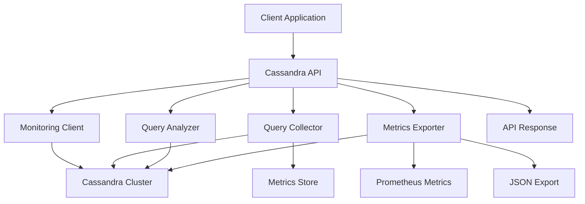

# Cassandra Query Monitoring API Guide

## 📊 Overview

Cassandra query monitoring provides comprehensive performance tracking, analysis, and optimization recommendations for Apache Cassandra CQL queries and distributed database operations.

## 🏗️ Architecture Flow



## 📋 Database Schema

### Cassandra Tables for Monitoring
```cql
-- Query Metrics Table
CREATE TABLE query_metrics (
  query_hash text PRIMARY KEY,
  query_type text,
  database text,
  keyspace_name text,
  table_name text,
  execution_time_ms decimal,
  status text,
  performance_level text,
  timestamp timestamp,
  affected_rows bigint,
  error_message text,
  plan_details text,
  consistency_level text
) WITH CLUSTERING ORDER BY (timestamp DESC);

-- Performance Reports Table
CREATE TABLE performance_reports (
  id uuid PRIMARY KEY,
  database text,
  keyspace_name text,
  period_start timestamp,
  period_end timestamp,
  total_queries bigint,
  slow_queries bigint,
  avg_execution_time_ms decimal,
  performance_distribution text,
  top_slow_queries text,
  recommendations list<text>,
  created_at timestamp
);

-- Index Analysis Table
CREATE TABLE index_analysis (
  keyspace_name text,
  table_name text,
  index_name text,
  usage_count bigint,
  last_used timestamp,
  efficiency_score decimal,
  recommendations list<text>,
  PRIMARY KEY ((keyspace_name, table_name), index_name)
);

-- Node Performance Table
CREATE TABLE node_performance (
  node_id text PRIMARY KEY,
  host text,
  data_center text,
  rack text,
  status text,
  load_score float,
  disk_usage_percent float,
  cpu_usage_percent float,
  memory_usage_percent float,
  read_latency_ms float,
  write_latency_ms float,
  last_updated timestamp
);

-- Keyspace Statistics Table
CREATE TABLE keyspace_stats (
  keyspace_name text PRIMARY KEY,
  table_count int,
  total_size_gb decimal,
  read_count bigint,
  write_count bigint,
  avg_read_latency_ms float,
  avg_write_latency_ms float,
  replication_factor int,
  last_updated timestamp
);
```

## 🔗 API Endpoints (18 Total)

### 1. Query Execution with Monitoring
```http
POST /cassandra/queries/execute
Content-Type: application/json

{
  "query": "SELECT * FROM users WHERE status = 'active'",
  "params": {},
  "consistency_level": "QUORUM",
  "keyspace": "scaibu_default"
}
```

**Response:**
```json
{
  "success": true,
  "data": {
    "result": [
      {"user_id": "123", "name": "John", "status": "active"}
    ],
    "execution_time_ms": 125.5,
    "performance_level": "NORMAL",
    "query_hash": "abc123def456",
    "affected_rows": 100,
    "consistency_level": "QUORUM"
  },
  "timestamp": "2026-05-06T16:13:00.000Z"
}
```

### 2. Get Slow Queries
```http
GET /cassandra/queries/slow?threshold_ms=1000&limit=50
```

**Response:**
```json
{
  "success": true,
  "data": {
    "slow_queries": [
      {
        "query_hash": "slow123",
        "query_type": "SELECT",
        "keyspace_name": "scaibu_default",
        "table_name": "orders",
        "execution_time_ms": 2500.0,
        "performance_level": "SLOW",
        "timestamp": "2026-05-06T15:30:00.000Z",
        "consistency_level": "QUORUM",
        "plan_details": {
          "query_type": "SELECT",
          "table_scans": true,
          "indexes_used": [],
          "partition_key_used": false
        }
      }
    ],
    "count": 1,
    "threshold_ms": 1000
  }
}
```

### 3. Query Performance Summary
```http
GET /cassandra/queries/performance?period_minutes=60
```

**Response:**
```json
{
  "success": true,
  "data": {
    "period_minutes": 60,
    "summary": {
      "total_queries": 1500,
      "avg_execution_time_ms": 185.5,
      "slow_query_count": 75,
      "slow_query_percentage": 5.0,
      "error_rate": 1.5,
      "performance_distribution": {
        "fast": 900,
        "normal": 525,
        "slow": 75,
        "critical": 0
      }
    },
    "health": {
      "healthy": true,
      "health_score": 80
    },
    "recommendations": [
      "Consider adding secondary indexes for frequent queries",
      "Review consistency level for read-heavy operations"
    ]
  }
}
```

### 4. Query Analysis
```http
POST /cassandra/queries/analyze
Content-Type: application/json

{
  "query": "SELECT * FROM users WHERE email = 'test@example.com'",
  "database": "cassandra",
  "keyspace": "scaibu_default"
}
```

**Response:**
```json
{
  "success": true,
  "data": {
    "query_hash": "xyz789",
    "query_text": "SELECT * FROM users WHERE email = 'test@example.com'",
    "performance_score": 65.0,
    "recommendations": [
      "Consider adding secondary index on email field",
      "Query may cause full table scan without proper index",
      "Consider using ALLOW FILTERING only when necessary"
    ],
    "suggested_indexes": [
      {
        "type": "secondary",
        "table": "users",
        "columns": ["email"],
        "reason": "Query filters on email field without partition key"
      }
    ],
    "optimization_potential": "high",
    "estimated_improvement_percent": 60.0
  }
}
```

### 5. Query Explanation
```http
GET /cassandra/queries/explain?query=SELECT * FROM users WHERE status = 'active'&database=cassandra&keyspace=scaibu_default
```

**Response:**
```json
{
  "success": true,
  "data": {
    "query": "SELECT * FROM users WHERE status = 'active'",
    "database": "cassandra",
    "keyspace": "scaibu_default",
    "execution_plan": {
      "query_type": "SELECT",
      "success": true,
      "command_info": {
        "complexity": "O(n)",
        "memory_impact": "medium",
        "blocking": false,
        "description": "Select query with potential table scan"
      },
      "performance_implications": [
        "May cause full table scan without proper index",
        "Consistency level affects performance",
        "Data distribution affects query performance"
      ],
      "optimization_suggestions": [
        "Add appropriate indexes",
        "Use ALLOW FILTERING carefully",
        "Consider data modeling for query patterns"
      ]
    }
  }
}
```

### 6. Index Suggestions
```http
POST /cassandra/queries/indexes/suggest
Content-Type: application/json

{
  "query": "SELECT * FROM orders WHERE user_id = 123 AND status = 'completed'",
  "database": "cassandra",
  "keyspace": "scaibu_default"
}
```

**Response:**
```json
{
  "success": true,
  "data": {
    "query": "SELECT * FROM orders WHERE user_id = 123 AND status = 'completed'",
    "database": "cassandra",
    "keyspace": "scaibu_default",
    "suggested_indexes": [
      {
        "type": "secondary",
        "table": "orders",
        "columns": ["user_id", "status"],
        "reason": "Query filters on multiple non-partition key fields"
      },
      {
        "type": "materialized_view",
        "table": "orders",
        "columns": ["user_id", "status"],
        "reason": "Frequent query pattern - materialized view recommended"
      }
    ]
  }
}
```

### 7. Performance Report
```http
POST /cassandra/queries/reports/performance
Content-Type: application/json

{
  "database": "cassandra",
  "keyspace": "scaibu_default",
  "period_hours": 24
}
```

**Response:**
```json
{
  "success": true,
  "data": {
    "database": "cassandra",
    "keyspace": "scaibu_default",
    "period_start": "2026-05-05T16:13:00.000Z",
    "period_end": "2026-05-06T16:13:00.000Z",
    "total_queries": 3000,
    "slow_queries": 150,
    "avg_execution_time_ms": 285.5,
    "performance_distribution": {
      "fast": 1500,
      "normal": 1350,
      "slow": 150,
      "critical": 0
    },
    "top_slow_queries": [
      {
        "query_hash": "slow123",
        "query_type": "SELECT",
        "execution_time_ms": 5000.0,
        "timestamp": "2026-05-06T14:30:00.000Z"
      }
    ],
    "recommendations": [
      "Optimize data modeling for query patterns",
      "Add appropriate secondary indexes",
      "Review consistency level settings"
    ]
  }
}
```

### 8. Performance Issues
```http
GET /cassandra/queries/issues
```

**Response:**
```json
{
  "success": true,
  "data": {
    "issues": [
      {
        "type": "slow_query",
        "severity": "high",
        "query_hash": "slow123",
        "query_type": "SELECT",
        "keyspace_name": "scaibu_default",
        "table_name": "orders",
        "execution_time_ms": 5000.0,
        "timestamp": "2026-05-06T14:30:00.000Z",
        "recommendation": "Add secondary index or redesign data model"
      },
      {
        "type": "index_gap",
        "severity": "medium",
        "table": "users",
        "slow_query_count": 25,
        "avg_execution_time": 1200.0,
        "recommendation": "Consider adding secondary index on email field"
      }
    ],
    "count": 2,
    "severity_breakdown": {
      "critical": 0,
      "high": 1,
      "medium": 1,
      "low": 0
    }
  }
}
```

### 9. Slow Queries Analysis
```http
GET /cassandra/queries/analysis/slow?hours=24
```

**Response:**
```json
{
  "success": true,
  "data": {
    "period_hours": 24,
    "total_slow_queries": 150,
    "table_breakdown": {
      "orders": {
        "count": 80,
        "avg_execution_time": 2000.0,
        "max_execution_time": 8000.0
      },
      "users": {
        "count": 50,
        "avg_execution_time": 1500.0,
        "max_execution_time": 5000.0
      }
    },
    "top_slow_queries": [
      {
        "query_hash": "slow123",
        "execution_time_ms": 8000.0,
        "timestamp": "2026-05-06T14:30:00.000Z"
      }
    ],
    "trend": "deteriorating"
  }
}
```

### 10. Database Health Report
```http
GET /cassandra/queries/health
```

**Response:**
```json
{
  "success": true,
  "data": {
    "overall_health_score": 75,
    "health_status": "degraded",
    "server_health": {
      "healthy": true,
      "health_score": 80
    },
    "performance_summary": {
      "avg_execution_time_ms": 285.5,
      "slow_query_percentage": 5.0
    },
    "issues": {
      "critical": [],
      "high": [],
      "total_count": 0
    }
  }
}
```

### 11. Prometheus Metrics
```http
GET /cassandra/queries/metrics
```

**Response (text/plain):**
```
# HELP cassandra_query_execution_time_ms Cassandra query execution time
# TYPE cassandra_query_execution_time_ms histogram
cassandra_query_execution_time_ms_bucket{le="10"} 200
cassandra_query_execution_time_ms_bucket{le="100"} 800
cassandra_query_execution_time_ms_bucket{le="1000"} 1400
cassandra_query_execution_time_ms_bucket{le="+Inf"} 1500
cassandra_query_execution_time_ms_sum 375000
cassandra_query_execution_time_ms_count 1500

# HELP cassandra_queries_total Total Cassandra queries
# TYPE cassandra_queries_total counter
cassandra_queries_total{status="success"} 1475
cassandra_queries_total{status="error"} 25

# HELP cassandra_table_size_bytes Cassandra table size
# TYPE cassandra_table_size_bytes gauge
cassandra_table_size_bytes{keyspace="scaibu_default",table="users"} 1073741824
```

### 12. JSON Metrics Export
```http
GET /cassandra/queries/metrics/json
```

**Response:**
```json
{
  "success": true,
  "data": {
    "timestamp": "2026-05-06T16:13:00.000Z",
    "database": "cassandra",
    "query_metrics": [
      {
        "query_hash": "abc123",
        "query_type": "SELECT",
        "execution_time_ms": 125.5,
        "performance_level": "NORMAL",
        "timestamp": "2026-05-06T16:13:00.000Z"
      }
    ],
    "database_metrics": {
      "cluster_name": "Test Cluster",
      "node_count": 3,
      "total_tables": 10,
      "avg_query_time_ms": 285.5
    },
    "health": {
      "healthy": true,
      "health_score": 75
    }
  }
}
```

### 13. Table Performance
```http
GET /cassandra/queries/tables/{table_name}/performance?period_minutes=60
```

**Response:**
```json
{
  "success": true,
  "data": {
    "table": "users",
    "period_minutes": 60,
    "statistics": {
      "total_queries": 250,
      "avg_execution_time_ms": 165.5,
      "slow_query_count": 15,
      "index_usage": {
        "email_index": 100,
        "status_index": 150
      }
    },
    "recommendations": [
      "Consider optimizing queries on large result sets",
      "Review partition key usage for better performance"
    ]
  }
}
```

### 14. Schema Analysis
```http
GET /cassandra/queries/schema/analysis
```

**Response:**
```json
{
  "success": true,
  "data": {
    "schema": {
      "database_type": "cassandra",
      "keyspaces": [
        {
          "name": "scaibu_default",
          "tables": [
            {
              "name": "users",
              "columns": [
                {"name": "user_id", "type": "uuid", "kind": "partition_key"},
                {"name": "email", "type": "text", "kind": "clustering_column"},
                {"name": "status", "type": "text", "kind": "regular"}
              ],
              "indexes": [
                {"name": "users_email_idx", "columns": ["email"]}
              ]
            }
          ]
        }
      ]
    },
    "recommendations": [
      "Consider optimizing data model for query patterns",
      "Review partition key distribution",
      "Add materialized views for frequent query patterns"
    ]
  }
}
```

### 15. Query Plan Analysis
```http
GET /cassandra/queries/plan/analysis?query=SELECT * FROM users WHERE status = 'active'&database=cassandra&keyspace=scaibu_default
```

**Response:**
```json
{
  "success": true,
  "data": {
    "query": "SELECT * FROM users WHERE status = 'active'",
    "database": "cassandra",
    "keyspace": "scaibu_default",
    "explain": {
      "query_type": "SELECT",
      "success": true
    },
    "analysis": {
      "command_info": {
        "complexity": "O(n)",
        "memory_impact": "medium",
        "blocking": false
      },
      "performance_implications": [
        "May cause full table scan without proper index",
        "Consistency level affects performance"
      ],
      "optimization_suggestions": [
        "Add appropriate indexes",
        "Use ALLOW FILTERING carefully"
      ],
      "cassandra_specific": {
        "partition_key_usage": "none",
        "clustering_key_usage": "none",
        "secondary_index_usage": "none",
        "allow_filtering": false,
        "consistency_impact": "medium"
      }
    }
  }
}
```

### 16. Keyspace Performance
```http
GET /cassandra/queries/keyspaces/{keyspace_name}/performance?period_minutes=60
```

**Response:**
```json
{
  "success": true,
  "data": {
    "keyspace": "scaibu_default",
    "period_minutes": 60,
    "statistics": {
      "total_queries": 500,
      "avg_execution_time_ms": 185.5,
      "slow_query_count": 25,
      "table_count": 10,
      "replication_factor": 3
    },
    "table_performance": {
      "users": {
        "query_count": 200,
        "avg_time_ms": 150.0
      },
      "orders": {
        "query_count": 300,
        "avg_time_ms": 200.0
      }
    },
    "recommendations": [
      "Review consistency level for read-heavy operations",
      "Consider data model optimization for hot partitions"
    ]
  }
}
```

### 17. Index Gaps Analysis
```http
GET /cassandra/queries/index-gaps
```

**Response:**
```json
{
  "success": true,
  "data": {
    "index_gaps": [
      {
        "table": "users",
        "slow_query_count": 25,
        "avg_execution_time": 1200.0,
        "recommendation": "Consider adding secondary index on email field",
        "potential_improvement": "60%"
      },
      {
        "table": "orders",
        "slow_query_count": 15,
        "avg_execution_time": 2000.0,
        "recommendation": "Consider materialized view for frequent query patterns",
        "potential_improvement": "75%"
      }
    ],
    "total_gaps": 2,
    "recommendations": [
      "Review data model for query optimization",
      "Consider materialized views for complex queries"
    ]
  }
}
```

### 18. Consistency Performance
```http
GET /cassandra/queries/consistency/performance?period_minutes=60
```

**Response:**
```json
{
  "success": true,
  "data": {
    "period_minutes": 60,
    "consistency_performance": {
      "ONE": {
        "query_count": 200,
        "avg_execution_time_ms": 50.0,
        "slow_count": 5,
        "success_rate": 0.975
      },
      "QUORUM": {
        "query_count": 300,
        "avg_execution_time_ms": 150.0,
        "slow_count": 15,
        "success_rate": 0.950
      },
      "ALL": {
        "query_count": 100,
        "avg_execution_time_ms": 500.0,
        "slow_count": 10,
        "success_rate": 0.900
      }
    },
    "recommendations": [
      "Use QUORUM for balance between performance and consistency",
      "Consider ONE for high-throughput read operations",
      "Use ALL only when absolute consistency is required"
    ]
  }
}
```

## 🚀 Usage Examples

### Complete Monitoring Flow
```bash
# 1. Execute query with monitoring
curl -X POST "http://localhost:8000/cassandra/queries/execute" \
  -H "Content-Type: application/json" \
  -d '{
    "query": "SELECT * FROM users WHERE status = '\''active'\''",
    "consistency_level": "QUORUM",
    "keyspace": "scaibu_default"
  }'

# 2. Get slow queries
curl "http://localhost:8000/cassandra/queries/slow?threshold_ms=1000&limit=10"

# 3. Analyze query performance
curl -X POST "http://localhost:8000/cassandra/queries/analyze" \
  -H "Content-Type: application/json" \
  -d '{
    "query": "SELECT * FROM users WHERE email = '\''test@example.com'\''",
    "database": "cassandra",
    "keyspace": "scaibu_default"
  }'

# 4. Get performance report
curl -X POST "http://localhost:8000/cassandra/queries/reports/performance" \
  -H "Content-Type: application/json" \
  -d '{
    "database": "cassandra",
    "keyspace": "scaibu_default",
    "period_hours": 24
  }'
```

### Python Client Integration
```python
import cassandra
from cassandra.cluster import Cluster
from cassandra.auth import PlainTextAuthProvider
import requests

class CassandraMonitoringClient:
    def __init__(self, base_url: str, api_key: str):
        self.base_url = base_url
        self.headers = {
            'Authorization': f'Bearer {api_key}',
            'Content-Type': 'application/json'
        }
    
    def execute_query(self, query: str, consistency_level: str = "QUORUM", 
                     keyspace: str = "scaibu_default", **kwargs):
        url = f"{self.base_url}/cassandra/queries/execute"
        payload = {
            "query": query,
            "consistency_level": consistency_level,
            "keyspace": keyspace,
            **kwargs
        }
        
        response = requests.post(url, json=payload, headers=self.headers)
        return response.json()
    
    def get_slow_queries(self, threshold_ms: float = 1000, limit: int = 50):
        url = f"{self.base_url}/cassandra/queries/slow"
        params = {"threshold_ms": threshold_ms, "limit": limit}
        
        response = requests.get(url, params=params, headers=self.headers)
        return response.json()
    
    def analyze_query(self, query: str, database: str = "cassandra", 
                      keyspace: str = "scaibu_default"):
        url = f"{self.base_url}/cassandra/queries/analyze"
        payload = {"query": query, "database": database, "keyspace": keyspace}
        
        response = requests.post(url, json=payload, headers=self.headers)
        return response.json()
    
    def get_keyspace_performance(self, keyspace: str, period_minutes: int = 60):
        url = f"{self.base_url}/cassandra/queries/keyspaces/{keyspace}/performance"
        params = {"period_minutes": period_minutes}
        
        response = requests.get(url, params=params, headers=self.headers)
        return response.json()

# Usage
client = CassandraMonitoringClient("http://localhost:8000", "your-api-key")

# Execute query
result = client.execute_query(
    "SELECT * FROM users WHERE status = 'active'",
    consistency_level="QUORUM",
    keyspace="scaibu_default"
)

# Get slow queries
slow_queries = client.get_slow_queries(threshold_ms=1000, limit=10)

# Analyze query
analysis = client.analyze_query(
    "SELECT * FROM users WHERE email = 'test@example.com'",
    keyspace="scaibu_default"
)

# Get keyspace performance
keyspace_perf = client.get_keyspace_performance("scaibu_default", period_minutes=60)
```

### Real-time Monitoring with WebSockets
```javascript
// WebSocket connection for real-time Cassandra metrics
const ws = new WebSocket('ws://localhost:8000/cassandra/queries/metrics/stream');

ws.onmessage = function(event) {
    const metrics = JSON.parse(event.data);
    
    // Update dashboard
    updateCassandraDashboard(metrics);
    
    // Check for alerts
    if (metrics.avg_query_time_ms > 500) {
        showAlert('High query latency detected');
    }
    
    if (metrics.slow_query_rate > 0.1) {
        showAlert('High slow query rate detected');
    }
    
    if (metrics.node_down_count > 0) {
        showAlert('Node down detected in cluster');
    }
};

function updateCassandraDashboard(metrics) {
    document.getElementById('query-count').textContent = metrics.total_queries;
    document.getElementById('avg-time').textContent = metrics.avg_query_time_ms.toFixed(2);
    document.getElementById('slow-queries').textContent = metrics.slow_queries;
    document.getElementById('node-count').textContent = metrics.node_count;
    document.getElementById('replication-factor').textContent = metrics.avg_replication_factor;
}
```

### Batch Operations Monitoring
```python
import asyncio
from cassandra.cluster import Cluster
from cassandra.query import BatchStatement, SimpleStatement

class CassandraBatchMonitor:
    def __init__(self, session, monitoring_client):
        self.session = session
        self.monitoring_client = monitoring_client
    
    async def execute_batch_with_monitoring(self, queries: List[str], 
                                          consistency_level: str = "QUORUM"):
        """Execute batch queries with monitoring"""
        start_time = time.time()
        
        batch = BatchStatement(consistency_level=ConsistencyLevel[consistency_level])
        
        for query in queries:
            statement = SimpleStatement(query)
            batch.add(statement)
        
        try:
            results = await self.session.execute_async(batch)
            execution_time = (time.time() - start_time) * 1000
            
            # Record batch operation metrics
            await self.monitoring_client.record_batch_metrics(
                queries=queries,
                execution_time_ms=execution_time,
                consistency_level=consistency_level,
                success=True
            )
            
            return results
            
        except Exception as e:
            execution_time = (time.time() - start_time) * 1000
            
            # Record batch operation metrics
            await self.monitoring_client.record_batch_metrics(
                queries=queries,
                execution_time_ms=execution_time,
                consistency_level=consistency_level,
                success=False,
                error=str(e)
            )
            
            raise e

# Usage
cluster = Cluster(['127.0.0.1'], port=9042)
session = cluster.connect()
monitoring_client = CassandraMonitoringClient("http://localhost:8000", "api-key")
batch_monitor = CassandraBatchMonitor(session, monitoring_client)

# Prepare batch queries
queries = [
    "INSERT INTO users (user_id, name, email) VALUES (uuid(), 'John', 'john@example.com')",
    "INSERT INTO users (user_id, name, email) VALUES (uuid(), 'Jane', 'jane@example.com')",
    "UPDATE users SET status = 'active' WHERE email IN ('john@example.com', 'jane@example.com')"
]

# Execute batch with monitoring
results = await batch_monitor.execute_batch_with_monitoring(
    queries,
    consistency_level="QUORUM"
)
```

## 📊 Monitoring Dashboard

### Grafana Panel Configuration
```json
{
  "dashboard": {
    "title": "Cassandra Query Monitoring",
    "panels": [
      {
        "title": "Query Execution Time",
        "type": "graph",
        "targets": [
          {
            "expr": "cassandra_query_execution_time_ms_sum",
            "legendFormat": "Execution Time"
          }
        ]
      },
      {
        "title": "Node Status",
        "type": "stat",
        "targets": [
          {
            "expr": "cassandra_node_up"
          }
        ]
      },
      {
        "title": "Query Distribution",
        "type": "piechart",
        "targets": [
          {
            "expr": "cassandra_queries_total",
            "format": "time_series"
          }
        ]
      },
      {
        "title": "Slow Query Rate",
        "type": "singlestat",
        "targets": [
          {
            "expr": "cassandra_slow_queries_total / cassandra_queries_total"
          }
        ]
      },
      {
        "title": "Table Size",
        "type": "table",
        "targets": [
          {
            "expr": "cassandra_table_size_bytes"
          }
        ]
      },
      {
        "title": "Consistency Performance",
        "type": "graph",
        "targets": [
          {
            "expr": "cassandra_query_execution_time_ms_sum{consistency_level=\"QUORUM\"}"
          },
          {
            "expr": "cassandra_query_execution_time_ms_sum{consistency_level=\"ONE\"}"
          },
          {
            "expr": "cassandra_query_execution_time_ms_sum{consistency_level=\"ALL\"}"
          }
        ]
      }
    ]
  }
}
```

## 🔧 Configuration

### Environment Variables
```bash
# Cassandra Configuration
CASSANDRA_HOST=localhost
CASSANDRA_PORT=9042
CASSANDRA_USERNAME=cassandra
CASSANDRA_PASSWORD=CassandraPassword123!
CASSANDRA_KEYSPACE=scaibu_default

# Monitoring Configuration
CASSANDRA_SLOW_QUERY_THRESHOLD_MS=1000
CASSANDRA_QUERY_HISTORY_SIZE=10000
CASSANDRA_METRICS_EXPORT_INTERVAL_SECONDS=30
```

### Docker Setup
```yaml
version: '3.8'
services:
  cassandra:
    image: cassandra:4.0
    ports:
      - "9042:9042"
      - "7000:7000"
    environment:
      - CASSANDRA_USERNAME=cassandra
      - CASSANDRA_PASSWORD=CassandraPassword123!
    volumes:
      - cassandra_data:/var/lib/cassandra
      - ./cassandra.yaml:/etc/cassandra/cassandra.yaml

  cassandra-monitoring:
    build: .
    ports:
      - "8000:8000"
    environment:
      - CASSANDRA_HOST=cassandra
      - CASSANDRA_PORT=9042
      - CASSANDRA_USERNAME=cassandra
      - CASSANDRA_PASSWORD=CassandraPassword123!
      - API_KEY=your-secret-api-key
    depends_on:
      - cassandra
    volumes:
      - ./logs:/app/logs

volumes:
  cassandra_data:
```

### Cassandra Configuration (cassandra.yaml)
```yaml
# Basic configuration
cluster_name: 'Test Cluster'
num_tokens: 256
seed_provider:
  class_name: org.apache.cassandra.locator.SimpleSeedProvider
  parameters:
    - seeds: "127.0.0.1"

# Network settings
listen_address: localhost
rpc_address: localhost
rpc_port: 9160
storage_port: 7000

# Performance settings
memtable_allocation_type: offheap_objects
memtable_flush_writers: 2
concurrent_compactors: 2
compaction_throughput_mb_per_sec: 64

# Monitoring settings
triggers:
  - class_name: org.apache.cassandra.triggers.TriggerExecutor
    parameters: []
```

## 🛡️ Security & Best Practices

### API Security
```python
from fastapi import Depends, HTTPException, status
from fastapi.security import HTTPBearer
import cassandra

security = HTTPBearer()

async def verify_api_key(api_key: str = Depends(security)):
    try:
        # Verify against Cassandra or external auth service
        cluster = Cluster(['127.0.0.1'])
        session = cluster.connect()
        
        result = session.execute(
            "SELECT api_key FROM api_keys WHERE key = %s AND active = true",
            [api_key.credentials]
        )
        
        if not result:
            raise HTTPException(
                status_code=status.HTTP_401_UNAUTHORIZED,
                detail="Invalid API key"
            )
        
        return api_key.credentials
    except Exception:
        raise HTTPException(
            status_code=status.HTTP_401_UNAUTHORIZED,
            detail="Authentication failed"
        )

@router.post("/execute", dependencies=[Depends(verify_api_key)])
async def execute_query(request: QueryExecutionRequest):
    # Implementation
    pass
```

### Query Validation
```python
from pydantic import BaseModel, validator
import re

class QueryExecutionRequest(BaseModel):
    query: str
    consistency_level: str = "QUORUM"
    keyspace: str = "scaibu_default"
    params: Dict[str, Any] = {}
    
    @validator('query')
    def validate_query(cls, v):
        # Basic CQL injection prevention
        dangerous_patterns = [
            r'\bDROP\b',
            r'\bTRUNCATE\b',
            r'\bDELETE\s+FROM',
            r'\bCREATE\s+KEYSPACE',
            r'\bALTER\s+KEYSPACE'
        ]
        
        for pattern in dangerous_patterns:
            if re.search(pattern, v, re.IGNORECASE):
                raise ValueError(f"Query contains potentially dangerous operation: {pattern}")
        
        return v
    
    @validator('consistency_level')
    def validate_consistency_level(cls, v):
        valid_levels = ['ONE', 'QUORUM', 'LOCAL_QUORUM', 'EACH_QUORUM', 'ALL', 'LOCAL_ONE']
        if v.upper() not in valid_levels:
            raise ValueError(f"Invalid consistency level: {v}")
        return v.upper()
    
    @validator('keyspace')
    def validate_keyspace(cls, v):
        if not re.match(r'^[a-zA-Z][a-zA-Z0-9_]*$', v):
            raise ValueError("Invalid keyspace name")
        return v
```

### Rate Limiting
```python
from slowapi import Limiter
from slowapi.util import get_remote_address

# Different limits for different operations
read_limiter = Limiter(key_func=get_remote_address)
write_limiter = Limiter(key_func=get_remote_address)
ddl_limiter = Limiter(key_func=get_remote_address)

@router.post("/execute", dependencies=[Depends(verify_api_key)])
async def execute_query(request: QueryExecutionRequest):
    # Apply rate limiting based on query type
    query_upper = request.query.upper()
    
    if query_upper.startswith('SELECT') or query_upper.startswith('LIST'):
        read_limiter.limit("1000/minute")
    elif query_upper.startswith(('INSERT', 'UPDATE', 'DELETE')):
        write_limiter.limit("500/minute")
    elif query_upper.startswith(('CREATE', 'ALTER', 'DROP', 'TRUNCATE')):
        ddl_limiter.limit("10/minute")
    
    # Implementation
    pass
```

## 📈 Performance Optimization

### Connection Pooling
```python
from cassandra.cluster import Cluster
from cassandra.pool import PoolConfig
from cassandra.policies import DCAwareRoundRobinPolicy

# Configure connection pool
pool_config = PoolConfig(
    core_connections_per_host=3,
    max_connections_per_host=10,
    max_queue_size=1000,
    heartbeat_interval=30,
    idle_timeout=120
)

cluster = Cluster(
    ['127.0.0.1'],
    port=9042,
    load_balancing_policy=DCAwareRoundRobinPolicy(),
    pool_config=pool_config
)
```

### Query Optimization
```python
class CassandraQueryOptimizer:
    def __init__(self, session):
        self.session = session
    
    def optimize_query(self, query: str, keyspace: str) -> str:
        """Optimize Cassandra query for better performance"""
        
        # Add ALLOW FILTERING only when necessary
        if 'WHERE' in query.upper() and 'ALLOW FILTERING' not in query.upper():
            # Check if query uses partition key
            if not self._uses_partition_key(query, keyspace):
                # Add ALLOW FILTERING with warning
                query += " ALLOW FILTERING"
        
        # Optimize LIMIT for large datasets
        if 'LIMIT' not in query.upper():
            query += " LIMIT 1000"
        
        return query
    
    def _uses_partition_key(self, query: str, keyspace: str) -> bool:
        """Check if query uses partition key in WHERE clause"""
        # This would involve parsing the query and checking against schema
        # Simplified implementation
        return 'user_id' in query  # Example check
    
    def suggest_consistency_level(self, query_type: str) -> str:
        """Suggest optimal consistency level based on query type"""
        
        if query_type.upper() == 'SELECT':
            return 'QUORUM'  # Balance between performance and consistency
        elif query_type.upper() in ['INSERT', 'UPDATE']:
            return 'QUORUM'  # Ensure data consistency
        elif query_type.upper() == 'DELETE':
            return 'QUORUM'  # Ensure deletion consistency
        else:
            return 'QUORUM'  # Default safe option
```

### Data Model Optimization
```python
class DataModelOptimizer:
    def __init__(self, session):
        self.session = session
    
    def analyze_data_model(self, keyspace: str, table: str) -> Dict[str, Any]:
        """Analyze data model and provide optimization recommendations"""
        
        analysis = {
            "table": table,
            "keyspace": keyspace,
            "recommendations": [],
            "partition_key_analysis": {},
            "clustering_column_analysis": {}
        }
        
        # Get table schema
        schema = self._get_table_schema(keyspace, table)
        
        # Analyze partition key
        partition_key = schema.get("partition_key", [])
        if len(partition_key) == 0:
            analysis["recommendations"].append("No partition key defined - this will cause poor performance")
        elif len(partition_key) > 2:
            analysis["recommendations"].append("Complex partition key - consider simplifying")
        
        # Analyze clustering columns
        clustering_columns = schema.get("clustering_columns", [])
        if len(clustering_columns) > 3:
            analysis["recommendations"].append("Too many clustering columns - consider denormalization")
        
        # Check for common anti-patterns
        if self._has_allow_filtering_pattern(table):
            analysis["recommendations"].append("Frequent ALLOW FILTERING usage - consider data model redesign")
        
        return analysis
    
    def _get_table_schema(self, keyspace: str, table: str) -> Dict[str, Any]:
        """Get table schema from system tables"""
        query = """
        SELECT column_name, type, kind
        FROM system_schema.columns
        WHERE keyspace_name = %s AND table_name = %s
        ORDER BY position
        """
        
        result = self.session.execute(query, [keyspace, table])
        
        schema = {
            "columns": [],
            "partition_key": [],
            "clustering_columns": []
        }
        
        for row in result:
            column_info = {
                "name": row.column_name,
                "type": row.type,
                "kind": row.kind
            }
            schema["columns"].append(column_info)
            
            if row.kind == "partition_key":
                schema["partition_key"].append(row.column_name)
            elif row.kind == "clustering":
                schema["clustering_columns"].append(row.column_name)
        
        return schema
    
    def _has_allow_filtering_pattern(self, table: str) -> bool:
        """Check if table frequently uses ALLOW FILTERING"""
        # This would analyze query history
        return False  # Simplified implementation
```

This comprehensive Cassandra API guide provides complete documentation for all 18 endpoints with detailed examples, security considerations, and best practices for distributed database performance optimization.
