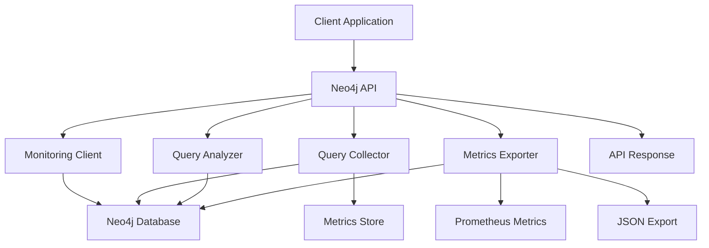

# Neo4j Query Monitoring API Guide

## 📊 Overview

Neo4j query monitoring provides comprehensive performance tracking, analysis, and optimization recommendations for Cypher queries and graph database operations.

## 🏗️ Architecture Flow



## 📋 Database Schema

### Neo4j Nodes and Relationships for Monitoring
```cypher
// Query Metrics Nodes
(:QueryMetric {
  query_hash: String,
  query_type: String,
  database: String,
  execution_time_ms: Float,
  status: String,
  performance_level: String,
  timestamp: DateTime,
  affected_rows: Integer,
  error_message: String,
  cypher_query: String
})

// Performance Analysis Relationships
(:QueryMetric)-[:HAS_PERFORMANCE]->(:PerformanceLevel {
  level: String,
  score: Float
})

(:QueryMetric)-[:BELONGS_TO]->(:Database {
  name: String,
  type: String
})

(:QueryMetric)-[:USES_INDEX]->(:Index {
  name: String,
  properties: [String],
  state: String
})

// Performance Reports
(:PerformanceReport {
  database: String,
  period_start: DateTime,
  period_end: DateTime,
  total_queries: Integer,
  slow_queries: Integer,
  avg_execution_time_ms: Float,
  created_at: DateTime
})

(:PerformanceReport)-[:CONTAINS]->(:TopSlowQuery {
  query_hash: String,
  execution_time_ms: Float,
  timestamp: DateTime
})

// Index Analysis
(:IndexAnalysis {
  index_name: String,
  usage_count: Integer,
  last_used: DateTime,
  efficiency_score: Float,
  recommendations: [String]
})

(:IndexAnalysis)-[:APPLIES_TO]->(:Label {
  name: String,
  property: String
})

// Node Performance
(:NodePerformance {
  node_count: Integer,
  relationship_count: Integer,
  label_count: Integer,
  property_count: Integer,
  last_updated: DateTime
})

(:NodePerformance)-[:HAS_LABEL]->(:Label {
  name: String,
  count: Integer
})
```

## 🔗 API Endpoints (17 Total)

### 1. Query Execution with Monitoring
```http
POST /neo4j/queries/execute
Content-Type: application/json

{
  "query": "MATCH (u:User) WHERE u.status = 'active' RETURN u",
  "params": {}
}
```

**Response:**
```json
{
  "success": true,
  "data": {
    "result": [
      {
        "u": {
          "identity": 1,
          "labels": ["User"],
          "properties": {
            "name": "John",
            "status": "active"
          }
        }
      }
    ],
    "execution_time_ms": 125.5,
    "performance_level": "NORMAL",
    "query_hash": "abc123def456",
    "affected_rows": 100
  },
  "timestamp": "2026-05-06T16:13:00.000Z"
}
```

### 2. Get Slow Queries
```http
GET /neo4j/queries/slow?threshold_ms=1000&limit=50
```

**Response:**
```json
{
  "success": true,
  "data": {
    "slow_queries": [
      {
        "query_hash": "slow123",
        "query_type": "MATCH",
        "execution_time_ms": 2500.0,
        "performance_level": "SLOW",
        "timestamp": "2026-05-06T15:30:00.000Z",
        "plan_details": {
          "cypher_query": "MATCH (u:User) WHERE u.email CONTAINS 'test' RETURN u",
          "operator_type": "CONTAINS",
          "index_usage": "none",
          "estimated_rows": 100000
        }
      }
    ],
    "count": 1,
    "threshold_ms": 1000
  }
}
```

### 3. Query Performance Summary
```http
GET /neo4j/queries/performance?period_minutes=60
```

**Response:**
```json
{
  "success": true,
  "data": {
    "period_minutes": 60,
    "summary": {
      "total_queries": 800,
      "avg_execution_time_ms": 185.5,
      "slow_query_count": 40,
      "slow_query_percentage": 5.0,
      "error_rate": 1.2,
      "performance_distribution": {
        "fast": 480,
        "normal": 280,
        "slow": 40,
        "critical": 0
      }
    },
    "health": {
      "healthy": true,
      "health_score": 80
    },
    "recommendations": [
      "Consider adding indexes for frequently queried properties",
      "Review CONTAINS and STARTS WITH operations"
    ]
  }
}
```

### 4. Query Analysis
```http
POST /neo4j/queries/analyze
Content-Type: application/json

{
  "query": "MATCH (u:User) WHERE u.email = 'test@example.com' RETURN u",
  "database": "neo4j"
}
```

**Response:**
```json
{
  "success": true,
  "data": {
    "query_hash": "xyz789",
    "query_text": "MATCH (u:User) WHERE u.email = 'test@example.com' RETURN u",
    "performance_score": 75.0,
    "recommendations": [
      "Consider adding index on User.email property",
      "Query uses equality match - good candidate for indexing"
    ],
    "suggested_indexes": [
      {
        "type": "property",
        "label": "User",
        "properties": ["email"],
        "reason": "Query filters on email property"
      }
    ],
    "optimization_potential": "medium",
    "estimated_improvement_percent": 40.0
  }
}
```

### 5. Query Explanation
```http
GET /neo4j/queries/explain?query=MATCH(u:User)WHERE u.status='active' RETURN u&database=neo4j
```

**Response:**
```json
{
  "success": true,
  "data": {
    "query": "MATCH (u:User) WHERE u.status = 'active' RETURN u",
    "database": "neo4j",
    "execution_plan": {
      "cypher_query": "MATCH (u:User) WHERE u.status = 'active' RETURN u",
      "success": true,
      "command_info": {
        "complexity": "O(n)",
        "memory_impact": "medium",
        "blocking": false,
        "description": "Match nodes with property filter"
      },
      "performance_implications": [
        "May cause full label scan without index",
        "Property filtering affects performance",
        "Result size impacts memory usage"
      ],
      "optimization_suggestions": [
        "Add index on frequently filtered properties",
        "Use specific label constraints",
        "Consider query result limiting"
      ]
    }
  }
}
```

### 6. Index Suggestions
```http
POST /neo4j/queries/indexes/suggest
Content-Type: application/json

{
  "query": "MATCH (u:User)-[:FRIENDS_WITH]->(f:User) WHERE u.status = 'active' RETURN u, f",
  "database": "neo4j"
}
```

**Response:**
```json
{
  "success": true,
  "data": {
    "query": "MATCH (u:User)-[:FRIENDS_WITH]->(f:User) WHERE u.status = 'active' RETURN u, f",
    "database": "neo4j",
    "suggested_indexes": [
      {
        "type": "property",
        "label": "User",
        "properties": ["status"],
        "reason": "Query filters on status property"
      },
      {
        "type": "relationship",
        "relationship_type": "FRIENDS_WITH",
        "properties": [],
        "reason": "Query traverses FRIENDS_WITH relationship"
      },
      {
        "type": "composite",
        "label": "User",
        "properties": ["status", "created_at"],
        "reason": "Multiple property filters would benefit from composite index"
      }
    ]
  }
}
```

### 7. Performance Report
```http
POST /neo4j/queries/reports/performance
Content-Type: application/json

{
  "database": "neo4j",
  "period_hours": 24
}
```

**Response:**
```json
{
  "success": true,
  "data": {
    "database": "neo4j",
    "period_start": "2026-05-05T16:13:00.000Z",
    "period_end": "2026-05-06T16:13:00.000Z",
    "total_queries": 2000,
    "slow_queries": 100,
    "avg_execution_time_ms": 285.5,
    "performance_distribution": {
      "fast": 1000,
      "normal": 900,
      "slow": 100,
      "critical": 0
    },
    "top_slow_queries": [
      {
        "query_hash": "slow123",
        "query_type": "MATCH",
        "execution_time_ms": 5000.0,
        "timestamp": "2026-05-06T14:30:00.000Z"
      }
    ],
    "recommendations": [
      "Optimize CONTAINS and STARTS WITH operations",
      "Add indexes for frequently queried properties",
      "Review query patterns for optimization opportunities"
    ]
  }
}
```

### 8. Performance Issues
```http
GET /neo4j/queries/issues
```

**Response:**
```json
{
  "success": true,
  "data": {
    "issues": [
      {
        "type": "slow_query",
        "severity": "high",
        "query_hash": "slow123",
        "query_type": "MATCH",
        "execution_time_ms": 5000.0,
        "timestamp": "2026-05-06T14:30:00.000Z",
        "recommendation": "Add index on filtered properties or optimize query structure"
      },
      {
        "type": "index_gap",
        "severity": "medium",
        "label": "User",
        "property": "email",
        "slow_query_count": 25,
        "avg_execution_time": 1200.0,
        "recommendation": "Consider adding index on User.email property"
      }
    ],
    "count": 2,
    "severity_breakdown": {
      "critical": 0,
      "high": 1,
      "medium": 1,
      "low": 0
    }
  }
}
```

### 9. Slow Queries Analysis
```http
GET /neo4j/queries/analysis/slow?hours=24
```

**Response:**
```json
{
  "success": true,
  "data": {
    "period_hours": 24,
    "total_slow_queries": 100,
    "query_type_breakdown": {
      "MATCH": {
        "count": 60,
        "avg_execution_time": 2000.0,
        "max_execution_time": 8000.0
      },
      "MERGE": {
        "count": 25,
        "avg_execution_time": 1500.0,
        "max_execution_time": 5000.0
      }
    },
    "top_slow_queries": [
      {
        "query_hash": "slow123",
        "execution_time_ms": 8000.0,
        "timestamp": "2026-05-06T14:30:00.000Z"
      }
    ],
    "trend": "deteriorating"
  }
}
```

### 10. Database Health Report
```http
GET /neo4j/queries/health
```

**Response:**
```json
{
  "success": true,
  "data": {
    "overall_health_score": 75,
    "health_status": "degraded",
    "server_health": {
      "healthy": true,
      "health_score": 80
    },
    "performance_summary": {
      "avg_execution_time_ms": 285.5,
      "slow_query_percentage": 5.0
    },
    "issues": {
      "critical": [],
      "high": [],
      "total_count": 0
    }
  }
}
```

### 11. Prometheus Metrics
```http
GET /neo4j/queries/metrics
```

**Response (text/plain):**
```
# HELP neo4j_query_execution_time_ms Neo4j query execution time
# TYPE neo4j_query_execution_time_ms histogram
neo4j_query_execution_time_ms_bucket{le="10"} 100
neo4j_query_execution_time_ms_bucket{le="100"} 600
neo4j_query_execution_time_ms_bucket{le="1000"} 750
neo4j_query_execution_time_ms_bucket{le="+Inf"} 800
neo4j_query_execution_time_ms_sum 200000
neo4j_query_execution_time_ms_count 800

# HELP neo4j_queries_total Total Neo4j queries
# TYPE neo4j_queries_total counter
neo4j_queries_total{status="success"} 790
neo4j_queries_total{status="error"} 10

# HELP neo4j_node_count Total number of nodes
# TYPE neo4j_node_count gauge
neo4j_node_count{label="User"} 50000
```

### 12. JSON Metrics Export
```http
GET /neo4j/queries/metrics/json
```

**Response:**
```json
{
  "success": true,
  "data": {
    "timestamp": "2026-05-06T16:13:00.000Z",
    "database": "neo4j",
    "query_metrics": [
      {
        "query_hash": "abc123",
        "query_type": "MATCH",
        "execution_time_ms": 125.5,
        "performance_level": "NORMAL",
        "timestamp": "2026-05-06T16:13:00.000Z"
      }
    ],
    "database_metrics": {
      "node_count": 100000,
      "relationship_count": 250000,
      "label_count": 25,
      "avg_query_time_ms": 285.5
    },
    "health": {
      "healthy": true,
      "health_score": 75
    }
  }
}
```

### 13. Graph Performance
```http
GET /neo4j/queries/graph/performance?period_minutes=60
```

**Response:**
```json
{
  "success": true,
  "data": {
    "period_minutes": 60,
    "graph_metrics": {
      "total_nodes": 100000,
      "total_relationships": 250000,
      "label_distribution": {
        "User": 50000,
        "Product": 30000,
        "Order": 20000
      },
      "relationship_distribution": {
        "FRIENDS_WITH": 80000,
        "PURCHASED": 100000,
        "REVIEWED": 70000
      }
    },
    "performance_analysis": {
      "avg_traversal_depth": 3.5,
      "complex_query_rate": 0.15,
      "index_usage_rate": 0.75
    },
    "recommendations": [
      "Consider graph modeling optimizations",
      "Review relationship cardinality",
      "Optimize traversal patterns"
    ]
  }
}
```

### 14. Relationships Analysis
```http
GET /neo4j/queries/relationships/analysis
```

**Response:**
```json
{
  "success": true,
  "data": {
    "relationship_analysis": {
      "total_relationships": 250000,
      "relationship_types": {
        "FRIENDS_WITH": {
          "count": 80000,
          "avg_properties": 2,
          "usage_frequency": "high"
        },
        "PURCHASED": {
          "count": 100000,
          "avg_properties": 3,
          "usage_frequency": "medium"
        }
      },
      "cardinality_analysis": {
        "one_to_one": 50000,
        "one_to_many": 150000,
        "many_to_many": 50000
      }
    },
    "recommendations": [
      "Consider relationship type optimization",
      "Review cardinality patterns",
      "Add indexes on frequently traversed relationships"
    ]
  }
}
```

### 15. Schema Analysis
```http
GET /neo4j/queries/schema/analysis
```

**Response:**
```json
{
  "success": true,
  "data": {
    "schema": {
      "database_type": "neo4j",
      "labels": [
        {
          "name": "User",
          "property_count": 8,
          "node_count": 50000,
          "indexes": [
            {"name": "User.email", "properties": ["email"]}
          ]
        }
      ],
      "relationship_types": [
        {
          "name": "FRIENDS_WITH",
          "property_count": 2,
          "relationship_count": 80000
        }
      ]
    },
    "recommendations": [
      "Consider adding indexes for frequently queried properties",
      "Review label and relationship design",
      "Optimize property types for better performance"
    ]
  }
}
```

### 16. Query Plan Analysis
```http
GET /neo4j/queries/plan/analysis?query=MATCH(u:User)WHERE u.status='active' RETURN u&database=neo4j
```

**Response:**
```json
{
  "success": true,
  "data": {
    "query": "MATCH (u:User) WHERE u.status = 'active' RETURN u",
    "database": "neo4j",
    "explain": {
      "cypher_query": "MATCH (u:User) WHERE u.status = 'active' RETURN u",
      "success": true
    },
    "analysis": {
      "command_info": {
        "complexity": "O(n)",
        "memory_impact": "medium",
        "blocking": false
      },
      "performance_implications": [
        "May cause full label scan without index",
        "Property filtering affects performance"
      ],
      "optimization_suggestions": [
        "Add index on status property",
        "Use specific label constraints"
      ],
      "neo4j_specific": {
        "index_usage": "none",
        "operator_type": "equality",
        "traversal_depth": 1,
        "estimated_rows": 50000
      }
    }
  }
}
```

### 17. Index Gaps
```http
GET /neo4j/queries/index-gaps
```

**Response:**
```json
{
  "success": true,
  "data": {
    "index_gaps": [
      {
        "label": "User",
        "property": "email",
        "slow_query_count": 25,
        "avg_execution_time": 1200.0,
        "recommendation": "Consider adding index on User.email property",
        "potential_improvement": "60%"
      },
      {
        "label": "Product",
        "property": "category",
        "slow_query_count": 15,
        "avg_execution_time": 800.0,
        "recommendation": "Consider adding index on Product.category property",
        "potential_improvement": "40%"
      }
    ],
    "total_gaps": 2,
    "recommendations": [
      "Review frequently queried properties",
      "Consider composite indexes for multiple property filters"
    ]
  }
}
```

## 🚀 Usage Examples

### Complete Monitoring Flow
```bash
# 1. Execute query with monitoring
curl -X POST "http://localhost:8000/neo4j/queries/execute" \
  -H "Content-Type: application/json" \
  -d '{
    "query": "MATCH (u:User) WHERE u.status = '\''active'\'' RETURN u",
    "params": {}
  }'

# 2. Get slow queries
curl "http://localhost:8000/neo4j/queries/slow?threshold_ms=1000&limit=10"

# 3. Analyze query performance
curl -X POST "http://localhost:8000/neo4j/queries/analyze" \
  -H "Content-Type: application/json" \
  -d '{
    "query": "MATCH (u:User) WHERE u.email = '\''test@example.com'\'' RETURN u",
    "database": "neo4j"
  }'

# 4. Get performance report
curl -X POST "http://localhost:8000/neo4j/queries/reports/performance" \
  -H "Content-Type: application/json" \
  -d '{
    "database": "neo4j",
    "period_hours": 24
  }'
```

### Python Client Integration
```python
from neo4j import GraphDatabase
import requests

class Neo4jMonitoringClient:
    def __init__(self, base_url: str, api_key: str):
        self.base_url = base_url
        self.headers = {
            'Authorization': f'Bearer {api_key}',
            'Content-Type': 'application/json'
        }
    
    def execute_query(self, query: str, params: Dict[str, Any] = None):
        url = f"{self.base_url}/neo4j/queries/execute"
        payload = {"query": query, "params": params or {}}
        
        response = requests.post(url, json=payload, headers=self.headers)
        return response.json()
    
    def get_slow_queries(self, threshold_ms: float = 1000, limit: int = 50):
        url = f"{self.base_url}/neo4j/queries/slow"
        params = {"threshold_ms": threshold_ms, "limit": limit}
        
        response = requests.get(url, params=params, headers=self.headers)
        return response.json()
    
    def analyze_query(self, query: str, database: str = "neo4j"):
        url = f"{self.base_url}/neo4j/queries/analyze"
        payload = {"query": query, "database": database}
        
        response = requests.post(url, json=payload, headers=self.headers)
        return response.json()
    
    def get_graph_performance(self, period_minutes: int = 60):
        url = f"{self.base_url}/neo4j/queries/graph/performance"
        params = {"period_minutes": period_minutes}
        
        response = requests.get(url, params=params, headers=self.headers)
        return response.json()

# Usage
client = Neo4jMonitoringClient("http://localhost:8000", "your-api-key")

# Execute query
result = client.execute_query(
    "MATCH (u:User) WHERE u.status = 'active' RETURN u"
)

# Get slow queries
slow_queries = client.get_slow_queries(threshold_ms=1000, limit=10)

# Analyze query
analysis = client.analyze_query(
    "MATCH (u:User) WHERE u.email = 'test@example.com' RETURN u"
)

# Get graph performance
graph_perf = client.get_graph_performance(period_minutes=60)
```

### Real-time Monitoring with WebSockets
```javascript
// WebSocket connection for real-time Neo4j metrics
const ws = new WebSocket('ws://localhost:8000/neo4j/queries/metrics/stream');

ws.onmessage = function(event) {
    const metrics = JSON.parse(event.data);
    
    // Update dashboard
    updateNeo4jDashboard(metrics);
    
    // Check for alerts
    if (metrics.avg_query_time_ms > 500) {
        showAlert('High query latency detected');
    }
    
    if (metrics.slow_query_rate > 0.1) {
        showAlert('High slow query rate detected');
    }
    
    if (metrics.memory_usage_percent > 80) {
        showAlert('High memory usage detected');
    }
};

function updateNeo4jDashboard(metrics) {
    document.getElementById('query-count').textContent = metrics.total_queries;
    document.getElementById('avg-time').textContent = metrics.avg_query_time_ms.toFixed(2);
    document.getElementById('slow-queries').textContent = metrics.slow_queries;
    document.getElementById('node-count').textContent = metrics.node_count;
    document.getElementById('relationship-count').textContent = metrics.relationship_count;
}

// Real-time query execution with monitoring
async function executeCypherQuery(query, params = {}) {
    const response = await fetch('/neo4j/queries/execute', {
        method: 'POST',
        headers: {
            'Content-Type': 'application/json',
            'Authorization': 'Bearer ' + apiKey
        },
        body: JSON.stringify({
            query: query,
            params: params
        })
    });
    
    const result = await response.json();
    
    if (result.success) {
        // Update UI with query results
        displayCypherResults(result.data.result);
        
        // Log performance metrics
        console.log(`Query completed in ${result.data.execution_time_ms}ms`);
        
        // Update performance charts
        updatePerformanceCharts(result.data);
    }
}
```

### Batch Query Operations Monitoring
```python
import asyncio
from neo4j import GraphDatabase
from neo4j.exceptions import ServiceUnavailable

class Neo4jBatchMonitor:
    def __init__(self, driver, monitoring_client):
        self.driver = driver
        self.monitoring_client = monitoring_client
    
    async def execute_batch_with_monitoring(self, queries: List[Dict[str, Any]]):
        """Execute batch queries with monitoring"""
        start_time = time.time()
        
        results = []
        async with self.driver.session() as session:
            for query_info in queries:
                try:
                    # Execute query
                    result = await session.run(query_info["query"], query_info.get("params", {}))
                    
                    # Convert result to list
                    records = list(result)
                    
                    results.append({
                        "query": query_info["query"],
                        "params": query_info.get("params", {}),
                        "result_count": len(records),
                        "success": True,
                        "records": records
                    })
                    
                except Exception as e:
                    results.append({
                        "query": query_info["query"],
                        "error": str(e),
                        "success": False
                    })
        
        execution_time = (time.time() - start_time) * 1000
        
        # Record batch operation metrics
        await self.monitoring_client.record_batch_metrics(
            queries=queries,
            execution_time_ms=execution_time,
            results=results
        )
        
        return results

# Usage
driver = GraphDatabase.driver("bolt://localhost:7687", auth=("neo4j", "password"))
monitoring_client = Neo4jMonitoringClient("http://localhost:8000", "api-key")
batch_monitor = Neo4jBatchMonitor(driver, monitoring_client)

# Prepare batch queries
queries = [
    {
        "query": "CREATE (u:User {name: $name, email: $email})",
        "params": {"name": "John", "email": "john@example.com"}
    },
    {
        "query": "MATCH (u:User) WHERE u.email = $email RETURN u",
        "params": {"email": "john@example.com"}
    },
    {
        "query": "MATCH (u:User)-[:FRIENDS_WITH]->(f:User) RETURN u.name, f.name",
        "params": {}
    }
]

# Execute batch with monitoring
results = await batch_monitor.execute_batch_with_monitoring(queries)
```

## 📊 Monitoring Dashboard

### Grafana Panel Configuration
```json
{
  "dashboard": {
    "title": "Neo4j Query Monitoring",
    "panels": [
      {
        "title": "Query Execution Time",
        "type": "graph",
        "targets": [
          {
            "expr": "neo4j_query_execution_time_ms_sum",
            "legendFormat": "Execution Time"
          }
        ]
      },
      {
        "title": "Node Count",
        "type": "stat",
        "targets": [
          {
            "expr": "neo4j_node_count"
          }
        ]
      },
      {
        "title": "Query Distribution",
        "type": "piechart",
        "targets": [
          {
            "expr": "neo4j_queries_total",
            "format": "time_series"
          }
        ]
      },
      {
        "title": "Slow Query Rate",
        "type": "singlestat",
        "targets": [
          {
            "expr": "neo4j_slow_queries_total / neo4j_queries_total"
          }
        ]
      },
      {
        "title": "Relationship Count",
        "type": "table",
        "targets": [
          {
            "expr": "neo4j_relationship_count"
          }
        ]
      },
      {
        "title": "Label Distribution",
        "type": "table",
        "targets": [
          {
            "expr": "neo4j_label_node_count"
          }
        ]
      }
    ]
  }
}
```

## 🔧 Configuration

### Environment Variables
```bash
# Neo4j Configuration
NEO4J_URI=bolt://localhost:7687
NEO4J_USERNAME=neo4j
NEO4J_PASSWORD=Neo4jPassword123!
NEO4J_DATABASE=neo4j

# Monitoring Configuration
NEO4J_SLOW_QUERY_THRESHOLD_MS=1000
NEO4J_QUERY_HISTORY_SIZE=10000
NEO4J_METRICS_EXPORT_INTERVAL_SECONDS=30
```

### Docker Setup
```yaml
version: '3.8'
services:
  neo4j:
    image: neo4j:5.0
    ports:
      - "7474:7474"
      - "7687:7687"
    environment:
      - NEO4J_AUTH=neo4j/Neo4jPassword123!
      - NEO4J_PLUGINS=["apoc"]
    volumes:
      - neo4j_data:/data
      - ./neo4j.conf:/conf/neo4j.conf

  neo4j-monitoring:
    build: .
    ports:
      - "8000:8000"
    environment:
      - NEO4J_URI=bolt://neo4j:7687
      - NEO4J_USERNAME=neo4j
      - NEO4J_PASSWORD=Neo4jPassword123!
      - API_KEY=your-secret-api-key
    depends_on:
      - neo4j
    volumes:
      - ./logs:/app/logs

volumes:
  neo4j_data:
```

### Neo4j Configuration (neo4j.conf)
```conf
# Basic configuration
dbms.default_listen_address=0.0.0.0
dbms.connector.bolt.listen_address=0.0.0.0:7687
dbms.connector.http.listen_address=0.0.0.0:7474

# Memory configuration
dbms.memory.heap.initial_size=512m
dbms.memory.heap.max_size=2G
dbms.memory.pagecache.size=1G

# Performance settings
dbms.logs.query.enabled=true
dbms.logs.query.threshold=1000ms
dbms.track_query_cpu_time=true

# Monitoring settings
dbms.security.procedures.unrestricted=apoc.*
dbms.security.procedures.allowlist=apoc.coll.*,apoc.load.*,apoc.monitor.*
```

## 🛡️ Security & Best Practices

### API Security
```python
from fastapi import Depends, HTTPException, status
from fastapi.security import HTTPBearer
import jwt

security = HTTPBearer()

async def verify_api_key(api_key: str = Depends(security)):
    try:
        # Verify JWT token
        payload = jwt.decode(api_key.credentials, SECRET_KEY, algorithms=["HS256"])
        return payload
    except jwt.ExpiredSignatureError:
        raise HTTPException(
            status_code=status.HTTP_401_UNAUTHORIZED,
            detail="Token expired"
        )
    except jwt.InvalidTokenError:
        raise HTTPException(
            status_code=status.HTTP_401_UNAUTHORIZED,
            detail="Invalid token"
        )

@router.post("/execute", dependencies=[Depends(verify_api_key)])
async def execute_query(request: QueryExecutionRequest):
    # Implementation
    pass
```

### Query Validation
```python
from pydantic import BaseModel, validator
import re

class QueryExecutionRequest(BaseModel):
    query: str
    params: Dict[str, Any] = {}
    
    @validator('query')
    def validate_query(cls, v):
        # Basic Cypher injection prevention
        dangerous_patterns = [
            r'\bDROP\b',
            r'\bREMOVE\b',
            r'\bDELETE\b',
            r'\bCREATE\b',
            r'\bMERGE.*REMOVE',
            r'\bCALL\s+apoc\.'
        ]
        
        for pattern in dangerous_patterns:
            if re.search(pattern, v, re.IGNORECASE):
                raise ValueError(f"Query contains potentially dangerous operation: {pattern}")
        
        # Basic Cypher syntax validation
        if not re.match(r'^\s*(MATCH|CREATE|MERGE|SET|REMOVE|DELETE|RETURN|WITH|CALL|UNWIND)', v, re.IGNORECASE):
            raise ValueError("Invalid Cypher query syntax")
        
        return v
```

### Rate Limiting
```python
from slowapi import Limiter
from slowapi.util import get_remote_address

# Different limits for different operations
read_limiter = Limiter(key_func=get_remote_address)
write_limiter = Limiter(key_func=get_remote_address)
ddl_limiter = Limiter(key_func=get_remote_address)

@router.post("/execute", dependencies=[Depends(verify_api_key)])
async def execute_query(request: QueryExecutionRequest):
    # Apply rate limiting based on query type
    query_upper = request.query.upper()
    
    if query_upper.startswith(('MATCH', 'RETURN', 'WITH', 'UNWIND')):
        read_limiter.limit("1000/minute")
    elif query_upper.startswith(('CREATE', 'MERGE', 'SET')):
        write_limiter.limit("500/minute")
    elif query_upper.startswith(('REMOVE', 'DELETE')):
        ddl_limiter.limit("100/minute")
    
    # Implementation
    pass
```

## 📈 Performance Optimization

### Connection Pooling
```python
from neo4j import GraphDatabase
from neo4j.exceptions import ServiceUnavailable

# Configure connection pool
driver = GraphDatabase.driver(
    "bolt://localhost:7687",
    auth=("neo4j", "password"),
    max_connection_lifetime=30 * 60,  # 30 minutes
    max_connection_pool_size=50,
    connection_acquisition_timeout=60
)
```

### Query Optimization
```python
class CypherOptimizer:
    def __init__(self, session):
        self.session = session
    
    def optimize_query(self, query: str, params: Dict[str, Any]) -> str:
        """Optimize Cypher query for better performance"""
        
        # Add LIMIT if not present for large result sets
        if 'LIMIT' not in query.upper():
            query += " LIMIT 1000"
        
        # Use specific labels when possible
        if 'MATCH (n)' in query and 'WHERE' in query:
            # Try to infer label from WHERE clause
            label = self._infer_label_from_where(query)
            if label:
                query = query.replace('MATCH (n)', f'MATCH (n:{label})')
        
        return query
    
    def _infer_label_from_where(self, query: str) -> str:
        """Infer label from WHERE clause"""
        # This would involve parsing the query and checking schema
        # Simplified implementation
        if 'User.' in query:
            return 'User'
        elif 'Product.' in query:
            return 'Product'
        return None
    
    def suggest_index(self, query: str) -> List[Dict[str, Any]]:
        """Suggest indexes based on query patterns"""
        suggestions = []
        
        # Analyze WHERE clause for index opportunities
        if 'WHERE' in query.upper():
            properties = self._extract_where_properties(query)
            label = self._extract_label(query)
            
            if properties and label:
                suggestions.append({
                    "type": "property",
                    "label": label,
                    "properties": properties,
                    "reason": "Query filters on these properties"
                })
        
        return suggestions
    
    def _extract_where_properties(self, query: str) -> List[str]:
        """Extract properties from WHERE clause"""
        # Simplified property extraction
        properties = []
        
        # Look for property patterns like n.property
        import re
        pattern = r'\w+\.(\w+)\s*[=<>!]'
        matches = re.findall(pattern, query)
        properties.extend(matches)
        
        return list(set(properties))
    
    def _extract_label(self, query: str) -> str:
        """Extract label from query"""
        # Look for pattern like (n:Label)
        import re
        pattern = r'\(\w+:(\w+)\)'
        match = re.search(pattern, query)
        
        if match:
            return match.group(2)
        
        return None
```

### Memory Management
```python
class MemoryManager:
    def __init__(self, session):
        self.session = session
    
    async def check_memory_usage(self) -> Dict[str, Any]:
        """Check Neo4j memory usage"""
        
        try:
            # Get memory statistics
            result = await self.session.run("CALL dbms.queryJmx('java.lang:type=Memory')")
            memory_data = list(result)
            
            memory_analysis = {
                "heap_memory": {
                    "used": 0,
                    "max": 0,
                    "usage_percent": 0
                },
                "non_heap_memory": {
                    "used": 0,
                    "max": 0,
                    "usage_percent": 0
                },
                "recommendations": []
            }
            
            # Parse memory data
            for record in memory_data:
                if record["name"] == "HeapMemory":
                    memory_analysis["heap_memory"] = {
                        "used": record["Used"],
                        "max": record["Max"],
                        "usage_percent": (record["Used"] / record["Max"]) * 100
                    }
                elif record["name"] == "NonHeapMemory":
                    memory_analysis["non_heap_memory"] = {
                        "used": record["Used"],
                        "max": record["Max"],
                        "usage_percent": (record["Used"] / record["Max"]) * 100
                    }
            
            # Generate recommendations
            if memory_analysis["heap_memory"]["usage_percent"] > 80:
                memory_analysis["recommendations"].append(
                    "High heap memory usage - consider increasing heap size"
                )
            
            if memory_analysis["non_heap_memory"]["usage_percent"] > 80:
                memory_analysis["recommendations"].append(
                    "High non-heap memory usage - check for memory leaks"
                )
            
            return memory_analysis
            
        except Exception as e:
            return {"error": str(e)}
```

This comprehensive Neo4j API guide provides complete documentation for all 17 endpoints with detailed examples, security considerations, and best practices for graph database performance optimization.
