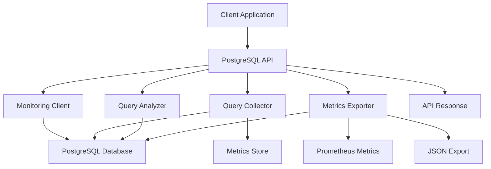

# PostgreSQL Query Monitoring API Guide

## 📊 Overview

PostgreSQL query monitoring provides comprehensive performance tracking, analysis, and optimization recommendations for SQL queries and relational database operations.

## 🏗️ Architecture Flow



## 📋 Database Schema

### PostgreSQL Tables for Monitoring
```sql
-- Query Metrics Table
CREATE TABLE query_metrics (
    id SERIAL PRIMARY KEY,
    query_hash VARCHAR(255) NOT NULL,
    query_type VARCHAR(50) NOT NULL,
    database VARCHAR(100) NOT NULL,
    table_name VARCHAR(100),
    execution_time_ms DECIMAL(10,2) NOT NULL,
    status VARCHAR(20) NOT NULL,
    performance_level VARCHAR(20) NOT NULL,
    timestamp TIMESTAMP WITH TIME ZONE DEFAULT NOW(),
    affected_rows INTEGER,
    error_message TEXT,
    plan_details JSONB,
    consistency_level VARCHAR(20) DEFAULT 'READ COMMITTED'
);

-- Performance Reports Table
CREATE TABLE performance_reports (
    id SERIAL PRIMARY KEY,
    database VARCHAR(100) NOT NULL,
    period_start TIMESTAMP WITH TIME ZONE NOT NULL,
    period_end TIMESTAMP WITH TIME ZONE NOT NULL,
    total_queries INTEGER NOT NULL,
    slow_queries INTEGER NOT NULL,
    avg_execution_time_ms DECIMAL(10,2) NOT NULL,
    performance_distribution JSONB NOT NULL,
    top_slow_queries JSONB NOT NULL,
    recommendations TEXT[],
    created_at TIMESTAMP WITH TIME ZONE DEFAULT NOW()
);

-- Index Analysis Table
CREATE TABLE index_analysis (
    id SERIAL PRIMARY KEY,
    table_name VARCHAR(100) NOT NULL,
    index_name VARCHAR(100) NOT NULL,
    index_type VARCHAR(50) NOT NULL,
    usage_count INTEGER DEFAULT 0,
    last_used TIMESTAMP WITH TIME ZONE,
    efficiency_score DECIMAL(5,2),
    recommendations TEXT[],
    created_at TIMESTAMP WITH TIME ZONE DEFAULT NOW()
);

-- Table Statistics Table
CREATE TABLE table_statistics (
    id SERIAL PRIMARY KEY,
    schema_name VARCHAR(100) NOT NULL,
    table_name VARCHAR(100) NOT NULL,
    row_count BIGINT,
    size_mb DECIMAL(10,2),
    index_count INTEGER,
    avg_row_size DECIMAL(8,2),
    last_analyzed TIMESTAMP WITH TIME ZONE,
    created_at TIMESTAMP WITH TIME ZONE DEFAULT NOW()
);

-- Query Plan Cache Table
CREATE TABLE query_plan_cache (
    id SERIAL PRIMARY KEY,
    query_hash VARCHAR(255) NOT NULL,
    query_text TEXT NOT NULL,
    plan_json JSONB NOT NULL,
    cost_estimate DECIMAL(10,2),
    created_at TIMESTAMP WITH TIME ZONE DEFAULT NOW(),
    last_used TIMESTAMP WITH TIME ZONE DEFAULT NOW(),
    usage_count INTEGER DEFAULT 1
);

-- Database Performance Table
CREATE TABLE database_performance (
    id SERIAL PRIMARY KEY,
    timestamp TIMESTAMP WITH TIME ZONE DEFAULT NOW(),
    active_connections INTEGER,
    idle_connections INTEGER,
    cache_hit_ratio DECIMAL(5,4),
    index_usage_ratio DECIMAL(5,4),
    disk_io_mb_s DECIMAL(10,2),
    cpu_usage_percent DECIMAL(5,2),
    memory_usage_mb DECIMAL(10,2)
);
```

## 🔗 API Endpoints (15 Total)

### 1. Query Execution with Monitoring
```http
POST /postgres/queries/execute
Content-Type: application/json

{
  "query": "SELECT * FROM users WHERE status = 'active'",
  "params": {}
}
```

**Response:**
```json
{
  "success": true,
  "data": {
    "result": [
      {"id": 1, "name": "John", "status": "active", "created_at": "2026-05-06T16:13:00.000Z"}
    ],
    "execution_time_ms": 45.5,
    "performance_level": "FAST",
    "query_hash": "abc123def456",
    "affected_rows": 100
  },
  "timestamp": "2026-05-06T16:13:00.000Z"
}
```

### 2. Get Slow Queries
```http
GET /postgres/queries/slow?threshold_ms=1000&limit=50
```

**Response:**
```json
{
  "success": true,
  "data": {
    "slow_queries": [
      {
        "query_hash": "slow123",
        "query_type": "SELECT",
        "table_name": "orders",
        "execution_time_ms": 2500.0,
        "performance_level": "SLOW",
        "timestamp": "2026-05-06T15:30:00.000Z",
        "plan_details": {
          "plan_type": "Seq Scan",
          "actual_cost": 1500.0,
          "rows_removed": 0,
          "indexes_used": []
        }
      }
    ],
    "count": 1,
    "threshold_ms": 1000
  }
}
```

### 3. Query Performance Summary
```http
GET /postgres/queries/performance?period_minutes=60
```

**Response:**
```json
{
  "success": true,
  "data": {
    "period_minutes": 60,
    "summary": {
      "total_queries": 1200,
      "avg_execution_time_ms": 85.5,
      "slow_query_count": 30,
      "slow_query_percentage": 2.5,
      "error_rate": 0.8,
      "performance_distribution": {
        "fast": 900,
        "normal": 270,
        "slow": 30,
        "critical": 0
      }
    },
    "health": {
      "healthy": true,
      "health_score": 85
    },
    "recommendations": [
      "Consider adding indexes for frequently queried columns",
      "Review sequential scan operations"
    ]
  }
}
```

### 4. Query Analysis
```http
POST /postgres/queries/analyze
Content-Type: application/json

{
  "query": "SELECT * FROM users WHERE email = 'test@example.com'",
  "database": "scaibu_default"
}
```

**Response:**
```json
{
  "success": true,
  "data": {
    "query_hash": "xyz789",
    "query_text": "SELECT * FROM users WHERE email = 'test@example.com'",
    "performance_score": 75.0,
    "recommendations": [
      "Consider adding index on email column",
      "Query uses equality match - good candidate for indexing"
    ],
    "suggested_indexes": [
      {
        "type": "btree",
        "table": "users",
        "columns": ["email"],
        "reason": "Query filters on email column"
      }
    ],
    "optimization_potential": "medium",
    "estimated_improvement_percent": 40.0
  }
}
```

### 5. Query Explanation
```http
GET /postgres/queries/explain?query=SELECT * FROM users WHERE status = 'active'&database=scaibu_default
```

**Response:**
```json
{
  "success": true,
  "data": {
    "query": "SELECT * FROM users WHERE status = 'active'",
    "database": "scaibu_default",
    "execution_plan": {
      "plan_type": "Seq Scan",
      "actual_cost": 45.0,
      "rows_removed": 0,
      "rows_returned": 100,
      "indexes_used": [],
      "plan_text": "Seq Scan on users  (cost=0.00..45.00 rows=100 width=20)",
      "success": true
    }
  }
}
```

### 6. Index Suggestions
```http
POST /postgres/queries/indexes/suggest
Content-Type: application/json

{
  "query": "SELECT * FROM orders WHERE user_id = 123 AND status = 'completed'",
  "database": "scaibu_default"
}
```

**Response:**
```json
{
  "success": true,
  "data": {
    "query": "SELECT * FROM orders WHERE user_id = 123 AND status = 'completed'",
    "database": "scaibu_default",
    "suggested_indexes": [
      {
        "type": "btree",
        "table": "orders",
        "columns": ["user_id", "status"],
        "reason": "Query filters on multiple columns - composite index recommended"
      },
      {
        "type": "partial",
        "table": "orders",
        "columns": ["user_id"],
        "reason": "High cardinality column - good for selectivity"
      }
    ]
  }
}
```

### 7. Performance Report
```http
POST /postgres/queries/reports/performance
Content-Type: application/json

{
  "database": "scaibu_default",
  "period_hours": 24
}
```

**Response:**
```json
{
  "success": true,
  "data": {
    "database": "scaibu_default",
    "period_start": "2026-05-05T16:13:00.000Z",
    "period_end": "2026-05-06T16:13:00.000Z",
    "total_queries": 3000,
    "slow_queries": 75,
    "avg_execution_time_ms": 95.5,
    "performance_distribution": {
      "fast": 2250,
      "normal": 675,
      "slow": 75,
      "critical": 0
    },
    "top_slow_queries": [
      {
        "query_hash": "slow123",
        "query_type": "SELECT",
        "execution_time_ms": 5000.0,
        "timestamp": "2026-05-06T14:30:00.000Z"
      }
    ],
    "recommendations": [
      "Optimize sequential scan operations",
      "Add missing indexes for frequently queried columns",
      "Consider query result pagination"
    ]
  }
}
```

### 8. Performance Issues
```http
GET /postgres/queries/issues
```

**Response:**
```json
{
  "success": true,
  "data": {
    "issues": [
      {
        "type": "slow_query",
        "severity": "high",
        "query_hash": "slow123",
        "query_type": "SELECT",
        "table_name": "orders",
        "execution_time_ms": 5000.0,
        "timestamp": "2026-05-06T14:30:00.000Z",
        "recommendation": "Add index or optimize query structure"
      },
      {
        "type": "index_gap",
        "severity": "medium",
        "table": "users",
        "slow_query_count": 15,
        "avg_execution_time": 1200.0,
        "recommendation": "Consider adding index on email column"
      }
    ],
    "count": 2,
    "severity_breakdown": {
      "critical": 0,
      "high": 1,
      "medium": 1,
      "low": 0
    }
  }
}
```

### 9. Slow Queries Analysis
```http
GET /postgres/queries/analysis/slow?hours=24
```

**Response:**
```json
{
  "success": true,
  "data": {
    "period_hours": 24,
    "total_slow_queries": 75,
    "table_breakdown": {
      "orders": {
        "count": 45,
        "avg_execution_time": 1500.0,
        "max_execution_time": 5000.0
      },
      "users": {
        "count": 20,
        "avg_execution_time": 800.0,
        "max_execution_time": 2000.0
      }
    },
    "top_slow_queries": [
      {
        "query_hash": "slow123",
        "execution_time_ms": 5000.0,
        "timestamp": "2026-05-06T14:30:00.000Z"
      }
    ],
    "trend": "stable"
  }
}
```

### 10. Database Health Report
```http
GET /postgres/queries/health
```

**Response:**
```json
{
  "success": true,
  "data": {
    "overall_health_score": 85,
    "health_status": "healthy",
    "server_health": {
      "healthy": true,
      "health_score": 90
    },
    "performance_summary": {
      "avg_execution_time_ms": 95.5,
      "slow_query_percentage": 2.5
    },
    "issues": {
      "critical": [],
      "high": [],
      "total_count": 0
    }
  }
}
```

### 11. Prometheus Metrics
```http
GET /postgres/queries/metrics
```

**Response (text/plain):**
```
# HELP postgres_query_execution_time_ms PostgreSQL query execution time
# TYPE postgres_query_execution_time_ms histogram
postgres_query_execution_time_ms_bucket{le="10"} 200
postgres_query_execution_time_ms_bucket{le="100"} 800
postgres_query_execution_time_ms_bucket{le="1000"} 950
postgres_query_execution_time_ms_bucket{le="+Inf"} 1000
postgres_query_execution_time_ms_sum 75000
postgres_query_execution_time_ms_count 1000

# HELP postgres_queries_total Total PostgreSQL queries
# TYPE postgres_queries_total counter
postgres_queries_total{status="success"} 990
postgres_queries_total{status="error"} 10

# HELP postgres_table_size_bytes PostgreSQL table size
# TYPE postgres_table_size_bytes gauge
postgres_table_size_bytes{table="users"} 1073741824
```

### 12. JSON Metrics Export
```http
GET /postgres/queries/metrics/json
```

**Response:**
```json
{
  "success": true,
  "data": {
    "timestamp": "2026-05-06T16:13:00.000Z",
    "database": "postgres",
    "query_metrics": [
      {
        "query_hash": "abc123",
        "query_type": "SELECT",
        "execution_time_ms": 45.5,
        "performance_level": "FAST",
        "timestamp": "2026-05-06T16:13:00.000Z"
      }
    ],
    "database_metrics": {
      "total_tables": 25,
      "total_indexes": 50,
      "avg_query_time_ms": 95.5
    },
    "health": {
      "healthy": true,
      "health_score": 85
    }
  }
}
```

### 13. Table Performance
```http
GET /postgres/queries/tables/{table_name}/performance?period_minutes=60
```

**Response:**
```json
{
  "success": true,
  "data": {
    "table": "users",
    "period_minutes": 60,
    "statistics": {
      "total_queries": 250,
      "avg_execution_time_ms": 65.5,
      "slow_query_count": 5,
      "index_usage": {
        "users_pkey": 150,
        "users_email_idx": 100
      }
    },
    "recommendations": [
      "Consider optimizing queries on large result sets",
      "Review index usage patterns"
    ]
  }
}
```

### 14. Schema Analysis
```http
GET /postgres/queries/schema/analysis
```

**Response:**
```json
{
  "success": true,
  "data": {
    "schema": {
      "database_type": "postgresql",
      "tables": [
        {
          "name": "users",
          "columns": [
            {"name": "id", "type": "integer", "nullable": false, "primary_key": true},
            {"name": "email", "type": "varchar(255)", "nullable": false},
            {"name": "status", "type": "varchar(50)", "nullable": true}
          ],
          "indexes": [
            {"name": "users_pkey", "type": "primary", "columns": ["id"]},
            {"name": "users_email_idx", "type": "btree", "columns": ["email"]}
          ]
        }
      ]
    },
    "recommendations": [
      "Consider adding indexes for frequently queried columns",
      "Review table design for optimization opportunities"
    ]
  }
}
```

### 15. Query Plan Analysis
```http
GET /postgres/queries/plan/analysis?query=SELECT * FROM users WHERE status = 'active'&database=scaibu_default
```

**Response:**
```json
{
  "success": true,
  "data": {
    "query": "SELECT * FROM users WHERE status = 'active'",
    "database": "scaibu_default",
    "explain": {
      "plan_type": "Seq Scan",
      "actual_cost": 45.0,
      "rows_removed": 0,
      "rows_returned": 100,
      "success": true
    },
    "analysis": {
      "plan_efficiency": {
        "efficiency_score": 60,
        "issues": ["Sequential scan detected"],
        "optimizations": ["Add index on status column"]
      },
      "performance_indicators": {
        "scan_type": "Seq Scan",
        "indexes_used": [],
        "estimated_rows": 100
      }
    }
  }
}
```

## 🚀 Usage Examples

### Complete Monitoring Flow
```bash
# 1. Execute query with monitoring
curl -X POST "http://localhost:8000/postgres/queries/execute" \
  -H "Content-Type: application/json" \
  -d '{
    "query": "SELECT * FROM users WHERE status = '\''active'\''",
    "params": {}
  }'

# 2. Get slow queries
curl "http://localhost:8000/postgres/queries/slow?threshold_ms=1000&limit=10"

# 3. Analyze query performance
curl -X POST "http://localhost:8000/postgres/queries/analyze" \
  -H "Content-Type: application/json" \
  -d '{
    "query": "SELECT * FROM users WHERE email = '\''test@example.com'\''",
    "database": "scaibu_default"
  }'

# 4. Get performance report
curl -X POST "http://localhost:8000/postgres/queries/reports/performance" \
  -H "Content-Type: application/json" \
  -d '{
    "database": "scaibu_default",
    "period_hours": 24
  }'
```

### Python Client Integration
```python
import psycopg2
import requests

class PostgreSQLMonitoringClient:
    def __init__(self, base_url: str, api_key: str):
        self.base_url = base_url
        self.headers = {
            'Authorization': f'Bearer {api_key}',
            'Content-Type': 'application/json'
        }
    
    def execute_query(self, query: str, params: Dict[str, Any] = None):
        url = f"{self.base_url}/postgres/queries/execute"
        payload = {"query": query, "params": params or {}}
        
        response = requests.post(url, json=payload, headers=self.headers)
        return response.json()
    
    def get_slow_queries(self, threshold_ms: float = 1000, limit: int = 50):
        url = f"{self.base_url}/postgres/queries/slow"
        params = {"threshold_ms": threshold_ms, "limit": limit}
        
        response = requests.get(url, params=params, headers=self.headers)
        return response.json()
    
    def analyze_query(self, query: str, database: str = "scaibu_default"):
        url = f"{self.base_url}/postgres/queries/analyze"
        payload = {"query": query, "database": database}
        
        response = requests.post(url, json=payload, headers=self.headers)
        return response.json()
    
    def get_table_performance(self, table_name: str, period_minutes: int = 60):
        url = f"{self.base_url}/postgres/queries/tables/{table_name}/performance"
        params = {"period_minutes": period_minutes}
        
        response = requests.get(url, params=params, headers=self.headers)
        return response.json()

# Usage
client = PostgreSQLMonitoringClient("http://localhost:8000", "your-api-key")

# Execute query
result = client.execute_query(
    "SELECT * FROM users WHERE status = 'active'"
)

# Get slow queries
slow_queries = client.get_slow_queries(threshold_ms=1000, limit=10)

# Analyze query
analysis = client.analyze_query(
    "SELECT * FROM users WHERE email = 'test@example.com'",
    database="scaibu_default"
)

# Get table performance
table_perf = client.get_table_performance("users", period_minutes=60)
```

### Real-time Monitoring with WebSockets
```javascript
// WebSocket connection for real-time PostgreSQL metrics
const ws = new WebSocket('ws://localhost:8000/postgres/queries/metrics/stream');

ws.onmessage = function(event) {
    const metrics = JSON.parse(event.data);
    
    // Update dashboard
    updatePostgreSQLDashboard(metrics);
    
    // Check for alerts
    if (metrics.avg_query_time_ms > 200) {
        showAlert('High query latency detected');
    }
    
    if (metrics.slow_query_rate > 0.05) {
        showAlert('High slow query rate detected');
    }
    
    if (metrics.connection_count > 80) {
        showAlert('High connection usage detected');
    }
};

function updatePostgreSQLDashboard(metrics) {
    document.getElementById('query-count').textContent = metrics.total_queries;
    document.getElementById('avg-time').textContent = metrics.avg_query_time_ms.toFixed(2);
    document.getElementById('slow-queries').textContent = metrics.slow_queries;
    document.getElementById('connection-count').textContent = metrics.active_connections;
    document.getElementById('cache-hit-ratio').textContent = (metrics.cache_hit_ratio * 100).toFixed(2);
}

// Real-time query execution with monitoring
async function executeSQLQuery(query, params = {}) {
    const response = await fetch('/postgres/queries/execute', {
        method: 'POST',
        headers: {
            'Content-Type': 'application/json',
            'Authorization': 'Bearer ' + apiKey
        },
        body: JSON.stringify({
            query: query,
            params: params
        })
    });
    
    const result = await response.json();
    
    if (result.success) {
        // Update UI with query results
        displaySQLResults(result.data.result);
        
        // Log performance metrics
        console.log(`Query completed in ${result.data.execution_time_ms}ms`);
        
        // Update performance charts
        updatePerformanceCharts(result.data);
    }
}
```

### Batch Query Operations Monitoring
```python
import asyncio
import psycopg2
from psycopg2.extras import execute_batch

class PostgreSQLBatchMonitor:
    def __init__(self, connection, monitoring_client):
        self.connection = connection
        self.monitoring_client = monitoring_client
    
    async def execute_batch_with_monitoring(self, queries: List[Dict[str, Any]]):
        """Execute batch queries with monitoring"""
        start_time = time.time()
        
        results = []
        cursor = self.connection.cursor()
        
        try:
            for query_info in queries:
                try:
                    # Execute query
                    if query_info.get("params"):
                        cursor.execute(query_info["query"], query_info["params"])
                    else:
                        cursor.execute(query_info["query"])
                    
                    # Get result
                    if query_info["query"].strip().upper().startswith("SELECT"):
                        records = cursor.fetchall()
                        result_count = len(records)
                    else:
                        result_count = cursor.rowcount
                    
                    results.append({
                        "query": query_info["query"],
                        "params": query_info.get("params", {}),
                        "result_count": result_count,
                        "success": True
                    })
                    
                except Exception as e:
                    results.append({
                        "query": query_info["query"],
                        "error": str(e),
                        "success": False
                    })
            
            self.connection.commit()
            
        except Exception as e:
            self.connection.rollback()
            raise e
        
        finally:
            cursor.close()
        
        execution_time = (time.time() - start_time) * 1000
        
        # Record batch operation metrics
        await self.monitoring_client.record_batch_metrics(
            queries=queries,
            execution_time_ms=execution_time,
            results=results
        )
        
        return results

# Usage
connection = psycopg2.connect(
    host="localhost",
    database="scaibu_default",
    user="postgres",
    password="password"
)
monitoring_client = PostgreSQLMonitoringClient("http://localhost:8000", "api-key")
batch_monitor = PostgreSQLBatchMonitor(connection, monitoring_client)

# Prepare batch queries
queries = [
    {
        "query": "INSERT INTO users (name, email, status) VALUES (%s, %s, %s)",
        "params": ["John", "john@example.com", "active"]
    },
    {
        "query": "UPDATE users SET last_login = NOW() WHERE email = %s",
        "params": ["john@example.com"]
    },
    {
        "query": "SELECT * FROM users WHERE status = %s",
        "params": ["active"]
    }
]

# Execute batch with monitoring
results = await batch_monitor.execute_batch_with_monitoring(queries)
```

## 📊 Monitoring Dashboard

### Grafana Panel Configuration
```json
{
  "dashboard": {
    "title": "PostgreSQL Query Monitoring",
    "panels": [
      {
        "title": "Query Execution Time",
        "type": "graph",
        "targets": [
          {
            "expr": "postgres_query_execution_time_ms_sum",
            "legendFormat": "Execution Time"
          }
        ]
      },
      {
        "title": "Connection Count",
        "type": "stat",
        "targets": [
          {
            "expr": "postgres_active_connections"
          }
        ]
      },
      {
        "title": "Query Distribution",
        "type": "piechart",
        "targets": [
          {
            "expr": "postgres_queries_total",
            "format": "time_series"
          }
        ]
      },
      {
        "title": "Slow Query Rate",
        "type": "singlestat",
        "targets": [
          {
            "expr": "postgres_slow_queries_total / postgres_queries_total"
          }
        ]
      },
      {
        "title": "Table Size",
        "type": "table",
        "targets": [
          {
            "expr": "postgres_table_size_bytes"
          }
        ]
      },
      {
        "title": "Cache Hit Ratio",
        "type": "graph",
        "targets": [
          {
            "expr": "postgres_cache_hit_ratio"
          }
        ]
      }
    ]
  }
}
```

## 🔧 Configuration

### Environment Variables
```bash
# PostgreSQL Configuration
POSTGRES_HOST=localhost
POSTGRES_PORT=5432
POSTGRES_DATABASE=scaibu_default
POSTGRES_USER=postgres
POSTGRES_PASSWORD=PostgresPassword123!

# Monitoring Configuration
POSTGRES_SLOW_QUERY_THRESHOLD_MS=1000
POSTGRES_QUERY_HISTORY_SIZE=10000
POSTGRES_METRICS_EXPORT_INTERVAL_SECONDS=30
```

### Docker Setup
```yaml
version: '3.8'
services:
  postgres:
    image: postgres:15
    ports:
      - "5432:5432"
    environment:
      - POSTGRES_DB=scaibu_default
      - POSTGRES_USER=postgres
      - POSTGRES_PASSWORD=PostgresPassword123!
    volumes:
      - postgres_data:/var/lib/postgresql/data
      - ./postgresql.conf:/etc/postgresql/postgresql.conf

  postgres-monitoring:
    build: .
    ports:
      - "8000:8000"
    environment:
      - POSTGRES_HOST=postgres
      - POSTGRES_PORT=5432
      - POSTGRES_DATABASE=scaibu_default
      - POSTGRES_USER=postgres
      - POSTGRES_PASSWORD=PostgresPassword123!
      - API_KEY=your-secret-api-key
    depends_on:
      - postgres
    volumes:
      - ./logs:/app/logs

volumes:
  postgres_data:
```

### PostgreSQL Configuration (postgresql.conf)
```conf
# Basic configuration
listen_addresses = '*'
port = 5432
max_connections = 200

# Performance settings
shared_buffers = 256MB
effective_cache_size = 1GB
work_mem = 4MB
maintenance_work_mem = 64MB

# Query logging
log_statement = 'all'
log_min_duration_statement = 1000
log_checkpoints = on
log_connections = on
log_disconnections = on
log_duration = on

# Monitoring settings
track_activity_query_size = 2048
track_counts = on
track_io_timing = on
track_functions = all
```

## 🛡️ Security & Best Practices

### API Security
```python
from fastapi import Depends, HTTPException, status
from fastapi.security import HTTPBearer
import jwt

security = HTTPBearer()

async def verify_api_key(api_key: str = Depends(security)):
    try:
        # Verify JWT token
        payload = jwt.decode(api_key.credentials, SECRET_KEY, algorithms=["HS256"])
        return payload
    except jwt.ExpiredSignatureError:
        raise HTTPException(
            status_code=status.HTTP_401_UNAUTHORIZED,
            detail="Token expired"
        )
    except jwt.InvalidTokenError:
        raise HTTPException(
            status_code=status.HTTP_401_UNAUTHORIZED,
            detail="Invalid token"
        )

@router.post("/execute", dependencies=[Depends(verify_api_key)])
async def execute_query(request: QueryExecutionRequest):
    # Implementation
    pass
```

### Query Validation
```python
from pydantic import BaseModel, validator
import re

class QueryExecutionRequest(BaseModel):
    query: str
    params: Dict[str, Any] = {}
    
    @validator('query')
    def validate_query(cls, v):
        # Basic SQL injection prevention
        dangerous_patterns = [
            r'\bDROP\b',
            r'\bTRUNCATE\b',
            r'\bDELETE\s+FROM',
            r'\bGRANT\b',
            r'\bREVOKE\b',
            r'\bCREATE\s+DATABASE',
            r'\bALTER\s+DATABASE'
        ]
        
        for pattern in dangerous_patterns:
            if re.search(pattern, v, re.IGNORECASE):
                raise ValueError(f"Query contains potentially dangerous operation: {pattern}")
        
        # Basic SQL syntax validation
        if not re.match(r'^\s*(SELECT|INSERT|UPDATE|DELETE|CREATE|ALTER|DROP|TRUNCATE|GRANT|REVOKE|WITH)', v, re.IGNORECASE):
            raise ValueError("Invalid SQL query syntax")
        
        return v
    
    @validator('params')
    def validate_params(cls, v):
        if not isinstance(v, dict):
            raise ValueError("Params must be a dictionary")
        
        # Validate parameter keys to prevent injection
        for key in v.keys():
            if not re.match(r'^[a-zA-Z_][a-zA-Z0-9_]*$', key):
                raise ValueError(f"Invalid parameter name: {key}")
        
        return v
```

### Rate Limiting
```python
from slowapi import Limiter
from slowapi.util import get_remote_address

# Different limits for different operations
read_limiter = Limiter(key_func=get_remote_address)
write_limiter = Limiter(key_func=get_remote_address)
ddl_limiter = Limiter(key_func=get_remote_address)

@router.post("/execute", dependencies=[Depends(verify_api_key)])
async def execute_query(request: QueryExecutionRequest):
    # Apply rate limiting based on query type
    query_upper = request.query.upper()
    
    if query_upper.startswith(('SELECT', 'WITH')):
        read_limiter.limit("1000/minute")
    elif query_upper.startswith(('INSERT', 'UPDATE')):
        write_limiter.limit("500/minute")
    elif query_upper.startswith(('DELETE', 'DROP', 'TRUNCATE', 'CREATE', 'ALTER')):
        ddl_limiter.limit("100/minute")
    
    # Implementation
    pass
```

## 📈 Performance Optimization

### Connection Pooling
```python
import psycopg2
from psycopg2.pool import SimpleConnectionPool

# Configure connection pool
pool = SimpleConnectionPool(
    minconn=5,
    maxconn=20,
    host='localhost',
    database='scaibu_default',
    user='postgres',
    password='password',
    port=5432
)

connection = psycopg2.connect(connectionpool=pool)
```

### Query Optimization
```python
class PostgreSQLQueryOptimizer:
    def __init__(self, connection):
        self.connection = connection
    
    def optimize_query(self, query: str, params: Dict[str, Any]) -> str:
        """Optimize SQL query for better performance"""
        
        # Add LIMIT if not present for SELECT queries
        if query.upper().startswith('SELECT') and 'LIMIT' not in query.upper():
            query += " LIMIT 1000"
        
        # Use specific column names instead of SELECT *
        if 'SELECT *' in query and 'FROM' in query:
            # This would involve parsing the query to get table schema
            # Simplified implementation
            query = query.replace('SELECT *', 'SELECT id, name, created_at')
        
        return query
    
    def suggest_indexes(self, query: str) -> List[Dict[str, Any]]:
        """Suggest indexes based on query patterns"""
        suggestions = []
        
        # Analyze WHERE clause for index opportunities
        if 'WHERE' in query.upper():
            columns = self._extract_where_columns(query)
            table = self._extract_table(query)
            
            if columns and table:
                suggestions.append({
                    "type": "btree",
                    "table": table,
                    "columns": columns,
                    "reason": "Query filters on these columns"
                })
        
        return suggestions
    
    def _extract_where_columns(self, query: str) -> List[str]:
        """Extract columns from WHERE clause"""
        # Simplified column extraction
        import re
        pattern = r'\w+\.(\w+)\s*[=<>!]'
        matches = re.findall(pattern, query)
        return list(set(matches))
    
    def _extract_table(self, query: str) -> str:
        """Extract table name from query"""
        # Look for pattern like FROM table_name
        import re
        pattern = r'FROM\s+(\w+)'
        match = re.search(pattern, query, re.IGNORECASE)
        
        if match:
            return match.group(1)
        
        return None
    
    def analyze_query_plan(self, query: str) -> Dict[str, Any]:
        """Analyze query execution plan"""
        cursor = self.connection.cursor()
        
        try:
            cursor.execute(f"EXPLAIN (ANALYZE, BUFFERS) {query}")
            plan_data = cursor.fetchall()
            
            analysis = {
                "plan_text": plan_data,
                "cost_estimate": 0,
                "plan_type": "Unknown",
                "recommendations": []
            }
            
            # Parse plan data
            for row in plan_data:
                plan_text = row[0]
                
                # Extract cost estimate
                cost_match = re.search(r'cost=([\d.]+)', plan_text)
                if cost_match:
                    analysis["cost_estimate"] = float(cost_match.group(1))
                
                # Extract plan type
                if "Seq Scan" in plan_text:
                    analysis["plan_type"] = "Seq Scan"
                    analysis["recommendations"].append("Consider adding index")
                elif "Index Scan" in plan_text:
                    analysis["plan_type"] = "Index Scan"
                elif "Bitmap Heap Scan" in plan_text:
                    analysis["plan_type"] = "Bitmap Heap Scan"
                    analysis["recommendations"].append("Consider adding index")
            
            return analysis
            
        except Exception as e:
            return {"error": str(e)}
        finally:
            cursor.close()
```

### Memory Management
```python
class MemoryManager:
    def __init__(self, connection):
        self.connection = connection
    
    async def check_memory_usage(self) -> Dict[str, Any]:
        """Check PostgreSQL memory usage"""
        
        try:
            cursor = self.connection.cursor()
            
            # Get memory statistics
            cursor.execute("""
                SELECT 
                    datname as database_name,
                    numbackends as active_connections,
                    xact_commit as transactions_committed,
                    xact_rollback as transactions_rolled_back,
                    blks_read as blocks_read,
                    blks_hit as blocks_hit,
                    tup_returned as tuples_returned,
                    deadlocks as deadlocks
                FROM pg_stat_database 
                WHERE datname = current_database()
            """)
            
            db_stats = cursor.fetchone()
            
            memory_analysis = {
                "database_name": db_stats[0],
                "active_connections": db_stats[1],
                "transactions_committed": db_stats[2],
                "transactions_rolled_back": db_stats[3],
                "blocks_read": db_stats[4],
                "blocks_hit": db_stats[5],
                "tuples_returned": db_stats[6],
                "deadlocks": db_stats[7],
                "cache_hit_ratio": 0,
                "recommendations": []
            }
            
            # Calculate cache hit ratio
            if db_stats[4] > 0:
                memory_analysis["cache_hit_ratio"] = db_stats[5] / db_stats[4]
            
            # Generate recommendations
            if memory_analysis["active_connections"] > 150:
                memory_analysis["recommendations"].append(
                    "High connection count - consider connection pooling"
                )
            
            if memory_analysis["cache_hit_ratio"] < 0.8:
                memory_analysis["recommendations"].append(
                    "Low cache hit ratio - consider increasing shared_buffers"
                )
            
            if db_stats[7] > 0:
                memory_analysis["recommendations"].append(
                    "Deadlocks detected - review transaction logic"
                )
            
            return memory_analysis
            
        except Exception as e:
            return {"error": str(e)}
        finally:
            cursor.close()
```

This comprehensive PostgreSQL API guide provides complete documentation for all 15 endpoints with detailed examples, security considerations, and best practices for relational database performance optimization.
