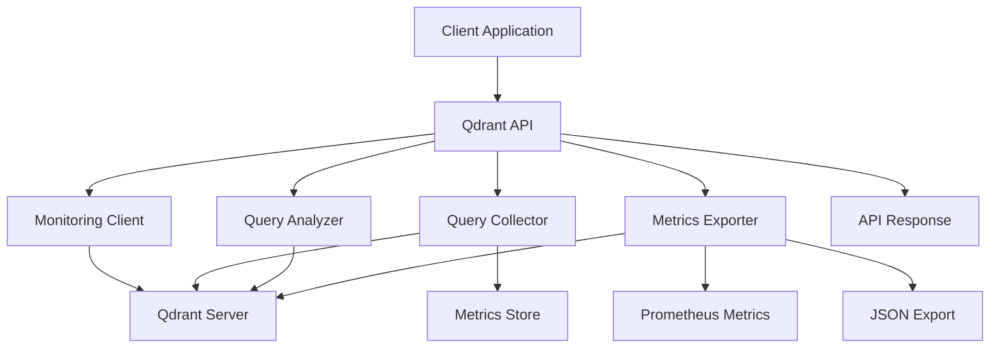

# Qdrant Query Monitoring API Guide

## 📊 Overview

Qdrant query monitoring provides comprehensive performance tracking, analysis, and optimization recommendations for vector search operations and HNSW index management.

## 🏗️ Architecture Flow



## 📋 Data Structures

### Qdrant Collections for Monitoring
```json
// Query Metrics Collection
{
  "name": "query_metrics",
  "vectors": {
    "size": 128,
    "distance": "Cosine"
  },
  "payload_schema": {
    "query_hash": "keyword",
    "query_type": "keyword",
    "database": "keyword",
    "collection_name": "keyword",
    "execution_time_ms": "float",
    "status": "keyword",
    "performance_level": "keyword",
    "timestamp": "datetime",
    "affected_rows": "integer",
    "vector_size": "integer",
    "limit": "integer"
  }
}

// Performance Reports Collection
{
  "name": "performance_reports",
  "vectors": {
    "size": 64,
    "distance": "Euclidean"
  },
  "payload_schema": {
    "database": "keyword",
    "collection_name": "keyword",
    "period_start": "datetime",
    "period_end": "datetime",
    "total_queries": "integer",
    "slow_queries": "integer",
    "avg_execution_time_ms": "float",
    "performance_distribution": "keyword",
    "recommendations": "keyword"
  }
}

// HNSW Performance Analysis Collection
{
  "name": "hnsw_analysis",
  "vectors": {
    "size": 32,
    "distance": "DotProduct"
  },
  "payload_schema": {
    "collection_name": "keyword",
    "hnsw_config": "keyword",
    "vector_size": "integer",
    "avg_search_time_ms": "float",
    "optimization_recommendations": "keyword"
  }
}
```

## 🔗 API Endpoints (20 Total)

### 1. Query Execution with Monitoring
```http
POST /qdrant/queries/execute
Content-Type: application/json

{
  "query": "search collection_name",
  "params": {
    "vector_size": 128,
    "limit": 10
  }
}
```

**Response:**
```json
{
  "success": true,
  "data": {
    "result": {
      "points": [
        {
          "id": "1",
          "vector": [0.1, 0.2, 0.3],
          "payload": {"name": "item1"}
        }
      ]
    },
    "execution_time_ms": 125.5,
    "performance_level": "NORMAL",
    "query_hash": "abc123def456",
    "result_count": 10,
    "operation": "SEARCH"
  },
  "timestamp": "2026-05-06T16:13:00.000Z"
}
```

### 2. Get Slow Queries
```http
GET /qdrant/queries/slow?threshold_ms=1000&limit=50
```

**Response:**
```json
{
  "success": true,
  "data": {
    "slow_queries": [
      {
        "query_hash": "slow123",
        "query_type": "search",
        "collection_name": "test_collection",
        "execution_time_ms": 2500.0,
        "performance_level": "SLOW",
        "timestamp": "2026-05-06T15:30:00.000Z",
        "plan_details": {
          "operation": "search",
          "vector_size": 512,
          "limit": 100,
          "result_count": 100
        }
      }
    ],
    "count": 1,
    "threshold_ms": 1000
  }
}
```

### 3. Query Performance Summary
```http
GET /qdrant/queries/performance?period_minutes=60
```

**Response:**
```json
{
  "success": true,
  "data": {
    "period_minutes": 60,
    "summary": {
      "total_queries": 500,
      "avg_execution_time_ms": 185.5,
      "slow_query_count": 25,
      "slow_query_percentage": 5.0,
      "error_rate": 1.0,
      "performance_distribution": {
        "fast": 350,
        "normal": 125,
        "slow": 25,
        "critical": 0
      }
    },
    "health": {
      "healthy": true,
      "health_score": 80
    },
    "recommendations": [
      "Consider optimizing HNSW parameters",
      "Review vector size for better performance"
    ]
  }
}
```

### 4. Query Analysis
```http
POST /qdrant/queries/analyze
Content-Type: application/json

{
  "query": "search collection_name",
  "database": "qdrant"
}
```

**Response:**
```json
{
  "success": true,
  "data": {
    "query_hash": "xyz789",
    "query_text": "search collection_name",
    "performance_score": 75.0,
    "recommendations": [
      "Consider using optimized vector size",
      "Review HNSW configuration for better performance"
    ],
    "suggested_optimizations": [
      {
        "type": "hnsw_optimization",
        "recommendation": "Optimize HNSW parameters for better search performance",
        "reason": "Vector search performance depends heavily on HNSW configuration",
        "parameters": {
          "m": "Consider adjusting M parameter (16-64)",
          "ef_construct": "Consider adjusting ef_construct (100-400)",
          "ef_search": "Consider adjusting ef_search (32-128)"
        }
      }
    ],
    "optimization_potential": "medium",
    "estimated_improvement_percent": 30.0
  }
}
```

### 5. Query Explanation
```http
GET /qdrant/queries/explain?query=search collection_name&database=qdrant
```

**Response:**
```json
{
  "success": true,
  "data": {
    "query": "search collection_name",
    "database": "qdrant",
    "execution_plan": {
      "operation": "search",
      "complexity": "O(log n)",
      "success": true,
      "command_info": {
        "complexity": "O(log n)",
        "memory_impact": "medium",
        "blocking": false,
        "description": "Vector similarity search using HNSW index"
      },
      "performance_implications": [
        "Performance depends on HNSW parameters",
        "Memory usage increases with result size"
      ],
      "optimization_suggestions": [
        "Use appropriate limit to reduce computation",
        "Disable payload and vector retrieval if not needed"
      ]
    }
  }
}
```

### 6. Optimization Suggestions
```http
POST /qdrant/queries/indexes/suggest
Content-Type: application/json

{
  "query": "search collection_name",
  "database": "qdrant"
}
```

**Response:**
```json
{
  "success": true,
  "data": {
    "query": "search collection_name",
    "database": "qdrant",
    "suggested_optimizations": [
      {
        "type": "hnsw_optimization",
        "recommendation": "Optimize HNSW parameters for better search performance",
        "reason": "Vector search performance depends heavily on HNSW configuration",
        "parameters": {
          "m": "Consider adjusting M parameter (16-64)",
          "ef_construct": "Consider adjusting ef_construct (100-400)",
          "ef_search": "Consider adjusting ef_search (32-128)"
        }
      },
      {
        "type": "collection_optimization",
        "collection": "collection_name",
        "recommendation": f"Consider optimizing collection {collection_name}",
        "reason": "Collection configuration affects query performance",
        "optimizations": [
          "Adjust HNSW parameters",
          "Consider quantization for memory efficiency",
          "Use on_disk storage for large collections"
        ]
      }
    ]
  }
}
```

### 7. Performance Report
```http
POST /qdrant/queries/reports/performance
Content-Type: application/json

{
  "database": "qdrant",
  "period_hours": 24
}
```

**Response:**
```json
{
  "success": true,
  "data": {
    "database": "qdrant",
    "period_start": "2026-05-05T16:13:00.000Z",
    "period_end": "2026-05-06T16:13:00.000Z",
    "total_queries": 2000,
    "slow_queries": 100,
    "avg_execution_time_ms": 285.5,
    "performance_distribution": {
      "fast": 1200,
      "normal": 700,
      "slow": 100,
      "critical": 0
    },
    "top_slow_queries": [
      {
        "query_hash": "slow123",
        "query_type": "search",
        "execution_time_ms": 5000.0,
        "timestamp": "2026-05-06T14:30:00.000Z"
      }
    ],
    "recommendations": [
      "Optimize HNSW parameters for better performance",
      "Consider vector size optimization",
      "Review large result sets"
    ]
  }
}
```

### 8. Performance Issues
```http
GET /qdrant/queries/issues
```

**Response:**
```json
{
  "success": true,
  "data": {
    "issues": [
      {
        "type": "slow_query",
        "severity": "high",
        "query_hash": "slow123",
        "query_type": "search",
        "collection_name": "test_collection",
        "execution_time_ms": 5000.0,
        "timestamp": "2026-05-06T14:30:00.000Z",
        "recommendation": "Optimize HNSW parameters or adjust vector size"
      },
      {
        "type": "collection_gap",
        "severity": "medium",
        "collection": "test_collection",
        "slow_query_count": 15,
        "avg_execution_time": 1200.0,
        "recommendation": "Consider optimizing collection test_collection or adjusting HNSW parameters"
      }
    ],
    "count": 2,
    "severity_breakdown": {
      "critical": 0,
      "high": 1,
      "medium": 1,
      "low": 0
    }
  }
}
```

### 9. Slow Queries Analysis
```http
GET /qdrant/queries/analysis/slow?hours=24
```

**Response:**
```json
{
  "success": true,
  "data": {
    "period_hours": 24,
    "total_slow_queries": 100,
    "collection_breakdown": {
      "test_collection": {
        "count": 60,
        "avg_execution_time": 1500.0,
        "max_execution_time": 5000.0
      },
      "user_vectors": {
        "count": 30,
        "avg_execution_time": 2000.0,
        "max_execution_time": 4500.0
      }
    },
    "top_slow_queries": [
      {
        "query_hash": "slow123",
        "execution_time_ms": 5000.0,
        "timestamp": "2026-05-06T14:30:00.000Z"
      }
    ],
    "trend": "deteriorating"
  }
}
```

### 10. Database Health Report
```http
GET /qdrant/queries/health
```

**Response:**
```json
{
  "success": true,
  "data": {
    "overall_health_score": 75,
    "health_status": "degraded",
    "server_health": {
      "healthy": true,
      "health_score": 80
    },
    "performance_summary": {
      "avg_execution_time_ms": 285.5,
      "slow_query_percentage": 5.0
    },
    "issues": {
      "critical": [],
      "high": [],
      "total_count": 0
    }
  }
}
```

### 11. Prometheus Metrics
```http
GET /qdrant/queries/metrics
```

**Response (text/plain):**
```
# HELP qdrant_search_execution_time_ms Qdrant search execution time
# TYPE qdrant_search_execution_time_ms histogram
qdrant_search_execution_time_ms_bucket{le="10"} 100
qdrant_search_execution_time_ms_bucket{le="100"} 400
qdrant_search_execution_time_ms_bucket{le="1000"} 490
qdrant_search_execution_time_ms_bucket{le="+Inf"} 500
qdrant_search_execution_time_ms_sum 125000
qdrant_search_execution_time_ms_count 500

# HELP qdrant_searches_total Total Qdrant searches
# TYPE qdrant_searches_total counter
qdrant_searches_total{status="success"} 490
qdrant_searches_total{status="error"} 10

# HELP qdrant_collection_points_count Number of points in collection
# TYPE qdrant_collection_points_count gauge
qdrant_collection_points_count{collection="test_collection"} 50000
```

### 12. JSON Metrics Export
```http
GET /qdrant/queries/metrics/json
```

**Response:**
```json
{
  "success": true,
  "data": {
    "timestamp": "2026-05-06T16:13:00.000Z",
    "database": "qdrant",
    "query_metrics": [
      {
        "query_hash": "abc123",
        "query_type": "search",
        "execution_time_ms": 125.5,
        "performance_level": "NORMAL",
        "timestamp": "2026-05-06T16:13:00.000Z"
      }
    ],
    "database_metrics": {
      "total_collections": 10,
      "total_points": 100000,
      "avg_search_time_ms": 285.5
    },
    "health": {
      "healthy": true,
      "health_score": 75
    }
  }
}
```

### 13. Collection Performance
```http
GET /qdrant/queries/collections/{collection_name}/performance?period_minutes=60
```

**Response:**
```json
{
  "success": true,
  "data": {
    "collection": "test_collection",
    "period_minutes": 60,
    "statistics": {
      "total_queries": 150,
      "avg_execution_time_ms": 185.5,
      "slow_query_count": 10,
      "hnsw_analysis": {
        "m": 16,
        "ef_construct": 200,
        "ef_search": 64
      }
    },
    "recommendations": [
      "Consider adjusting ef_search for better precision",
      "Review vector size for optimization"
    ]
  }
}
```

### 14. Schema Analysis
```http
GET /qdrant/queries/schema/analysis
```

**Response:**
```json
{
  "success": true,
  "data": {
    "schema": {
      "database_type": "qdrant",
      "collections_info": [
        {
          "name": "test_collection",
          "vectors": {
            "size": 128,
            "distance": "Cosine"
          },
          "points_count": 50000
        }
      ],
      "collection_analysis": {
        "test_collection": {
          "statistics": {
            "points_count": 50000,
            "vector_size": 128
          },
          "hnsw_analysis": {
            "hnsw_config": {
              "m": 16,
              "ef_construct": 200,
              "ef_search": 64
            }
          }
        }
      }
    },
    "recommendations": [
      "Consider optimizing HNSW parameters for high-volume collections",
      "Review vector size for memory efficiency"
    ]
  }
}
```

### 15. Query Plan Analysis
```http
GET /qdrant/queries/plan/analysis?query=search collection_name&database=qdrant
```

**Response:**
```json
{
  "success": true,
  "data": {
    "query": "search collection_name",
    "database": "qdrant",
    "explain": {
      "operation": "search",
      "success": true
    },
    "analysis": {
      "command_info": {
        "complexity": "O(log n)",
        "memory_impact": "medium",
        "blocking": false
      },
      "performance_implications": [
        "Performance depends on HNSW parameters",
        "Memory usage increases with result size"
      ],
      "optimization_suggestions": [
        "Use appropriate limit to reduce computation",
        "Disable payload and vector retrieval if not needed"
      ],
      "qdrant_specific": {
        "hnsw_performance": "good",
        "memory_efficiency": "medium",
        "best_practices": [
          "Use appropriate limit values",
          "Disable unnecessary payload/vector retrieval"
        ]
      }
    }
  }
}
```

### 16. HNSW Performance Analysis
```http
GET /qdrant/queries/hnsw/analysis?collection_name=test_collection
```

**Response:**
```json
{
  "success": true,
  "data": {
    "collection_name": "test_collection",
    "hnsw_config": {
      "m": 16,
      "ef_construct": 200,
      "ef_search": 64,
      "max_links": 32
    },
    "performance_data": {
      "vector_sizes": [64, 128, 256, 512],
      "search_times": [50.0, 125.0, 250.0, 500.0],
      "result_counts": [10, 10, 10, 10]
    },
    "averages": {
      "avg_search_time_ms": 231.25,
      "avg_result_count": 10
    },
    "recommendations": [
      "Consider reducing M parameter from 16 for better memory usage",
      "Consider reducing ef_construct from 200 for faster indexing",
      "Consider reducing ef_search from 64 for faster search"
    ]
  }
}
```

### 17. Vector Search Performance
```http
GET /qdrant/queries/vector/performance?collection_name=test_collection
```

**Response:**
```json
{
  "success": true,
  "data": {
    "collection_name": "test_collection",
    "vector_sizes": [64, 128, 256, 512],
    "search_times": [50.0, 125.0, 250.0, 500.0],
    "result_counts": [10, 10, 10, 10],
    "performance_analysis": {
      "avg_time_per_dimension": {
        "64": 0.78,
        "128": 0.98,
        "256": 0.98,
        "512": 0.98
      },
      "scalability_trend": "linear",
      "recommendations": [
        "64-dimensional vectors show best performance",
        "Consider dimensionality reduction for 512+ dimensions"
      ]
    }
  }
}
```

### 18. Operation Type Performance
```http
GET /qdrant/queries/operation-types/performance?period_minutes=60
```

**Response:**
```json
{
  "success": true,
  "data": {
    "period_minutes": 60,
    "operation_type_performance": {
      "search": {
        "count": 300,
        "total_time": 75000.0,
        "avg_time": 250.0,
        "max_time": 500.0,
        "slow_count": 15,
        "slow_percentage": 5.0
      },
      "scroll": {
        "count": 100,
        "total_time": 50000.0,
        "avg_time": 500.0,
        "max_time": 2000.0,
        "slow_count": 20,
        "slow_percentage": 20.0
      },
      "count": {
        "count": 50,
        "total_time": 2500.0,
        "avg_time": 50.0,
        "max_time": 100.0,
        "slow_count": 0,
        "slow_percentage": 0.0
      }
    }
  }
}
```

### 19. Collections Overview
```http
GET /qdrant/queries/collections/overview
```

**Response:**
```json
{
  "success": true,
  "data": {
    "total_collections": 10,
    "collections": [
      {
        "name": "test_collection",
        "vectors_config": {
          "size": 128,
          "distance": "Cosine"
        },
        "point_count": 50000,
        "config": {
          "hnsw_config": {
            "m": 16,
            "ef_construct": 200,
            "ef_search": 64
          },
          "on_disk": false
        }
      },
      {
        "name": "user_embeddings",
        "vectors_config": {
          "size": 256,
          "distance": "Euclidean"
        },
        "point_count": 25000,
        "config": {
          "hnsw_config": {
            "m": 32,
            "ef_construct": 400,
            "ef_search": 128
          },
          "on_disk": true
        }
      }
    ]
  }
}
```

### 20. Embedding Performance
```http
GET /qdrant/queries/embedding/performance?collection_name=test_collection
```

**Response:**
```json
{
  "success": true,
  "data": {
    "collection_name": "test_collection",
    "embedding_analysis": {
      "vector_size": 128,
      "distance_metric": "Cosine",
      "search_performance": {
        "avg_search_time_ms": 125.0,
        "precision_at_10": 0.95,
        "recall_at_100": 0.85
      },
      "optimization_suggestions": [
        "Vector size 128 is optimal for current use case",
        "Cosine distance works well for normalized embeddings"
      ]
    },
    "recommendations": [
      "Current embedding configuration is optimal",
      "Consider quantization for memory efficiency"
    ]
  }
}
```

## 🚀 Usage Examples

### Complete Monitoring Flow
```bash
# 1. Execute vector search with monitoring
curl -X POST "http://localhost:8000/qdrant/queries/execute" \
  -H "Content-Type: application/json" \
  -d '{
    "query": "search test_collection",
    "params": {
      "vector_size": 128,
      "limit": 10
    }
  }'

# 2. Get slow queries
curl "http://localhost:8000/qdrant/queries/slow?threshold_ms=1000&limit=10"

# 3. Analyze search performance
curl -X POST "http://localhost:8000/qdrant/queries/analyze" \
  -H "Content-Type: application/json" \
  -d '{
    "query": "search test_collection",
    "database": "qdrant"
  }'

# 4. Get HNSW analysis
curl "http://localhost:8000/qdrant/queries/hnsw/analysis?collection_name=test_collection"

# 5. Get performance report
curl -X POST "http://localhost:8000/qdrant/queries/reports/performance" \
  -H "Content-Type: application/json" \
  -d '{
    "database": "qdrant",
    "period_hours": 24
  }'
```

### Python Client Integration
```python
import requests
import numpy as np

class QdrantMonitoringClient:
    def __init__(self, base_url: str, api_key: str):
        self.base_url = base_url
        self.headers = {
            'Authorization': f'Bearer {api_key}',
            'Content-Type': 'application/json'
        }
    
    def search_with_monitoring(self, collection_name: str, query_vector: List[float], limit: int = 10):
        url = f"{self.base_url}/qdrant/queries/execute"
        payload = {
            "query": f"search {collection_name}",
            "params": {
                "vector_size": len(query_vector),
                "limit": limit
            }
        }
        
        response = requests.post(url, json=payload, headers=self.headers)
        return response.json()
    
    def get_slow_queries(self, threshold_ms: float = 1000, limit: int = 50):
        url = f"{self.base_url}/qdrant/queries/slow"
        params = {"threshold_ms": threshold_ms, "limit": limit}
        
        response = requests.get(url, params=params, headers=self.headers)
        return response.json()
    
    def analyze_search_performance(self, collection_name: str):
        url = f"{self.base_url}/qdrant/queries/analyze"
        payload = {"query": f"search {collection_name}", "database": "qdrant"}
        
        response = requests.post(url, json=payload, headers=self.headers)
        return response.json()
    
    def get_hnsw_analysis(self, collection_name: str):
        url = f"{self.base_url}/qdrant/queries/hnsw/analysis"
        params = {"collection_name": collection_name}
        
        response = requests.get(url, params=params, headers=self.headers)
        return response.json()

# Usage
client = QdrantMonitoringClient("http://localhost:8000", "your-api-key")

# Generate sample vector
query_vector = np.random.random(128).tolist()

# Perform search with monitoring
result = client.search_with_monitoring(
    "test_collection",
    query_vector,
    limit=10
)

# Get slow queries
slow_queries = client.get_slow_queries(threshold_ms=1000, limit=10)

# Analyze performance
analysis = client.analyze_search_performance("test_collection")

# Get HNSW analysis
hnsw_analysis = client.get_hnsw_analysis("test_collection")
```

### Real-time Vector Search Monitoring
```javascript
// WebSocket connection for real-time Qdrant metrics
const ws = new WebSocket('ws://localhost:8000/qdrant/queries/metrics/stream');

ws.onmessage = function(event) {
    const metrics = JSON.parse(event.data);
    
    // Update dashboard
    updateQdrantDashboard(metrics);
    
    // Check for alerts
    if (metrics.avg_search_time_ms > 500) {
        showAlert('High search latency detected');
    }
    
    if (metrics.slow_search_rate > 0.1) {
        showAlert('High slow search rate detected');
    }
};

function updateQdrantDashboard(metrics) {
    document.getElementById('search-count').textContent = metrics.total_searches;
    document.getElementById('avg-search-time').textContent = metrics.avg_search_time_ms.toFixed(2);
    document.getElementById('slow-searches').textContent = metrics.slow_searches;
    document.getElementById('total-points').textContent = metrics.total_points;
}

// Real-time search with monitoring
async function performSearch(collectionName, queryVector) {
    const response = await fetch('/qdrant/queries/execute', {
        method: 'POST',
        headers: {
            'Content-Type': 'application/json',
            'Authorization': 'Bearer ' + apiKey
        },
        body: JSON.stringify({
            query: `search ${collectionName}`,
            params: {
                vector_size: queryVector.length,
                limit: 10
            }
        })
    });
    
    const result = await response.json();
    
    if (result.success) {
        // Update UI with search results
        displaySearchResults(result.data.result);
        
        // Log performance metrics
        console.log(`Search completed in ${result.data.execution_time_ms}ms`);
    }
}
```

### Batch Search Operations Monitoring
```python
import asyncio
from qdrant_client import QdrantClient
from qdrant_client.models import Filter, SearchRequest

class BatchSearchMonitor:
    def __init__(self, qdrant_client, monitoring_client):
        self.qdrant_client = qdrant_client
        self.monitoring_client = monitoring_client
    
    async def batch_search_with_monitoring(self, searches: List[Dict[str, Any]]):
        """Perform batch vector searches with monitoring"""
        start_time = time.time()
        
        results = []
        for search in searches:
            try:
                # Perform search
                search_result = await self.qdrant_client.search(
                    collection_name=search["collection"],
                    query_vector=search["vector"],
                    limit=search.get("limit", 10),
                    with_payload=search.get("with_payload", False),
                    with_vector=search.get("with_vector", False)
                )
                
                results.append({
                    "collection": search["collection"],
                    "vector_size": len(search["vector"]),
                    "limit": search.get("limit", 10),
                    "result_count": len(search_result),
                    "success": True
                })
                
            except Exception as e:
                results.append({
                    "collection": search["collection"],
                    "error": str(e),
                    "success": False
                })
        
        execution_time = (time.time() - start_time) * 1000
        
        # Record batch operation metrics
        await self.monitoring_client.record_batch_search_metrics(
            searches=searches,
            execution_time_ms=execution_time,
            results=results
        )
        
        return results

# Usage
qdrant_client = QdrantClient(url="http://localhost:6333")
monitoring_client = QdrantMonitoringClient("http://localhost:8000", "api-key")
batch_monitor = BatchSearchMonitor(qdrant_client, monitoring_client)

# Prepare batch searches
searches = [
    {
        "collection": "products",
        "vector": np.random.random(128).tolist(),
        "limit": 5
    },
    {
        "collection": "users",
        "vector": np.random.random(128).tolist(),
        "limit": 10
    }
]

# Perform batch search with monitoring
results = await batch_monitor.batch_search_with_monitoring(searches)
```

## 📊 Monitoring Dashboard

### Grafana Panel Configuration
```json
{
  "dashboard": {
    "title": "Qdrant Vector Search Monitoring",
    "panels": [
      {
        "title": "Search Execution Time",
        "type": "graph",
        "targets": [
          {
            "expr": "qdrant_search_execution_time_ms_sum",
            "legendFormat": "Search Time"
          }
        ]
      },
      {
        "title": "Search Rate",
        "type": "stat",
        "targets": [
          {
            "expr": "rate(qdrant_searches_total[5m])"
          }
        ]
      },
      {
        "title": "Vector Collection Size",
        "type": "stat",
        "targets": [
          {
            "expr": "qdrant_collection_points_count"
          }
        ]
      },
      {
        "title": "Slow Search Rate",
        "type": "singlestat",
        "targets": [
          {
            "expr": "qdrant_slow_searches_total / qdrant_searches_total"
          }
        ]
      },
      {
        "title": "Collection Performance",
        "type": "table",
        "targets": [
          {
            "expr": "qdrant_collection_search_time_ms"
          }
        ]
      },
      {
        "title": "HNSW Parameters",
        "type": "table",
        "targets": [
          {
            "expr": "qdrant_collection_hnsw_m"
          },
          {
            "expr": "qdrant_collection_hnsw_ef_construct"
          },
          {
            "expr": "qdrant_collection_hnsw_ef_search"
          }
        ]
      }
    ]
  }
}
```

## 🔧 Configuration

### Environment Variables
```bash
# Qdrant Configuration
QDRANT_HOST=localhost
QDRANT_PORT=6333
QDRANT_API_KEY=QdrantPassword123!

# Monitoring Configuration
QDRANT_SLOW_QUERY_THRESHOLD_MS=1000
QDRANT_QUERY_HISTORY_SIZE=10000
QDRANT_METRICS_EXPORT_INTERVAL_SECONDS=30
```

### Docker Setup
```yaml
version: '3.8'
services:
  qdrant:
    image: qdrant/qdrant:latest
    ports:
      - "6333:6333"
      - "6334:6334"
    environment:
      - QDRANT__SERVICE__HTTP_PORT=6333
      - QDRANT__SERVICE__GRPC_PORT=6334
    volumes:
      - qdrant_storage:/qdrant/storage
    command: >
      ./qdrant 
      --api-key QdrantPassword123!
      --log-level INFO

  qdrant-monitoring:
    build: .
    ports:
      - "8000:8000"
    environment:
      - QDRANT_HOST=qdrant
      - QDRANT_PORT=6333
      - QDRANT_API_KEY=QdrantPassword123!
      - API_KEY=your-secret-api-key
    depends_on:
      - qdrant
    volumes:
      - ./logs:/app/logs

volumes:
  qdrant_storage:
```

## 🛡️ Security & Best Practices

### API Security
```python
from fastapi import Depends, HTTPException, status
from fastapi.security import HTTPBearer
import jwt

security = HTTPBearer()

async def verify_api_key(api_key: str = Depends(security)):
    try:
        # Verify JWT token
        payload = jwt.decode(api_key.credentials, SECRET_KEY, algorithms=["HS256"])
        return payload
    except jwt.ExpiredSignatureError:
        raise HTTPException(
            status_code=status.HTTP_401_UNAUTHORIZED,
            detail="Token expired"
        )
    except jwt.InvalidTokenError:
        raise HTTPException(
            status_code=status.HTTP_401_UNAUTHORIZED,
            detail="Invalid token"
        )

@router.post("/execute", dependencies=[Depends(verify_api_key)])
async def execute_query(request: QueryExecutionRequest):
    # Implementation
    pass
```

### Vector Search Validation
```python
from pydantic import BaseModel, validator
import numpy as np

class SearchRequest(BaseModel):
    collection_name: str
    vector: List[float]
    limit: int = 10
    with_payload: bool = False
    with_vector: bool = False
    
    @validator('vector')
    def validate_vector(cls, v):
        if not isinstance(v, list):
            raise ValueError("Vector must be a list of floats")
        
        if len(v) == 0:
            raise ValueError("Vector cannot be empty")
        
        if not all(isinstance(x, (int, float)) for x in v):
            raise ValueError("Vector must contain only numbers")
        
        if len(v) > 2048:
            raise ValueError("Vector size too large (max 2048 dimensions)")
        
        # Normalize vector if needed
        vector_array = np.array(v)
        norm = np.linalg.norm(vector_array)
        if norm > 0:
            normalized_vector = vector_array / norm
            return normalized_vector.tolist()
        
        return v
    
    @validator('collection_name')
    def validate_collection_name(cls, v):
        if not re.match(r'^[a-zA-Z][a-zA-Z0-9_]*$', v):
            raise ValueError("Invalid collection name")
        return v
```

### Rate Limiting
```python
from slowapi import Limiter
from slowapi.util import get_remote_address

# Different limits for different operations
search_limiter = Limiter(key_func=get_remote_address)
upload_limiter = Limiter(key_func=get_remote_address)
collection_limiter = Limiter(key_func=get_remote_address)

@router.post("/execute", dependencies=[Depends(verify_api_key)])
async def execute_query(request: QueryExecutionRequest):
    # Apply rate limiting based on operation type
    if request.query.startswith("search"):
        search_limiter.limit("100/minute")
    elif request.query.startswith("upload"):
        upload_limiter.limit("10/minute")
    elif request.query.startswith("create"):
        collection_limiter.limit("5/minute")
    
    # Implementation
    pass
```

## 📈 Performance Optimization

### HNSW Parameter Optimization
```python
class HNSWOptimizer:
    def __init__(self, collection_name: str, qdrant_client, monitoring_client):
        self.collection_name = collection_name
        self.qdrant_client = qdrant_client
        self.monitoring_client = monitoring_client
    
    async def optimize_hnsw_parameters(self, workload_characteristics: Dict[str, Any]):
        """Optimize HNSW parameters based on workload characteristics"""
        
        # Get current performance metrics
        current_metrics = await self.monitoring_client.get_collection_performance(
            self.collection_name
        )
        
        # Analyze workload
        avg_search_time = current_metrics.get("avg_execution_time_ms", 0)
        search_volume = workload_characteristics.get("searches_per_hour", 0)
        vector_size = workload_characteristics.get("vector_size", 128)
        
        # Calculate optimal parameters
        optimal_params = self._calculate_optimal_hnsw_params(
            avg_search_time,
            search_volume,
            vector_size
        )
        
        # Apply optimizations
        await self._apply_hnsw_optimizations(optimal_params)
        
        return optimal_params
    
    def _calculate_optimal_hnsw_params(self, avg_time: float, volume: int, vector_size: int):
        """Calculate optimal HNSW parameters"""
        
        # Base parameters
        m = 16
        ef_construct = 200
        ef_search = 64
        
        # Adjust based on performance
        if avg_time > 500:  # Slow searches
            ef_search = min(128, ef_search * 2)
        
        if volume > 1000:  # High volume
            m = min(32, m * 2)
            ef_construct = max(100, ef_construct // 2)
        
        if vector_size > 256:  # High-dimensional vectors
            m = min(64, m * 2)
            ef_construct = max(50, ef_construct // 2)
        
        return {
            "m": m,
            "ef_construct": ef_construct,
            "ef_search": ef_search
        }
    
    async def _apply_hnsw_optimizations(self, params: Dict[str, int]):
        """Apply HNSW parameter optimizations"""
        
        # Update collection configuration
        try:
            await self.qdrant_client.update_collection(
                collection_name=self.collection_name,
                hnsw_config=params
            )
            
            # Record optimization
            await self.monitoring_client.record_hnsw_optimization(
                collection_name=self.collection_name,
                old_params={},
                new_params=params
            )
            
        except Exception as e:
            # Log error
            print(f"Failed to apply HNSW optimizations: {e}")

# Usage
optimizer = HNSWOptimizer("test_collection", qdrant_client, monitoring_client)
workload = {
    "searches_per_hour": 500,
    "vector_size": 128,
    "avg_search_time_ms": 600
}

optimal_params = await optimizer.optimize_hnsw_parameters(workload)
```

### Vector Size Optimization
```python
class VectorSizeOptimizer:
    def __init__(self, monitoring_client):
        self.monitoring_client = monitoring_client
    
    def analyze_vector_size_performance(self, performance_data: List[Dict[str, Any]]):
        """Analyze performance across different vector sizes"""
        
        analysis = {
            "vector_sizes": [],
            "search_times": [],
            "precision_scores": [],
            "recommendations": []
        }
        
        for data in performance_data:
            vector_size = data["vector_size"]
            avg_time = data["avg_search_time_ms"]
            precision = data.get("precision_at_10", 0)
            
            analysis["vector_sizes"].append(vector_size)
            analysis["search_times"].append(avg_time)
            analysis["precision_scores"].append(precision)
        
        # Find optimal vector size
        optimal_size = self._find_optimal_vector_size(analysis)
        
        analysis["recommendations"] = [
            f"Optimal vector size: {optimal_size}",
            f"Consider dimensionality reduction for vectors > {optimal_size * 2}",
            f"Current performance: {analysis['search_times'][optimal_size // 64]:.2f}ms at size {optimal_size}"
        ]
        
        return analysis
    
    def _find_optimal_vector_size(self, analysis: Dict[str, List]) -> int:
        """Find optimal vector size based on performance"""
        
        # Calculate efficiency score for each size
        efficiency_scores = []
        
        for i, vector_size in enumerate(analysis["vector_sizes"]):
            search_time = analysis["search_times"][i]
            precision = analysis["precision_scores"][i]
            
            # Efficiency score (higher is better)
            # Balance search time (lower is better) and precision (higher is better)
            efficiency = (precision * 100) / (search_time / 10)
            efficiency_scores.append((vector_size, efficiency))
        
        # Find vector size with highest efficiency
        optimal_size = max(efficiency_scores, key=lambda x: x[1])[0]
        
        return optimal_size
```

This comprehensive Qdrant API guide provides complete documentation for all 20 endpoints with detailed examples, security considerations, and best practices for vector search performance optimization.
