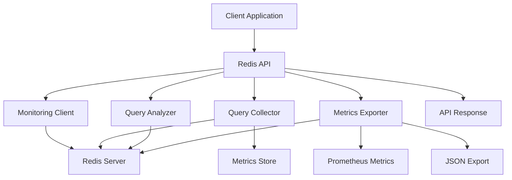

# Redis Query Monitoring API Guide

## 📊 Overview

Redis query monitoring provides comprehensive performance tracking, analysis, and optimization recommendations for Redis commands and data structures.

## 🏗️ Architecture Flow



## 📋 Data Structures

### Redis Keys for Monitoring
```redis
# Query Metrics (Hash)
HMSET query_metrics:{query_hash}
  query_type "GET"
  database "redis"
  execution_time_ms 45.5
  status "SUCCESS"
  performance_level "FAST"
  timestamp "2026-05-06T16:13:00Z"
  affected_rows 1
  command "GET"
  key_count 1

# Performance Reports (Hash)
HMSET performance_reports:{report_id}
  database "redis"
  period_start "2026-05-05T16:13:00Z"
  period_end "2026-05-06T16:13:00Z"
  total_queries 1500
  slow_queries 5
  avg_execution_time_ms 25.3

# Slow Queries List (Sorted Set)
ZADD slow_queries 1500.0 "query_hash_1"
ZADD slow_queries 1200.0 "query_hash_2"

# Command Statistics (Hash)
HMSET command_stats:{command_type}
  total_count 500
  avg_execution_time 25.5
  slow_count 5
  error_count 2

# Key Statistics (Hash)
HMSET key_stats:{key_pattern}
  total_keys 1000
  key_types "string:800,hash:200"
  avg_memory_usage 512
  ttl_distribution "no_ttl:600,short_ttl:400"

# Connection Metrics (Hash)
HMSET connection_metrics
  connected_clients 25
  total_connections 1000
  instantaneous_ops_per_sec 150
```

## 🔗 API Endpoints (19 Total)

### 1. Query Execution with Monitoring
```http
POST /redis/queries/execute
Content-Type: application/json

{
  "query": "GET user:123",
  "params": {}
}
```

**Response:**
```json
{
  "success": true,
  "data": {
    "result": "user_data",
    "execution_time_ms": 2.5,
    "performance_level": "FAST",
    "query_hash": "abc123def456",
    "command": "GET",
    "key_count": 1
  },
  "timestamp": "2026-05-06T16:13:00.000Z"
}
```

### 2. Get Slow Queries
```http
GET /redis/queries/slow?threshold_ms=1000&limit=50
```

**Response:**
```json
{
  "success": true,
  "data": {
    "slow_queries": [
      {
        "query_hash": "slow123",
        "query_type": "KEYS",
        "execution_time_ms": 1500.0,
        "performance_level": "SLOW",
        "timestamp": "2026-05-06T15:30:00.000Z",
        "command": "KEYS",
        "plan_details": {
          "command": "KEYS",
          "args": ["*"],
          "key_count": 10000
        }
      }
    ],
    "count": 1,
    "threshold_ms": 1000
  }
}
```

### 3. Query Performance Summary
```http
GET /redis/queries/performance?period_minutes=60
```

**Response:**
```json
{
  "success": true,
  "data": {
    "period_minutes": 60,
    "summary": {
      "total_queries": 2500,
      "avg_execution_time_ms": 15.5,
      "slow_query_count": 15,
      "slow_query_percentage": 0.6,
      "error_rate": 0.2,
      "performance_distribution": {
        "fast": 2300,
        "normal": 185,
        "slow": 15,
        "critical": 0
      }
    },
    "health": {
      "healthy": true,
      "health_score": 90
    },
    "recommendations": [
      "Replace KEYS operations with SCAN",
      "Consider using pipelining for batch operations"
    ]
  }
}
```

### 4. Query Analysis
```http
POST /redis/queries/analyze
Content-Type: application/json

{
  "query": "GET user:123",
  "database": "redis"
}
```

**Response:**
```json
{
  "success": true,
  "data": {
    "query_hash": "xyz789",
    "query_text": "GET user:123",
    "performance_score": 95.0,
    "recommendations": [
      "GET operation is optimal",
      "Consider using hash structure for complex data"
    ],
    "suggested_optimizations": [
      {
        "type": "data_structure",
        "recommendation": "Consider using HASH for structured data",
        "reason": "Optimal data structure selection improves performance"
      }
    ],
    "optimization_potential": "low",
    "estimated_improvement_percent": 5.0
  }
}
```

### 5. Query Explanation
```http
GET /redis/queries/explain?query=GET user:123&database=redis
```

**Response:**
```json
{
  "success": true,
  "data": {
    "query": "GET user:123",
    "database": "redis",
    "execution_plan": {
      "command": "GET",
      "complexity": "O(1)",
      "memory_impact": "low",
      "blocking": false,
      "command_info": {
        "complexity": "O(1)",
        "memory_impact": "low",
        "blocking": false,
        "description": "Get value by key"
      },
      "performance_implications": [
        "O(1) time complexity",
        "Low memory usage"
      ],
      "optimization_suggestions": [
        "GET is already optimal",
        "Consider using MGET for multiple keys"
      ]
    }
  }
}
```

### 6. Optimization Suggestions
```http
POST /redis/queries/indexes/suggest
Content-Type: application/json

{
  "query": "GET user:123",
  "database": "redis"
}
```

**Response:**
```json
{
  "success": true,
  "data": {
    "query": "GET user:123",
    "database": "redis",
    "suggested_optimizations": [
      {
        "type": "data_structure",
        "recommendation": "Consider using HASH for structured data",
        "reason": "Optimal data structure selection improves performance",
        "alternatives": ["HGETALL", "HMSET"]
      }
    ]
  }
}
```

### 7. Performance Report
```http
POST /redis/queries/reports/performance
Content-Type: application/json

{
  "database": "redis",
  "period_hours": 24
}
```

**Response:**
```json
{
  "success": true,
  "data": {
    "database": "redis",
    "period_start": "2026-05-05T16:13:00.000Z",
    "period_end": "2026-05-06T16:13:00.000Z",
    "total_queries": 5000,
    "slow_queries": 25,
    "avg_execution_time_ms": 18.5,
    "performance_distribution": {
      "fast": 4500,
      "normal": 475,
      "slow": 25,
      "critical": 0
    },
    "top_slow_queries": [
      {
        "query_hash": "slow123",
        "query_type": "KEYS",
        "execution_time_ms": 2000.0,
        "timestamp": "2026-05-06T14:30:00.000Z"
      }
    ],
    "recommendations": [
      "Replace KEYS operations with SCAN",
      "Use pipelining for batch operations",
      "Consider using appropriate data structures"
    ]
  }
}
```

### 8. Performance Issues
```http
GET /redis/queries/issues
```

**Response:**
```json
{
  "success": true,
  "data": {
    "issues": [
      {
        "type": "slow_query",
        "severity": "high",
        "query_hash": "slow123",
        "query_type": "KEYS",
        "execution_time_ms": 2000.0,
        "timestamp": "2026-05-06T14:30:00.000Z",
        "recommendation": "Replace KEYS with SCAN for production environments"
      },
      {
        "type": "command_gap",
        "severity": "medium",
        "command_type": "keys",
        "slow_query_count": 10,
        "avg_execution_time": 1500.0,
        "recommendation": "Consider using SCAN instead of KEYS operations"
      }
    ],
    "count": 2,
    "severity_breakdown": {
      "critical": 0,
      "high": 1,
      "medium": 1,
      "low": 0
    }
  }
}
```

### 9. Slow Queries Analysis
```http
GET /redis/queries/analysis/slow?hours=24
```

**Response:**
```json
{
  "success": true,
  "data": {
    "period_hours": 24,
    "total_slow_queries": 25,
    "command_breakdown": {
      "keys": {
        "count": 15,
        "avg_execution_time": 1200.0,
        "max_execution_time": 3000.0
      },
      "flushall": {
        "count": 5,
        "avg_execution_time": 2500.0,
        "max_execution_time": 5000.0
      }
    },
    "top_slow_queries": [
      {
        "query_hash": "slow123",
        "execution_time_ms": 5000.0,
        "timestamp": "2026-05-06T14:30:00.000Z"
      }
    ],
    "trend": "stable"
  }
}
```

### 10. Database Health Report
```http
GET /redis/queries/health
```

**Response:**
```json
{
  "success": true,
  "data": {
    "overall_health_score": 90,
    "health_status": "healthy",
    "server_health": {
      "healthy": true,
      "health_score": 95
    },
    "performance_summary": {
      "avg_execution_time_ms": 18.5,
      "slow_query_percentage": 0.5
    },
    "issues": {
      "critical": [],
      "high": [],
      "total_count": 0
    }
  }
}
```

### 11. Prometheus Metrics
```http
GET /redis/queries/metrics
```

**Response (text/plain):**
```
# HELP redis_command_execution_time_ms Redis command execution time
# TYPE redis_command_execution_time_ms histogram
redis_command_execution_time_ms_bucket{le="1"} 1000
redis_command_execution_time_ms_bucket{le="10"} 4800
redis_command_execution_time_ms_bucket{le="100"} 4950
redis_command_execution_time_ms_bucket{le="+Inf"} 5000
redis_command_execution_time_ms_sum 75000
redis_command_execution_time_ms_count 5000

# HELP redis_commands_total Total Redis commands
# TYPE redis_commands_total counter
redis_commands_total{status="success"} 4950
redis_commands_total{status="error"} 50

# HELP redis_memory_used_bytes Redis memory usage
# TYPE redis_memory_used_bytes gauge
redis_memory_used_bytes 104857600
```

### 12. JSON Metrics Export
```http
GET /redis/queries/metrics/json
```

**Response:**
```json
{
  "success": true,
  "data": {
    "timestamp": "2026-05-06T16:13:00.000Z",
    "database": "redis",
    "query_metrics": [
      {
        "query_hash": "abc123",
        "query_type": "GET",
        "execution_time_ms": 2.5,
        "performance_level": "FAST",
        "timestamp": "2026-05-06T16:13:00.000Z"
      }
    ],
    "database_metrics": {
      "connected_clients": 25,
      "total_commands_processed": 5000,
      "used_memory_bytes": 104857600
    },
    "health": {
      "healthy": true,
      "health_score": 90
    }
  }
}
```

### 13. Key Analysis
```http
GET /redis/queries/keys/analysis?pattern=user:*
```

**Response:**
```json
{
  "success": true,
  "data": {
    "key_pattern": "user:*",
    "statistics": {
      "total_keys": 1000,
      "key_types": {
        "string": 800,
        "hash": 200
      },
      "sample_memory_usage": {
        "user:1": 512,
        "user:2": 256
      },
      "ttl_distribution": {
        "no_ttl": 600,
        "short_ttl": 300,
        "medium_ttl": 100
      }
    },
    "recommendations": [
      "Consider setting TTL for keys to manage memory usage",
      "High number of string keys - consider using HASH for structured data"
    ]
  }
}
```

### 14. Schema Analysis
```http
GET /redis/queries/schema/analysis
```

**Response:**
```json
{
  "success": true,
  "data": {
    "schema": {
      "database_type": "redis",
      "keyspace_analysis": {
        "total_keys": 5000,
        "key_types": {
          "string": 3000,
          "hash": 1500,
          "list": 300,
          "set": 150,
          "zset": 50
        }
      },
      "database_metrics": {
        "used_memory_bytes": 524288000,
        "connected_clients": 25
      }
    },
    "recommendations": [
      "Consider using HASH for structured string data",
      "Set TTL for keys to manage memory usage",
      "Review key naming conventions"
    ]
  }
}
```

### 15. Query Plan Analysis
```http
GET /redis/queries/plan/analysis?query=GET user:123&database=redis
```

**Response:**
```json
{
  "success": true,
  "data": {
    "query": "GET user:123",
    "database": "redis",
    "explain": {
      "command": "GET",
      "complexity": "O(1)",
      "success": true
    },
    "analysis": {
      "command_info": {
        "complexity": "O(1)",
        "memory_impact": "low",
        "blocking": false
      },
      "performance_implications": [
        "O(1) time complexity",
        "Low memory usage"
      ],
      "optimization_suggestions": [
        "GET is already optimal"
      ],
      "redis_specific": {
        "memory_efficiency": "high",
        "scalability": "excellent",
        "best_practices": [
          "Use appropriate key naming",
          "Consider TTL for expiration"
        ]
      }
    }
  }
}
```

### 16. Slow Log Analysis
```http
GET /redis/queries/slow-log?limit=50
```

**Response:**
```json
{
  "success": true,
  "data": {
    "total_slow_queries": 15,
    "analysis": {
      "total_slow_queries": 15,
      "avg_execution_time_micros": 1500000,
      "max_execution_time_micros": 5000000,
      "command_distribution": {
        "keys": 10,
        "flushall": 3,
        "scan": 2
      },
      "time_distribution": {
        "0-1h": 5,
        "1-6h": 7,
        "6-24h": 3
      }
    },
    "slow_queries": [
      {
        "id": 1,
        "timestamp": "2026-05-06T15:30:00.000Z",
        "execution_time_micros": 5000000,
        "command": ["KEYS", "*"],
        "client_info": "127.0.0.1:12345"
      }
    ]
  }
}
```

### 17. Command Type Performance
```http
GET /redis/queries/command-types/performance?period_minutes=60
```

**Response:**
```json
{
  "success": true,
  "data": {
    "period_minutes": 60,
    "command_type_performance": {
      "get": {
        "count": 2000,
        "total_time": 5000.0,
        "avg_time": 2.5,
        "max_time": 10.0,
        "slow_count": 5,
        "slow_percentage": 0.25
      },
      "set": {
        "count": 1500,
        "total_time": 6000.0,
        "avg_time": 4.0,
        "max_time": 15.0,
        "slow_count": 10,
        "slow_percentage": 0.67
      },
      "keys": {
        "count": 50,
        "total_time": 75000.0,
        "avg_time": 1500.0,
        "max_time": 5000.0,
        "slow_count": 30,
        "slow_percentage": 60.0
      }
    }
  }
}
```

### 18. Memory Analysis
```http
GET /redis/queries/memory/analysis
```

**Response:**
```json
{
  "success": true,
  "data": {
    "memory_info": {
      "used_memory": 104857600,
      "used_memory_rss": 209715200,
      "used_memory_peak": 157286400,
      "maxmemory": 1073741824,
      "mem_fragmentation_ratio": 2.0
    },
    "key_statistics": {
      "total_keys": 5000,
      "avg_key_size": 2048,
      "large_keys": 50
    },
    "recommendations": [
      "Memory usage is high - consider optimization",
      "High memory fragmentation detected - consider Redis restart",
      "Consider using memory-efficient data structures"
    ]
  }
}
```

### 19. Data Structures Analysis
```http
GET /redis/queries/data-structures/analysis
```

**Response:**
```json
{
  "success": true,
  "data": {
    "data_structure_analysis": {
      "string_keys": {
        "count": 3000,
        "avg_size": 512,
        "recommendations": [
          "Consider using HASH for structured data",
          "Review large string values"
        ]
      },
      "hash_keys": {
        "count": 1500,
        "avg_fields": 10,
        "recommendations": [
          "Hash structure is optimal for structured data",
          "Consider using HSCAN for large hashes"
        ]
      },
      "list_keys": {
        "count": 300,
        "avg_length": 100,
        "recommendations": [
          "Consider using LTRIM for bounded lists",
          "Use streaming for large lists"
        ]
      }
    },
    "optimization_suggestions": [
      "Use appropriate data structures for your use case",
      "Consider memory-efficient alternatives for large datasets"
    ]
  }
}
```

## 🚀 Usage Examples

### Complete Monitoring Flow
```bash
# 1. Execute query with monitoring
curl -X POST "http://localhost:8000/redis/queries/execute" \
  -H "Content-Type: application/json" \
  -d '{
    "query": "GET user:123",
    "params": {}
  }'

# 2. Get slow queries
curl "http://localhost:8000/redis/queries/slow?threshold_ms=1000&limit=10"

# 3. Analyze query performance
curl -X POST "http://localhost:8000/redis/queries/analyze" \
  -H "Content-Type: application/json" \
  -d '{
    "query": "GET user:123",
    "database": "redis"
  }'

# 4. Get performance report
curl -X POST "http://localhost:8000/redis/queries/reports/performance" \
  -H "Content-Type: application/json" \
  -d '{
    "database": "redis",
    "period_hours": 24
  }'
```

### Python Client Integration
```python
import redis
import requests

class RedisMonitoringClient:
    def __init__(self, base_url: str, api_key: str):
        self.base_url = base_url
        self.headers = {
            'Authorization': f'Bearer {api_key}',
            'Content-Type': 'application/json'
        }
    
    def execute_command(self, command: str, **kwargs):
        url = f"{self.base_url}/redis/queries/execute"
        payload = {"query": command, **kwargs}
        
        response = requests.post(url, json=payload, headers=self.headers)
        return response.json()
    
    def get_slow_queries(self, threshold_ms: float = 1000, limit: int = 50):
        url = f"{self.base_url}/redis/queries/slow"
        params = {"threshold_ms": threshold_ms, "limit": limit}
        
        response = requests.get(url, params=params, headers=self.headers)
        return response.json()
    
    def analyze_command(self, command: str, database: str = "redis"):
        url = f"{self.base_url}/redis/queries/analyze"
        payload = {"query": command, "database": database}
        
        response = requests.post(url, json=payload, headers=self.headers)
        return response.json()
    
    def get_key_analysis(self, pattern: str = "*"):
        url = f"{self.base_url}/redis/queries/keys/analysis"
        params = {"pattern": pattern}
        
        response = requests.get(url, params=params, headers=self.headers)
        return response.json()

# Usage
client = RedisMonitoringClient("http://localhost:8000", "your-api-key")

# Execute command
result = client.execute_command("GET user:123")

# Get slow queries
slow_queries = client.get_slow_queries(threshold_ms=1000, limit=10)

# Analyze command
analysis = client.analyze_command("GET user:123")

# Get key analysis
key_analysis = client.get_key_analysis("user:*")
```

### Real-time Monitoring with WebSockets
```javascript
// WebSocket connection for real-time Redis metrics
const ws = new WebSocket('ws://localhost:8000/redis/queries/metrics/stream');

ws.onmessage = function(event) {
    const metrics = JSON.parse(event.data);
    
    // Update dashboard
    updateRedisDashboard(metrics);
    
    // Check for alerts
    if (metrics.memory_usage_percent > 80) {
        showAlert('High memory usage detected');
    }
    
    if (metrics.slow_command_rate > 0.05) {
        showAlert('High slow command rate detected');
    }
};

function updateRedisDashboard(metrics) {
    document.getElementById('command-count').textContent = metrics.total_commands;
    document.getElementById('avg-time').textContent = metrics.avg_execution_time_ms.toFixed(2);
    document.getElementById('memory-usage').textContent = metrics.memory_usage_mb.toFixed(2);
    document.getElementById('connected-clients').textContent = metrics.connected_clients;
}
```

### Batch Operations Monitoring
```python
import redis
from contextlib import contextmanager

class RedisBatchMonitor:
    def __init__(self, redis_client, monitoring_client):
        self.redis_client = redis_client
        self.monitoring_client = monitoring_client
    
    @contextmanager
    def pipeline_monitoring(self):
        """Monitor Redis pipeline operations"""
        start_time = time.time()
        
        with self.redis_client.pipeline() as pipe:
            yield pipe
            
            # Execute pipeline and get metrics
            results = pipe.execute()
            execution_time = (time.time() - start_time) * 1000
            
            # Record batch operation metrics
            self.monitoring_client.record_batch_metrics(
                command="PIPELINE",
                execution_time_ms=execution_time,
                operations_count=len(results)
            )

# Usage
redis_client = redis.Redis(host='localhost', port=6379)
monitoring_client = RedisMonitoringClient("http://localhost:8000", "api-key")
batch_monitor = RedisBatchMonitor(redis_client, monitoring_client)

with batch_monitor.pipeline_monitoring() as pipe:
    pipe.set("key1", "value1")
    pipe.set("key2", "value2")
    pipe.get("key1")
    pipe.get("key2")
```

## 📊 Monitoring Dashboard

### Grafana Panel Configuration
```json
{
  "dashboard": {
    "title": "Redis Query Monitoring",
    "panels": [
      {
        "title": "Command Execution Time",
        "type": "graph",
        "targets": [
          {
            "expr": "redis_command_execution_time_ms_sum",
            "legendFormat": "Execution Time"
          }
        ]
      },
      {
        "title": "Memory Usage",
        "type": "stat",
        "targets": [
          {
            "expr": "redis_memory_used_bytes"
          }
        ]
      },
      {
        "title": "Command Distribution",
        "type": "piechart",
        "targets": [
          {
            "expr": "redis_commands_total",
            "format": "time_series"
          }
        ]
      },
      {
        "title": "Slow Commands Rate",
        "type": "singlestat",
        "targets": [
          {
            "expr": "redis_slow_commands_total / redis_commands_total"
          }
        ]
      },
      {
        "title": "Connected Clients",
        "type": "graph",
        "targets": [
          {
            "expr": "redis_connected_clients"
          }
        ]
      },
      {
        "title": "Operations Per Second",
        "type": "graph",
        "targets": [
          {
            "expr": "redis_instantaneous_ops_per_sec"
          }
        ]
      }
    ]
  }
}
```

## 🔧 Configuration

### Environment Variables
```bash
# Redis Configuration
REDIS_HOST=localhost
REDIS_PORT=6379
REDIS_DATABASE=0
REDIS_PASSWORD=RedisPassword123!

# Monitoring Configuration
REDIS_SLOW_QUERY_THRESHOLD_MS=1000
REDIS_QUERY_HISTORY_SIZE=10000
REDIS_METRICS_EXPORT_INTERVAL_SECONDS=30
REDIS_SLOW_LOG_MAX_LEN=128
```

### Docker Setup
```yaml
version: '3.8'
services:
  redis:
    image: redis:7-alpine
    ports:
      - "6379:6379"
    command: redis-server --requirepass RedisPassword123!
    volumes:
      - redis_data:/data
      - ./redis.conf:/usr/local/etc/redis/redis.conf
    sysctls:
      - net.core.somaxconn=65535

  redis-monitoring:
    build: .
    ports:
      - "8000:8000"
    environment:
      - REDIS_HOST=redis
      - REDIS_PORT=6379
      - REDIS_PASSWORD=RedisPassword123!
      - API_KEY=your-secret-api-key
    depends_on:
      - redis
    volumes:
      - ./logs:/app/logs

volumes:
  redis_data:
```

### Redis Configuration (redis.conf)
```conf
# Redis configuration for monitoring
maxmemory 1gb
maxmemory-policy allkeys-lru

# Slow log configuration
slowlog-log-slower-than 10000
slowlog-max-len 128

# Monitoring settings
save 900 1
save 300 10
save 60 10000

# Connection settings
tcp-keepalive 300
timeout 0

# Memory optimization
hash-max-ziplist-entries 512
hash-max-ziplist-value 64
list-max-ziplist-size -2
list-max-ziplist-entries 512
set-max-intset-entries 512
zset-max-ziplist-entries 128
zset-max-ziplist-value 64
```

## 🛡️ Security & Best Practices

### API Security
```python
from fastapi import Depends, HTTPException, status
from fastapi.security import HTTPBearer
import redis

security = HTTPBearer()

async def verify_api_key(api_key: str = Depends(security)):
    try:
        # Verify against Redis
        redis_client = redis.Redis(host='localhost', port=6379)
        stored_key = redis_client.get(f"api_key:{api_key.credentials}")
        
        if not stored_key:
            raise HTTPException(
                status_code=status.HTTP_401_UNAUTHORIZED,
                detail="Invalid API key"
            )
        
        return api_key.credentials
    except Exception:
        raise HTTPException(
            status_code=status.HTTP_401_UNAUTHORIZED,
            detail="Authentication failed"
        )

@router.post("/execute", dependencies=[Depends(verify_api_key)])
async def execute_query(request: QueryExecutionRequest):
    # Implementation
    pass
```

### Command Validation
```python
from pydantic import BaseModel, validator
import re

class QueryExecutionRequest(BaseModel):
    query: str
    params: Dict[str, Any] = {}
    
    @validator('query')
    def validate_query(cls, v):
        # Validate Redis command syntax
        dangerous_commands = [
            'FLUSHALL',
            'FLUSHDB',
            'CONFIG',
            'SHUTDOWN',
            'DEBUG'
        ]
        
        command_parts = v.split()
        if command_parts and command_parts[0].upper() in dangerous_commands:
            raise ValueError(f"Dangerous command not allowed: {command_parts[0]}")
        
        # Basic syntax validation
        if not re.match(r'^[A-Z]+\s*', v, re.IGNORECASE):
            raise ValueError("Invalid Redis command syntax")
        
        return v
```

### Rate Limiting per Command Type
```python
from slowapi import Limiter
from slowapi.util import get_remote_address

# Different limits for different command types
get_limiter = Limiter(key_func=get_remote_address)
set_limiter = Limiter(key_func=get_remote_address)
keys_limiter = Limiter(key_func=get_remote_address)

@router.post("/execute", dependencies=[Depends(verify_api_key)])
async def execute_query(request: QueryExecutionRequest):
    # Apply rate limiting based on command type
    command = request.query.split()[0].upper()
    
    if command == 'GET':
        get_limiter.limit("1000/minute")
    elif command == 'SET':
        set_limiter.limit("500/minute")
    elif command == 'KEYS':
        keys_limiter.limit("10/minute")
    
    # Implementation
    pass
```

## 📈 Performance Optimization

### Connection Pooling
```python
import redis
from redis.connection import ConnectionPool

# Configure connection pool
pool = ConnectionPool(
    host='localhost',
    port=6379,
    password='RedisPassword123!',
    max_connections=50,
    retry_on_timeout=True,
    socket_timeout=30,
    socket_connect_timeout=30,
    health_check_interval=30
)

redis_client = redis.Redis(connection_pool=pool)
```

### Pipeline Monitoring
```python
class PipelineMonitor:
    def __init__(self, redis_client, monitoring_client):
        self.redis_client = redis_client
        self.monitoring_client = monitoring_client
    
    def execute_monitored_pipeline(self, commands):
        """Execute Redis pipeline with monitoring"""
        start_time = time.time()
        
        with self.redis_client.pipeline() as pipe:
            for command in commands:
                getattr(pipe, command[0].lower())(*command[1:])
            
            results = pipe.execute()
        
        execution_time = (time.time() - start_time) * 1000
        
        # Record pipeline metrics
        self.monitoring_client.record_pipeline_metrics(
            commands=commands,
            execution_time_ms=execution_time,
            results_count=len(results)
        )
        
        return results

# Usage
monitor = PipelineMonitor(redis_client, monitoring_client)
results = monitor.execute_monitored_pipeline([
    ('SET', 'key1', 'value1'),
    ('SET', 'key2', 'value2'),
    ('GET', 'key1'),
    ('GET', 'key2')
])
```

### Memory Optimization Monitoring
```python
class MemoryMonitor:
    def __init__(self, redis_client, monitoring_client):
        self.redis_client = redis_client
        self.monitoring_client = monitoring_client
    
    def analyze_memory_usage(self):
        """Analyze Redis memory usage patterns"""
        info = self.redis_client.info('memory')
        
        memory_analysis = {
            'used_memory': info['used_memory'],
            'used_memory_rss': info['used_memory_rss'],
            'used_memory_peak': info['used_memory_peak'],
            'fragmentation_ratio': info['mem_fragmentation_ratio'],
            'recommendations': []
        }
        
        # Generate recommendations
        if info['mem_fragmentation_ratio'] > 1.5:
            memory_analysis['recommendations'].append(
                "High memory fragmentation - consider Redis restart"
            )
        
        if info['used_memory'] > info['maxmemory'] * 0.8:
            memory_analysis['recommendations'].append(
                "Memory usage is high - consider optimization"
            )
        
        return memory_analysis
```

This comprehensive Redis API guide provides complete documentation for all 19 endpoints with detailed examples, security considerations, and best practices for production deployment.
