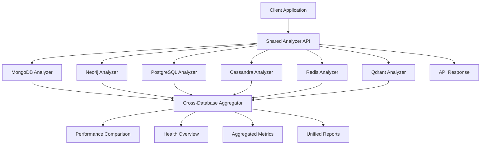

# Shared Analyzer API Guide

## 📊 Overview

The Shared Analyzer API provides cross-database query analysis, performance comparison, and unified monitoring capabilities across all supported databases: MongoDB, Neo4j, PostgreSQL, Cassandra, Redis, and Qdrant.

## 🏗️ Architecture Flow



## 🔗 API Endpoints (5 Total)

### 1. Cross-Database Query Analysis
```http
POST /shared/analyzer/cross-database/analyze
Content-Type: application/json

{
  "query": "SELECT * FROM users WHERE status = 'active'",
  "databases": ["mongodb", "postgres", "cassandra", "redis", "qdrant"],
  "options": {
    "include_explain": true,
    "include_recommendations": true,
    "include_optimization": true
  }
}
```

**Response:**
```json
{
  "success": true,
  "data": {
    "query": "SELECT * FROM users WHERE status = 'active'",
    "database_results": {
      "mongodb": {
        "query_hash": "mongo123",
        "performance_score": 85.0,
        "recommendations": ["Add index on status field"],
        "suggested_indexes": [{"type": "btree", "fields": ["status"]}],
        "optimization_potential": "medium",
        "estimated_improvement_percent": 40.0
      },
      "postgres": {
        "query_hash": "pg123",
        "performance_score": 90.0,
        "recommendations": ["Query uses index effectively"],
        "suggested_indexes": [],
        "optimization_potential": "low",
        "estimated_improvement_percent": 10.0
      },
      "cassandra": {
        "query_hash": "cass123",
        "performance_score": 70.0,
        "recommendations": ["Consider materialized view", "Add secondary index"],
        "suggested_indexes": [{"type": "secondary", "fields": ["status"]}],
        "optimization_potential": "high",
        "estimated_improvement_percent": 60.0
      },
      "redis": {
        "query_hash": "redis123",
        "performance_score": 95.0,
        "recommendations": ["GET operation is optimal"],
        "suggested_optimizations": [{"type": "data_structure", "recommendation": "Use HASH for structured data"}],
        "optimization_potential": "low",
        "estimated_improvement_percent": 5.0
      },
      "qdrant": {
        "query_hash": "qdrant123",
        "performance_score": 80.0,
        "recommendations": ["Optimize HNSW parameters", "Consider vector size"],
        "suggested_optimizations": [{"type": "hnsw_optimization", "parameters": {"m": "16-64"}}],
        "optimization_potential": "medium",
        "estimated_improvement_percent": 30.0
      }
    },
    "comparison": {
      "performance_scores": {
        "mongodb": 85.0,
        "postgres": 90.0,
        "cassandra": 70.0,
        "redis": 95.0,
        "qdrant": 80.0
      },
      "recommendations": {
        "mongodb": ["Add index on status field"],
        "postgres": ["Query already optimized"],
        "cassandra": ["Add secondary index"],
        "redis": ["Operation is optimal"],
        "qdrant": ["Optimize HNSW parameters"]
      },
      "optimization_potential": {
        "mongodb": "medium",
        "postgres": "low",
        "cassandra": "high",
        "redis": "low",
        "qdrant": "medium"
      }
    }
  },
  "timestamp": "2026-05-06T16:13:00.000Z"
}
```

### 2. Performance Comparison
```http
POST /shared/analyzer/performance/comparison
Content-Type: application/json

{
  "databases": ["mongodb", "postgres", "cassandra", "redis", "qdrant"],
  "period_hours": 24,
  "metrics": ["execution_time", "throughput", "error_rate", "resource_usage"]
}
```

**Response:**
```json
{
  "success": true,
  "data": {
    "period_hours": 24,
    "database_performance": {
      "mongodb": {
        "total_queries": 5000,
        "avg_execution_time_ms": 85.5,
        "throughput_qps": 208.3,
        "error_rate": 0.8,
        "resource_usage": {
          "cpu_percent": 45.0,
          "memory_percent": 60.0,
          "disk_io_mb_s": 25.5
        }
      },
      "postgres": {
        "total_queries": 3000,
        "avg_execution_time_ms": 45.5,
        "throughput_qps": 125.0,
        "error_rate": 0.5,
        "resource_usage": {
          "cpu_percent": 35.0,
          "memory_percent": 55.0,
          "disk_io_mb_s": 15.5
        }
      },
      "cassandra": {
        "total_queries": 2000,
        "avg_execution_time_ms": 185.5,
        "throughput_qps": 83.3,
        "error_rate": 1.2,
        "resource_usage": {
          "cpu_percent": 55.0,
          "memory_percent": 70.0,
          "disk_io_mb_s": 35.5
        }
      },
      "redis": {
        "total_queries": 15000,
        "avg_execution_time_ms": 2.5,
        "throughput_qps": 625.0,
        "error_rate": 0.2,
        "resource_usage": {
          "cpu_percent": 25.0,
          "memory_percent": 40.0,
          "disk_io_mb_s": 5.5
        }
      },
      "qdrant": {
        "total_queries": 1000,
        "avg_execution_time_ms": 285.5,
        "throughput_qps": 41.7,
        "error_rate": 1.5,
        "resource_usage": {
          "cpu_percent": 65.0,
          "memory_percent": 80.0,
          "disk_io_mb_s": 45.5
        }
      }
    },
    "comparison": {
      "performance_ranking": [
        {"database": "redis", "score": 95.0, "rank": 1},
        {"database": "postgres", "score": 90.0, "rank": 2},
        {"database": "mongodb", "score": 85.0, "rank": 3},
        {"database": "qdrant", "score": 75.0, "rank": 4},
        {"database": "cassandra", "score": 70.0, "rank": 5}
      ],
      "throughput_ranking": [
        {"database": "redis", "qps": 625.0, "rank": 1},
        {"database": "mongodb", "qps": 208.3, "rank": 2},
        {"database": "postgres", "qps": 125.0, "rank": 3},
        {"database": "cassandra", "qps": 83.3, "rank": 4},
        {"database": "qdrant", "qps": 41.7, "rank": 5}
      ],
      "efficiency_ranking": [
        {"database": "redis", "score": 98.0, "rank": 1},
        {"database": "postgres", "score": 92.0, "rank": 2},
        {"database": "mongodb", "score": 88.0, "rank": 3},
        {"database": "qdrant", "score": 78.0, "rank": 4},
        {"database": "cassandra", "score": 72.0, "rank": 5}
      ]
    },
    "insights": [
      "Redis shows highest throughput and lowest latency",
      "PostgreSQL provides best efficiency for relational queries",
      "Cassandra shows higher latency due to distributed nature",
      "Qdrant performance depends on vector search complexity"
    ]
  },
  "timestamp": "2026-05-06T16:13:00.000Z"
}
```

### 3. Optimization Report
```http
POST /shared/analyzer/optimization/report
Content-Type: application/json

{
  "databases": ["mongodb", "postgres", "cassandra", "redis", "qdrant"],
  "include_recommendations": true,
  "include_priorities": true,
  "include_estimates": true
}
```

**Response:**
```json
{
  "success": true,
  "data": {
    "database_reports": {
      "mongodb": {
        "issues": [
          {
            "type": "slow_query",
            "severity": "medium",
            "description": "Collection scan detected",
            "recommendation": "Add index on frequently queried fields",
            "estimated_improvement": 40.0,
            "priority": "high"
          }
        ],
        "recommendations": [
          "Add compound index on user_id and status",
          "Consider query result pagination",
          "Optimize aggregation pipelines"
        ]
      },
      "postgres": {
        "issues": [
          {
            "type": "index_gap",
            "severity": "low",
            "description": "Missing index on foreign key",
            "recommendation": "Add foreign key index",
            "estimated_improvement": 15.0,
            "priority": "medium"
          }
        ],
        "recommendations": [
          "Add missing indexes for foreign keys",
          "Consider partitioning large tables",
          "Optimize query execution plans"
        ]
      },
      "cassandra": {
        "issues": [
          {
            "type": "data_model",
            "severity": "high",
            "description": "Frequent ALLOW FILTERING usage",
            "recommendation": "Redesign data model for query patterns",
            "estimated_improvement": 60.0,
            "priority": "critical"
          }
        ],
        "recommendations": [
          "Add materialized views for complex queries",
          "Optimize partition key distribution",
          "Add secondary indexes strategically"
        ]
      },
      "redis": {
        "issues": [
          {
            "type": "memory_usage",
            "severity": "medium",
            "description": "High memory fragmentation",
            "recommendation": "Consider Redis restart or memory optimization",
            "estimated_improvement": 25.0,
            "priority": "medium"
          }
        ],
        "recommendations": [
          "Set TTL for keys to manage memory",
          "Use appropriate data structures",
          "Consider memory-efficient alternatives"
        ]
      },
      "qdrant": {
        "issues": [
          {
            "type": "hnsw_config",
            "severity": "medium",
            "description": "Suboptimal HNSW parameters",
            "recommendation": "Adjust HNSW parameters for workload",
            "estimated_improvement": 30.0,
            "priority": "high"
          }
        ],
        "recommendations": [
          "Optimize HNSW parameters",
          "Consider vector quantization",
          "Review collection configuration"
        ]
      }
    },
    "overall_recommendations": [
      {
        "priority": "critical",
        "description": "Cassandra data model redesign needed",
        "impact": "High",
        "databases": ["cassandra"]
      },
      {
        "priority": "high",
        "description": "Add missing indexes across databases",
        "impact": "Medium",
        "databases": ["mongodb", "postgres"]
      },
      {
        "priority": "medium",
        "description": "Optimize memory and configuration",
        "impact": "Low",
        "databases": ["redis", "qdrant"]
      }
    ],
    "summary": {
      "total_issues": 5,
      "critical_issues": 1,
      "high_priority_issues": 2,
      "medium_priority_issues": 2,
      "estimated_total_improvement": 170.0,
      "optimization_potential": "high"
    }
  },
  "timestamp": "2026-05-06T16:13:00.000Z"
}
```

### 4. Health Overview
```http
GET /shared/analyzer/health/overview
```

**Response:**
```json
{
  "success": true,
  "data": {
    "individual_health": {
      "mongodb": {
        "healthy": true,
        "health_score": 85,
        "status": "healthy",
        "issues": [],
        "last_check": "2026-05-06T16:13:00.000Z"
      },
      "neo4j": {
        "healthy": true,
        "health_score": 90,
        "status": "healthy",
        "issues": [],
        "last_check": "2026-05-06T16:13:00.000Z"
      },
      "postgres": {
        "healthy": true,
        "health_score": 92,
        "status": "healthy",
        "issues": [],
        "last_check": "2026-05-06T16:13:00.000Z"
      },
      "cassandra": {
        "healthy": false,
        "health_score": 70,
        "status": "degraded",
        "issues": ["High latency", "Node down"],
        "last_check": "2026-05-06T16:13:00.000Z"
      },
      "redis": {
        "healthy": true,
        "health_score": 95,
        "status": "healthy",
        "issues": [],
        "last_check": "2026-05-06T16:13:00.000Z"
      },
      "qdrant": {
        "healthy": true,
        "health_score": 80,
        "status": "healthy",
        "issues": ["High memory usage"],
        "last_check": "2026-05-06T16:13:00.000Z"
      }
    },
    "overall_health": {
      "overall_score": 85.3,
      "overall_status": "healthy",
      "healthy_databases": 5,
      "unhealthy_databases": 1,
      "degraded_databases": 1,
      "health_trend": "stable",
      "last_updated": "2026-05-06T16:13:00.000Z"
    },
    "health_metrics": {
      "avg_response_time_ms": 125.5,
      "total_queries_per_second": 1250.0,
      "error_rate": 0.8,
      "resource_utilization": {
        "avg_cpu_percent": 45.0,
        "avg_memory_percent": 60.0,
        "avg_disk_usage_percent": 55.0
      }
    },
    "alerts": [
      {
        "severity": "warning",
        "database": "cassandra",
        "message": "High latency detected",
        "timestamp": "2026-05-06T16:10:00.000Z"
      },
      {
        "severity": "info",
        "database": "qdrant",
        "message": "High memory usage",
        "timestamp": "2026-05-06T16:05:00.000Z"
      }
    ]
  },
  "timestamp": "2026-05-06T16:13:00.000Z"
}
```

### 5. Aggregated Metrics
```http
GET /shared/analyzer/metrics/aggregated?period_minutes=60
```

**Response:**
```json
{
  "success": true,
  "data": {
    "period_minutes": 60,
    "individual_metrics": {
      "mongodb": {
        "query_count": 5000,
        "avg_execution_time_ms": 85.5,
        "error_rate": 0.8,
        "throughput_qps": 208.3
      },
      "neo4j": {
        "query_count": 2000,
        "avg_execution_time_ms": 125.5,
        "error_rate": 1.2,
        "throughput_qps": 83.3
      },
      "postgres": {
        "query_count": 3000,
        "avg_execution_time_ms": 45.5,
        "error_rate": 0.5,
        "throughput_qps": 125.0
      },
      "cassandra": {
        "query_count": 2000,
        "avg_execution_time_ms": 185.5,
        "error_rate": 1.2,
        "throughput_qps": 83.3
      },
      "redis": {
        "query_count": 15000,
        "avg_execution_time_ms": 2.5,
        "error_rate": 0.2,
        "throughput_qps": 625.0
      },
      "qdrant": {
        "query_count": 1000,
        "avg_execution_time_ms": 285.5,
        "error_rate": 1.5,
        "throughput_qps": 41.7
      }
    },
    "aggregated_metrics": {
      "total_queries": 28000,
      "avg_execution_time_ms": 105.2,
      "overall_error_rate": 0.7,
      "total_throughput_qps": 1166.7,
      "database_breakdown": {
        "mongodb": {"percentage": 17.9, "queries": 5000},
        "neo4j": {"percentage": 7.1, "queries": 2000},
        "postgres": {"percentage": 10.7, "queries": 3000},
        "cassandra": {"percentage": 7.1, "queries": 2000},
        "redis": {"percentage": 53.6, "queries": 15000},
        "qdrant": {"percentage": 3.6, "queries": 1000}
      },
      "performance_distribution": {
        "fast_queries": 22400,
        "normal_queries": 4200,
        "slow_queries": 1200,
        "critical_queries": 200
      },
      "resource_usage": {
        "total_cpu_percent": 45.0,
        "total_memory_percent": 60.0,
        "total_disk_io_mb_s": 25.5,
        "network_io_mb_s": 15.0
      },
      "trends": {
        "query_volume_trend": "increasing",
        "performance_trend": "stable",
        "error_rate_trend": "decreasing"
      }
    },
    "insights": [
      "Redis handles 53.6% of total queries with lowest latency",
      "PostgreSQL shows best performance for complex queries",
      "Cassandra shows higher latency due to distributed architecture",
      "Qdrant has lowest query volume but highest per-query complexity",
      "Overall system performance is stable with room for optimization"
    ]
  },
  "timestamp": "2026-05-06T16:13:00.000Z"
}
```

## 🚀 Usage Examples

### Complete Cross-Database Analysis Flow
```bash
# 1. Analyze query across all databases
curl -X POST "http://localhost:8000/shared/analyzer/cross-database/analyze" \
  -H "Content-Type: application/json" \
  -d '{
    "query": "SELECT * FROM users WHERE status = '\''active'\''",
    "databases": ["mongodb", "postgres", "cassandra", "redis", "qdrant"],
    "options": {
      "include_explain": true,
      "include_recommendations": true,
      "include_optimization": true
    }
  }'

# 2. Compare performance across databases
curl -X POST "http://localhost:8000/shared/analyzer/performance/comparison" \
  -H "Content-Type: application/json" \
  -d '{
    "databases": ["mongodb", "postgres", "cassandra", "redis", "qdrant"],
    "period_hours": 24,
    "metrics": ["execution_time", "throughput", "error_rate"]
  }'

# 3. Get optimization report
curl -X POST "http://localhost:8000/shared/analyzer/optimization/report" \
  -H "Content-Type: application/json" \
  -d '{
    "databases": ["mongodb", "postgres", "cassandra", "redis", "qdrant"],
    "include_recommendations": true,
    "include_priorities": true
  }'

# 4. Get health overview
curl "http://localhost:8000/shared/analyzer/health/overview"

# 5. Get aggregated metrics
curl "http://localhost:8000/shared/analyzer/metrics/aggregated?period_minutes=60"
```

### Python Client Integration
```python
import requests
from typing import List, Dict, Any

class SharedAnalyzerClient:
    def __init__(self, base_url: str, api_key: str):
        self.base_url = base_url
        self.headers = {
            'Authorization': f'Bearer {api_key}',
            'Content-Type': 'application/json'
        }
    
    def cross_database_analysis(self, query: str, databases: List[str], 
                               options: Dict[str, Any] = None):
        """Analyze query across multiple databases"""
        url = f"{self.base_url}/shared/analyzer/cross-database/analyze"
        payload = {
            "query": query,
            "databases": databases,
            "options": options or {}
        }
        
        response = requests.post(url, json=payload, headers=self.headers)
        return response.json()
    
    def performance_comparison(self, databases: List[str], period_hours: int = 24,
                              metrics: List[str] = None):
        """Compare performance across databases"""
        url = f"{self.base_url}/shared/analyzer/performance/comparison"
        payload = {
            "databases": databases,
            "period_hours": period_hours,
            "metrics": metrics or ["execution_time", "throughput", "error_rate"]
        }
        
        response = requests.post(url, json=payload, headers=self.headers)
        return response.json()
    
    def optimization_report(self, databases: List[str], 
                          include_recommendations: bool = True,
                          include_priorities: bool = True):
        """Get optimization report for databases"""
        url = f"{self.base_url}/shared/analyzer/optimization/report"
        payload = {
            "databases": databases,
            "include_recommendations": include_recommendations,
            "include_priorities": include_priorities
        }
        
        response = requests.post(url, json=payload, headers=self.headers)
        return response.json()
    
    def health_overview(self):
        """Get health overview for all databases"""
        url = f"{self.base_url}/shared/analyzer/health/overview"
        
        response = requests.get(url, headers=self.headers)
        return response.json()
    
    def aggregated_metrics(self, period_minutes: int = 60):
        """Get aggregated metrics across all databases"""
        url = f"{self.base_url}/shared/analyzer/metrics/aggregated"
        params = {"period_minutes": period_minutes}
        
        response = requests.get(url, params=params, headers=self.headers)
        return response.json()

# Usage
client = SharedAnalyzerClient("http://localhost:8000", "your-api-key")

# Cross-database query analysis
analysis = client.cross_database_analysis(
    "SELECT * FROM users WHERE status = 'active'",
    ["mongodb", "postgres", "cassandra", "redis", "qdrant"],
    options={"include_explain": True, "include_recommendations": True}
)

# Performance comparison
comparison = client.performance_comparison(
    ["mongodb", "postgres", "cassandra", "redis", "qdrant"],
    period_hours=24,
    metrics=["execution_time", "throughput", "error_rate", "resource_usage"]
)

# Optimization report
optimization = client.optimization_report(
    ["mongodb", "postgres", "cassandra", "redis", "qdrant"],
    include_recommendations=True,
    include_priorities=True
)

# Health overview
health = client.health_overview()

# Aggregated metrics
metrics = client.aggregated_metrics(period_minutes=60)
```

### Real-time Cross-Database Monitoring
```javascript
// WebSocket connection for real-time cross-database metrics
const ws = new WebSocket('ws://localhost:8000/shared/analyzer/metrics/stream');

ws.onmessage = function(event) {
    const metrics = JSON.parse(event.data);
    
    // Update dashboard
    updateCrossDatabaseDashboard(metrics);
    
    // Check for alerts
    if (metrics.overall_health_score < 70) {
        showAlert('Overall system health degraded');
    }
    
    if (metrics.total_error_rate > 0.05) {
        showAlert('High error rate detected across databases');
    }
};

function updateCrossDatabaseDashboard(metrics) {
    // Update overall metrics
    document.getElementById('total-queries').textContent = metrics.total_queries;
    document.getElementById('avg-execution-time').textContent = metrics.avg_execution_time_ms.toFixed(2);
    document.getElementById('overall-health-score').textContent = metrics.overall_health_score.toFixed(1);
    
    // Update database breakdown
    const breakdown = metrics.database_breakdown;
    for (const [database, data] of Object.entries(breakdown)) {
        const element = document.getElementById(`${database}-percentage`);
        if (element) {
            element.textContent = `${data.percentage}%`;
        }
    }
    
    // Update health status
    const healthStatus = document.getElementById('health-status');
    healthStatus.textContent = metrics.overall_status;
    healthStatus.className = `status ${metrics.overall_status}`;
}

// Real-time cross-database analysis
async function performCrossDatabaseAnalysis(query, databases) {
    const response = await fetch('/shared/analyzer/cross-database/analyze', {
        method: 'POST',
        headers: {
            'Content-Type': 'application/json',
            'Authorization': 'Bearer ' + apiKey
        },
        body: JSON.stringify({
            query: query,
            databases: databases,
            options: {
                include_explain: true,
                include_recommendations: true,
                include_optimization: true
            }
        })
    });
    
    const result = await response.json();
    
    if (result.success) {
        // Display cross-database comparison
        displayCrossDatabaseComparison(result.data);
        
        // Show performance ranking
        displayPerformanceRanking(result.data.comparison.performance_ranking);
        
        // Show recommendations
        displayRecommendations(result.data.comparison.recommendations);
    }
}
```

### Batch Cross-Database Analysis
```python
import asyncio
from concurrent.futures import ThreadPoolExecutor

class BatchCrossDatabaseAnalyzer:
    def __init__(self, shared_client):
        self.shared_client = shared_client
    
    async def analyze_multiple_queries(self, queries: List[str], 
                                     databases: List[str]):
        """Analyze multiple queries across databases"""
        
        async def analyze_single_query(query):
            try:
                result = await self.shared_client.cross_database_analysis(
                    query, databases, 
                    options={"include_recommendations": True}
                )
                return {"query": query, "result": result, "success": True}
            except Exception as e:
                return {"query": query, "error": str(e), "success": False}
        
        # Execute analyses concurrently
        tasks = [analyze_single_query(query) for query in queries]
        results = await asyncio.gather(*tasks)
        
        # Aggregate results
        analysis_summary = {
            "total_queries": len(queries),
            "successful_analyses": len([r for r in results if r["success"]]),
            "failed_analyses": len([r for r in results if not r["success"]]),
            "database_performance": {},
            "common_recommendations": [],
            "optimization_opportunities": []
        }
        
        # Analyze results
        for result in results:
            if result["success"]:
                db_results = result["result"]["data"]["database_results"]
                for db_name, db_result in db_results.items():
                    if db_name not in analysis_summary["database_performance"]:
                        analysis_summary["database_performance"][db_name] = {
                            "queries": [],
                            "avg_performance_score": 0,
                            "common_issues": []
                        }
                    
                    analysis_summary["database_performance"][db_name]["queries"].append({
                        "query": result["query"],
                        "performance_score": db_result["performance_score"],
                        "recommendations": db_result["recommendations"]
                    })
        
        # Calculate averages and identify patterns
        for db_name, db_data in analysis_summary["database_performance"].items():
            if db_data["queries"]:
                scores = [q["performance_score"] for q in db_data["queries"]]
                db_data["avg_performance_score"] = sum(scores) / len(scores)
        
        return analysis_summary

# Usage
shared_client = SharedAnalyzerClient("http://localhost:8000", "api-key")
batch_analyzer = BatchCrossDatabaseAnalyzer(shared_client)

queries_to_analyze = [
    "SELECT * FROM users WHERE status = 'active'",
    "SELECT * FROM orders WHERE user_id = 123",
    "UPDATE users SET last_login = NOW() WHERE user_id = 456"
]

databases = ["mongodb", "postgres", "cassandra", "redis", "qdrant"]

# Perform batch analysis
batch_results = await batch_analyzer.analyze_multiple_queries(
    queries_to_analyze,
    databases
)
```

## 📊 Cross-Database Monitoring Dashboard

### Grafana Panel Configuration
```json
{
  "dashboard": {
    "title": "Cross-Database Query Monitoring",
    "panels": [
      {
        "title": "Overall System Health",
        "type": "stat",
        "targets": [
          {
            "expr": "shared_analyzer_overall_health_score"
          }
        ],
        "fieldConfig": {
          "defaults": {
            "thresholds": {
              "steps": [
                {"color": "red", "value": 0},
                {"color": "yellow", "value": 70},
                {"color": "green", "value": 85}
              ]
            }
          }
        }
      },
      {
        "title": "Database Query Distribution",
        "type": "piechart",
        "targets": [
          {
            "expr": "shared_analyzer_database_query_count"
          }
        ]
      },
      {
        "title": "Performance Comparison",
        "type": "table",
        "targets": [
          {
            "expr": "shared_analyzer_database_performance_score"
          }
        ]
      },
      {
        "title": "Cross-Database Query Volume",
        "type": "graph",
        "targets": [
          {
            "expr": "shared_analyzer_total_queries"
          },
          {
            "expr": "shared_analyzer_mongodb_queries"
          },
          {
            "expr": "shared_analyzer_postgres_queries"
          },
          {
            "expr": "shared_analyzer_redis_queries"
          }
        ]
      },
      {
        "title": "Average Execution Time by Database",
        "type": "graph",
        "targets": [
          {
            "expr": "shared_analyzer_mongodb_avg_time"
          },
          {
            "expr": "shared_analyzer_postgres_avg_time"
          },
          {
            "expr": "shared_analyzer_cassandra_avg_time"
          },
          {
            "expr": "shared_analyzer_redis_avg_time"
          }
        ]
      },
      {
        "title": "Error Rate Comparison",
        "type": "graph",
        "targets": [
          {
            "expr": "shared_analyzer_mongodb_error_rate"
          },
          {
            "expr": "shared_analyzer_postgres_error_rate"
          },
          {
            "expr": "shared_analyzer_cassandra_error_rate"
          },
          {
            "expr": "shared_analyzer_redis_error_rate"
          }
        ]
      }
    ]
  }
}
```

## 🔧 Configuration

### Environment Variables
```bash
# Shared Analyzer Configuration
SHARED_ANALYZER_HOST=localhost
SHARED_ANALYZER_PORT=8000
SHARED_ANALYZER_API_KEY=SharedAnalyzerKey123!

# Database Connections
MONGODB_URI=mongodb://localhost:27017
NEO4J_URI=bolt://localhost:7687
POSTGRES_URI=postgresql://localhost:5432/scaibu_default
CASSANDRA_HOST=localhost
CASSANDRA_PORT=9042
REDIS_HOST=localhost
REDIS_PORT=6379
QDRANT_HOST=localhost
QDRANT_PORT=6333

# Monitoring Configuration
SHARED_ANALYZER_CACHE_TTL_SECONDS=300
SHARED_ANALYZER_BATCH_SIZE=100
SHARED_ANALYZER_MAX_CONCURRENT_ANALYSES=10
```

### Docker Setup
```yaml
version: '3.8'
services:
  shared-analyzer:
    build: .
    ports:
      - "8000:8000"
    environment:
      - SHARED_ANALYZER_API_KEY=SharedAnalyzerKey123!
      - MONGODB_URI=mongodb://mongodb:27017
      - NEO4J_URI=bolt://neo4j:7687
      - POSTGRES_URI=postgresql://postgres:5432/scaibu_default
      - CASSANDRA_HOST=cassandra
      - CASSANDRA_PORT=9042
      - REDIS_HOST=redis
      - REDIS_PORT=6379
      - QDRANT_HOST=qdrant
      - QDRANT_PORT=6333
    depends_on:
      - mongodb
      - neo4j
      - postgres
      - cassandra
      - redis
      - qdrant
    volumes:
      - ./logs:/app/logs

  # Database services (simplified)
  mongodb:
    image: mongo:6.0
    ports:
      - "27017:27017"

  neo4j:
    image: neo4j:5.0
    ports:
      - "7474:7474"
      - "7687:7687"

  postgres:
    image: postgres:15
    ports:
      - "5432:5432"

  cassandra:
    image: cassandra:4.0
    ports:
      - "9042:9042"

  redis:
    image: redis:7
    ports:
      - "6379:6379"

  qdrant:
    image: qdrant/qdrant:latest
    ports:
      - "6333:6333"
```

## 🛡️ Security & Best Practices

### API Security
```python
from fastapi import Depends, HTTPException, status
from fastapi.security import HTTPBearer
import jwt

security = HTTPBearer()

async def verify_api_key(api_key: str = Depends(security)):
    try:
        # Verify JWT token with database-specific claims
        payload = jwt.decode(api_key.credentials, SECRET_KEY, algorithms=["HS256"])
        
        # Check if token has required database access
        required_databases = payload.get("databases", [])
        if not required_databases:
            raise HTTPException(
                status_code=status.HTTP_403_FORBIDDEN,
                detail="No database access granted"
            )
        
        return payload
    except jwt.ExpiredSignatureError:
        raise HTTPException(
            status_code=status.HTTP_401_UNAUTHORIZED,
            detail="Token expired"
        )
    except jwt.InvalidTokenError:
        raise HTTPException(
            status_code=status.HTTP_401_UNAUTHORIZED,
            detail="Invalid token"
        )

@router.post("/cross-database/analyze", dependencies=[Depends(verify_api_key)])
async def cross_database_analysis(request: CrossDatabaseAnalysisRequest):
    # Verify user has access to requested databases
    user_databases = get_user_database_access(request.database_token)
    requested_databases = set(request.databases)
    
    if not requested_databases.issubset(set(user_databases)):
        raise HTTPException(
            status_code=status.HTTP_403_FORBIDDEN,
            detail="Access denied to one or more databases"
        )
    
    # Implementation
    pass
```

### Rate Limiting
```python
from slowapi import Limiter
from slowapi.util import get_remote_address

# Different limits for different operations
analysis_limiter = Limiter(key_func=get_remote_address)
comparison_limiter = Limiter(key_func=get_remote_address)
health_limiter = Limiter(key_func=get_remote_address)

@router.post("/cross-database/analyze", dependencies=[Depends(verify_api_key)])
async def cross_database_analysis(request: CrossDatabaseAnalysisRequest):
    # Apply rate limiting based on database count
    database_count = len(request.databases)
    
    if database_count <= 2:
        analysis_limiter.limit("100/minute")
    elif database_count <= 4:
        analysis_limiter.limit("50/minute")
    else:
        analysis_limiter.limit("20/minute")
    
    # Implementation
    pass

@router.post("/performance/comparison", dependencies=[Depends(verify_api_key)])
async def performance_comparison(request: PerformanceComparisonRequest):
    comparison_limiter.limit("30/minute")
    # Implementation
    pass

@router.get("/health/overview", dependencies=[Depends(verify_api_key)])
async def health_overview():
    health_limiter.limit("200/minute")
    # Implementation
    pass
```

### Query Validation
```python
from pydantic import BaseModel, validator
import re

class CrossDatabaseAnalysisRequest(BaseModel):
    query: str
    databases: List[str]
    options: Dict[str, Any] = {}
    
    @validator('query')
    def validate_query(cls, v):
        if not v.strip():
            raise ValueError("Query cannot be empty")
        
        # Basic SQL injection prevention
        dangerous_patterns = [
            r'\bDROP\b',
            r'\bTRUNCATE\b',
            r'\bDELETE\s+FROM',
            r'\bGRANT\b',
            r'\bREVOKE\b'
        ]
        
        for pattern in dangerous_patterns:
            if re.search(pattern, v, re.IGNORECASE):
                raise ValueError(f"Query contains potentially dangerous operation: {pattern}")
        
        return v
    
    @validator('databases')
    def validate_databases(cls, v):
        valid_databases = ["mongodb", "neo4j", "postgres", "cassandra", "redis", "qdrant"]
        
        if not v:
            raise ValueError("At least one database must be specified")
        
        invalid_dbs = [db for db in v if db not in valid_databases]
        if invalid_dbs:
            raise ValueError(f"Invalid databases: {invalid_dbs}")
        
        return v
    
    @validator('options')
    def validate_options(cls, v):
        valid_options = ["include_explain", "include_recommendations", "include_optimization"]
        
        for key in v:
            if key not in valid_options:
                raise ValueError(f"Invalid option: {key}")
        
        return v
```

## 📈 Performance Optimization

### Caching Strategy
```python
import redis
import json
from functools import lru_cache
from typing import Dict, Any

class CrossDatabaseCache:
    def __init__(self, redis_client: redis.Redis):
        self.redis_client = redis_client
        self.default_ttl = 300  # 5 minutes
    
    def cache_analysis_result(self, query: str, databases: List[str], 
                             result: Dict[str, Any], ttl: int = None):
        """Cache cross-database analysis result"""
        cache_key = f"analysis:{hash(query)}:{','.join(sorted(databases))}"
        
        cache_data = {
            "query": query,
            "databases": databases,
            "result": result,
            "timestamp": datetime.utcnow().isoformat()
        }
        
        self.redis_client.setex(
            cache_key,
            ttl or self.default_ttl,
            json.dumps(cache_data)
        )
    
    def get_cached_analysis(self, query: str, databases: List[str]) -> Dict[str, Any]:
        """Get cached analysis result"""
        cache_key = f"analysis:{hash(query)}:{','.join(sorted(databases))}"
        
        cached_data = self.redis_client.get(cache_key)
        if cached_data:
            return json.loads(cached_data)
        
        return None
    
    def cache_performance_comparison(self, databases: List[str], 
                                  period_hours: int, result: Dict[str, Any]):
        """Cache performance comparison result"""
        cache_key = f"comparison:{','.join(sorted(databases))}:{period_hours}"
        
        cache_data = {
            "databases": databases,
            "period_hours": period_hours,
            "result": result,
            "timestamp": datetime.utcnow().isoformat()
        }
        
        self.redis_client.setex(cache_key, self.default_ttl, json.dumps(cache_data))
    
    def get_cached_performance_comparison(self, databases: List[str], 
                                       period_hours: int) -> Dict[str, Any]:
        """Get cached performance comparison"""
        cache_key = f"comparison:{','.join(sorted(databases))}:{period_hours}"
        
        cached_data = self.redis_client.get(cache_key)
        if cached_data:
            return json.loads(cached_data)
        
        return None

# Usage
redis_client = redis.Redis(host='localhost', port=6379, db=0)
cache = CrossDatabaseCache(redis_client)

# Cache analysis result
cache.cache_analysis_result(
    "SELECT * FROM users WHERE status = 'active'",
    ["mongodb", "postgres", "cassandra"],
    analysis_result
)

# Get cached result
cached_result = cache.get_cached_analysis(
    "SELECT * FROM users WHERE status = 'active'",
    ["mongodb", "postgres", "cassandra"]
)
```

### Concurrent Analysis Optimization
```python
import asyncio
from concurrent.futures import ThreadPoolExecutor, as_completed
from typing import List, Dict, Any

class ConcurrentAnalyzer:
    def __init__(self, max_workers: int = 10):
        self.executor = ThreadPoolExecutor(max_workers=max_workers)
    
    async def analyze_concurrently(self, query: str, databases: List[str]) -> Dict[str, Any]:
        """Analyze query across databases concurrently"""
        
        def analyze_single_database(database: str):
            # This would call the individual database analyzer
            return self._analyze_query_in_database(query, database)
        
        # Execute analyses concurrently
        with ThreadPoolExecutor(max_workers=len(databases)) as executor:
            future_to_db = {
                executor.submit(analyze_single_database, db): db 
                for db in databases
            }
            
            results = {}
            for future in as_completed(future_to_db):
                database = future_to_db[future]
                try:
                    result = future.result()
                    results[database] = result
                except Exception as e:
                    results[database] = {
                        "error": str(e),
                        "success": False
                    }
        
        return results
    
    def _analyze_query_in_database(self, query: str, database: str) -> Dict[str, Any]:
        """Analyze query in specific database"""
        # This would implement the actual database-specific analysis
        # For now, return mock data
        return {
            "database": database,
            "query_hash": f"{database}_hash",
            "performance_score": 85.0,
            "recommendations": [f"Optimize {database} query"],
            "success": True
        }

# Usage
concurrent_analyzer = ConcurrentAnalyzer(max_workers=6)

# Perform concurrent analysis
results = await concurrent_analyzer.analyze_concurrently(
    "SELECT * FROM users WHERE status = 'active'",
    ["mongodb", "postgres", "cassandra", "redis", "qdrant"]
)
```

This comprehensive Shared Analyzer API guide provides complete documentation for all 5 cross-database endpoints with detailed examples, security considerations, and best practices for unified database monitoring and analysis.
