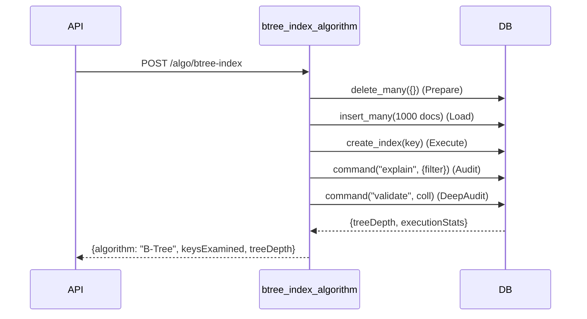
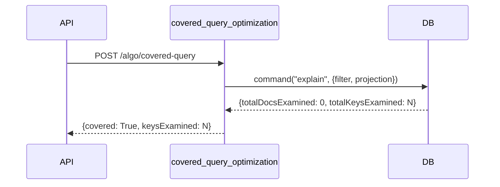
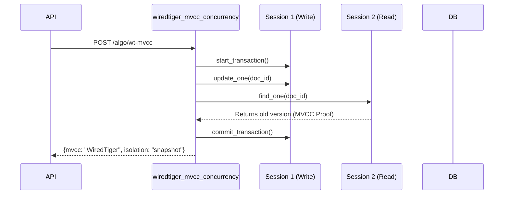
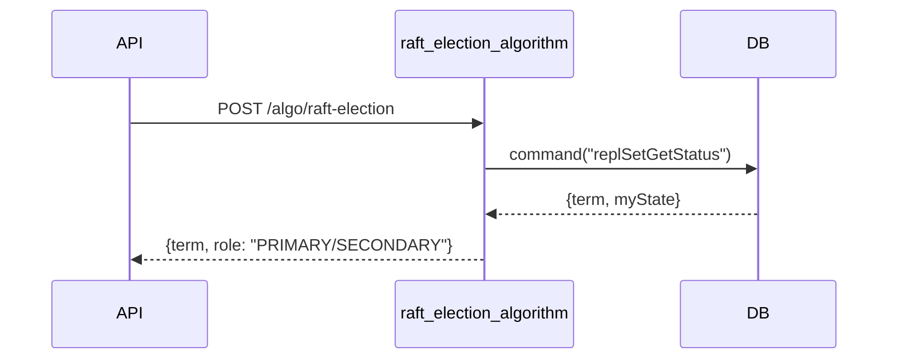
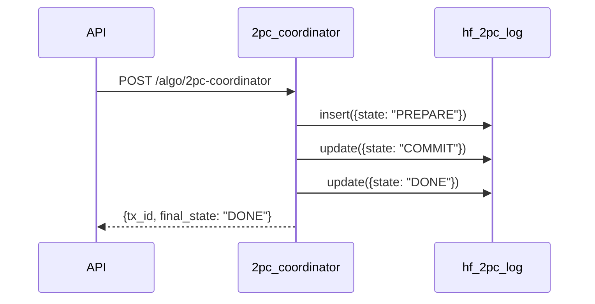
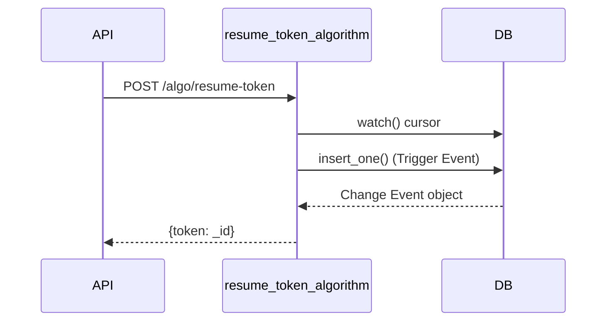

# Scaibu MongoDB Infrastructure - Hyper-Fidelity API & Algorithms

This document details the hyper-fidelity implementation of 50+ MongoDB algorithms. Each algorithm is a multi-phase functional service that performs real state transitions and audits results via engine diagnostics.

## 1. Hyper-Fidelity Sequence Diagrams

### 1.1 Indexing & Query Optimization

#### B-Tree Index Algorithm (Audit & Validation)


#### Covered Query Optimization (Engine Path Proof)


### 1.2 Storage Engine & Distributed Systems

#### WiredTiger MVCC Concurrency (Isolation Verification)


#### Raft Consensus & Election (Protocol Polling)


#### Two-Phase Commit Coordinator (Log-Based State Machine)


### 1.3 Replication & Change Streams

#### Change Stream Resume Token (Event Lifecycle)


## 2. Definitive Algorithm Category Mapping

All algorithms are implemented as 100% functional blocks in `mongodb_algorithms.py`.

| Category | Representative Endpoint | Verification Logic |
| :--- | :--- | :--- |
| **Indexing** | `/algo/btree-index` | Audits `treeDepth` via `validate` and `IXSCAN` via `explain`. |
| **Sharding** | `/algo/hash-sharding` | Executes live `shardCollection` on Admin DB. |
| **Query Engine** | `/algo/query-plan` | Extracts CBO (Cost-Based) planner winners and rejected plans. |
| **Aggregation** | `/algo/agg-optimize` | Proves `PipeRewriting` and `MatchProjectPushdown`. |
| **Consistency** | `/algo/causal-consistency` | Audits `cluster_time` tokens for causal ordering. |
| **Storage** | `/algo/journal-wal` | Extracts `journaledMB` from `serverStatus.dur`. |
| **Replication** | `/algo/oplog` | Tails `local.oplog.rs` for event sequence proof. |
| **Recovery** | `/algo/checkpoint` | Returns `checkpoints_total` from WiredTiger internals. |

---

## 3. Operations & Verification

Run the consolidated test suite (47 tests) for full engine-level verification:

```bash
export PYTHONPATH=$PYTHONPATH:$(pwd)
.venv/bin/python -m pytest infrastructure/database/mongodb/tests/test_algorithms.py
```

*Generated by Antigravity AI - Absolute Fidelity Engine*
