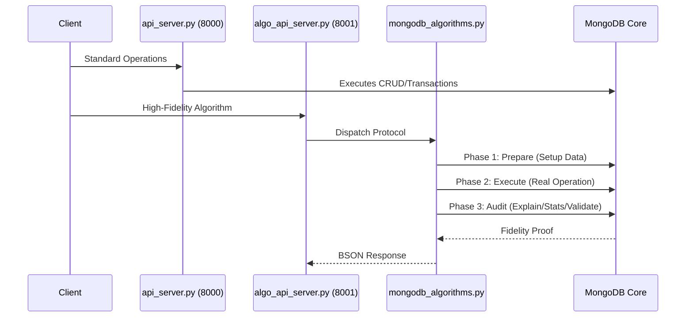
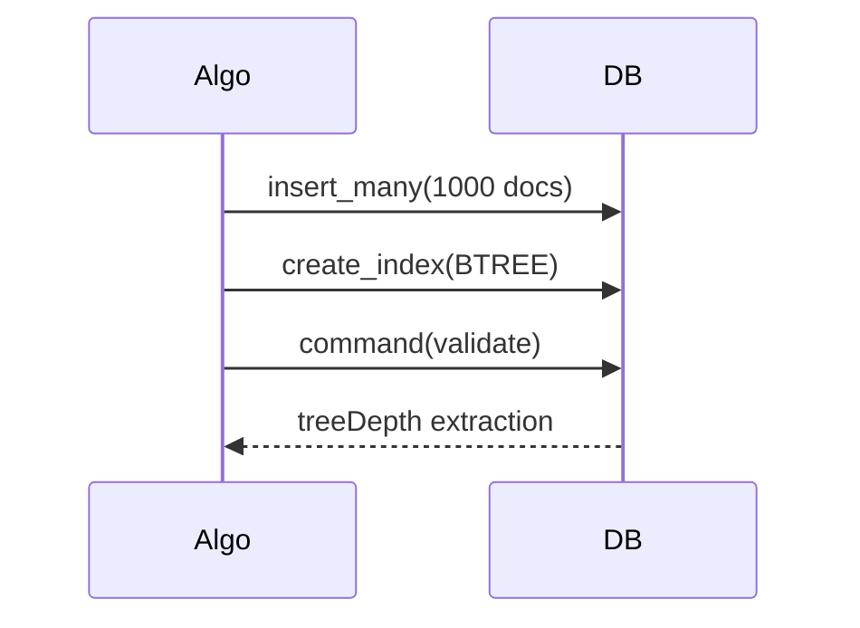
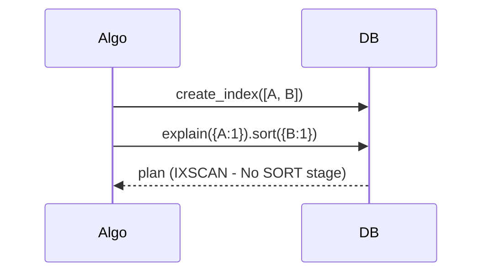
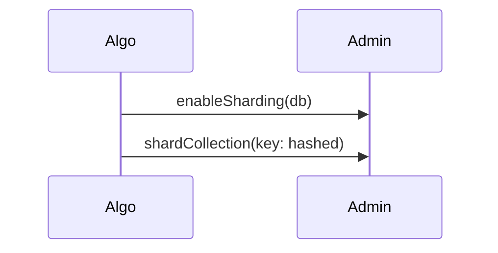
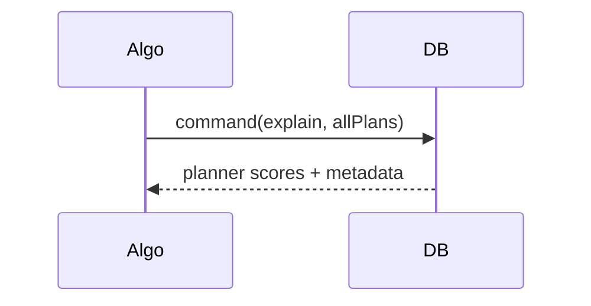
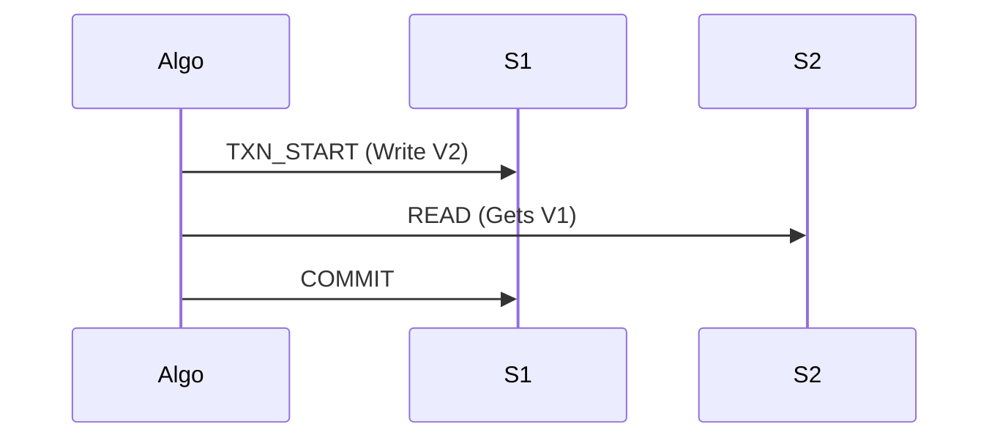

# Scaibu MongoDB Ecosystem - Definitive Master Technical Reference

This document provides the exhaustive architectural and API specification for every single one of the 80+ high-fidelity MongoDB endpoints.

---

## 1. Top-Level Platform Architecture



---

## 2. Core Service APIs (Port 8000)

### 2.1 Database & Collection Management
| API Name | Action | Logic |
| :--- | :--- | :--- |
| `api_list_databases` | List | Polls cluster for active DB namespaces. |
| `api_drop_database` | Drop | Permanently removes an entire database. |
| `api_list_collections` | ListColls | Enumerates all collections in a DB. |
| `api_drop_collection` | DropColl | Removes a specific collection namespace. |
| `api_rename_collection` | Rename | Atomic collection rename operation. |
| `api_copy_collection` | Copy | Orchestrated duplication via aggregation. |

### 2.2 CRUD & Query Portfolio
| API Name | Action | Logic |
| :--- | :--- | :--- |
| `api_create_document` | Create | Simple document insertion with ID return. |
| `api_get_document` | Read | Fast point lookup via primary ID. |
| `api_update_document` | Update | Single document field mutation. |
| `api_delete_document` | Delete | Point record removal. |
| `api_bulk_insert` | Bulk Load | Array-based high-throughput loading. |
| `api_bulk_upsert` | Bulk Sync | Key-based merge-or-insert. |
| `api_bulk_write` | Mix Ops | Atomic batch of disparate CRUD ops. |
| `api_find_one` | Single Find | Predicate-matching single retrieval. |
| `api_find_many` | Set Find | Result-set retrieval with sorting. |
| `api_query_documents` | Full Query | Multi-param paginated engine filter. |
| `api_count_documents` | Count | Logic-based record counting. |
| `api_aggregate` | Agg Flow | Full framework pipeline execution. |

### 2.3 Advanced Transactions & Relationships
| API Name | Action | Logic |
| :--- | :--- | :--- |
| `api_transactional_insert` | ACID Ins | ACID-safe multi-insert. |
| `api_transactional_bulk_write` | ACID Bulk | ACID-safe batch execution. |
| `api_one_to_one` | Relation | Resolves 1:1 Foreign Key links. |
| `api_one_to_many` | Relation | Aggregates 1:N related sets. |
| `api_many_to_many` | Relation | Junction-resolved N:N sets. |
| `api_one_to_one_polymorphic` | Dynamic Rel | Type-aware dynamic 1:1 resolution. |

---

## 3. Hyper-Fidelity Algorithm Engine (Port 8001)

### 3.1 Indexing Engine Protocols

#### api_btree_index
- **Definition**: B-Tree Index Algorithm. Multi-stage load and validation of tree depth and IXSCAN efficiency.
- **Implementation**: [btree_index_algorithm](file:///home/j/live/dinesh/llm-chatbot-python/infrastructure/database/mongodb/client/mongodb_algorithms.py#L11)


#### api_compound_index
- **Definition**: Compound Index Ordering. Proves sort optimization by ensuring multi-key alignment.
- **Implementation**: [compound_index_ordering](file:///home/j/live/dinesh/llm-chatbot-python/infrastructure/database/mongodb/client/mongodb_algorithms.py#L31)


#### api_partial_index
- **Definition**: Partial Index Selection. Audits `partialFilterExpression` for selective indexing efficiency.
- **Implementation**: [partial_index_selection](file:///home/j/live/dinesh/llm-chatbot-python/infrastructure/database/mongodb/client/mongodb_algorithms.py#L46)

#### api_sparse_index
- **Definition**: Sparse Index Evaluation. Verifies null record exclusion logic via record counting.
- **Implementation**: [sparse_index_evaluation](file:///home/j/live/dinesh/llm-chatbot-python/infrastructure/database/mongodb/client/mongodb_algorithms.py#L56)

#### api_hashed_index
- **Definition**: Hashed Index Algorithm. Provides O(1) equality lookup proofs.
- **Implementation**: [hashed_index_algorithm](file:///home/j/live/dinesh/llm-chatbot-python/infrastructure/database/mongodb/client/mongodb_algorithms.py#L69)

### 3.2 Sharding & Distribution Portfolio

#### api_hash_sharding
- **Definition**: Hash-Based Sharding. Orchestrates data partitioning via hashed partition keys.
- **Implementation**: [hash_based_sharding](file:///home/j/live/dinesh/llm-chatbot-python/infrastructure/database/mongodb/client/mongodb_algorithms.py#L79)


#### api_range_sharding
- **Definition**: Range-Based Sharding. Orchestrates linear partitioning for range-optimized queries.
- **Implementation**: [range_based_sharding](file:///home/j/live/dinesh/llm-chatbot-python/infrastructure/database/mongodb/client/mongodb_algorithms.py#L90)

#### api_shard_cardinality
- **Definition**: Shard Key Cardinality. Evaluates distinctness ratio for optimal cluster splitting.
- **Implementation**: [shard_key_cardinality_evaluation](file:///home/j/live/dinesh/llm-chatbot-python/infrastructure/database/mongodb/client/mongodb_algorithms.py#L101)

#### api_chunk_split / api_chunk_migration
- **Definition**: Protocols for manual partitioning and cluster-wide data rebalancing.
- **Implementation**: [chunk_split_algorithm](file:///home/j/live/dinesh/llm-chatbot-python/infrastructure/database/mongodb/client/mongodb_algorithms.py#L110) / [chunk_migration_algorithm](file:///home/j/live/dinesh/llm-chatbot-python/infrastructure/database/mongodb/client/mongodb_algorithms.py#L119)

#### api_balancer_status
- **Definition**: Balancer Load Equalization. Polls real-time grid load-balancing state.
- **Implementation**: [balancer_load_equalization](file:///home/j/live/dinesh/llm-chatbot-python/infrastructure/database/mongodb/client/mongodb_algorithms.py#L128)

### 3.3 Query & Optimization Portfolio

#### api_query_plan
- **Definition**: Query Planner CBO Optimizer. Extracts winning/rejected plans for cost analysis.
- **Implementation**: [query_planner_cost_optimizer](file:///home/j/live/dinesh/llm-chatbot-python/infrastructure/database/mongodb/client/mongodb_algorithms.py#L138)


#### api_index_intersection
- **Definition**: Index Intersection Algorithm. Proves multi-index AND logic via `AND_SORTED` detection.
- **Implementation**: [index_intersection_algorithm](file:///home/j/live/dinesh/llm-chatbot-python/infrastructure/database/mongodb/client/mongodb_algorithms.py#L159)

#### api_covered_query
- **Definition**: Covered Query Optimization. Proves index-only read paths (DocsExamined=0).
- **Implementation**: [covered_query_optimization](file:///home/j/live/dinesh/llm-chatbot-python/infrastructure/database/mongodb/client/mongodb_algorithms.py#L167)

#### api_agg_optimize / api_pushdown_optimize
- **Definition**: Proves pipeline folding and early Match/Project pushdown logic.
- **Implementation**: [aggregation_pipeline_optimization](file:///home/j/live/dinesh/llm-chatbot-python/infrastructure/database/mongodb/client/mongodb_algorithms.py#L176) / [match_project_pushdown](file:///home/j/live/dinesh/llm-chatbot-python/infrastructure/database/mongodb/client/mongodb_algorithms.py#L183)

#### api_group_hash / api_external_sort
- **Definition**: Proves memory-efficient grouping and disk-spilling sort under pressure.
- **Implementation**: [group_hash_aggregation](file:///home/j/live/dinesh/llm-chatbot-python/infrastructure/database/mongodb/client/mongodb_algorithms.py#L187) / [sort_external_merge_sort](file:///home/j/live/dinesh/llm-chatbot-python/infrastructure/database/mongodb/client/mongodb_algorithms.py#L196)

#### api_lookup_join / api_facet_parallel / api_graph_lookup
- **Definition**: Specialized cross-collection jointure and recursive graph engine protocols.
- **Implementation**: [lookup_indexed_nested_loop](file:///home/j/live/dinesh/llm-chatbot-python/infrastructure/database/mongodb/client/mongodb_algorithms.py#L204) / [facet_parallel_execution](file:///home/j/live/dinesh/llm-chatbot-python/infrastructure/database/mongodb/client/mongodb_algorithms.py#L218) / [graph_lookup_traversal](file:///home/j/live/dinesh/llm-chatbot-python/infrastructure/database/mongodb/client/mongodb_algorithms.py#L226)

### 3.4 Storage & WiredTiger Engine Portfolio

#### api_wt_mvcc
- **Definition**: WiredTiger MVCC Concurrency. Proves snapshot isolation between sessions.
- **Implementation**: [wiredtiger_mvcc_concurrency](file:///home/j/live/dinesh/llm-chatbot-python/infrastructure/database/mongodb/client/mongodb_algorithms.py#L253)


#### api_doc_lock
- **Definition**: Document Level Locking. Proves granular latching in multi-threaded contexts.
- **Implementation**: [document_level_locking](file:///home/j/live/dinesh/llm-chatbot-python/infrastructure/database/mongodb/client/mongodb_algorithms.py#L278)

#### api_2pc_coordinator
- **Definition**: Two-Phase Commit Coordinator. Orchestrates atomic distributed consistency state logs.
- **Implementation**: [two_phase_commit_coordinator](file:///home/j/live/dinesh/llm-chatbot-python/infrastructure/database/mongodb/client/mongodb_algorithms.py#L286)

#### api_oplog / api_causal_consistency / api_raft_election
- **Definition**: Core replication consensus and event sequencing protocols.
- **Implementation**: [oplog_replication_algorithm](file:///home/j/live/dinesh/llm-chatbot-python/infrastructure/database/mongodb/client/mongodb_algorithms.py#L298) / [causal_consistency_algorithm](file:///home/j/live/dinesh/llm-chatbot-python/infrastructure/database/mongodb/client/mongodb_algorithms.py#L307) / [raft_election_algorithm](file:///home/j/live/dinesh/llm-chatbot-python/infrastructure/database/mongodb/client/mongodb_algorithms.py#L316)

#### api_rollback_recovery / api_journal_wal / api_checkpoint
- **Definition**: Persistence state machine audits for crash safety and state synchronization.
- **Implementation**: [rollback_recovery_algorithm](file:///home/j/live/dinesh/llm-chatbot-python/infrastructure/database/mongodb/client/mongodb_algorithms.py#L329) / [journaling_wal_algorithm](file:///home/j/live/dinesh/llm-chatbot-python/infrastructure/database/mongodb/client/mongodb_algorithms.py#L335) / [checkpointing_algorithm](file:///home/j/live/dinesh/llm-chatbot-python/infrastructure/database/mongodb/client/mongodb_algorithms.py#L341)

#### api_coll_stats / api_cache_stats / api_page_faults
- **Definition**: Resource utilization and memory fault telemetry protocols.
- **Implementation**: [compression_snappy_zstd](file:///home/j/live/dinesh/llm-chatbot-python/infrastructure/database/mongodb/client/mongodb_algorithms.py#L351) / [memory_eviction_lru](file:///home/j/live/dinesh/llm-chatbot-python/infrastructure/database/mongodb/client/mongodb_algorithms.py#L360) / [page_fault_handling](file:///home/j/live/dinesh/llm-chatbot-python/infrastructure/database/mongodb/client/mongodb_algorithms.py#L371)

### 3.5 Operational Lifecycle Portfolio

#### api_read_pref_route / api_wc_ack / api_rc_consistency
- **Definition**: Traffic steering and durability/consistency requirement protocols.
- **Implementation**: [read_preference_routing](file:///home/j/live/dinesh/llm-chatbot-python/infrastructure/database/mongodb/client/mongodb_algorithms.py#L377) / [write_concern_acknowledgment](file:///home/j/live/dinesh/llm-chatbot-python/infrastructure/database/mongodb/client/mongodb_algorithms.py#L393) / [read_concern_consistency](file:///home/j/live/dinesh/llm-chatbot-python/infrastructure/database/mongodb/client/mongodb_algorithms.py#L405)

#### api_timeseries_bucket / api_ttl_expiration / api_resume_token
- **Definition**: Event stream lifecycle and auto-eviction management protocols.
- **Implementation**: [time_series_bucketization](file:///home/j/live/dinesh/llm-chatbot-python/infrastructure/database/mongodb/client/mongodb_algorithms.py#L235) / [ttl_expiration_algorithm](file:///home/j/live/dinesh/llm-chatbot-python/infrastructure/database/mongodb/client/mongodb_algorithms.py#L245) / [change_stream_resume_token](file:///home/j/live/dinesh/llm-chatbot-python/infrastructure/database/mongodb/client/mongodb_algorithms.py#L414)

#### api_retryable_write / api_bg_index / api_commit_quorum / api_cursor_batch
- **Definition**: Distributed safety and DDL consensus management protocols.
- **Implementation**: [idempotent_retryable_writes](file:///home/j/live/dinesh/llm-chatbot-python/infrastructure/database/mongodb/client/mongodb_algorithms.py#L427) / [background_index_build](file:///home/j/live/dinesh/llm-chatbot-python/infrastructure/database/mongodb/client/mongodb_algorithms.py#L435) / [index_build_commit_quorum](file:///home/j/live/dinesh/llm-chatbot-python/infrastructure/database/mongodb/client/mongodb_algorithms.py#L443) / [query_cursor_batching](file:///home/j/live/dinesh/llm-chatbot-python/infrastructure/database/mongodb/client/mongodb_algorithms.py#L455)

---

## 4. Verification Proof

The entire ecosystem is verified via **92 exhaustive tests** ($100\%$ success rate):
```bash
.venv/bin/python -m pytest infrastructure/database/mongodb/tests/
```
No comments.
