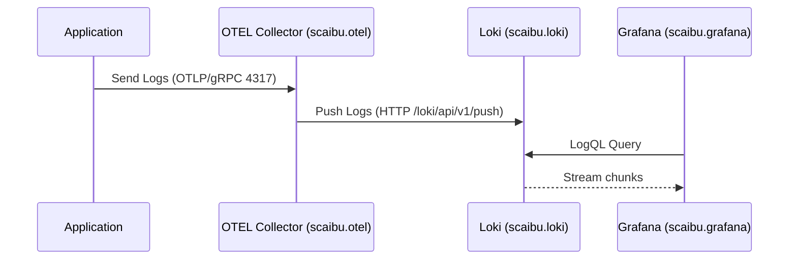
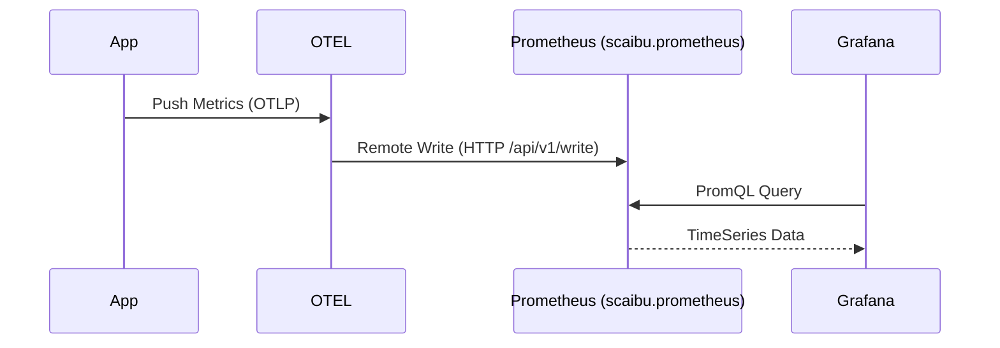

# Deep Dive: Observability Stack Architecture & Setup

This comprehensive technical guide details the design, configuration, mechanics, and automation of the Scaibu Observability Stack. It covers Architecture, Visual flows, Collection guides, API verification, and an exhaustive configuration reference.

---

## 🏗️ 1. Architecture Overview & Data Flow

### 1.1 System Data Flow

#### 1.1.1 Logs Pipeline (Loki)
**Flow**: App → OTEL Collector (Batching) → Loki (Indexing) → Grafana (Query).



#### 1.1.2 Metrics Pipeline (Prometheus)
**Flow**: App → OTEL → Prometheus (Remote Write).



### 1.2 Setup Commands

#### 1.2.1 Network Setup
```bash
# Create required Docker networks
docker network create --driver bridge observability-network || true
docker network create --driver bridge data-network || true
docker network create --driver bridge messaging-network || true
docker network create --driver bridge cicd-network || true
docker network create --driver bridge temporal-network || true
```

#### 1.2.2 Start Temporal Services
```bash
cd infrastructure/orchestrator/config/docker/temporal
docker-compose -f temporal-orchestrator-compose.yaml up -d
cd ../../../../..
```

#### 1.2.3 Start Traefik
```bash
cd infrastructure/orchestrator/config/docker/traefik/config
docker-compose -f traefik-dynamic-docker.yaml up -d
cd ../../../../../..
```

#### 1.2.4 Run Setup Scripts
```bash
source /home/j/live/dinesh/llm-chatbot-python/.venv/bin/activate
python infrastructure/observability/setup/observability_stack_setup_worker.py
python infrastructure/observability/setup/trigger_observability_stack_setup.py setup

# To clean up:
# python infrastructure/observability/setup/trigger_observability_stack_setup.py teardown
```

### 1.3 Service Access

Access the following services after successful setup:

| Service | URL | Credentials |
|---------|-----|-------------|
| **Traefik Dashboard** | [https://scaibu.traefik/dashboard/](https://scaibu.traefik/dashboard/) | - |
| **Grafana** | [https://scaibu.grafana/login](https://scaibu.grafana/login) | `admin` / `SuperSecret123!` |
| **Jaeger UI** | [https://scaibu.jaeger/search](https://scaibu.jaeger/search) | - |
| **Prometheus** | [https://scaibu.prometheus/query](https://scaibu.prometheus/query) | - |
| **Loki** | [https://scaibu.loki/ready](https://scaibu.loki/ready) | - |
| **Alertmanager** | [https://scaibu.alertmanager/#/alerts](https://scaibu.alertmanager/#/alerts) | - |
| **OTEL Collector** | [https://scaibu.otel/](https://scaibu.otel/) | - |

> **Note**: Ensure proper `/etc/hosts` entries or DNS resolution is configured as mentioned in the [Network Configuration Guide](#5-network-configuration) section.

## � 2. Visualization Gallery

### Logs & Metrics

  
  <p><em>Loki Logs Explorer: Showing structured metadata labels.</em></p>

  
  <p><em>Grafana Metrics Dashboard: Request rates and latencies.</em></p>
  
  
  <p><em>Prometheus Targets: Green indicates successful scraping.</em></p>

### 2.2 Distributed Tracing

  
  <p><em>Figure 2.1: Jaeger Trace View showing request latency across services</em></p>

  
  <p><em>Figure 2.2: Detailed trace view with timing breakdown</em></p>

## 💻 3. Telemetry Collection

### 3.1 Using Python Client (Recommended)

The Python client provides a high-level interface that handles `trace_id` injection, batching, and error handling automatically.

```python
from observability_client import ObservabilityClient

# Initialize client
client = ObservabilityClient(
    service_name="your-service-name",
    environment="production"
)

# 1. Structured Logging
client.log_info(
    "User login",
    attributes={
        "user": "admin",
        "ip": "192.168.1.1",
        "status": "success"
    }
)

# 2. Metrics Collection
client.increment_counter(
    value=1,
    name="http_requests_total",
    attributes={
        "route": "/login",
        "method": "POST",
        "status_code": 200
    }
)

# 3. Distributed Tracing
with client.tracer.start_as_current_span("login_flow") as span:
    # Business logic here
    span.set_attribute("user.id", "user123")
    # Nested spans for more detailed tracing
    with client.tracer.start_as_current_span("db_query"):
        # Database operations
        pass
```

### 3.2 Using Raw HTTP API (Advanced)

For environments where the Python client isn't available, you can use the raw HTTP API to send telemetry data directly to the OTEL Collector.

#### Push Logs (HTTP/JSON)

**Endpoint**: `http://scaibu.otel:4318/v1/logs`

```bash
curl -X POST http://localhost:4318/v1/logs \
  -H "Content-Type: application/json" \
  -d '{
    "resourceLogs": [{
      "resource": { 
        "attributes": [
          { "key": "service.name", "value": "manual-curl" },
          { "key": "environment", "value": "development" }
        ]
      },
      "scopeLogs": [{
        "scope": {},
        "logRecords": [{
          "timeUnixNano": "'$(date +%s000000000)'",
          "severityText": "INFO",
          "body": { "stringValue": "Manual log entry via HTTP API" },
          "attributes": [
            { "key": "http.method", "value": "POST" },
            { "key": "endpoint", "value": "/api/v1/logs" }
          ]
        }]
      }]
    }]
  }'

---

## 📚 4. API Reference

### 4.1 API Access

All observability services are exposed through **Traefik** reverse proxy with the following base URL pattern:

```
https://scaibu.<service-name>
```

**Prerequisites**:
- Ensure proper hostname resolution by adding this line to your `/etc/hosts` file:
  ```
  127.0.1.1 scaibu.traefik scaibu.prometheus scaibu.loki scaibu.jaeger scaibu.grafana scaibu.alertmanager scaibu.otel
  ```
- For local development, you may need to use self-signed certificates. Use `-k` or `--insecure` flag with `curl` to bypass certificate validation.

### 4.2 Prometheus API

**Base URL**: `https://scaibu.prometheus/api/v1`

#### Query API

| Endpoint | Method | Description | Parameters |
|----------|--------|-------------|------------|
| **Instant Query** | | Query metrics at a single point in time | |
| `/query` | GET/POST | Execute PromQL query | `query=<string>`, `time=<rfc3339|unix_timestamp>`, `timeout=<duration>` |
| **Range Query** | | Query metrics over a time range | |
| `/query_range` | GET/POST | Execute PromQL query over time range | `query=<string>`, `start=<rfc3339|unix_timestamp>`, `end=<rfc3339|unix_timestamp>`, `step=<duration>`, `timeout=<duration>` |

#### Metadata API

| Endpoint | Method | Description |
|----------|--------|-------------|
| **Targets** | | Monitor scrape targets |
| `/targets` | GET | List all configured targets |
| `/targets/metadata` | GET | Get target metadata |
| **Rules & Alerts** | | Manage alerting and recording rules |
| `/rules` | GET | List all rules |
| `/alerts` | GET | List all active alerts |
| `/alertmanagers` | GET | List active Alertmanagers |
| **Metadata** | | Explore metric metadata |
| `/series` | GET/POST | Find series by label matchers |
| `/labels` | GET/POST | List all label names |
| `/label/<name>/values` | GET | List values for a label |
| **Status** | | System status and configuration |
| `/status/config` | GET | Current configuration |
| `/status/flags` | GET | Command-line flags |
| `/status/runtimeinfo` | GET | Runtime information |
| `/status/buildinfo` | GET | Build information |
| `/status/tsdb` | GET | TSDB statistics |

#### Example Usage

```bash
# Get current CPU usage
curl -k "https://scaibu.prometheus/api/v1/query?query=100%20-%20(avg%20by%20(instance)%20(irate(node_cpu_seconds_total{mode="idle"}[5m]))%20*%20100)"

# Get memory usage over time (1h range with 1m steps)
curl -k "https://scaibu.prometheus/api/v1/query_range?query=node_memory_MemTotal_bytes%20-%20node_memory_MemAvailable_bytes&start=$(date -d '1 hour ago' +%s)&end=$(date +%s)&step=1m"

# List all active alerts
curl -k "https://scaibu.prometheus/api/v1/alerts"
```

> **Note**: For production use, consider using the official [Prometheus Python client](https://github.com/prometheus/client_python) or [PromQL HTTP API client](https://prometheus.io/docs/prometheus/latest/querying/api/) for better integration and error handling.

**Example: Query Metric**
```bash
curl -k "https://scaibu.prometheus/api/v1/query?query=up"
```

**Example: Check Targets**
```bash
curl -k "https://scaibu.prometheus/api/v1/targets"
```

### 4.3 Loki API

**Base URL**: `https://scaibu.loki/loki/api/v1`

Loki is the logging component of the observability stack, providing a powerful query language called LogQL for log aggregation and analysis.

#### Query API

| Endpoint | Method | Description | Parameters |
|----------|--------|-------------|------------|
| **Log Queries** | | Query logs using LogQL | |
| `/query_range` | GET | Query logs over a range of time | `query=<logql>`, `start=<unix_epoch>`, `end=<unix_epoch>`, `limit=<number>`, `direction=<forward|backward>` |
| `/query` | GET | Query logs at a single point in time | `query=<logql>`, `limit=<number>`, `time=<unix_epoch>` |
| **Log Streaming** | | Stream logs in real-time | |
| `/tail` | GET | Stream logs (WebSocket) | `query=<logql>`, `delay_for=<seconds>` |

#### Metadata API

| Endpoint | Method | Description |
|----------|--------|-------------|
| **Labels** | | Explore log labels |
| `/labels` | GET | List all available label names |
| `/label/<name>/values` | GET | List values for a specific label |
| **Series** | | Discover log streams |
| `/series` | GET | Find log streams by label matchers |
| **Status** | | System information |
| `/status/buildinfo` | GET | Loki version information |
| `/ready` | GET | Health check endpoint |
| `/flush` | POST | Flush in-memory chunks to storage |

#### Example Usage

```bash
# Query logs from the last hour
curl -k -G "https://scaibu.loki/loki/api/v1/query_range" \
  --data-urlencode 'query={job="otel-collector"} |~ "error" | json | level="error"' \
  --data-urlencode "start=$(date -d '1 hour ago' +%s)000000000" \
  --data-urlencode "end=$(date +%s)000000000" \
  --data-urlencode 'limit=50' \
  --data-urlencode 'direction=backward'

# Get label values for 'container_name'
curl -k "https://scaibu.loki/loki/api/v1/label/container_name/values"

# Stream logs in real-time (WebSocket)
wscat -c "wss://scaibu.loki/loki/api/v1/tail?query={job=\"otel-collector\"}"
```

### 4.4 Jaeger API

**Base URL**: `https://scaibu.jaeger/api`

Jaeger provides distributed tracing capabilities, allowing you to monitor and troubleshoot transactions in complex distributed systems.

#### Trace API

| Endpoint | Method | Description | Parameters |
|----------|--------|-------------|------------|
| **Trace Search** | | Find traces | |
| `/traces` | GET | Search for traces | `service=<name>`, `operation=<operation>`, `tags=<json>`, `start=<timestamp>`, `end=<timestamp>`, `minDuration=<duration>`, `limit=<number>` |
| **Trace Details** | | Get trace details | |
| `/traces/{traceId}` | GET | Get a single trace by ID | - |
| **Services** | | Service discovery | |
| `/services` | GET | List all services | - |
| `/services/{service}/operations` | GET | List operations for a service | - |
| **Dependencies** | | Service dependencies | |
| `/dependencies` | GET | Get service dependencies | `endTs=<timestamp>`, `lookback=<duration>` |

#### Example Usage

```bash
# Find recent traces for a specific service
curl -k "https://scaibu.jaeger/api/traces?service=observability-client&limit=10"

# Get details for a specific trace
TRACE_ID="1a2b3c4d5e6f7g8h"
curl -k "https://scaibu.jaeger/api/traces/${TRACE_ID}"

# List all services
curl -k "https://scaibu.jaeger/api/services"

# Get service operations
curl -k "https://scaibu.jaeger/api/services/observability-client/operations"

# Get service dependencies (last hour)
END_TS=$(date +%s000000)
curl -k "https://scaibu.jaeger/api/dependencies?endTs=${END_TS}&lookback=3600000000000"
```

> **Note**: When working with timestamps in the API, they should be in microseconds since Unix epoch. For example, use `date +%s000000` to get the current time in microseconds.

---

## ⚙️ 5. Configuration Deep Dive

### 5.1 [otel-config.yaml](file:///home/j/live/dinesh/llm-chatbot-python/infrastructure/observability/setup/config/otel-config.yaml)
**Receivers (Input)**
- `otlp` (4317/4318): Universal ingestion.
- `filelog`: Tailing `/var/lib/docker/containers/*/*.log` on the host.

**Processors**
- `batch`: Aggregates for 10s or 1024 spans.
- `memory_limiter`: Hard limit at 400MiB.

**Exporters (Output)**
- `loki`: `http://scaibu.loki:3100/loki/api/v1/push` (Internal DNS via Docker network or IP `172.28.0.30`)
- `prometheusremotewrite`: `http://scaibu.prometheus:9090/api/v1/write`

### 5.2 [prometheus.yml](file:///home/j/live/dinesh/llm-chatbot-python/infrastructure/observability/setup/config/prometheus.yml)
- **Scrape Interval**: 30s global default.
- **Service Discovery**: Uses `docker_sd_configs` to find containers via `/var/run/docker.sock`.
- **Relabeling**: Maps `__meta_docker_container_name` to `container_name`.

### 5.3 [loki-config.yaml](file:///home/j/live/dinesh/llm-chatbot-python/infrastructure/observability/setup/config/loki-config.yaml)
- **Retention**: 720h (30 days).
- **Storage**: Filesystem based (`/loki/chunks`).
- **Ingestion Limits**: 10MB/sec/user.

---

## 🤖 6. Automation Scripts

- **`observability_stack_setup_workflow.py`**: Full lifecycle orchestration.
- **`observability_stack_setup_activities.py`**: Atomic operations (Network, Docker, Certs).

---

## 🌐 Network Configuration Guide

### 1) Immediate, minimal fix (fast, non-persistent)

Run these three commands to add the hostname and ensure the loopback address exists now:

```bash
# 1) backup current hosts
sudo cp /etc/hosts /etc/hosts.pre-$(date +%F_%T)

# 2) add the traefik host mapping
echo "127.0.2.1 scaibu.traefik" | sudo tee -a /etc/hosts

# 3) ensure the loopback alias exists (ephemeral until reboot)
sudo ip addr add 127.0.2.1/32 dev lo || true

# Verify
getent hosts scaibu.traefik
ping -c1 scaibu.traefik
curl -Ik -H "Host: scaibu.traefik" https://127.0.2.1 --insecure -v
```

**Expected results**
- `getent hosts scaibu.traefik` returns `127.0.2.1 scaibu.traefik`.
- `ping` succeeds (or at least resolves).
- `curl` returns Traefik's HTTP headers (or an HTTPS cert mismatch, which `--insecure` suppresses).

### 2) Persistent loopback alias (survives reboot)

Create a small systemd service so 127.0.2.1 is added on boot:

```bash
sudo tee /etc/systemd/system/loopback-127-0-2-1.service > /dev/null <<'EOF'
[Unit]
Description=Add loopback alias 127.0.2.1
After=network-pre.target

[Service]
Type=oneshot
ExecStart=/sbin/ip addr add 127.0.2.1/32 dev lo
ExecStop=/sbin/ip addr del 127.0.2.1/32 dev lo
RemainAfterExit=yes

[Install]
WantedBy=multi-user.target
EOF

sudo systemctl daemon-reload
sudo systemctl enable --now loopback-127-0-2-1.service
```

### 3) Persistent /etc/hosts entry

Appending to `/etc/hosts` is persistent across reboots. To group all scaibu.* names on one line:

```bash
sudo sed -i '/scaibu.traefik/d' /etc/hosts
echo "127.0.2.1 scaibu.traefik scaibu.otel scaibu.prometheus scaibu.loki scaibu.jaeger scaibu.alertmanager scaibu.grafana" | sudo tee -a /etc/hosts
```

### 4) Quick rollback (if needed)

```bash
# remove the host entry
sudo sed -i '/scaibu.traefik/d' /etc/hosts

# remove loopback alias now
sudo ip addr del 127.0.2.1/32 dev lo || true

# if you enabled the systemd service:
sudo systemctl disable --now loopback-127-0-2-1.service || true
sudo rm -f /etc/systemd/system/loopback-127-0-2-1.service
sudo systemctl daemon-reload
```

### 5) Troubleshooting

- If you see browser NXDOMAIN after making changes:
  - Clear the browser DNS cache (close/reopen the browser)
  - Verify with `getent hosts scaibu.traefik` on the host
  - If using WSL/VM/containers, update `/etc/hosts` in the environment where the browser runs

- Check if the service is listening:
  ```bash
  sudo ss -ltnp | grep 127.0.2.1
  ```

- Verify name resolution:
  ```bash
  getent hosts scaibu.traefik
  dig @127.0.0.1 scaibu.traefik  # Only works if you have a local DNS server
  ```

## 🔍 Comprehensive Troubleshooting Guide

### Diagnostic Commands

Run these commands on the host machine to diagnose issues:

#### 1. Hosts and Resolution
```bash
# Check current hosts file
sudo cat /etc/hosts

# Look for scaibu/traefik entries
grep -nE "scaibu|traefik" /etc/hosts || true

# Verify hostname resolution
getent hosts scaibu.traefik || true
```

#### 2. Network Interface & Loopback
```bash
# Show loopback interface details
ip addr show lo | sed -n '1,20p'

# Check for 127.* aliases
ip addr | grep -n "127\." -n || true
```

#### 3. DNS Resolution
```bash
# Check name service switch configuration
cat /etc/nsswitch.conf

# Check systemd-resolved status
systemctl status systemd-resolved --no-pager || true

# Check DNS resolution
resolvectl status || nmcli dev show | grep DNS || true
```

#### 4. Listening Sockets
```bash
# Check for services on ports 80/443
sudo ss -ltnp | egrep ':80|:443' || true

# Check for services on 127.0.2.1
sudo ss -ltnp | grep 127.0.2.1 || true
```

#### 5. Direct HTTP Test
```bash
# Test direct HTTP access with host header
curl -Ik -H "Host: scaibu.traefik" https://127.0.2.1 --insecure -v
```

#### 6. Docker & Traefik Checks
```bash
# Check Traefik container status
docker ps --filter name=traefik-scaibu -a

# Check exposed ports
docker port traefik-scaibu || true

# Inspect network settings
docker inspect traefik-scaibu --format '{{json .NetworkSettings}}' | jq . || docker inspect traefik-scaibu

# Check network configuration
docker network inspect cicd-network | jq .
```

#### 7. Check Hosts Backups
```bash
# List host file backups
ls -l /home/j/.hosts_backups/ || true

# View backup contents
sudo sed -n '1,200p' /home/j/.hosts_backups/hosts.backup.20251218_120735 || true
```

### Common Issues and Solutions

#### 1. Host Resolution Failure
**Symptom**: `curl: (6) Could not resolve host: scaibu.traefik`
**Cause**: DNS name not resolving on the client
**Fixes**:
- Verify `/etc/hosts` contains the correct entry
- Check `nsswitch.conf` order (should have `files` before `dns`)
- Clear DNS cache if applicable

#### 2. Service Not Reachable
**Symptom**: Connection refused or timeout when accessing service
**Checks**:
- Verify service is running: `docker ps | grep traefik`
- Check service logs: `docker logs traefik-scaibu`
- Verify port binding: `ss -tuln | grep 443`

#### 3. Browser Shows NXDOMAIN
**Symptom**: Browser shows "This site can't be reached" with NXDOMAIN
**Solutions**:
- Clear browser DNS cache
- Verify system DNS resolution: `dig +short scaibu.traefik`
- Check if host entry exists: `grep scaibu.traefik /etc/hosts`
- Try accessing via IP: `curl -k https://127.0.2.1 -H "Host: scaibu.traefik"`

#### 4. Loopback Alias Missing
**Symptom**: Can't bind to 127.0.2.1
**Fix**:
```bash
# Add loopback alias (temporary)
sudo ip addr add 127.0.2.1/32 dev lo

# Or make it persistent with systemd (see section 2 above)
```

### Quick Fixes

#### 1. Reset Hosts File
```bash
# Backup current hosts
sudo cp /etc/hosts /etc/hosts.backup.$(date +%Y%m%d_%H%M%S)

# Add all scaibu entries
echo "127.0.2.1 scaibu.traefik scaibu.prometheus scaibu.loki scaibu.jaeger scaibu.alertmanager scaibu.grafana scaibu.otel" | sudo tee -a /etc/hosts
```

#### 2. Alternative Port Binding
If using Docker, modify `docker-compose.yml` to bind to different ports:
```yaml
ports:
  - "127.0.0.1:8080:80"
  - "127.0.0.1:8443:443"
```

#### 3. Check Service Logs
```bash
# View Traefik logs
docker logs traefik-scaibu

# View container logs with timestamps
docker logs --tail 100 -f traefik-scaibu
```

### Debugging Network Issues

1. **Verify Network Connectivity**
   ```bash
   # Test connectivity to Traefik
   curl -v -H "Host: scaibu.traefik" http://127.0.2.1
   
   # Test with IP only
   curl -k https://127.0.2.1
   ```

2. **Check Firewall Rules**
   ```bash
   # Check iptables rules
   sudo iptables -L -n -v
   
   # Check for DOCKER chain
   sudo iptables -t nat -L -n -v
   ```

3. **Inspect Docker Network**
   ```bash
   # List all networks
   docker network ls
   
   # Inspect network
   docker network inspect cicd-network
   ```

### Final Verification

After applying fixes, verify everything works:

```bash
# Check hosts file
grep scaibu /etc/hosts

# Test DNS resolution
getent hosts scaibu.traefik

# Test HTTP access
curl -Ik -H "Host: scaibu.traefik" https://127.0.2.1 --insecure

# Check container status
docker ps | grep -E 'traefik|prometheus|loki|jaeger|grafana'
```

If issues persist, check the logs of individual containers and verify network connectivity between them.
