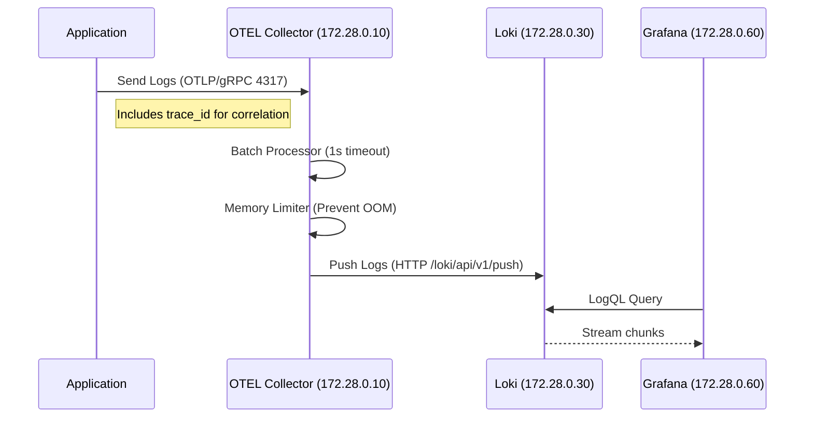
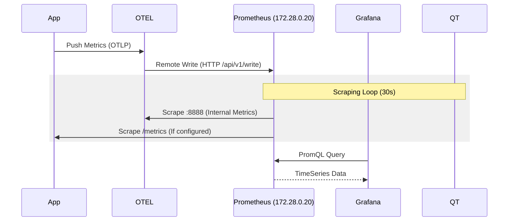

# Deep Dive: Observability Stack Architecture & Setup

This comprehensive technical guide details the design, configuration, mechanics, and automation of the Scaibu Observability Stack. It includes visual flows, collection guides, API verification, and an exhaustive configuration reference.

---

## 🏗️ 1. Architecture Overview & Data Flow

The stack runs on a dedicated Docker network (`172.28.0.0/16`) with static IPs. This design choice safeguards against Docker's internal DNS resolution failures during high load and simplifies hardcoded scrape targets.

### 🧠 System Data Flow (Mermaid Config)

The following diagrams illustrate the exact path of telemetry data.

#### 1.1 Logs Pipeline (Loki)
**Flow**: App -> OTEL Collector (Batching/Processing) -> Loki (Indexing) -> Grafana (Query).



#### 1.2 Metrics Pipeline (Prometheus)
**Flow**: App -> OTEL -> Prometheus (Remote Write) OR Prometheus -> Scraping Targets.



---

## 📸 2. Visualization Gallery

### Logs & Matrices
<div align="center">
  
  <p><em>Loki Logs Explorer: Note the structured metadata labels (job, service).</em></p>

  
  <p><em>Grafana Dashboard: Visualizing Request Rates and Latencies.</em></p>
  
  
  <p><em>Prometheus Targets: Green indicates successful scraping.</em></p>
</div>

### Tracing
<div align="center">
  
  <p><em>Jaeger Trace View: Gantt chart of request latency across services.</em></p>

  
  <p><em>trace-level detail: Identifies exactly which function caused a slowdown.</em></p>
</div>

---

## ⚙️ 3. Configuration Deep Dive (The "Why" and "How")

This section explains the critical files in `infrastructure/observability/setup/config/`.

### 3.1 [otel-config.yaml](file:///home/j/live/dinesh/llm-chatbot-python/infrastructure/observability/setup/config/otel-config.yaml)
The **OpenTelemetry Collector** is the central data router.

**1. Receivers (Input):**
- **`otlp`**: The standard protocol. Listens on **4317 (gRPC)** and **4318 (HTTP)**. Your `observability_client.py` sends data here.
- **`filelog`**:  
  ```yaml
  include: [ /var/lib/docker/containers/*/*.log ]
  ```
  This magic configuration reads raw Docker JSON logs from the host (mounted volume).
  - **`json_parser`**: Parses the timestamp from the `time` field in the JSON log.
  - **`regex_parser`**: Extracts the container ID from the filename to tag logs with `container_id`.

**2. Processors (Transformation):**
- **`batch`**: Aggregates data for 10s or 1024 spans before sending. **Crucial for performance**; reduces network calls to Loki/Prometheus.
- **`memory_limiter`**: Checks memory usage every 1s. If usage > 400MiB, it starts dropping data to prevent the container from crashing.
- **`resource`**: Adds global tags like `env=production` to every single log/metric.

**3. Exporters (Output):**
- **`prometheusremotewrite`**: Sends metrics to Prometheus. We use this instead of scraping for OTLP metrics.
- **`loki`**: Pushes logs to Loki.
- **`otlp/jaeger`**: Forwards traces to Jaeger.

---

### 3.2 [prometheus.yml](file:///home/j/live/dinesh/llm-chatbot-python/infrastructure/observability/setup/config/prometheus.yml)
Prometheus pulls metrics (pull-model).

**1. Service Discovery (`docker_sd_configs`):**
Prometheus talks to the Docker Daemon socket (`unix:///var/run/docker.sock`).
- It automatically finds ALL running containers.
- **Relabeling Rules**:
  - `source_labels: [__meta_docker_container_name]` -> `target_label: container_name`
  - This ensures your metrics have readable names like `container_name="otel-collector"` instead of random IDs.

**2. Scrape Jobs:**
- `otel-collector-apps` (Port 8889): This is where the OTEL Collector exposes metrics it received from your apps.
- `alertmanager`, `loki`, `jaeger`: Prometheus monitors the monitoring stack itself (meta-monitoring).

---

### 3.3 [loki-config.yaml](file:///home/j/live/dinesh/llm-chatbot-python/infrastructure/observability/setup/config/loki-config.yaml)
Loki is like Prometheus, but for logs.

**1. Storage Schema (`v13`):**
- **`index`**: Stores the labels (timestamp, app_name). Kept in BoltDB (or TSDB).
- **`chunks`**: Stores the actual log text. Stored on filesystem (`/loki/chunks`).
- **Why split?** Searching the index is fast. Loading chunks is only done when you request the log lines.

**2. Limits:**
- `retention_period: 720h` (30 Days). Logs older than this are deleted by the Compactor.
- `ingestion_rate_mb: 10`: Prevents a spammy application from overwhelming the implementation.

---

### 3.4 [alerting-rules.yml](file:///home/j/live/dinesh/llm-chatbot-python/infrastructure/observability/setup/config/alerting-rules.yml)
Defines the PromQL expressions that trigger alerts.

- **`up == 0`**: The `up` metric is generated by Prometheus for every scrape target. 1 = Healthy, 0 = Unreachable.
- **`container_memory_usage_bytes / limit > 0.9`**: Calculates % usage. Derived from cAdvisor metrics automatically collected by the Docker integration.

---

## � 4. How to Collect Telemetry (Code Patterns)

### 4.1 Collecting Logs (Best Practices)
Don't use `print()`. Use structured logging. `trace_id` is automatically injected by the OTEL SDK if you are inside a span.

```python
# GOOD: Automated context injection
client.log_info("User login attempt", {"username": "admin", "ip": "10.0.0.1"})

# Result in Loki:
# {level="info", username="admin", ip="10.0.0.1", trace_id="a1b2...", msg="User login attempt"}
```

### 4.2 Collecting Tracing (Nested Spans)
Context managers (`with`) ensure spans are closed even if errors occur.

```python
with client.tracer.start_as_current_span("parent_operation") as parent:
    try:
        with client.tracer.start_as_current_span("child_db_query") as child:
             child.set_attribute("db.statement", "SELECT * FROM users")
             # logic...
    except Exception as e:
        parent.record_exception(e)  # Shows up as red error in Jaeger
        parent.set_status(Status(StatusCode.ERROR))
```

---

## 🔍 5. Verification APIs (The "No-UI" Check)

If you need to verify programmatically (e.g., in CI/CD pipeline):

**1. Metrics (Prometheus)**
```bash
# Check if your specific counter exists and has value > 0
curl -g 'https://scaibu.grafana/api/datasources/proxy/uid/prometheus/api/v1/query?query=test_counter_total{action="test"}'
```

**2. Logs (Loki)**
Loki requires a time range. `start` is unix epoch nanoseconds (or relative).
```bash
# Query last 1 hour of logs for your service
curl -G -k "https://scaibu.grafana/api/datasources/proxy/uid/loki/loki/api/v1/query_range" \
    --data-urlencode 'query={service="observability-client"}' \
    --data-urlencode 'start=1700000000000000000'
```

---

## 🦾 6. Automation & Infrastructure

### 6.1 Workflow Logic (`observability_stack_setup_workflow.py`)
Because we use **Traefik** for SSL, the setup order is strict:

1.  **Network**: Create `172.28.0.0/16`.
2.  **Certs**: Generate `scaibu.grafana.crt`.
3.  **Config**: Write `traefik_dynamic_tls.yaml`.
4.  **IP Allocation**: Check for IP conflicts, then claim `172.28.0.60`.
5.  **Hosts**: `sudo` edit `/etc/hosts` to map `127.0.1.1` to `scaibu.grafana`.
6.  **Stack**: `docker-compose up`.
7.  **Verify**: Loop `docker inspect` until `State.Health.Status == healthy`.

This ensures that when the user opens the browser, HTTPS works immediately without "Not Secure" warnings (assuming `mkcert` CA is installed).
