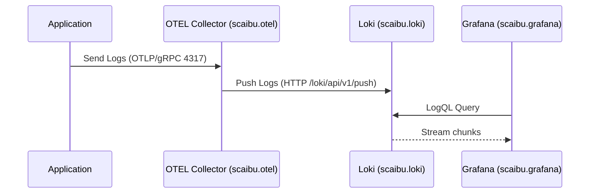
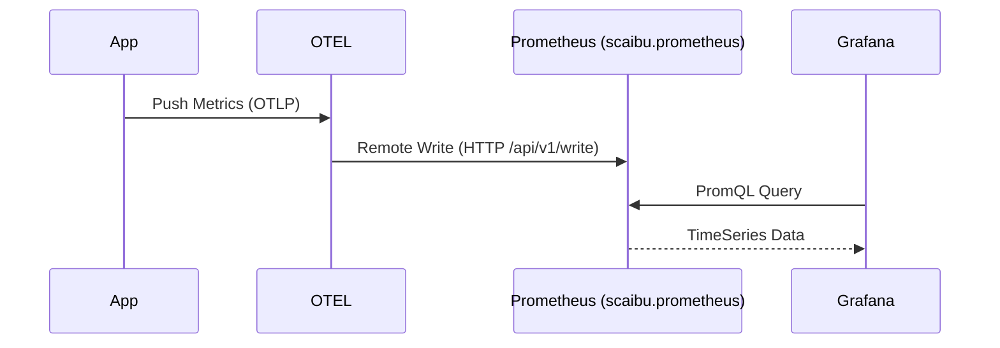

# Deep Dive: Observability Stack Architecture & Setup

This comprehensive technical guide details the design, configuration, mechanics, and automation of the Scaibu Observability Stack. It covers Architecture, Visual flows, Collection guides, API verification, and an exhaustive configuration reference.

---

## 🏗️ 1. Architecture Overview & Data Flow

### 🧠 System Data Flow (Mermaid Config)

#### 1.1 Logs Pipeline (Loki)
**Flow**: App -> OTEL Collector (Batching) -> Loki (Indexing) -> Grafana (Query).



#### 1.2 Metrics Pipeline (Prometheus)
**Flow**: App -> OTEL -> Prometheus (Remote Write).



---

## 📸 1.2. Setup command

```bash
docker network create --driver bridge observability-network || true
docker network create --driver bridge data-network || true
docker network create --driver bridge messaging-network || true
docker network create --driver bridge cicd-network || true
docker network create --driver bridge temporal-network || true


cd infrastructure/orchestrator/config/docker/temporal

docker-compose -f temporal-orchestrator-compose.yaml up -d

cd ../../../../..


cd infrastructure/orchestrator/config/docker/traefik/config

docker-compose -f traefik-dynamic-docker.yaml up -d

cd ../../../../../..

source /home/j/live/dinesh/llm-chatbot-python/.venv/bin/activate

python infrastructure/observability/setup/observability_stack_setup_worker.py

python infrastructure/observability/setup/trigger_observability_stack_setup.py setup

# to cleaning it 
python infrastructure/observability/setup/trigger_observability_stack_setup.py teardown

```


## 📸 2. Visualization Gallery

### Logs & Metrics

  
  <p><em>Loki Logs Explorer: Showing structured metadata labels.</em></p>

  
  <p><em>Grafana Metrics Dashboard: Request rates and latencies.</em></p>
  
  
  <p><em>Prometheus Targets: Green indicates successful scraping.</em></p>


### Tracing

  
  <p><em>Jaeger Trace View: Gantt chart of request latency.</em></p>

  
  <p><em>Trace-level detail: Identifies specific function slowdowns.</em></p>
  

---

## 💻 3. How to Collect Telemetry (Code & Raw API)

You have two options: High-level Python Client (Recommended) or Raw HTTP API.

### 3.1 Using Python Client (Recommended)
This handles `trace_id` injection, batching, and error handling automatically.

```python
from observability_client import ObservabilityClient
client = ObservabilityClient()

# 1. Logs
client.log_info("User login", {"user": "admin"})

# 2. Metrics
client.increment_counter(1, {"route": "/login"})

# 3. Tracing
with client.tracer.start_as_current_span("login_flow"):
    # actual business logic
    pass
```

### 3.2 Using Raw HTTP (Advanced)
If you cannot use the Python SDK, you can push directly to **OTEL Collector**.

**Push Logs (HTTP/JSON)**
*Endpoint*: `http://scaibu.otel:4318/v1/logs` (Internal)
```bash
curl -X POST http://localhost:4318/v1/logs \
  -H "Content-Type: application/json" \
  -d '{
    "resourceLogs": [{
      "resource": { "attributes": [{ "key": "service.name", "value": "manual-curl" }] },
      "scopeLogs": [{
        "logRecords": [{
          "timeUnixNano": "1700000000000000000",
          "severityText": "INFO",
          "body": { "stringValue": "Manual log via Curl" },
          "attributes": [{ "key": "http.method", "value": "POST" }]
        }]
      }]
    }]
  }'
```

---

## 📚 4. Comprehensive API Reference

All services are exposed securely via **Traefik** on `https://scaibu.<service>`.
*Note: Ensure `127.0.1.1 scaibu.prometheus scaibu.loki scaibu.jaeger` is in your `/etc/hosts`.*

### 4.1 Prometheus API (`https://scaibu.prometheus`)

**Base URL**: `https://scaibu.prometheus/api/v1`

| Endpoint | Method | Description |
|----------|--------|-------------|
| **Instant Queries** || Evaluate query at a single point in time. |
| `/query` | GET/POST | `query=<promql>&time=<ts>` |
| **Range Queries** || Evaluate query over a range of time. |
| `/query_range` | GET/POST | `query=<promql>&start=<ts>&end=<ts>&step=<sec>` |
| **Metadata** || |
| `/targets` | GET | List all scrape targets and their health. |
| `/rules` | GET | List alerting and recording rules. |
| `/alerts` | GET | List all active alerts. |
| `/alertmanagers` | GET | List active Alertmanagers. |
| `/series` | GET/POST | Find series by label matchers (`match[]=<selector>`). |
| `/labels` | GET/POST | List all label names. |
| `/label/<name>/values` | GET | List all values for a label. |
| `/targets/metadata` | GET | Get metric metadata from targets. |
| **Status** || |
| `/status/buildinfo` | GET | Prometheus version info. |
| `/status/tsdb` | GET | TSDB cardinality stats. |
| `/status/config` | GET | Current loaded configuration (YAML). |
| `/status/flags` | GET | Command-line flags. |
| **Admin** || *(Requires Admin API enabled)* |
| `/admin/tsdb/snapshot` | POST | Create data snapshot. |
| `/admin/tsdb/delete_series` | POST | Delete series. |
| `/admin/tsdb/clean_tombstones` | POST | Clean deleted data from disk. |

**Example: Query Metric**
```bash
curl -k "https://scaibu.prometheus/api/v1/query?query=up"
```

**Example: Check Targets**
```bash
curl -k "https://scaibu.prometheus/api/v1/targets"
```

### 4.2 Loki API (`https://scaibu.loki`)

**Base URL**: `https://scaibu.loki/loki/api/v1`

| Endpoint | Method | Description |
|----------|--------|-------------|
| **Ingestion** || |
| `/push` | POST | Ingest logs (Protobuf/JSON). |
| **Querying** || |
| `/query` | GET | Instant LogQL query. |
| `/query_range` | GET | LogQL query over time range. |
| `/tail` | GET | Stream logs in real-time (WebSocket/HTTP). |
| **Metadata** || |
| `/labels` | GET | List label names. |
| `/label/<name>/values` | GET | List label values. |
| `/series` | GET | Find log streams. |
| `/index/stats` | GET | Index statistics. |
| **Rules (Ruler)** || |
| `/rules` | GET | List alerting rules. |
| `/rules/{namespace}` | GET/POST | Manage rules per namespace. |
| **Status/Admin** || |
| `/delete` | POST | Delete logs (requires configuration). |
| `/status/buildinfo` | GET | Loki version info. |
| `/ready` | GET | Readiness probe. |
| `/flush` | POST | Flush chunks to storage. |

**Example: Range Query**
```bash
curl -k -G "https://scaibu.loki/loki/api/v1/query_range" \
  --data-urlencode 'query={job="otel-collector"}' \
  --data-urlencode 'limit=10'
```

### 4.3 Jaeger API (`https://scaibu.jaeger`)

**Base URL**: `https://scaibu.jaeger/api`

| Endpoint | Method | Description |
|----------|--------|-------------|
| `/traces` | GET | Find traces (`service=<name>`). |
| `/traces/{traceID}` | GET | Get single trace details. |
| `/services` | GET | List all services. |
| `/dependencies` | GET | Service dependency graph. |

**Example: Find Traces**
```bash
curl -k "https://scaibu.jaeger/api/traces?service=observability-client"
```

---

## ⚙️ 5. Configuration Deep Dive

### 5.1 [otel-config.yaml](file:///home/j/live/dinesh/llm-chatbot-python/infrastructure/observability/setup/config/otel-config.yaml)
**Receivers (Input)**
- `otlp` (4317/4318): Universal ingestion.
- `filelog`: Tailing `/var/lib/docker/containers/*/*.log` on the host.

**Processors**
- `batch`: Aggregates for 10s or 1024 spans.
- `memory_limiter`: Hard limit at 400MiB.

**Exporters (Output)**
- `loki`: `http://scaibu.loki:3100/loki/api/v1/push` (Internal DNS via Docker network or IP `172.28.0.30`)
- `prometheusremotewrite`: `http://scaibu.prometheus:9090/api/v1/write`

### 5.2 [prometheus.yml](file:///home/j/live/dinesh/llm-chatbot-python/infrastructure/observability/setup/config/prometheus.yml)
- **Scrape Interval**: 30s global default.
- **Service Discovery**: Uses `docker_sd_configs` to find containers via `/var/run/docker.sock`.
- **Relabeling**: Maps `__meta_docker_container_name` to `container_name`.

### 5.3 [loki-config.yaml](file:///home/j/live/dinesh/llm-chatbot-python/infrastructure/observability/setup/config/loki-config.yaml)
- **Retention**: 720h (30 days).
- **Storage**: Filesystem based (`/loki/chunks`).
- **Ingestion Limits**: 10MB/sec/user.

---

## 🤖 6. Automation Scripts

- **`observability_stack_setup_workflow.py`**: Full lifecycle orchestration.
- **`observability_stack_setup_activities.py`**: Atomic operations (Network, Docker, Certs).

---

## 🌐 Network Configuration Guide

### 1) Immediate, minimal fix (fast, non-persistent)

Run these three commands to add the hostname and ensure the loopback address exists now:

```bash
# 1) backup current hosts
sudo cp /etc/hosts /etc/hosts.pre-$(date +%F_%T)

# 2) add the traefik host mapping
echo "127.0.2.1 scaibu.traefik" | sudo tee -a /etc/hosts

# 3) ensure the loopback alias exists (ephemeral until reboot)
sudo ip addr add 127.0.2.1/32 dev lo || true

# Verify
getent hosts scaibu.traefik
ping -c1 scaibu.traefik
curl -Ik -H "Host: scaibu.traefik" https://127.0.2.1 --insecure -v
```

**Expected results**
- `getent hosts scaibu.traefik` returns `127.0.2.1 scaibu.traefik`.
- `ping` succeeds (or at least resolves).
- `curl` returns Traefik's HTTP headers (or an HTTPS cert mismatch, which `--insecure` suppresses).

### 2) Persistent loopback alias (survives reboot)

Create a small systemd service so 127.0.2.1 is added on boot:

```bash
sudo tee /etc/systemd/system/loopback-127-0-2-1.service > /dev/null <<'EOF'
[Unit]
Description=Add loopback alias 127.0.2.1
After=network-pre.target

[Service]
Type=oneshot
ExecStart=/sbin/ip addr add 127.0.2.1/32 dev lo
ExecStop=/sbin/ip addr del 127.0.2.1/32 dev lo
RemainAfterExit=yes

[Install]
WantedBy=multi-user.target
EOF

sudo systemctl daemon-reload
sudo systemctl enable --now loopback-127-0-2-1.service
```

### 3) Persistent /etc/hosts entry

Appending to `/etc/hosts` is persistent across reboots. To group all scaibu.* names on one line:

```bash
sudo sed -i '/scaibu.traefik/d' /etc/hosts
echo "127.0.2.1 scaibu.traefik scaibu.otel scaibu.prometheus scaibu.loki scaibu.jaeger scaibu.alertmanager scaibu.grafana" | sudo tee -a /etc/hosts
```

### 4) Quick rollback (if needed)

```bash
# remove the host entry
sudo sed -i '/scaibu.traefik/d' /etc/hosts

# remove loopback alias now
sudo ip addr del 127.0.2.1/32 dev lo || true

# if you enabled the systemd service:
sudo systemctl disable --now loopback-127-0-2-1.service || true
sudo rm -f /etc/systemd/system/loopback-127-0-2-1.service
sudo systemctl daemon-reload
```

### 5) Troubleshooting

- If you see browser NXDOMAIN after making changes:
  - Clear the browser DNS cache (close/reopen the browser)
  - Verify with `getent hosts scaibu.traefik` on the host
  - If using WSL/VM/containers, update `/etc/hosts` in the environment where the browser runs

- Check if the service is listening:
  ```bash
  sudo ss -ltnp | grep 127.0.2.1
  ```

- Verify name resolution:
  ```bash
  getent hosts scaibu.traefik
  dig @127.0.0.1 scaibu.traefik  # Only works if you have a local DNS server
  ```

## 🔍 Comprehensive Troubleshooting Guide

### Diagnostic Commands

Run these commands on the host machine to diagnose issues:

#### 1. Hosts and Resolution
```bash
# Check current hosts file
sudo cat /etc/hosts

# Look for scaibu/traefik entries
grep -nE "scaibu|traefik" /etc/hosts || true

# Verify hostname resolution
getent hosts scaibu.traefik || true
```

#### 2. Network Interface & Loopback
```bash
# Show loopback interface details
ip addr show lo | sed -n '1,20p'

# Check for 127.* aliases
ip addr | grep -n "127\." -n || true
```

#### 3. DNS Resolution
```bash
# Check name service switch configuration
cat /etc/nsswitch.conf

# Check systemd-resolved status
systemctl status systemd-resolved --no-pager || true

# Check DNS resolution
resolvectl status || nmcli dev show | grep DNS || true
```

#### 4. Listening Sockets
```bash
# Check for services on ports 80/443
sudo ss -ltnp | egrep ':80|:443' || true

# Check for services on 127.0.2.1
sudo ss -ltnp | grep 127.0.2.1 || true
```

#### 5. Direct HTTP Test
```bash
# Test direct HTTP access with host header
curl -Ik -H "Host: scaibu.traefik" https://127.0.2.1 --insecure -v
```

#### 6. Docker & Traefik Checks
```bash
# Check Traefik container status
docker ps --filter name=traefik-scaibu -a

# Check exposed ports
docker port traefik-scaibu || true

# Inspect network settings
docker inspect traefik-scaibu --format '{{json .NetworkSettings}}' | jq . || docker inspect traefik-scaibu

# Check network configuration
docker network inspect cicd-network | jq .
```

#### 7. Check Hosts Backups
```bash
# List host file backups
ls -l /home/j/.hosts_backups/ || true

# View backup contents
sudo sed -n '1,200p' /home/j/.hosts_backups/hosts.backup.20251218_120735 || true
```

### Common Issues and Solutions

#### 1. Host Resolution Failure
**Symptom**: `curl: (6) Could not resolve host: scaibu.traefik`
**Cause**: DNS name not resolving on the client
**Fixes**:
- Verify `/etc/hosts` contains the correct entry
- Check `nsswitch.conf` order (should have `files` before `dns`)
- Clear DNS cache if applicable

#### 2. Service Not Reachable
**Symptom**: Connection refused or timeout when accessing service
**Checks**:
- Verify service is running: `docker ps | grep traefik`
- Check service logs: `docker logs traefik-scaibu`
- Verify port binding: `ss -tuln | grep 443`

#### 3. Browser Shows NXDOMAIN
**Symptom**: Browser shows "This site can't be reached" with NXDOMAIN
**Solutions**:
- Clear browser DNS cache
- Verify system DNS resolution: `dig +short scaibu.traefik`
- Check if host entry exists: `grep scaibu.traefik /etc/hosts`
- Try accessing via IP: `curl -k https://127.0.2.1 -H "Host: scaibu.traefik"`

#### 4. Loopback Alias Missing
**Symptom**: Can't bind to 127.0.2.1
**Fix**:
```bash
# Add loopback alias (temporary)
sudo ip addr add 127.0.2.1/32 dev lo

# Or make it persistent with systemd (see section 2 above)
```

### Quick Fixes

#### 1. Reset Hosts File
```bash
# Backup current hosts
sudo cp /etc/hosts /etc/hosts.backup.$(date +%Y%m%d_%H%M%S)

# Add all scaibu entries
echo "127.0.2.1 scaibu.traefik scaibu.prometheus scaibu.loki scaibu.jaeger scaibu.alertmanager scaibu.grafana scaibu.otel" | sudo tee -a /etc/hosts
```

#### 2. Alternative Port Binding
If using Docker, modify `docker-compose.yml` to bind to different ports:
```yaml
ports:
  - "127.0.0.1:8080:80"
  - "127.0.0.1:8443:443"
```

#### 3. Check Service Logs
```bash
# View Traefik logs
docker logs traefik-scaibu

# View container logs with timestamps
docker logs --tail 100 -f traefik-scaibu
```

### Debugging Network Issues

1. **Verify Network Connectivity**
   ```bash
   # Test connectivity to Traefik
   curl -v -H "Host: scaibu.traefik" http://127.0.2.1
   
   # Test with IP only
   curl -k https://127.0.2.1
   ```

2. **Check Firewall Rules**
   ```bash
   # Check iptables rules
   sudo iptables -L -n -v
   
   # Check for DOCKER chain
   sudo iptables -t nat -L -n -v
   ```

3. **Inspect Docker Network**
   ```bash
   # List all networks
   docker network ls
   
   # Inspect network
   docker network inspect cicd-network
   ```

### Final Verification

After applying fixes, verify everything works:

```bash
# Check hosts file
grep scaibu /etc/hosts

# Test DNS resolution
getent hosts scaibu.traefik

# Test HTTP access
curl -Ik -H "Host: scaibu.traefik" https://127.0.2.1 --insecure

# Check container status
docker ps | grep -E 'traefik|prometheus|loki|jaeger|grafana'
```

If issues persist, check the logs of individual containers and verify network connectivity between them.
