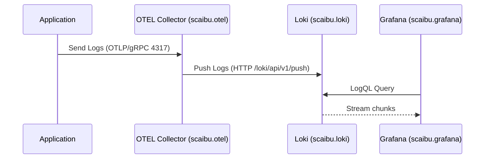
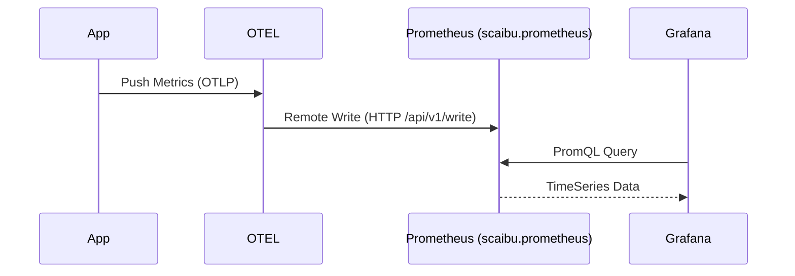
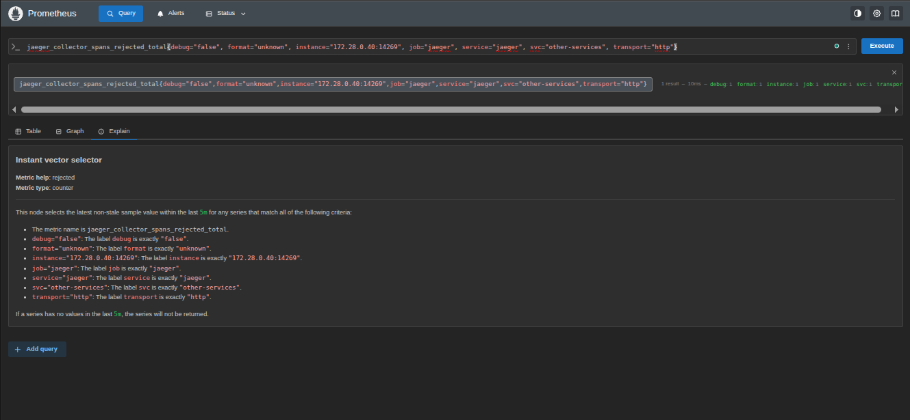
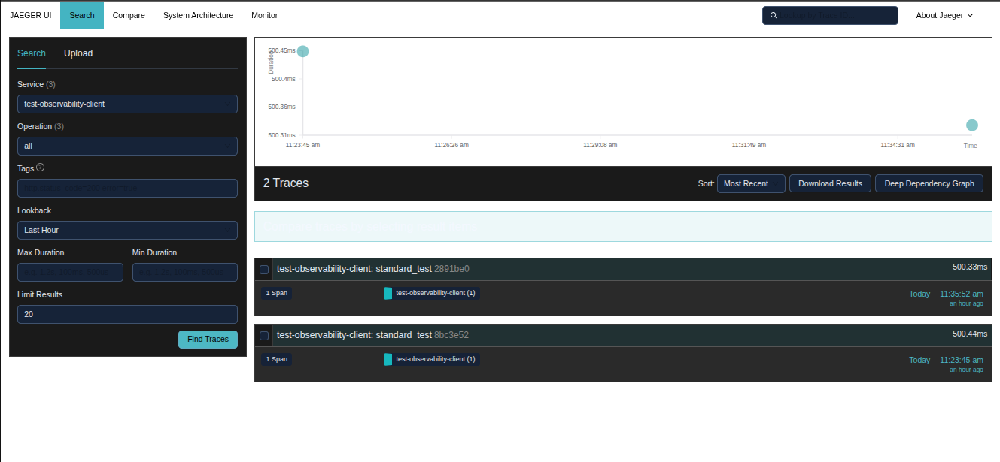

# Deep Dive: Observability Stack Architecture & Setup

This comprehensive technical guide details the design, configuration, mechanics, and automation of the Scaibu Observability Stack. It covers Architecture, Visual flows, Collection guides, API verification, and an exhaustive configuration reference.

---

## 🏗️ 1. Architecture Overview & Data Flow

### 🧠 System Data Flow (Mermaid Config)

#### 1.1 Logs Pipeline (Loki)
**Flow**: App -> OTEL Collector (Batching) -> Loki (Indexing) -> Grafana (Query).



#### 1.2 Metrics Pipeline (Prometheus)
**Flow**: App -> OTEL -> Prometheus (Remote Write).



---

## 📸 1.2. Setup command

```bash
docker network create --driver bridge observability-network || true
docker network create --driver bridge data-network || true
docker network create --driver bridge messaging-network || true
docker network create --driver bridge cicd-network || true
docker network create --driver bridge temporal-network || true


cd infrastructure/orchestrator/config/docker/temporal

docker-compose -f temporal-orchestrator-compose.yaml up -d

cd ../../../../..


cd infrastructure/orchestrator/config/docker/traefik/config

docker-compose -f traefik-dynamic-docker.yaml up -d

cd ../../../../../..

source /home/j/live/dinesh/llm-chatbot-python/.venv/bin/activate

python infrastructure/observability/setup/observability_stack_setup_worker.py

python infrastructure/observability/setup/trigger_observability_stack_setup.py setup

# to cleaning it 
python infrastructure/observability/setup/trigger_observability_stack_setup.py teardown

```


## 📸 2. Visualization Gallery

### Logs & Metrics

  
  <p><em>Loki Logs Explorer: Showing structured metadata labels.</em></p>

  
  <p><em>Grafana Metrics Dashboard: Request rates and latencies.</em></p>
  
  
  <p><em>Prometheus Targets: Green indicates successful scraping.</em></p>


### Tracing

  
  <p><em>Jaeger Trace View: Gantt chart of request latency.</em></p>

  
  <p><em>Trace-level detail: Identifies specific function slowdowns.</em></p>
  

---

## 💻 3. How to Collect Telemetry (Code & Raw API)

You have two options: High-level Python Client (Recommended) or Raw HTTP API.

### 3.1 Using Python Client (Recommended)
This handles `trace_id` injection, batching, and error handling automatically.

```python
from observability_client import ObservabilityClient
client = ObservabilityClient()

# 1. Logs
client.log_info("User login", {"user": "admin"})

# 2. Metrics
client.increment_counter(1, {"route": "/login"})

# 3. Tracing
with client.tracer.start_as_current_span("login_flow"):
    # actual business logic
    pass
```

### 3.2 Using Raw HTTP (Advanced)
If you cannot use the Python SDK, you can push directly to **OTEL Collector**.

**Push Logs (HTTP/JSON)**
*Endpoint*: `http://scaibu.otel:4318/v1/logs` (Internal)
```bash
curl -X POST http://localhost:4318/v1/logs \
  -H "Content-Type: application/json" \
  -d '{
    "resourceLogs": [{
      "resource": { "attributes": [{ "key": "service.name", "value": "manual-curl" }] },
      "scopeLogs": [{
        "logRecords": [{
          "timeUnixNano": "1700000000000000000",
          "severityText": "INFO",
          "body": { "stringValue": "Manual log via Curl" },
          "attributes": [{ "key": "http.method", "value": "POST" }]
        }]
      }]
    }]
  }'
```

---

## 📚 4. Comprehensive API Reference

All services are exposed securely via **Traefik** on `https://scaibu.<service>`.
*Note: Ensure `127.0.1.1 scaibu.prometheus scaibu.loki scaibu.jaeger` is in your `/etc/hosts`.*

### 4.1 Prometheus API (`https://scaibu.prometheus`)

**Base URL**: `https://scaibu.prometheus/api/v1`

| Endpoint | Method | Description |
|----------|--------|-------------|
| **Instant Queries** || Evaluate query at a single point in time. |
| `/query` | GET/POST | `query=<promql>&time=<ts>` |
| **Range Queries** || Evaluate query over a range of time. |
| `/query_range` | GET/POST | `query=<promql>&start=<ts>&end=<ts>&step=<sec>` |
| **Metadata** || |
| `/targets` | GET | List all scrape targets and their health. |
| `/rules` | GET | List alerting and recording rules. |
| `/alerts` | GET | List all active alerts. |
| `/series` | GET/POST | Find series by label matchers (`match[]=<selector>`). |
| `/labels` | GET/POST | List all label names. |
| `/label/<name>/values` | GET | List all values for a label. |
| `/targets/metadata` | GET | Get metric metadata from targets. |
| **Status** || |
| `/status/buildinfo` | GET | Prometheus version info. |
| `/status/tsdb` | GET | TSDB cardinality stats. |
| `/status/config` | GET | Current loaded configuration (YAML). |
| `/status/flags` | GET | Command-line flags. |
| **Admin** || *(Requires Admin API enabled)* |
| `/admin/tsdb/snapshot` | POST | Create data snapshot. |
| `/admin/tsdb/delete_series` | POST | Delete series. |
| `/admin/tsdb/clean_tombstones` | POST | Clean deleted data from disk. |

**Example: Query Metric**
```bash
curl -k "https://scaibu.prometheus/api/v1/query?query=up"
```

**Example: Check Targets**
```bash
curl -k "https://scaibu.prometheus/api/v1/targets"
```

### 4.2 Loki API (`https://scaibu.loki`)

**Base URL**: `https://scaibu.loki/loki/api/v1`

| Endpoint | Method | Description |
|----------|--------|-------------|
| **Ingestion** || |
| `/push` | POST | Ingest logs (Protobuf/JSON). |
| **Querying** || |
| `/query` | GET | Instant LogQL query. |
| `/query_range` | GET | LogQL query over time range. |
| `/tail` | GET | Stream logs in real-time (WebSocket/HTTP). |
| **Metadata** || |
| `/labels` | GET | List label names. |
| `/label/<name>/values` | GET | List label values. |
| `/series` | GET | Find log streams. |
| `/index/stats` | GET | Index statistics. |
| **Rules (Ruler)** || |
| `/rules` | GET | List alerting rules. |
| `/rules/{namespace}` | GET/POST | Manage rules per namespace. |
| **Status/Admin** || |
| `/delete` | POST | Delete logs (requires configuration). |
| `/status/buildinfo` | GET | Loki version info. |
| `/ready` | GET | Readiness probe. |
| `/flush` | POST | Flush chunks to storage. |

**Example: Range Query**
```bash
curl -k -G "https://scaibu.loki/loki/api/v1/query_range" \
  --data-urlencode 'query={job="otel-collector"}' \
  --data-urlencode 'limit=10'
```

### 4.3 Jaeger API (`https://scaibu.jaeger`)

**Base URL**: `https://scaibu.jaeger/api`

| Endpoint | Method | Description |
|----------|--------|-------------|
| `/traces` | GET | Find traces (`service=<name>`). |
| `/traces/{traceID}` | GET | Get single trace details. |
| `/services` | GET | List all services. |
| `/dependencies` | GET | Service dependency graph. |

**Example: Find Traces**
```bash
curl -k "https://scaibu.jaeger/api/traces?service=observability-client"
```

---

## ⚙️ 5. Configuration Deep Dive

### 5.1 [otel-config.yaml](file:///home/j/live/dinesh/llm-chatbot-python/infrastructure/observability/setup/config/otel-config.yaml)
**Receivers (Input)**
- `otlp` (4317/4318): Universal ingestion.
- `filelog`: Tailing `/var/lib/docker/containers/*/*.log` on the host.

**Processors**
- `batch`: Aggregates for 10s or 1024 spans.
- `memory_limiter`: Hard limit at 400MiB.

**Exporters (Output)**
- `loki`: `http://scaibu.loki:3100/loki/api/v1/push` (Internal DNS via Docker network or IP `172.28.0.30`)
- `prometheusremotewrite`: `http://scaibu.prometheus:9090/api/v1/write`

### 5.2 [prometheus.yml](file:///home/j/live/dinesh/llm-chatbot-python/infrastructure/observability/setup/config/prometheus.yml)
- **Scrape Interval**: 30s global default.
- **Service Discovery**: Uses `docker_sd_configs` to find containers via `/var/run/docker.sock`.
- **Relabeling**: Maps `__meta_docker_container_name` to `container_name`.

### 5.3 [loki-config.yaml](file:///home/j/live/dinesh/llm-chatbot-python/infrastructure/observability/setup/config/loki-config.yaml)
- **Retention**: 720h (30 days).
- **Storage**: Filesystem based (`/loki/chunks`).
- **Ingestion Limits**: 10MB/sec/user.

---

## 🤖 6. Automation Scripts

- **`observability_stack_setup_workflow.py`**: Full lifecycle orchestration.
- **`observability_stack_setup_activities.py`**: Atomic operations (Network, Docker, Certs).
