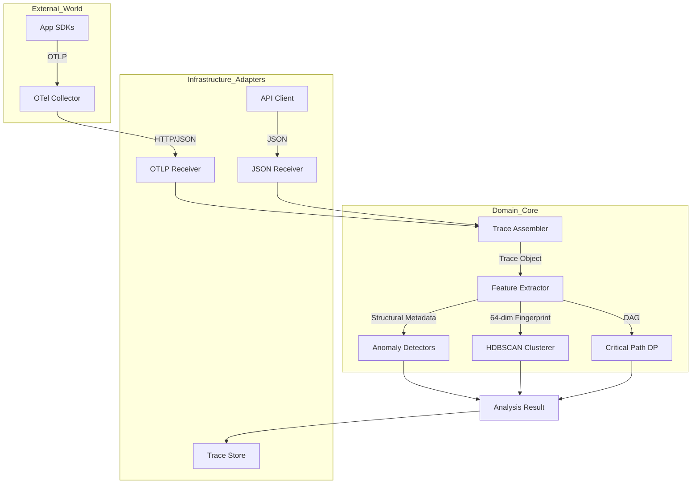
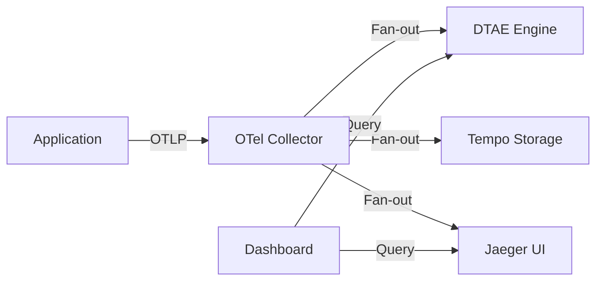
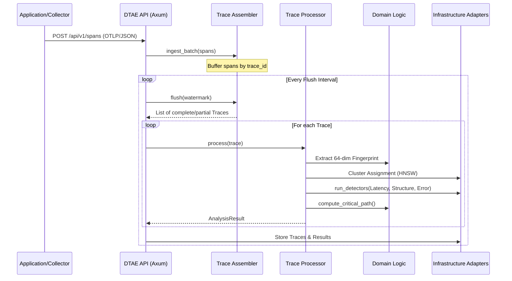

# Distributed Trace Analysis Engine (DTAE)

A high-performance observability engine built in Rust for real-time distributed trace assembly, clustering, and anomaly detection.

## 🏗️ Architecture

DTAE follows the **Hexagonal Architecture** (Ports and Adapters) pattern, ensuring the core analysis logic remains isolated from infrastructure concerns.



## 📡 Network & Data Flow

DTAE acts as a stateful sink for distributed traces. It is designed to sit alongside traditional storage backends like Grafana Tempo or Jaeger.



## 🔄 Sequence Diagram: Trace Analysis Pipeline

The following diagram illustrates the lifecycle of a trace from span ingestion to final analysis.



## 🧠 Deep Dive: How it Works

### 1. Stateful Trace Reconstruction
Unlike stateless collectors, DTAE maintains an in-memory buffer of spans. It uses a **Watermark-based Flush** mechanism:
- Spans are indexed by `trace_id`.
- When a `flush` is triggered (or an auto-flush interval expires), DTAE identifies traces that have reached a terminal state or timed out.
- It then reconstructs the full parent-child hierarchy to form a coherent **Trace Object**.

### 2. Geometric Trace Fingerprinting
Every reconstructed trace is converted into a high-dimensional vector:
- **Structural Encoding**: The graph topology (edges, service hops) is hashed into a fixed-length vector.
- **Timing Signatures**: Relative latencies and depth levels are normalized and encoded.
- **Outcome**: A 64-dimensional fingerprint that represents the "shape" of the trace.

### 3. HDBSCAN Clustering (Noise as Signal)
DTAE uses **HDBSCAN** (Hierarchical Density-Based Spatial Clustering of Applications with Noise):
- **Clusters**: Group traces with similar structural and timing fingerprints (e.g., "Standard Checkout Flow").
- **Noise**: Traces that don't fit into any cluster are automatically flagged as **Structural Anomalies**.
- **No K-Means**: We don't need to guess how many "types" of traces exist; HDBSCAN discovers them.

### 4. Critical Path Discovery (DAG DP)
To find the bottleneck, DTAE treats the trace as a Directed Acyclic Graph (DAG):
- It computes the **Longest Path** through the graph where edges are weighted by duration.
- It subtracts the overlapping time of concurrent child spans.
- **Result**: The exact sequence of operations that defined the total response time.

### 5. Multi-Signal Anomaly Detection
- **Latency**: Uses a rolling window of log-normal distributions to detect "slow" traces relative to their specific cluster.
- **Structural**: Detects missing or unexpected service calls using the **KS-Test** on fingerprint distributions.
- **Error Propagation**: Identifies traces where errors originated in downstream dependencies and bubbled up.

## 🛠️ How to Use

### Installation

Ensure you have Rust installed (2024 edition):

```bash
cargo build --release
```

### Starting the Server

```bash
# Default port: 8090
./target/release/dtae-server
```

### Sending Data (OTLP)

DTAE can receive raw OTLP JSON exports from your OpenTelemetry Collector:

```bash
curl -X POST http://localhost:8090/api/v1/spans/otlp \
  -H "Content-Type: application/json" \
  -d @otlp_payload.json
```

### Triggering Analysis (Flush)

Traces are held in a stateful window. Trigger a flush to assemble and analyze them:

```bash
curl -X POST http://localhost:8090/api/v1/flush
```

### Retrieving Results

```bash
# Get all recent analysis results
curl http://localhost:8090/api/v1/analysis/results

# Get result for a specific trace
curl http://localhost:8090/api/v1/analysis/results/{trace_id}
```

### Using the Rust Client

```rust
use distributed_trace_analysis_engine::api::client::TraceAnalysisClient;

#[tokio::main]
async fn main() {
    let client = TraceAnalysisClient::new("http://localhost:8090");
    
    // Get results
    if let Ok(results) = client.get_results().await {
        for result in results {
            println!("Trace {}: Anomaly Score {}", result.trace_id.0, result.confidence);
        }
    }
}
```

### Docker

You can also run DTAE as a Docker container:

```bash
# Build the image
docker build -t dtae-server .

# Run the container
docker run -p 8090:8090 dtae-server
```

### Docker Compose (Full Stack)

Use Docker Compose to manage the entire observability stack (DTAE, OTel Collector, Tempo, and Jaeger):

```bash
# Start the full stack
docker compose up -d
```

**Services Included:**
- **DTAE Server**: `http://localhost:8090` (Analysis Engine)
- **OTel Collector**: `http://localhost:4317` (gRPC), `http://localhost:4318` (HTTP)
- **Jaeger UI**: `http://localhost:16686` (Visualization)
- **Tempo API**: `http://localhost:3200` (Storage)


## ⚙️ Configuration

Environment variables:
- `DTAE_BIND_ADDR`: Address to bind the server (default: `0.0.0.0:8090`).
- `RUST_LOG`: Logging level (default: `info`).

## 🧪 Testing

```bash
# Run unit and integration tests
cargo test
```

### End-to-End (E2E) Tests

The E2E tests require a running instance of the DTAE server. You can run them against a local or Docker instance:

```bash
# Start server first
cargo run --bin dtae-server

# In another terminal, run E2E tests
cargo test --test e2e_tests -- --nocapture
```

### Verification Script (Stack-wide)

A comprehensive verification script is provided to test the full pipeline (Ingestion -> Collector -> DTAE -> Jaeger):

```bash
# Ensure the stack is running
docker compose up -d

# Run verification
python3 scripts/verify_stack.py
```

This script generates a synthetic trace, sends it to the Collector, waits for propagation, triggers a DTAE flush, and verifies the result in both the analysis engine and Jaeger visualization.
