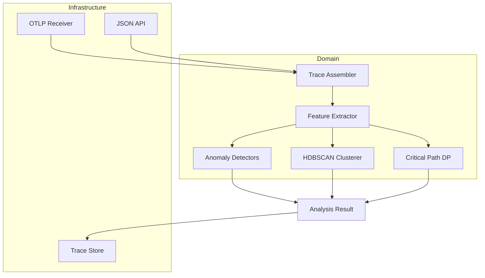
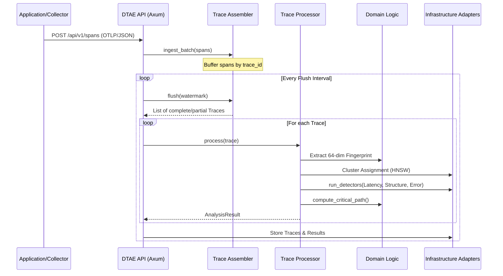

# Distributed Trace Analysis Engine (DTAE)

A high-performance observability engine built in Rust for real-time distributed trace assembly, clustering, and anomaly detection.

## 🏗️ Architecture

DTAE follows the **Hexagonal Architecture** (Ports and Adapters) pattern, ensuring the core analysis logic remains isolated from infrastructure concerns.



## 🔄 Sequence Diagram: Trace Analysis Pipeline

The following diagram illustrates the lifecycle of a trace from span ingestion to final analysis.



## 🚀 Key Use Cases

### 1. Automatic Bottleneck Identification
DTAE builds a Directed Acyclic Graph (DAG) for every trace and runs a Longest Path algorithm to find the "Critical Path". It accurately identifies which service is responsible for the majority of user-perceived latency.

### 2. Statistical Anomaly Detection (Signal Fusion)
Instead of simple thresholds, DTAE uses:
- **Log-normal Baselines**: For latency detection that accounts for natural variance.
- **KS-Test (Kolmogorov-Smirnov)**: To detect shifts in the structural distribution of traces within a cluster.
- **Novelty Detection**: Identifying error propagation paths never seen before.

### 3. Trace Fingerprinting & Clustering
Every trace is compressed into a 64-dimensional vector. **HDBSCAN** clustering then groups these fingerprints to find "normal" patterns and highlight "noise" (rare, anomalous traces) without requiring a pre-defined number of clusters (K).

## 🛠️ How to Use

### Installation

Ensure you have Rust installed (2024 edition):

```bash
cargo build --release
```

### Starting the Server

```bash
# Default port: 8090
./target/release/dtae-server
```

### Sending Data (OTLP)

DTAE can receive raw OTLP JSON exports from your OpenTelemetry Collector:

```bash
curl -X POST http://localhost:8090/api/v1/spans/otlp \
  -H "Content-Type: application/json" \
  -d @otlp_payload.json
```

### Triggering Analysis (Flush)

Traces are held in a stateful window. Trigger a flush to assemble and analyze them:

```bash
curl -X POST http://localhost:8090/api/v1/flush
```

### Retrieving Results

```bash
# Get all recent analysis results
curl http://localhost:8090/api/v1/analysis/results

# Get result for a specific trace
curl http://localhost:8090/api/v1/analysis/results/{trace_id}
```

### Using the Rust Client

```rust
use distributed_trace_analysis_engine::api::client::TraceAnalysisClient;

#[tokio::main]
async fn main() {
    let client = TraceAnalysisClient::new("http://localhost:8090");
    
    // Get results
    if let Ok(results) = client.get_results().await {
        for result in results {
            println!("Trace {}: Anomaly Score {}", result.trace_id.0, result.confidence);
        }
    }
}
```

### Docker

You can also run DTAE as a Docker container:

```bash
# Build the image
docker build -t dtae-server .

# Run the container
docker run -p 8090:8090 dtae-server
```

### Docker Compose (Full Stack)

Use Docker Compose to manage the entire observability stack (DTAE, OTel Collector, Tempo, and Jaeger):

```bash
# Start the full stack
docker compose up -d
```

**Services Included:**
- **DTAE Server**: `http://localhost:8090` (Analysis Engine)
- **OTel Collector**: `http://localhost:4317` (gRPC), `http://localhost:4318` (HTTP)
- **Jaeger UI**: `http://localhost:16686` (Visualization)
- **Tempo API**: `http://localhost:3200` (Storage)


## ⚙️ Configuration

Environment variables:
- `DTAE_BIND_ADDR`: Address to bind the server (default: `0.0.0.0:8090`).
- `RUST_LOG`: Logging level (default: `info`).

## 🧪 Testing

```bash
# Run unit and integration tests
cargo test
```

### End-to-End (E2E) Tests

The E2E tests require a running instance of the DTAE server. You can run them against a local or Docker instance:

```bash
# Start server first
cargo run --bin dtae-server

# In another terminal, run E2E tests
cargo test --test e2e_tests -- --nocapture
```

### Demo Script (Python)

A Python script is provided to quickly test the full flow without writing Rust code:

```bash
python3 scripts/demo_client.py
```
