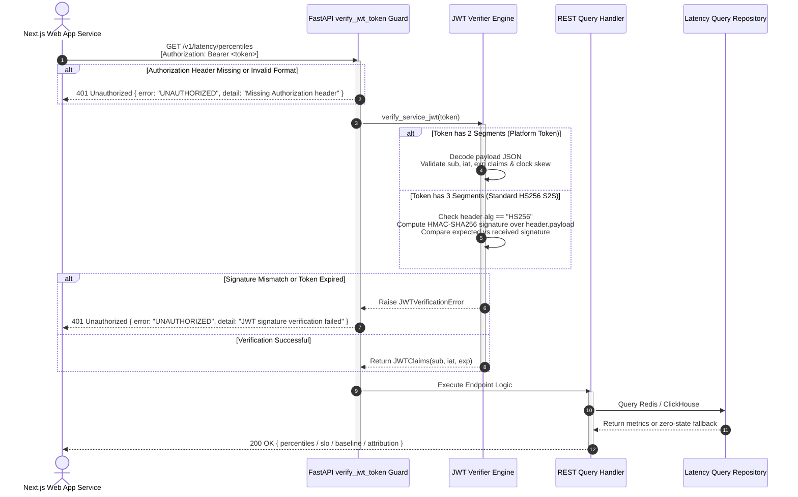
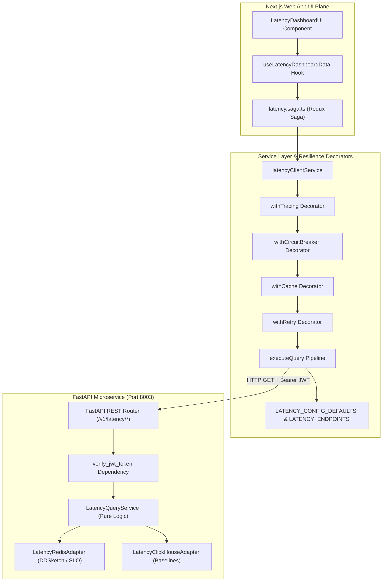
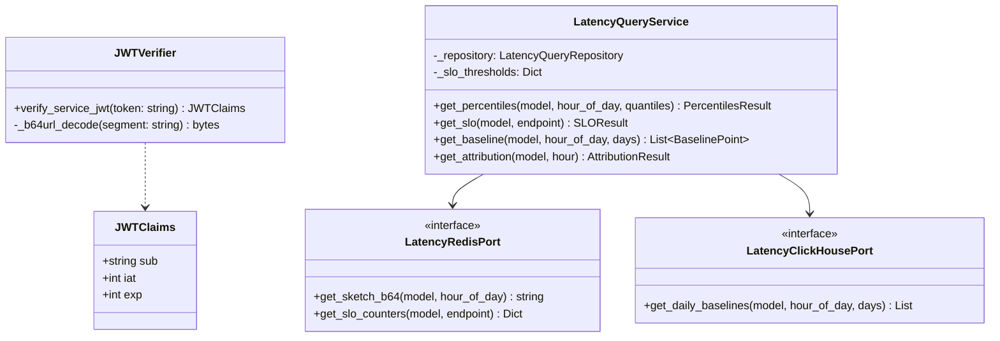

# ADR-011: Implement FastAPI Service-to-Service REST Query API and Security Architecture for latency-engine

* **Status**: Accepted
* **Date**: 2026-06-26 (Updated: 2026-08-29)
* **Deciders**: Jaydeep

## Context and Problem Statement
How can upstream systems and Next.js observability dashboards query calculated percentiles, SLO burn rates, and historical baselines from `latency-engine` securely and performantly without exposing internal telemetry data or suffering from security bypasses and cascade failures?

---

## Decision Drivers
* **D1**: Access to telemetry query APIs must be strictly secured via Service-to-Service (S2S) HS256 JWT authentication and platform session token verification.
* **D2**: Telemetry query processing must run asynchronously on background thread pools to prevent blocking the worker's CPU-bound Kafka polling loop.
* **D3**: API responses must strictly conform to OpenAPI v1 contract specifications and provide resilient zero-state fallbacks for unpopulated models.
* **D4**: ClickHouse and Redis connection outages must not prevent HTTP server startup or crash downstream dashboard components.

---

## Business Decision Tree (Ingestion & Query Flow)

```
                          [Raw Span Event Consumed]
                                      │
                                      ▼
               [Validate Span: Has model & latency_ms_total?]
                               /             \
                       (No)   /               \   (Yes)
                             ▼                 ▼
                     [Skip Span]       [Parse UTC Timestamp]
                                               │
           ┌───────────────────────────────────┼──────────────────────────────────┐
           │                                   │                                  │
           ▼                                   ▼                                  ▼
[latency_ms_ttft exists?]             [Is retry_count > 0?]             [SLO threshold check]
      /         \                           /         \                       /         \
(No) /           \ (Yes)             (Yes) /           \ (No)           (Yes)/           \(No)
    ▼             ▼                       ▼             ▼                   ▼             ▼
[Skip]     [Update TTFT Sketch]     [Update Retry]  [Update Total]     [Incr Errors    [Incr Total
           (sketch:ttft:{m}:{h})     (sketch:retry)  (sketch:total)     & Total]        Only]
                  │                                                         │               │
                  ▼                                                         ▼               ▼
           [TPOT Eligible?]                                                 └───────┬───────┘
         (TTFT & Tokens > 0,                                                        │
          Reason != timeout)                                                        │
              /         \                                                           ▼
      (No)   /           \ (Yes)                                           [Attribution tags?]
            ▼             ▼                                                    /          \
         [Skip]     [Calc TPOT]                                         (Yes) /            \ (No)
                    (tpot:latest)                                            ▼              ▼
                                                                     [Store Hash    [Skip]
                                                                      & Agg Avg]
```

---

## Security Architecture & Securities Mechanisms (How Security Works)

### 1. Dual Token Authentication Engine
The latency engine implements a dual-mode JWT verifier ([jwt_verifier.py](file:///home/btpl-lap-22/live/llm-observability-platform/packages/python/latency-engine/src/shared/auth/jwt_verifier.py)) that supports two authentication token structures:

1. **Standard 3-Part HS256 Service-to-Service (S2S) JWT**:
   - Structure: `header.payload.signature`
   - Header: `{"alg": "HS256", "typ": "JWT"}` (base64url encoded)
   - Payload: `{"sub": "nextjs-web-app", "iat": <timestamp>, "exp": <timestamp>}`
   - Signature: HMAC-SHA256 signature calculated over `${headerB64}.${payloadB64}` using shared secret `JWT_SECRET` (`dev-secret-key-change-in-production`).
   - Verification: Handled via constant-time signature comparison (`hmac.compare_digest`) and 30-second leeway expiration checking.

2. **Platform Session Token Compatibility**:
   - Structure: `payload.signature` (2-part token issued by Node.js Auth Microservice on port `3001`).
   - Base64url decodes the payload segment, validates `sub`, `iat`, and `exp` claims, and verifies expiration with a 30-second clock skew tolerance buffer.



---

## Data-Driven Query Pipeline & Service Architecture



---

## Detailed Telemetry & Security Selection Matrix

| Metric / Security Dimension | Technical Implementation | Value & Security Guarantee | Target Threshold / Spec |
| :--- | :--- | :--- | :--- |
| **S2S Authentication** | HMAC-SHA256 Bearer JWT Verification | Prevents unauthorized external actors from triggering telemetry queries or scraping platform metrics. | Token signature verified with 30s leeway |
| **Zero-State Fallback** | Defensive Exception Catching (`SketchNotFoundError`) | Prevents unpopulated model queries from throwing `500` or `404` errors in downstream UI dashboards. | Returns `200 OK` zero-state JSON |
| **Tail Latency (p95/p99)** | DDSketch Logarithmic Compression | Captures worst-case latency spikes dynamically without linear memory growth. | `p99_total_ms` <= 1500ms |
| **SLO Error Budget** | Rolling Redis Counters (1h, 6h, 3d) | Provides immediate alerting when platform error budgets are consumed rapidly. | `burn_rate_1h` > 14.4x |
| **Time to First Token (TTFT)** | Streaming Completion Marker Tracking | Evaluates responsiveness of LLM output streaming for interactive UX. | `p95_ttft_ms` <= 300ms |

---

## Architectural Class Diagram (Hexagonal Ports & Security Handlers)



---

## Architectural Principles & Tradeoffs

1. **Failure-First Resilience**: ClickHouse connection attempts are deferred until query invocation via `@property` getters. Server startup is unaffected by database maintenance.
2. **Hexagonal Isolation**: `LatencyQueryService` contains zero HTTP or database driver dependencies. All data interactions are decoupled through ports.
3. **Data-Driven Constants**: Endpoint routes and default fallback limits are declared in central registries (`LATENCY_ENDPOINTS`, `LATENCY_CONFIG_DEFAULTS`).

---

## Review Trigger
Review architecture if query volume exceeds 10,000 requests/second or when multi-region JWT key rotation is introduced.
