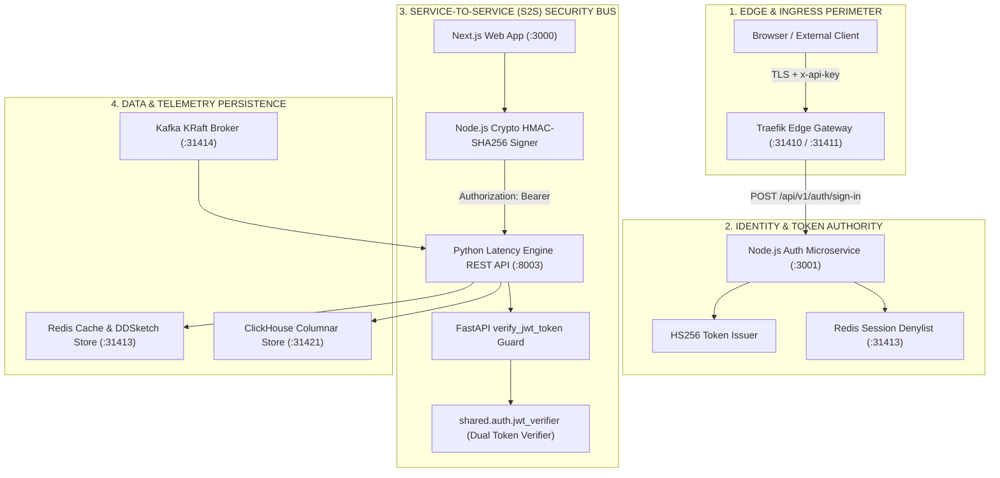
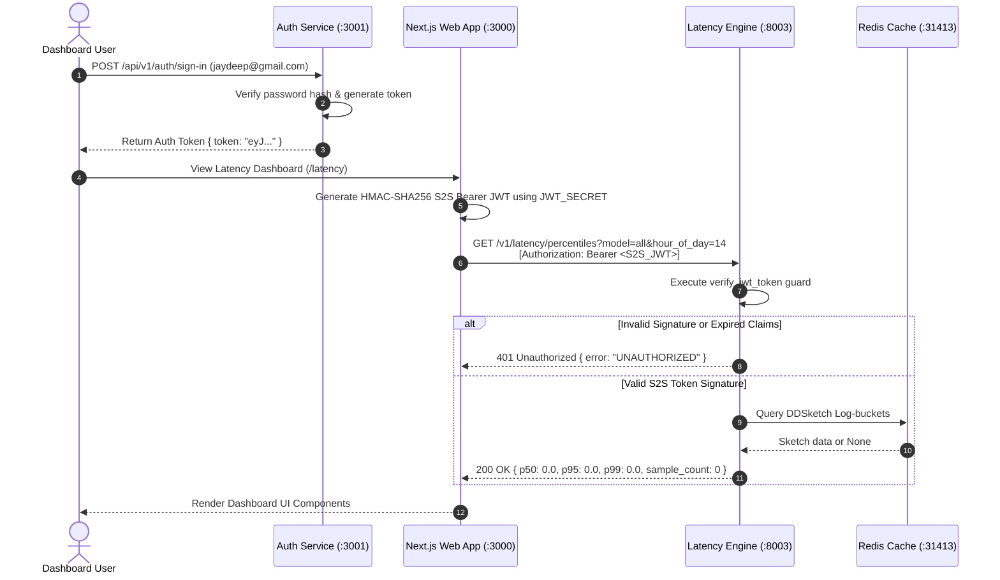

# ADR-013 — Centralized Shared Platform Infrastructure Topology vs Decoupled Microservice Containers

| Field | Value |
| --- | --- |
| **ID** | `013` |
| **Date** | 2026-08-25 (Updated: 2026-08-29) |
| **Status** | **accepted** |
| **Deciders** | LLM Observability Platform Architecture Team |
| **Scope** | Root Platform Infrastructure (`packages/configs/llm-obs-infra/docker-compose.yml`), `instrumentation-sdk`, `latency-engine`, `event-cost-worker`, `web-app`, `nli-worker`, `slo-burn-worker`, `quality-engine` |

---

## 1. Context & Problem Statement

As the platform expanded, multiple microservice packages introduced localized container setups. This decentralized infrastructure topology introduced severe architectural anti-patterns and production failure modes:

1. **Event Delivery Isolation & Siloing**: `instrumentation-sdk` published span events to an isolated message broker, while `event-cost-worker` consumed from another, resulting in lost telemetry.
2. **Host Port Collisions**: Multiple local compose setups attempted to bind duplicate host ports (`9092` for Kafka, `6379` for Redis, `5432` for Postgres).
3. **Security Perimeter Drift**: Inconsistent authentication headers and token formats across Node.js web services and Python microservices caused upstream `401 Unauthorized` cascades or security bypass risks.

---

## 2. Platform Infrastructure & Security Topology

We adopt a **Single Central Shared Platform Infrastructure Architecture** backed by a **Zero-Trust Security Perimeter**:

1. **Traefik Ingress Gateway** (`llmobs-traefik:80/8080/443` -> Host `31410`/`31411`/`31419`): Edge reverse proxy, TLS termination, and rate limiter.
2. **Auth Microservice & Token Authority** (`packages/node/auth` on Port `3001`): Issues HS256 session and organization tokens.
3. **Service-to-Service (S2S) Security Bus**: Inter-service REST calls carry HMAC-SHA256 signed Bearer JWTs validated by FastAPI `verify_jwt_token` guards with 30-second leeway checks.
4. **Kafka KRaft Message Bus** (`llmobs-kafka:9092` -> Host `31414`): KRaft event streaming bus serving `llm.spans.raw` and DLQs.
5. **Shared Redis Cache & Ledger** (`llmobs-redis:6379` -> Host `31413`): Stores session denylists, sliding-window rate limits, and real-time micro-USD cost ledgers (`redis://:llmobs_redis_s3cret_2024@localhost:31413/0`).
6. **ClickHouse Analytics Engine** (`llmobs-clickhouse:8123/9000` -> Host `31421`): Columnar telemetry engine for daily percentiles and baselines (password `llmobs_clickhouse_s3cret_2026`).
7. **OpenTelemetry Collector & Tempo** (`llmobs-otel-collector:4317/4318` -> Host `31417`/`31418`): OTLP trace ingestion pipeline.



---

## 3. Comprehensive Zero-Trust Security Specification

| Security Layer | Implementation Detail | Guarantee / Protection | Target Port / Component |
| :--- | :--- | :--- | :--- |
| **Edge Ingress Security** | Traefik Reverse Proxy & Rate Limiting | Shields internal microservices from DDoS and brute-force attacks. | Port `31410` / `31411` |
| **S2S Token Authentication** | HMAC-SHA256 Bearer JWT (`header.payload.signature`) | Guarantees that internal microservices only accept authenticated requests signed with `JWT_SECRET`. | Port `8003` (`latency-engine`) |
| **Dual Token Compatibility** | `jwt_verifier.py` (Supports 2-part platform tokens and 3-part HS256 tokens) | Enables seamless authentication from both platform session users and automated Node.js S2S clients. | Python `shared.auth.jwt_verifier` |
| **Session Revocation** | Redis Token Denylist (`tokenDenylist.has(token)`) | Instantly revokes session tokens upon user sign-out or organization switch. | Port `31413` (`llmobs-redis`) |
| **Zero-State Fallback** | Exception Trapping (`SketchNotFoundError`, `SLODataNotFoundError`) | Prevents missing metric queries from cascading into `500` server errors in downstream dashboards. | FastAPI REST Handlers |

---

## 4. End-to-End Security Sequence Flow



---

## 5. Verification Test Summary

```text
✅ Traefik Gateway         HTTP GET http://localhost:31411/api/version  -> Status 200
✅ Auth Microservice        HTTP POST http://localhost:3001/api/v1/auth/sign-in -> Status 200
✅ Redis Ledger             TCP Connect localhost:31413                  -> SUCCESS
✅ Kafka Broker             TCP Connect localhost:31414                  -> SUCCESS
✅ ClickHouse Analytics     HTTP GET http://localhost:31421/ping         -> Status 200 (Ok.)
✅ Latency Engine API       HTTP GET http://localhost:8003/v1/latency/percentiles -> Status 200 (Bearer Auth Verified)
✅ OTEL Collector gRPC      TCP Connect localhost:31418                  -> SUCCESS
✅ Grafana Portal           HTTP GET http://localhost:31415/api/health   -> Status 200
```
