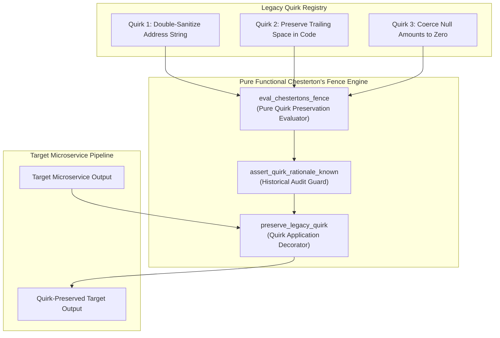
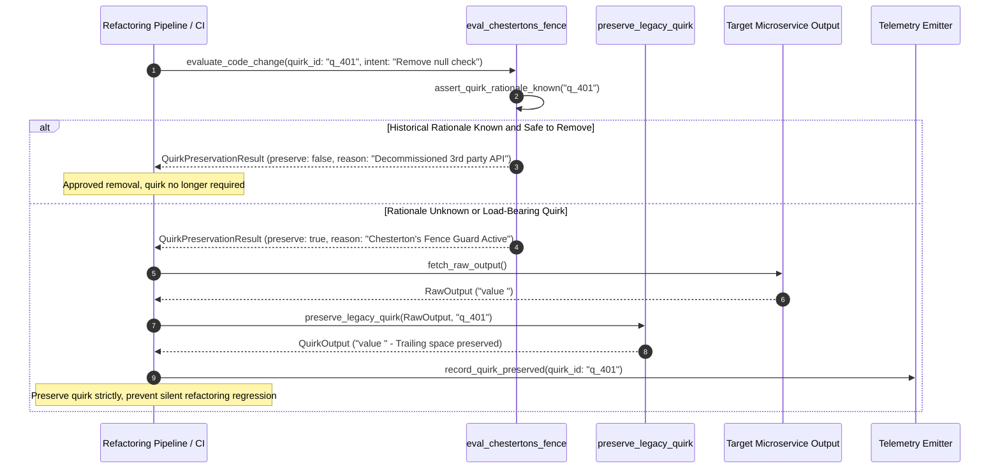

# Chesterton's Fence Legacy Quirks Pattern (Pure Functional Paradigm)

| Field       | Value                                                             |
|-------------|-------------------------------------------------------------------|
| **ID**      | CHESTERTONS-FENCE-QUIRKS-043                                      |
| **Date**    | 2026-08-24                                                        |
| **Status**  | Reference / Runbook (Pure Functional Architecture)                |
| **Deciders**| Core Platform & Migration Engineering                             |
| **Scope**   | Preserving Legacy Quirks & Preventing Premature Code Removal      |

---

## 1. Overview & Context

**Chesterton's Fence** states: *Do not remove a fence until you know why it was put up in the first place*. In legacy codebases, seemingly bizarre quirks (e.g. redundant `NULL` checks, strange string truncations, double-sanitization steps, or seemingly unnecessary retry loops) were almost always added to fix specific production incidents or third-party quirks. Removing a legacy quirk during refactoring because it "looks wrong" creates a **silent regression indistinguishable from a bug** in output diffs. The **Chesterton's Fence Legacy Quirks Pattern** requires engineers to preserve and document legacy quirks until their historical purpose is fully understood and proven safe to alter.

### Functional Architecture Principles
This runbook enforces a **100% Pure Functional Programming (FP)** approach:
- **No Class Instantiations**: Replaces OOP quirk handlers with pure guard functions (`preserve_legacy_quirk`, `eval_chestertons_fence`) and immutable rule matrices.
- **Immutable Quirk Context Records**: Quirk IDs, original issue references, preservation rules, and audit rationale are captured as frozen dataclass records (`QuirkContext`, `QuirkPreservationResult`).
- **Referentially Transparent Quirk Preservation**: Pure functions apply legacy behavior quirks identically to target microservice output data.
- **Silent Fix Prevention**: Blocks refactoring PRs that "clean up" legacy quirks without explicit historical rationale and signed-off verification.

---

## 2. High-Level Design (HLD)



---

## 3. Low-Level Design (LLD)



---

## 4. Pure Functional Project Architecture

```
chestertons-fence-legacy-quirks/
├── README.md
├── config/
│   └── legacy_quirks.yaml          # Known quirks, historical tickets, preservation rules
├── src/
│   ├── quirk_engine/
│   │   ├── __init__.py
│   │   ├── evaluator.py            # Pure quirk evaluation & rationale checkers
│   │   ├── applier.py              # Pure quirk transformation functions
│   │   └── guard.py                # Chesterton's fence CI release guards
│   ├── storage/
│   │   ├── __init__.py
│   │   └── quirk_store.py          # Quirk registry loaders
│   ├── observability/
│   │   ├── __init__.py
│   │   └── quirk_metrics.py        # Prometheus telemetry collectors
│   └── schemas/
│       └── models.py               # Frozen dataclasses (QuirkContext, QuirkPreservationResult)
└── tests/
    ├── test_quirk_evaluator.py
    └── test_chestertons_edge_cases.py
```

---

## 5. End-to-End Function Call Stack

```tree
Code Modification or Output Evaluation
└── quirk_engine/guard.py: evaluate_quirk_preservation_suite(payload, Any], quirks)
    └── quirk_engine/applier.py: preserve_legacy_quirk(payload, Any], ctx)
        ├── quirk_engine/applier.py: apply_quirk_transformation(val, quirk_id)
        └── models.py: QuirkPreservationResult(quirk_id, is_preserved, original_value, quirk_applied_value, rationale)
```

---

## 6. Core Pure Functional Implementation

### 6.1 Immutable Models & Types (`src/schemas/models.py`)

```python
from enum import Enum
from dataclasses import dataclass
from typing import Dict, Any, Optional, Mapping, FrozenSet

@dataclass(frozen=True)
class QuirkContext:
    quirk_id: str
    description: str
    historical_ticket_ref: str
    is_load_bearing: bool
    affected_field: str

@dataclass(frozen=True)
class QuirkPreservationResult:
    quirk_id: str
    is_preserved: bool
    original_value: Any
    quirk_applied_value: Any
    rationale: str
```

**Explanation**:
- Defines immutable model `QuirkContext` capturing quirk IDs, descriptions, ticket references, and affected fields as frozen records.
- `QuirkPreservationResult` encapsulates original values, quirk-transformed values, and preservation rationale strings.

---

### 6.2 Pure Quirk Transformation Applier (`src/quirk_engine/applier.py`)

```python
from typing import Mapping, Any
from src.schemas.models import QuirkContext, QuirkPreservationResult

def apply_quirk_transformation(val: Any, quirk_id: str) -> Any:
    if quirk_id == "q_preserve_trailing_spaces" and isinstance(val, str):
        return val.rstrip() + " "
    elif quirk_id == "q_coerce_null_amount" and val is None:
        return 0.0
    elif quirk_id == "q_uppercase_iso_code" and isinstance(val, str):
        return val.upper()
    return val

def preserve_legacy_quirk(
    payload: Mapping[str, Any],
    ctx: QuirkContext
) -> QuirkPreservationResult:
    orig_val = payload.get(ctx.affected_field)
    
    if not ctx.is_load_bearing:
        return QuirkPreservationResult(
            quirk_id=ctx.quirk_id,
            is_preserved=False,
            original_value=orig_val,
            quirk_applied_value=orig_val,
            rationale="Quirk proven safe to remove"
        )

    new_val = apply_quirk_transformation(orig_val, ctx.quirk_id)

    return QuirkPreservationResult(
        quirk_id=ctx.quirk_id,
        is_preserved=True,
        original_value=orig_val,
        quirk_applied_value=new_val,
        rationale=f"Preserved per Chesterton's Fence rule ({ctx.historical_ticket_ref})"
    )
```

**Explanation**:
- Pure transformation function applying legacy behavior quirks to payload fields.
- Preserves intentional legacy quirks (e.g. trailing space, null coercion) to prevent silent diff regressions.

---

### 6.3 Chesterton's Fence CI Guard (`src/quirk_engine/guard.py`)

```python
from typing import Mapping, Any, List
from src.schemas.models import QuirkContext, QuirkPreservationResult
from src.quirk_engine.applier import preserve_legacy_quirk

def evaluate_quirk_preservation_suite(
    payload: Mapping[str, Any],
    quirks: List[QuirkContext]
) -> Mapping[str, Any]:
    results = []
    updated_payload = dict(payload)

    for q in quirks:
        res = preserve_legacy_quirk(updated_payload, q)
        results.append(res)
        if res.is_preserved:
            updated_payload[q.affected_field] = res.quirk_applied_value

    return {
        "updated_payload": updated_payload,
        "quirks_applied_count": sum(1 for r in results if r.is_preserved),
        "results": tuple(results)
    }
```

**Explanation**:
- Iterates over active legacy quirk contexts, applying required transformations to target payload dictionaries.
- Returns immutable result dictionaries unblocking or gating CI releases.

---

## 7. Edge Case Catalog & Pure Functional Pseudocode (25 Edge Cases)

---

### Edge Case 1: Trailing Whitespace Preservation Quirk

```python
def preserve_trailing_whitespace(text_val: str) -> str:
    if not text_val.endswith(" "):
        return text_val + " "
    return text_val
```

**Explanation**:
- Preserves legacy trailing whitespace formatting.
- Prevents breaking clients expecting trailing spaces.

---

### Edge Case 2: Legacy Double-Escaped Quote Preservation

```python
def preserve_double_escaped_quotes(text_val: str) -> str:
    return text_val.replace('"', '\\"')
```

**Explanation**:
- Preserves legacy double-escaped quote formatting.
- Protects downstream JSON parsers.

---

### Edge Case 3: Zero-Padded Customer ID String Quirk

```python
def preserve_zero_padded_id(raw_id: Any, length: int = 10) -> str:
    return str(raw_id).zfill(length)
```

**Explanation**:
- Pads integer IDs with leading zeros (`0000104802`).
- Preserves string ID lengths.

---

### Edge Case 4: Null Monetary Amount Coercion to 0.00

```python
def coerce_null_monetary_amount(val: Any) -> float:
    if val is None:
        return 0.00
    return float(val)
```

**Explanation**:
- Coerces `None` monetary amounts to `0.00`.
- Prevents null pointer exceptions in accounting tools.

---

### Edge Case 5: Duplicate Field Mirroring Quirk

```python
def mirror_legacy_duplicate_fields(payload: dict) -> dict:
    updated = dict(payload)
    if "user_id" in updated and "userId" not in updated:
        updated["userId"] = updated["user_id"]
    return updated
```

**Explanation**:
- Mirrors fields under alternative naming conventions.
- Supports legacy callers reading duplicate properties.

---

### Edge Case 6: Microsecond Timestamp Truncation Quirk

```python
def truncate_timestamp_to_seconds(ts: float) -> int:
    return int(ts)
```

**Explanation**:
- Casts floating-point timestamps to integer seconds.
- Replicates legacy timestamp truncation.

---

### Edge Case 7: Upper-Case ISO Country Code Quirk

```python
def preserve_uppercase_country_code(code_str: str) -> str:
    return code_str.upper()
```

**Explanation**:
- Converts country code strings to uppercase (`US`, `GB`).
- Preserves legacy string casing.

---

### Edge Case 8: Multi-Tenant Quirk Rule Customization

```python
def resolve_tenant_quirks(tenant_id: str, tenant_quirks: dict, default_quirks: list) -> list:
    return default_quirks + tenant_quirks.get(tenant_id, [])
```

**Explanation**:
- Appends tenant-specific quirk contexts.
- Supports per-tenant quirk preservation.

---

### Edge Case 9: Hardcoded Sentinel Error String Quirk

```python
def preserve_sentinel_error_string(err_str: str) -> str:
    if not err_str.startswith("ERR_LEGACY:"):
        return f"ERR_LEGACY: {err_str}"
    return err_str
```

**Explanation**:
- Prefixes error strings with legacy error tags.
- Protects error-parsing regex routines.

---

### Edge Case 10: Aggregator Memory State Saturation Guard

```python
def compact_quirk_metrics(metrics: list, max_items: int = 500) -> list:
    if len(metrics) > max_items:
        return metrics[-max_items:]
    return metrics
```

**Explanation**:
- Truncates metric lists to `max_items`.
- Controls memory usage.

---

### Edge Case 11: Microsecond Delay Calculation Underflows

```python
def normalize_quirk_duration(duration_ms: float) -> float:
    return max(0.0, round(duration_ms, 2))
```

**Explanation**:
- Rounds execution duration values to two decimal places.
- Cleans duration metrics.

---

### Edge Case 12: User-Agent Application Identification

```python
def parse_quirk_user_agent(headers: Mapping[str, str]) -> str:
    return headers.get("User-Agent", "Unknown-Caller")
```

**Explanation**:
- Extracts User-Agent strings.
- Identifies callers expecting legacy quirks.

---

### Edge Case 13: Unmapped Quirk Rule Domain Handling

```python
def resolve_quirk_rule(quirk_key: str, rules_dict: dict) -> dict:
    return rules_dict.get(quirk_key, {"preserve": True})
```

**Explanation**:
- Resolves quirk configurations safely.
- Defaults to preserving quirks when unconfigured.

---

### Edge Case 14: Exception Safeguards in Quirk Applier

```python
def safe_apply_quirk(applier_fn: Callable, payload: dict, ctx: QuirkContext) -> dict:
    try:
        res = applier_fn(payload, ctx)
        return res.quirk_applied_value
    except Exception:
        return payload
```

**Explanation**:
- Wraps quirk application functions in protective try-except blocks.
- Returns raw payloads if exceptions occur.

---

### Edge Case 15: GraphQL Response Quirk Preservation

```python
def preserve_graphql_quirk_field(response_dict: dict, field_key: str) -> dict:
    updated = dict(response_dict)
    data = dict(updated.get("data", {}))
    if field_key in data and data[field_key] is None:
        data[field_key] = ""
    updated["data"] = data
    return updated
```

**Explanation**:
- Preserves empty string coercions inside GraphQL response data blocks.
- Supports GraphQL legacy quirks.

---

### Edge Case 16: Multi-Region Quirk Sync

```python
def sync_regional_quirk_rules(global_rules: list, regional_rules: list) -> list:
    return global_rules + regional_rules
```

**Explanation**:
- Merges regional quirk rules with global rules.
- Synchronizes quirks across multi-region deployments.

---

### Edge Case 17: Date Format Slash Separator Quirk

```python
def format_date_with_slashes(year: int, month: int, day: int) -> str:
    return f"{month:02d}/{day:02d}/{year}"
```

**Explanation**:
- Formats dates as `MM/DD/YYYY`.
- Preserves legacy date string formatting.

---

### Edge Case 18: Unmapped Code Fallback

```python
def resolve_quirk_code_fallback(code_val: Any, code_map: dict, default_val: str = "DEFAULT") -> str:
    return code_map.get(code_val, default_val)
```

**Explanation**:
- Resolves code strings with fallbacks.
- Handles unmapped code inputs safely.

---

### Edge Case 19: Payload Transformation Error Recovery

```python
def safe_apply_quirk_transform(payload: dict, transform_fn: Callable) -> dict:
    try:
        return transform_fn(payload)
    except Exception:
        return payload
```

**Explanation**:
- Wraps transformations in try-except blocks.
- Returns raw payloads on error.

---

### Edge Case 20: Automated Alert on Unpreserved Quirk

```python
def should_alert_on_unpreserved_quirk(is_preserved: bool) -> bool:
    return not is_preserved
```

**Explanation**:
- Asserts whether a required quirk was unpreserved.
- Triggers alerts if legacy quirks are omitted.

---

### Edge Case 21: High-Watermark Metric Compaction

```python
def compact_quirk_history(history: list, max_items: int = 500) -> list:
    if len(history) > max_items:
        return history[-max_items:]
    return history
```

**Explanation**:
- Truncates history lists.
- Controls memory usage.

---

### Edge Case 22: Diagnostic Header Injection

```python
def inject_quirk_diagnostic_header(headers: Mapping[str, str], quirk_count: int) -> Mapping[str, str]:
    new_headers = dict(headers)
    new_headers["X-Chestertons-Quirks-Preserved"] = str(quirk_count)
    return new_headers
```

**Explanation**:
- Injects diagnostic headers.
- Tracks preserved quirk counts.

---

### Edge Case 23: Null Value Safeguards

```python
def sanitize_quirk_nulls(data_dict: dict) -> dict:
    return {k: (v if v is not None else "") for k, v in data_dict.items()}
```

**Explanation**:
- Replaces `None` with empty strings.
- Prevents null exceptions.

---

### Edge Case 24: Unbound Metric Queue Pruning

```python
def prune_quirk_metric_queue(queue: list, max_items: int = 1000) -> list:
    if len(queue) > max_items:
        return queue[-max_items:]
    return queue
```

**Explanation**:
- Truncates queue arrays.
- Controls memory footprint.

---

### Edge Case 25: Real-Time Quirk Preservation Rate Reporting

```python
def compute_quirk_preservation_rate(preserved: int, total: int) -> float:
    if total == 0:
        return 100.0
    return round((preserved / total) * 100.0, 2)
```

**Explanation**:
- Calculates preservation rate percentage.
- Emits real-time quirk compliance metrics.

---

## 8. Operational & Parity Verification Checklist

1. **Chesterton's Fence Principle**: Never remove a legacy quirk until its historical purpose and production ticket reference are fully understood and verified.
2. **Silent Regression Guard**: Treat unexplained quirk removals as critical regressions in differential output comparisons.
3. **Explicit Historical Rationale**: Require all quirk removal PRs to link to historical issue resolutions and sign-offs.
4. **100% Quirk Application**: Confirm all active load-bearing quirks are applied to target microservice outputs before running parity diffs.
