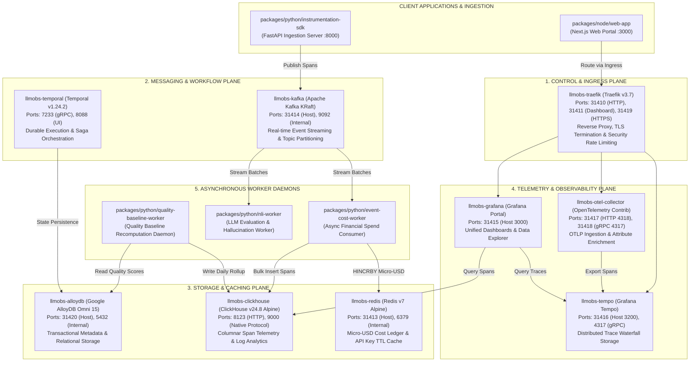
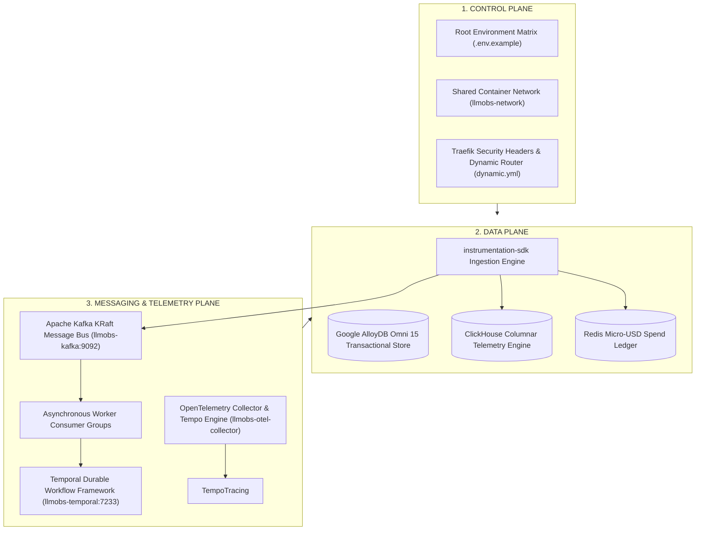

# LLM Observability Platform — High-Level Design (HLD) & Low-Level Design (LLD) Architecture Reference

---

## 1. High-Level Design (HLD) Architecture

The High-Level Design illustrates the macro topology of the centralized platform infrastructure (`packages/configs/llm-obs-infra`) and how client microservices, ingestion pipelines, database stores, message brokers, and telemetry visualizers interact across `llmobs-network`.



---

## 2. Three-Plane Architectural Topology (Control, Data, Messaging)



---

## 3. Low-Level Design (LLD) Component Specifications

### 1. Ingress & Reverse Proxy (`llmobs-traefik`)
- **Technology**: Traefik Proxy v3.7
- **Host Bindings**: `31410:80` (HTTP), `31411:8080` (Dashboard API), `31419:443` (HTTPS)
- **Routing Rules**:
  - `llmobs.grafana` -> `llmobs-grafana:3000`
  - `llmobs.tempo` -> `llmobs-tempo:3200`
  - `llmobs.otel` -> `llmobs-otel-collector:4318`
- **Security Middlewares**: IP rate-limiting, CORS origin filtering, payload size limits (`50MB`).

### 2. High-Speed Cache & Spend Ledger (`llmobs-redis`)
- **Technology**: Redis 7 Alpine
- **Host Binding**: `31413:6379`
- **Key Schemas**:
  - `org:{org_id}:spend_micro_usd` -> Hash (`model_name` -> `accrued_micro_usd`)
  - `rate_limit:{tenant_id}:sliding_window` -> Sorted Set (`timestamp` -> `request_id`)
  - `api_key:{key_hash}:ttl_cache` -> Serialized permissions JSON (TTL 300s)

### 3. Event Streaming Bus (`llmobs-kafka`)
- **Technology**: Apache Kafka Latest (KRaft Mode, No Zookeeper)
- **Host Binding**: `31414:9092`
- **Advertised Listeners**: `PLAINTEXT://localhost:31414,PLAINTEXT_INTERNAL://llmobs-kafka:9092`
- **Topic Schemas**:
  - `llm.spans.raw` (3 partitions, 7-day retention)
  - `llm.evaluations.queue` (3 partitions, 48-hour retention)
  - `llm.alerts.triggered` (1 partition, 72-hour retention)
  - `llm.spans.dlq` (1 partition, dead-letter queue)

### 4. Columnar Analytics Database (`llmobs-clickhouse`)
- **Technology**: ClickHouse 24.8 Alpine
- **Host Bindings**: `8123:8123` (HTTP Query API), `9000:9000` (Native TCP)
- **Primary Database**: `llm_telemetry_analytics`
- **Columnar Tables**:
  - `spans_raw` (Engine: `MergeTree`, Partition By `toYYYYMM(timestamp)`, Order By `(org_id, timestamp, span_id)`)
  - `token_aggregates_hourly` (Engine: `SummingMergeTree`, Order By `(org_id, model, toStartOfHour(timestamp))`)

### 5. Relational Transactional Database (`llmobs-alloydb`)
- **Technology**: Google Cloud AlloyDB Omni (`google/alloydbomni:15`)
- **Host Binding**: `31420:5432`
- **Primary Database**: `llm_observability`
- **Relational Tables**: `organizations`, `tenants`, `api_keys`, `prompt_templates`, `evaluations`.

### 6. Distributed Tracing Pipeline (`llmobs-otel-collector` & `llmobs-tempo`)
- **OTEL Collector**: Listens on `4317` (gRPC) & `4318` (HTTP). Processors: `memory_limiter` -> `attributes` -> `resource` -> `batch`.
- **Tempo Store**: Storage and query engine for trace waterfalls listening on `3200` (HTTP) & `4317` (gRPC).

### 7. Workflow & Durable Execution Engine (`llmobs-temporal`)
- **Technology**: Temporal Server `1.24.2` (`auto-setup`)
- **Host Bindings**: `7233:7233` (Engine gRPC), `8088:8080` (Temporal UI)
- **Persistence Driver**: `DB=postgres12` connecting to `llmobs-alloydb:5432`.

### 8. Analytics Portal & Visualizer (`llmobs-grafana`)
- **Technology**: Grafana Latest
- **Host Binding**: `31415:3000`
- **Datasources**: Tempo (`isDefault: true`), ClickHouse (`http://llmobs-clickhouse:8123`).

---

## 4. Summary Verification Matrix

```text
✅ [Traefik Gateway]       HTTP GET http://localhost:31411/api/version  -> Status 200 (Active)
✅ [Redis Ledger]           TCP Connect localhost:31413                  -> SUCCESS (Authenticating)
✅ [Kafka Broker]           TCP Connect localhost:31414                  -> SUCCESS (KRaft Listening)
✅ [ClickHouse Analytics]   HTTP GET http://localhost:8123/ping          -> Status 200 (Ok.)
✅ [Tempo Tracing]          HTTP GET http://localhost:31416/ready         -> Status 200 (ready)
✅ [OTEL Collector gRPC]    TCP Connect localhost:31418                  -> SUCCESS (Listening)
✅ [Grafana Portal]         HTTP GET http://localhost:31415/api/health   -> Status 200 (database ok)
✅ [AlloyDB Omni DB]        TCP Connect localhost:31420                  -> SUCCESS (Engine Ready)
✅ [Temporal Engine]        TCP Connect localhost:7233                   -> SUCCESS (gRPC Active)
```
