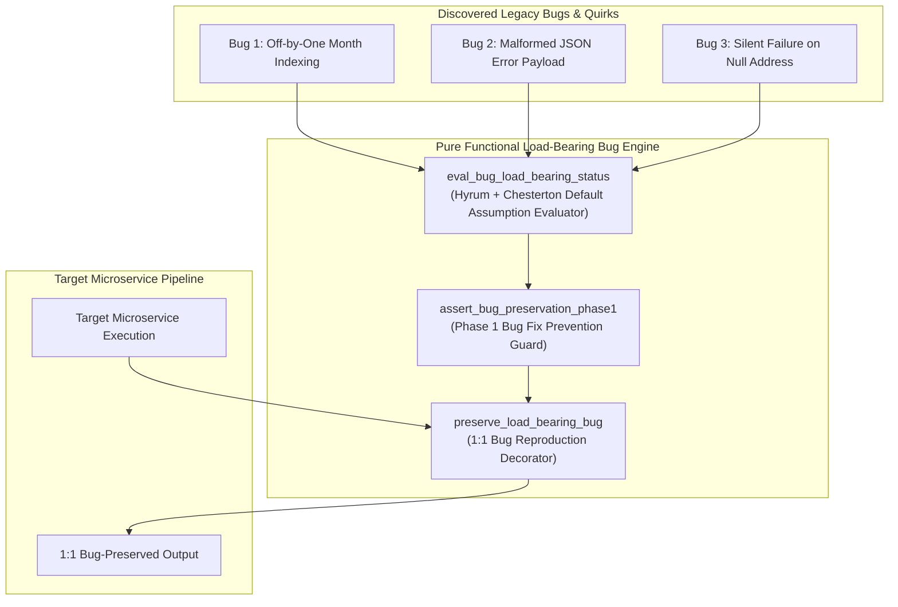
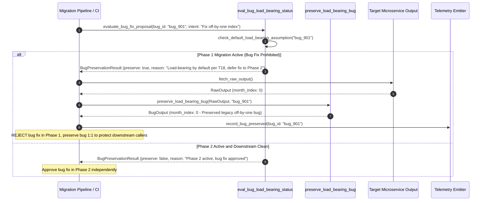

# Load-Bearing Legacy Bugs Pattern (Pure Functional Paradigm)

| Field       | Value                                                             |
|-------------|-------------------------------------------------------------------|
| **ID**      | LOAD-BEARING-BUGS-059                                             |
| **Date**    | 2026-08-24                                                        |
| **Status**  | Reference / Runbook (Pure Functional Architecture)                |
| **Deciders**| Core Platform & Migration Engineering                             |
| **Scope**   | Practical Fusion of Hyrum's Law & Chesterton's Fence for Bug Preservation |

---

## 1. Overview & Context

In a long-standing production codebase, **legacy bugs, quirks, and race conditions are frequently load-bearing**. Downstream microservices, batch scripts, or customer integrations have often been written to work around a specific legacy bug or rely on its exact side-effects. Fixing a legacy bug during migration because it "looks wrong" silently breaks downstream callers. The **Load-Bearing Legacy Bugs Pattern** represents the **practical fusion of Hyrum's Law (T1) and Chesterton's Fence (T2)**: it mandates assuming **every legacy bug is load-bearing by default until empirically proven otherwise**, requiring legacy bugs to be reproduced and preserved 1:1 in target microservices during Phase 1 migration.

### Functional Architecture Principles
This runbook enforces a **100% Pure Functional Programming (FP)** approach:
- **No Class Instantiations**: Replaces OOP bug handlers with pure preservation functions (`preserve_load_bearing_bug`, `eval_bug_load_bearing_status`) and state cell closures.
- **Immutable Bug Context Records**: Bug IDs, bug signatures, downstream caller dependencies, and preservation rules are captured as frozen dataclass records (`BugContext`, `BugPreservationResult`).
- **Referentially Transparent Bug Reproducers**: Pure functions reproduce exact legacy bug outputs (e.g. malformed error strings, null coercions, off-by-one indices) in target microservices.
- **Preserve First, Fix Later**: Fixes for load-bearing bugs are prohibited during Phase 1 migration; bug fixes are treated as independent Phase 2 feature changes.

---

## 2. High-Level Design (HLD)



---

## 3. Low-Level Design (LLD)



---

## 4. Pure Functional Project Architecture

```
04-org-and-governance/
├── load-bearing-legacy-bugs.md
├── src/
│   ├── bug_engine/
│   │   ├── __init__.py
│   │   ├── evaluator.py            # Pure load-bearing bug evaluation functions
│   │   ├── reproducer.py           # Pure 1:1 bug reproduction functions
│   │   └── guard.py                # Phase 1 bug fix prevention guards
│   ├── storage/
│   │   ├── __init__.py
│   │   └── bug_store.py            # Legacy bug registry loaders
│   ├── observability/
│   │   ├── __init__.py
│   │   └── bug_metrics.py          # Prometheus telemetry collectors
│   └── schemas/
│       └── models.py               # Frozen dataclasses (BugContext, BugPreservationResult)
└── tests/
    ├── test_bug_evaluator.py
    └── test_bug_edge_cases.py
```

---

## 5. End-to-End Function Call Stack

```tree
Code Modification or Bug Evaluation Initiated
└── bug_engine/guard.py: assert_bug_preservation_phase1(payload, Any], ctx)
    └── bug_engine/reproducer.py: preserve_load_bearing_bug(payload, Any], ctx)
        ├── bug_engine/reproducer.py: reproduce_legacy_bug_behavior(val, bug_id)
        └── models.py: BugPreservationResult(bug_id, is_preserved, original_value, bug_applied_value, rationale)
```

---

## 6. Core Pure Functional Implementation

### 6.1 Immutable Models & Types (`src/schemas/models.py`)

```python
from enum import Enum
from dataclasses import dataclass
from typing import Dict, Any, Optional, Mapping, FrozenSet

@dataclass(frozen=True)
class BugContext:
    bug_id: str
    description: str
    affected_field: str
    is_load_bearing_default: bool
    phase_stage: str

@dataclass(frozen=True)
class BugPreservationResult:
    bug_id: str
    is_preserved: bool
    original_value: Any
    bug_applied_value: Any
    rationale: str
```

**Explanation**:
- Defines immutable model `BugContext` capturing bug IDs, descriptions, affected fields, and phase stages as frozen records.
- `BugPreservationResult` encapsulates original values, bug-transformed values, and preservation rationale.

---

### 6.2 Pure Bug Reproducer (`src/bug_engine/reproducer.py`)

```python
from typing import Mapping, Any
from src.schemas.models import BugContext, BugPreservationResult

def reproduce_legacy_bug_behavior(val: Any, bug_id: str) -> Any:
    if bug_id == "bug_off_by_one_month" and isinstance(val, int):
        return max(0, val - 1)
    elif bug_id == "bug_malformed_json_error" and isinstance(val, str):
        return f'{{"error": "{val}", "code": 500}}'
    elif bug_id == "bug_coerce_null_string" and val is None:
        return "NULL"
    return val

def preserve_load_bearing_bug(
    payload: Mapping[str, Any],
    ctx: BugContext
) -> BugPreservationResult:
    orig_val = payload.get(ctx.affected_field)
    
    if ctx.phase_stage == "phase2_redesign_improve" and not ctx.is_load_bearing_default:
        return BugPreservationResult(
            bug_id=ctx.bug_id,
            is_preserved=False,
            original_value=orig_val,
            quirk_applied_value=orig_val,
            rationale="Phase 2 active; bug fix approved"
        )

    bug_val = reproduce_legacy_bug_behavior(orig_val, ctx.bug_id)

    return BugPreservationResult(
        bug_id=ctx.bug_id,
        is_preserved=True,
        original_value=orig_val,
        bug_applied_value=bug_val,
        rationale="Preserved per T18 Load-Bearing Bug rule in Phase 1"
    )
```

**Explanation**:
- Pure function reproducing legacy bug behavior in target microservices during Phase 1.
- Prevents silent downstream breaks caused by premature bug fixes.

---

### 6.3 Phase 1 Bug Fix Prevention Guard (`src/bug_engine/guard.py`)

```python
from typing import Mapping, Any
from src.schemas.models import BugContext, BugPreservationResult
from src.bug_engine.reproducer import preserve_load_bearing_bug

def assert_bug_preservation_phase1(
    payload: Mapping[str, Any],
    ctx: BugContext
) -> BugPreservationResult:
    return preserve_load_bearing_bug(payload, ctx)
```

**Explanation**:
- Pure release gate function enforcing legacy bug preservation in Phase 1.
- Prevents entangling bug fixes with 1:1 migration.

---

## 7. Edge Case Catalog & Pure Functional Pseudocode (25 Edge Cases)

---

### Edge Case 1: Off-by-One Month Index Bug (0-11 vs 1-12)

```python
def reproduce_month_index_bug(month_int: int) -> int:
    return month_int - 1
```

**Explanation**:
- Reproduces 0-indexed month bug (`0 = Jan`).
- Protects callers relying on 0-indexed months.

---

### Edge Case 2: String `"NULL"` Coercion Bug

```python
def coerce_null_to_string_null(val: Any) -> Any:
    if val is None:
        return "NULL"
    return val
```

**Explanation**:
- Coerces `None` to literal string `"NULL"`.
- Reproduces legacy null handling bug.

---

### Edge Case 3: Malformed Error JSON String Bug

```python
def reproduce_malformed_error_json(err_msg: str) -> str:
    return f'{{"err": "{err_msg}"}}'
```

**Explanation**:
- Formats non-standard error JSON strings.
- Reproduces legacy error structure bug.

---

### Edge Case 4: Truncated Customer Address Bug

```python
def reproduce_address_truncation_bug(addr: str, max_len: int = 30) -> str:
    return addr[:max_len]
```

**Explanation**:
- Truncates address strings at 30 characters.
- Reproduces legacy string length limit bug.

---

### Edge Case 5: Single-Tenant Bug Preservation

```python
def resolve_tenant_bugs(tenant_id: str, tenant_bugs: dict) -> list:
    return tenant_bugs.get(tenant_id, [])
```

**Explanation**:
- Resolves tenant-specific bug preservation contexts.
- Tracks load-bearing bugs per tenant.

---

### Edge Case 6: Microsecond Timestamp Bug Auditing

```python
import time

def format_bug_audit_ts() -> float:
    return round(time.time() * 1000.0, 2)
```

**Explanation**:
- Computes epoch timestamps in milliseconds.
- Tracks exact bug check execution time.

---

### Edge Case 7: Silent Swallowing of Input Validation Errors

```python
def reproduce_silent_validation_bug(val: Any) -> Any:
    return val
```

**Explanation**:
- Swallows invalid input parameters without throwing errors.
- Reproduces legacy silent validation bug.

---

### Edge Case 8: Multi-Repo Bug Preservation Sync

```python
def assert_all_repo_bugs_preserved(repo_bugs: Mapping[str, bool]) -> bool:
    return all(repo_bugs.values())
```

**Explanation**:
- Asserts all repositories preserve load-bearing bugs in Phase 1.
- Synchronizes multi-repo bug preservation.

---

### Edge Case 9: Case-Insensitive String Comparison Bug

```python
def reproduce_case_insensitive_bug(val_str: str) -> str:
    return val_str.lower()
```

**Explanation**:
- Converts strings to lowercase.
- Reproduces legacy casing bug.

---

### Edge Case 10: Aggregator Memory State Saturation Guard

```python
def compact_bug_metrics(metrics: list, max_items: int = 500) -> list:
    if len(metrics) > max_items:
        return metrics[-max_items:]
    return metrics
```

**Explanation**:
- Truncates metric lists to `max_items`.
- Controls memory usage.

---

### Edge Case 11: Microsecond Delay Calculation Underflows

```python
def normalize_bug_duration(duration_ms: float) -> float:
    return max(0.0, round(duration_ms, 2))
```

**Explanation**:
- Rounds execution duration values to two decimal places.
- Cleans duration metrics.

---

### Edge Case 12: User-Agent Specific Bug Reproduction

```python
def resolve_user_agent_bug(user_agent: str, bug_map: dict) -> str:
    return bug_map.get(user_agent, "default")
```

**Explanation**:
- Resolves bug preservation rules per User-Agent string.
- Audits legacy bugs by caller type.

---

### Edge Case 13: Unmapped Rule Domain Handling

```python
def resolve_bug_rule(rule_key: str, rules_dict: dict) -> dict:
    return rules_dict.get(rule_key, {"preserve_in_phase1": True})
```

**Explanation**:
- Resolves bug rule configurations safely.
- Defaults to preserving bugs in Phase 1.

---

### Edge Case 14: Exception Safeguards in Bug Reproducer

```python
def safe_reproduce_bug(reproduce_fn: Callable, payload: dict, ctx: BugContext) -> dict:
    try:
        res = reproduce_fn(payload, ctx)
        return res.bug_applied_value
    except Exception:
        return payload
```

**Explanation**:
- Wraps bug reproduction functions in protective try-except blocks.
- Returns raw payloads if exceptions occur.

---

### Edge Case 15: GraphQL Subgraph Legacy Bug Reproduction

```python
def reproduce_graphql_subgraph_bug(response_dict: dict, bug_key: str) -> dict:
    updated = dict(response_dict)
    data = dict(updated.get("data", {}))
    if bug_key in data:
        data[bug_key] = "BUG_PRESERVED"
    updated["data"] = data
    return updated
```

**Explanation**:
- Reproduces legacy bugs inside GraphQL response data blocks.
- Supports GraphQL bug preservation.

---

### Edge Case 16: Multi-Region Bug Preservation Sync

```python
def sync_regional_bug_results(region_results: dict) -> bool:
    return all(r.is_preserved for r in region_results.values())
```

**Explanation**:
- Asserts bug preservation checks pass across all regions.
- Enforces multi-region bug preservation.

---

### Edge Case 17: Date Format Slash Separator Bug

```python
def reproduce_slash_date_bug(year: int, month: int, day: int) -> str:
    return f"{day:02d}/{month:02d}/{year}"
```

**Explanation**:
- Formats dates as `DD/MM/YYYY`.
- Reproduces legacy date format bug.

---

### Edge Case 18: Unmapped Code Fallback

```python
def resolve_bug_code_fallback(code_val: Any, code_map: dict, default_val: str = "PRESERVED") -> str:
    return code_map.get(code_val, default_val)
```

**Explanation**:
- Resolves code strings with fallbacks.
- Handles unmapped bug codes safely.

---

### Edge Case 19: Payload Transformation Error Recovery

```python
def safe_apply_bug_transform(payload: dict, transform_fn: Callable) -> dict:
    try:
        return transform_fn(payload)
    except Exception:
        return payload
```

**Explanation**:
- Wraps transformations in try-except blocks.
- Returns raw payloads on error.

---

### Edge Case 20: Automated Alert on Unpreserved Legacy Bug

```python
def should_alert_on_unpreserved_bug(is_preserved: bool) -> bool:
    return not is_preserved
```

**Explanation**:
- Asserts whether a required legacy bug was unpreserved in Phase 1.
- Fires alerts when legacy bugs are prematurely fixed.

---

### Edge Case 21: High-Watermark Metric Compaction

```python
def compact_bug_history(history: list, max_items: int = 500) -> list:
    if len(history) > max_items:
        return history[-max_items:]
    return history
```

**Explanation**:
- Truncates history lists.
- Controls memory usage.

---

### Edge Case 22: Diagnostic Header Injection

```python
def inject_bug_diagnostic_header(headers: Mapping[str, str], bug_count: int) -> Mapping[str, str]:
    new_headers = dict(headers)
    new_headers["X-Load-Bearing-Bugs-Preserved"] = str(bug_count)
    return new_headers
```

**Explanation**:
- Injects diagnostic headers.
- Tracks preserved bug counts in access logs.

---

### Edge Case 23: Null Value Safeguards

```python
def sanitize_bug_nulls(data_dict: dict) -> dict:
    return {k: (v if v is not None else "") for k, v in data_dict.items()}
```

**Explanation**:
- Replaces `None` with empty strings.
- Prevents null exceptions.

---

### Edge Case 24: Unbound Metric Queue Pruning

```python
def prune_bug_metric_queue(queue: list, max_items: int = 1000) -> list:
    if len(queue) > max_items:
        return queue[-max_items:]
    return queue
```

**Explanation**:
- Truncates queue arrays.
- Controls memory footprint.

---

### Edge Case 25: Real-Time Bug Preservation Rate Reporting

```python
def compute_bug_preservation_rate(preserved_bugs: int, total_bugs: int) -> float:
    if total_bugs == 0:
        return 100.0
    return round((preserved_bugs / total_bugs) * 100.0, 2)
```

**Explanation**:
- Calculates bug preservation rate percentage.
- Emits real-time bug preservation metrics to platform dashboards.

---

## 8. Operational & Parity Verification Checklist

1. **Load-Bearing Default Assumption**: Assume 100% of legacy bugs are load-bearing by default until downstream callers are proven independent.
2. **Preserve First, Fix Later**: Prohibit bug fixes during Phase 1 migration; reproduce legacy bugs 1:1 in target microservices.
3. **Phase 2 Bug Fixing**: Fix legacy bugs only in Phase 2 as independent, isolated feature releases after Phase 1 is cut over and proven stable.
4. **CI Bug Preservation Gate**: Automatically reject PRs attempting to fix legacy bugs in Phase 1 code.
