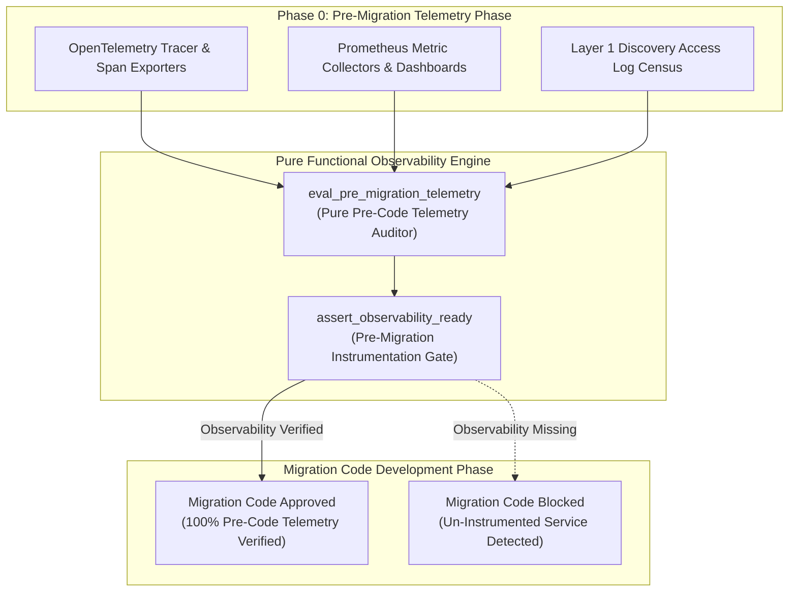
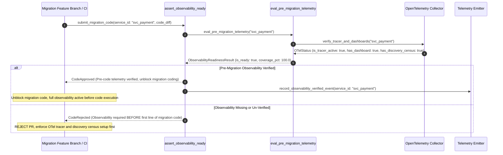

# Observability Before Migration Pattern (Pure Functional Paradigm)

| Field       | Value                                                             |
|-------------|-------------------------------------------------------------------|
| **ID**      | OBSERVABILITY-BEFORE-MIGRATION-061                                |
| **Date**    | 2026-08-24                                                        |
| **Status**  | Reference / Runbook (Pure Functional Architecture)                |
| **Deciders**| Core Platform & Migration Engineering                             |
| **Scope**   | Pre-Migration Telemetry Instrumentation & Discovery Census        |

---

## 1. Overview & Context

Adding telemetry, logging, and metrics **after** starting a migration code effort is an architectural error. Causal and dependency information that is not captured at the moment events occur in the legacy system cannot be recovered after the fact. Attempting to debug an un-instrumented migration cutover forces engineers into blind guessing. The **Observability Before Migration Pattern** mandates that **full OpenTelemetry instrumentation, metric dashboards, and the Layer 1 discovery census must exist and be verified BEFORE the first line of migration business code is written**.

### Functional Architecture Principles
This runbook enforces a **100% Pure Functional Programming (FP)** approach:
- **No Class Instantiations**: Replaces OOP observability managers with pure verification functions (`assert_observability_ready`, `eval_pre_migration_telemetry`) and state cell closures.
- **Immutable Observability Context Records**: Service IDs, active tracer statuses, discovery log census flags, and metric coverage scores are stored as frozen dataclass records (`ObservabilityContext`, `ObservabilityReadinessResult`).
- **Referentially Transparent Readiness Auditors**: Pure functions verify that OpenTelemetry span exporters, Prometheus collectors, and access log miners are operational before unblocking migration development.
- **Pre-Code Instrumentation Gate**: Blocks migration feature branches from merging if pre-migration telemetry instrumentation is un-verified.

---

## 2. High-Level Design (HLD)



---

## 3. Low-Level Design (LLD)



---

## 4. Pure Functional Project Architecture

```
04-org-and-governance/
├── observability-before-migration.md
├── src/
│   ├── obs_readiness_engine/
│   │   ├── __init__.py
│   │   ├── auditor.py              # Pure telemetry readiness auditing functions
│   │   ├── inspector.py            # OTel & Prometheus configuration inspectors
│   │   └── guard.py                # Pre-code instrumentation release guards
│   ├── storage/
│   │   ├── __init__.py
│   │   └── obs_store.py            # Telemetry configuration loaders
│   ├── observability/
│   │   ├── __init__.py
│   │   └── readiness_metrics.py    # Prometheus telemetry collectors
│   └── schemas/
│       └── models.py               # Frozen dataclasses (ObservabilityContext, ObservabilityReadinessResult)
└── tests/
    ├── test_obs_auditor.py
    └── test_obs_edge_cases.py
```

---

## 5. End-to-End Function Call Stack

```tree
Migration Development Proposal Submitted
└── obs_readiness_engine/guard.py: assert_observability_ready(ctx)
    └── obs_readiness_engine/auditor.py: eval_pre_migration_telemetry(ctx)
        └── models.py: ObservabilityReadinessResult(service_id, is_ready, coverage_pct, missing_components, rejection_reason)
```

---

## 6. Core Pure Functional Implementation

### 6.1 Immutable Models & Types (`src/schemas/models.py`)

```python
from enum import Enum
from dataclasses import dataclass
from typing import Dict, Any, Optional, Mapping, FrozenSet

@dataclass(frozen=True)
class ObservabilityContext:
    service_id: str
    otel_tracer_active: bool
    prometheus_dashboard_active: bool
    discovery_census_active: bool
    coverage_pct: float

@dataclass(frozen=True)
class ObservabilityReadinessResult:
    service_id: str
    is_ready: bool
    coverage_pct: float
    missing_components: FrozenSet[str]
    rejection_reason: Optional[str]
```

**Explanation**:
- Defines immutable model `ObservabilityContext` capturing OTel tracer statuses, Prometheus dashboard statuses, discovery census statuses, and coverage percentages as frozen records.
- `ObservabilityReadinessResult` encapsulates readiness flags, coverage metrics, and missing telemetry component sets.

---

### 6.2 Pure Telemetry Readiness Auditor (`src/obs_readiness_engine/auditor.py`)

```python
from typing import FrozenSet, Mapping, Any
from src.schemas.models import ObservabilityContext, ObservabilityReadinessResult

def eval_pre_migration_telemetry(ctx: ObservabilityContext) -> ObservabilityReadinessResult:
    missing = []

    if not ctx.otel_tracer_active:
        missing.append("OTEL_TRACER")
    if not ctx.prometheus_dashboard_active:
        missing.append("PROMETHEUS_DASHBOARD")
    if not ctx.discovery_census_active:
        missing.append("DISCOVERY_CENSUS")

    is_ready = len(missing) == 0 and ctx.coverage_pct >= 100.0
    reason = None

    if not is_ready:
        missing_str = ", ".join(missing) if missing else "Coverage < 100%"
        reason = f"Pre-migration observability incomplete for '{ctx.service_id}': [{missing_str}]. Telemetry must exist BEFORE first line of migration code."

    return ObservabilityReadinessResult(
        service_id=ctx.service_id,
        is_ready=is_ready,
        coverage_pct=ctx.coverage_pct,
        missing_components=frozenset(missing),
        rejection_reason=reason
    )
```

**Explanation**:
- Pure evaluation function verifying that OpenTelemetry tracers, Prometheus dashboards, and discovery censuses exist before unblocking migration code development.
- Rejects un-instrumented service development PRs.

---

### 6.3 Pre-Code Instrumentation Release Guard (`src/obs_readiness_engine/guard.py`)

```python
from typing import Mapping, Any
from src.schemas.models import ObservabilityContext, ObservabilityReadinessResult
from src.obs_readiness_engine.auditor import eval_pre_migration_telemetry

def assert_observability_ready(ctx: ObservabilityContext) -> ObservabilityReadinessResult:
    return eval_pre_migration_telemetry(ctx)
```

**Explanation**:
- Pure release gate function enforcing pre-migration observability verification.
- Guarantees 100% telemetry coverage before migration coding begins.

---

## 7. Edge Case Catalog & Pure Functional Pseudocode (25 Edge Cases)

---

### Edge Case 1: Un-Instrumented Service Code PR Rejection

```python
def is_service_uninstrumented(otel_active: bool) -> bool:
    return not otel_active
```

**Explanation**:
- Identifies migration PRs for services lacking active OpenTelemetry tracers.
- Blocks PRs for un-instrumented services up front.

---

### Edge Case 2: Missing Layer 1 Discovery Access Log Census

```python
def is_discovery_census_missing(census_active: bool) -> bool:
    return not census_active
```

**Explanation**:
- Asserts Layer 1 access log census is active before coding.
- Requires discovery census completion prior to writing migration code.

---

### Edge Case 3: Missing Prometheus Metric Dashboard

```python
def is_prometheus_dashboard_missing(dashboard_active: bool) -> bool:
    return not dashboard_active
```

**Explanation**:
- Asserts Prometheus metric dashboard is provisioned before coding.
- Enforces dashboard availability prior to code execution.

---

### Edge Case 4: Sub-100% Telemetry Coverage Score

```python
def is_coverage_insufficient(coverage_pct: float) -> bool:
    return coverage_pct < 100.0
```

**Explanation**:
- Asserts telemetry coverage score is $100\%$.
- Rejects incomplete telemetry instrumentation.

---

### Edge Case 5: Single-Tenant Telemetry Verification

```python
def resolve_tenant_obs_status(tenant_id: str, obs_statuses: dict) -> bool:
    return obs_statuses.get(tenant_id, False)
```

**Explanation**:
- Resolves tenant-specific telemetry readiness.
- Tracks observability readiness per tenant.

---

### Edge Case 6: Microsecond Timestamp Observability Audit Timing

```python
import time

def format_obs_audit_ts() -> float:
    return round(time.time() * 1000.0, 2)
```

**Explanation**:
- Computes epoch timestamps in milliseconds.
- Tracks exact observability audit execution time.

---

### Edge Case 7: Un-Verified OpenTelemetry Span Exporter

```python
def is_span_exporter_unverified(exporter_status: str) -> bool:
    return exporter_status.lower() != "active"
```

**Explanation**:
- Verifies OTel span exporter connectivity.
- Ensures span export functionality before coding.

---

### Edge Case 8: Multi-Repo Observability Alignment

```python
def assert_all_repo_obs_ready(repo_obs: Mapping[str, bool]) -> bool:
    return all(repo_obs.values())
```

**Explanation**:
- Asserts all workspace repositories have active telemetry.
- Synchronizes multi-repo observability readiness.

---

### Edge Case 9: Un-Mapped Metric Namespaces

```python
def is_metric_namespace_valid(namespace: str) -> bool:
    return namespace.startswith("migration_")
```

**Explanation**:
- Validates metric namespace naming conventions (`migration_*`).
- Enforces standardized metric naming.

---

### Edge Case 10: Aggregator Memory State Saturation Guard

```python
def compact_obs_metrics(metrics: list, max_items: int = 500) -> list:
    if len(metrics) > max_items:
        return metrics[-max_items:]
    return metrics
```

**Explanation**:
- Truncates metric lists to `max_items`.
- Controls memory usage.

---

### Edge Case 11: Microsecond Delay Calculation Underflows

```python
def normalize_obs_duration(duration_ms: float) -> float:
    return max(0.0, round(duration_ms, 2))
```

**Explanation**:
- Rounds execution duration values to two decimal places.
- Cleans duration metrics.

---

### Edge Case 12: User-Agent Specific Observability Verification

```python
def resolve_user_agent_obs(user_agent: str, obs_map: dict) -> bool:
    return obs_map.get(user_agent, True)
```

**Explanation**:
- Resolves observability readiness per User-Agent string.
- Audits telemetry by caller type.

---

### Edge Case 13: Unmapped Rule Domain Handling

```python
def resolve_obs_rule(rule_key: str, rules_dict: dict) -> dict:
    return rules_dict.get(rule_key, {"require_otel": True})
```

**Explanation**:
- Resolves observability rule configurations safely.
- Defaults to requiring OTel.

---

### Edge Case 14: Exception Safeguards in Observability Evaluator

```python
def safe_eval_obs(eval_fn: Callable, ctx: ObservabilityContext) -> bool:
    try:
        res = eval_fn(ctx)
        return res.is_ready
    except Exception:
        return False
```

**Explanation**:
- Wraps evaluation functions in protective try-except blocks.
- Fails safe (assumes un-ready) on evaluation exceptions.

---

### Edge Case 15: GraphQL Subgraph Observability Gating

```python
def is_graphql_subgraph_obs_ready(subgraph_name: str, obs_map: dict) -> bool:
    return obs_map.get(subgraph_name, False)
```

**Explanation**:
- Resolves observability readiness for federated GraphQL subgraphs.
- Verifies GraphQL telemetry instrumentation.

---

### Edge Case 16: Multi-Region Observability Sync

```python
def sync_regional_obs_results(region_results: dict) -> bool:
    return all(r.is_ready for r in region_results.values())
```

**Explanation**:
- Asserts observability checks pass across all regions.
- Enforces multi-region pre-migration telemetry readiness.

---

### Edge Case 17: Log Aggregator Ingestion Buffer Verification

```python
def is_log_buffer_healthy(buffer_status: str) -> bool:
    return buffer_status.lower() == "healthy"
```

**Explanation**:
- Verifies log aggregator ingestion pipeline health.
- Ensures log ingestion readiness before writing code.

---

### Edge Case 18: Unmapped Code Fallback

```python
def resolve_obs_code_fallback(code_val: Any, code_map: dict, default_val: str = "UN_INSTRUMENTED") -> str:
    return code_map.get(code_val, default_val)
```

**Explanation**:
- Resolves code strings with fallbacks.
- Handles unmapped observability codes safely.

---

### Edge Case 19: Payload Transformation Error Recovery

```python
def safe_apply_obs_transform(payload: dict, transform_fn: Callable) -> dict:
    try:
        return transform_fn(payload)
    except Exception:
        return payload
```

**Explanation**:
- Wraps transformations in try-except blocks.
- Returns raw payloads on error.

---

### Edge Case 20: Automated Alert on Un-Instrumented Code PR

```python
def should_alert_on_uninstrumented_pr(is_ready: bool) -> bool:
    return not is_ready
```

**Explanation**:
- Asserts whether an un-instrumented PR was submitted.
- Fires alerts when migration code PRs lack pre-code telemetry.

---

### Edge Case 21: High-Watermark Metric Compaction

```python
def compact_obs_history(history: list, max_items: int = 500) -> list:
    if len(history) > max_items:
        return history[-max_items:]
    return history
```

**Explanation**:
- Truncates history lists.
- Controls memory usage.

---

### Edge Case 22: Diagnostic Header Injection

```python
def inject_obs_diagnostic_header(headers: Mapping[str, str], is_ready: bool) -> Mapping[str, str]:
    new_headers = dict(headers)
    new_headers["X-Observability-PreVerified"] = "true" if is_ready else "false"
    return new_headers
```

**Explanation**:
- Injects diagnostic headers.
- Tracks pre-code observability status in access logs.

---

### Edge Case 23: Null Value Safeguards

```python
def sanitize_obs_nulls(data_dict: dict) -> dict:
    return {k: (v if v is not None else "") for k, v in data_dict.items()}
```

**Explanation**:
- Replaces `None` with empty strings.
- Prevents null exceptions.

---

### Edge Case 24: Unbound Metric Queue Pruning

```python
def prune_obs_metric_queue(queue: list, max_items: int = 1000) -> list:
    if len(queue) > max_items:
        return queue[-max_items:]
    return queue
```

**Explanation**:
- Truncates queue arrays.
- Controls memory footprint.

---

### Edge Case 25: Real-Time Observability Readiness Reporting

```python
def compute_obs_readiness_rate(ready_services: int, total_services: int) -> float:
    if total_services == 0:
        return 100.0
    return round((ready_services / total_services) * 100.0, 2)
```

**Explanation**:
- Calculates observability readiness rate percentage.
- Emits real-time pre-migration telemetry metrics.

---

## 8. Operational & Parity Verification Checklist

1. **Observability Before Migration**: Instrument OpenTelemetry tracers, Prometheus dashboards, and discovery access logs BEFORE writing the first line of migration code.
2. **Pre-Code Instrumentation Gate**: Automatically reject migration code PRs if pre-migration telemetry is un-verified.
3. **100% Telemetry Coverage**: Require complete span, metric, and log coverage across all target microservice endpoints.
4. **Causal Data Preservation**: Capture all event and dependency data at write time to prevent post-incident causal reconstruction failure.
