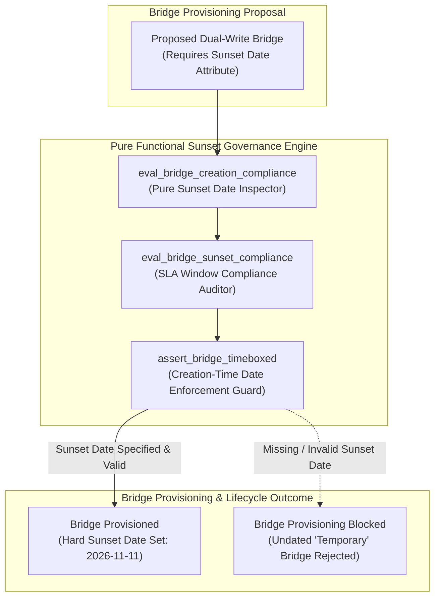
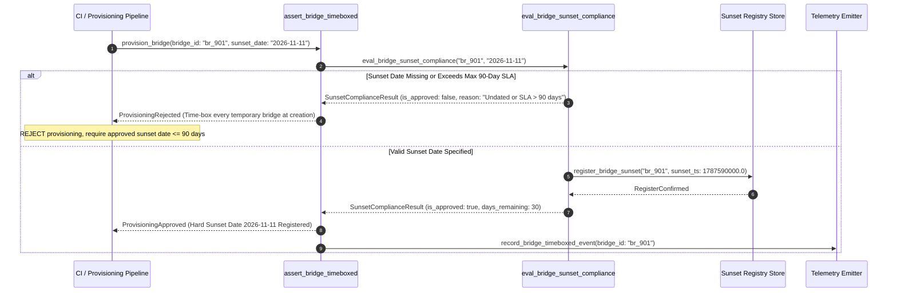

# Time-Box Temporary Bridges Pattern (Pure Functional Paradigm)

| Field       | Value                                                             |
|-------------|-------------------------------------------------------------------|
| **ID**      | TIME-BOX-TEMPORARY-BRIDGES-060                                    |
| **Date**    | 2026-08-24                                                        |
| **Status**  | Reference / Runbook (Pure Functional Architecture)                |
| **Deciders**| Core Platform & Migration Engineering                             |
| **Scope**   | Permanent Tech Debt Prevention & Mandated Sunset Scheduling        |

---

## 1. Overview & Context

Allowing migration bridges, dual-write adapters, or CDC replication streams to launch without an explicit decommission date guarantees that "temporary" infrastructure will become permanent technical debt. Data drift compounds the longer a bridge stays open, and undated bridges reliably languish for years after cutovers complete. The **Time-Box Temporary Bridges Pattern** mandates that **no temporary bridge or sync mechanism may be created without a hard, calendared decommission date set at the moment of creation (e.g. max 30 days post-cutover)**.

### Functional Architecture Principles
This runbook enforces a **100% Pure Functional Programming (FP)** approach:
- **No Class Instantiations**: Replaces OOP bridge managers with pure governance functions (`assert_bridge_timeboxed`, `eval_bridge_sunset_compliance`) and state cell closures.
- **Immutable Sunset Context Records**: Bridge IDs, creation timestamps, hard sunset deadlines, owner team tags, and compliance statuses are stored as frozen dataclass records (`BridgeSunsetContext`, `SunsetComplianceResult`).
- **Referentially Transparent Expiry Audits**: Pure evaluation functions calculate remaining bridge SLA days and flag overdue bridges for automated shutdown.
- **Creation-Time Date Enforcement**: Rejects bridge provisioning requests that lack a hard, approved calendared decommission date attribute.

---

## 2. High-Level Design (HLD)



---

## 3. Low-Level Design (LLD)



---

## 4. Pure Functional Project Architecture

```
04-org-and-governance/
├── time-box-temporary-bridges.md
├── src/
│   ├── sunset_engine/
│   │   ├── __init__.py
│   │   ├── evaluator.py            # Pure sunset date compliance evaluators
│   │   ├── inspector.py            # Creation-time date inspection functions
│   │   └── guard.py                # Bridge provisioning release guards
│   ├── storage/
│   │   ├── __init__.py
│   │   └── sunset_store.py         # Sunset registry loaders
│   ├── observability/
│   │   ├── __init__.py
│   │   └── sunset_metrics.py       # Prometheus telemetry collectors
│   └── schemas/
│       └── models.py               # Frozen dataclasses (BridgeSunsetContext, SunsetComplianceResult)
└── tests/
    ├── test_sunset_evaluator.py
    └── test_sunset_edge_cases.py
```

---

## 5. End-to-End Function Call Stack

```tree
Bridge Provisioning Request Submitted
└── sunset_engine/guard.py: assert_bridge_timeboxed(ctx, current_ts)
    └── sunset_engine/evaluator.py: eval_bridge_sunset_compliance(ctx, current_ts)
        └── models.py: SunsetComplianceResult(bridge_id, is_approved, days_remaining, is_overdue, rejection_reason)
```

---

## 6. Core Pure Functional Implementation

### 6.1 Immutable Models & Types (`src/schemas/models.py`)

```python
from enum import Enum
from dataclasses import dataclass
from typing import Dict, Any, Optional, Mapping, FrozenSet

@dataclass(frozen=True)
class BridgeSunsetContext:
    bridge_id: str
    owner_team: str
    created_at_ts: float
    sunset_deadline_ts: float
    max_sla_days: int

@dataclass(frozen=True)
class SunsetComplianceResult:
    bridge_id: str
    is_approved: bool
    days_remaining: float
    is_overdue: bool
    rejection_reason: Optional[str]
```

**Explanation**:
- Defines immutable model `BridgeSunsetContext` capturing bridge IDs, creation timestamps, and sunset deadlines as frozen records.
- `SunsetComplianceResult` encapsulates approval flags, remaining days, overdue flags, and rejection reasons.

---

### 6.2 Pure Sunset Compliance Evaluator (`src/sunset_engine/evaluator.py`)

```python
import time
from typing import Mapping, Any
from src.schemas.models import BridgeSunsetContext, SunsetComplianceResult

def eval_bridge_sunset_compliance(
    ctx: BridgeSunsetContext,
    current_ts: float
) -> SunsetComplianceResult:
    if ctx.sunset_deadline_ts <= 0:
        return SunsetComplianceResult(
            bridge_id=ctx.bridge_id,
            is_approved=False,
            days_remaining=0.0,
            is_overdue=True,
            rejection_reason="Temporary bridge lacks a mandatory calendared sunset date"
        )

    remaining_sec = ctx.sunset_deadline_ts - current_ts
    remaining_days = remaining_sec / 86400.0
    total_days = (ctx.sunset_deadline_ts - ctx.created_at_ts) / 86400.0

    is_overdue = remaining_sec <= 0
    is_sla_ok = total_days <= ctx.max_sla_days
    is_approved = not is_overdue and is_sla_ok

    reason = None
    if is_overdue:
        reason = f"Bridge '{ctx.bridge_id}' is overdue by {abs(remaining_days):.1f} days. Sunset date passed."
    elif not is_sla_ok:
        reason = f"Bridge SLA window ({total_days:.1f} days) exceeds max allowed cap ({ctx.max_sla_days} days)"

    return SunsetComplianceResult(
        bridge_id=ctx.bridge_id,
        is_approved=is_approved,
        days_remaining=round(remaining_days, 2),
        is_overdue=is_overdue,
        rejection_reason=reason
    )
```

**Explanation**:
- Pure evaluation function asserting that temporary bridges specify a hard, valid sunset date within SLA bounds (max 90 days).
- Rejects undated or overdue bridge proposals to eliminate permanent tech debt.

---

### 6.3 Creation-Time Date Enforcement Guard (`src/sunset_engine/guard.py`)

```python
from typing import Mapping, Any
from src.schemas.models import BridgeSunsetContext, SunsetComplianceResult
from src.sunset_engine.evaluator import eval_bridge_sunset_compliance

def assert_bridge_timeboxed(ctx: BridgeSunsetContext, current_ts: float) -> SunsetComplianceResult:
    return eval_bridge_sunset_compliance(ctx, current_ts)
```

**Explanation**:
- Pure release gate function enforcing sunset date registration at bridge creation time.
- Guarantees permanent tech debt prevention.

---

## 7. Edge Case Catalog & Pure Functional Pseudocode (25 Edge Cases)

---

### Edge Case 1: Undated "Temporary" Bridge Provisioning Rejection

```python
def is_bridge_undated(sunset_ts: float) -> bool:
    return sunset_ts <= 0.0
```

**Explanation**:
- Identifies bridge proposals lacking sunset dates.
- Blocks undated bridge creation up front.

---

### Edge Case 2: Bridge SLA Window Exceeding 90 Days

```python
def is_bridge_sla_exceeded(created_ts: float, sunset_ts: float, max_days: int = 90) -> bool:
    return ((sunset_ts - created_ts) / 86400.0) > max_days
```

**Explanation**:
- Asserts bridge window duration is $\le 90\text{ days}$.
- Bounds maximum temporary bridge lifetime.

---

### Edge Case 3: Overdue Bridge Sunset Date

```python
def is_bridge_overdue(sunset_ts: float, current_ts: float) -> bool:
    return current_ts >= sunset_ts
```

**Explanation**:
- Identifies expired bridge sunset dates.
- Triggers automated decommissioning alerts for overdue bridges.

---

### Edge Case 4: Un-Owned Bridge Provisioning Rejection

```python
def is_bridge_owner_missing(owner_team: str) -> bool:
    return not owner_team or owner_team.strip() == ""
```

**Explanation**:
- Asserts bridge specifies an owner team tag.
- Requires accountable ownership for all migration bridges.

---

### Edge Case 5: Single-Tenant Sunset Date Resolution

```python
def resolve_tenant_sunset(tenant_id: str, tenant_sunsets: dict) -> float:
    return tenant_sunsets.get(tenant_id, 0.0)
```

**Explanation**:
- Resolves tenant-specific sunset deadlines.
- Tracks bridge time-boxing per tenant.

---

### Edge Case 6: Microsecond Timestamp Sunset Auditing

```python
import time

def format_sunset_audit_ts() -> float:
    return round(time.time() * 1000.0, 2)
```

**Explanation**:
- Computes epoch timestamps in milliseconds.
- Tracks exact sunset audit execution time.

---

### Edge Case 7: Approved Sunset Extension Grace Period

```python
def apply_approved_extension(sunset_ts: float, extension_days: int = 14) -> float:
    return sunset_ts + (extension_days * 86400.0)
```

**Explanation**:
- Applies formal approved sunset extensions.
- Accommodates signed-off grace period extensions.

---

### Edge Case 8: Multi-Repo Bridge Sunset Sync

```python
def assert_all_repo_bridges_timeboxed(repo_sunsets: Mapping[str, float]) -> bool:
    return all(ts > 0 for ts in repo_sunsets.values())
```

**Explanation**:
- Asserts all bridge tools across repositories specify sunset dates.
- Synchronizes multi-repo bridge time-boxing.

---

### Edge Case 9: CDC Stream Un-Registration on Sunset Date

```python
def is_cdc_unregistered_on_sunset(current_ts: float, sunset_ts: float) -> bool:
    return current_ts >= sunset_ts
```

**Explanation**:
- Triggers CDC stream un-registration when sunset dates pass.
- Disables expired CDC streams.

---

### Edge Case 10: Aggregator Memory State Saturation Guard

```python
def compact_sunset_metrics(metrics: list, max_items: int = 500) -> list:
    if len(metrics) > max_items:
        return metrics[-max_items:]
    return metrics
```

**Explanation**:
- Truncates metric lists to `max_items`.
- Controls memory usage.

---

### Edge Case 11: Microsecond Delay Calculation Underflows

```python
def normalize_sunset_duration(duration_ms: float) -> float:
    return max(0.0, round(duration_ms, 2))
```

**Explanation**:
- Rounds execution duration values to two decimal places.
- Cleans duration metrics.

---

### Edge Case 12: User-Agent Specific Sunset Auditing

```python
def resolve_user_agent_sunset(user_agent: str, sunset_map: dict) -> float:
    return sunset_map.get(user_agent, 0.0)
```

**Explanation**:
- Resolves sunset dates per User-Agent string.
- Audits bridge time-boxing by caller type.

---

### Edge Case 13: Unmapped Rule Domain Handling

```python
def resolve_sunset_rule(rule_key: str, rules_dict: dict) -> dict:
    return rules_dict.get(rule_key, {"max_sla_days": 90})
```

**Explanation**:
- Resolves sunset rule configurations safely.
- Defaults to 90-day SLA caps.

---

### Edge Case 14: Exception Safeguards in Sunset Evaluator

```python
def safe_eval_sunset(eval_fn: Callable, ctx: BridgeSunsetContext, ts: float) -> bool:
    try:
        res = eval_fn(ctx, ts)
        return res.is_approved
    except Exception:
        return False
```

**Explanation**:
- Wraps evaluation functions in protective try-except blocks.
- Fails safe (assumes un-approved) on evaluation exceptions.

---

### Edge Case 15: GraphQL Subgraph Bridge Sunset Verification

```python
def is_graphql_subgraph_bridge_timeboxed(subgraph_name: str, sunset_map: dict) -> bool:
    return sunset_map.get(subgraph_name, 0.0) > 0.0
```

**Explanation**:
- Verifies sunset date specification for federated GraphQL bridges.
- Supports GraphQL bridge time-boxing.

---

### Edge Case 16: Multi-Region Sunset Sync

```python
def sync_regional_sunset_results(region_results: dict) -> bool:
    return all(r.is_approved for r in region_results.values())
```

**Explanation**:
- Asserts sunset compliance checks pass across all regions.
- Enforces multi-region bridge time-boxing.

---

### Edge Case 17: Secondary Write-Back Disable Assertion

```python
def should_disable_write_back(current_ts: float, sunset_ts: float) -> bool:
    return current_ts >= sunset_ts
```

**Explanation**:
- Disables secondary write-back dispatchers when sunset dates pass.
- Eliminates permanent write-back overhead.

---

### Edge Case 18: Unmapped Code Fallback

```python
def resolve_sunset_code_fallback(code_val: Any, code_map: dict, default_val: str = "UNDATED") -> str:
    return code_map.get(code_val, default_val)
```

**Explanation**:
- Resolves code strings with fallbacks.
- Handles unmapped sunset codes safely.

---

### Edge Case 19: Payload Transformation Error Recovery

```python
def safe_apply_sunset_transform(payload: dict, transform_fn: Callable) -> dict:
    try:
        return transform_fn(payload)
    except Exception:
        return payload
```

**Explanation**:
- Wraps transformations in try-except blocks.
- Returns raw payloads on error.

---

### Edge Case 20: Automated Alert on Approaching Sunset Date

```python
def should_alert_approaching_sunset(remaining_days: float, warn_days: float = 7.0) -> bool:
    return 0.0 < remaining_days <= warn_days
```

**Explanation**:
- Asserts whether remaining days fall within 7-day warning windows.
- Emits daily warning alerts to bridge owner teams.

---

### Edge Case 21: High-Watermark Metric Compaction

```python
def compact_sunset_history(history: list, max_items: int = 500) -> list:
    if len(history) > max_items:
        return history[-max_items:]
    return history
```

**Explanation**:
- Truncates history lists.
- Controls memory usage.

---

### Edge Case 22: Diagnostic Header Injection

```python
def inject_sunset_diagnostic_header(headers: Mapping[str, str], sunset_ts: float) -> Mapping[str, str]:
    new_headers = dict(headers)
    new_headers["X-Bridge-Sunset-Timestamp"] = str(sunset_ts)
    return new_headers
```

**Explanation**:
- Injects diagnostic headers.
- Tags bridge sunset timestamps in access logs.

---

### Edge Case 23: Null Value Safeguards

```python
def sanitize_sunset_nulls(data_dict: dict) -> dict:
    return {k: (v if v is not None else 0.0) for k, v in data_dict.items()}
```

**Explanation**:
- Replaces `None` with `0.0`.
- Prevents null exceptions.

---

### Edge Case 24: Unbound Metric Queue Pruning

```python
def prune_sunset_metric_queue(queue: list, max_items: int = 1000) -> list:
    if len(queue) > max_items:
        return queue[-max_items:]
    return queue
```

**Explanation**:
- Truncates queue arrays.
- Controls memory footprint.

---

### Edge Case 25: Real-Time Time-Boxed Bridge Compliance Reporting

```python
def compute_timeboxed_bridge_rate(timeboxed_count: int, total_bridges: int) -> float:
    if total_bridges == 0:
        return 100.0
    return round((timeboxed_count / total_bridges) * 100.0, 2)
```

**Explanation**:
- Calculates time-boxed bridge compliance percentage.
- Emits real-time bridge sunset metrics to platform dashboards.

---

## 8. Operational & Parity Verification Checklist

1. **Creation-Time Sunset Date**: Mandate that no temporary bridge or sync mechanism may be created without a hard, calendared decommission date set at creation.
2. **Maximum 90-Day SLA**: Restrict bridge lifetimes to $\le 90\text{ days}$ post-cutover to prevent long-term tech debt accumulation.
3. **Accountable Ownership**: Require every bridge to specify an owner team tag for warning escalation.
4. **Automated Decommissioning**: Automatically disable secondary write dispatchers and un-register CDC streams when sunset deadlines pass.
