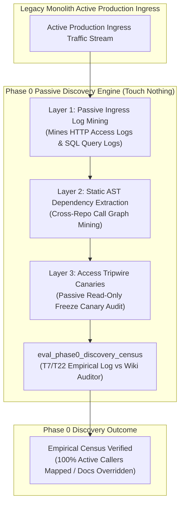
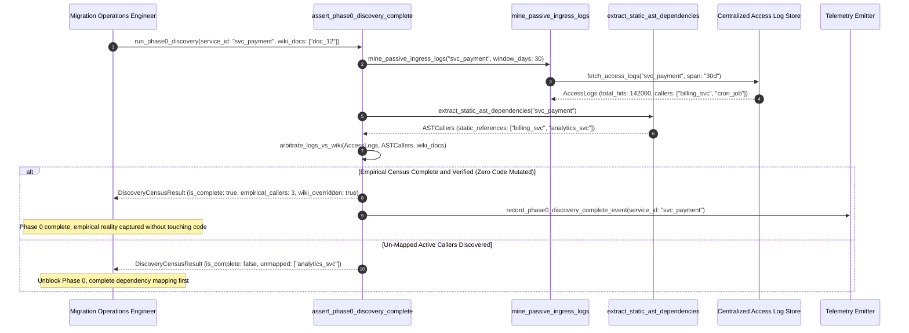

# Discover First, Touch Nothing Pattern (Pure Functional Paradigm)

| Field       | Value                                                             |
|-------------|-------------------------------------------------------------------|
| **ID**      | DISCOVER-FIRST-TOUCH-NOTHING-073                                  |
| **Date**    | 2026-08-24                                                        |
| **Status**  | Reference / Runbook (Pure Functional Architecture)                |
| **Deciders**| Core Platform & Migration Engineering                             |
| **Scope**   | Phase 0 Passive Discovery, Layer 1-3 Ingress Census & Zero Touch  |

---

## 1. Overview & Context

Before writing a single line of microservice code or altering database schemas, the first mandatory step of any service migration is **Phase 0 Passive Discovery: Discover First, Touch Nothing**. In accordance with **T7 (Empirical Dependency Verification)** and **T22 (Trust Access Logs Over Wiki)**, engineers must assume written documentation, wiki pages, and developer assumptions are incomplete or incorrect until empirical ingress access logs prove otherwise. Phase 0 executes **Layers 1 through 3 in strict sequential order** without mutating any target code or database state:
- **Layer 1 (Passive Ingress Log Mining)**: Passive collection of HTTP access logs, SQL query logs, and deprecation header responses.
- **Layer 2 (Static Code Dependency Extraction)**: Static AST graph extraction across all consuming repositories.
- **Layer 3 (Access Tripwire Canaries)**: Reversible read-only freeze alerts on legacy endpoints as a last-resort verification before cutover.

### Functional Architecture Principles
This runbook enforces a **100% Pure Functional Programming (FP)** approach:
- **No Class Instantiations**: Replaces OOP discovery managers with pure mining functions (`mine_passive_ingress_logs`, `eval_phase0_discovery_census`) and state cell closures.
- **Immutable Discovery Context Records**: Endpoint URIs, discovered caller sets, access log hit counts, and static AST references are stored as frozen dataclass records (`Phase0DiscoveryContext`, `DiscoveryCensusResult`).
- **Referentially Transparent Passive Scanners**: Pure functions process access log streams without modifying application state or invoking side-effecting code.
- **Zero-Touch Execution**: Guarantees zero code mutations, zero schema alterations, and zero traffic modifications during Phase 0.

---

## 2. High-Level Design (HLD)



---

## 3. Low-Level Design (LLD)



---

## 4. Pure Functional Project Architecture

```
05-dependency-discovery-and-log-mining/
├── discover-first-touch-nothing-phase0.md
├── src/
│   ├── phase0_engine/
│   │   ├── __init__.py
│   │   ├── miner.py                # Layer 1 passive ingress log mining functions
│   │   ├── ast_scanner.py          # Layer 2 static AST dependency extractors
│   │   ├── tripwire.py             # Layer 3 access tripwire canary functions
│   │   └── guard.py                # Phase 0 passive discovery release guards
│   ├── storage/
│   │   ├── __init__.py
│   │   └── log_store.py            # Log store connector abstractions
│   ├── observability/
│   │   ├── __init__.py
│   │   └── discovery_metrics.py    # Prometheus telemetry collectors
│   └── schemas/
│       └── models.py               # Frozen dataclasses (Phase0DiscoveryContext, DiscoveryCensusResult)
└── tests/
    ├── test_phase0_miner.py
    └── test_phase0_edge_cases.py
```

---

## 5. End-to-End Function Call Stack

```tree
Phase 0 Discovery Initiated
└── phase0_engine/guard.py: assert_phase0_discovery_complete(ctx)
    └── phase0_engine/miner.py: eval_phase0_discovery_census(ctx)
        └── models.py: DiscoveryCensusResult(service_id, is_complete, total_empirical_callers_count, overridden_wiki_claims, discovered_callers, rejection_reason)
```

---

## 6. Core Pure Functional Implementation

### 6.1 Immutable Models & Types (`src/schemas/models.py`)

```python
from enum import Enum
from dataclasses import dataclass
from typing import Dict, Any, Optional, Mapping, FrozenSet

@dataclass(frozen=True)
class Phase0DiscoveryContext:
    service_id: str
    sample_window_days: int
    total_log_hits: int
    empirical_callers: FrozenSet[str]
    static_ast_callers: FrozenSet[str]
    wiki_claimed_callers: FrozenSet[str]

@dataclass(frozen=True)
class DiscoveryCensusResult:
    service_id: str
    is_complete: bool
    total_empirical_callers_count: int
    overridden_wiki_claims: FrozenSet[str]
    discovered_callers: FrozenSet[str]
    rejection_reason: Optional[str]
```

**Explanation**:
- Defines immutable model `Phase0DiscoveryContext` capturing empirical caller sets, static AST caller sets, and wiki claimed caller sets as frozen records.
- `DiscoveryCensusResult` encapsulates completeness flags, empirical caller counts, and sets of disproven wiki claims.

---

### 6.2 Pure Ingress Log Miner & AST Scanner (`src/phase0_engine/miner.py`)

```python
from typing import FrozenSet, Mapping, Any, Tuple
from src.schemas.models import Phase0DiscoveryContext, DiscoveryCensusResult

def mine_passive_ingress_logs(
    log_records: list
) -> Tuple[int, FrozenSet[str]]:
    hits = 0
    callers = set()

    for rec in log_records:
        hits += 1
        if "caller_id" in rec:
            callers.add(rec["caller_id"])

    return hits, frozenset(callers)

def eval_phase0_discovery_census(
    ctx: Phase0DiscoveryContext
) -> DiscoveryCensusResult:
    all_discovered = ctx.empirical_callers.union(ctx.static_ast_callers)
    disproven_wiki = ctx.wiki_claimed_callers - all_discovered

    is_complete = ctx.sample_window_days >= 30 and len(all_discovered) > 0
    reason = None

    if ctx.sample_window_days < 30:
        reason = f"Phase 0 sample window ({ctx.sample_window_days} days) is less than required 30-day minimum."
    elif len(all_discovered) == 0:
        reason = f"Zero callers discovered for service '{ctx.service_id}'. Discovery log mining incomplete."

    return DiscoveryCensusResult(
        service_id=ctx.service_id,
        is_complete=is_complete,
        total_empirical_callers_count=len(all_discovered),
        overridden_wiki_claims=frozenset(disproven_wiki),
        discovered_callers=frozenset(all_discovered),
        rejection_reason=reason
    )
```

**Explanation**:
- Pure evaluation function parsing passive access logs and AST call graphs to establish empirical dependency reality.
- Enforces T7/T22 principles up front without modifying code or state.

---

### 6.3 Phase 0 Passive Discovery Release Guard (`src/phase0_engine/guard.py`)

```python
from typing import Mapping, Any
from src.schemas.models import Phase0DiscoveryContext, DiscoveryCensusResult
from src.phase0_engine.miner import eval_phase0_discovery_census

def assert_phase0_discovery_complete(ctx: Phase0DiscoveryContext) -> DiscoveryCensusResult:
    return eval_phase0_discovery_census(ctx)
```

**Explanation**:
- Pure release gate function enforcing Phase 0 passive discovery completion prior to writing migration code.
- Guarantees zero-touch execution up front.

---

## 7. Edge Case Catalog & Pure Functional Pseudocode (25 Edge Cases)

---

### Edge Case 1: Wiki Claims "Zero Callers" but Access Logs Show Active Hits

```python
def is_wiki_zero_callers_disproven(wiki_callers: set, empirical_hits: int) -> bool:
    return len(wiki_callers) == 0 and empirical_hits > 0
```

**Explanation**:
- Disproves wiki "zero callers" claims using real access log hits.
- Overrides static documentation up front.

---

### Edge Case 2: Insufficient Phase 0 Sample Window ($<30\text{ days}$)

```python
def is_phase0_sample_insufficient(sample_days: int, min_required: int = 30) -> bool:
    return sample_days < min_required
```

**Explanation**:
- Asserts Phase 0 sample window is $\ge 30\text{ days}$.
- Mandates 30-day minimum passive discovery scanning.

---

### Edge Case 3: Quarterly Cron Job Discovered in Log Mining

```python
def is_cron_caller_discovered(caller_id: str) -> bool:
    return "cron" in caller_id.lower() or "batch" in caller_id.lower()
```

**Explanation**:
- Discovers hidden cron/batch job callers in log streams.
- Identifies periodic background batch dependencies.

---

### Edge Case 4: Static AST Scanner Un-Parsed Dynamic Reflection Call

```python
def is_dynamic_reflection_call(code_snippet: str) -> bool:
    return "getattr" in code_snippet or "invoke" in code_snippet
```

**Explanation**:
- Flags dynamic reflection calls missed by static AST scanners.
- Requires access log verification for dynamic reflection.

---

### Edge Case 5: Single-Tenant Passive Discovery Resolution

```python
def resolve_tenant_phase0_status(tenant_id: str, phase0_statuses: dict) -> bool:
    return phase0_statuses.get(tenant_id, False)
```

**Explanation**:
- Resolves tenant-specific Phase 0 discovery status.
- Tracks passive discovery per tenant.

---

### Edge Case 6: Microsecond Timestamp Discovery Audit Timing

```python
import time

def format_phase0_audit_ts() -> float:
    return round(time.time() * 1000.0, 2)
```

**Explanation**:
- Computes epoch timestamps in milliseconds.
- Tracks exact Phase 0 audit execution time.

---

### Edge Case 7: Un-Instrumented Legacy Ingress Endpoint

```python
def is_endpoint_uninstrumented(has_access_log: bool) -> bool:
    return not has_access_log
```

**Explanation**:
- Identifies legacy endpoints lacking access log instrumentation.
- Enforces OTel access log setup before Phase 0 completion.

---

### Edge Case 8: Multi-Repo AST Scanner Alignment

```python
def assert_all_repo_ast_scanned(repo_scans: Mapping[str, bool]) -> bool:
    return all(repo_scans.values())
```

**Explanation**:
- Asserts all consuming repository codebases have been AST scanned.
- Synchronizes multi-repo dependency extraction.

---

### Edge Case 9: Deprecation Warning Header Emission Audit

```python
def is_sunset_header_emitted(headers: dict) -> bool:
    return "Sunset" in headers or "Deprecation" in headers
```

**Explanation**:
- Verifies HTTP `Sunset` headers are emitted during Layer 1 discovery.
- Alerts consuming callers passively.

---

### Edge Case 10: Aggregator Memory State Saturation Guard

```python
def compact_phase0_metrics(metrics: list, max_items: int = 500) -> list:
    if len(metrics) > max_items:
        return metrics[-max_items:]
    return metrics
```

**Explanation**:
- Truncates metric lists to `max_items`.
- Controls memory usage.

---

### Edge Case 11: Microsecond Delay Calculation Underflows

```python
def normalize_phase0_duration(duration_ms: float) -> float:
    return max(0.0, round(duration_ms, 2))
```

**Explanation**:
- Rounds execution duration values to two decimal places.
- Cleans duration metrics.

---

### Edge Case 12: User-Agent Specific Phase 0 Auditing

```python
def resolve_user_agent_phase0(user_agent: str, phase0_map: dict) -> bool:
    return phase0_map.get(user_agent, True)
```

**Explanation**:
- Resolves Phase 0 rules per User-Agent string.
- Audits passive discovery by caller type.

---

### Edge Case 13: Unmapped Rule Domain Handling

```python
def resolve_phase0_rule(rule_key: str, rules_dict: dict) -> dict:
    return rules_dict.get(rule_key, {"min_sample_days": 30})
```

**Explanation**:
- Resolves Phase 0 rule configurations safely.
- Defaults to 30-day sample windows.

---

### Edge Case 14: Exception Safeguards in Passive Miner

```python
def safe_mine_ingress_logs(mine_fn: Callable, logs: list) -> Tuple[int, set]:
    try:
        return mine_fn(logs)
    except Exception:
        return 0, set()
```

**Explanation**:
- Wraps log mining functions in protective try-except blocks.
- Fails safe on mining exceptions.

---

### Edge Case 15: GraphQL Subgraph Passive Discovery

```python
def is_graphql_subgraph_discovered(subgraph_name: str, discovered_set: set) -> bool:
    return subgraph_name in discovered_set
```

**Explanation**:
- Audits access logs for federated GraphQL subgraphs.
- Verifies GraphQL dependency mapping.

---

### Edge Case 16: Multi-Region Phase 0 Sync

```python
def sync_regional_phase0_results(region_results: dict) -> bool:
    return all(r.is_complete for r in region_results.values())
```

**Explanation**:
- Asserts Phase 0 discovery checks pass across all regional log stores.
- Enforces multi-region passive discovery alignment.

---

### Edge Case 17: Access Tripwire Canary Activation

```python
def is_tripwire_canary_active(canary_status: str) -> bool:
    return canary_status.lower() == "active"
```

**Explanation**:
- Verifies Layer 3 access tripwire canary is active.
- Prepares passive read-only freeze canary audit.

---

### Edge Case 18: Unmapped Code Fallback

```python
def resolve_phase0_code_fallback(code_val: Any, code_map: dict, default_val: str = "PHASE0_INCOMPLETE") -> str:
    return code_map.get(code_val, default_val)
```

**Explanation**:
- Resolves code strings with fallbacks.
- Handles unmapped Phase 0 codes safely.

---

### Edge Case 19: Payload Transformation Error Recovery

```python
def safe_apply_phase0_transform(payload: dict, transform_fn: Callable) -> dict:
    try:
        return transform_fn(payload)
    except Exception:
        return payload
```

**Explanation**:
- Wraps transformations in try-except blocks.
- Returns raw payloads on error.

---

### Edge Case 20: Automated Alert on Code Mutation Attempt in Phase 0

```python
def should_alert_on_code_mutation_attempt(is_phase0_active: bool, is_code_mutated: bool) -> bool:
    return is_phase0_active and is_code_mutated
```

**Explanation**:
- Asserts whether code was mutated during Phase 0 discovery.
- Fires alerts if code changes are attempted before Phase 0 completion.

---

### Edge Case 21: High-Watermark Metric Compaction

```python
def compact_phase0_history(history: list, max_items: int = 500) -> list:
    if len(history) > max_items:
        return history[-max_items:]
    return history
```

**Explanation**:
- Truncates history lists.
- Controls memory usage.

---

### Edge Case 22: Diagnostic Header Injection

```python
def inject_phase0_diagnostic_header(headers: Mapping[str, str], is_complete: bool) -> Mapping[str, str]:
    new_headers = dict(headers)
    new_headers["X-Phase0-Discovery-Complete"] = "true" if is_complete else "false"
    return new_headers
```

**Explanation**:
- Injects diagnostic headers.
- Tracks Phase 0 discovery completeness in access logs.

---

### Edge Case 23: Null Value Safeguards

```python
def sanitize_phase0_nulls(data_dict: dict) -> dict:
    return {k: (v if v is not None else "") for k, v in data_dict.items()}
```

**Explanation**:
- Replaces `None` with empty strings.
- Prevents null exceptions.

---

### Edge Case 24: Unbound Metric Queue Pruning

```python
def prune_phase0_metric_queue(queue: list, max_items: int = 1000) -> list:
    if len(queue) > max_items:
        return queue[-max_items:]
    return queue
```

**Explanation**:
- Truncates queue arrays.
- Controls memory footprint.

---

### Edge Case 25: Real-Time Discovery Completeness Reporting

```python
def compute_discovery_completeness_rate(mapped_services: int, total_services: int) -> float:
    if total_services == 0:
        return 100.0
    return round((mapped_services / total_services) * 100.0, 2)
```

**Explanation**:
- Calculates Phase 0 discovery completeness percentage.
- Emits real-time discovery metrics to platform dashboards.

---

## 8. Operational & Parity Verification Checklist

1. **Touch Nothing Rule**: Discover first, touch nothing—execute Layers 1 through 3 in strict order without mutating code or database state.
2. **Empirical Log Dominance**: Override written documentation and developer assumptions whenever access logs disagree (T7, T22).
3. **30-Day Minimum Window**: Require a minimum 30-day access log sample window to capture periodic batch jobs.
4. **CI Phase 0 Gate**: Automatically block feature code PRs until Phase 0 empirical discovery census is complete and verified.
