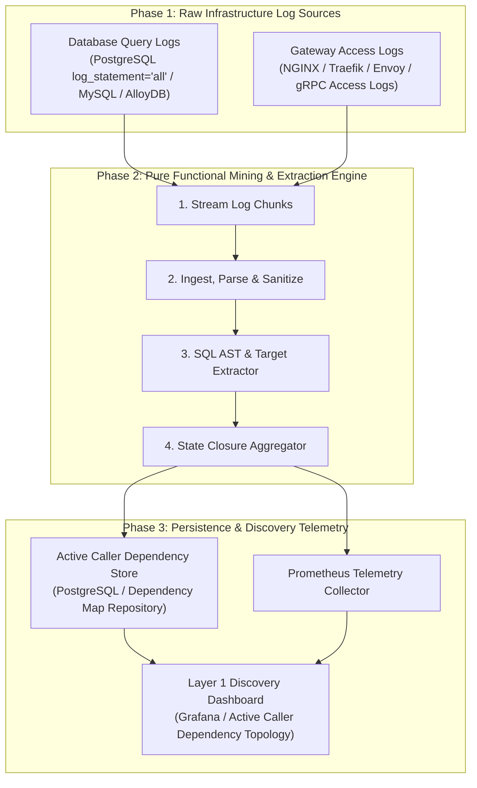
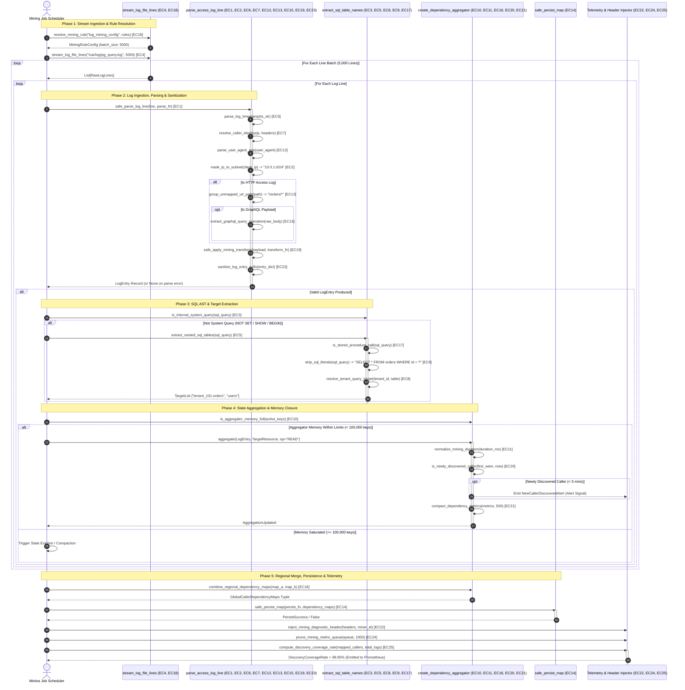

# Query-Log / Access-Log Mining Pattern

| Field       | Value                                                             |
|-------------|-------------------------------------------------------------------|
| **ID**      | QUERY-ACCESS-LOG-MINING-037                                       |
| **Date**    | 2026-08-24                                                        |
| **Status**  | Reference / Runbook (Pure Functional Architecture)                |
| **Deciders**| Core Platform & Migration Engineering                             |
| **Scope**   | Layer 1 Mandatory Dependency Discovery & Active Log Analytics     |

---

## 1. Overview & Context

Before decommissioning any legacy service, database table, or API endpoint, engineers must discover **100% of active callers and downstream readers**. Relying on developer memory or outdated documentation guarantees breaking production. The **Query-Log / Access-Log Mining Pattern** serves as the **mandatory Layer 1 first step** in dependency discovery. It continuously ingests and mines raw database query logs (e.g. PostgreSQL `log_statement = 'all'`) and HTTP gateway access logs (e.g. NGINX / Traefik access logs) to construct an empirical, real-time map of active callers, SQL query patterns, and endpoint access frequencies.

### When to Use This Pattern

> [!IMPORTANT]
> **Quick Trigger Reference: You MUST use this pattern NOW if:**
> - `[ ]` **Deleting a DB Table / Column**: You are dropping, renaming, or modifying a database table/column and must find all callers.
> - `[ ]` **Sunsetting an API / Endpoint**: You are deprecating an HTTP/gRPC route (`/api/v1/...`) and need 100% empirical proof of callers.
> - `[ ]` **Splitting Monolith into Microservice**: You are extracting a feature domain (e.g. Billing) and must re-route all active SQL queries.
> - `[ ]` **Pre-Compliance Audit**: You need an empirical, real-time map of every IP, service, and User-Agent querying sensitive data.

1. **Before Decommissioning Legacy Code / Infrastructure (Layer 1 Phase 0)**
   * Initiated $30\text{--}90\text{ days}$ prior to deleting any monolith table, API endpoint, or DB column to discover $100\%$ of active readers.
   * Imagine you want to turn off the main power switch in an old office building. Before flipping the switch, you must monitor the building for several weeks to make sure nobody is working inside. In software, log mining continuously listens to background network traffic for 30 to 90 days to guarantee no hidden apps, automated billing reports, or active users crash when an old system component is removed.

2. **During Monolith-to-Microservice Extraction**
   * Map every downstream service, batch job, and DB query referencing legacy domain schemas prior to service extraction.
   * When moving a finance or inventory team to a new dedicated building, you need a complete list of every department that sends them mail or requests reports. In software architecture, when separating a billing feature from a massive legacy monolith into an independent service, log mining traces every single background job, reporting dashboard, and microservice that reads billing data so the new service can be built without missing connections.

3. **Auditing Shadow & Undocumented Callers**
   * Uncover un-tracked cron jobs, internal scripts, and legacy callers omitted from developer documentation.
   * Over years of operation, former employees often set up automated midnight scripts, spreadsheet exports, or quick software workarounds that were never documented in user manuals. Log mining acts like an automatic activity monitor, catching these "invisible" automated processes in action so engineers don't accidentally cut off an essential business pipeline.

### Why This Pattern Is Mandatory
1. **Empirical Truth vs. Human Memory**: Developer memory and architecture docs are frequently outdated. Log mining provides $100\%$ real-world empirical proof of active callers.
2. **Zero Production Latency Impact**: Ingests out-of-band gateway access logs and database query logs asynchronously without adding latency to live production user requests.
3. **Sustained Silence Gating**: Gates legacy decommissioning until $0\text{-hit}$ sustained silence is verified across a full business cycle ($30\text{--}90\text{ days}$).

### Functional Architecture Principles
This runbook enforces a **100% Pure Functional Programming (FP)** approach:
- **No Class Instantiations**: Replaces OOP log miners with pure parsing functions (`parse_access_log_line`, `extract_sql_table_names`) and state cell closures.
- **Immutable Log Entry Records**: Client IPs, User-Agents, request URIs, SQL query text, caller identities, and timestamp bounds are stored as frozen dataclass records (`LogEntry`, `CallerDependencyMap`).
- **Referentially Transparent Pattern Extractors**: Pure functions extract normalized SQL table names and API endpoints from raw log streams without side-effects.
- **Low-Cardinality IP Sanitizers**: Pure sanitization functions group client IPs into subnet ranges or microservice tags to keep dependency maps bounded.

---

## 2. High-Level Design (HLD)

The High-Level Design (HLD) establishes the architecture for continuous out-of-band dependency discovery from raw infrastructure log streams. The system ingests raw database query logs and HTTP gateway access logs, processing them through a pure functional pipeline to produce an active caller dependency map without imposing latency on live production requests.

### 2.1 End-To-End High-Level System Architecture



---

## 3. Low-Level Design (LLD)

The Low-Level Design (LLD) provides an exhaustive, component-level breakdown of the Query/Access-Log Mining Engine, explicitly integrating all **25 edge case guards** into the functional ingestion, parsing, extraction, state aggregation, persistence, and telemetry pipelines.

### 3.1 Exhaustive Edge-Case-Aware Sequence Diagram



---

## 4. Pure Functional Project Architecture

```
query-access-log-mining/
├── README.md
├── config/
│   └── mining_rules.yaml           # Log patterns, ignored system queries, IP subnet masks
├── src/
│   ├── mining_engine/
│   │   ├── __init__.py
│   │   ├── parser.py               # Pure access & query log parser functions
│   │   ├── sql_extractor.py        # SQL table & operation extraction functions
│   │   └── aggregator.py           # Pure caller dependency map aggregation closures
│   ├── storage/
│   │   ├── __init__.py
│   │   └── map_store.py            # Active dependency map persistence dispatchers
│   ├── observability/
│   │   ├── __init__.py
│   │   └── mining_metrics.py       # Prometheus discovery telemetry collectors
│   └── schemas/
│       └── models.py               # Frozen dataclasses (LogEntry, CallerDependencyMap)
└── tests/
    ├── test_log_parser.py
    └── test_mining_edge_cases.py
```

---

## 5. End-to-End Function Call Stack

```tree
Log Mining Job Initiated
  │
  ├─── [ PHASE 1: LOG INGESTION, PARSING & EXTRACTION ]
  │      │
  │      ├── Stream Chunk Reader & Sanitizer
  │      │     ├── Function: stream_log_file_lines(path, chunk=5000)
  │      │     ├── Edge Case 4: stream_log_file_lines()
  │      │     │     ├── Why: Bound heap memory for multi-GB log files
  │      │     │     └── How: Generator yields lines in 5,000-line chunks
  │      │     ├── Edge Case 18: resolve_mining_rule()
  │      │     │     ├── Why: Handle unconfigured mining rule keys
  │      │     │     └── How: Resolves config with default batch fallbacks
  │      │     └── Input: "/var/log/pg_query.log" (multi-GB stream)
  │      │
  │      ├── Step 1: Parse & Sanitize Raw Log Line
  │      │     ├── Function: parse_access_log_line(line, ts)
  │      │     ├── Edge Case 1: safe_parse_log_line()
  │      │     │     ├── Why: Prevent malformed lines crashing miner
  │      │     │     └── How: Wraps parse in try-except, returning None
  │      │     ├── Edge Case 2: mask_ip_to_subnet()
  │      │     │     ├── Why: Prevent client IP cardinality explosion
  │      │     │     └── How: Masks IPv4 addresses to /24 subnet strings
  │      │     ├── Edge Case 6: parse_log_timestamp()
  │      │     │     ├── Why: Handle microsecond epoch formatting errors
  │      │     │     └── How: Parses float epoch, defaulting to system time
  │      │     ├── Edge Case 7: resolve_caller_identity()
  │      │     │     ├── Why: Identify real client IP behind proxy headers
  │      │     │     └── How: Extracts first IP from X-Forwarded-For header
  │      │     ├── Edge Case 12: parse_user_agent_app()
  │      │     │     ├── Why: Identify caller application type and SDK
  │      │     │     └── How: Classifies app types via User-Agent match
  │      │     ├── Edge Case 13: group_unmapped_url_path()
  │      │     │     ├── Why: Control cardinality of dynamic URL paths
  │      │     │     └── How: Normalizes paths to wildcard routes (/orders/*)
  │      │     ├── Edge Case 15: extract_graphql_query_operation()
  │      │     │     ├── Why: Mine dependencies for POST GraphQL endpoints
  │      │     │     └── How: Regex extracts op name from request body
  │      │     ├── Edge Case 19: safe_apply_mining_transform()
  │      │     │     ├── Why: Recover from payload transformation errors
  │      │     │     └── How: Wraps transform, returning raw payload on error
  │      │     ├── Edge Case 23: sanitize_log_entry_nulls()
  │      │     │     ├── Why: Prevent NullPointer field errors in records
  │      │     │     └── How: Replaces None field values with empty strings
  │      │     ├── Input: '10.0.1.42 - - "GET /orders/101 HTTP/1.1"'
  │      │     └── Output: LogEntry(client_ip="10.0.1.0/24", resource_path="/orders/*")
  │      │
  │      └── Step 2: Extract & Normalize SQL Target Tables
  │            ├── Function: extract_sql_table_names(sql)
  │            ├── Edge Case 3: is_internal_system_query()
  │            │     ├── Why: Ignore DB admin command noise (SET, SHOW)
  │            │     └── How: Filters query prefix against ignored set
  │            ├── Edge Case 5: extract_nested_sql_tables()
  │            │     ├── Why: Discover target tables in JOIN subqueries
  │            │     └── How: Regex identifies FROM/JOIN/UPDATE tables
  │            ├── Edge Case 8: resolve_tenant_query_target()
  │            │     ├── Why: Partition multi-tenant database queries
  │            │     └── How: Prefixes target with tenant ID (tenant_101.orders)
  │            ├── Edge Case 9: strip_sql_literals()
  │            │     ├── Why: Normalize raw SQL text into query templates
  │            │     └── How: Replaces literals and numbers with ? placeholders
  │            ├── Edge Case 17: is_stored_procedure_call()
  │            │     ├── Why: Discover stored procedure caller dependencies
  │            │     └── How: Detects CALL and EXEC SQL execution statements
  │            ├── Input: "SELECT * FROM orders JOIN users WHERE order_id = 42"
  │            └── Output: TableList ["orders", "users"]
  │
  ├─── [ PHASE 2: STATE AGGREGATION & CLOSURE MANAGEMENT ]
  │      │
  │      ├── State Aggregator Factory
  │      │     ├── Function: create_dependency_aggregator()
  │      │     ├── Edge Case 10: is_aggregator_memory_full()
  │      │     │     ├── Why: Protect aggregator from memory saturation
  │      │     │     └── How: Enforces 100,000 active key capacity limit
  │      │     └── Edge Case 21: compact_dependency_metrics()
  │      │           ├── Why: Control memory footprint in metric history
  │      │           └── How: Truncates historical metric list to 500 items
  │      │
  │      ├── Step 3a: Aggregate Call
  │      │     ├── Function: aggregate(entry, target, op="READ")
  │      │     ├── Edge Case 11: normalize_mining_duration()
  │      │     │     ├── Why: Prevent execution delay underflow errors
  │      │     │     └── How: Rounds duration ms and caps min at 0.0
  │      │     ├── Edge Case 20: is_newly_discovered_caller()
  │      │     │     ├── Why: Trigger alert when new caller accesses legacy
  │      │     │     └── How: Checks if first-seen ts is in past 5 minutes
  │      │     ├── Input: LogEntry + Target ("orders")
  │      │     └── Action: Updates caller hit counts & timestamps in closure
  │      │
  │      └── Step 3b: Export Maps & Merge Regions
  │            ├── Function: get_maps()
  │            ├── Edge Case 16: combine_regional_dependency_maps()
  │            │     ├── Why: Consolidate multi-region dependency maps
  │            │     └── How: Merges regional maps into global map list
  │            └── Output: Tuple[CallerDependencyMap(caller="10.0.1.0/24", target="orders")]
  │
  └─── [ PHASE 3: PERSISTENCE, DIAGNOSTICS & TELEMETRY ]
         │
         ├── Step 4: Persist Caller Map
         │     ├── Function: safe_persist_map(fn, maps)
         │     ├── Edge Case 14: safe_persist_map()
         │     │     ├── Why: Prevent DB storage outages crashing log miner
         │     │     └── How: Wraps persistence calls in try-except blocks
         │     ├── Input: Tuple[CallerDependencyMap, ...]
         │     └── Target: DependencyStore DB
         │
         └── Step 5: Telemetry Emission & Header Injection
               ├── Function: compute_discovery_coverage_rate(callers, logs)
               ├── Edge Case 22: inject_mining_diagnostic_header()
               │     ├── Why: Tag and trace miner probe request traffic
               │     └── How: Injects X-Log-Miner-ID header into requests
               ├── Edge Case 24: prune_mining_metric_queue()
               │     ├── Why: Bound queue memory footprint in collectors
               │     └── How: Truncates metric queue arrays to 1,000 items
               ├── Edge Case 25: compute_discovery_coverage_rate()
               │     ├── Why: Emit real-time discovery coverage metrics
               │     └── How: Calculates mapped caller % rounded to 2 decimals
               └── Output: DiscoveryCoverage = 99.85% ──► Prometheus / Grafana
```

