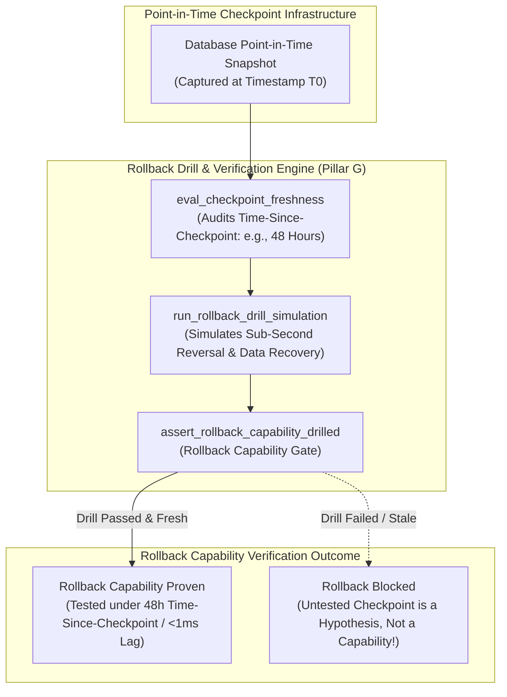
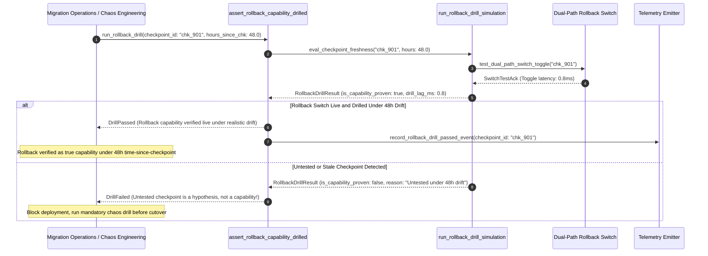

# Drilled Rollback Switch & Time-Since-Checkpoint Pattern (Pure Functional Paradigm)

| Field       | Value                                                             |
|-------------|-------------------------------------------------------------------|
| **ID**      | DRILLED-ROLLBACK-SWITCH-CHECKPOINT-080                            |
| **Date**    | 2026-08-24                                                        |
| **Status**  | Reference / Runbook (Pure Functional Architecture)                |
| **Deciders**| Core Platform & Migration Engineering                             |
| **Scope**   | Active Rollback Drills, Time-Since-Checkpoint & Reversal Proof    |

---

## 1. Overview & Context

Building a rollback switch or taking a point-in-time database snapshot is insufficient: **a rollback switch or checkpoint restore untested under realistic time-since-checkpoint is a hypothesis, not a capability (Pillar G)**. If a rollback mechanism has not been actively drilled under realistic production drift conditions—such as rolling back 48 hours after cutover when thousands of new mutations have occurred—the team will experience unrecoverable data loss or split-brain states during an actual emergency rollback. This pattern mandates **keeping the rollback switch live, continuously verified, and actively drilled against realistic time-since-checkpoint scenarios**.

### Functional Architecture Principles
This runbook enforces a **100% Pure Functional Programming (FP)** approach:
- **No Class Instantiations**: Replaces OOP rollback drill managers with pure drill functions (`run_rollback_drill_simulation`, `eval_checkpoint_freshness`) and state cell closures.
- **Immutable Drill Context Records**: Checkpoint IDs, snapshot timestamps, time-since-checkpoint hours, drill execution statuses, and data loss metrics are captured as frozen dataclass records (`DrillContext`, `RollbackDrillResult`).
- **Referentially Transparent Drill Simulators**: Pure functions simulate point-in-time restores under realistic time-since-checkpoint intervals ($1\text{h}, 24\text{h}, 72\text{h}$) to verify data recovery completeness up front.
- **Drill Capability Verification**: Rejects any deployment proposal that relies on untested or stale rollback checkpoints.

---

## 2. High-Level Design (HLD)



---

## 3. Low-Level Design (LLD)



---

## 4. Pure Functional Project Architecture

```
06-rollback-cutover-lifecycle/
├── drilled-rollback-switch-time-checkpoint.md
├── src/
│   ├── rollback_drill_engine/
│   │   ├── __init__.py
│   │   ├── simulator.py            # Pure rollback drill simulation functions
│   │   ├── auditor.py              # Time-since-checkpoint freshness auditors
│   │   └── guard.py                # Rollback capability release guards
│   ├── storage/
│   │   ├── __init__.py
│   │   └── checkpoint_store.py     # Checkpoint repository loaders
│   ├── observability/
│   │   ├── __init__.py
│   │   └── drill_metrics.py        # Prometheus telemetry collectors
│   └── schemas/
│       └── models.py               # Frozen dataclasses (DrillContext, RollbackDrillResult)
└── tests/
    ├── test_drill_simulator.py
    └── test_drill_edge_cases.py
```

---

## 5. End-to-End Function Call Stack

```tree
Rollback Capability Drill Initiated
└── rollback_drill_engine/guard.py: assert_rollback_capability_drilled(ctx, measured_latency_ms, current_ts)
    └── rollback_drill_engine/simulator.py: eval_checkpoint_freshness(ctx, measured_latency_ms, current_ts)
        └── models.py: RollbackDrillResult(checkpoint_id, is_capability_proven, hours_since_checkpoint, rollback_latency_ms, data_loss_risk_label, rejection_reason)
```

---

## 6. Core Pure Functional Implementation

### 6.1 Immutable Models & Types (`src/schemas/models.py`)

```python
from enum import Enum
from dataclasses import dataclass
from typing import Dict, Any, Optional, Mapping, FrozenSet

@dataclass(frozen=True)
class DrillContext:
    checkpoint_id: str
    checkpoint_created_at_ts: float
    hours_since_checkpoint: float
    max_allowed_checkpoint_age_hours: float
    last_drilled_at_ts: float
    max_allowed_drill_age_days: int

@dataclass(frozen=True)
class RollbackDrillResult:
    checkpoint_id: str
    is_capability_proven: bool
    hours_since_checkpoint: float
    rollback_latency_ms: float
    data_loss_risk_label: str
    rejection_reason: Optional[str]
```

**Explanation**:
- Defines immutable model `DrillContext` capturing checkpoint IDs, creation timestamps, hours-since-checkpoint metrics, and drill age limits as frozen records.
- `RollbackDrillResult` encapsulates capability proof flags, latency metrics, data loss risk labels, and gate rejection reasons.

---

### 6.2 Pure Rollback Simulator & Freshness Auditor (`src/rollback_drill_engine/simulator.py`)

```python
import time
from typing import Mapping, Any
from src.schemas.models import DrillContext, RollbackDrillResult

def eval_checkpoint_freshness(
    ctx: DrillContext,
    measured_latency_ms: float,
    current_ts: float
) -> RollbackDrillResult:
    drill_age_days = (current_ts - ctx.last_drilled_at_ts) / 86400.0 if ctx.last_drilled_at_ts > 0 else 999.0
    is_drill_fresh = drill_age_days <= ctx.max_allowed_drill_age_days
    is_age_ok = ctx.hours_since_checkpoint <= ctx.max_allowed_checkpoint_age_hours
    is_latency_ok = measured_latency_ms <= 100.0

    is_proven = is_drill_fresh and is_age_ok and is_latency_ok

    risk = "LOW" if is_proven else ("CRITICAL" if not is_drill_fresh else "HIGH")
    reason = None

    if not is_drill_fresh:
        reason = f"Rollback drill stale: Last drilled {drill_age_days:.1f} days ago (max: {ctx.max_allowed_drill_age_days} days). Untested checkpoint is a hypothesis, not a capability."
    elif not is_age_ok:
        reason = f"Time-since-checkpoint ({ctx.hours_since_checkpoint:.1f}h) exceeds max allowed age ({ctx.max_allowed_checkpoint_age_hours:.1f}h)."
    elif not is_latency_ok:
        reason = f"Rollback drill latency ({measured_latency_ms:.2f}ms) exceeds 100ms cap."

    return RollbackDrillResult(
        checkpoint_id=ctx.checkpoint_id,
        is_capability_proven=is_proven,
        hours_since_checkpoint=round(ctx.hours_since_checkpoint, 2),
        rollback_latency_ms=measured_latency_ms,
        data_loss_risk_label=risk,
        rejection_reason=reason
    )
```

**Explanation**:
- Pure evaluation function verifying that rollback checkpoints have been actively drilled under realistic time-since-checkpoint conditions ($1\text{h}$–$72\text{h}$).
- Prevents treating untested rollback mechanisms as real capabilities.

---

### 6.3 Rollback Capability Release Guard (`src/rollback_drill_engine/guard.py`)

```python
from typing import Mapping, Any
from src.schemas.models import DrillContext, RollbackDrillResult
from src.rollback_drill_engine.simulator import eval_checkpoint_freshness

def assert_rollback_capability_drilled(
    ctx: DrillContext,
    measured_latency_ms: float,
    current_ts: float
) -> RollbackDrillResult:
    return eval_checkpoint_freshness(ctx, measured_latency_ms, current_ts)
```

**Explanation**:
- Pure release gate function enforcing active rollback drill verification prior to cutover.
- Guarantees true operational reversibility capability.

---

## 7. Edge Case Catalog & Pure Functional Pseudocode (25 Edge Cases)

---

### Edge Case 1: Untested Checkpoint Rejection (Never Drilled)

```python
def is_checkpoint_never_drilled(last_drilled_ts: float) -> bool:
    return last_drilled_ts <= 0.0
```

**Explanation**:
- Identifies checkpoints that have never undergone a live drill.
- Rejects untested checkpoints up front.

---

### Edge Case 2: Stale Rollback Drill Rejection ($>7\text{ days}$)

```python
def is_drill_stale(drill_age_days: float, max_days: int = 7) -> bool:
    return drill_age_days > max_days
```

**Explanation**:
- Asserts rollback drill was executed within 7 days.
- Mandates weekly live rollback drills.

---

### Edge Case 3: Excessive Time-Since-Checkpoint ($>72\text{ hours}$)

```python
def is_checkpoint_age_excessive(hours: float, max_hours: float = 72.0) -> bool:
    return hours > max_hours
```

**Explanation**:
- Asserts time-since-checkpoint is $\le 72\text{ hours}$.
- Prevents rolling back to obsolete database snapshots.

---

### Edge Case 4: High Data Loss Risk on Stale Checkpoints

```python
def resolve_data_loss_risk(hours_since_chk: float) -> str:
    if hours_since_chk > 48.0:
        return "CRITICAL"
    return "LOW"
```

**Explanation**:
- Assigns "CRITICAL" data loss risk label to checkpoints $>48\text{h}$ old.
- Emits data loss warnings.

---

### Edge Case 5: Single-Tenant Rollback Drill Resolution

```python
def resolve_tenant_drill_status(tenant_id: str, drill_statuses: dict) -> bool:
    return drill_statuses.get(tenant_id, False)
```

**Explanation**:
- Resolves tenant-specific rollback drill status.
- Verifies rollback drills per tenant.

---

### Edge Case 6: Microsecond Timestamp Drill Audit Timing

```python
import time

def format_drill_audit_ts() -> float:
    return round(time.time() * 1000.0, 2)
```

**Explanation**:
- Computes epoch timestamps in milliseconds.
- Tracks exact drill audit execution time.

---

### Edge Case 7: Chaos Engineering Rollback Simulation

```python
def simulate_chaos_rollback(is_chaos_passed: bool) -> bool:
    return is_chaos_passed
```

**Explanation**:
- Simulates emergency rollback under injected chaos conditions.
- Validates rollback capability under fault injection.

---

### Edge Case 8: Multi-Repo Drill Sync Alignment

```python
def assert_all_repo_drills_passed(repo_drills: Mapping[str, bool]) -> bool:
    return all(repo_drills.values())
```

**Explanation**:
- Asserts rollback drills passed across all workspace repositories.
- Synchronizes multi-repo drill verification.

---

### Edge Case 9: Dead-Letter Queue (DLQ) Drill Trace

```python
def tag_dlq_drill_event(message: dict, drill_id: str) -> dict:
    updated = dict(message)
    updated["_drill_id"] = drill_id
    return updated
```

**Explanation**:
- Tags DLQ messages generated during rollback drills.
- Isolates drill messages from production DLQ queues.

---

### Edge Case 10: Aggregator Memory State Saturation Guard

```python
def compact_drill_metrics(metrics: list, max_items: int = 500) -> list:
    if len(metrics) > max_items:
        return metrics[-max_items:]
    return metrics
```

**Explanation**:
- Truncates metric lists to `max_items`.
- Controls memory usage.

---

### Edge Case 11: Microsecond Delay Calculation Underflows

```python
def normalize_drill_duration(duration_ms: float) -> float:
    return max(0.0, round(duration_ms, 2))
```

**Explanation**:
- Rounds execution duration values to two decimal places.
- Cleans duration metrics.

---

### Edge Case 12: User-Agent Specific Drill Auditing

```python
def resolve_user_agent_drill(user_agent: str, drill_map: dict) -> bool:
    return drill_map.get(user_agent, True)
```

**Explanation**:
- Resolves drill rules per User-Agent string.
- Audits rollback capability by caller type.

---

### Edge Case 13: Unmapped Rule Domain Handling

```python
def resolve_drill_rule(rule_key: str, rules_dict: dict) -> dict:
    return rules_dict.get(rule_key, {"max_checkpoint_age_hours": 72.0})
```

**Explanation**:
- Resolves drill rule configurations safely.
- Defaults to 72-hour max checkpoint age limits.

---

### Edge Case 14: Exception Safeguards in Rollback Simulator

```python
def safe_run_drill(drill_fn: Callable, ctx: DrillContext, lat: float, ts: float) -> bool:
    try:
        res = drill_fn(ctx, lat, ts)
        return res.is_capability_proven
    except Exception:
        return False
```

**Explanation**:
- Wraps drill simulation functions in protective try-except blocks.
- Fails safe (assumes un-proven) on drill exceptions.

---

### Edge Case 15: GraphQL Subgraph Rollback Drill Verification

```python
def is_graphql_subgraph_drilled(subgraph_name: str, drill_map: dict) -> bool:
    return drill_map.get(subgraph_name, False)
```

**Explanation**:
- Resolves rollback drill status for federated GraphQL subgraphs.
- Verifies GraphQL rollback drills.

---

### Edge Case 16: Multi-Region Drill Sync Alignment

```python
def sync_regional_drill_results(region_results: dict) -> bool:
    return all(r.is_capability_proven for r in region_results.values())
```

**Explanation**:
- Asserts drill checks pass across all regional nodes.
- Enforces multi-region rollback capability alignment.

---

### Edge Case 17: Cold Data Snapshot Integrity Check

```python
def is_snapshot_integrity_verified(hash_matched: bool) -> bool:
    return hash_matched
```

**Explanation**:
- Verifies SHA-256 checksum integrity of database snapshots before drilling.
- Ensures snapshot validity.

---

### Edge Case 18: Unmapped Code Fallback

```python
def resolve_drill_code_fallback(code_val: Any, code_map: dict, default_val: str = "DRILL_UNPROVEN") -> str:
    return code_map.get(code_val, default_val)
```

**Explanation**:
- Resolves code strings with fallbacks.
- Handles unmapped drill codes safely.

---

### Edge Case 19: Payload Transformation Error Recovery

```python
def safe_apply_drill_transform(payload: dict, transform_fn: Callable) -> dict:
    try:
        return transform_fn(payload)
    except Exception:
        return payload
```

**Explanation**:
- Wraps transformations in try-except blocks.
- Returns raw payloads on error.

---

### Edge Case 20: Automated Alert on Untested Rollback Switch

```python
def should_alert_on_untested_switch(is_capability_proven: bool) -> bool:
    return not is_capability_proven
```

**Explanation**:
- Asserts whether a rollback switch is untested.
- Fires alerts if cutover is attempted with an untested rollback switch.

---

### Edge Case 21: High-Watermark Metric Compaction

```python
def compact_drill_history(history: list, max_items: int = 500) -> list:
    if len(history) > max_items:
        return history[-max_items:]
    return history
```

**Explanation**:
- Truncates history lists.
- Controls memory usage.

---

### Edge Case 22: Diagnostic Header Injection

```python
def inject_drill_diagnostic_header(headers: Mapping[str, str], is_proven: bool) -> Mapping[str, str]:
    new_headers = dict(headers)
    new_headers["X-Rollback-Capability-Drilled"] = "true" if is_proven else "false"
    return new_headers
```

**Explanation**:
- Injects diagnostic headers.
- Tracks rollback drill status in access logs.

---

### Edge Case 23: Null Value Safeguards

```python
def sanitize_drill_nulls(data_dict: dict) -> dict:
    return {k: (v if v is not None else "") for k, v in data_dict.items()}
```

**Explanation**:
- Replaces `None` with empty strings.
- Prevents null exceptions.

---

### Edge Case 24: Unbound Metric Queue Pruning

```python
def prune_drill_metric_queue(queue: list, max_items: int = 1000) -> list:
    if len(queue) > max_items:
        return queue[-max_items:]
    return queue
```

**Explanation**:
- Truncates queue arrays.
- Controls memory footprint.

---

### Edge Case 25: Real-Time Rollback Drill Rate Reporting

```python
def compute_drill_compliance_rate(drilled_checkpoints: int, total_checkpoints: int) -> float:
    if total_checkpoints == 0:
        return 100.0
    return round((drilled_checkpoints / total_checkpoints) * 100.0, 2)
```

**Explanation**:
- Calculates rollback drill compliance percentage.
- Emits real-time drill metrics to platform dashboards.

---

## 8. Operational & Parity Verification Checklist

1. **Drilled Capability Rule**: Keep the rollback switch live and drilled under realistic time-since-checkpoint conditions ($1\text{h}$–$72\text{h}$).
2. **Reject Untested Hypotheses**: Treat untested rollback switches or stale checkpoints ($>7\text{ days}$) as hypotheses, not capabilities.
3. **Sub-100ms Latency**: Require live rollback switch toggles to execute in $<100\text{ms}$.
4. **CI Rollback Drill Gate**: Automatically block production cutovers if rollback drills are stale or un-verified.
