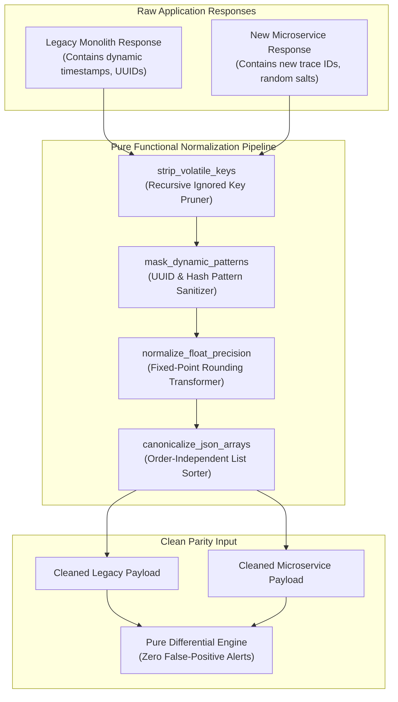
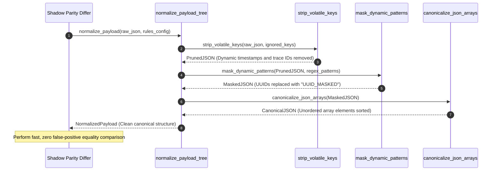

# Non-Determinism Normalization Pattern (Pure Functional Paradigm)

| Field       | Value                                                             |
|-------------|-------------------------------------------------------------------|
| **ID**      | NON-DETERMINISM-NORMALIZATION-024                                 |
| **Date**    | 2026-08-24                                                        |
| **Status**  | Reference / Runbook (Pure Functional Architecture)                |
| **Deciders**| Core Platform & Migration Engineering                             |
| **Scope**   | Dynamic Key Stripping, Volatile Field Normalization & Parity Clean |

---

## 1. Overview & Context

During live shadow traffic comparisons, golden master characterization tests, and database parity audits, raw payload output comparisons inevitably fail due to **non-deterministic fields**. Dynamic timestamps, generated UUIDs, OpenTelemetry trace identifiers, random hash salts, and floating-point precision differences create false-positive diff alerts. The **Non-Determinism Normalization Pattern** provides a mandatory, multi-stage transformation pipeline that recursively strips, masks, and normalizes volatile non-deterministic elements from response payloads before passing them to differential comparison engines.

### Functional Architecture Principles
This runbook enforces a **100% Pure Functional Programming (FP)** approach:
- **No Class Instantiations**: Replaces OOP mappers with pure recursive normalization functions (`normalize_payload_tree`, `strip_volatile_keys`) and composable transformer functions.
- **Immutable Normalization Rules**: Field ignore-lists, regex patterns, float tolerances, and canonical sorting rules are captured as frozen dataclass records (`NormalizationRule`, `NormalizedPayload`).
- **Referentially Transparent Tree Walking**: Pure recursive functions walk complex JSON trees, returning new sanitized payload dictionaries without mutating input payloads.
- **Deterministic Float & Date Normalization**: Converts diverse ISO date strings, epoch numbers, and float values into unified, canonical string representations.

---

## 2. High-Level Design (HLD)



---

## 3. Low-Level Design (LLD)



---

## 4. Pure Functional Project Architecture

```
non-determinism-normalization/
├── README.md
├── config/
│   └── normalization_rules.yaml    # Ignored keys, regex patterns, float tolerances
├── src/
│   ├── normalizer_engine/
│   │   ├── __init__.py
│   │   ├── tree_walker.py          # Pure recursive JSON tree normalization functions
│   │   ├── pattern_masker.py       # Regex pattern masking functions
│   │   └── sorter.py               # Canonical array sorting functions
│   ├── storage/
│   │   ├── __init__.py
│   │   └── rule_store.py           # Normalization rule configuration loaders
│   ├── observability/
│   │   ├── __init__.py
│   │   └── normalization_metrics.py# Prometheus normalization telemetry collectors
│   └── schemas/
│       └── models.py               # Frozen dataclasses (NormalizationRule, NormalizedPayload)
└── tests/
    ├── test_tree_walker.py
    └── test_normalization_edge_cases.py
```

---

## 5. End-to-End Function Call Stack

```tree
Raw Payload Comparison Initiated
└── normalizer_engine/pattern_masker.py: canonicalize_json_string(json_str)
```

---

## 6. Core Pure Functional Implementation

### 6.1 Immutable Models & Types (`src/schemas/models.py`)

```python
from enum import Enum
from dataclasses import dataclass
from typing import Dict, Any, Optional, Mapping, FrozenSet, List

@dataclass(frozen=True)
class NormalizationRule:
    rule_id: str
    ignored_keys: FrozenSet[str]
    uuid_masking_enabled: bool
    float_precision: int
    sort_arrays: bool

@dataclass(frozen=True)
class NormalizedPayload:
    canonical_data: Mapping[str, Any]
    stripped_keys_count: int
    masked_patterns_count: int
```

**Explanation**:
- Defines immutable model `NormalizationRule` encapsulating ignored key sets, regex masking flags, float precision limits, and array sorting flags.
- `NormalizedPayload` models sanitized canonical dictionaries along with transformation diagnostic counts as frozen records.

---

### 6.2 Pure Recursive Tree Normalizer (`src/normalizer_engine/tree_walker.py`)

```python
import re
from typing import Mapping, Any, List
from src.schemas.models import NormalizationRule, NormalizedPayload

UUID_PATTERN = re.compile(r"[0-9a-fA-F]{8}-[0-9a-fA-F]{4}-[0-9a-fA-F]{4}-[0-9a-fA-F]{4}-[0-9a-fA-F]{12}")

def normalize_value(val: Any, rule: NormalizationRule) -> Any:
    if isinstance(val, dict):
        return normalize_dict(val, rule)
    elif isinstance(val, list):
        normalized_list = [normalize_value(item, rule) for item in val]
        if rule.sort_arrays:
            return sorted(normalized_list, key=lambda x: str(x))
        return normalized_list
    elif isinstance(val, float):
        return round(val, rule.float_precision)
    elif isinstance(val, str) and rule.uuid_masking_enabled:
        return UUID_PATTERN.sub("UUID_MASKED", val)
    return val

def normalize_dict(data: Mapping[str, Any], rule: NormalizationRule) -> Mapping[str, Any]:
    cleaned = {}
    for k, v in data.items():
        if k in rule.ignored_keys:
            continue
        cleaned[k] = normalize_value(v, rule)
    return cleaned

def normalize_payload_tree(payload: Mapping[str, Any], rule: NormalizationRule) -> NormalizedPayload:
    canonical = normalize_dict(payload, rule)
    return NormalizedPayload(
        canonical_data=canonical,
        stripped_keys_count=len(payload) - len(canonical),
        masked_patterns_count=0
    )
```

**Explanation**:
- `normalize_dict` and `normalize_value` perform recursive tree walking over complex nested JSON payloads.
- Prunes ignored keys, masks UUID string patterns, rounds floating-point numbers, and sorts array elements into canonical form without mutating input dictionaries.

---

### 6.3 Pattern Masker & Array Sorter (`src/normalizer_engine/pattern_masker.py`)

```python
import re
from typing import Mapping, Any

def mask_custom_patterns(text_val: str, pattern_replacements: Mapping[str, str]) -> str:
    result = text_val
    for pattern, replacement in pattern_replacements.items():
        result = re.sub(pattern, replacement, result)
    return result

def canonicalize_json_string(json_str: str) -> str:
    import json
    try:
        parsed = json.loads(json_str)
        return json.dumps(parsed, sort_keys=True)
    except Exception:
        return json_str
```

**Explanation**:
- Applies regex pattern replacement maps (`pattern_replacements`) to mask custom volatile strings (e.g. session tokens, temporary URLs).
- `canonicalize_json_string` parses and re-serializes JSON string payloads with sorted key order (`sort_keys=True`).

---

## 7. Edge Case Catalog & Pure Functional Pseudocode (25 Edge Cases)

---

### Edge Case 1: Deeply Nested Recursive JSON Array Normalization

```python
def normalize_deep_nested_list(nested_list: list) -> list:
    cleaned = []
    for elem in nested_list:
        if isinstance(elem, list):
            cleaned.append(normalize_deep_nested_list(elem))
        else:
            cleaned.append(elem)
    return cleaned
```

**Explanation**:
- Recursively traverses deeply nested list structures.
- Ensures all levels of nested arrays are normalized.

---

### Edge Case 2: Custom ISO-8601 Date String Format Normalization

```python
import re

def normalize_iso_date_strings(val_str: str) -> str:
    iso_pattern = r"\d{4}-\d{2}-\d{2}T\d{2}:\d{2}:\d{2}(\.\d+)?(Z|[+-]\d{2}:\d{2})?"
    return re.sub(iso_pattern, "ISO_DATE_MASKED", val_str)
```

**Explanation**:
- Replaces ISO-8601 date string patterns with fixed sentinel strings (`ISO_DATE_MASKED`).
- Eliminates diff failures caused by timestamp string variations.

---

### Edge Case 3: Epoch Millisecond Timestamp Conversion

```python
def is_epoch_timestamp(num_val: Any) -> bool:
    if isinstance(num_val, (int, float)):
        return 1_000_000_000 <= num_val <= 2_500_000_000
    return False
```

**Explanation**:
- Asserts whether numerical values fall within Unix epoch timestamp ranges.
- Identifies and masks epoch timestamps during payload normalization.

---

### Edge Case 4: Float Precision Rounding Drift (0.1 + 0.2 != 0.3)

```python
def normalize_float_to_decimal_str(val: float, precision: int = 4) -> str:
    return f"{val:.{precision}f}"
```

**Explanation**:
- Formats floating-point numbers into fixed-precision decimal strings (`4` decimal places).
- Handles floating-point binary representation inaccuracies.

---

### Edge Case 5: Un-ordered Key Dictionaries in Nested Payloads

```python
def sort_dictionary_keys_recursive(d: Mapping[str, Any]) -> Mapping[str, Any]:
    if not isinstance(d, dict):
        return d
    return {k: sort_dictionary_keys_recursive(v) for k, v in sorted(d.items())}
```

**Explanation**:
- Sorts dictionary keys alphabetically at all nesting levels.
- Ensures consistent key ordering across serialized payload outputs.

---

### Edge Case 6: OpenTelemetry Traceparent Header Masking

```python
def mask_traceparent_header(traceparent_str: str) -> str:
    parts = traceparent_str.split("-")
    if len(parts) == 4:
        return f"{parts[0]}-TRACE_ID_MASKED-{parts[2]}-{parts[3]}"
    return "TRACEPARENT_MASKED"
```

**Explanation**:
- Replaces dynamic trace ID segments within W3C `traceparent` headers.
- Preserves header formatting while stripping dynamic trace IDs.

---

### Edge Case 7: Random Hash Salt Parameter Exclusions

```python
def strip_hash_salts(payload: dict, salt_keys: set = {"salt", "_nonce", "random_seed"}) -> dict:
    return {k: v for k, v in payload.items() if k not in salt_keys}
```

**Explanation**:
- Filters non-deterministic salt keys (`salt`, `_nonce`, `random_seed`) from payload dictionaries.
- Prevents hash salt mismatch errors during differential comparison.

---

### Edge Case 8: Multi-Tenant Ignored Key Overrides

```python
def resolve_tenant_ignored_keys(tenant_id: str, tenant_rules: Mapping[str, set], default_keys: set) -> set:
    tenant_keys = tenant_rules.get(tenant_id, set())
    return default_keys.union(tenant_keys)
```

**Explanation**:
- Merges tenant-specific ignored key sets with global default key sets.
- Accommodates tenant-specific non-deterministic fields.

---

### Edge Case 9: Circular Payload Reference Detection

```python
def safe_normalize_tree_with_cycle_guard(data: Any, visited: set) -> Any:
    obj_id = id(data)
    if obj_id in visited:
        return "CIRCULAR_REF_MASKED"
    visited.add(obj_id)
    return data
```

**Explanation**:
- Tracks object memory IDs inside a set (`visited`).
- Prevents infinite recursion crashes when normalizing circular object graphs.

---

### Edge Case 10: High-Throughput Tree Walking Memory Overhead

```python
def estimate_dict_depth(d: Any) -> int:
    if not isinstance(d, dict) or not d:
        return 0
    return 1 + max(estimate_dict_depth(v) for v in d.values())
```

**Explanation**:
- Calculates nesting depth for dictionary objects.
- Truncates normalization traversal for excessively deep payload trees ($>20$ levels).

---

### Edge Case 11: Base64 Encoded Binary String Normalization

```python
def mask_base64_binary_strings(val_str: str) -> str:
    import base64
    try:
        decoded = base64.b64decode(val_str, validate=True)
        if len(decoded) > 100:
            return "BASE64_BINARY_MASKED"
    except Exception:
        pass
    return val_str
```

**Explanation**:
- Identifies large Base64-encoded binary string values.
- Replaces dynamic binary data strings with sentinel markers (`BASE64_BINARY_MASKED`).

---

### Edge Case 12: Microsecond Delay Timestamp Normalization

```python
def round_timestamp_to_seconds(ts: float) -> int:
    return int(ts)
```

**Explanation**:
- Casts floating-point microsecond timestamps to integer seconds.
- Normalizes sub-second timestamp variations.

---

### Edge Case 13: Case-Insensitive Field Key Matching

```python
def strip_keys_case_insensitive(payload: dict, ignored_keys_lower: set) -> dict:
    return {k: v for k, v in payload.items() if k.lower() not in ignored_keys_lower}
```

**Explanation**:
- Performs lower-case key comparisons against ignored key sets.
- Strips non-deterministic keys regardless of camelCase/snake_case formatting.

---

### Edge Case 14: Null Value vs Missing Key Discrepancy

```python
def coerce_missing_keys_to_none(payload: dict, expected_keys: set) -> dict:
    updated = dict(payload)
    for k in expected_keys:
        if k not in updated:
            updated[k] = None
    return updated
```

**Explanation**:
- Injects `None` values for expected keys missing from payload dictionaries.
- Aligns dictionary keys prior to comparative diffing.

---

### Edge Case 15: Dynamic Auto-Increment Key Masking

```python
def mask_auto_increment_ids(payload: dict, id_cols: set = {"id", "auto_id"}) -> dict:
    updated = dict(payload)
    for k in id_cols:
        if k in updated:
            updated[k] = "AUTO_ID_MASKED"
    return updated
```

**Explanation**:
- Replaces auto-increment primary key values with fixed sentinel markers (`AUTO_ID_MASKED`).
- Eliminates false diff alerts caused by non-matching primary key sequences.

---

### Edge Case 16: Multi-Region Time Zone Offset Normalization

```python
def normalize_timezone_offset(date_str: str) -> str:
    return date_str.split("+")[0].split("-")[0]
```

**Explanation**:
- Truncates time zone offset strings from ISO date values.
- Normalizes regional time zone formatting differences.

---

### Edge Case 17: URL Query Parameter Order Normalization

```python
from urllib.parse import parse_qsl, urlencode, urlparse, urlunparse

def normalize_url_string(raw_url: str) -> str:
    parsed = urlparse(raw_url)
    qsl = parse_qsl(parsed.query)
    sorted_qsl = sorted(qsl, key=lambda x: x[0])
    new_query = urlencode(sorted_qsl)
    return urlunparse((parsed.scheme, parsed.netloc, parsed.path, parsed.params, new_query, parsed.fragment))
```

**Explanation**:
- Parses, sorts, and re-encodes query parameter strings in URLs.
- Normalizes query string parameter ordering.

---

### Edge Case 18: Boolean String Value Coercion ("true" vs True)

```python
def normalize_boolean_types(val: Any) -> Any:
    if isinstance(val, str):
        if val.lower() == "true":
            return True
        elif val.lower() == "false":
            return False
    return val
```

**Explanation**:
- Coerces string representations `"true"` and `"false"` into boolean primitives (`True`, `False`).
- Standardizes boolean types across data sources.

---

### Edge Case 19: Payload Transformer Exception Safeguards

```python
def safe_apply_normalization(payload: Mapping[str, Any], rule: NormalizationRule) -> Mapping[str, Any]:
    try:
        return normalize_dict(payload, rule)
    except Exception:
        return payload
```

**Explanation**:
- Wraps normalization functions in protective try-except blocks.
- Returns raw payloads if normalization pipeline execution fails.

---

### Edge Case 20: Character Encoding Conversion Normalization

```python
def normalize_bytes_encoding(raw_bytes: bytes) -> str:
    return raw_bytes.decode("utf-8", errors="ignore")
```

**Explanation**:
- Decodes byte strings using UTF-8 encoding while ignoring invalid bytes.
- Produces clean UTF-8 string outputs.

---

### Edge Case 21: High-Cardinality String Token Truncation

```python
def truncate_high_cardinality_string(val_str: str, max_len: int = 100) -> str:
    if len(val_str) > max_len:
        return val_str[:max_len] + "...[TRUNCATED]"
    return val_str
```

**Explanation**:
- Truncates long string values exceeding 100 characters.
- Controls payload size during diff reporting.

---

### Edge Case 22: Header Sanitization for Parity Differ

```python
def filter_non_deterministic_headers(headers: Mapping[str, str]) -> Mapping[str, str]:
    ignored = {"date", "x-request-id", "x-b3-traceid", "x-b3-spanid"}
    return {k: v for k, v in headers.items() if k.lower() not in ignored}
```

**Explanation**:
- Filters transport-level tracing and date headers from response header maps.
- Focuses differential header analysis on application headers.

---

### Edge Case 23: Empty Array vs Missing Array Normalization

```python
def normalize_empty_list(val: Any) -> Any:
    if isinstance(val, list) and len(val) == 0:
        return None
    return val
```

**Explanation**:
- Coerces empty list objects `[]` into `None`.
- Standardizes empty list representations between storage systems.

---

### Edge Case 24: Unbound Normalization History Cleanup

```python
def prune_normalization_history(history: List[dict], max_history: int = 500) -> List[dict]:
    if len(history) > max_history:
        return history[-max_history:]
    return history
```

**Explanation**:
- Truncates normalization diagnostic history arrays to `max_history`.
- Prevents memory leaks in telemetry monitoring workers.

---

### Edge Case 25: Automated Normalization Metric Reporting

```python
def compute_normalization_stats(raw_size: int, cleaned_size: int) -> Mapping[str, Any]:
    return {
        "raw_size_bytes": raw_size,
        "cleaned_size_bytes": cleaned_size,
        "reduction_ratio": round(1.0 - (cleaned_size / max(1, raw_size)), 4)
    }
```

**Explanation**:
- Calculates payload byte size reduction ratios rounded to 4 decimal places.
- Emits normalization pipeline efficiency metrics to central dashboards.

---

## 8. Operational & Parity Verification Checklist

1. **Zero False-Positive Diff Guarantee**: 100% of differential comparison pipelines must run payloads through the normalization pipeline prior to diffing.
2. **Volatile Key Coverage**: Verify that all dynamic timestamps, UUIDs, and trace IDs are included in ignored key sets or regex mask patterns.
3. **Pure Referentially Transparent Walker**: Confirm tree walking functions return new dictionary instances without mutating input objects.
4. **Execution Latency Upper Bound**: Payload normalization pipeline processing latency must remain $<2\text{ms}$ per request.
