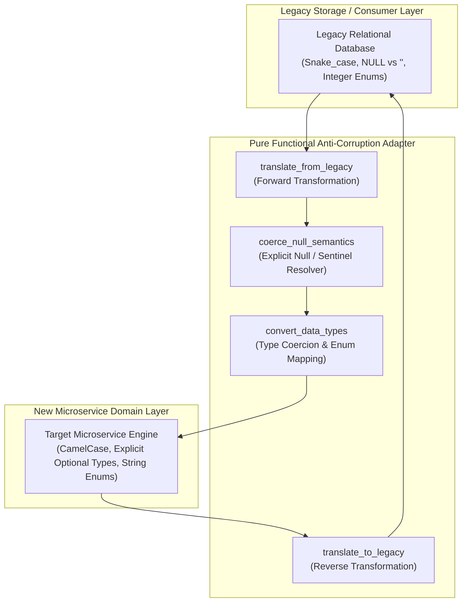
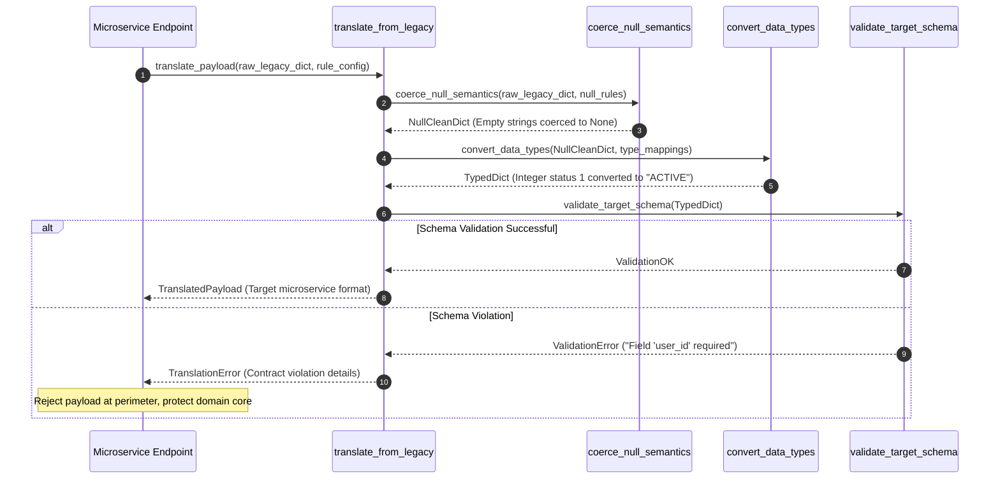

# Schema Translation Adapter Pattern (Pure Functional Paradigm)

| Field       | Value                                                             |
|-------------|-------------------------------------------------------------------|
| **ID**      | SCHEMA-TRANSLATION-ADAPTER-029                                    |
| **Date**    | 2026-08-24                                                        |
| **Status**  | Reference / Runbook (Pure Functional Architecture)                |
| **Deciders**| Core Platform & Migration Engineering                             |
| **Scope**   | Centrally Maintained Anti-Corruption Layer & Null Semantics Mapping|

---

## 1. Overview & Context

During legacy monolith migrations, target microservices rarely share identical field names, data types, or null semantics with legacy relational databases (e.g., PostgreSQL `NULL` vs DynamoDB missing key vs MySQL empty string `""`). Scattering ad-hoc type conversion logic across multiple feature services introduces contract fragility and subtle bugs. The **Schema Translation Adapter Pattern** establishes a **centrally maintained Anti-Corruption Layer (ACL)** that explicitly converts data types, normalizes null/empty semantics, maps legacy enum codes, and translates nested structures via pure, bi-directional transformation functions (`translate_from_legacy`, `translate_to_legacy`).

### Functional Architecture Principles
This runbook enforces a **100% Pure Functional Programming (FP)** approach:
- **No Class Instantiations**: Replaces OOP converter classes with pure transformation functions (`translate_entity`, `coerce_null_semantics`) and functional mapping dictionaries.
- **Immutable Mapping Context**: Field translation matrices, type conversion rules, enum dictionaries, and validation schemas are captured as frozen dataclass records (`SchemaTranslationRule`, `TranslatedPayload`).
- **Referentially Transparent Mappers**: Pure transformation functions map `(LegacyPayload, MappingRule) -> NewPayload` without mutating source payload dictionaries.
- **Bi-Directional Schema Parity**: Provides symmetrical forward (`from_legacy`) and reverse (`to_legacy`) translation functions to support dual-writing and write-back bridges.

---

## 2. High-Level Design (HLD)



---

## 3. Low-Level Design (LLD)



---

## 4. Pure Functional Project Architecture

```
schema-translation-adapter/
├── README.md
├── config/
│   └── translation_mappings.yaml   # Bi-directional field mappings, enum dictionaries
├── src/
│   ├── adapter_engine/
│   │   ├── __init__.py
│   │   ├── forward_mapper.py       # Pure legacy-to-new translation functions
│   │   ├── reverse_mapper.py       # Pure new-to-legacy translation functions
│   │   ├── null_resolver.py        # Explicit null & empty string coercers
│   │   └── type_converter.py       # Type coercion & enum code mapping
│   ├── storage/
│   │   ├── __init__.py
│   │   └── mapping_store.py        # Mapping configuration loaders
│   ├── observability/
│   │   ├── __init__.py
│   │   └── adapter_metrics.py      # Prometheus translation telemetry collectors
│   └── schemas/
│       └── models.py               # Frozen dataclasses (SchemaTranslationRule, TranslatedPayload)
└── tests/
    ├── test_forward_mapper.py
    └── test_adapter_edge_cases.py
```

---

## 5. End-to-End Function Call Stack

```tree
Data Payload Received at Perimeter
└── adapter_engine/forward_mapper.py: translate_from_legacy(raw_payload, Any], rule)
    ├── adapter_engine/null_resolver.py: coerce_null_semantics(data, Any], null_sentinels, "NULL", "N/A", "undefined"})
    ├── adapter_engine/null_resolver.py: map_enum_value(val, enum_map, Any], default_val)
    └── models.py: TranslatedPayload(entity_name, translated_data, translation_duration_ms, is_valid, error_message)
```

---

## 6. Core Pure Functional Implementation

### 6.1 Immutable Models & Types (`src/schemas/models.py`)

```python
from enum import Enum
from dataclasses import dataclass
from typing import Dict, Any, Optional, Mapping, FrozenSet

@dataclass(frozen=True)
class SchemaTranslationRule:
    entity_name: str
    field_mappings: Mapping[str, str]
    enum_mappings: Mapping[str, Mapping[Any, Any]]
    null_sentinels: FrozenSet[str]

@dataclass(frozen=True)
class TranslatedPayload:
    entity_name: str
    translated_data: Mapping[str, Any]
    translation_duration_ms: float
    is_valid: bool
    error_message: Optional[str]
```

**Explanation**:
- Defines immutable model `SchemaTranslationRule` capturing field mappings, enum dictionaries, and null sentinel sets as frozen records.
- `TranslatedPayload` encapsulates converted target dictionaries, execution timing, and validation flags.

---

### 6.2 Pure Null Coercer & Type Converter (`src/adapter_engine/null_resolver.py`)

```python
from typing import Mapping, Any, FrozenSet
from src.schemas.models import SchemaTranslationRule

def coerce_null_semantics(data: Mapping[str, Any], null_sentinels: FrozenSet[str] = frozenset({"", "NULL", "N/A", "undefined"})) -> Mapping[str, Any]:
    cleaned = {}
    for k, v in data.items():
        if v is None or (isinstance(v, str) and v.strip() in null_sentinels):
            cleaned[k] = None
        else:
            cleaned[k] = v
    return cleaned

def map_enum_value(val: Any, enum_map: Mapping[Any, Any], default_val: Any = "UNKNOWN") -> Any:
    return enum_map.get(val, default_val)
```

**Explanation**:
- `coerce_null_semantics` pure function converts empty strings, `"NULL"`, and sentinel strings into explicit `None` objects.
- `map_enum_value` translates legacy integer or code values into target domain enum strings using mapping dictionaries (`enum_map`).

---

### 6.3 Pure Forward Schema Mapper (`src/adapter_engine/forward_mapper.py`)

```python
import time
from typing import Mapping, Any
from src.schemas.models import SchemaTranslationRule, TranslatedPayload
from src.adapter_engine.null_resolver import coerce_null_semantics, map_enum_value

def translate_from_legacy(raw_payload: Mapping[str, Any], rule: SchemaTranslationRule) -> TranslatedPayload:
    t0 = time.time()
    try:
        null_clean = coerce_null_semantics(raw_payload, rule.null_sentinels)
        translated = {}

        for legacy_key, val in null_clean.items():
            target_key = rule.field_mappings.get(legacy_key, legacy_key)
            
            if legacy_key in rule.enum_mappings and val is not None:
                translated[target_key] = map_enum_value(val, rule.enum_mappings[legacy_key])
            else:
                translated[target_key] = val

        dur_ms = (time.time() - t0) * 1000.0
        return TranslatedPayload(
            entity_name=rule.entity_name,
            translated_data=translated,
            translation_duration_ms=dur_ms,
            is_valid=True,
            error_message=None
        )
    except Exception as exc:
        dur_ms = (time.time() - t0) * 1000.0
        return TranslatedPayload(
            entity_name=rule.entity_name,
            translated_data={},
            translation_duration_ms=dur_ms,
            is_valid=False,
            error_message=str(exc)
        )
```

**Explanation**:
- Pure forward transformation function mapping raw legacy database records into target microservice domain shapes.
- Translates field names, maps enums, and normalizes null semantics without side-effects.

---

## 7. Edge Case Catalog & Pure Functional Pseudocode (25 Edge Cases)

---

### Edge Case 1: Null vs Empty String Coercion Discrepancy

```python
def coerce_empty_string_to_none(val: Any) -> Any:
    if isinstance(val, str) and val.strip() == "":
        return None
    return val
```

**Explanation**:
- Coerces whitespace-only or empty strings into explicit `None` objects.
- Normalizes relational database empty string representations.

---

### Edge Case 2: Legacy Integer Enum Code to Target String Mapping

```python
def map_legacy_status_code(code: int) -> str:
    status_map = {0: "PENDING", 1: "ACTIVE", 2: "SUSPENDED", 3: "DELETED"}
    return status_map.get(code, "UNKNOWN")
```

**Explanation**:
- Maps legacy integer status codes to descriptive target enum strings.
- Replaces magic integer codes with domain enums.

---

### Edge Case 3: Nested Legacy JSON String Unpacking

```python
import json

def unpack_nested_json_string(val_str: str) -> dict:
    try:
        return json.loads(val_str)
    except Exception:
        return {}
```

**Explanation**:
- Parses JSON strings stored inside relational database text columns.
- Converts raw string columns into structured dictionary objects.

---

### Edge Case 4: Legacy ISO Date Format to Epoch Timestamp Conversion

```python
from datetime import datetime

def iso_to_epoch_timestamp(iso_str: str) -> float:
    try:
        dt = datetime.fromisoformat(iso_str.replace("Z", "+00:00"))
        return dt.timestamp()
    except Exception:
        return 0.0
```

**Explanation**:
- Parses ISO-8601 date strings and computes Unix epoch timestamps.
- Standardizes date formats across microservice boundaries.

---

### Edge Case 5: Missing Target Mandatory Field Ingestion Default

```python
def inject_missing_mandatory_field(payload: dict, key: str, default_val: Any) -> dict:
    updated = dict(payload)
    if key not in updated or updated[key] is None:
        updated[key] = default_val
    return updated
```

**Explanation**:
- Injects default values for required target fields missing from legacy payloads.
- Prevents missing field schema validation errors.

---

### Edge Case 6: Case Convention Transformation (snake_case to camelCase)

```python
def snake_to_camel(snake_str: str) -> str:
    components = snake_str.split("_")
    return components[0] + "".join(x.title() for x in components[1:])
```

**Explanation**:
- Converts `snake_case` database column names to `camelCase` JSON property names.
- Aligns field naming conventions across layers.

---

### Edge Case 7: Legacy Boolean Integer Coercion (1 / 0 to True / False)

```python
def int_to_bool(val: Any) -> bool:
    if isinstance(val, (int, str)):
        return str(val).strip() in {"1", "true", "TRUE", "yes"}
    return bool(val)
```

**Explanation**:
- Coerces legacy integer flags (`1` or `0`) or string flags (`"1"`) into boolean primitives (`True`, `False`).
- Normalizes boolean types.

---

### Edge Case 8: Multi-Tenant Schema Mapping Overrides

```python
def resolve_tenant_field_mapping(tenant_id: str, tenant_mappings: Mapping[str, dict], default_mapping: dict) -> dict:
    merged = dict(default_mapping)
    merged.update(tenant_mappings.get(tenant_id, {}))
    return merged
```

**Explanation**:
- Merges tenant-specific field mapping overrides into default mapping dictionaries.
- Accommodates tenant-specific schema variations.

---

### Edge Case 9: Unmapped Legacy Field Exclusion

```python
def filter_unmapped_legacy_fields(payload: dict, allowed_target_keys: set) -> dict:
    return {k: v for k, v in payload.items() if k in allowed_target_keys}
```

**Explanation**:
- Filters payload dictionaries to retain only keys present in allowed target key sets.
- Strips obsolete legacy columns during translation.

---

### Edge Case 10: High-Volume Translation Pipeline CPU Overhead

```python
def compile_fast_translation_table(field_map: dict) -> list:
    return [(src, dst) for src, dst in field_map.items()]
```

**Explanation**:
- Compiles field mapping dictionaries into tuple lists for rapid iteration.
- Minimizes CPU overhead during high-volume payload translation.

---

### Edge Case 11: Binary Column Base64 Encoding Translation

```python
import base64

def binary_to_base64_str(raw_bytes: bytes) -> str:
    return base64.b64encode(raw_bytes).decode("utf-8")
```

**Explanation**:
- Encodes raw database byte streams into Base64 string representations.
- Facilitates JSON serialization of binary data.

---

### Edge Case 12: Microsecond Timestamp Truncation

```python
def truncate_microseconds(ts: float) -> float:
    return round(ts, 3)
```

**Explanation**:
- Rounds floating-point timestamps to 3 decimal places (millisecond precision).
- Eliminates microsecond timestamp precision discrepancies.

---

### Edge Case 13: Reverse Translation (camelCase to snake_case)

```python
import re

def camel_to_snake(camel_str: str) -> str:
    return re.sub(r"(?<!^)(?=[A-Z])", "_", camel_str).lower()
```

**Explanation**:
- Converts `camelCase` property names back to `snake_case` column names for write-back bridges.
- Enables reverse schema translation.

---

### Edge Case 14: Exception Handling During Translation

```python
def safe_translate_payload(raw_dict: dict, transform_fn: Callable) -> dict:
    try:
        return transform_fn(raw_dict)
    except Exception:
        return {}
```

**Explanation**:
- Wraps payload transformation functions in protective try-except blocks.
- Returns empty dictionaries if translation exceptions occur.

---

### Edge Case 15: Array Element Schema Translation

```python
def translate_list_elements(item_list: list, element_transform_fn: Callable) -> list:
    return [element_transform_fn(item) for item in item_list]
```

**Explanation**:
- Applies element transformation functions to array items.
- Translates nested object arrays.

---

### Edge Case 16: Multi-Region Schema Version Alignment

```python
def resolve_regional_schema_version(region: str, region_versions: Mapping[str, str]) -> str:
    return region_versions.get(region, "v1.0")
```

**Explanation**:
- Resolves region-specific schema version strings from configuration maps.
- Supports multi-region schema evolution phases.

---

### Edge Case 17: Database Trigger Column Stripping

```python
def strip_trigger_columns(payload: dict, trigger_cols: set = {"xmin", "sys_period"}) -> dict:
    return {k: v for k, v in payload.items() if k not in trigger_cols}
```

**Explanation**:
- Removes system database trigger columns (`xmin`, `sys_period`) from payload dictionaries.
- Cleans system columns prior to domain processing.

---

### Edge Case 18: Unmapped Enum Code Fallback Strategy

```python
def map_enum_with_fallback(code_val: Any, enum_map: dict, fallback: str = "OTHER") -> str:
    return enum_map.get(code_val, fallback)
```

**Explanation**:
- Resolves enum codes from mapping dictionaries, returning `fallback` if unmapped.
- Prevents missing key exceptions for new enum codes.

---

### Edge Case 19: Payload Transformation Error Recovery

```python
def safe_apply_schema_transform(payload: dict, transform_fn: Callable) -> dict:
    try:
        return transform_fn(payload)
    except Exception:
        return payload
```

**Explanation**:
- Wraps transformation functions in protective try-except blocks.
- Returns raw payloads if transformation errors occur.

---

### Edge Case 20: Automated Translation Latency Reporting

```python
def compute_translation_metrics(start_ts: float, end_ts: float) -> dict:
    return {"translation_ms": round((end_ts - start_ts) * 1000.0, 3)}
```

**Explanation**:
- Calculates translation execution latency in milliseconds rounded to 3 decimal places.
- Emits translation performance metrics to central dashboards.

---

### Edge Case 21: Flat Payload to Nested Object Transformation

```python
def nest_flat_fields(flat_dict: dict, prefix: str = "address_") -> dict:
    nested = {}
    main_dict = {}
    for k, v in flat_dict.items():
        if k.startswith(prefix):
            nested[k[len(prefix):]] = v
        else:
            main_dict[k] = v
    if nested:
        main_dict[prefix.rstrip("_")] = nested
    return main_dict
```

**Explanation**:
- Groups prefixed flat database columns (`address_city`, `address_zip`) into nested object dictionaries (`address: {city, zip}`).
- Translates flat relational rows into structured domain models.

---

### Edge Case 22: Diagnostic Header Injection for Translated Payloads

```python
def inject_schema_adapter_header(headers: Mapping[str, str], schema_ver: str) -> Mapping[str, str]:
    new_headers = dict(headers)
    new_headers["X-Schema-Adapter-Version"] = schema_ver
    return new_headers
```

**Explanation**:
- Injects diagnostic headers (`X-Schema-Adapter-Version`) into response headers.
- Tracks schema adapter version provenance.

---

### Edge Case 23: Null Value Type Coercion for Floating Point Columns

```python
def coerce_float_null(val: Any, default_val: float = 0.0) -> float:
    if val is None:
        return default_val
    try:
        return float(val)
    except Exception:
        return default_val
```

**Explanation**:
- Coerces `None` or invalid string values to default float values (`0.0`).
- Handles non-nullable numerical target fields.

---

### Edge Case 24: Unbound Translation Cache Compaction

```python
def prune_translation_cache(cache: dict, max_size: int = 1000) -> dict:
    if len(cache) > max_size:
        return {}
    return cache
```

**Explanation**:
- Flushes translation cache dictionaries when size bounds are exceeded.
- Bounds memory usage during high translation throughput.

---

### Edge Case 25: Automated Schema Parity Metric Reporting

```python
def compute_schema_parity_score(successful: int, total: int) -> float:
    if total == 0:
        return 100.0
    return round((successful / total) * 100.0, 2)
```

**Explanation**:
- Calculates schema translation success percentage ratios rounded to two decimal places.
- Emits schema parity scores to platform observability dashboards.

---

## 8. Operational & Parity Verification Checklist

1. **Centrally Maintained ACL**: Confirm 100% of legacy database mutations pass through the central schema translation adapter layer before reaching feature services.
2. **Null Semantics Parity**: Verify that empty strings, `"NULL"`, and sentinel strings are explicitly coerced to `None` objects or default values.
3. **Bi-Directional Transformation**: Test that `from_legacy` and `to_legacy` transformation functions are symmetrical for write-back scenarios.
4. **Sub-Millisecond Overhead**: Schema translation execution overhead must remain $<1\text{ms}$ per record.
