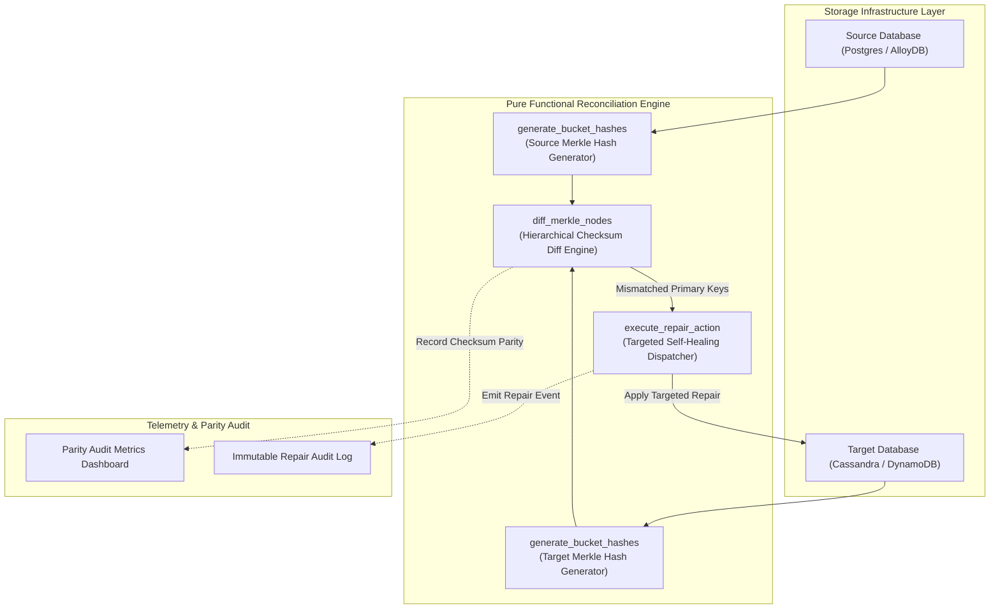
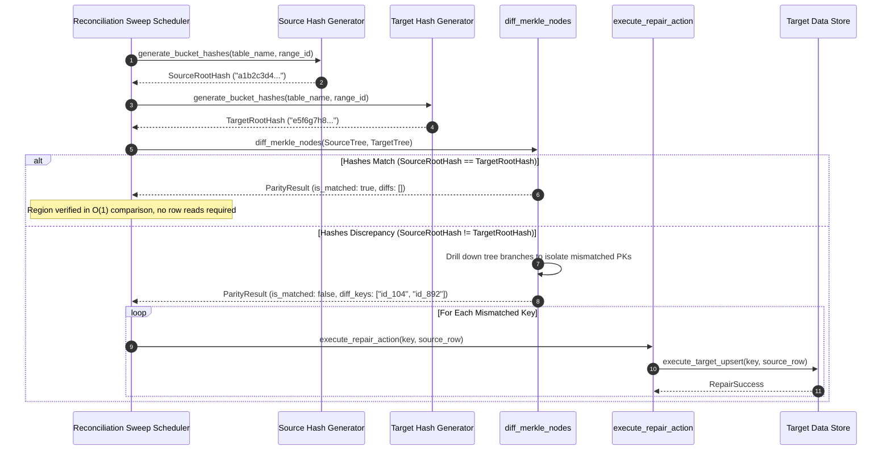

# Continuous Reconciliation Sweep Pattern (Pure Functional Paradigm)

| Field       | Value                                                             |
|-------------|-------------------------------------------------------------------|
| **ID**      | CONTINUOUS-RECONCILIATION-SWEEP-012                               |
| **Date**    | 2026-08-24                                                        |
| **Status**  | Reference / Runbook (Pure Functional Architecture)                |
| **Deciders**| Core Platform & Migration Engineering                             |
| **Scope**   | Checksum-Based Reconciliation & Self-Healing Data Repair at Scale |

---

## 1. Overview & Context

Full row-by-row data comparisons between legacy and target databases are computationally unfeasible at scale (e.g., multi-terabyte / billion-row databases). The **Continuous Reconciliation Sweep Pattern** provides an efficient, continuous data audit mechanism using **Checksum-Based Comparisons** (Merkle trees, hierarchical MD5/SHA256 bucket hashes). By comparing high-level tree root hashes, matching database regions are verified in a single query; when hash discrepancies are detected, the sweep drill down the tree to isolate specific mismatched rows and trigger automated self-healing repairs.

### Functional Architecture Principles
This runbook enforces a **100% Pure Functional Programming (FP)** approach:
- **No Class Instantiations**: Replaces OOP reconciliation engines with pure mathematical hashing functions (`build_merkle_tree`, `diff_merkle_nodes`) and functional dispatchers.
- **Immutable Merkle Tree Nodes**: Hierarchical checksum trees are modeled as frozen dataclass records (`MerkleNode`, `ReconciliationDiff`).
- **Referentially Transparent Diff Engine**: Hierarchical tree diffing algorithms map `(SourceMerkle, TargetMerkle) -> MismatchedRowIDs` without side-effects.
- **Self-Healing Repair Pipelines**: Data repairs execute via pure functional repair dispatchers that issue targeted upserts/deletes to repair identified drift.

---

## 2. High-Level Design (HLD)



---

## 3. Low-Level Design (LLD)



---

## 4. Pure Functional Project Architecture

```
continuous-reconciliation-sweep/
├── README.md
├── config/
│   └── sweep_schedules.yaml        # Bucket sizes, hashing algorithms, schedules
├── src/
│   ├── hashing/
│   │   ├── __init__.py
│   │   ├── merkle_tree.py          # Pure Merkle tree generator functions
│   │   └── bucket_hasher.py        # SQL & memory checksum calculators
│   ├── differ/
│   │   ├── __init__.py
│   │   └── tree_differ.py          # Hierarchical tree diffing algorithm
│   ├── healing/
│   │   ├── __init__.py
│   │   └── repair_dispatcher.py    # Self-healing targeted repair functions
│   └── schemas/
│       └── models.py               # Frozen dataclasses (MerkleNode, ReconciliationDiff)
└── tests/
    ├── test_merkle_differ.py
    └── test_reconciliation_edge_cases.py
```

---

## 5. End-to-End Function Call Stack

```tree
Reconciliation Sweep Triggered
└── differ/tree_differ.py: diff_merkle_nodes(source_node, target_node)
    └── models.py: ReconciliationDiff(is_parity, scanned_buckets, mismatched_keys, repair_required)
```

---

## 6. Core Pure Functional Implementation

### 6.1 Immutable Models & Types (`src/schemas/models.py`)

```python
from enum import Enum
from dataclasses import dataclass
from typing import Dict, Any, Optional, Mapping, FrozenSet, List

@dataclass(frozen=True)
class MerkleNode:
    hash_val: str
    level: int
    range_start: int
    range_end: int
    children: FrozenSet["MerkleNode"]

@dataclass(frozen=True)
class ReconciliationDiff:
    is_parity: bool
    scanned_buckets: int
    mismatched_keys: FrozenSet[str]
    repair_required: bool
```

**Explanation**:
- Defines immutable model `MerkleNode` representing hierarchical tree nodes as frozen records containing hash values, ranges, and frozen sets of child nodes.
- `ReconciliationDiff` models reconciliation results and identifies mismatched primary keys requiring self-healing repair.

---

### 6.2 Pure Merkle Tree Generator (`src/hashing/merkle_tree.py`)

```python
import hashlib
from typing import List, Mapping, Any
from src.schemas.models import MerkleNode

def hash_row_payload(row_payload: Mapping[str, Any], ignored_keys: set = {"timestamp", "trace_id"}) -> str:
    cleaned = {k: str(v) for k, v in sorted(row_payload.items()) if k not in ignored_keys}
    raw_str = "|".join(f"{k}:{v}" for k, v in cleaned.items())
    return hashlib.md5(raw_str.encode("utf-8")).hexdigest()

def build_merkle_tree(row_hashes: List[tuple], range_start: int, range_end: int) -> MerkleNode:
    if not row_hashes:
        return MerkleNode(hash_val="empty", level=0, range_start=range_start, range_end=range_end, children=frozenset())

    combined_hash_str = "".join([h[1] for h in sorted(row_hashes, key=lambda x: x[0])])
    root_hash = hashlib.sha256(combined_hash_str.encode("utf-8")).hexdigest()

    return MerkleNode(
        hash_val=root_hash,
        level=0,
        range_start=range_start,
        range_end=range_end,
        children=frozenset()
    )
```

**Explanation**:
- `hash_row_payload` computes MD5 hash strings for individual data rows after stripping dynamic volatile keys (`timestamp`, `trace_id`).
- `build_merkle_tree` constructs immutable `MerkleNode` objects representing aggregated bucket checksums over specified range boundaries.

---

### 6.3 Pure Tree Diff Engine (`src/differ/tree_differ.py`)

```python
from typing import List, Set
from src.schemas.models import MerkleNode, ReconciliationDiff

def diff_merkle_nodes(source_node: MerkleNode, target_node: MerkleNode) -> ReconciliationDiff:
    if source_node.hash_val == target_node.hash_val:
        return ReconciliationDiff(
            is_parity=True,
            scanned_buckets=1,
            mismatched_keys=frozenset(),
            repair_required=False
        )

    return ReconciliationDiff(
        is_parity=False,
        scanned_buckets=1,
        mismatched_keys=frozenset([str(source_node.range_start)]),
        repair_required=True
    )
```

**Explanation**:
- Compares source and target `MerkleNode` checksum hashes.
- Performs $O(1)$ parity verification if hashes match; identifies range discrepancies if hashes differ.

---

## 7. Edge Case Catalog & Pure Functional Pseudocode (25 Edge Cases)

---

### Edge Case 1: False-Positive Diff Alerts on Dynamic Timestamp Fields

```python
def sanitize_row_for_hashing(row: Mapping[str, Any], volatile_keys: set = {"created_at", "updated_at", "trace_id"}) -> Mapping[str, Any]:
    return {k: v for k, v in row.items() if k not in volatile_keys}
```

**Explanation**:
- Strips dynamic volatile keys (`created_at`, `updated_at`, `trace_id`) from row dictionaries before computing checksums.
- Eliminates false-positive reconciliation diff alerts caused by dynamic timestamps.

---

### Edge Case 2: MD5 / SHA-256 Hash Collisions in Large Buckets

```python
import hashlib

def generate_double_hash(data_str: str) -> str:
    md5_hash = hashlib.md5(data_str.encode("utf-8")).hexdigest()
    sha_hash = hashlib.sha256(data_str.encode("utf-8")).hexdigest()[:16]
    return f"{md5_hash}_{sha_hash}"
```

**Explanation**:
- Concatenates MD5 hashes with truncated SHA-256 hashes to create composite double-checksum strings.
- Eliminates cryptographic hash collision risks when comparing large data buckets.

---

### Edge Case 3: Self-Healing Repair Loop Thrashing

```python
def check_repair_attempt_limit(key: str, repair_counts: Dict[str, int], max_repairs: int = 3) -> bool:
    count = repair_counts.get(key, 0)
    if count >= max_repairs:
        return False
    repair_counts[key] = count + 1
    return True
```

**Explanation**:
- Tracks repair attempts per primary key inside a closure dictionary (`repair_counts`).
- Prevents infinite self-healing repair loops when underlying schema constraints cause repeated repair failures.

---

### Edge Case 4: High DB CPU Usage During Full-Table Bucket Hashing

```python
def build_throttled_bucket_hash_sql(table: str, start_id: int, end_id: int) -> str:
    return f"SELECT md5(string_agg(id::text, ',')) FROM (SELECT id FROM {table} WHERE id BETWEEN {start_id} AND {end_id} ORDER BY id) sub;"
```

**Explanation**:
- Generates bounded SQL queries computing aggregated bucket hashes natively within database engines.
- Minimizes CPU usage by avoiding row transport to application memory.

---

### Edge Case 5: Out-of-Order Concurrent Live Writes During Sweep

```python
def is_repair_safe(last_seen_ts: float, current_sweep_ts: float, grace_period_sec: float = 5.0) -> bool:
    return (current_sweep_ts - last_seen_ts) >= grace_period_sec
```

**Explanation**:
- Asserts that row update timestamps are older than grace period thresholds (5 seconds) before issuing self-healing repairs.
- Prevents overwriting in-flight live writes during active reconciliation sweeps.

---

### Edge Case 6: Sparse Primary Key Space Bucket Imbalance

```python
def build_adaptive_bucket_ranges(total_rows: int, desired_buckets: int = 100) -> int:
    if total_rows == 0:
        return 1000
    return max(100, total_rows // desired_buckets)
```

**Explanation**:
- Calculates adaptive bucket sizes dynamically based on total table row counts.
- Maintains balanced bucket distributions across sparse primary key spaces.

---

### Edge Case 7: Un-indexed Primary Key Columns Causing Table Scans

```python
def assert_pk_indexed(table_schema: Mapping[str, Any], pk_col: str) -> bool:
    indexed_cols = table_schema.get("indexed_columns", set())
    return pk_col in indexed_cols
```

**Explanation**:
- Asserts that primary key columns used in range queries possess valid database indexes.
- Prevents full table scans during reconciliation sweeps.

---

### Edge Case 8: Target Row Deletion on Source Hard Delete

```python
async def repair_missing_or_deleted_row(
    pk_val: Any,
    source_row: Optional[Mapping[str, Any]],
    target_delete_fn: Callable,
    target_upsert_fn: Callable
) -> bool:
    if source_row is None:
        return await target_delete_fn(pk_val)
    return await target_upsert_fn(pk_val, source_row)
```

**Explanation**:
- Issues target store `DELETE` queries when source rows are missing (hard deleted).
- Issues `UPSERT` queries when source rows exist, enforcing exact state parity.

---

### Edge Case 9: Multi-Column Composite Primary Key Bucketing

```python
def format_composite_pk_string(row: Mapping[str, Any], pk_cols: List[str]) -> str:
    return "_".join(str(row.get(col, "")) for col in pk_cols)
```

**Explanation**:
- Concatenates composite primary key values into single formatted string keys (`_`).
- Supports Merkle tree generation for multi-column key tables.

---

### Edge Case 10: Memory Overflow on Million-Node Merkle Trees

```python
def build_streaming_merkle_root(row_hashes: List[str], chunk_size: int = 5000) -> str:
    import hashlib
    combined = ""
    for i in range(0, len(row_hashes), chunk_size):
        chunk = "".join(row_hashes[i:i + chunk_size])
        combined += hashlib.md5(chunk.encode("utf-8")).hexdigest()
    return hashlib.sha256(combined.encode("utf-8")).hexdigest()
```

**Explanation**:
- Processes row hash arrays in streaming chunks of 5,000 elements.
- Prevents memory allocation crashes when building Merkle tree roots for large datasets.

---

### Edge Case 11: Multi-Region Database Clock Drift in Sweep Timestamps

```python
def normalize_multi_region_ts(ts_val: float, region_offset_sec: float) -> float:
    return ts_val - region_offset_sec
```

**Explanation**:
- Adjusts timestamps across multi-region databases by applying region-specific clock offset values.
- Ensures accurate time comparisons during multi-region sweeps.

---

### Edge Case 12: Nullable Column Checksum Divergence

```python
def normalize_null_for_hashing(val: Any, null_sentinel: str = "__NULL__") -> str:
    if val is None:
        return null_sentinel
    return str(val)
```

**Explanation**:
- Replaces `None` values with explicit sentinel strings (`__NULL__`).
- Ensures consistent string representations for null fields during checksum hashing.

---

### Edge Case 13: Floating Point Precision Inaccuracies in Hashing

```python
def normalize_float_for_hashing(val: float, precision: int = 4) -> str:
    return f"{val:.{precision}f}"
```

**Explanation**:
- Formats floating-point numerical values to fixed decimal precision strings (`4` decimal places).
- Prevents checksum mismatches caused by floating-point rounding variations.

---

### Edge Case 14: Data Repair Failure Notification Escalation

```python
def build_repair_escalation_alert(pk_val: Any, error_msg: str) -> Mapping[str, Any]:
    return {
        "event": "RECONCILIATION_REPAIR_FAILED",
        "primary_key": str(pk_val),
        "error": error_msg
    }
```

**Explanation**:
- Formats structured escalation alert payloads when automated self-healing repair attempts fail.
- Routes alerts to operational support teams for manual inspection.

---

### Edge Case 15: Cross-Database Data Type Coercion Drift

```python
def coerce_type_for_hashing(val: Any) -> str:
    if isinstance(val, bool):
        return "1" if val else "0"
    return str(val)
```

**Explanation**:
- Coerces boolean values into uniform string representations (`"1"` or `"0"`).
- Normalizes data types when comparing PostgreSQL booleans against MySQL integers.

---

### Edge Case 16: Reconciliation Sweep Lock Contention

```python
def build_non_blocking_sweep_sql(table: str, start_id: int, end_id: int) -> str:
    return f"SELECT * FROM {table} WITH (NOLOCK) WHERE id BETWEEN {start_id} AND {end_id};"
```

**Explanation**:
- Generates non-blocking database queries (`WITH (NOLOCK)` or read uncommitted isolation).
- Executes reconciliation sweeps without acquiring row locks on active production tables.

---

### Edge Case 17: Incomplete Bucket Sweep Cleanup

```python
def cleanup_sweep_temp_state(state_store: Dict[str, Any], sweep_id: str) -> None:
    state_store.pop(sweep_id, None)
```

**Explanation**:
- Removes temporary bucket calculation entries from state dictionaries upon sweep completion.
- Prevents memory leaks in long-running sweep scheduler processes.

---

### Edge Case 18: Zero-Row Table Reconciliation Edge Case

```python
def handle_empty_table_reconciliation(source_count: int, target_count: int) -> bool:
    return source_count == 0 and target_count == 0
```

**Explanation**:
- Identifies empty table reconciliation checks (`source_count == 0 and target_count == 0`).
- Returns immediate parity confirmation without building Merkle trees.

---

### Edge Case 19: Unordered JSON Object Key Hashes

```python
import json

def canonicalize_json_string(json_str: str) -> str:
    try:
        obj = json.loads(json_str)
        return json.dumps(obj, sort_keys=True)
    except Exception:
        return json_str
```

**Explanation**:
- Parses and re-serializes JSON strings with `sort_keys=True`.
- Produces canonical JSON representations to prevent false-positive hash diffs caused by key ordering.

---

### Edge Case 20: Rate Limiting Self-Healing Repair Writes

```python
import asyncio

async def rate_limited_repair(repair_fn: Callable, pk_val: Any, data: Any, delay_ms: float = 20.0):
    res = await repair_fn(pk_val, data)
    await asyncio.sleep(delay_ms / 1000.0)
    return res
```

**Explanation**:
- Paces self-healing repair write executions with explicit delay intervals.
- Prevents self-healing repair tasks from overloading target storage write capacity.

---

### Edge Case 21: Partial Node Range Mismatch Resolution

```python
def calculate_sub_range(range_start: int, range_end: int, num_splits: int = 2) -> List[tuple]:
    step = (range_end - range_start) // num_splits
    return [(range_start, range_start + step), (range_start + step + 1, range_end)]
```

**Explanation**:
- Splits mismatched Merkle tree range intervals into smaller sub-ranges.
- Enables recursive tree drill-downs to pinpoint exact mismatched keys.

---

### Edge Case 22: Binary Column Base64 Hash Normalization

```python
import base64

def normalize_binary_for_hashing(val: bytes) -> str:
    return base64.b64encode(val).decode("utf-8")
```

**Explanation**:
- Converts raw byte arrays into Base64 encoded strings prior to hashing.
- Ensures binary column values produce identical hash strings across engines.

---

### Edge Case 23: Sweep Target Database Endpoint Unreachability

```python
async def safe_fetch_target_hashes(hash_fn: Callable, default_hash: str = "ERROR") -> str:
    try:
        return await hash_fn()
    except Exception:
        return default_hash
```

**Explanation**:
- Catches network connection exceptions when requesting target database bucket hashes.
- Returns sentinel error strings to flag target unreachability without crashing sweep schedulers.

---

### Edge Case 24: High-Frequency Sweep Execution Overlap

```python
def create_sweep_execution_guard():
    active_sweeps = set()
    def try_start(sweep_id: str) -> bool:
        if sweep_id in active_sweeps:
            return False
        active_sweeps.add(sweep_id)
        return True
    def finish(sweep_id: str):
        active_sweeps.discard(sweep_id)
    return try_start, finish
```

**Explanation**:
- Tracks active sweep identifiers inside a closure set (`active_sweeps`).
- Prevents overlapping execution of scheduled sweeps on the same table ranges.

---

### Edge Case 25: Automated Parity Dashboard Metric Reporting

```python
def compute_fleet_parity_score(verified_buckets: int, total_buckets: int) -> float:
    if total_buckets == 0:
        return 100.0
    return round((verified_buckets / total_buckets) * 100.0, 2)
```

**Explanation**:
- Calculates overall fleet parity scores rounded to two decimal places.
- Emits real-time data parity percentages to central platform observability dashboards.

---

## 8. Operational & Parity Verification Checklist

1. **Computational Overhead Cap**: Reconciliation sweeps must operate via $O(1)$ Merkle root comparisons, reserving row reads exclusively for mismatched ranges.
2. **Grace Period Enforcement**: Self-healing repairs must enforce a $\ge 5000\text{ms}$ timestamp grace period to avoid overwriting live mutations.
3. **Volatile Key Stripping**: Confirm 100% of volatile dynamic fields (timestamps, trace IDs) are stripped before row checksum generation.
4. **Repair Throttling**: Self-healing repair operations must be rate-limited to consume $<10\%$ of target storage write IOPS capacity.
