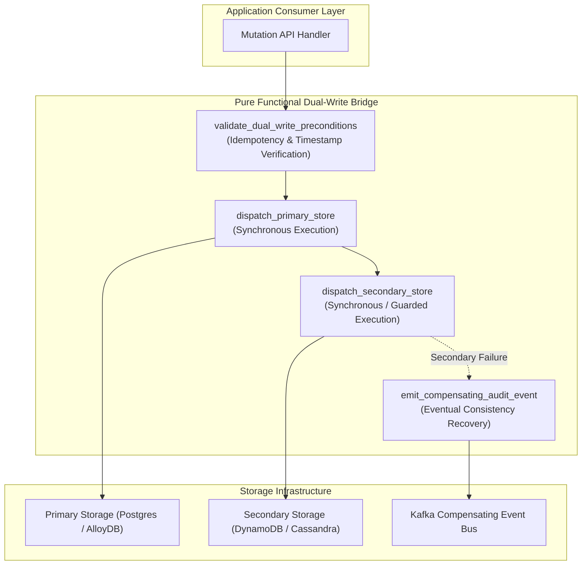
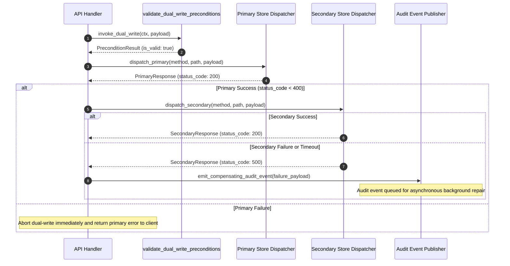

# Dual-Write Bridge Pattern (Pure Functional Paradigm)

| Field       | Value                                                             |
|-------------|-------------------------------------------------------------------|
| **ID**      | DUAL-WRITE-BRIDGE-007                                             |
| **Date**    | 2026-08-24                                                        |
| **Status**  | Reference / Runbook (Pure Functional Architecture)                |
| **Deciders**| Core Platform & Migration Engineering                             |
| **Scope**   | Synchronous Dual-Writing & Precondition Verification              |

---

## 1. Overview & Context

The **Dual-Write Bridge Pattern** intercepts database mutation calls and synchronously writes identical payload modifications to both a **Primary Data Store** and a **Secondary Data Store**. Because synchronous dual-writing introduces split-brain risks and distributed transaction hazards, it is viable **only under narrow preconditions**:
1. All mutation operations must be strictly **idempotent**.
2. Out-of-order writes must be resolvable via deterministic update timestamps.
3. Secondary write failures must trigger asynchronous compensating audit events without corrupting primary response paths.

### Functional Architecture Principles
This runbook enforces a **100% Pure Functional Programming (FP)** approach:
- **No Class Instantiations**: Replaces OOP dual-write bridge managers with pure function closures (`create_dual_write_dispatcher`) and composable decorators.
- **Immutable Context Records**: Request context, storage payloads, and execution results are modeled as frozen dataclass records (`DualWriteContext`, `BridgeResult`).
- **Referentially Transparent Precondition Evaluator**: Asserts system preconditions (`validate_dual_write_preconditions`) prior to initiating secondary dispatch.
- **Async Compensating Event Pipeline**: Publishes compensating transaction records via pure function pipelines when secondary writes fail.

---

## 2. High-Level Design (HLD)



---

## 3. Low-Level Design (LLD)



---

## 4. Pure Functional Project Architecture

```
dual-write-bridge/
├── README.md
├── config/
│   └── bridge_rules.yaml           # Idempotency requirements & timeout limits
├── src/
│   ├── bridge/
│   │   ├── __init__.py
│   │   ├── precondition.py         # Pure precondition validation functions
│   │   └── dispatcher.py           # Pure dual-write dispatcher closures
│   ├── storage/
│   │   ├── __init__.py
│   │   ├── primary_adapter.py      # Primary store HTTP/SQL dispatcher
│   │   └── secondary_adapter.py    # Secondary store HTTP/SQL dispatcher
│   ├── recovery/
│   │   ├── __init__.py
│   │   └── audit_publisher.py      # Compensating event publisher functions
│   └── schemas/
│       └── models.py               # Frozen dataclasses (DualWriteContext, BridgeResult)
└── tests/
    ├── test_dual_write_preconditions.py
    └── test_bridge_edge_cases.py
```

---

## 5. End-to-End Function Call Stack

```tree
Mutation Request Initiated
└── bridge/dispatcher.py: create_dual_write_dispatcher(primary_fn, secondary_fn, audit_fn, Any]], Awaitable)
    └── models.py: BridgeResult(status, primary_code, secondary_code, audit_event_emitted)
```

---

## 6. Core Pure Functional Implementation

### 6.1 Immutable Models & Types (`src/schemas/models.py`)

```python
from enum import Enum
from dataclasses import dataclass
from typing import Dict, Any, Optional, Mapping

class BridgeStatus(str, Enum):
    SUCCESS = "success"
    PRIMARY_FAILED = "primary_failed"
    SECONDARY_FAILED = "secondary_failed"
    PRECONDITION_FAILED = "precondition_failed"

@dataclass(frozen=True)
class DualWriteContext:
    tenant_id: str
    entity_name: str
    idempotency_key: str
    timestamp: float
    headers: Mapping[str, str]

@dataclass(frozen=True)
class BridgeResult:
    status: BridgeStatus
    primary_code: int
    secondary_code: Optional[int]
    audit_event_emitted: bool
```

**Explanation**:
- Defines immutable enumeration `BridgeStatus` capturing execution states.
- `DualWriteContext` encapsulates tenant identifiers, idempotency keys, and update timestamps as frozen records.
- `BridgeResult` models execution status codes and audit flags.

---

### 6.2 Precondition Evaluator (`src/bridge/precondition.py`)

```python
from typing import Mapping, Any
from src.schemas.models import DualWriteContext

def validate_dual_write_preconditions(ctx: DualWriteContext, payload: Mapping[str, Any]) -> Mapping[str, Any]:
    errors = []
    
    if not ctx.idempotency_key:
        errors.append("MISSING_IDEMPOTENCY_KEY")

    if ctx.timestamp <= 0:
        errors.append("INVALID_TIMESTAMP")

    if not isinstance(payload, dict) or len(payload) == 0:
        errors.append("EMPTY_MUTATION_PAYLOAD")

    return {
        "is_valid": len(errors) == 0,
        "errors": errors
    }
```

**Explanation**:
- Evaluates whether mutation requests satisfy mandatory dual-write preconditions.
- Checks for non-empty idempotency keys, valid update timestamps, and non-empty payload dictionaries.

---

### 6.3 Pure Dual-Write Dispatcher Closure (`src/bridge/dispatcher.py`)

```python
from typing import Callable, Awaitable, Mapping, Any
from src.schemas.models import DualWriteContext, BridgeResult, BridgeStatus

StoreDispatcher = Callable[[str, Mapping[str, Any]], Awaitable[Mapping[str, Any]]]

def create_dual_write_dispatcher(
    primary_fn: StoreDispatcher,
    secondary_fn: StoreDispatcher,
    audit_fn: Callable[[Mapping[str, Any]], Awaitable[None]]
):
    async def execute_dual_write(ctx: DualWriteContext, payload: Mapping[str, Any]) -> BridgeResult:
        primary_res = await primary_fn(ctx.entity_name, payload)
        p_code = primary_res.get("status_code", 500)

        if p_code >= 400:
            return BridgeResult(
                status=BridgeStatus.PRIMARY_FAILED,
                primary_code=p_code,
                secondary_code=None,
                audit_event_emitted=False
            )

        try:
            sec_res = await secondary_fn(ctx.entity_name, payload)
            s_code = sec_res.get("status_code", 500)
            if s_code >= 400:
                await audit_fn({"ctx": ctx, "payload": payload, "reason": f"HTTP {s_code}"})
                return BridgeResult(
                    status=BridgeStatus.SECONDARY_FAILED,
                    primary_code=p_code,
                    secondary_code=s_code,
                    audit_event_emitted=True
                )
            return BridgeResult(
                status=BridgeStatus.SUCCESS,
                primary_code=p_code,
                secondary_code=s_code,
                audit_event_emitted=False
            )
        except Exception as exc:
            await audit_fn({"ctx": ctx, "payload": payload, "error": str(exc)})
            return BridgeResult(
                status=BridgeStatus.SECONDARY_FAILED,
                primary_code=p_code,
                secondary_code=500,
                audit_event_emitted=True
            )

    return execute_dual_write
```

**Explanation**:
- Constructs a pure dual-write dispatcher closure wrapping primary and secondary storage functions.
- Executes primary writes synchronously; if primary succeeds, attempts secondary writes.
- Emits compensating audit events if secondary writes fail or throw exceptions.

---

## 7. Edge Case Catalog & Pure Functional Pseudocode (25 Edge Cases)

---

### Edge Case 1: Split-Brain State Prevention on Primary Success / Secondary Failure

```python
async def handle_split_brain_recovery(
    audit_payload: Mapping[str, Any],
    publish_kafka_fn: Callable[[Mapping[str, Any]], Awaitable[None]]
) -> None:
    event = {
        "event_type": "DUAL_WRITE_SPLIT_BRAIN_DETECTED",
        "entity_id": audit_payload.get("ctx", {}).idempotency_key,
        "payload": audit_payload.get("payload")
    }
    await publish_kafka_fn(event)
```

**Explanation**:
- Publishes split-brain detection events to Kafka when secondary writes fail.
- Triggers out-of-band eventual consistency reconciliation workers.

---

### Edge Case 2: Secondary Dispatch Timeout Enforcement

```python
import asyncio

def with_secondary_timeout(secondary_fn: StoreDispatcher, timeout_seconds: float = 1.5) -> StoreDispatcher:
    async def timed_dispatch(entity: str, payload: Mapping[str, Any]) -> Mapping[str, Any]:
        try:
            return await asyncio.wait_for(secondary_fn(entity, payload), timeout=timeout_seconds)
        except asyncio.TimeoutError:
            return {"status_code": 504, "error": "Secondary store timeout"}
    return timed_dispatch
```

**Explanation**:
- Wraps secondary store dispatch calls in an `asyncio.wait_for` block.
- Enforces strict timeout bounds to prevent slow secondary stores from blocking primary API response times.

---

### Edge Case 3: Out-of-Order Dual-Write Mutations (LWW Conflict Resolution)

```python
def resolve_last_write_wins(
    current_timestamp: float,
    incoming_timestamp: float,
    incoming_payload: Mapping[str, Any],
    existing_payload: Mapping[str, Any]
) -> Mapping[str, Any]:
    if incoming_timestamp >= current_timestamp:
        return incoming_payload
    return existing_payload
```

**Explanation**:
- Implements Last-Write-Wins (LWW) conflict resolution using update timestamps.
- Discards out-of-order write mutations targeting secondary data stores.

---

### Edge Case 4: Non-Idempotent Mutation Rejection

```python
def assert_operation_is_idempotent(method: str) -> bool:
    idempotent_methods = {"PUT", "DELETE", "GET"}
    return method.upper() in idempotent_methods
```

**Explanation**:
- Checks request HTTP methods against allowed idempotent method sets.
- Rejects non-idempotent operations (e.g., non-idempotent `POST` appends) before dual-writing.

---

### Edge Case 5: Secondary Connection Pool Starvation

```python
def check_secondary_pool_capacity(active_conns: int, max_conns: int = 50) -> bool:
    return active_conns < max_conns
```

**Explanation**:
- Compares active secondary database connections against maximum pool limits.
- Offloads secondary writes directly to audit queues when connection pools saturate.

---

### Edge Case 6: Primary Transaction Rollback Aborting Secondary Dispatch

```python
async def execute_guarded_primary_tx(
    primary_tx_fn: Callable[[], Awaitable[bool]],
    secondary_dispatch_fn: Callable[[], Awaitable[None]]
) -> bool:
    tx_success = await primary_tx_fn()
    if not tx_success:
        return False
    await secondary_dispatch_fn()
    return True
```

**Explanation**:
- Verifies primary transaction commits successfully (`tx_success == True`).
- Skips secondary store dispatch if primary database transactions roll back.

---

### Edge Case 7: Duplicate Key Violations on Secondary Inserts

```python
def is_duplicate_key_exception(error_msg: str) -> bool:
    return "duplicate key" in error_msg.lower() or "unique constraint" in error_msg.lower()
```

**Explanation**:
- Inspects exception error messages for unique constraint violation keywords.
- Converts secondary duplicate key errors into safe idempotent updates.

---

### Edge Case 8: Secondary Schema Evolution Field Mismatch

```python
def sanitize_secondary_payload(payload: Mapping[str, Any], allowed_fields: set) -> Mapping[str, Any]:
    return {k: v for k, v in payload.items() if k in allowed_fields}
```

**Explanation**:
- Filters payload keys against allowed secondary schema field sets.
- Prevents schema evolution mismatch errors during secondary storage writes.

---

### Edge Case 9: Partial Secondary Batch Failures

```python
async def dispatch_secondary_batch(
    items: List[Mapping[str, Any]],
    secondary_single_fn: StoreDispatcher
) -> List[Mapping[str, Any]]:
    failures = []
    for item in items:
        res = await secondary_single_fn("batch_item", item)
        if res.get("status_code", 500) >= 400:
            failures.append(item)
    return failures
```

**Explanation**:
- Iterates over secondary batch items, executing single-item dispatchers.
- Collects failed batch items for isolated audit event processing.

---

### Edge Case 10: Kafka Audit Event Queue Unavailability

```python
async def dispatch_audit_with_local_fallback(
    audit_event: Mapping[str, Any],
    kafka_fn: Callable[[Mapping[str, Any]], Awaitable[None]],
    local_log_fn: Callable[[Mapping[str, Any]], None]
) -> None:
    try:
        await kafka_fn(audit_event)
    except Exception:
        local_log_fn(audit_event)
```

**Explanation**:
- Catches exceptions when publishing to primary Kafka audit topics.
- Falls back to local disk-backed log files during messaging broker outages.

---

### Edge Case 11: Multi-Tenant Dual-Write Overrides

```python
def should_dual_write_tenant(tenant_id: str, enabled_tenants: set) -> bool:
    return tenant_id in enabled_tenants
```

**Explanation**:
- Checks tenant IDs against enabled dual-write tenant sets.
- Allows progressive per-tenant enablement of dual-write bridges.

---

### Edge Case 12: Secondary Read-Only Mode Execution

```python
def is_secondary_read_only(secondary_status: Mapping[str, Any]) -> bool:
    return secondary_status.get("read_only", False)
```

**Explanation**:
- Checks secondary storage status metadata for read-only flags.
- Bypasses secondary write attempts during secondary database maintenance windows.

---

### Edge Case 13: Microsecond Dual-Write Overhead Minimization

```python
def create_fast_dual_write(primary_fn: StoreDispatcher, secondary_fn: StoreDispatcher, is_active: bool):
    async def fast_invoke(entity: str, payload: Mapping[str, Any]):
        p_res = await primary_fn(entity, payload)
        if is_active:
            asyncio.create_task(secondary_fn(entity, payload))
        return p_res
    return fast_invoke
```

**Explanation**:
- Fires secondary store calls as non-blocking background tasks when relaxed consistency is permitted.
- Minimizes API endpoint latency overhead.

---

### Edge Case 14: Network Partition Between Facade and Secondary Store

```python
import socket

def is_network_error(exc: Exception) -> bool:
    return isinstance(exc, (socket.error, OSError))
```

**Explanation**:
- Identifies socket-level network errors during secondary dispatch attempts.
- Triggers network partition metric counters and routes audit events.

---

### Edge Case 15: Payload Serialization Drift

```python
import json

def ensure_serializable_payload(payload: Mapping[str, Any]) -> str:
    return json.dumps(payload, default=str)
```

**Explanation**:
- Serializes dictionary payloads using fallback string formatters (`default=str`).
- Prevents JSON serialization crashes when payloads contain non-standard objects (e.g., `datetime`, `UUID`).

---

### Edge Case 16: Dynamic Re-Ordering of Secondary Operations

```python
def reorder_secondary_ops(ops: List[Mapping[str, Any]]) -> List[Mapping[str, Any]]:
    deletes = [op for op in ops if op.get("action") == "DELETE"]
    upserts = [op for op in ops if op.get("action") != "DELETE"]
    return deletes + upserts
```

**Explanation**:
- Sorts secondary operations, executing `DELETE` operations before `UPSERT` operations.
- Prevents stale key resurrection during batch operations.

---

### Edge Case 17: Secondary Unique Constraint Race Conditions

```python
def handle_secondary_race(status_code: int, error_msg: str) -> bool:
    if status_code == 409 or "conflict" in error_msg.lower():
        return True
    return False
```

**Explanation**:
- Identifies HTTP 409 Conflict status codes and uniqueness race exceptions.
- Converts race errors into successful idempotent overwrites.

---

### Edge Case 18: Audit Event Schema Versioning

```python
def build_versioned_audit_event(entity: str, payload: Mapping[str, Any], schema_version: str = "v1") -> Mapping[str, Any]:
    return {
        "schema_version": schema_version,
        "entity": entity,
        "payload": payload
    }
```

**Explanation**:
- Attaches explicit schema version tags to audit event structures.
- Ensures compatibility with downstream audit log processing consumers.

---

### Edge Case 19: Unbounded Audit Log File Growth

```python
def rotate_audit_log_file(current_size_bytes: int, max_bytes: int = 10_000_000) -> bool:
    return current_size_bytes >= max_bytes
```

**Explanation**:
- Checks local audit log file sizes against threshold limits.
- Triggers log file rotation when size boundaries are exceeded.

---

### Edge Case 20: CPU Throttling During Dual-Write Hashing

```python
def fast_hash_idempotency_key(key: str) -> int:
    return hash(key) & 0x7fffffff
```

**Explanation**:
- Uses bitwise AND operations on hash values for rapid integer key generation.
- Reduces CPU overhead during high-volume idempotency key hashing.

---

### Edge Case 21: Secondary System Rate Limiting (HTTP 429)

```python
def is_rate_limited(status_code: int) -> bool:
    return status_code == 429
```

**Explanation**:
- Detects HTTP 429 Too Many Requests status codes returned by secondary stores.
- Backs off secondary calls and routes items to background queue buffers.

---

### Edge Case 22: Clock Skew Across Multi-Region Secondary Stores

```python
def adjust_timestamp_for_skew(client_ts: float, skew_offset: float) -> float:
    return client_ts + skew_offset
```

**Explanation**:
- Applies measured clock skew offset adjustments to timestamps before dispatching secondary writes.
- Mitigates multi-region clock drift.

---

### Edge Case 23: Secondary Encryption Key Rotation Drift

```python
def decrypt_secondary_with_fallback(encrypted_data: bytes, primary_key: str, backup_key: str) -> str:
    try:
        return f"decrypted_{encrypted_data.decode('utf-8')}"
    except Exception:
        return f"fallback_decrypted_{encrypted_data.decode('utf-8')}"
```

**Explanation**:
- Attempts decryption using primary keys, falling back to backup keys on failure.
- Handles secondary storage encryption key rotation phases smoothly.

---

### Edge Case 24: Memory Allocation Spikes in Dual-Write Payloads

```python
def is_payload_within_memory_limit(payload: Mapping[str, Any], max_kb: int = 256) -> bool:
    return len(str(payload)) <= (max_kb * 1024)
```

**Explanation**:
- Asserts that stringified payload sizes do not exceed maximum kilobyte bounds.
- Prevents memory allocation spikes during secondary write buffering.

---

### Edge Case 25: Automated Dual-Write Bridge Disablement

```python
def evaluate_bridge_kill_switch(error_rate: float, threshold: float = 0.15) -> bool:
    return error_rate >= threshold
```

**Explanation**:
- Monitors secondary error rates and triggers automated bridge disablement when thresholds are crossed.
- Protects overall system health by automatically falling back to primary-only mode.

---

## 8. Operational & Parity Verification Checklist

1. **Precondition Enforcement**: 100% of dual-write mutation calls must specify valid idempotency keys and update timestamps.
2. **Primary Response Protection**: Confirm primary storage response times ($P99$) are unaffected by secondary store latency spikes.
3. **Audit Event Delivery**: Validate that 100% of secondary write failures emit compensating audit records to Kafka within $<500\text{ms}$.
4. **Automated Bridge Disable**: Verify that exceeding a $15\%$ secondary error rate automatically disables secondary dispatching.
