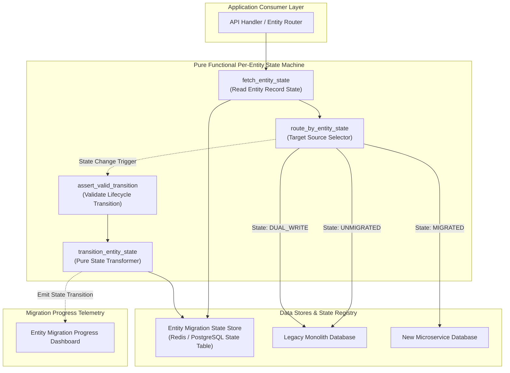
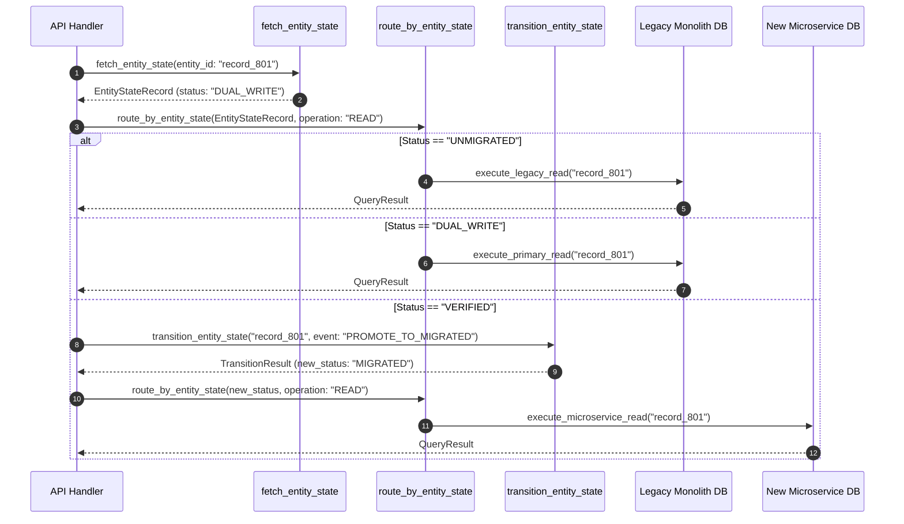

# Per-Entity Migration State Machine Pattern (Pure Functional Paradigm)

| Field       | Value                                                             |
|-------------|-------------------------------------------------------------------|
| **ID**      | PER-ENTITY-STATE-MACHINE-020                                      |
| **Date**    | 2026-08-24                                                        |
| **Status**  | Reference / Runbook (Pure Functional Architecture)                |
| **Deciders**| Core Platform & Migration Engineering                             |
| **Scope**   | Granular Record-Level Migration Tracking & State Transitions      |

---

## 1. Overview & Context

Relying on a single global feature flag or tenant-level toggle to cut over data traffic introduces severe risk: a single corrupt record can force a full feature rollback. The **Per-Entity Migration State Machine Pattern** tracks the migration status of **each record individually** in a state tracking store. Each entity progresses through explicit lifecycle states (`UNMIGRATED`, `DUAL_WRITE`, `VERIFIED`, `MIGRATED`, `DEPRECATED`), allowing fine-grained, record-by-record traffic routing and data validation.

### Functional Architecture Principles
This runbook enforces a **100% Pure Functional Programming (FP)** approach:
- **No Class Instantiations**: Replaces OOP state machine objects with pure state transition functions (`transition_entity_state`, `eval_entity_routing`) and functional dispatchers.
- **Immutable Entity State Records**: Record keys, current migration states, and state transition histories are modeled as frozen dataclass records (`EntityStateRecord`, `TransitionResult`).
- **Referentially Transparent State Evaluators**: Pure functions map `(EntityStateRecord, StateTransitionEvent) -> TransitionResult` without side-effects.
- **Strict Transition Assertion Guards**: Pure guard functions validate allowed state transitions, blocking illegal state jumps (e.g., jumping from `UNMIGRATED` directly to `MIGRATED` without `VERIFIED`).

---

## 2. High-Level Design (HLD)



---

## 3. Low-Level Design (LLD)



---

## 4. Pure Functional Project Architecture

```
per-entity-state-machine/
├── README.md
├── config/
│   └── state_transitions.yaml     # Allowed state transitions & guard rules
├── src/
│   ├── machine_engine/
│   │   ├── __init__.py
│   │   ├── transitioner.py         # Pure state transition functions
│   │   ├── guards.py               # State transition assertion guards
│   │   └── router.py               # Entity state-based router
│   ├── storage/
│   │   ├── __init__.py
│   │   └── state_store.py          # State tracking store query dispatchers
│   ├── observability/
│   │   ├── __init__.py
│   │   └── state_metrics.py        # Entity migration progress telemetry
│   └── schemas/
│       └── models.py               # Frozen dataclasses (EntityStateRecord, TransitionResult)
└── tests/
    ├── test_state_transitioner.py
    └── test_machine_edge_cases.py
```

---

## 5. End-to-End Function Call Stack

```tree
Entity Request Initiated
└── machine_engine/router.py: create_entity_state_router(legacy_db_fn, microservice_db_fn)
```

---

## 6. Core Pure Functional Implementation

### 6.1 Immutable Models & Types (`src/schemas/models.py`)

```python
from enum import Enum
from dataclasses import dataclass
from typing import Dict, Any, Optional, Mapping, FrozenSet

class EntityStatus(str, Enum):
    UNMIGRATED = "unmigrated"
    DUAL_WRITE = "dual_write"
    VERIFIED = "verified"
    MIGRATED = "migrated"
    DEPRECATED = "deprecated"

@dataclass(frozen=True)
class EntityStateRecord:
    entity_id: str
    entity_type: str
    status: EntityStatus
    version: int
    last_updated: float

@dataclass(frozen=True)
class TransitionResult:
    is_allowed: bool
    new_status: EntityStatus
    error_message: Optional[str]
```

**Explanation**:
- Defines immutable enumeration `EntityStatus` specifying granular record migration states.
- `EntityStateRecord` models entity IDs, migration states, and optimistic concurrency version numbers as frozen records.
- `TransitionResult` captures transition assertion outcomes and new status states.

---

### 6.2 Pure State Transition Engine & Guards (`src/machine_engine/transitioner.py`)

```python
from typing import Mapping, FrozenSet
from src.schemas.models import EntityStatus, EntityStateRecord, TransitionResult

ALLOWED_TRANSITIONS: Mapping[EntityStatus, FrozenSet[EntityStatus]] = {
    EntityStatus.UNMIGRATED: frozenset({EntityStatus.DUAL_WRITE}),
    EntityStatus.DUAL_WRITE: frozenset({EntityStatus.VERIFIED, EntityStatus.UNMIGRATED}),
    EntityStatus.VERIFIED: frozenset({EntityStatus.MIGRATED, EntityStatus.DUAL_WRITE}),
    EntityStatus.MIGRATED: frozenset({EntityStatus.DEPRECATED, EntityStatus.VERIFIED})
}

def assert_valid_transition(current: EntityStatus, target: EntityStatus) -> bool:
    allowed = ALLOWED_TRANSITIONS.get(current, frozenset())
    return target in allowed

def transition_entity_state(record: EntityStateRecord, target_status: EntityStatus) -> TransitionResult:
    if not assert_valid_transition(record.status, target_status):
        return TransitionResult(
            is_allowed=False,
            new_status=record.status,
            error_message=f"Illegal transition from {record.status.value} to {target_status.value}"
        )

    return TransitionResult(
        is_allowed=True,
        new_status=target_status,
        error_message=None
    )
```

**Explanation**:
- `assert_valid_transition` validates state transitions against an immutable state transition map (`ALLOWED_TRANSITIONS`).
- `transition_entity_state` evaluates state changes referentially transparently, preventing illegal state jumps (e.g. `UNMIGRATED` $\rightarrow$ `MIGRATED`).

---

### 6.3 State-Based Target Router (`src/machine_engine/router.py`)

```python
from typing import Callable, Awaitable, Mapping, Any
from src.schemas.models import EntityStateRecord, EntityStatus

QueryFn = Callable[[str, Mapping[str, Any]], Awaitable[Mapping[str, Any]]]

def create_entity_state_router(legacy_db_fn: QueryFn, microservice_db_fn: QueryFn):
    async def route_by_state(record: EntityStateRecord, is_write: bool, payload: Mapping[str, Any]) -> Mapping[str, Any]:
        if record.status == EntityStatus.MIGRATED:
            return await microservice_db_fn(record.entity_id, payload)
        elif record.status == EntityStatus.DUAL_WRITE and is_write:
            res = await legacy_db_fn(record.entity_id, payload)
            try:
                await microservice_db_fn(record.entity_id, payload)
            except Exception:
                pass
            return res

        return await legacy_db_fn(record.entity_id, payload)

    return route_by_state
```

**Explanation**:
- Constructs a functional router directing queries based on individual `EntityStateRecord` statuses.
- Routes `MIGRATED` records directly to microservices while keeping `UNMIGRATED` and `DUAL_WRITE` records on legacy backends.

---

## 7. Edge Case Catalog & Pure Functional Pseudocode (25 Edge Cases)

---

### Edge Case 1: Illegal Direct State Transition Jump Attempt

```python
def block_illegal_jump(current: EntityStatus, target: EntityStatus) -> bool:
    return current == EntityStatus.UNMIGRATED and target == EntityStatus.MIGRATED
```

**Explanation**:
- Detects direct state jump attempts from `UNMIGRATED` to `MIGRATED`.
- Rejects illegal state transitions that bypass verification phases.

---

### Edge Case 2: Concurrent Optimistic Locking Version Conflict

```python
def is_version_conflict(current_version: int, expected_version: int) -> bool:
    return current_version != expected_version
```

**Explanation**:
- Compares record version numbers during state updates.
- Blocks state transitions if concurrent writes modify record versions.

---

### Edge Case 3: Missing Entity Record in State Store (Defaulting to UNMIGRATED)

```python
def resolve_missing_entity_state(entity_id: str, state_map: Mapping[str, Any]) -> EntityStateRecord:
    import time
    raw = state_map.get(entity_id)
    if not raw:
        return EntityStateRecord(
            entity_id=entity_id,
            entity_type="default",
            status=EntityStatus.UNMIGRATED,
            version=1,
            last_updated=time.time()
        )
    return raw
```

**Explanation**:
- Resolves state records from tracking stores, defaulting unmapped entity IDs to `UNMIGRATED`.
- Ensures default legacy routing for untracked records.

---

### Edge Case 4: Emergency Entity State Rollback to Dual-Write

```python
def rollback_entity_state_to_dual_write(record: EntityStateRecord) -> EntityStateRecord:
    import time
    return EntityStateRecord(
        entity_id=record.entity_id,
        entity_type=record.entity_type,
        status=EntityStatus.DUAL_WRITE,
        version=record.version + 1,
        last_updated=time.time()
    )
```

**Explanation**:
- Reverts record statuses back to `DUAL_WRITE` and increments version numbers.
- Executes targeted record rollbacks during parity failures.

---

### Edge Case 5: State Tracking Store Network Connection Outage

```python
def handle_state_store_outage(fallback_status: EntityStatus = EntityStatus.UNMIGRATED) -> EntityStatus:
    return fallback_status
```

**Explanation**:
- Catches network connection exceptions from state tracking stores.
- Defaults to `UNMIGRATED` status to preserve legacy operational availability.

---

### Edge Case 6: Orphaned Entity State Clean-Up

```python
def is_entity_orphaned(last_updated_ts: float, max_idle_sec: float = 2_592_000.0) -> bool:
    import time
    return (time.time() - last_updated_ts) > max_idle_sec
```

**Explanation**:
- Compares record update timestamps against 30-day idle limits.
- Identifies orphaned entity records for state store garbage collection.

---

### Edge Case 7: High QPS State Lookup Cache Invalidation

```python
def invalidate_entity_state_cache(cache_dict: dict, entity_id: str) -> dict:
    updated = dict(cache_dict)
    updated.pop(entity_id, None)
    return updated
```

**Explanation**:
- Removes updated entity IDs from local caching dictionaries.
- Invalidates stale state cache entries upon state transitions.

---

### Edge Case 8: Multi-Tenant State Transition Policy Filtering

```python
def is_tenant_transition_allowed(tenant_id: str, blocked_tenants: set) -> bool:
    return tenant_id not in blocked_tenants
```

**Explanation**:
- Checks if tenant IDs exist in blocked transition sets.
- Restricts state transitions for specific tenant accounts.

---

### Edge Case 9: Deprecated Entity Record Read Access Block

```python
def is_entity_deprecated(status: EntityStatus) -> bool:
    return status == EntityStatus.DEPRECATED
```

**Explanation**:
- Identifies records marked with `DEPRECATED` status.
- Rejects read/write queries on deprecated records.

---

### Edge Case 10: Bulk Entity State Batch Transition Processing

```python
def transition_entity_batch(records: List[EntityStateRecord], target_status: EntityStatus) -> List[EntityStateRecord]:
    updated_records = []
    for r in records:
        res = transition_entity_state(r, target_status)
        if res.is_allowed:
            updated_records.append(EntityStateRecord(r.entity_id, r.entity_type, res.new_status, r.version + 1, r.last_updated))
        else:
            updated_records.append(r)
    return updated_records
```

**Explanation**:
- Iterates over record arrays, applying state transition rules to each record.
- Processes bulk state transitions while enforcing transition guards.

---

### Edge Case 11: Microsecond Timestamp Tracking for State Transitions

```python
import time

def build_state_transition_timestamp() -> float:
    return round(time.time(), 6)
```

**Explanation**:
- Captures microsecond-precision timestamps (`round(time.time(), 6)`).
- Records precise timing metadata for state transitions.

---

### Edge Case 12: Entity Type Specific State Machine Rules

```python
def resolve_type_transition_rules(entity_type: str, type_rules_map: Mapping[str, Any]) -> Mapping[str, Any]:
    return type_rules_map.get(entity_type, {})
```

**Explanation**:
- Resolves entity-type-specific transition rules from configuration maps.
- Supports custom lifecycle states for different entity types.

---

### Edge Case 13: State Machine Audit Event Emission

```python
def build_state_transition_audit_event(entity_id: str, old_status: str, new_status: str) -> Mapping[str, Any]:
    return {
        "event": "ENTITY_STATE_TRANSITIONED",
        "entity_id": entity_id,
        "old_status": old_status,
        "new_status": new_status
    }
```

**Explanation**:
- Formats structured state transition audit events.
- Emits telemetry audit records when entity migration states change.

---

### Edge Case 14: State Store Transaction Failure Rollback

```python
async def rollback_state_store_transaction(store_res: Mapping[str, Any]) -> bool:
    return store_res.get("status_code", 500) >= 400
```

**Explanation**:
- Evaluates state store response codes.
- Reverts in-memory transition states if database status updates fail.

---

### Edge Case 15: Single Record Parity Audit Prior to Verification

```python
def is_entity_parity_verified(primary_hash: str, secondary_hash: str) -> bool:
    return primary_hash == secondary_hash
```

**Explanation**:
- Compares data hash checksums between primary and secondary stores for single records.
- Asserts zero data drift prior to promoting records to `VERIFIED` status.

---

### Edge Case 16: Multi-Region State Synchronization Lag

```python
def resolve_latest_entity_state(local_record: EntityStateRecord, remote_record: EntityStateRecord) -> EntityStateRecord:
    if remote_record.version > local_record.version:
        return remote_record
    return local_record
```

**Explanation**:
- Compares version numbers between local and remote state records.
- Resolves state conflict by selecting higher version numbers.

---

### Edge Case 17: Unmapped Event Transition Rejection

```python
def handle_unmapped_transition_event(event_name: str, valid_events: set) -> bool:
    return event_name in valid_events
```

**Explanation**:
- Validates transition event names against registered event sets.
- Rejects unmapped or malformed transition events.

---

### Edge Case 18: High-Throughput State Lookup Memoization

```python
def memoize_entity_state_key(entity_id: str, status_value: str) -> str:
    return f"state_cache:{entity_id}:{status_value}"
```

**Explanation**:
- Formats cache keys for entity state memoization.
- Minimizes state store lookup latency on high-volume read paths.

---

### Edge Case 19: Payload Transformation Error Handling

```python
def safe_apply_entity_transform(payload: Mapping[str, Any], transform_fn: Callable) -> Mapping[str, Any]:
    try:
        return transform_fn(payload)
    except Exception:
        return payload
```

**Explanation**:
- Wraps payload transformation functions in protective try-except blocks.
- Returns raw payloads if transformation errors occur.

---

### Edge Case 20: Automated Promotion Trigger for Verified Records

```python
def should_auto_promote_entity(status: EntityStatus, parity_valid: bool) -> bool:
    return status == EntityStatus.VERIFIED and parity_valid
```

**Explanation**:
- Asserts whether records in `VERIFIED` status pass parity checks.
- Promotes verified records to `MIGRATED` status automatically.

---

### Edge Case 21: Cross-Entity Dependency State Gating

```python
def can_migrate_child_entity(parent_status: EntityStatus) -> bool:
    return parent_status == EntityStatus.MIGRATED
```

**Explanation**:
- Checks parent entity migration statuses.
- Prevents migrating child records before parent records reach `MIGRATED` status.

---

### Edge Case 22: Header Injection Indicating Record State

```python
def inject_entity_state_header(headers: Mapping[str, str], status: EntityStatus) -> Mapping[str, str]:
    new_headers = dict(headers)
    new_headers["X-Entity-Status"] = status.value
    return new_headers
```

**Explanation**:
- Injects diagnostic headers (`X-Entity-Status`) into response headers.
- Provides client-side visibility into record migration states.

---

### Edge Case 23: State Store Index Key Sanitization

```python
def sanitize_state_store_key(raw_key: str) -> str:
    return raw_key.replace(" ", "_").strip()
```

**Explanation**:
- Normalizes raw key strings by replacing spaces with underscores.
- Sanitizes key format prior to querying state stores.

---

### Edge Case 24: Unbound State Metrics Array Compaction

```python
def prune_state_metrics_history(history: List[dict], max_samples: int = 1000) -> List[dict]:
    if len(history) > max_samples:
        return history[-max_samples:]
    return history
```

**Explanation**:
- Truncates historical state transition arrays to `max_samples`.
- Prevents memory leaks in telemetry monitoring workers.

---

### Edge Case 25: Real-Time Migration Percentage Dashboard Reporting

```python
def compute_migration_progress_pct(migrated_count: int, total_entities: int) -> float:
    if total_entities == 0:
        return 100.0
    return round((migrated_count / total_entities) * 100.0, 2)
```

**Explanation**:
- Calculates migrated record percentage ratios rounded to two decimal places.
- Emits real-time migration progress metrics to central platform dashboards.

---

## 8. Operational & Parity Verification Checklist

1. **Granular Record Isolation**: Confirm that routing decisions operate strictly at the individual entity record level rather than using global feature flags.
2. **Transition Assertion Compliance**: 100% of state changes must pass `assert_valid_transition` guards, blocking direct jumps from `UNMIGRATED` to `MIGRATED`.
3. **Parity Proof Before Migration**: Entities must remain in `VERIFIED` state with 0 parity errors before promotion to `MIGRATED`.
4. **Targeted Entity Rollback**: Verify that setting an individual entity's status back to `DUAL_WRITE` restores legacy routing within $<100\text{ms}$.
