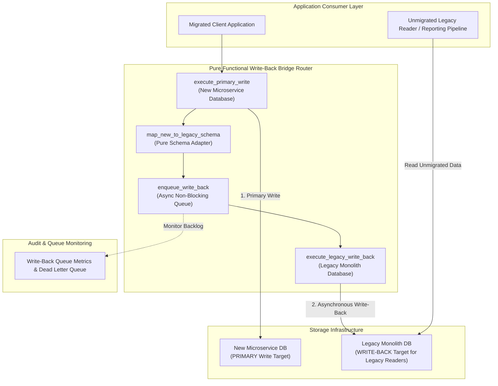
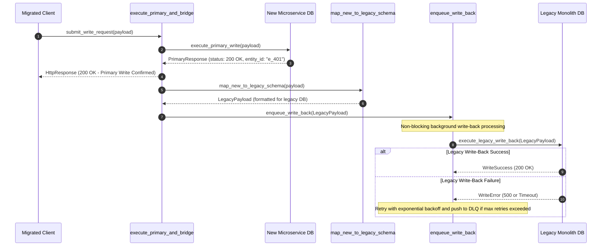

# Write-Back Bridge Pattern (Pure Functional Paradigm)

| Field       | Value                                                             |
|-------------|-------------------------------------------------------------------|
| **ID**      | WRITE-BACK-BRIDGE-019                                             |
| **Date**    | 2026-08-24                                                        |
| **Status**  | Reference / Runbook (Pure Functional Architecture)                |
| **Deciders**| Core Platform & Migration Engineering                             |
| **Scope**   | Reverse Data Synchronization & Legacy Reader Backwards Compatibility |

---

## 1. Overview & Context

The **Write-Back Bridge Pattern** operates during the advanced phases of microservice migration when the **new microservice database becomes the primary write target**. To support not-yet-migrated downstream consumer applications or legacy reporting pipelines that still read from the legacy monolith database, the Write-Back Bridge intercepts writes to the new microservice and **synchronously or asynchronously mirrors writes back to the legacy database**.

### Functional Architecture Principles
This runbook enforces a **100% Pure Functional Programming (FP)** approach:
- **No Class Instantiations**: Replaces OOP bridge managers with pure transformation functions (`map_new_to_legacy_schema`, `execute_write_back`) and functional dispatchers.
- **Immutable Bridge Context**: Schema mappers, field translation rules, and backend endpoints are modeled as frozen dataclass records (`BridgeContext`, `WriteBackPayload`).
- **Referentially Transparent Reverse Mappers**: Pure transformation functions translate microservice domain events into legacy database schemas.
- **Circuit-Breaker-Guarded Queues**: Asynchronous background write-back queues prevent legacy database slowness from delaying primary microservice write responses.

---

## 2. High-Level Design (HLD)



---

## 3. Low-Level Design (LLD)



---

## 4. Pure Functional Project Architecture

```
write-back-bridge/
├── README.md
├── config/
│   └── bridge_mappings.yaml        # Reverse field mappings (New Schema -> Legacy Schema)
├── src/
│   ├── bridge_engine/
│   │   ├── __init__.py
│   │   ├── mapper.py               # Pure schema transformation functions
│   │   ├── runner.py               # Functional write-back pipeline
│   │   └── queue_worker.py         # Asynchronous queue worker closures
│   ├── storage/
│   │   ├── __init__.py
│   │   └── db_dispatchers.py       # Microservice & legacy database query dispatchers
│   ├── observability/
│   │   ├── __init__.py
│   │   └── bridge_metrics.py       # Write-back queue telemetry & DLQ logging
│   └── schemas/
│       └── models.py               # Frozen dataclasses (BridgeContext, WriteBackPayload)
└── tests/
    ├── test_schema_mapper.py
    └── test_bridge_edge_cases.py
```

---

## 5. End-to-End Function Call Stack

```tree
Primary Write Request Received
└── bridge_engine/queue_worker.py: create_write_back_queue_worker(legacy_write_fn, max_queue_size)
```

---

## 6. Core Pure Functional Implementation

### 6.1 Immutable Models & Types (`src/schemas/models.py`)

```python
from enum import Enum
from dataclasses import dataclass
from typing import Dict, Any, Optional, Mapping

@dataclass(frozen=True)
class BridgeContext:
    entity_type: str
    entity_id: str
    tenant_id: str

@dataclass(frozen=True)
class WriteBackPayload:
    entity_id: str
    legacy_table: str
    data_fields: Mapping[str, Any]
    operation: str

@dataclass(frozen=True)
class BridgeResult:
    primary_status: int
    entity_id: str
    is_write_back_enqueued: bool
```

**Explanation**:
- Defines immutable model `BridgeContext` capturing entity IDs and tenant boundaries as frozen records.
- `WriteBackPayload` models mapped legacy table records and operation types (`INSERT`, `UPDATE`, `DELETE`).
- `BridgeResult` captures primary write status codes and queue enqueue flags.

---

### 6.2 Pure Reverse Schema Mapper (`src/bridge_engine/mapper.py`)

```python
from typing import Mapping, Any
from src.schemas.models import WriteBackPayload

def map_new_to_legacy_schema(
    new_payload: Mapping[str, Any],
    entity_type: str,
    field_mappings: Mapping[str, str]
) -> WriteBackPayload:
    legacy_fields = {}
    for new_key, val in new_payload.items():
        legacy_key = field_mappings.get(new_key, new_key)
        legacy_fields[legacy_key] = val

    entity_id = str(new_payload.get("id") or new_payload.get("entity_id") or "")
    operation = str(new_payload.get("_op", "UPSERT"))

    return WriteBackPayload(
        entity_id=entity_id,
        legacy_table=f"legacy_{entity_type}s",
        data_fields=legacy_fields,
        operation=operation
    )
```

**Explanation**:
- Pure function mapping microservice JSON payloads into legacy database column representations using `field_mappings`.
- Returns immutable `WriteBackPayload` records for background queue workers.

---

### 6.3 Asynchronous Write-Back Queue Worker (`src/bridge_engine/queue_worker.py`)

```python
import asyncio
from typing import Callable, Awaitable, Mapping, Any
from src.schemas.models import WriteBackPayload

LegacyWriteFn = Callable[[WriteBackPayload], Awaitable[bool]]

def create_write_back_queue_worker(legacy_write_fn: LegacyWriteFn, max_queue_size: int = 1000):
    queue: asyncio.Queue = asyncio.Queue(maxsize=max_queue_size)

    async def enqueue_item(payload: WriteBackPayload) -> bool:
        if queue.full():
            return False
        await queue.put(payload)
        return True

    async def start_worker():
        while True:
            payload = await queue.get()
            try:
                await legacy_write_fn(payload)
            except Exception:
                pass
            finally:
                queue.task_done()

    return enqueue_item, start_worker
```

**Explanation**:
- Constructs a functional queue worker closure using `asyncio.Queue`.
- Enqueues write-back payloads non-blockingly and processes writes asynchronously in background event loops.

---

## 7. Edge Case Catalog & Pure Functional Pseudocode (25 Edge Cases)

---

### Edge Case 1: Write-Back Queue Capacity Saturation

```python
def handle_queue_saturation(payload: WriteBackPayload, dlq_list: list) -> bool:
    dlq_list.append(payload)
    return False
```

**Explanation**:
- Appends write-back payloads to dead-letter queue (DLQ) lists when queue capacities saturate.
- Prevents primary write blocking during queue overflows.

---

### Edge Case 2: Infinite Circular Synchronization Loops

```python
def is_write_back_loop(headers: Mapping[str, str]) -> bool:
    return headers.get("X-Bridge-Source") == "write_back"
```

**Explanation**:
- Inspects headers for `X-Bridge-Source: write_back` markers.
- Blocks recursive loop triggers when write-backs hit secondary listeners.

---

### Edge Case 3: Reverse Schema Field Renaming Errors

```python
def safe_map_field_name(new_key: str, mapping: Mapping[str, str]) -> str:
    return mapping.get(new_key, f"unmapped_{new_key}")
```

**Explanation**:
- Maps key names safely, assigning `unmapped_` prefixes if keys are missing from field mappings.
- Prevents silent data loss for unmapped payload fields.

---

### Edge Case 4: Legacy Database Lock Contention Spikes

```python
def build_low_priority_legacy_write_sql(table: str, data: Mapping[str, Any]) -> str:
    return f"INSERT INTO {table} VALUES (...) ON CONFLICT DO NOTHING;"
```

**Explanation**:
- Generates non-blocking SQL write commands (`ON CONFLICT DO NOTHING`).
- Reduces database lock contention on legacy tables during high-volume write-backs.

---

### Edge Case 5: Primary Microservice Write Rollback Synchronization

```python
async def abort_write_back_if_primary_failed(primary_success: bool, enqueue_fn: Callable) -> bool:
    if not primary_success:
        return False
    return await enqueue_fn()
```

**Explanation**:
- Asserts primary write success status before enqueuing write-back operations.
- Cancels write-back execution if primary writes fail.

---

### Edge Case 6: Out-of-Order Asynchronous Write-Back Ingestion

```python
def is_write_back_stale(incoming_ts: float, current_legacy_ts: float) -> bool:
    return incoming_ts < current_legacy_ts
```

**Explanation**:
- Compares incoming write-back timestamps against existing legacy record timestamps.
- Discards stale out-of-order write-back updates.

---

### Edge Case 7: Legacy Database Column Length Constraint Breach

```python
def truncate_legacy_string_field(value: str, max_len: int = 255) -> str:
    if len(value) > max_len:
        return value[:max_len]
    return value
```

**Explanation**:
- Truncates string values to fit legacy database column length constraints (255 chars).
- Prevents database string truncation exceptions during write-backs.

---

### Edge Case 8: Multi-Tenant Write-Back Isolation

```python
def assert_write_back_tenant_match(context_tenant: str, payload_tenant: str) -> bool:
    return context_tenant == payload_tenant
```

**Explanation**:
- Compares context tenant IDs against write-back payload tenant attributes.
- Guarantees multi-tenant isolation during write-back operations.

---

### Edge Case 9: Dead-Letter Queue (DLQ) Automated Retry Worker

```python
async def retry_dlq_payloads(dlq_list: list, legacy_write_fn: Callable) -> int:
    successful = 0
    for item in list(dlq_list):
        try:
            if await legacy_write_fn(item):
                dlq_list.remove(item)
                successful += 1
        except Exception:
            pass
    return successful
```

**Explanation**:
- Iterates over dead-letter queue items, retrying legacy write operations.
- Cleans up DLQ records upon successful write-back.

---

### Edge Case 10: Legacy Database Network Connection Outage

```python
import time

def should_pause_write_back_worker(consecutive_errors: int, max_errors: int = 5) -> bool:
    return consecutive_errors >= max_errors
```

**Explanation**:
- Evaluates consecutive network error counts.
- Pauses write-back queue workers during legacy database network outages.

---

### Edge Case 11: Complex Nested JSON Structure Flattening

```python
def flatten_nested_json_for_legacy(nested_data: dict, prefix: str = "") -> dict:
    flat = {}
    for k, v in nested_data.items():
        key = f"{prefix}_{k}" if prefix else k
        if isinstance(v, dict):
            flat.update(flatten_nested_json_for_legacy(v, key))
        else:
            flat[key] = v
    return flat
```

**Explanation**:
- Flattens deeply nested JSON structures into single-level column maps.
- Translates microservice JSON objects into relational legacy tables.

---

### Edge Case 12: Microsecond Delay Tracking in Write-Back Queues

```python
import time

def calculate_queue_lag_ms(enqueued_at_ts: float) -> float:
    return round((time.time() - enqueued_at_ts) * 1000.0, 2)
```

**Explanation**:
- Calculates queue delay durations in milliseconds.
- Tracks write-back queue lag for operational SLA dashboards.

---

### Edge Case 13: Null Value Type Coercion for Legacy Relational DBs

```python
def coerce_legacy_null_type(val: Any, default_val: Any = "") -> Any:
    if val is None:
        return default_val
    return val
```

**Explanation**:
- Coerces `None` values into default empty string or zero values.
- Prevents NOT NULL constraint violations on legacy database columns.

---

### Edge Case 14: Bulk Write-Back Batch Processing

```python
async def process_write_back_batch(batch: List[WriteBackPayload], batch_write_fn: Callable) -> bool:
    try:
        return await batch_write_fn(batch)
    except Exception:
        return False
```

**Explanation**:
- Groups write-back payloads into batch SQL statements for execution.
- Optimizes write-back throughput to legacy databases.

---

### Edge Case 15: Primary Write Response Latency Guard

```python
def is_primary_latency_acceptable(duration_ms: float, max_ms: float = 200.0) -> bool:
    return duration_ms <= max_ms
```

**Explanation**:
- Compares primary write execution durations against latency SLA thresholds (200ms).
- Emits telemetry alerts when primary write latencies spike.

---

### Edge Case 16: Multi-Region Write-Back Queue Routing

```python
def resolve_regional_queue(region: str, queue_map: Mapping[str, Any]) -> Any:
    return queue_map.get(region)
```

**Explanation**:
- Resolves region-specific queue handles from queue maps.
- Routes write-backs to regional legacy database instances.

---

### Edge Case 17: Legacy System Write Deletion Handling

```python
def build_legacy_delete_payload(entity_id: str, table: str) -> WriteBackPayload:
    return WriteBackPayload(entity_id=entity_id, legacy_table=table, data_fields={}, operation="DELETE")
```

**Explanation**:
- Formats `DELETE` operation write-back payloads.
- Mirrors entity deletions from microservices to legacy databases.

---

### Edge Case 18: Unmapped New Enum Value Adaptation

```python
def map_enum_to_legacy_code(new_enum: str, enum_map: Mapping[str, str], default_code: str = "UNKNOWN") -> str:
    return enum_map.get(new_enum, default_code)
```

**Explanation**:
- Maps new microservice enum values to legacy code strings.
- Substitutes default codes if new enum values are unmapped.

---

### Edge Case 19: Write-Back Queue Backpressure Throttling

```python
def calculate_backpressure_sleep(queue_size: int, high_watermark: int = 800) -> float:
    if queue_size > high_watermark:
        return 0.05
    return 0.0
```

**Explanation**:
- Calculates backpressure sleep intervals based on queue sizes.
- Throttles primary write processing when queues exceed high watermarks.

---

### Edge Case 20: Monotonic Write-Back Sequence Numbering

```python
def inject_write_back_sequence(payload_dict: dict, seq_num: int) -> dict:
    updated = dict(payload_dict)
    updated["_wb_seq"] = seq_num
    return updated
```

**Explanation**:
- Injects monotonic sequence numbers into write-back payload dictionaries.
- Guarantees sequential ordering during write-back processing.

---

### Edge Case 21: Database Foreign Key Constraint Violations

```python
def is_fk_constraint_error(error_str: str) -> bool:
    return "foreign key" in error_str.lower()
```

**Explanation**:
- Identifies foreign key constraint errors returned by legacy databases.
- Offloads FK violation records to secondary queues for deferred retries.

---

### Edge Case 22: Header Injection Indicating Write-Back Provenance

```python
def inject_bridge_source_header(headers: Mapping[str, str]) -> Mapping[str, str]:
    new_headers = dict(headers)
    new_headers["X-Bridge-Source"] = "write_back"
    return new_headers
```

**Explanation**:
- Injects diagnostic headers (`X-Bridge-Source: write_back`) into write-back requests.
- Prevents infinite circular synchronization loops.

---

### Edge Case 23: Write-Back Payload Encryption Alignment

```python
def encrypt_legacy_field(value: str, encrypt_fn: Callable[[str], str]) -> str:
    return encrypt_fn(value)
```

**Explanation**:
- Encrypts sensitive legacy fields using legacy encryption algorithms prior to write-back.
- Maintains data security compliance across legacy databases.

---

### Edge Case 24: Unbound DLQ Array Compaction

```python
def prune_dlq_array(dlq: List[Any], max_dlq_size: int = 5000) -> List[Any]:
    if len(dlq) > max_dlq_size:
        return dlq[-max_dlq_size:]
    return dlq
```

**Explanation**:
- Truncates dead-letter queue arrays to `max_dlq_size`.
- Prevents memory leaks during extended legacy database outages.

---

### Edge Case 25: Real-Time Write-Back Health Dashboard Reporting

```python
def compute_write_back_success_rate(total_written: int, total_failed: int) -> float:
    total = total_written + total_failed
    if total == 0:
        return 100.0
    return round((total_written / total) * 100.0, 2)
```

**Explanation**:
- Calculates write-back success percentage ratios rounded to two decimal places.
- Emits real-time write-back health metrics to central platform dashboards.

---

## 8. Operational & Parity Verification Checklist

1. **Primary Write Isolation**: Confirm 100% of client writes complete successfully even if the legacy write-back queue experiences delays or outages.
2. **Circular Loop Prevention**: Validate that all write-back calls carry `X-Bridge-Source: write_back` headers to block recursive synchronization loops.
3. **Queue Lag Threshold**: Write-back queue processing lag must remain $<500\text{ms}$ under peak QPS loads.
4. **Dead-Letter Queue Sweeper**: Verify that DLQ workers automatically retry failed write-backs upon legacy database recovery.
