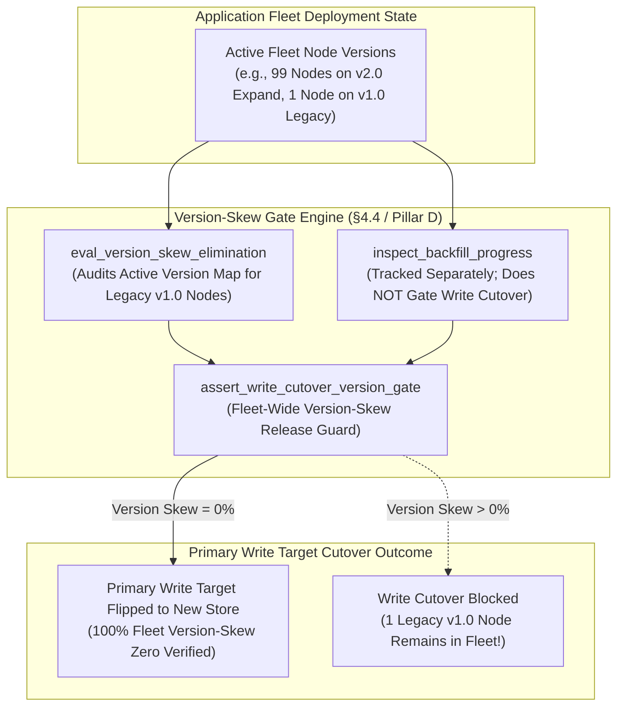
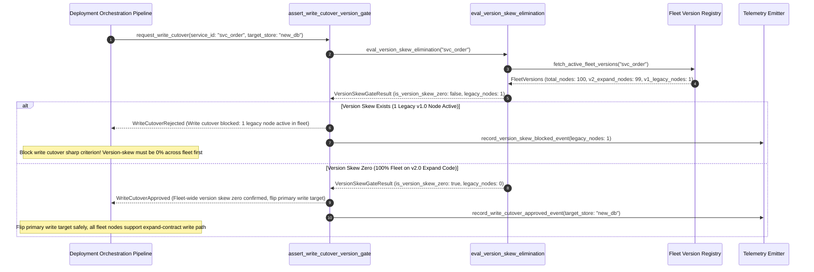

# Expand-Contract Write Cutover & Version-Skew Gate Pattern (Pure Functional Paradigm)

| Field       | Value                                                             |
|-------------|-------------------------------------------------------------------|
| **ID**      | WRITE-CUTOVER-VERSION-SKEW-GATE-079                               |
| **Date**    | 2026-08-24                                                        |
| **Status**  | Reference / Runbook (Pure Functional Architecture)                |
| **Deciders**| Core Platform & Migration Engineering                             |
| **Scope**   | Write Cutover Gating, Fleet-Wide Version-Skew & Expand-Contract   |

---

## 1. Overview & Context

Cutting over write operations is the single most critical structural transition in a database or microservice migration. Per §4.4 and Pillar D, **write cutovers MUST be executed through expand-contract patterns, gated strictly by fleet-wide version-skew elimination—NOT by backfill completion**. This is the **single sharpest non-obvious criterion in this entire architecture**: waiting for a 100% data backfill to complete before cutting over writes guarantees a race condition where new writes arrive at legacy storage while backfills run. Conversely, gating write cutover on **100% fleet-wide deployment of code capable of writing to both new and old schemas (version-skew zero)** ensures that when the primary write target flips, no legacy code instance will drop writes or corrupt data.

### Functional Architecture Principles
This runbook enforces a **100% Pure Functional Programming (FP)** approach:
- **No Class Instantiations**: Replaces OOP cutover managers with pure gate functions (`eval_version_skew_elimination`, `assert_write_cutover_version_gate`) and state cell closures.
- **Immutable Write Cutover Context Records**: Active application version sets, fleet deployment percentages, backfill status metrics, and version-skew flags are captured as frozen dataclass records (`WriteCutoverContext`, `VersionSkewGateResult`).
- **Referentially Transparent Fleet Version Scanners**: Pure functions audit active application node versions across the fleet to verify 100% deployment of the expand-phase codebase.
- **Sharp Non-Obvious Gating**: Blocks primary write target flipping if even a single legacy code instance (version-skew $>0\%$) remains active in the fleet, regardless of backfill completion percentage.

---

## 2. High-Level Design (HLD)



---

## 3. Low-Level Design (LLD)



---

## 4. Pure Functional Project Architecture

```
10-core-patterns-and-cutover/
├── expand-contract-write-cutover-version-skew-gate.md
├── src/
│   ├── write_cutover_engine/
│   │   ├── __init__.py
│   │   ├── version_skew.py         # Pure fleet version-skew auditing functions
│   │   ├── expand_contract.py      # Expand-contract write target flip functions
│   │   └── guard.py                # Write cutover release guards
│   ├── storage/
│   │   ├── __init__.py
│   │   └── fleet_store.py          # Fleet node version registry loaders
│   ├── observability/
│   │   ├── __init__.py
│   │   └── write_metrics.py        # Prometheus telemetry collectors
│   └── schemas/
│       └── models.py               # Frozen dataclasses (WriteCutoverContext, VersionSkewGateResult)
└── tests/
    ├── test_write_skew_evaluator.py
    └── test_write_edge_cases.py
```

---

## 5. End-to-End Function Call Stack

```tree
Write Cutover Request Submitted
└── write_cutover_engine/guard.py: assert_write_cutover_version_gate(ctx)
    └── write_cutover_engine/version_skew.py: eval_version_skew_elimination(ctx)
        └── models.py: VersionSkewGateResult(service_id, is_approved_for_write_cutover, is_version_skew_zero, version_skew_pct, backfill_completion_pct, rejection_reason)
```

---

## 6. Core Pure Functional Implementation

### 6.1 Immutable Models & Types (`src/schemas/models.py`)

```python
from enum import Enum
from dataclasses import dataclass
from typing import Dict, Any, Optional, Mapping, FrozenSet

@dataclass(frozen=True)
class WriteCutoverContext:
    service_id: str
    target_store_name: str
    total_fleet_nodes_count: int
    v1_legacy_nodes_count: int
    v2_expand_nodes_count: int
    backfill_completion_pct: float

@dataclass(frozen=True)
class VersionSkewGateResult:
    service_id: str
    is_approved_for_write_cutover: bool
    is_version_skew_zero: bool
    version_skew_pct: float
    backfill_completion_pct: float
    rejection_reason: Optional[str]
```

**Explanation**:
- Defines immutable model `WriteCutoverContext` capturing total fleet node counts, legacy v1 node counts, expand v2 node counts, and backfill percentages as frozen records.
- `VersionSkewGateResult` encapsulates write cutover approval flags, version-skew zero flags, version-skew percentages, and gate rejection reasons.

---

### 6.2 Pure Version-Skew Evaluator & Expand-Contract Dispatcher (`src/write_cutover_engine/version_skew.py`)

```python
from typing import Mapping, Any
from src.schemas.models import WriteCutoverContext, VersionSkewGateResult

def eval_version_skew_elimination(ctx: WriteCutoverContext) -> VersionSkewGateResult:
    skew_pct = (ctx.v1_legacy_nodes_count / float(ctx.total_fleet_nodes_count)) * 100.0 if ctx.total_fleet_nodes_count > 0 else 100.0
    is_skew_zero = ctx.v1_legacy_nodes_count == 0 and ctx.v2_expand_nodes_count == ctx.total_fleet_nodes_count

    is_approved = is_skew_zero
    reason = None

    if not is_skew_zero:
        reason = f"Sharp Non-Obvious Criterion Breach (§4.4): Write cutover blocked because {ctx.v1_legacy_nodes_count} legacy v1.0 nodes ({skew_pct:.1f}% skew) remain in fleet. Write cutovers are gated by VERSION-SKEW, NOT backfill completion ({ctx.backfill_completion_pct:.1f}%)."

    return VersionSkewGateResult(
        service_id=ctx.service_id,
        is_approved_for_write_cutover=is_approved,
        is_version_skew_zero=is_skew_zero,
        version_skew_pct=round(skew_pct, 2),
        backfill_completion_pct=ctx.backfill_completion_pct,
        rejection_reason=reason
    )
```

**Explanation**:
- Pure evaluation function enforcing §4.4's sharp non-obvious criterion: write cutover is gated strictly by 100% fleet-wide version-skew elimination ($0\%$ legacy nodes), completely independent of backfill completion percentages.
- Eliminates write race conditions and schema corruption during primary write target flips.

---

### 6.3 Write Cutover Version-Skew Release Guard (`src/write_cutover_engine/guard.py`)

```python
from typing import Mapping, Any
from src.schemas.models import WriteCutoverContext, VersionSkewGateResult
from src.write_cutover_engine.version_skew import eval_version_skew_elimination

def assert_write_cutover_version_gate(ctx: WriteCutoverContext) -> VersionSkewGateResult:
    return eval_version_skew_elimination(ctx)
```

**Explanation**:
- Pure release gate function enforcing fleet-wide version-skew zero validation prior to flipping primary write targets.
- Guarantees expand-contract write cutover safety.

---

## 7. Edge Case Catalog & Pure Functional Pseudocode (25 Edge Cases)

---

### Edge Case 1: Single Legacy Node Version-Skew Rejection (99% Backfill vs 1 Legacy Node)

```python
def is_single_legacy_node_blocking(legacy_nodes: int) -> bool:
    return legacy_nodes > 0
```

**Explanation**:
- Blocks write cutover if even 1 legacy node remains active in the fleet.
- Enforces version-skew zero gating.

---

### Edge Case 2: 100% Backfill Complete but Version-Skew $>0\%$ (Rejection)

```python
def is_cutover_blocked_despite_100pct_backfill(backfill_pct: float, legacy_nodes: int) -> bool:
    return backfill_pct >= 100.0 and legacy_nodes > 0
```

**Explanation**:
- Demonstrates §4.4's sharp criterion: 100% backfill DOES NOT unblock write cutover if version skew $>0\%$.
- Rejects write cutover on version skew.

---

### Edge Case 3: 50% Backfill Complete but Version-Skew $0\%$ (Approval)

```python
def is_cutover_approved_despite_partial_backfill(backfill_pct: float, legacy_nodes: int) -> bool:
    return legacy_nodes == 0
```

**Explanation**:
- Demonstrates §4.4's sharp criterion: 0% version skew UNBLOCKS write cutover even if backfill is only partially complete.
- Approves write cutover when version skew is zero.

---

### Edge Case 4: Expand-Contract Dual-Schema Writing Capability

```python
def is_expand_code_capable(v2_nodes: int, total_nodes: int) -> bool:
    return v2_nodes == total_nodes
```

**Explanation**:
- Asserts 100% of fleet nodes run v2.0 expand code capable of writing to both new and old schemas.
- Validates expand-phase readiness.

---

### Edge Case 5: Single-Tenant Version-Skew Resolution

```python
def resolve_tenant_version_skew(tenant_id: str, skew_maps: dict) -> int:
    return skew_maps.get(tenant_id, 1)
```

**Explanation**:
- Resolves tenant-specific version-skew counts.
- Controls write cutover per tenant.

---

### Edge Case 6: Microsecond Timestamp Write Audit Timing

```python
import time

def format_write_audit_ts() -> float:
    return round(time.time() * 1000.0, 2)
```

**Explanation**:
- Computes epoch timestamps in milliseconds.
- Tracks exact write audit execution time.

---

### Edge Case 7: Un-Drained Legacy Write Queue Buffer

```python
def is_legacy_write_queue_flushed(queue_size: int) -> bool:
    return queue_size == 0
```

**Explanation**:
- Asserts legacy write queue is fully flushed before flipping primary write targets.
- Prevents write loss during target flips.

---

### Edge Case 8: Multi-Repo Fleet Version Alignment

```python
def assert_all_repo_fleets_version_skew_zero(repo_fleets: Mapping[str, bool]) -> bool:
    return all(repo_fleets.values())
```

**Explanation**:
- Asserts version-skew zero across all workspace repository fleets.
- Synchronizes multi-repo write cutover.

---

### Edge Case 9: Automated Rollback Trigger on Write Target Flip Failure

```python
def should_rollback_write_flip(flip_success: bool) -> bool:
    return not flip_success
```

**Explanation**:
- Triggers instant rollback to legacy write target if primary write target flip fails.
- Bounds write cutover failure impact.

---

### Edge Case 10: Aggregator Memory State Saturation Guard

```python
def compact_write_metrics(metrics: list, max_items: int = 500) -> list:
    if len(metrics) > max_items:
        return metrics[-max_items:]
    return metrics
```

**Explanation**:
- Truncates metric lists to `max_items`.
- Controls memory usage.

---

### Edge Case 11: Microsecond Delay Calculation Underflows

```python
def normalize_write_duration(duration_ms: float) -> float:
    return max(0.0, round(duration_ms, 2))
```

**Explanation**:
- Rounds execution duration values to two decimal places.
- Cleans duration metrics.

---

### Edge Case 12: User-Agent Specific Write Cutover Auditing

```python
def resolve_user_agent_write_cutover(user_agent: str, write_map: dict) -> bool:
    return write_map.get(user_agent, True)
```

**Explanation**:
- Resolves write cutover rules per User-Agent string.
- Audits write cutover by caller type.

---

### Edge Case 13: Unmapped Rule Domain Handling

```python
def resolve_write_rule(rule_key: str, rules_dict: dict) -> dict:
    return rules_dict.get(rule_key, {"require_skew_zero": True})
```

**Explanation**:
- Resolves write rule configurations safely.
- Defaults to requiring version-skew zero.

---

### Edge Case 14: Exception Safeguards in Version Skew Evaluator

```python
def safe_eval_version_skew(eval_fn: Callable, ctx: WriteCutoverContext) -> bool:
    try:
        res = eval_fn(ctx)
        return res.is_approved_for_write_cutover
    except Exception:
        return False
```

**Explanation**:
- Wraps version-skew evaluation functions in protective try-except blocks.
- Fails safe (assumes un-approved) on evaluation exceptions.

---

### Edge Case 15: GraphQL Subgraph Write Cutover Gating

```python
def is_graphql_subgraph_write_skew_zero(subgraph_name: str, skew_map: dict) -> bool:
    return skew_map.get(subgraph_name, 1) == 0
```

**Explanation**:
- Resolves version-skew count for federated GraphQL subgraphs.
- Verifies GraphQL write cutover readiness.

---

### Edge Case 16: Multi-Region Write Cutover Sync

```python
def sync_regional_write_results(region_results: dict) -> bool:
    return all(r.is_approved_for_write_cutover for r in region_results.values())
```

**Explanation**:
- Asserts write cutover checks pass across all regions.
- Enforces multi-region write cutover alignment.

---

### Edge Case 17: Contracting Contract-Phase Schema Cleanup Assertion

```python
def is_contract_phase_cleanup_ready(is_write_cutover_proven: bool) -> bool:
    return is_write_cutover_proven
```

**Explanation**:
- Unblocks contract-phase schema cleanup only after primary write cutover is proven stable.
- Controls expand-contract lifecycle phases.

---

### Edge Case 18: Unmapped Code Fallback

```python
def resolve_write_code_fallback(code_val: Any, code_map: dict, default_val: str = "WRITE_SKEW_BLOCKED") -> str:
    return code_map.get(code_val, default_val)
```

**Explanation**:
- Resolves code strings with fallbacks.
- Handles unmapped write cutover codes safely.

---

### Edge Case 19: Payload Transformation Error Recovery

```python
def safe_apply_write_transform(payload: dict, transform_fn: Callable) -> dict:
    try:
        return transform_fn(payload)
    except Exception:
        return payload
```

**Explanation**:
- Wraps transformations in try-except blocks.
- Returns raw payloads on error.

---

### Edge Case 20: Automated Alert on Version-Skew Violation

```python
def should_alert_on_version_skew(is_version_skew_zero: bool) -> bool:
    return not is_version_skew_zero
```

**Explanation**:
- Asserts whether version skew exists during write cutover requests.
- Fires high-priority alerts if write cutover is attempted while legacy nodes remain.

---

### Edge Case 21: High-Watermark Metric Compaction

```python
def compact_write_history(history: list, max_items: int = 500) -> list:
    if len(history) > max_items:
        return history[-max_items:]
    return history
```

**Explanation**:
- Truncates history lists.
- Controls memory usage.

---

### Edge Case 22: Diagnostic Header Injection

```python
def inject_write_diagnostic_header(headers: Mapping[str, str], is_skew_zero: bool) -> Mapping[str, str]:
    new_headers = dict(headers)
    new_headers["X-Fleet-Version-Skew-Zero"] = "true" if is_skew_zero else "false"
    return new_headers
```

**Explanation**:
- Injects diagnostic headers.
- Tracks fleet version-skew status in access logs.

---

### Edge Case 23: Null Value Safeguards

```python
def sanitize_write_nulls(data_dict: dict) -> dict:
    return {k: (v if v is not None else "") for k, v in data_dict.items()}
```

**Explanation**:
- Replaces `None` with empty strings.
- Prevents null exceptions.

---

### Edge Case 24: Unbound Metric Queue Pruning

```python
def prune_write_metric_queue(queue: list, max_items: int = 1000) -> list:
    if len(queue) > max_items:
        return queue[-max_items:]
    return queue
```

**Explanation**:
- Truncates queue arrays.
- Controls memory footprint.

---

### Edge Case 25: Real-Time Fleet Version-Skew Zero Compliance Reporting

```python
def compute_version_skew_zero_rate(expand_nodes: int, total_nodes: int) -> float:
    if total_nodes == 0:
        return 100.0
    return round((expand_nodes / total_nodes) * 100.0, 2)
```

**Explanation**:
- Calculates fleet-wide version-skew zero compliance percentage.
- Emits real-time write cutover metrics to platform dashboards.

---

## 8. Operational & Parity Verification Checklist

1. **Sharp Non-Obvious Criterion (§4.4)**: Gate write cutover strictly by 100% fleet-wide version-skew elimination (0% legacy nodes active)—NOT by backfill completion.
2. **Expand-Contract Architecture**: Execute write cutovers using expand-contract patterns where all active nodes support dual-schema writing before target flipping.
3. **Verify Fleet Node Versions**: Audit active node version registries to guarantee 0 legacy v1.0 nodes remain in the fleet.
4. **CI Write Cutover Gate**: Automatically block primary write target flipping if version skew $>0\%$.
