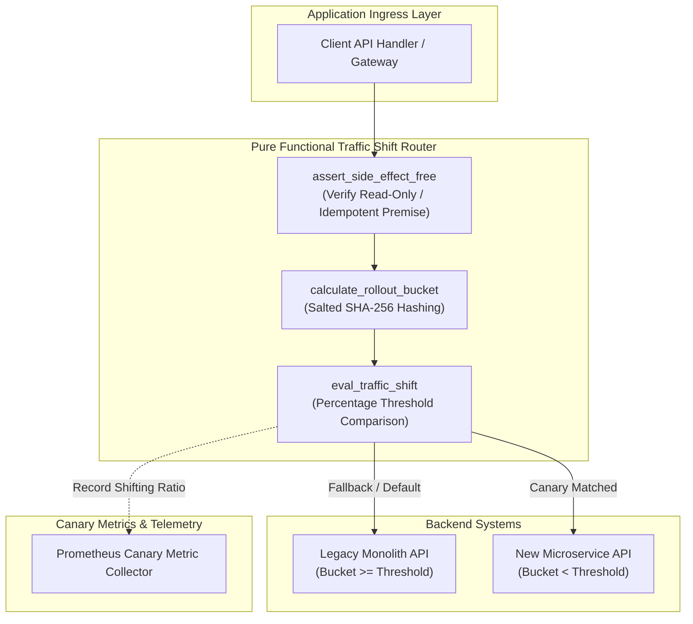
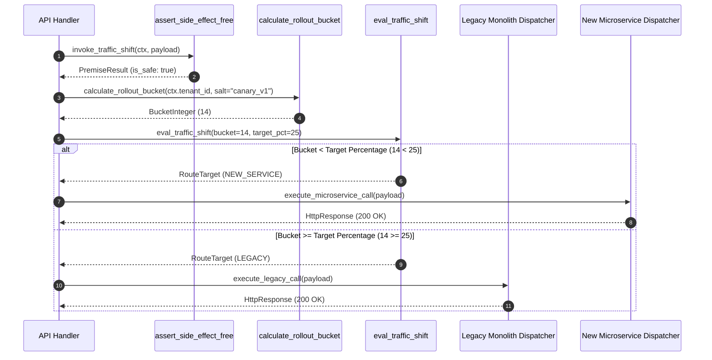

# Percentage-Based Traffic Shifting Pattern (Pure Functional Paradigm)

| Field       | Value                                                             |
|-------------|-------------------------------------------------------------------|
| **ID**      | PERCENTAGE-TRAFFIC-SHIFTING-013                                   |
| **Date**    | 2026-08-24                                                        |
| **Status**  | Reference / Runbook (Pure Functional Architecture)                |
| **Deciders**| Core Platform & Migration Engineering                             |
| **Scope**   | Canary Traffic Shifting & Side-Effect-Free Routing                |

---

## 1. Overview & Context

**Percentage-Based Traffic Shifting** is the default canary routing mechanism for incremental microservice migrations. It gradually diverts a configurable percentage of incoming production traffic (e.g. 1%, 5%, 25%, 50%, 100%) from the legacy monolith to the new microservice. This mechanism relies on the **side-effect-free premise**: operations must be either idempotent or read-only during initial percentage rollouts to prevent partial data corruption.

### Functional Architecture Principles
This runbook enforces a **100% Pure Functional Programming (FP)** approach:
- **No Class Instantiations**: Replaces OOP traffic routers and canary managers with pure hashing functions (`calculate_rollout_bucket`, `eval_traffic_shift`) and functional dispatchers.
- **Immutable Routing Context**: Target percentage thresholds, tenant keys, and rollout configurations are modeled as frozen dataclass records (`TrafficContext`, `ShiftConfig`).
- **Referentially Transparent Bucketing**: SHA-256 salted hashing functions guarantee sticky deterministic tenant bucket assignments mapping `(TenantID, Percentage) -> TargetSystem`.
- **Side-Effect Safety Guards**: Pure assertion functions verify side-effect-free premises prior to executing percentage-based traffic splits.

---

## 2. High-Level Design (HLD)



---

## 3. Low-Level Design (LLD)



---

## 4. Pure Functional Project Architecture

```
percentage-traffic-shifting/
├── README.md
├── config/
│   └── traffic_rules.yaml          # Canary percentage thresholds per endpoint
├── src/
│   ├── shift_engine/
│   │   ├── __init__.py
│   │   ├── hasher.py               # Pure SHA-256 bucket calculation functions
│   │   ├── evaluator.py            # Percentage threshold evaluation functions
│   │   └── safety_guard.py         # Side-effect premise validation functions
│   ├── storage/
│   │   ├── __init__.py
│   │   └── target_dispatcher.py    # Functional target backend dispatchers
│   ├── observability/
│   │   ├── __init__.py
│   │   └── canary_metrics.py       # Prometheus canary metric collectors
│   └── schemas/
│       └── models.py               # Frozen dataclasses (TrafficContext, ShiftConfig)
└── tests/
    ├── test_traffic_hasher.py
    └── test_shift_edge_cases.py
```

---

## 5. End-to-End Function Call Stack

```tree
API Request Received
└── shift_engine/safety_guard.py: assert_side_effect_free(ctx, payload, Any])
```

---

## 6. Core Pure Functional Implementation

### 6.1 Immutable Models & Types (`src/schemas/models.py`)

```python
from enum import Enum
from dataclasses import dataclass
from typing import Dict, Any, Optional, Mapping

class RouteTarget(str, Enum):
    LEGACY = "legacy"
    NEW_SERVICE = "new_service"

@dataclass(frozen=True)
class TrafficContext:
    tenant_id: str
    endpoint: str
    method: str
    headers: Mapping[str, str]

@dataclass(frozen=True)
class ShiftConfig:
    endpoint: str
    rollout_percentage: int
    feature_salt: str
    is_mutation_allowed: bool
```

**Explanation**:
- Defines immutable enumeration `RouteTarget` specifying canary routing targets.
- `TrafficContext` models incoming caller identifiers and HTTP methods as frozen records.
- `ShiftConfig` captures target rollout percentages and feature salt strings.

---

### 6.2 Deterministic Salted Hashing & Evaluator (`src/shift_engine/hasher.py`)

```python
import hashlib
from typing import Mapping, Any
from src.schemas.models import TrafficContext, ShiftConfig, RouteTarget

def calculate_rollout_bucket(key: str, salt: str = "canary_v1", modulus: int = 100) -> int:
    salted_key = f"{salt}:{key}".encode("utf-8")
    hash_bytes = hashlib.sha256(salted_key).digest()
    integer_val = int.from_bytes(hash_bytes[:4], byteorder="big")
    return integer_val % modulus

def eval_traffic_shift(ctx: TrafficContext, config: ShiftConfig) -> RouteTarget:
    if config.rollout_percentage <= 0:
        return RouteTarget.LEGACY
    if config.rollout_percentage >= 100:
        return RouteTarget.NEW_SERVICE

    bucket = calculate_rollout_bucket(key=ctx.tenant_id, salt=config.feature_salt)
    if bucket < config.rollout_percentage:
        return RouteTarget.NEW_SERVICE
    return RouteTarget.LEGACY
```

**Explanation**:
- `calculate_rollout_bucket` uses SHA-256 to hash tenant IDs into deterministic 0–99 integer buckets.
- `eval_traffic_shift` evaluates calculated buckets against configured rollout percentages without mutating state.

---

### 6.3 Side-Effect Safety Guard (`src/shift_engine/safety_guard.py`)

```python
from typing import Mapping, Any
from src.schemas.models import TrafficContext

def assert_side_effect_free(ctx: TrafficContext, payload: Mapping[str, Any]) -> bool:
    read_methods = {"GET", "HEAD", "OPTIONS"}
    if ctx.method.upper() in read_methods:
        return True
    if ctx.headers.get("X-Idempotency-Key"):
        return True
    return False
```

**Explanation**:
- Asserts that requests are read-only (`GET`, `HEAD`) or contain explicit idempotency keys.
- Enforces the side-effect-free premise prior to percentage-based canary routing.

---

## 7. Edge Case Catalog & Pure Functional Pseudocode (25 Edge Cases)

---

### Edge Case 1: Side-Effect Leakage During Early Canary Rollout

```python
def block_canary_mutations_if_unsafe(is_safe_premise: bool, target: RouteTarget) -> RouteTarget:
    if not is_safe_premise and target == RouteTarget.NEW_SERVICE:
        return RouteTarget.LEGACY
    return target
```

**Explanation**:
- Reverts traffic to `LEGACY` if mutation operations violate side-effect-free premises.
- Protects new microservices from unintended data side-effects during early canary phases.

---

### Edge Case 2: Bucket Alignment Skew Across Multiple Rollouts

```python
def generate_unique_feature_salt(feature_key: str, deployment_id: str) -> str:
    return f"{feature_key}_salt_{deployment_id}"
```

**Explanation**:
- Combines feature keys with deployment IDs to produce unique salt strings.
- Prevents bucket alignment where the same 5% of tenants are repeatedly selected for every canary rollout.

---

### Edge Case 3: Low-Traffic Tenant Fleet Bucket Skew

```python
def eval_user_fallback_bucket(tenant_id: str, user_id: Optional[str], salt: str) -> int:
    key = f"{tenant_id}:{user_id}" if user_id else tenant_id
    return calculate_rollout_bucket(key=key, salt=salt)
```

**Explanation**:
- Combines tenant IDs and user IDs for bucket hashing when tenant fleet cardinality is low.
- Achieves uniform percentage distribution across small enterprise accounts.

---

### Edge Case 4: Micro-Percentage Granularity (e.g., 0.1% Traffic Shift)

```python
def calculate_micro_rollout_bucket(key: str, salt: str = "micro_v1") -> float:
    salted_key = f"{salt}:{key}".encode("utf-8")
    hash_int = int(hashlib.sha256(salted_key).hexdigest(), 16)
    return (hash_int % 1000) / 10.0
```

**Explanation**:
- Hashes keys into 0.0–99.9 float buckets using modulus 1000.
- Supports fine-grained micro-percentage canary rollouts (e.g. 0.1% or 0.5%).

---

### Edge Case 5: Sudden QPS Burst Overwhelming Canary Target

```python
def is_canary_qps_overloaded(current_qps: int, max_canary_qps: int = 500) -> bool:
    return current_qps >= max_canary_qps
```

**Explanation**:
- Compares current canary QPS against maximum microservice throughput capacity.
- Reverts excess canary traffic back to legacy backends during traffic spikes.

---

### Edge Case 6: Dynamic Threshold Hot-Reload Race Conditions

```python
def update_traffic_threshold_cell(cell: dict, new_percentage: int) -> dict:
    updated = dict(cell)
    updated["rollout_percentage"] = new_percentage
    return updated
```

**Explanation**:
- Returns new immutable configuration snapshot dictionaries.
- Enables zero-downtime canary percentage threshold adjustments.

---

### Edge Case 7: Anonymous Traffic Session Flipping

```python
def resolve_anonymous_cookie_key(raw_headers: Mapping[str, str], default_ip: str) -> str:
    cookie_anon = raw_headers.get("X-Anon-Session-ID")
    if cookie_anon:
        return cookie_anon
    return raw_headers.get("X-Forwarded-For", default_ip)
```

**Explanation**:
- Extracts anonymous session IDs or IP addresses for bucket hashing.
- Prevents session flipping for unauthenticated web traffic.

---

### Edge Case 8: Multi-Region Percentage Threshold Variance

```python
def resolve_regional_rollout_pct(region: str, regional_config: Mapping[str, int], default_pct: int) -> int:
    return regional_config.get(region, default_pct)
```

**Explanation**:
- Resolves region-specific percentage thresholds from configuration maps.
- Enables progressive region-by-region canary rollouts.

---

### Edge Case 9: Sticky Session Session Persistence Override

```python
def check_sticky_session_override(headers: Mapping[str, str]) -> Optional[RouteTarget]:
    override = headers.get("X-Canary-Override", "").lower()
    if override == "new":
        return RouteTarget.NEW_SERVICE
    elif override == "legacy":
        return RouteTarget.LEGACY
    return None
```

**Explanation**:
- Inspects `X-Canary-Override` headers for explicit routing instructions.
- Enables internal QA teams to force specific routing targets during testing.

---

### Edge Case 10: Zero-Traffic Endpoint Rollout Evaluation

```python
def is_endpoint_active(request_count: int) -> bool:
    return request_count > 0
```

**Explanation**:
- Checks if endpoint traffic volume is greater than zero.
- Skips canary metrics emission for inactive endpoints.

---

### Edge Case 11: Header Sanitization Preserving Canary Diagnostics

```python
def inject_canary_debug_headers(headers: Mapping[str, str], bucket: int, target: RouteTarget) -> Mapping[str, str]:
    new_headers = dict(headers)
    new_headers["X-Canary-Bucket"] = str(bucket)
    new_headers["X-Canary-Target"] = target.value
    return new_headers
```

**Explanation**:
- Injects diagnostic headers (`X-Canary-Bucket`, `X-Canary-Target`) into outbound responses.
- Provides client-side visibility into canary routing decisions.

---

### Edge Case 12: High-Latitude Hashing Collision Mitigations

```python
def compute_double_salted_bucket(key: str, primary_salt: str, secondary_salt: str) -> int:
    combined = f"{primary_salt}:{key}:{secondary_salt}".encode("utf-8")
    return int(hashlib.sha256(combined).hexdigest(), 16) % 100
```

**Explanation**:
- Combines primary and secondary salt strings during bucket hashing.
- Eliminates collision clustering across large tenant datasets.

---

### Edge Case 13: Circuit Breaker Trip Auto-Reversion to 0% Canary

```python
def check_canary_health_trip(circuit_open: bool, current_pct: int) -> int:
    if circuit_open:
        return 0
    return current_pct
```

**Explanation**:
- Forces rollout percentages to 0% when target microservice circuit breakers trip.
- Immediately halts canary traffic during microservice outages.

---

### Edge Case 14: Partial Read Path Migration Gating

```python
def is_read_only_path(method: str) -> bool:
    return method.upper() in {"GET", "HEAD"}
```

**Explanation**:
- Checks if incoming request methods are strictly read-only.
- Restricts early canary rollouts to read operations.

---

### Edge Case 15: Cross-Domain Cookie Attribute Preservation

```python
def preserve_canary_cookie(cookie_value: str) -> str:
    return f"canary_bucket={cookie_value}; Path=/; SameSite=Lax; Secure"
```

**Explanation**:
- Formats sticky canary cookies with `SameSite=Lax` and `Secure` flags.
- Preserves cookie-based canary assignment across subdomains.

---

### Edge Case 16: Automated Canary Stage Step Progression

```python
def calculate_next_canary_step(current_pct: int, step_size: int = 5, max_pct: int = 100) -> int:
    return min(current_pct + step_size, max_pct)
```

**Explanation**:
- Calculates the next percentage threshold step during automated canary progression.
- Promotes canary stages incrementally (e.g., 5% $\rightarrow$ 10% $\rightarrow$ 15%).

---

### Edge Case 17: Telemetry Metric Sampling in Canary Streams

```python
def should_sample_telemetry(bucket: int, sample_rate_pct: int = 10) -> bool:
    return bucket < sample_rate_pct
```

**Explanation**:
- Determines whether to emit detailed telemetry spans based on bucket numbers.
- Subsamples high-volume canary metric streams to prevent telemetry collector saturation.

---

### Edge Case 18: Unmapped Route Default Fallback

```python
def resolve_unmapped_route_target(route_exists: bool) -> RouteTarget:
    if not route_exists:
        return RouteTarget.LEGACY
    return RouteTarget.NEW_SERVICE
```

**Explanation**:
- Defaults unmapped API endpoints to `LEGACY`.
- Prevents routing errors for unmigrated endpoints.

---

### Edge Case 19: Payload Transformation Error Handling

```python
def safe_apply_canary_transform(payload: Mapping[str, Any], transform_fn: Callable) -> Mapping[str, Any]:
    try:
        return transform_fn(payload)
    except Exception:
        return payload
```

**Explanation**:
- Wraps payload transformer functions in protective try-except blocks.
- Falls back to raw payloads if transformations fail.

---

### Edge Case 20: Monotonic Timestamp Tracking for Traffic Steps

```python
import time

def is_step_duration_elapsed(step_start_time: float, min_duration_sec: float = 3600.0) -> bool:
    return (time.time() - step_start_time) >= min_duration_sec
```

**Explanation**:
- Asserts that canary stages run for a minimum duration (1 hour) before advancing.
- Ensures sufficient metric collection time at each canary threshold.

---

### Edge Case 21: Multi-Tenant Enterprise Whitelist Override

```python
def check_enterprise_whitelist_override(tenant_id: str, whitelist: set) -> bool:
    return tenant_id in whitelist
```

**Explanation**:
- Checks if tenant IDs exist in explicit enterprise whitelist sets.
- Directs whitelisted enterprise accounts to microservices regardless of canary percentages.

---

### Edge Case 22: Target Microservice Cold-Start Timeout Mitigation

```python
def resolve_canary_timeout(target: RouteTarget, default_timeout: float = 2.0) -> float:
    if target == RouteTarget.NEW_SERVICE:
        return default_timeout * 1.5
    return default_timeout
```

**Explanation**:
- Increases HTTP client timeout limits slightly for new microservice canary calls.
- Accommodates cold-start latency spikes during initial traffic shifting.

---

### Edge Case 23: Inconsistent Query Parameter Hashing

```python
def hash_canonical_url(path: str, sorted_query_str: str) -> str:
    return f"{path}?{sorted_query_str}"
```

**Explanation**:
- Combines URL paths with canonical sorted query parameter strings.
- Produces uniform hashing inputs for URL-based canary routing.

---

### Edge Case 24: Canary Stage Automated Rollback Trigger

```python
def should_auto_rollback_canary(error_rate: float, max_error_rate: float = 0.01) -> bool:
    return error_rate > max_error_rate
```

**Explanation**:
- Asserts whether canary error rates exceed safety thresholds (1%).
- Triggers automated rollback to 0% traffic shifting when error limits are breached.

---

### Edge Case 25: Automated Canary Dashboard Synchronization

```python
def build_canary_dashboard_event(endpoint: str, pct: int, target: RouteTarget) -> Mapping[str, Any]:
    return {
        "endpoint": endpoint,
        "rollout_pct": pct,
        "active_target": target.value
    }
```

**Explanation**:
- Formats structured canary deployment status events.
- Emits real-time rollout metrics to operational control plane dashboards.

---

## 8. Operational & Parity Verification Checklist

1. **Side-Effect-Free Verification**: Confirm 100% of non-idempotent mutation endpoints enforce side-effect-free safety checks before canary routing.
2. **Sticky Bucket Hashing**: Verify that tenant percentage bucket assignments remain identical across application server restarts.
3. **Automated Rollback Trigger**: Confirm that microservice error rates $>1\%$ trigger automated rollback to $0\%$ canary traffic within $<1000\text{ms}$.
4. **Latency Differential Monitoring**: P99 latency of canary traffic routed to the new microservice must be equal to or lower than the legacy monolith ($P99_{\text{canary}} \le P99_{\text{legacy}}$).
