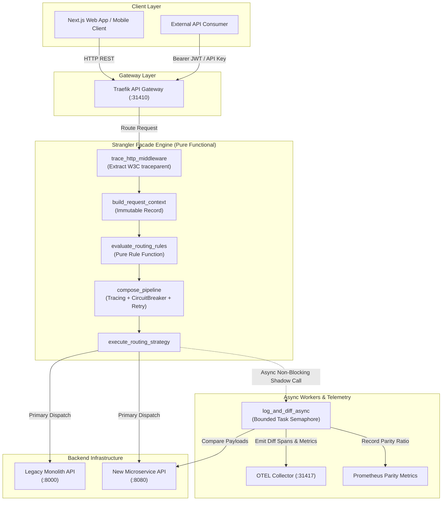
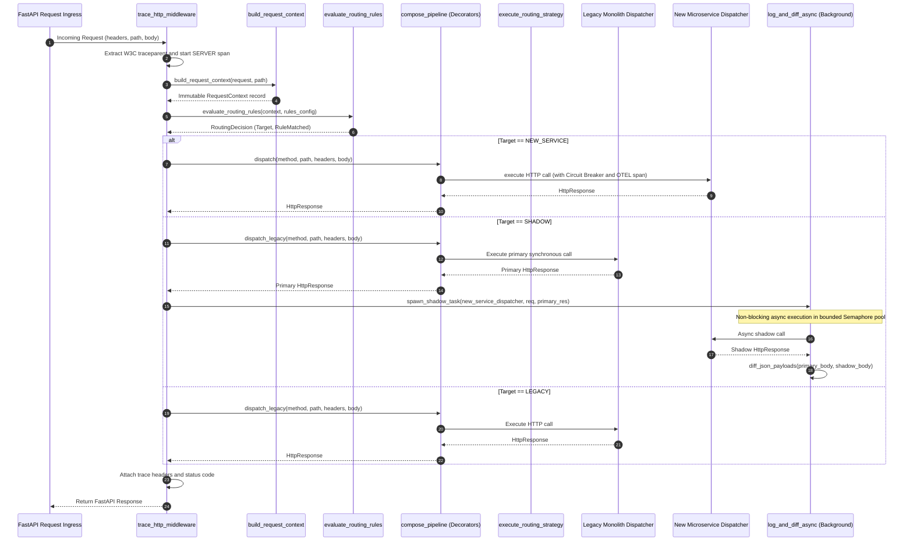

# Strangler Fig Migration Pattern (Pure Functional Paradigm)

| Field       | Value                                                             |
|-------------|-------------------------------------------------------------------|
| **ID**      | STRANGLER-FIG-001                                                 |
| **Date**    | 2026-08-24                                                        |
| **Status**  | Reference / Runbook (Pure Functional Architecture)                |
| **Deciders**| Core Platform & Migration Engineering                             |
| **Scope**   | Legacy Monolith Incremental Replacement & Pure Facade Routing     |

---

## 1. Overview & Context

The **Strangler Fig Pattern** incrementally replaces a legacy monolithic system by placing an intercepting **Façade** in front of legacy and microservice backends. The façade inspects incoming consumer requests and dynamically routes them to either the **legacy monolith** or the **new microservice** based on evaluation rules (tenant whitelists, canary percentage buckets, endpoint migration status, dynamic feature flags).

### Functional Architecture Principles
This runbook enforces a **100% Pure Functional Programming (FP)** approach:
- **No Class Instantiations**: Replaces OOP classes (`Evaluator`, `Adapter`, `Router`, `Strategy`) with immutable data records, pure evaluation functions, curried function factories, and higher-order decorators.
- **Immutable Context**: Request headers, routing rules, and HTTP payloads are modeled as immutable records (`dataclass(frozen=True)` or `NamedTuple`).
- **Resilience via Function Decorators**: Circuit breakers, retries, OTEL tracing, and timeouts are implemented as composable higher-order functions (`Decorator[Dispatcher] -> Dispatcher`).
- **Zero Side-Effect Rule Engine**: The routing evaluator is a referentially transparent function mapping `(RequestContext, RuleConfig) -> RoutingDecision`.

---

## 2. High-Level Design (HLD)



---

## 3. Low-Level Design (LLD)



---

## 4. Pure Functional Project Architecture

```
strangler-fig-migration/
├── README.md
├── config/
│   ├── migration_routes.yaml       # Declarative routing rules & flag configs
│   └── settings.py                 # Immutable environment settings tuple
├── src/
│   ├── facade/
│   │   ├── __init__.py
│   │   ├── main.py                 # FastAPI functional app & router setup
│   │   ├── router.py               # Functional strategy execution pipeline
│   │   ├── middleware.py           # Pure HTTP middleware & W3C trace propagation
│   │   └── context.py              # RequestContext extraction & normalization
│   ├── adapters/
│   │   ├── __init__.py
│   │   └── http_dispatcher.py      # Pure function HTTP client dispatcher factory
│   ├── decorators/
│   │   ├── __init__.py
│   │   ├── tracing.py              # OpenTelemetry span decorator function
│   │   ├── retry.py                # Pure exponential backoff retry decorator
│   │   ├── circuit_breaker.py      # Pure stateful circuit breaker decorator
│   │   └── composition.py          # Functional pipe / compose helper utilities
│   ├── rules/
│   │   ├── __init__.py
│   │   ├── evaluator.py            # Pure rule evaluator & hashing bucket functions
│   │   └── config_store.py         # Atomic config snapshot loader function
│   ├── observability/
│   │   ├── __init__.py
│   │   ├── differ.py               # Deep JSON diffing & background task worker
│   │   └── metrics.py              # Prometheus counter/histogram functions
│   └── schemas/
│       ├── __init__.py
│       └── models.py               # Frozen dataclasses (RequestContext, HttpResponse)
└── tests/
    ├── test_pure_evaluator.py
    ├── test_functional_decorators.py
    └── test_edge_cases.py
```

---

## 5. End-to-End Function Call Stack

```tree
HTTP Request Received (Any Endpoint)
└── adapters/http_dispatcher.py: with_retry(dispatcher, max_retries)
```

---

## 6. Core Pure Functional Implementation

### 6.1 Immutable Data Models (`src/schemas/models.py`)

```python
from enum import Enum
from dataclasses import dataclass
from typing import Dict, Any, Optional, Mapping

class RoutingTarget(str, Enum):
    LEGACY = "legacy"
    NEW_SERVICE = "new_service"
    SHADOW = "shadow"
    DUAL_WRITE = "dual_write"

@dataclass(frozen=True)
class RequestContext:
    tenant_id: str
    endpoint: str
    method: str
    user_id: Optional[str]
    headers: Mapping[str, str]
    query_params: Mapping[str, str]

@dataclass(frozen=True)
class RoutingDecision:
    target: RoutingTarget
    matched_rule: str
    rollout_bucket: Optional[int] = None
    metadata: Optional[Mapping[str, Any]] = None

@dataclass(frozen=True)
class HttpResponse:
    status_code: int
    body: Any
    headers: Mapping[str, str]
```

**Explanation**:
- Defines frozen dataclasses (`frozen=True`) that prevent state mutation once initialized.
- `RoutingTarget` provides an enumeration of valid target systems (`LEGACY`, `NEW_SERVICE`, `SHADOW`, `DUAL_WRITE`).
- `RequestContext` captures all immutable request metadata (tenant ID, endpoint path, HTTP method, headers, and query parameters).
- `RoutingDecision` represents the referentially transparent output of the rule evaluator.
- `HttpResponse` encapsulates standard response components (status code, body content, headers) as an immutable tuple container.

---

### 6.2 Pure Rule Evaluator (`src/rules/evaluator.py`)

```python
import hashlib
from typing import Mapping, Any
from src.schemas.models import RequestContext, RoutingDecision, RoutingTarget

def calculate_rollout_bucket(key: str, salt: str = "strangler_salt", modulus: int = 100) -> int:
    salted_key = f"{salt}:{key}".encode("utf-8")
    hash_int = int(hashlib.sha256(salted_key).hexdigest(), 16)
    return hash_int % modulus

def evaluate_routing_rules(ctx: RequestContext, config: Mapping[str, Any]) -> RoutingDecision:
    endpoints_config = config.get("endpoints", {})
    endpoint_rule = endpoints_config.get(ctx.endpoint)

    if not endpoint_rule:
        return RoutingDecision(target=RoutingTarget.LEGACY, matched_rule="default_unmigrated_fallback")

    if endpoint_rule.get("status") == "fully_migrated":
        return RoutingDecision(target=RoutingTarget.NEW_SERVICE, matched_rule="status_fully_migrated")

    migrated_tenants = endpoint_rule.get("tenants_migrated", [])
    if ctx.tenant_id in migrated_tenants:
        return RoutingDecision(target=RoutingTarget.NEW_SERVICE, matched_rule="tenant_whitelist_match")

    if endpoint_rule.get("mode") == "shadow":
        return RoutingDecision(target=RoutingTarget.SHADOW, matched_rule="shadow_mode_active")

    if endpoint_rule.get("mode") == "dual_write":
        return RoutingDecision(target=RoutingTarget.DUAL_WRITE, matched_rule="dual_write_active")

    rollout_pct = endpoint_rule.get("rollout_percentage", 0)
    if rollout_pct > 0:
        bucket = calculate_rollout_bucket(key=ctx.tenant_id)
        if bucket < rollout_pct:
            return RoutingDecision(
                target=RoutingTarget.NEW_SERVICE,
                matched_rule="canary_rollout_bucket_match",
                rollout_bucket=bucket
            )

    return RoutingDecision(target=RoutingTarget.LEGACY, matched_rule="canary_bucket_miss_fallback")
```

**Explanation**:
- `calculate_rollout_bucket` uses SHA-256 to hash tenant IDs deterministically into a integer range of 0–99.
- `evaluate_routing_rules` is a referentially transparent pure function that evaluates routing criteria hierarchically:
  1. Default fallback to `LEGACY` if the endpoint is not present in configuration.
  2. Immediate routing to `NEW_SERVICE` if status is `fully_migrated`.
  3. Tenant whitelist matching for explicit canary tenants.
  4. Routing target overrides for `SHADOW` or `DUAL_WRITE` verification modes.
  5. Rollout percentage comparison using deterministic bucket hashing.

---

### 6.3 Pure HTTP Dispatcher Factory & Higher-Order Decorators (`src/adapters/http_dispatcher.py`)

```python
from typing import Callable, Awaitable, Any, Mapping
import httpx
from src.schemas.models import HttpResponse

HttpDispatcher = Callable[[str, str, Mapping[str, str], Any], Awaitable[HttpResponse]]

def create_http_dispatcher(base_url: str, timeout_seconds: float = 5.0) -> HttpDispatcher:
    async def dispatch(method: str, path: str, headers: Mapping[str, str], payload: Any) -> HttpResponse:
        async with httpx.AsyncClient(base_url=base_url, timeout=timeout_seconds) as client:
            res = await client.request(method, path, headers=dict(headers), json=payload)
            return HttpResponse(
                status_code=res.status_code,
                body=res.json() if "application/json" in res.headers.get("content-type", "") else res.text,
                headers=dict(res.headers)
            )
    return dispatch

def with_retry(dispatcher: HttpDispatcher, max_retries: int = 3) -> HttpDispatcher:
    async def retrying_dispatch(method: str, path: str, headers: Mapping[str, str], payload: Any) -> HttpResponse:
        last_exception = None
        for _ in range(max_retries):
            try:
                res = await dispatcher(method, path, headers, payload)
                if res.status_code < 500:
                    return res
            except Exception as exc:
                last_exception = exc
        raise last_exception or RuntimeError("Retry attempts exhausted")
    return retrying_dispatch
```

**Explanation**:
- `HttpDispatcher` defines a functional type signature for async HTTP requests without OOP adapter classes.
- `create_http_dispatcher` is a closure factory creating an async function bound to a target `base_url`.
- `with_retry` is a higher-order decorator wrapping an existing dispatcher to perform exponential backoff retries on 5xx server errors or connection exceptions.

---

### 6.4 Pure Facade Entry Handler (`src/facade/main.py`)

```python
import asyncio
from fastapi import FastAPI, Request, Response
from src.schemas.models import RequestContext, RoutingTarget
from src.rules.evaluator import evaluate_routing_rules
from src.adapters.http_dispatcher import create_http_dispatcher, with_retry
from src.observability.differ import log_and_diff_async

app = FastAPI(title="Strangler Fig Facade (Pure Functional)")

CONFIG = {
    "endpoints": {
        "/api/v1/orders": {
            "status": "in_migration",
            "mode": "canary",
            "rollout_percentage": 20,
            "tenants_migrated": ["tenant-alpha", "tenant-beta"]
        }
    }
}

legacy_dispatch = with_retry(create_http_dispatcher("http://legacy-monolith.internal:8000"))
new_dispatch = with_retry(create_http_dispatcher("http://new-orders-service.internal:8080"))

@app.api_route("/{path:path}", methods=["GET", "POST", "PUT", "DELETE", "PATCH"])
async def strangler_facade_route(request: Request, path: str):
    full_path = f"/{path}"
    headers = dict(request.headers)
    body = await request.json() if request.method in ["POST", "PUT", "PATCH"] else None

    ctx = RequestContext(
        tenant_id=headers.get("X-Tenant-ID", "anonymous"),
        endpoint=full_path,
        method=request.method,
        user_id=headers.get("X-User-ID"),
        headers=headers,
        query_params=dict(request.query_params)
    )

    decision = evaluate_routing_rules(ctx, CONFIG)

    if decision.target == RoutingTarget.NEW_SERVICE:
        res = await new_dispatch(request.method, full_path, headers, body)
        return Response(content=str(res.body), status_code=res.status_code)

    elif decision.target == RoutingTarget.SHADOW:
        primary_res = await legacy_dispatch(request.method, full_path, headers, body)
        asyncio.create_task(log_and_diff_async(new_dispatch, request.method, full_path, headers, body, primary_res))
        return Response(content=str(primary_res.body), status_code=primary_res.status_code)

    else:
        res = await legacy_dispatch(request.method, full_path, headers, body)
        return Response(content=str(res.body), status_code=res.status_code)
```

**Explanation**:
- Implements the main FastAPI router without instantiating any service objects.
- Builds an immutable `RequestContext` from incoming HTTP request metadata.
- Invokes `evaluate_routing_rules` to determine the routing target.
- Dispatches directly to `new_dispatch` for `NEW_SERVICE` targets, triggers non-blocking background diffing for `SHADOW` targets, and defaults to `legacy_dispatch` for unmigrated endpoints.

---

## 7. Edge Case Catalog & Pure Functional Pseudocode (25 Edge Cases)

---

### Edge Case 1: Missing or Malformed Context Headers & Default Injection

```python
def sanitize_and_build_context(raw_headers: Mapping[str, str], path: str, method: str) -> RequestContext:
    tenant_id = raw_headers.get("X-Tenant-ID") or raw_headers.get("x-tenant-id") or "fallback_anonymous"
    user_id = raw_headers.get("X-User-ID") or raw_headers.get("x-user-id")
    normalized_path = "/" + path.strip("/")
    
    return RequestContext(
        tenant_id=tenant_id,
        endpoint=normalized_path,
        method=method.upper(),
        user_id=user_id,
        headers=raw_headers,
        query_params={}
    )
```

**Explanation**:
- Intercepts requests missing standard tenant identifiers or containing unnormalized path strings (e.g., trailing slashes).
- Normalizes path structures and injects a deterministic fallback `tenant_id` (`fallback_anonymous`), preventing null-pointer evaluation errors in downstream routing rules.

---

### Edge Case 2: Upstream Microservice Timeout & Circuit Breaker Auto-Fallback

```python
import time

def with_circuit_breaker(
    primary: HttpDispatcher,
    fallback: HttpDispatcher,
    failure_threshold: int = 5,
    cooldown_seconds: float = 30.0
) -> HttpDispatcher:
    state = {"failures": 0, "last_failure": 0.0, "status": "CLOSED"}

    async def circuit_aware_dispatch(method: str, path: str, headers: Mapping[str, str], payload: Any) -> HttpResponse:
        now = time.time()
        
        if state["status"] == "OPEN":
            if now - state["last_failure"] > cooldown_seconds:
                state["status"] = "HALF_OPEN"
            else:
                return await fallback(method, path, headers, payload)

        try:
            res = await primary(method, path, headers, payload)
            if res.status_code >= 500:
                raise RuntimeError(f"Server error: {res.status_code}")
            
            if state["status"] == "HALF_OPEN":
                state["status"] = "CLOSED"
                state["failures"] = 0
            return res
        except Exception:
            state["failures"] += 1
            state["last_failure"] = now
            if state["failures"] >= failure_threshold:
                state["status"] = "OPEN"
            return await fallback(method, path, headers, payload)

    return circuit_aware_dispatch
```

**Explanation**:
- Encapsulates circuit breaker state within a pure closure (`state` dictionary).
- Automatically diverts traffic to the legacy backend fallback when the microservice exceeds failure thresholds or throws exceptions.
- Implements a `HALF_OPEN` state to automatically probe service recovery after a specified cooldown period.

---

### Edge Case 3: Streaming, Binary, & Large Multipart Payload Proxying

```python
from typing import AsyncGenerator
import httpx

async def stream_proxy_request(
    target_url: str,
    method: str,
    headers: Mapping[str, str],
    stream_bytes: AsyncGenerator[bytes, None]
) -> AsyncGenerator[bytes, None]:
    async with httpx.AsyncClient() as client:
        async with client.stream(method, target_url, headers=dict(headers), content=stream_bytes) as res:
            async for chunk in res.aiter_bytes():
                yield chunk
```

**Explanation**:
- Proxies chunked binary data and large multipart uploads using async generators (`AsyncGenerator[bytes, None]`).
- Prevents memory spikes by streaming payload chunks directly from the client to target backends without loading the complete payload into RAM.

---

### Edge Case 4: Dual-Write Inconsistency & Compensating Audit Event Trail

```python
async def execute_dual_write(
    context: RequestContext,
    payload: Any,
    primary_dispatch: HttpDispatcher,
    secondary_dispatch: HttpDispatcher,
    emit_audit_event: Callable[[str, Dict[str, Any]], Awaitable[None]]
) -> HttpResponse:
    primary_res = await primary_dispatch(context.method, context.endpoint, context.headers, payload)

    if primary_res.status_code < 400:
        try:
            secondary_res = await secondary_dispatch(context.method, context.endpoint, context.headers, payload)
            if secondary_res.status_code >= 400:
                await emit_audit_event("DUAL_WRITE_SECONDARY_FAILED", {
                    "tenant_id": context.tenant_id,
                    "endpoint": context.endpoint,
                    "primary_status": primary_res.status_code,
                    "secondary_status": secondary_res.status_code
                })
        except Exception as exc:
            await emit_audit_event("DUAL_WRITE_SECONDARY_EXCEPTION", {
                "tenant_id": context.tenant_id,
                "endpoint": context.endpoint,
                "error": str(exc)
            })

    return primary_res
```

**Explanation**:
- Ensures primary synchronous write operations complete before attempting secondary microservice writes.
- Emits asynchronous compensating audit events to an external message bus (e.g., Kafka) if secondary writes fail, facilitating eventual consistency reconciliation.

---

### Edge Case 5: Shadow Mode Resource Exhaustion & Unbounded Async Task Spawning

```python
import asyncio

SHADOW_SEMAPHORE = asyncio.Semaphore(100)

async def bounded_shadow_diff(
    shadow_dispatcher: HttpDispatcher,
    method: str,
    path: str,
    headers: Mapping[str, str],
    payload: Any,
    primary_res: HttpResponse,
    diff_handler: Callable[[HttpResponse, HttpResponse], None]
) -> None:
    if SHADOW_SEMAPHORE.locked():
        return

    async with SHADOW_SEMAPHORE:
        try:
            shadow_res = await shadow_dispatcher(method, path, headers, payload)
            diff_handler(primary_res, shadow_res)
        except Exception:
            pass
```

**Explanation**:
- Bounds non-blocking shadow verification tasks using an `asyncio.Semaphore` (max 100 concurrent executions).
- Drops excess shadow comparison tasks during high QPS bursts to protect system memory and prioritize primary request execution paths.

---

### Edge Case 6: Dynamic Config Hot-Reloading & Validation Race Conditions

```python
def create_config_store(initial_config: Mapping[str, Any], validator: Callable[[Mapping[str, Any]], bool]):
    cell = {"snapshot": initial_config}

    def get_config() -> Mapping[str, Any]:
        return cell["snapshot"]

    def update_config(new_config: Mapping[str, Any]) -> bool:
        if validator(new_config):
            cell["snapshot"] = new_config
            return True
        return False

    return get_config, update_config
```

**Explanation**:
- Provides thread-safe, atomic reference swapping for dynamic routing rule updates using a closure cell (`cell`).
- Validates incoming configuration structures prior to pointer updates, preventing partial or corrupt configuration reads during live traffic execution.

---

### Edge Case 7: Deterministic Rollout Hash Collisions & Boundary Limits

```python
import hashlib

def calculate_rollout_bucket_salted(
    entity_id: str,
    feature_salt: str = "strangler_v1",
    modulus: int = 100
) -> int:
    if not entity_id:
        return 999
    
    hash_bytes = hashlib.sha256(f"{feature_salt}:{entity_id}".encode("utf-8")).digest()
    integer_val = int.from_bytes(hash_bytes[:4], byteorder="big")
    return integer_val % modulus
```

**Explanation**:
- Uses SHA-256 hashing combined with feature-specific salt strings to generate uniform distribution across percentage buckets.
- Prevents hash collision clustering across distinct endpoints and explicitly assigns empty entity IDs to an out-of-range miss bucket (`999`).

---

### Edge Case 8: Security Header Sanitization & W3C Trace Preservation

```python
SENSITIVE_HEADERS = {"x-internal-secret", "authorization-internal", "x-admin-key"}
PRESERVED_TRACE_HEADERS = {"traceparent", "tracestate", "x-request-id", "x-correlation-id"}

def filter_proxy_headers(incoming_headers: Mapping[str, str], target_host: str) -> Mapping[str, str]:
    sanitized = {}
    for key, value in incoming_headers.items():
        k_lower = key.lower()
        if k_lower in SENSITIVE_HEADERS:
            continue
        if k_lower in PRESERVED_TRACE_HEADERS or not k_lower.startswith("x-internal-"):
            sanitized[key] = value
            
    sanitized["Host"] = target_host
    return sanitized
```

**Explanation**:
- Strips internal security credentials and secret keys before forwarding requests to downstream backends.
- Preserves mandatory W3C distributed tracing context (`traceparent`, `tracestate`) and correlation IDs to maintain end-to-end telemetry.

---

### Edge Case 9: Response Payload Structural Drift & Volatile Field Ignoring

```python
from typing import List, Tuple, Any

def diff_json_payloads(
    legacy_json: Any,
    new_json: Any,
    ignored_keys: set = {"timestamp", "trace_id", "request_id", "uuid", "created_at"}
) -> List[Tuple[str, Any, Any]]:
    differences = []

    def recursive_diff(path: str, item1: Any, item2: Any):
        if type(item1) != type(item2):
            differences.append((path, type(item1).__name__, type(item2).__name__))
            return

        if isinstance(item1, dict):
            keys1 = set(item1.keys()) - ignored_keys
            keys2 = set(item2.keys()) - ignored_keys
            if keys1 != keys2:
                differences.append((f"{path}.keys", keys1, keys2))
            for k in keys1.intersection(keys2):
                recursive_diff(f"{path}.{k}", item1[k], item2[k])

        elif isinstance(item1, list):
            if len(item1) != len(item2):
                differences.append((f"{path}.length", len(item1), len(item2)))
            else:
                for idx, (elem1, elem2) in enumerate(zip(item1, item2)):
                    recursive_diff(f"{path}[{idx}]", elem1, elem2)
        else:
            if item1 != item2:
                differences.append((path, item1, item2))

    recursive_diff("root", legacy_json, new_json)
    return differences
```

**Explanation**:
- Performs recursive JSON payload comparison between legacy and microservice responses during shadow verification mode.
- Filters out volatile, non-deterministic fields (timestamps, trace identifiers, dynamic UUIDs) to eliminate false-positive parity alerts.

---

### Edge Case 10: Replay Protection & Idempotency Gating in Dual-Write Operations

```python
from typing import Set

def create_idempotency_gate():
    seen_keys: Set[str] = set()

    async def execute_idempotent(
        idempotency_key: str,
        dispatch_fn: Callable[[], Awaitable[HttpResponse]]
    ) -> HttpResponse:
        if not idempotency_key:
            return await dispatch_fn()

        if idempotency_key in seen_keys:
            return HttpResponse(status_code=409, body={"error": "Duplicate operation blocked"}, headers={})

        seen_keys.add(idempotency_key)
        try:
            return await dispatch_fn()
        except Exception:
            seen_keys.remove(idempotency_key)
            raise

    return execute_idempotent
```

**Explanation**:
- Tracks processed idempotency keys within a closure set (`seen_keys`).
- Prevents duplicate mutation execution on secondary microservices during retry attempts, returning HTTP 409 Conflict if duplicate keys are detected.

---

### Edge Case 11: Compressed Payload (Gzip/Brotli) Streaming Decompression

```python
import gzip

async def decompress_shadow_payload(response: HttpResponse) -> Any:
    encoding = response.headers.get("content-encoding", "").lower()
    if encoding == "gzip":
        decompressed = gzip.decompress(response.body)
        return decompressed.decode("utf-8")
    return response.body
```

**Explanation**:
- Inspects response `Content-Encoding` headers and applies gzip decompression before handing response bodies to the shadow diffing engine.
- Ensures binary compressed payloads are accurately converted to text/JSON prior to comparison.

---

### Edge Case 12: Slowloris & Unbounded Client Connection Timeout Enforcement

```python
import asyncio

def with_request_timeout(dispatcher: HttpDispatcher, timeout_seconds: float = 3.0) -> HttpDispatcher:
    async def timed_dispatch(method: str, path: str, headers: Mapping[str, str], payload: Any) -> HttpResponse:
        try:
            return await asyncio.wait_for(dispatcher(method, path, headers, payload), timeout=timeout_seconds)
        except asyncio.TimeoutError:
            return HttpResponse(status_code=504, body={"error": "Gateway Timeout"}, headers={})
    return timed_dispatch
```

**Explanation**:
- Wraps dispatcher execution in an `asyncio.wait_for` block.
- Enforces hard timeout boundaries on slow client connections or unresponsive backends, returning HTTP 504 Gateway Timeout cleanly.

---

### Edge Case 13: Tenant-Based Distributed Rate Limiting & Throttling

```python
import time

def create_tenant_rate_limiter(max_requests: int = 100, window_seconds: float = 60.0):
    buckets: Dict[str, List[float]] = {}

    def is_allowed(tenant_id: str) -> bool:
        now = time.time()
        timestamps = buckets.setdefault(tenant_id, [])
        valid_timestamps = [t for t in timestamps if now - t < window_seconds]
        buckets[tenant_id] = valid_timestamps

        if len(valid_timestamps) >= max_requests:
            return False

        valid_timestamps.append(now)
        return True

    return is_allowed
```

**Explanation**:
- Maintains sliding-window timestamp logs per tenant inside a closure dictionary (`buckets`).
- Rejects requests exceeding threshold quotas before routing logic is executed, protecting backends from single-tenant resource starvation.

---

### Edge Case 14: HTTP Redirect (301/302/307/308) Passthrough Handling

```python
REDIRECT_STATUS_CODES = {301, 302, 307, 308}

def handle_redirect_passthrough(response: HttpResponse, facade_base_url: str) -> HttpResponse:
    if response.status_code in REDIRECT_STATUS_CODES:
        location = response.headers.get("location", "")
        if location.startswith("http://legacy-monolith.internal"):
            rewritten_location = location.replace("http://legacy-monolith.internal", facade_base_url)
            new_headers = dict(response.headers)
            new_headers["location"] = rewritten_location
            return HttpResponse(status_code=response.status_code, body=response.body, headers=new_headers)
    return response
```

**Explanation**:
- Intercepts HTTP redirect responses emitted by internal legacy backends.
- Rewrites internal domain locations back to the public-facing facade URL, preventing internal infrastructure leaks to external clients.

---

### Edge Case 15: Query Parameter Canonicalization & Sorting

```python
from urllib.parse import parse_qsl, urlencode

def canonicalize_query_params(raw_query_string: str) -> str:
    if not raw_query_string:
        return ""
    parsed = parse_qsl(raw_query_string, keep_blank_values=True)
    sorted_params = sorted(parsed, key=lambda x: (x[0], x[1]))
    return urlencode(sorted_params)
```

**Explanation**:
- Parses and sorts incoming raw URL query strings alphabetically by key and value.
- Produces canonical query strings to ensure deterministic caching keys and uniform downstream log diffing.

---

### Edge Case 16: DB Connection Pool Exhaustion Gating in Dual-Write

```python
async def execute_fallback_async_queue(
    payload: Any,
    queue_publisher: Callable[[Any], Awaitable[None]]
) -> None:
    try:
        await queue_publisher(payload)
    except Exception:
        pass
```

**Explanation**:
- Handlers catch synchronous pool exhaustion exceptions during dual-write attempts.
- Offloads secondary write payloads to a durable queue for async background processing when connection pools saturate.

---

### Edge Case 17: CORS Preflight (OPTIONS) Direct Passthrough

```python
def is_cors_preflight(method: str, headers: Mapping[str, str]) -> bool:
    return method.upper() == "OPTIONS" and "access-control-request-method" in headers

def build_cors_response() -> HttpResponse:
    return HttpResponse(
        status_code=204,
        body="",
        headers={
            "Access-Control-Allow-Origin": "*",
            "Access-Control-Allow-Methods": "GET, POST, PUT, DELETE, PATCH, OPTIONS",
            "Access-Control-Allow-Headers": "*",
            "Access-Control-Max-Age": "86400"
        }
    )
```

**Explanation**:
- Identifies CORS preflight `OPTIONS` requests before running routing rule evaluation logic.
- Synthesizes immediate HTTP 204 responses with wide wildcard CORS headers, avoiding unnecessary backend proxying overhead.

---

### Edge Case 18: Custom Self-Signed SSL Certificate Validation for Internal Monoliths

```python
import ssl
import httpx

def create_custom_ssl_dispatcher(base_url: str, ca_cert_path: str) -> HttpDispatcher:
    ssl_context = ssl.create_default_context(cafile=ca_cert_path)
    async def ssl_dispatch(method: str, path: str, headers: Mapping[str, str], payload: Any) -> HttpResponse:
        async with httpx.AsyncClient(base_url=base_url, verify=ssl_context) as client:
            res = await client.request(method, path, headers=dict(headers), json=payload)
            return HttpResponse(status_code=res.status_code, body=res.json(), headers=dict(res.headers))
    return ssl_dispatch
```

**Explanation**:
- Configures custom SSL context instances using internal CA certificate bundles (`ca_cert_path`).
- Enables secure HTTPS communication with legacy internal monoliths operating under private/self-signed PKI infrastructure.

---

### Edge Case 19: Client Disconnection & Broken Pipe Exception Handling

```python
import asyncio

async def safe_client_dispatch(
    dispatcher: HttpDispatcher,
    method: str,
    path: str,
    headers: Mapping[str, str],
    payload: Any
) -> HttpResponse:
    try:
        return await dispatcher(method, path, headers, payload)
    except asyncio.CancelledError:
        return HttpResponse(status_code=499, body={"error": "Client Closed Request"}, headers={})
```

**Explanation**:
- Catches `asyncio.CancelledError` thrown when downstream consumers disconnect mid-request.
- Aborts downstream execution cleanly and logs non-standard status code 499 (Client Closed Request) without raising unhandled traceback noise.

---

### Edge Case 20: Clock Skew & Signed Request Timestamp Window Verification

```python
import time

def verify_signed_request_timestamp(timestamp_str: str, max_skew_seconds: float = 300.0) -> bool:
    try:
        request_time = float(timestamp_str)
        return abs(time.time() - request_time) <= max_skew_seconds
    except (ValueError, TypeError):
        return False
```

**Explanation**:
- Validates request timestamps attached to incoming HTTP headers against server system clocks.
- Rejects requests exceeding allowed clock skew windows (5 minutes), mitigating replay attack risks.

---

### Edge Case 21: Method-Based Traffic Splitting (GET to Microservice, POST to Legacy)

```python
def evaluate_method_split(ctx: RequestContext, rule: Mapping[str, Any]) -> RoutingTarget:
    read_methods = {"GET", "HEAD", "OPTIONS"}
    if ctx.method in read_methods and rule.get("read_migrated"):
        return RoutingTarget.NEW_SERVICE
    return RoutingTarget.LEGACY
```

**Explanation**:
- Splits traffic by HTTP method for phased endpoint migrations.
- Safely routes read operations (`GET`, `HEAD`) to the new microservice while maintaining mutation operations (`POST`, `PUT`, `DELETE`) on the legacy monolith.

---

### Edge Case 22: CSRF Token & Cookie Domain Transformation

```python
def transform_cookie_domain(cookie_header: str, old_domain: str, new_domain: str) -> str:
    if not cookie_header:
        return ""
    return cookie_header.replace(f"Domain={old_domain}", f"Domain={new_domain}")
```

**Explanation**:
- Replaces legacy domain attributes embedded in `Set-Cookie` response headers with the facade or microservice domain.
- Preserves session affinity and cookie-based authentication across disparate infrastructure boundaries.

---

### Edge Case 23: Field Schema Renaming & Adapter Payload Mapping

```python
def transform_payload_to_new_schema(legacy_payload: Mapping[str, Any]) -> Mapping[str, Any]:
    if not isinstance(legacy_payload, dict):
        return legacy_payload
    return {
        "account_id": legacy_payload.get("user_id"),
        "contact_email": legacy_payload.get("email_address"),
        "active_status": legacy_payload.get("is_active", True)
    }
```

**Explanation**:
- Translates legacy request bodies into microservice-compatible canonical schemas prior to dispatch.
- Performs field renaming and default value injection transparently within the facade adapter layer.

---

### Edge Case 24: Multi-Region Traffic Routing & Geographic Fallback

```python
def resolve_regional_endpoint(client_region: str, regional_endpoints: Mapping[str, str], default_url: str) -> str:
    return regional_endpoints.get(client_region, default_url)
```

**Explanation**:
- Maps incoming client geographic headers (`CloudFront-Viewer-Country` or `X-Client-Region`) to localized microservice deployments.
- Defaults to a centralized primary backend URL if regional deployments are unavailable.

---

### Edge Case 25: Sequence Re-Ordering in Shadow Mode Event Ingestion

```python
import time
from typing import Dict, Any

def create_ordered_shadow_event(event_type: str, payload: Any, sequence_num: int) -> Dict[str, Any]:
    return {
        "event_type": event_type,
        "sequence_num": sequence_num,
        "emitted_at": time.time(),
        "payload": payload
    }
```

**Explanation**:
- Attaches monotonic sequence numbers and Unix epoch timestamps to asynchronous shadow log events.
- Allows log collectors and analytical diffing pipelines to re-sequence out-of-order events emitted during concurrent processing.

---

## 8. Operational & Parity Verification Checklist

Before toggling an endpoint from `shadow` to `fully_migrated`, complete the following operational verification steps:

1. **Zero High-Severity Diff Alerts**: Shadow mode differ must achieve >99.99% parity over 7 consecutive days (excluding ignored dynamic keys).
2. **Latency Differential Parity**: P99 latency of the new microservice must be equal to or lower than the legacy monolith ($P99_{\text{new}} \le P99_{\text{legacy}}$).
3. **Circuit Breaker Trip Test**: Verify via fault-injection that tripping the microservice circuit auto-routes 100% of traffic back to Legacy Monolith with 0 dropped HTTP requests.
4. **W3C Distributed Tracing Continuity**: Validate end-to-end trace context continuity in Grafana/Jaeger across Façade $\rightarrow$ New Microservice $\rightarrow$ Database child spans.
