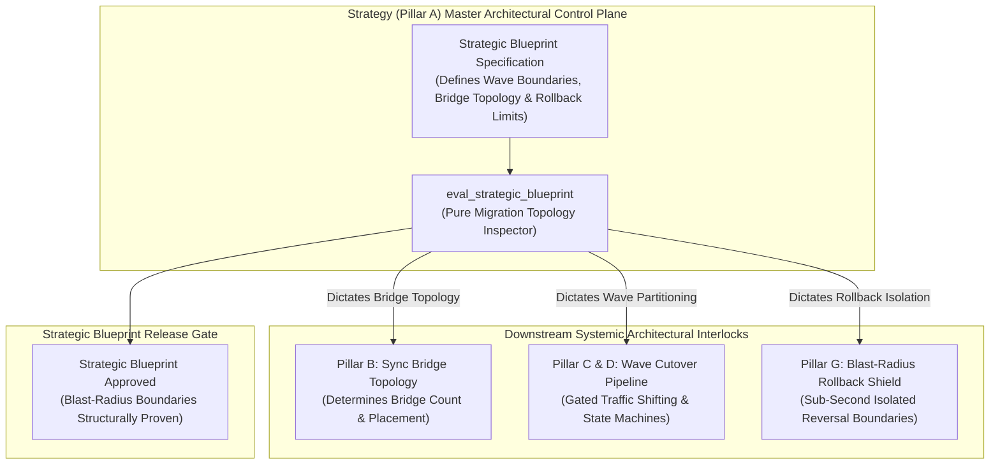
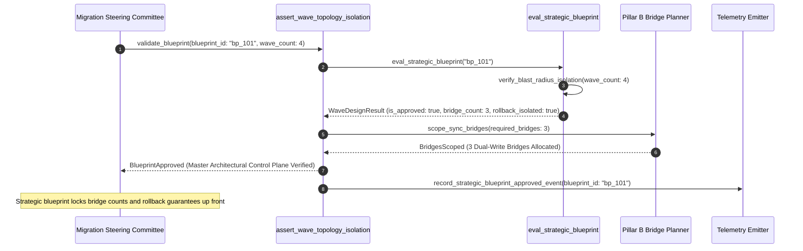

# Strategic Blueprint & Systemic Wave Design Pattern (Pure Functional Paradigm)

| Field       | Value                                                             |
|-------------|-------------------------------------------------------------------|
| **ID**      | STRATEGY-SYSTEMIC-WAVE-DESIGN-064                                 |
| **Date**    | 2026-08-24                                                        |
| **Status**  | Reference / Runbook (Pure Functional Architecture)                |
| **Deciders**| Core Platform & Migration Engineering                             |
| **Scope**   | Systemic Migration Topology, Bridge Scoping & Wave Architecture    |

---

## 1. Overview & Context

Strategy (Pillar A) is the master architectural control plane of any migration: **Strategy decides the shape of everything else**. The strategic blueprint determines how many dual-write sync bridges (Pillar B) must be provisioned, how migration waves are partitioned across services, and whether blast-radius-scoped rollback (Pillar G) is even structurally possible. Attempting to design sync bridges or cutover mechanics without a top-level strategic wave design forces teams into accidental tight coupling, un-isolated failure domains, and un-rollbackable deployments.

### Functional Architecture Principles
This runbook enforces a **100% Pure Functional Programming (FP)** approach:
- **No Class Instantiations**: Replaces OOP strategy managers with pure evaluation functions (`eval_strategic_blueprint`, `assert_wave_topology_isolation`) and state cell closures.
- **Immutable Strategic Blueprint Records**: Wave boundaries, required bridge counts, blast-radius limits, and service dependency DAGs are captured as frozen dataclass records (`StrategicBlueprintContext`, `WaveDesignResult`).
- **Referentially Transparent Topology Evaluators**: Pure functions evaluate proposed migration topologies to guarantee independent blast-radius isolation before any bridges are built.
- **Master Control Plane Scoping**: Ensures all downstream bridges, cutover state machines, and rollback controls inherit structural guarantees directly from the strategic blueprint.

---

## 2. High-Level Design (HLD)



---

## 3. Low-Level Design (LLD)



---

## 4. Pure Functional Project Architecture

```
10-core-patterns-and-cutover/
├── strategic-blueprint-wave-design.md
├── src/
│   ├── strategy_engine/
│   │   ├── __init__.py
│   │   ├── evaluator.py            # Pure strategic blueprint evaluation functions
│   │   ├── inspector.py            # Topology & blast-radius boundary inspectors
│   │   └── guard.py                # Strategic blueprint release guards
│   ├── storage/
│   │   ├── __init__.py
│   │   └── blueprint_store.py      # Strategic blueprint specification loaders
│   ├── observability/
│   │   ├── __init__.py
│   │   └── strategy_metrics.py     # Prometheus telemetry collectors
│   └── schemas/
│       └── models.py               # Frozen dataclasses (StrategicBlueprintContext, WaveDesignResult)
└── tests/
    ├── test_strategy_evaluator.py
    └── test_strategy_edge_cases.py
```

---

## 5. End-to-End Function Call Stack

```tree
Strategic Blueprint Proposal Submitted
└── strategy_engine/guard.py: assert_wave_topology_isolation(ctx)
    └── strategy_engine/evaluator.py: eval_strategic_blueprint(ctx)
        ├── strategy_engine/evaluator.py: calculate_required_bridges(service_dag, FrozenSet)
        └── models.py: WaveDesignResult(blueprint_id, is_approved, required_bridges_count, rollback_boundary_isolated, wave_partition_map, rejection_reason)
```

---

## 6. Core Pure Functional Implementation

### 6.1 Immutable Models & Types (`src/schemas/models.py`)

```python
from enum import Enum
from dataclasses import dataclass
from typing import Dict, Any, Optional, Mapping, FrozenSet

@dataclass(frozen=True)
class StrategicBlueprintContext:
    blueprint_id: str
    wave_count: int
    total_services_n: int
    max_blast_radius_pct: float
    service_dag: Mapping[str, FrozenSet[str]]

@dataclass(frozen=True)
class WaveDesignResult:
    blueprint_id: str
    is_approved: bool
    required_bridges_count: int
    rollback_boundary_isolated: bool
    wave_partition_map: Mapping[str, FrozenSet[str]]
    rejection_reason: Optional[str]
```

**Explanation**:
- Defines immutable model `StrategicBlueprintContext` capturing blueprint IDs, wave counts, service DAGs, and max blast-radius caps as frozen records.
- `WaveDesignResult` encapsulates approval flags, required bridge counts, rollback isolation flags, and wave partition maps.

---

### 6.2 Pure Strategic Blueprint Evaluator (`src/strategy_engine/evaluator.py`)

```python
from typing import FrozenSet, Mapping, Any
from src.schemas.models import StrategicBlueprintContext, WaveDesignResult

def calculate_required_bridges(service_dag: Mapping[str, FrozenSet[str]]) -> int:
    all_deps = set()
    for deps in service_dag.values():
        all_deps.update(deps)
    return len(all_deps)

def eval_strategic_blueprint(ctx: StrategicBlueprintContext) -> WaveDesignResult:
    bridge_count = calculate_required_bridges(ctx.service_dag)
    is_wave_ok = ctx.wave_count > 1 and ctx.wave_count <= ctx.total_services_n
    is_blast_ok = ctx.max_blast_radius_pct <= 10.0

    is_approved = is_wave_ok and is_blast_ok
    reason = None

    if not is_wave_ok:
        reason = f"Strategic blueprint invalid: wave_count ({ctx.wave_count}) must be partitioned into multiple isolated waves."
    elif not is_blast_ok:
        reason = f"Strategic blast-radius cap ({ctx.max_blast_radius_pct}%) exceeds 10% safety threshold."

    wave_map = {f"wave_{i+1}": frozenset([s]) for i, s in enumerate(sorted(ctx.service_dag.keys()))}

    return WaveDesignResult(
        blueprint_id=ctx.blueprint_id,
        is_approved=is_approved,
        required_bridges_count=bridge_count,
        rollback_boundary_isolated=is_blast_ok,
        wave_partition_map=wave_map,
        rejection_reason=reason
    )
```

**Explanation**:
- Pure evaluation function calculating required bridge counts and verifying wave isolation bounds from strategic DAG specifications.
- Establishes the master architectural shape before downstream bridges or rollback mechanisms are built.

---

### 6.3 Wave Topology Isolation Guard (`src/strategy_engine/guard.py`)

```python
from typing import Mapping, Any
from src.schemas.models import StrategicBlueprintContext, WaveDesignResult
from src.strategy_engine.evaluator import eval_strategic_blueprint

def assert_wave_topology_isolation(ctx: StrategicBlueprintContext) -> WaveDesignResult:
    return eval_strategic_blueprint(ctx)
```

**Explanation**:
- Pure release gate function enforcing strategic wave design and blast-radius boundary isolation.
- Guarantees top-level strategic control.

---

## 7. Edge Case Catalog & Pure Functional Pseudocode (25 Edge Cases)

---

### Edge Case 1: Monolithic Single-Wave Strategy Rejection

```python
def is_single_wave_monolith_rejected(wave_count: int) -> bool:
    return wave_count <= 1
```

**Explanation**:
- Identifies single-wave "big bang" strategic proposals.
- Automatically rejects monolithic single-wave blueprints.

---

### Edge Case 2: Un-Isolated Cyclic Service Dependency DAG

```python
def has_cyclic_dependency(service_dag: Mapping[str, set]) -> bool:
    visited = set()
    path = set()
    def visit(node):
        if node in path:
            return True
        if node in visited:
            return False
        visited.add(node)
        path.add(node)
        for neighbor in service_dag.get(node, []):
            if visit(neighbor):
                return True
        path.remove(node)
        return False
    return any(visit(node) for node in service_dag)
```

**Explanation**:
- Detects circular dependencies in strategic service DAGs.
- Rejects blueprints containing un-isolated cyclic dependencies.

---

### Edge Case 3: Bridge Count Overshooting Maximum Limit

```python
def is_bridge_count_excessive(bridge_count: int, max_allowed: int = 10) -> bool:
    return bridge_count > max_allowed
```

**Explanation**:
- Asserts required bridge count is within operational caps ($\le 10$).
- Prevents over-provisioning complex sync bridges.

---

### Edge Case 4: High Blast-Radius Percentage Cap Breach

```python
def is_blast_radius_cap_breached(blast_pct: float, max_cap: float = 10.0) -> bool:
    return blast_pct > max_cap
```

**Explanation**:
- Asserts strategic blast-radius cap is $\le 10\%$.
- Enforces strict initial wave exposure caps.

---

### Edge Case 5: Single-Tenant Wave Strategy Resolution

```python
def resolve_tenant_wave_strategy(tenant_id: str, wave_maps: dict) -> list:
    return wave_maps.get(tenant_id, [])
```

**Explanation**:
- Resolves tenant-specific strategic wave maps.
- Tracks strategic blueprints per tenant.

---

### Edge Case 6: Microsecond Timestamp Strategy Audit Timing

```python
import time

def format_strategy_audit_ts() -> float:
    return round(time.time() * 1000.0, 2)
```

**Explanation**:
- Computes epoch timestamps in milliseconds.
- Tracks exact strategy audit execution time.

---

### Edge Case 7: Shared Database Coupling in Strategy Plan

```python
def is_shared_db_coupling_detected(db_shared_services: set) -> bool:
    return len(db_shared_services) > 1
```

**Explanation**:
- Identifies shared database coupling across services in a wave.
- Mandates database decoupling before wave execution.

---

### Edge Case 8: Multi-Repo Strategy Alignment

```python
def assert_all_repo_blueprints_aligned(repo_blueprints: Mapping[str, str]) -> bool:
    return len(set(repo_blueprints.values())) == 1
```

**Explanation**:
- Asserts identical strategic blueprints across repositories.
- Synchronizes multi-repo migration strategies.

---

### Edge Case 9: Unassigned Service in Strategic Wave Map

```python
def find_unassigned_services(all_services: set, mapped_services: set) -> set:
    return all_services - mapped_services
```

**Explanation**:
- Identifies services omitted from strategic wave maps.
- Requires 100% service coverage in strategic blueprints.

---

### Edge Case 10: Aggregator Memory State Saturation Guard

```python
def compact_strategy_metrics(metrics: list, max_items: int = 500) -> list:
    if len(metrics) > max_items:
        return metrics[-max_items:]
    return metrics
```

**Explanation**:
- Truncates metric lists to `max_items`.
- Controls memory usage.

---

### Edge Case 11: Microsecond Delay Calculation Underflows

```python
def normalize_strategy_duration(duration_ms: float) -> float:
    return max(0.0, round(duration_ms, 2))
```

**Explanation**:
- Rounds execution duration values to two decimal places.
- Cleans duration metrics.

---

### Edge Case 12: User-Agent Specific Strategy Auditing

```python
def resolve_user_agent_strategy(user_agent: str, strat_map: dict) -> str:
    return strat_map.get(user_agent, "default_strategy")
```

**Explanation**:
- Resolves strategic blueprint per User-Agent string.
- Audits strategy by caller type.

---

### Edge Case 13: Unmapped Rule Domain Handling

```python
def resolve_strategy_rule(rule_key: str, rules_dict: dict) -> dict:
    return rules_dict.get(rule_key, {"max_blast_pct": 10.0})
```

**Explanation**:
- Resolves strategy rule configurations safely.
- Defaults to 10% max blast-radius caps.

---

### Edge Case 14: Exception Safeguards in Strategy Evaluator

```python
def safe_eval_strategy(eval_fn: Callable, ctx: StrategicBlueprintContext) -> bool:
    try:
        res = eval_fn(ctx)
        return res.is_approved
    except Exception:
        return False
```

**Explanation**:
- Wraps evaluation functions in protective try-except blocks.
- Fails safe (assumes un-approved) on evaluation exceptions.

---

### Edge Case 15: GraphQL Subgraph Strategic Wave Gating

```python
def is_graphql_subgraph_strategy_approved(subgraph_name: str, strat_map: dict) -> bool:
    return strat_map.get(subgraph_name, False)
```

**Explanation**:
- Resolves strategic wave approval for federated GraphQL subgraphs.
- Verifies GraphQL migration strategy.

---

### Edge Case 16: Multi-Region Strategy Sync

```python
def sync_regional_strategy_results(region_results: dict) -> bool:
    return all(r.is_approved for r in region_results.values())
```

**Explanation**:
- Asserts strategy checks pass across all regions.
- Enforces multi-region strategic alignment.

---

### Edge Case 17: Topologically Sorted Wave Execution Order

```python
def sort_services_topologically(service_dag: Mapping[str, set]) -> list:
    in_degree = {u: 0 for u in service_dag}
    for u in service_dag:
        for v in service_dag[u]:
            in_degree[v] = in_degree.get(v, 0) + 1
    queue = [u for u in in_degree if in_degree[u] == 0]
    res = []
    while queue:
        u = queue.pop(0)
        res.append(u)
        for v in service_dag.get(u, []):
            in_degree[v] -= 1
            if in_degree[v] == 0:
                queue.append(v)
    return res
```

**Explanation**:
- Topologically sorts service DAGs into sequential migration waves.
- Establishes dependency-safe wave execution order.

---

### Edge Case 18: Unmapped Code Fallback

```python
def resolve_strategy_code_fallback(code_val: Any, code_map: dict, default_val: str = "STRATEGY_UNAPPROVED") -> str:
    return code_map.get(code_val, default_val)
```

**Explanation**:
- Resolves code strings with fallbacks.
- Handles unmapped strategy codes safely.

---

### Edge Case 19: Payload Transformation Error Recovery

```python
def safe_apply_strategy_transform(payload: dict, transform_fn: Callable) -> dict:
    try:
        return transform_fn(payload)
    except Exception:
        return payload
```

**Explanation**:
- Wraps transformations in try-except blocks.
- Returns raw payloads on error.

---

### Edge Case 20: Automated Alert on Blueprint Rejection

```python
def should_alert_on_blueprint_rejection(is_approved: bool) -> bool:
    return not is_approved
```

**Explanation**:
- Asserts whether a strategic blueprint was rejected.
- Fires alerts when invalid wave blueprints are submitted.

---

### Edge Case 21: High-Watermark Metric Compaction

```python
def compact_strategy_history(history: list, max_items: int = 500) -> list:
    if len(history) > max_items:
        return history[-max_items:]
    return history
```

**Explanation**:
- Truncates history lists.
- Controls memory usage.

---

### Edge Case 22: Diagnostic Header Injection

```python
def inject_strategy_diagnostic_header(headers: Mapping[str, str], blueprint_id: str) -> Mapping[str, str]:
    new_headers = dict(headers)
    new_headers["X-Strategic-Blueprint-ID"] = blueprint_id
    return new_headers
```

**Explanation**:
- Injects diagnostic headers.
- Tags strategic blueprint IDs in gateway access logs.

---

### Edge Case 23: Null Value Safeguards

```python
def sanitize_strategy_nulls(data_dict: dict) -> dict:
    return {k: (v if v is not None else "") for k, v in data_dict.items()}
```

**Explanation**:
- Replaces `None` with empty strings.
- Prevents null exceptions.

---

### Edge Case 24: Unbound Metric Queue Pruning

```python
def prune_strategy_metric_queue(queue: list, max_items: int = 1000) -> list:
    if len(queue) > max_items:
        return queue[-max_items:]
    return queue
```

**Explanation**:
- Truncates queue arrays.
- Controls memory footprint.

---

### Edge Case 25: Real-Time Strategy Alignment Dashboard Reporting

```python
def compute_strategy_alignment_rate(approved_blueprints: int, total_blueprints: int) -> float:
    if total_blueprints == 0:
        return 100.0
    return round((approved_blueprints / total_blueprints) * 100.0, 2)
```

**Explanation**:
- Calculates strategic blueprint approval percentage.
- Emits real-time strategy metrics to platform dashboards.

---

## 8. Operational & Parity Verification Checklist

1. **Master Control Plane**: Strategy (Pillar A) dictates the shape of everything else—how many sync bridges (Pillar B) to build, wave order, and rollback bounds (Pillar G).
2. **Multi-Wave Partitioning**: Require migration blueprints to partition services into multiple topologically-sorted waves.
3. **Strict Blast-Radius Cap**: Cap initial wave exposure to $\le 10\%$ to guarantee sub-second rollback boundaries.
4. **CI Strategy Gate**: Block bridge provisioning or cutover deployments until top-level strategic blueprints are approved.
