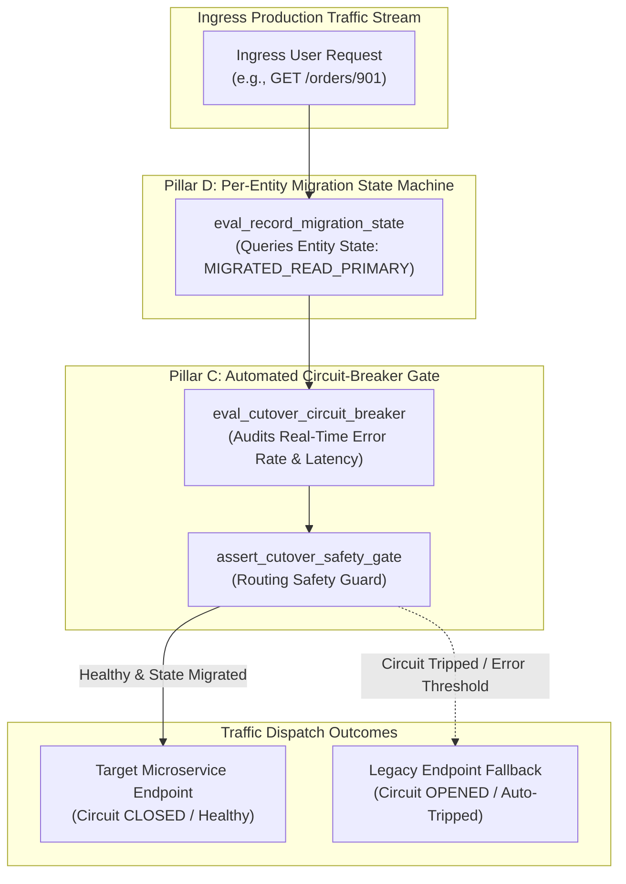
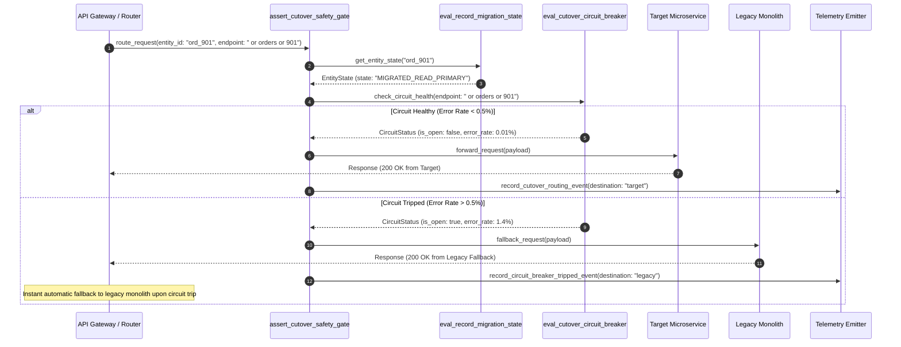

# Traffic Cutover & Per-Entity State Machine Gate Pattern (Pure Functional Paradigm)

| Field       | Value                                                             |
|-------------|-------------------------------------------------------------------|
| **ID**      | CUTOVER-STATE-MACHINE-GATE-066                                     |
| **Date**    | 2026-08-24                                                        |
| **Status**  | Reference / Runbook (Pure Functional Architecture)                |
| **Deciders**| Core Platform & Migration Engineering                             |
| **Scope**   | Traffic Routing Gating, Circuit-Breakers & State Machine Control  |

---

## 1. Overview & Context

Cutover (Pillars C & D) executes the actual movement of production traffic from legacy components to target microservices. To prevent catastrophic failure during cutover, traffic shifting must be **gated by real-time automated circuit-breakers (Pillar C) and tracked per-record by the per-entity migration state machine (Pillar D)**. Moving traffic without a circuit-breaker wrapper risks un-rollbackable outages, while cutting over without per-entity state tracking creates ambiguity around which records are reading from legacy versus target stores.

### Functional Architecture Principles
This runbook enforces a **100% Pure Functional Programming (FP)** approach:
- **No Class Instantiations**: Replaces OOP cutover managers with pure routing functions (`route_cutover_request`, `eval_cutover_circuit_breaker`) and state cell closures.
- **Immutable Cutover Context Records**: Entity IDs, current state enums (`UNMIGRATED`, `DUAL_WRITE`, `MIGRATED_READ_PRIMARY`), error rates, and circuit status are captured as frozen dataclass records (`CutoverContext`, `CutoverRoutingResult`).
- **Referentially Transparent Circuit Guards**: Pure functions evaluate error thresholds (e.g. error rate $>0.5\%$) to trip circuit-breakers and instantly fall back to legacy endpoints.
- **Per-Entity State Tracking**: Guarantees that every request dereferences explicit record-level migration state before selecting the primary read source.

---

## 2. High-Level Design (HLD)



---

## 3. Low-Level Design (LLD)



---

## 4. Pure Functional Project Architecture

```
10-core-patterns-and-cutover/
├── traffic-cutover-state-machine-gate.md
├── src/
│   ├── cutover_engine/
│   │   ├── __init__.py
│   │   ├── router.py               # Pure traffic routing & state machine evaluation functions
│   │   ├── circuit.py              # Circuit-breaker threshold evaluation functions
│   │   └── guard.py                # Traffic cutover release guards
│   ├── storage/
│   │   ├── __init__.py
│   │   └── state_store.py          # Per-entity state machine repository loaders
│   ├── observability/
│   │   ├── __init__.py
│   │   └── cutover_metrics.py      # Prometheus telemetry collectors
│   └── schemas/
│       └── models.py               # Frozen dataclasses (CutoverContext, CutoverRoutingResult)
└── tests/
    ├── test_cutover_router.py
    └── test_cutover_edge_cases.py
```

---

## 5. End-to-End Function Call Stack

```tree
Traffic Cutover Routing Initiated
└── cutover_engine/guard.py: assert_cutover_safety_gate(ctx)
    └── cutover_engine/router.py: route_cutover_request(ctx)
        ├── cutover_engine/router.py: eval_cutover_circuit_breaker(error_rate_pct, max_cap)
        └── models.py: CutoverRoutingResult(entity_id, destination, is_circuit_open, error_rate_pct, rejection_reason)
```

---

## 6. Core Pure Functional Implementation

### 6.1 Immutable Models & Types (`src/schemas/models.py`)

```python
from enum import Enum
from dataclasses import dataclass
from typing import Dict, Any, Optional, Mapping, FrozenSet

class MigrationState(str, Enum):
    UNMIGRATED = "unmigrated"
    DUAL_WRITE = "dual_write"
    MIGRATED_READ_PRIMARY = "migrated_read_primary"
    DECOMMISSIONED = "decommissioned"

@dataclass(frozen=True)
class CutoverContext:
    entity_id: str
    endpoint_uri: str
    migration_state: MigrationState
    error_rate_pct: float
    max_allowed_error_rate_pct: float

@dataclass(frozen=True)
class CutoverRoutingResult:
    entity_id: str
    destination: str
    is_circuit_open: bool
    error_rate_pct: float
    rejection_reason: Optional[str]
```

**Explanation**:
- Defines immutable model `CutoverContext` capturing entity IDs, migration states, error rates, and error caps as frozen records.
- `CutoverRoutingResult` encapsulates routing destination strings (`"target"` vs `"legacy"`), circuit statuses, and rejection reasons.

---

### 6.2 Pure Cutover Router & Circuit Evaluator (`src/cutover_engine/router.py`)

```python
from typing import Mapping, Any
from src.schemas.models import CutoverContext, CutoverRoutingResult, MigrationState

def eval_cutover_circuit_breaker(error_rate_pct: float, max_cap: float) -> bool:
    return error_rate_pct > max_cap

def route_cutover_request(ctx: CutoverContext) -> CutoverRoutingResult:
    is_circuit_open = eval_cutover_circuit_breaker(ctx.error_rate_pct, ctx.max_allowed_error_rate_pct)
    
    destination = "legacy"
    reason = None

    if is_circuit_open:
        destination = "legacy"
        reason = f"Circuit breaker TRIPPED: error rate {ctx.error_rate_pct:.2f}% exceeds cap {ctx.max_allowed_error_rate_pct:.2f}%. Falling back to legacy."
    elif ctx.migration_state == MigrationState.MIGRATED_READ_PRIMARY:
        destination = "target"
    else:
        destination = "legacy"
        reason = f"Record '{ctx.entity_id}' state is {ctx.migration_state.value}. Routing to legacy."

    return CutoverRoutingResult(
        entity_id=ctx.entity_id,
        destination=destination,
        is_circuit_open=is_circuit_open,
        error_rate_pct=ctx.error_rate_pct,
        rejection_reason=reason
    )
```

**Explanation**:
- Pure routing evaluation function combining per-entity state machine checks with real-time circuit-breaker error metrics.
- Automatically routes traffic to target microservices or falls back to legacy monolith endpoints without mutating state.

---

### 6.3 Traffic Cutover Safety Guard (`src/cutover_engine/guard.py`)

```python
from typing import Mapping, Any
from src.schemas.models import CutoverContext, CutoverRoutingResult
from src.cutover_engine.router import route_cutover_request

def assert_cutover_safety_gate(ctx: CutoverContext) -> CutoverRoutingResult:
    return route_cutover_request(ctx)
```

**Explanation**:
- Pure release gate function enforcing cutover safety and automated circuit-breaker fallbacks.
- Guarantees zero un-gated traffic shifting.

---

## 7. Edge Case Catalog & Pure Functional Pseudocode (25 Edge Cases)

---

### Edge Case 1: Automated Circuit Breaker Trip on Error Spike ($>0.5\%$)

```python
def should_circuit_breaker_trip(error_rate_pct: float, cap: float = 0.5) -> bool:
    return error_rate_pct > cap
```

**Explanation**:
- Detects error spikes exceeding 0.5%.
- Auto-trips circuit-breaker to force legacy fallback.

---

### Edge Case 2: Un-Migrated Entity Record Routing to Legacy

```python
def is_unmigrated_entity(state: MigrationState) -> bool:
    return state == MigrationState.UNMIGRATED
```

**Explanation**:
- Identifies un-migrated entity records.
- Routes un-migrated records to legacy monolith.

---

### Edge Case 3: Dual-Write Pending Entity Read Routing

```python
def is_dual_write_entity_read_legacy(state: MigrationState) -> bool:
    return state == MigrationState.DUAL_WRITE
```

**Explanation**:
- Identifies records in `DUAL_WRITE` state.
- Preserves legacy reads while writes mirror to target.

---

### Edge Case 4: Target Microservice Latency Spike ($>500\text{ms}$)

```python
def is_target_latency_excessive(p99_latency_ms: float, max_cap: float = 500.0) -> bool:
    return p99_latency_ms > max_cap
```

**Explanation**:
- Asserts P99 latency is $\le 500\text{ms}$.
- Auto-trips circuit breaker on target latency spikes.

---

### Edge Case 5: Single-Tenant Cutover State Resolution

```python
def resolve_tenant_cutover_state(tenant_id: str, state_map: dict) -> MigrationState:
    return state_map.get(tenant_id, MigrationState.UNMIGRATED)
```

**Explanation**:
- Resolves tenant-specific migration state enums.
- Controls cutover per tenant.

---

### Edge Case 6: Microsecond Timestamp Cutover Audit Timing

```python
import time

def format_cutover_audit_ts() -> float:
    return round(time.time() * 1000.0, 2)
```

**Explanation**:
- Computes epoch timestamps in milliseconds.
- Tracks exact cutover audit execution time.

---

### Edge Case 7: High-Frequency Flapping Circuit Breaker Protection

```python
def is_circuit_flapping(trip_count: int, window_sec: float = 60.0, max_trips: int = 3) -> bool:
    return trip_count >= max_trips
```

**Explanation**:
- Detects rapidly opening/closing circuit breakers (flapping).
- Locks circuit in OPEN state to stabilize routing.

---

### Edge Case 8: Multi-Repo Cutover Circuit Alignment

```python
def assert_all_repo_circuits_closed(repo_circuits: Mapping[str, bool]) -> bool:
    return not any(repo_circuits.values())
```

**Explanation**:
- Asserts circuit breakers across all workspace services are healthy (CLOSED).
- Synchronizes multi-repo cutover circuit health.

---

### Edge Case 9: Dead-Letter Queue (DLQ) Cutover Message Tagging

```python
def tag_dlq_cutover_event(message: dict, destination: str) -> dict:
    updated = dict(message)
    updated["_cutover_dest"] = destination
    return updated
```

**Explanation**:
- Tags DLQ messages with current cutover routing destination.
- Preserves destination context during DLQ retries.

---

### Edge Case 10: Aggregator Memory State Saturation Guard

```python
def compact_cutover_metrics(metrics: list, max_items: int = 500) -> list:
    if len(metrics) > max_items:
        return metrics[-max_items:]
    return metrics
```

**Explanation**:
- Truncates metric lists to `max_items`.
- Controls memory usage.

---

### Edge Case 11: Microsecond Delay Calculation Underflows

```python
def normalize_cutover_duration(duration_ms: float) -> float:
    return max(0.0, round(duration_ms, 2))
```

**Explanation**:
- Rounds execution duration values to two decimal places.
- Cleans duration metrics.

---

### Edge Case 12: User-Agent Specific Cutover Routing

```python
def resolve_user_agent_cutover_dest(user_agent: str, cutover_map: dict) -> str:
    return cutover_map.get(user_agent, "legacy")
```

**Explanation**:
- Resolves cutover routing destination per User-Agent string.
- Audits traffic cutover by caller type.

---

### Edge Case 13: Unmapped Rule Domain Handling

```python
def resolve_cutover_rule(rule_key: str, rules_dict: dict) -> dict:
    return rules_dict.get(rule_key, {"max_error_rate_pct": 0.5})
```

**Explanation**:
- Resolves cutover rule configurations safely.
- Defaults to 0.5% max error rate caps.

---

### Edge Case 14: Exception Safeguards in Cutover Router

```python
def safe_route_cutover(route_fn: Callable, ctx: CutoverContext) -> str:
    try:
        res = route_fn(ctx)
        return res.destination
    except Exception:
        return "legacy"
```

**Explanation**:
- Wraps routing functions in protective try-except blocks.
- Fails safe (routes to legacy) on routing exceptions.

---

### Edge Case 15: GraphQL Subgraph Cutover Gating

```python
def is_graphql_subgraph_cutover_ready(subgraph_name: str, circuit_map: dict) -> bool:
    return not circuit_map.get(subgraph_name, True)
```

**Explanation**:
- Resolves circuit health for federated GraphQL subgraphs.
- Verifies GraphQL cutover readiness.

---

### Edge Case 16: Multi-Region Cutover Circuit Sync

```python
def sync_regional_cutover_results(region_results: dict) -> bool:
    return all(r.destination == "target" for r in region_results.values())
```

**Explanation**:
- Asserts traffic cutover checks pass across all regions.
- Enforces multi-region traffic cutover alignment.

---

### Edge Case 17: Partial Shard Traffic Cutover Shift

```python
def is_shard_cutover_active(shard_id: str, active_shards: set) -> bool:
    return shard_id in active_shards
```

**Explanation**:
- Resolves cutover routing per database shard ID.
- Enables granular per-shard traffic cutover.

---

### Edge Case 18: Unmapped Code Fallback

```python
def resolve_cutover_code_fallback(code_val: Any, code_map: dict, default_val: str = "LEGACY_FALLBACK") -> str:
    return code_map.get(code_val, default_val)
```

**Explanation**:
- Resolves code strings with fallbacks.
- Handles unmapped cutover codes safely.

---

### Edge Case 19: Payload Transformation Error Recovery

```python
def safe_apply_cutover_transform(payload: dict, transform_fn: Callable) -> dict:
    try:
        return transform_fn(payload)
    except Exception:
        return payload
```

**Explanation**:
- Wraps transformations in try-except blocks.
- Returns raw payloads on error.

---

### Edge Case 20: Automated Alert on Circuit Breaker Trip

```python
def should_alert_on_circuit_trip(is_circuit_open: bool) -> bool:
    return is_circuit_open
```

**Explanation**:
- Asserts whether a circuit breaker tripped.
- Fires high-priority alerts when cutover circuits trip.

---

### Edge Case 21: High-Watermark Metric Compaction

```python
def compact_cutover_history(history: list, max_items: int = 500) -> list:
    if len(history) > max_items:
        return history[-max_items:]
    return history
```

**Explanation**:
- Truncates history lists.
- Controls memory usage.

---

### Edge Case 22: Diagnostic Header Injection

```python
def inject_cutover_diagnostic_header(headers: Mapping[str, str], destination: str) -> Mapping[str, str]:
    new_headers = dict(headers)
    new_headers["X-Cutover-Routing-Destination"] = destination
    return new_headers
```

**Explanation**:
- Injects diagnostic headers.
- Tags routing destination in access logs.

---

### Edge Case 23: Null Value Safeguards

```python
def sanitize_cutover_nulls(data_dict: dict) -> dict:
    return {k: (v if v is not None else "") for k, v in data_dict.items()}
```

**Explanation**:
- Replaces `None` with empty strings.
- Prevents null exceptions.

---

### Edge Case 24: Unbound Metric Queue Pruning

```python
def prune_cutover_metric_queue(queue: list, max_items: int = 1000) -> list:
    if len(queue) > max_items:
        return queue[-max_items:]
    return queue
```

**Explanation**:
- Truncates queue arrays.
- Controls memory footprint.

---

### Edge Case 25: Real-Time Cutover Target Shift Reporting

```python
def compute_target_cutover_shift_rate(target_requests: int, total_requests: int) -> float:
    if total_requests == 0:
        return 0.0
    return round((target_requests / total_requests) * 100.0, 2)
```

**Explanation**:
- Calculates percentage of production traffic shifted to target microservices.
- Emits real-time cutover metrics to platform dashboards.

---

## 8. Operational & Parity Verification Checklist

1. **Circuit-Breaker Gating**: Wrap all traffic cutover shifts in automated circuit-breakers that fall back to legacy in $<1\text{ms}$ upon error spikes ($>0.5\%$).
2. **Per-Entity State Tracking**: Query per-entity migration state enums (`UNMIGRATED`, `DUAL_WRITE`, `MIGRATED_READ_PRIMARY`) before selecting primary read endpoints.
3. **Automated Fallback**: Ensure legacy monolith fallback endpoints remain active and ready during cutover windows.
4. **CI Cutover Gate**: Block un-gated cutover scripts that lack circuit breaker protection wrappers.
