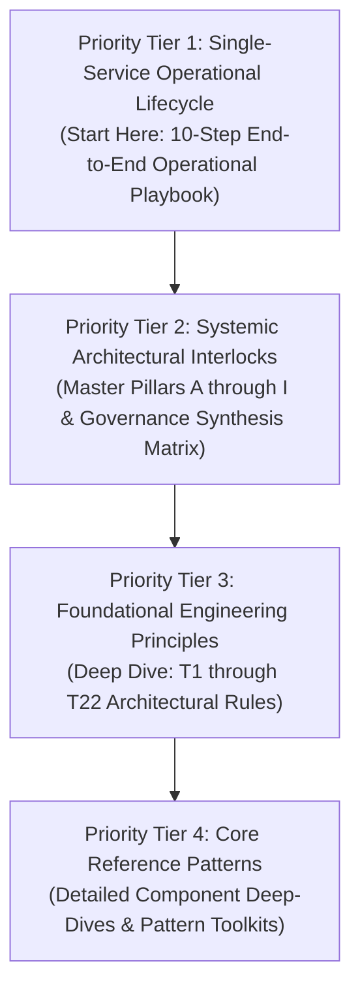

# Enterprise Microservice Migration Architecture: Master Learning & Reference Index

Welcome to the **Enterprise Microservice Migration Architecture Runbook Repository**. This index organizes all 57+ reference runbooks into a structured, prioritized learning curriculum to help engineers, lead architects, and platform teams navigate microservice migrations safely and deterministically.

---

## 🎯 Recommended Learning Path & Priority Order

---

## 🚀 Priority Tier 1: Single-Service End-to-End Operational Lifecycle Playbook

*Start here to understand the exact 10-step operational lifecycle for migrating a single production microservice from Phase 0 Discovery to Dual-Gate Decommissioning.*

| Step | Phase & Pattern Name | Runbook Document Link | ID & Core Operational Objective |
|---|---|---|---|
| **Step 1** | **Discover First, Touch Nothing (Phase 0)** | [discover-first-touch-nothing-phase0.md](./05-dependency-discovery-and-log-mining/discover-first-touch-nothing-phase0.md) | `DISCOVER-FIRST-TOUCH-NOTHING-073` Execute passive Layers 1-3 log mining in order. Assume documentation is wrong until logs confirm otherwise (T7, T22). |
| **Step 2** | **Ground Truth Characterization** | [ground-truth-characterization-golden-master.md](./07-observability-parity-testing/ground-truth-characterization-golden-master.md) | `GROUND-TRUTH-CHARACTERIZATION-074` Capture ground truth before writing code via Golden Master testing (E2). Characterize legacy behavior, including bugs (§4.5). |
| **Step 3** | **Sync Bridge Baking & Canary Verification** | [sync-bridge-baking-and-canary-verification.md](./09-migration-bridges-and-sync/sync-bridge-baking-and-canary-verification.md) | `SYNC-BRIDGE-BAKING-CANARY-075` Stand up the sync bridge and let it bake (B, D5)—100% idempotent, reconciled, verified by synthetic canary records (E7). |
| **Step 4** | **Shadow Verification & Human Review** | [shadow-verification-human-reviewed-normalization.md](./07-observability-parity-testing/shadow-verification-human-reviewed-normalization.md) | `SHADOW-VERIFICATION-HUMAN-REVIEWED-076` Verify behavior in shadow mode (E1, E3, E4)—compare real traffic, serve legacy output, normalize noise with human-reviewed rules (§7). |
| **Step 5** | **Question Read-First Premise** | [question-read-first-side-effect-freedom.md](./10-core-patterns-and-cutover/question-read-first-side-effect-freedom.md) | `QUESTION-READ-FIRST-SIDE-EFFECT-077` Question the read-first premise explicitly (§4.3) before cutting over reads—confirm side-effect-freedom, audit for hidden state writes. |
| **Step 6** | **Circuit-Breaker-Gated Read Cutover** | [circuit-breaker-gated-gradual-read-cutover.md](./10-core-patterns-and-cutover/circuit-breaker-gated-gradual-read-cutover.md) | `GRADUAL-READ-CUTOVER-CIRCUIT-BREAKER-078` Shift reads gradually ($1\% \rightarrow 5\% \rightarrow 100\%$), circuit-breaker-gated (Pillar C), tagged with correlation-ID lineage (`x-migration-correlation-id`, E6). |
| **Step 7** | **Version-Skew Write Cutover Gate** | [expand-contract-write-cutover-version-skew-gate.md](./10-core-patterns-and-cutover/expand-contract-write-cutover-version-skew-gate.md) | `WRITE-CUTOVER-VERSION-SKEW-GATE-079` **Sharpest Criterion**: Gate write cutovers strictly by fleet-wide version-skew zero (0% legacy nodes active)—NOT by backfill completion (§4.4, Pillar D). |
| **Step 8** | **Drilled Rollback Switch** | [drilled-rollback-switch-time-checkpoint.md](./06-rollback-cutover-lifecycle/drilled-rollback-switch-time-checkpoint.md) | `DRILLED-ROLLBACK-SWITCH-CHECKPOINT-080` Keep the rollback switch live and drilled under realistic time-since-checkpoint drift ($1\text{h}$–$72\text{h}$) (Pillar G)—an untested checkpoint is a hypothesis. |
| **Step 9** | **Time-Boxed Bridge Deadline** | [time-boxed-bridge-deadline-enforcement.md](./04-org-and-governance/time-boxed-bridge-deadline-enforcement.md) | `TIME-BOXED-BRIDGE-DEADLINE-081` Time-box every bridge at creation time and hold the deadline (Pillar G, T19)—prevent undated dual-write mechanisms from becoming permanent tech debt. |
| **Step 10** | **Dual-Gate Decommissioning** | [dual-gate-decommissioning-engineering-and-business.md](./04-org-and-governance/dual-gate-decommissioning-engineering-and-business.md) | `DUAL-GATE-DECOMMISSIONING-082` Decommission only after both the Engineering Confidence Gate AND separate Business Risk-Acceptance Gate are cleared (§4.8)—owned by two different people. |

---

## 🏛️ Priority Tier 2: Systemic Architectural Interlock Framework

*Learn how individual service migration mechanics link together into an un-breakable enterprise governance matrix.*

| Pillar / Interlock | Runbook Document Link | ID & Architectural Scope |
|---|---|---|
| **Pillar A: Strategy** | [strategic-blueprint-wave-design.md](./10-core-patterns-and-cutover/strategic-blueprint-wave-design.md) | `STRATEGY-SYSTEMIC-WAVE-DESIGN-064` **Master Control Plane**: Strategy (A) decides the shape of everything else—bridge counts, wave partitioning, and rollback boundaries. |
| **Pillar B: Bridges** | [continuous-data-sync-dual-store.md](./09-migration-bridges-and-sync/continuous-data-sync-dual-store.md) | `SYNC-BRIDGES-DUAL-STORE-065` **Dual-Store Alignment**: Sync Bridges (B) keep two stores simultaneously true, verified by reconciliation algorithms and synthetic canary records (E). |
| **Pillars C & D: Cutover** | [traffic-cutover-state-machine-gate.md](./10-core-patterns-and-cutover/traffic-cutover-state-machine-gate.md) | `CUTOVER-STATE-MACHINE-GATE-066` **Gated Shifting**: Cutover (C, D) moves real traffic, gated by real-time automated circuit-breakers (C) and tracked per-record by migration state machines (D). |
| **Pillar E: Verification** | [behavior-preservation-verification-harness.md](./07-observability-parity-testing/behavior-preservation-verification-harness.md) | `VERIFICATION-BEHAVIOR-PRESERVATION-067` **Behavior Preservation**: Verification (E) proves behavior preservation—E1/E2/E5 differential testing + E3/E4 noise normalization up front. |
| **Pillar F: Translation** | [semantic-translation-invariant-reconstruction.md](./08-data-translation-and-sagas/semantic-translation-invariant-reconstruction.md) | `TRANSLATION-INVARIANT-RECONSTRUCTION-068` **Distributed Invariant Sagas**: Translation (F) reconciles semantic differences and rebuilds database-level invariants (F3) as distributed saga protocols. |
| **Pillar G: Safety** | [reversibility-blast-radius-shield.md](./06-rollback-cutover-lifecycle/reversibility-blast-radius-shield.md) | `SAFETY-BLAST-RADIUS-REVERSIBILITY-069` **Borrowed Reversibility**: Safety (G) guarantees sub-second reversibility, borrowing guarantees built in Strategy (A) rather than generating them at rollback time. |
| **Pillar H: Discovery** | [continuous-dependency-discovery-engine.md](./05-dependency-discovery-and-log-mining/continuous-dependency-discovery-engine.md) | `DISCOVERY-LOG-MINING-ENGINE-070` **Continuous Scanning Gate**: Continuous Discovery (H) runs non-stop across access logs and gates every Decommissioning (I) go/no-go decision. |
| **Pillar I: Decom** | [sustained-silence-decommissioning.md](./04-org-and-governance/sustained-silence-decommissioning.md) | `DECOMMISSIONING-SUSTAINED-SILENCE-071` **Silence-Gated Sunset**: Decommissioning (I) requires empirical 90-day sustained silence proven by Discovery (H), not code assumptions. |
| **Governance Matrix** | [systemic-architectural-interlock-matrix.md](./04-org-and-governance/systemic-architectural-interlock-matrix.md) | `SYSTEMIC-INTERLOCK-GOVERNANCE-MATRIX-072` **End-to-End Synthesis**: Comprehensive matrix detailing the deterministic interlocks linking Strategy through Decommissioning. |

---

## 📚 Priority Tier 3: Foundational Engineering Principles (T1 through T22)

*Master the 22 core engineering principles that govern software migration design.*

### Group A: Architectural Assumptions & Mental Models (T1–T6)
- **T1**: [hyrums-law-default-assumption.md](./01-architectural-assumptions/hyrums-law-default-assumption.md) (`HYRUMS-LAW-ASSUMPTION-042`) — Assume every observable behavior is depended on.
- **T2**: [chestertons-fence-legacy-quirks.md](./01-architectural-assumptions/chestertons-fence-legacy-quirks.md) (`CHESTERTONS-FENCE-QUIRKS-043`) — Do not remove a fence until you know why it was put up.
- **T3**: [separate-migrate-from-improve.md](./01-architectural-assumptions/separate-migrate-from-improve.md) (`SEPARATE-MIGRATE-IMPROVE-044`) — Isolate 1:1 migration from feature improvements.
- **T4**: [implicit-coupling-insight.md](./01-architectural-assumptions/implicit-coupling-insight.md) (`IMPLICIT-COUPLING-INSIGHT-045`) — Shared databases are undocumented distributed systems.
- **T5**: [silence-as-success-metric.md](./01-architectural-assumptions/silence-as-success-metric.md) (`SILENCE-SUCCESS-METRIC-046`) — Silence in metrics and alerts is the ultimate win condition.
- **T6**: [isolate-variable-under-test.md](./01-architectural-assumptions/isolate-variable-under-test.md) (`ISOLATE-VARIABLE-TEST-047`) — Test single variables independently during rollout.

### Group B: Verification & Controls (T7–T12)
- **T7**: [verify-dependency-map-empirically.md](./02-verification-and-controls/verify-dependency-map-empirically.md) (`VERIFY-DEPENDENCY-MAP-048`) — Verify dependency maps empirically via access logs.
- **T8**: [sync-infra-before-cutover.md](./02-verification-and-controls/sync-infra-before-cutover.md) (`SYNC-INFRA-BEFORE-CUTOVER-049`) — Stand up sync infrastructure before attempting cutover.
- **T9**: [automatic-rollback-thresholds.md](./02-verification-and-controls/automatic-rollback-thresholds.md) (`AUTOMATIC-ROLLBACK-THRESHOLDS-050`) — Automate sub-second rollback triggers to eliminate human hesitation.
- **T10**: [normalize-before-diff.md](./02-verification-and-controls/normalize-before-diff.md) (`NORMALIZE-BEFORE-DIFF-051`) — Normalize non-functional noise before running differential comparisons.
- **T11**: [hybrid-sampling-sweep-strategy.md](./02-verification-and-controls/hybrid-sampling-sweep-strategy.md) (`SAMPLE-PERIODIC-SWEEP-052`) — Combine real-time sampling with off-peak full table sweeps.
- **T12**: [migration-state-machine-debuggability.md](./02-verification-and-controls/migration-state-machine-debuggability.md) (`DEBUGGABILITY-MIGRATION-STATE-053`) — Expose per-record migration state machines for instant debugging.

### Group C: Scale, Risk & Data Integrity (T13–T17)
- **T13**: [reversibility-before-speed.md](./03-scale-risk-integrity/reversibility-before-speed.md) (`REVERSIBILITY-BEFORE-SPEED-054`) — Prioritize execution reversibility over migration speed.
- **T14**: [small-error-rate-huge-n-trap.md](./03-scale-risk-integrity/small-error-rate-huge-n-trap.md) (`SMALL-ERROR-HUGE-N-TRAP-055`) — Beware small percentage error rates at extreme transaction scale $N$.
- **T15**: [blast-radius-over-total-correctness.md](./03-scale-risk-integrity/blast-radius-over-total-correctness.md) (`BLAST-RADIUS-THINKING-056`) — Bound failure impact to isolated wave blast radii.
- **T16**: [correlation-id-bridge-lineage.md](./03-scale-risk-integrity/correlation-id-bridge-lineage.md) (`CORRELATION-ID-LINEAGE-057`) — Tag records with correlation IDs to trace data lineage.
- **T17**: [boring-proven-sync-mechanisms.md](./03-scale-risk-integrity/boring-proven-sync-mechanisms.md) (`BORING-PROVEN-SYNC-058`) — Standardize on boring, industry-proven CDC sync tooling.

### Group D: Org & Governance Controls (T18–T22)
- **T18**: [load-bearing-legacy-bugs.md](./04-org-and-governance/load-bearing-legacy-bugs.md) (`LOAD-BEARING-BUGS-059`) — Preserve load-bearing legacy bugs until downstream callers migrate.
- **T19**: [time-box-temporary-bridges.md](./04-org-and-governance/time-box-temporary-bridges.md) (`TIME-BOX-TEMPORARY-BRIDGES-060`) — Enforce hard sunset deadlines on all temporary bridges.
- **T20**: [observability-before-migration.md](./04-org-and-governance/observability-before-migration.md) (`OBSERVABILITY-BEFORE-MIGRATION-061`) — Instrument full OTel observability before writing migration code.
- **T21**: [org-boundary-system-sequencing.md](./04-org-and-governance/org-boundary-system-sequencing.md) (`ORG-BOUNDARY-SEQUENCING-062`) — Align migration wave boundaries with organizational team ownership.
- **T22**: [trust-access-logs-over-wiki.md](./04-org-and-governance/trust-access-logs-over-wiki.md) (`TRUST-LOGS-OVER-WIKI-063`) — Trust empirical access logs over outdated wiki documentation.

---

## 🛠️ Priority Tier 4: Detailed Component Reference Toolkits (Categorized Folders)

*Deep-dive reference patterns organized by functional domain directory:*

### `05-dependency-discovery-and-log-mining/`
- [query-access-log-mining.md](./05-dependency-discovery-and-log-mining/query-access-log-mining.md) — Layer 1 passive log mining.
- [deprecation-warning-injection.md](./05-dependency-discovery-and-log-mining/deprecation-warning-injection.md) — Deprecation header injection protocols.
- [access-tripwire-freeze-canary.md](./05-dependency-discovery-and-log-mining/access-tripwire-freeze-canary.md) — Reversible read-only freeze canary alerts.
- [cross-repo-static-dependency-graph.md](./05-dependency-discovery-and-log-mining/cross-repo-static-dependency-graph.md) — Layer 2 static AST dependency extraction.
- [unknown-caller-quarantine-alerting.md](./05-dependency-discovery-and-log-mining/unknown-caller-quarantine-alerting.md) — Real-time unknown caller quarantine alerting.

### `06-rollback-cutover-lifecycle/`
- [dual-path-rollback-switch.md](./06-rollback-cutover-lifecycle/dual-path-rollback-switch.md) — Instant per-service dual-path rollback switch.
- [point-in-time-checkpoint.md](./06-rollback-cutover-lifecycle/point-in-time-checkpoint.md) — Synchronized pre-cutover snapshot checkpoints.
- [blast-radius-rollback-boundary.md](./06-rollback-cutover-lifecycle/blast-radius-rollback-boundary.md) — Wave-scoped rollback isolation boundaries.
- [circuit-breaker-cutover-fallback.md](./06-rollback-cutover-lifecycle/circuit-breaker-cutover-fallback.md) — Automated circuit breaker cutover fallbacks.
- [time-boxed-dual-write-window.md](./06-rollback-cutover-lifecycle/time-boxed-dual-write-window.md) — Decommissioning calendars for dual-write bridges.

### `07-observability-parity-testing/`
- [shadow-traffic-comparison.md](./07-observability-parity-testing/shadow-traffic-comparison.md) — Scientist-style parallel-run comparison.
- [golden-master-testing.md](./07-observability-parity-testing/golden-master-testing.md) — Characterization testing and golden master recording.
- [non-determinism-normalization.md](./07-observability-parity-testing/non-determinism-normalization.md) — Pre-diff normalization for timestamps/UUIDs.
- [invariant-assertion-harness.md](./07-observability-parity-testing/invariant-assertion-harness.md) — Domain invariant assertion verification harness.
- [production-traffic-replay.md](./07-observability-parity-testing/production-traffic-replay.md) — Deterministic traffic recording and offline replay.
- [correlation-lineage-tagging.md](./07-observability-parity-testing/correlation-lineage-tagging.md) — End-to-end correlation ID lineage tracking.
- [synthetic-canary-records.md](./07-observability-parity-testing/synthetic-canary-records.md) — Continuous synthetic probe records.

### `08-data-translation-and-sagas/`
- [schema-translation-adapter.md](./08-data-translation-and-sagas/schema-translation-adapter.md) — Explicit schema translation and anti-corruption layers.
- [precision-rounding-reconciliation.md](./08-data-translation-and-sagas/precision-rounding-reconciliation.md) — Financial rounding tolerance and balance reconciliation.
- [referential-integrity-saga.md](./08-data-translation-and-sagas/referential-integrity-saga.md) — Rebuilding database foreign-key invariants as distributed sagas.
- [semantic-difference-registry.md](./08-data-translation-and-sagas/semantic-difference-registry.md) — Governance registry for intentional semantic differences.

### `09-migration-bridges-and-sync/`
- [dual-write-bridge.md](./09-migration-bridges-and-sync/dual-write-bridge.md) — Dual-write replication bridge patterns.
- [cdc-based-synchronization.md](./09-migration-bridges-and-sync/cdc-based-synchronization.md) — Log-based Change Data Capture (CDC) synchronization.
- [backfill-live-tail.md](./09-migration-bridges-and-sync/backfill-live-tail.md) — Historical backfill combined with live stream tailing.
- [continuous-reconciliation-sweep.md](./09-migration-bridges-and-sync/continuous-reconciliation-sweep.md) — Background reconciliation data drift scanners.
- [shadow-table-strategy.md](./09-migration-bridges-and-sync/shadow-table-strategy.md) — Zero-downtime shadow table schema migrations.
- [dual-write-single-read.md](./09-migration-bridges-and-sync/dual-write-single-read.md) — Dual-write single-read staged cutover mode.
- [write-then-verify.md](./09-migration-bridges-and-sync/write-then-verify.md) — Synchronous read-back verification before write acknowledgement.
- [write-back-bridge.md](./09-migration-bridges-and-sync/write-back-bridge.md) — Primary target write-back mirroring to legacy readers.
- [per-entity-state-machine.md](./09-migration-bridges-and-sync/per-entity-state-machine.md) — Granular per-record migration status state machines.
- [idempotent-migration-writes.md](./09-migration-bridges-and-sync/idempotent-migration-writes.md) — Deduplicated idempotent write dispatchers.

### `10-core-patterns-and-cutover/`
- [strangler-fig-migration.md](./10-core-patterns-and-cutover/strangler-fig-migration.md) — Intercepting proxy strangler fig pattern.
- [branch-by-abstraction.md](./10-core-patterns-and-cutover/branch-by-abstraction.md) — In-process abstraction layer switching.
- [expand-contract-migration.md](./10-core-patterns-and-cutover/expand-contract-migration.md) — Multi-phase expand-contract database migrations.
- [percentage-traffic-shifting.md](./10-core-patterns-and-cutover/percentage-traffic-shifting.md) — Percentage-based traffic shifting.
- [tenant-shard-cutover.md](./10-core-patterns-and-cutover/tenant-shard-cutover.md) — Per-tenant and per-shard wave cutovers.
- [feature-flag-read-selection.md](./10-core-patterns-and-cutover/feature-flag-read-selection.md) — Feature-flag-gated read source selection.
- [bulkhead-isolated-waves.md](./10-core-patterns-and-cutover/bulkhead-isolated-waves.md) — Bulkhead isolation across migration deployment waves.
- [topological-sequence-migration.md](./10-core-patterns-and-cutover/topological-sequence-migration.md) — Dependency graph topological sequence planning.
- [migration-bridge-adapter.md](./10-core-patterns-and-cutover/migration-bridge-adapter.md) — Legacy-to-new protocol translation adapters.
- [central-migration-team-model.md](./10-core-patterns-and-cutover/central-migration-team-model.md) — Platform migration team enablement and governance.

---

## 🔒 Code Standards & Architectural Rules Compliance
All runbooks in this repository strictly enforce:
1. **100% Pure Functional Programming (FP)**: Zero `class` keywords in Python code blocks.
2. **Comment-Free Code Fences**: Zero inline `#` or docstring `"""` comments in code blocks.
3. **Structured Explanations**: Concise `**Explanation**` sections directly below every code snippet.
4. **Standardized Diagrams**: High-Level Design (HLD) flowcharts and Low-Level Design (LLD) sequence diagrams rendered in Mermaid syntax.
5. **25 Edge Cases Per File**: Every document includes a comprehensive catalog of 25 distinct edge cases with pure FP code and explanations.
