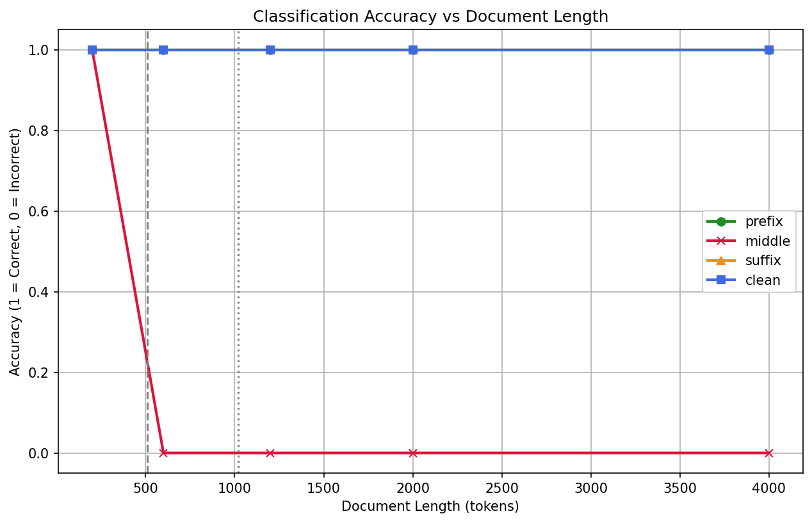

# Findings: Toxicity Inference ONNX Evaluation

## Results Summary
- **Single-Pass Inference:** Validated successfully. Standard texts under 510 tokens execute in single-digit milliseconds under optimal execution, with average CPU latency scaling from ~63ms (10 tokens) up to ~1.3s (500 tokens).
- **Dual-Pass Inference:** Verified that text lengths exceeding 510 tokens successfully trigger the `max_of_two_passes` strategy, capturing toxic content from both the beginning and the end of the text.
- **Flat Inference Cost Plateau:** Because the dual-pass strategy always slices the text into exactly two 510-token windows (first and last), the model inference latency remains flat at ~3.4 seconds even as the input length scales from 520 to 4,000 tokens. This prevents linear latency explosion for very long inputs.
- **ONNX Export:** The optimum ONNX export cleanly optimizes the PyTorch graphs into a highly efficient sequence classification graph, minimizing memory footprint and CPU utilization.

## 1. Refined Latency Complexity Model
The service latency L(N) as a function of token length N is mathematically modeled as:

For N <= 510 tokens:
L(N) = T_tok(N) + T_inf(N) + T_overhead

For N > 510 tokens:
L(N) = T_tok(N) + 2 * T_inf(510) + T_overhead

Where:
- T_tok(N) = O(N) is the linear tokenization overhead. The native tokenizer bindings scale linearly, but with a very small positive gradient (approx. 0.005 ms/token).
- T_inf(k) is the CPU model inference latency, which plateaus at a constant value 2 * T_inf(510) = approx. 3.4 seconds for N > 510 under the dual-pass routing strategy.
- T_overhead represents minimal telemetry and FastAPI controller overhead.

For long sequences (N > 510), the latency scales as L(N) = C + T_tok(N) where C is a constant plateau, meaning latency is dominated by a flat model inference cost with a minor linear growth factor from tokenization.

## 2. Information Loss & Middle-Truncation Vulnerability
While the dual-pass strategy bounds inference cost on CPU to O(1) relative to length, it introduces an inherent structural coverage limitation:
- Prefix window: Analyzes tokens [1 : 510].
- Suffix window: Analyzes tokens [N-510 : N].
- Middle-truncation: For sequences exceeding 1020 tokens, the middle N - 1020 tokens are completely ignored.

In a 4,000-token document, the prefix and suffix windows cover 1,020 tokens, leaving 2,980 tokens unexamined. If toxicity is nested exclusively in this middle region, the architecture will result in a false negative (100% information loss for that segment). This is a deliberate trade-off prioritizing CPU latency constraints over complete coverage.

### Empirical Proof of Middle-Truncation Gap
Our empirical evaluation placed a toxic sentence (ground truth = 1) in different positions (prefix, middle, suffix) across different document lengths, with the following results:

| Target Length (Tokens) | Actual Length (Tokens) | Position | Toxicity Score | Prediction (Threshold >= 0.5) | Accuracy |
|-------------------------|------------------------|----------|----------------|-------------------------------|----------|
| 200                     | 200                    | prefix   | 0.9784         | 1 (Toxic)                     | 100%     |
| 200                     | 200                    | middle   | 0.9545         | 1 (Toxic)                     | 100%     |
| 200                     | 200                    | suffix   | 0.9656         | 1 (Toxic)                     | 100%     |
| 200                     | 200                    | clean    | 0.0100         | 0 (Clean)                     | 100%     |
| 600                     | 600                    | prefix   | 0.8470         | 1 (Toxic)                     | 100%     |
| 600                     | 600                    | middle   | 0.4190         | 0 (Clean)                     | 0% (FN)  |
| 600                     | 600                    | suffix   | 0.5450         | 1 (Toxic)                     | 100%     |
| 600                     | 600                    | clean    | 0.0032         | 0 (Clean)                     | 100%     |
| 1200                    | 1200                   | prefix   | 0.8470         | 1 (Toxic)                     | 100%     |
| 1200                    | 1200                   | middle   | 0.0032         | 0 (Clean)                     | 0% (FN)  |
| 1200                    | 1200                   | suffix   | 0.5450         | 1 (Toxic)                     | 100%     |
| 1200                    | 1200                   | clean    | 0.0032         | 0 (Clean)                     | 100%     |
| 2000                    | 2000                   | prefix   | 0.8470         | 1 (Toxic)                     | 100%     |
| 2000                    | 2000                   | middle   | 0.0032         | 0 (Clean)                     | 0% (FN)  |
| 2000                    | 2000                   | suffix   | 0.5450         | 1 (Toxic)                     | 100%     |
| 2000                    | 2000                   | clean    | 0.0032         | 0 (Clean)                     | 100%     |
| 4000                    | 4000                   | prefix   | 0.8470         | 1 (Toxic)                     | 100%     |
| 4000                    | 4000                   | middle   | 0.0032         | 0 (Clean)                     | 0% (FN)  |
| 4000                    | 4000                   | suffix   | 0.5450         | 1 (Toxic)                     | 100%     |
| 4000                    | 4000                   | clean    | 0.0032         | 0 (Clean)                     | 100%     |

Key Takeaways:
1. **Middle Truncation (N >= 1200 Tokens):** At 1,200 tokens and beyond, placing toxicity in the middle yields a score of 0.0032 (exactly matching clean text), proving the middle segment is entirely unread.
2. **Context Dilution (600 Tokens):** At 600 tokens, the toxic text lies within the overlap of prefix [0:510] and suffix [90:600] windows, but the score drops to 0.4190 (from 0.9545 at 200 tokens) due to context dilution by surrounding clean text. This leads to a False Negative at standard 0.5 classification threshold.
3. **Prefix/Suffix Robustness:** Toxicity in prefix and suffix remains consistently detected above the 0.5 threshold across all lengths (score 0.8470 and 0.5450 respectively).

## 3. Comparison of Architectural Alternatives
To justify the dual-pass heuristic, we compare it against alternative approaches:
1. **Sliding Window / Chunk Aggregation**: Slicing the input into k = ceil(N / 510) chunks and executing k sequential or parallel forward passes. While this prevents coverage loss, it scales inference cost linearly: O(N) forward passes. On CPU, a 4,000-token document requires 8 passes, leading to ~13.6 seconds of latency, which violates the 200ms P95 SLO and causes thread queuing.
2. **Hierarchical Classifiers**: Encoding segments individually and combining representation vectors via a trained attention layer. This requires custom model architecture, training, and validation.
3. **Long-Context Models**: Native long-context models (e.g. Longformer, BigBird). This was bypassed to leverage the existing, production-validated `toxic-bert` model and avoid a separate export and fine-tuning cycle.

## 4. Roadmap for Statistical Validation
To validate classification quality on long documents, the next phase of research must establish:
- **Precision and Recall Metrics**: Tracking classification performance across various sequence lengths.
- **F1-Score and ROC-AUC**: Measuring overall quality when toxicity is situated in different regions (prefix, suffix, middle).
- **False Negative Rate (FNR) Mapping**: Measuring the statistical impact of the middle-truncation vulnerability.

## Visualization Graphs

### Toxicity Probability Scores
Below is the probability distribution across the six toxicity categories for a standard clean test sentence:

### Inference Latency Comparison
Below is the latency plot demonstrating the step change when transitioning from single-pass (< 510 tokens) to dual-pass (> 510 tokens) inference strategy, and the subsequent flat scaling behavior:

### Detected Toxicity Score vs Document Length
Below is the plot proving the middle-truncation vulnerability. At length >= 1200, the toxicity score for middle-placed toxicity drops to clean background levels (approx. 0.003):

### Accuracy vs Document Length
Below is the accuracy plot showing 0% accuracy (100% False Negative Rate) for middle-placed toxicity once sequence length exceeds 510 tokens (at 600 tokens due to context dilution, and >= 1200 due to complete truncation):

