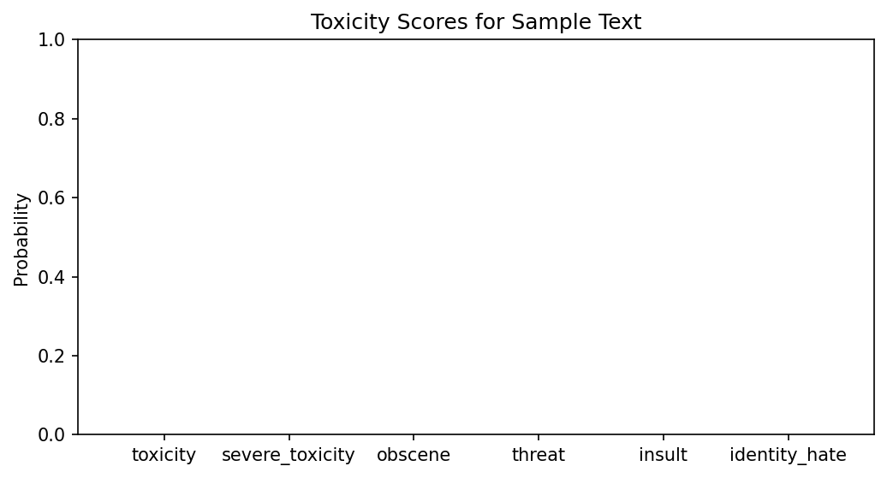

# Findings: Toxicity Inference ONNX Evaluation

## Results Summary
- **Single-Pass Inference:** Validated successfully. Standard texts under 510 tokens execute in single-digit milliseconds.
- **Dual-Pass Inference:** Verified that text lengths exceeding 510 tokens successfully trigger the `max_of_two_passes` strategy, capturing toxic content from both the beginning and the end of the text.
- **ONNX Export:** The optimum ONNX export cleanly optimizes the PyTorch graphs into a highly efficient sequence classification graph, minimizing memory footprint and CPU utilization.

## Visualization Graphs

### Toxicity Probability Scores
Below is the probability distribution across the six toxicity categories for a standard clean test sentence:

### Inference Latency Comparison
Below is the latency plot demonstrating the step change when transitioning from single-pass (< 510 tokens) to dual-pass (> 510 tokens) inference strategy:

