# ADR-011: Implement FastAPI service-to-service REST Query API for latency-engine

* **Status**: Accepted
* **Date**: 2026-06-26
* **Deciders**: Jaydeep

## Context and Problem Statement
How can upstream systems and observability dashboards query calculated percentiles, SLO burn rates, and historical baselines from latency-engine securely and performantly?

## Decision Drivers
* **D1**: Access to metrics must be secured via service-to-service authentication.
* **D2**: Telemetry query processing must not block worker's CPU-bound Kafka polling loop.
* **D3**: API responses must strictly conform to the OpenAPI v1 contract specs.
* **D4**: ClickHouse connection outages must not prevent HTTP server startup.

## Business Decision Tree (Ingestion & Processing Flow)
The latency engine evaluates every consumed span against the following processing paths to ensure correct stats aggregation:

```
                          [Raw Span Event Consumed]
                                      │
                                      ▼
               [Validate Span: Has model & latency_ms_total?]
                               /             \
                       (No)   /               \   (Yes)
                             ▼                 ▼
                     [Skip Span]       [Parse UTC Timestamp]
                                               │
           ┌───────────────────────────────────┼──────────────────────────────────┐
           │                                   │                                  │
           ▼                                   ▼                                  ▼
[latency_ms_ttft exists?]             [Is retry_count > 0?]             [SLO threshold check]
      /         \                           /         \                       /         \
(No) /           \ (Yes)             (Yes) /           \ (No)           (Yes)/           \(No)
    ▼             ▼                       ▼             ▼                   ▼             ▼
[Skip]     [Update TTFT Sketch]     [Update Retry]  [Update Total]     [Incr Errors    [Incr Total
           (sketch:ttft:{m}:{h})     (sketch:retry)  (sketch:total)     & Total]        Only]
                  │                                                         │               │
                  ▼                                                         ▼               ▼
           [TPOT Eligible?]                                                 └───────┬───────┘
         (TTFT & Tokens > 0,                                                        │
          Reason != timeout)                                                        │
              /         \                                                           ▼
      (No)   /           \ (Yes)                                           [Attribution tags?]
            ▼             ▼                                                    /          \
         [Skip]     [Calc TPOT]                                         (Yes) /            \ (No)
                    (tpot:latest)                                            ▼              ▼
                                                                     [Store Hash    [Skip]
                                                                      & Agg Avg]
```

### Why this is Critical & Important:
* **Tail Latency Accuracy (p95/p99)**: Capturing tail latencies in LLM interactions is vital because typical average (p50) values hide severe bottlenecks. Using DDSketches allows the system to aggregate raw logs into memory-efficient, mathematically accurate percentiles dynamically.
* **Non-Blocking Query Separation**: If HTTP query requests block the consumer worker's CPU-bound Kafka poller, offsets will lag, creating database backpressure and telemetry delay. Running the query API on a background thread preserves consumer throughput under heavy traffic spikes.
* **SLO Error Budgeting**: Accurate tracking of SLO burn rates (over 1h, 6h, and 3-day windows) triggers leading indicators of platform degradation. The query API surfaces these budgets securely via service-to-service JWT to allow automatic remediation before client SLA breaches occur.

### Good Latency Metrics Selection
The table below specifies what makes a metric "good" and its critical utility in observability:

| Metric Name | What makes it a Good Metric | Why it is Good / Value | Example Target |
| :--- | :--- | :--- | :--- |
| **Tail Latency (p95/p99)** | Measures the performance of worst-case requests. | Captures degradation seen by heavy users; averages (p50) hide tail spikes. | `p99_total_ms` <= 1500ms |
| **SLO Burn Rate** | A leading indicator showing the rate of error budget consumption. | Alerts operations of a degradation early before the monthly SLA is violated. | `burn_rate_1h` > 14.4x |
| **Time to First Token (TTFT)** | Measures responsiveness in streaming completions. | Directly affects user perceived latency in interactive applications. | `p95_ttft_ms` <= 300ms |
| **Throughput Per Output Token (TPOT)** | Measures LLM execution efficiency independent of completion size. | Decouples document size from processing speed to evaluate true LLM performance. | `tpot_ms` = (total - ttft) / tokens |

### Critical Telemetry & Architectural Tradeoffs
The table below details the design tradeoffs evaluated during the implementation:

| Tradeoff Dimension | Option A (Chosen: Threaded Async Engine) | Option B (Alternative: Isolated Process) | Tradeoff Rationale |
| :--- | :--- | :--- | :--- |
| **Query Latency vs. CPU Contention** | Low query latency due to shared-memory cache retrieval. May cause minor CPU context-switch overhead under high request throughput. | Zero CPU impact on the ingestion worker. Higher deployment costs and slight I/O network latency. | Threaded model was chosen to prioritize low infrastructure footprint and local cache reads. |
| **High Accuracy vs. Storage Size** | DDSketch relative accuracy set to 1% (`relative_accuracy=0.01`). | Raw transaction telemetry storage in ClickHouse/S3. | Storing raw spans is cost-prohibitive. DDSketches capture precise tail percentiles with a constant, small memory footprint. |
| **Immediate Consistency vs. Resource Overhead** | Pipeline batch writes (`pipe.execute()`) reduce network overhead. | Eventual consistency in metric queries (1-minute latency lag). | We compromise minor query consistency to avoid overwhelming Redis with single-key writes. |

## Decision Hierarchy Tree
Below is the structural decision path followed for this API design choice:

```
Implement Latency Engine REST Query API
│
├── Functional Requirements
│   ├── Query Latency Percentiles (p50, p95, p99)
│   ├── Query SLO Burn Rates (1h, 6h, 3d windows)
│   ├── Query Historical Baselines (past N days)
│   └── Service-to-Service HS256 JWT Authentication
│
├── Non-functional Requirements
│   ├── Low read latency (under 10ms target)
│   ├── High ingestion availability (non-blocking thread model)
│   └── Conformity with OpenAPI v1 specification
│
├── Processing & Threading
│   ├── Option B: Isolated Process
│   └── Option A: Threaded Async FastAPI ✓
│       └── Reason:
│           ├── Reuses port 8002 footprint
│           └── Non-blocking polling loop concurrency
│
├── Ingestion Storage (Cache)
│   ├── Memcached
│   └── Redis ✓
│       └── Reason:
│           ├── Fast raw DDSketch merges
│           ├── Multi-window SLO bucket pipelining
│           └── Automatic TTL management
│
├── Long-term Storage (Baseline)
│   ├── PostgreSQL
│   └── ClickHouse ✓
│       └── Reason:
│           ├── Multi-million metrics column storage
│           ├── Fast daily p99 aggregations
│           └── Lazy-connection test isolation
│
└── Deployment
    ├── Docker Container (FastAPI + Kafka Consumer thread)
    ├── Redis Instance
    └── ClickHouse Cluster
```

## Architectural Mental Models

### 1. Failure-First Model
Enumerate and design for system failures prior to designing the happy execution paths:
* **Lazy DB Connection**: The ClickHouse adapter delays client instantiation until query-time (`@property`). This prevents eager connection attempts from failing HTTP server startup or breaking unit tests when ClickHouse is offline.
* **Non-Blocking Telemetry Ingestion**: The query service runs in a daemon background thread. If query load spikes or blocks, the worker's Kafka consumer loop continues polling and committing offsets without dropping events.
* **Configurable Port Fail-Safe**: Avoids hard-coded port bindings. The server port defaults to `8002` but is configurable via `HEALTH_PORT` to prevent startup collisions.

### 2. Ports and Adapters (Hexagonal Architecture)
Maintain strict separation of business logic from framework and platform side-effects:
* **Pure Core Logic**: `LatencyQueryService` is framework-agnostic. It contains zero imports of FastAPI or raw Redis/ClickHouse drivers, executing entirely through interface protocols.
* **Swappable Infrastructure**: Adapters (`LatencyRedisAdapter`, `LatencyClickHouseAdapter`) implement the defined ports (`LatencyRedisPort`, `LatencyClickHousePort`) structurally, meaning databases or drivers can be replaced with zero impact to the service layer.

### 3. Logarithmic Percentile Compression (DDSketch)
Optimize memory consumption while maintaining high percentile resolution:
* **Sketch Storage**: Rather than storing raw timestamps (which grow linearly with traffic), we persist compressed logarithmic sketches in Redis.
* **Low Relative Error**: Restricts percentiles error bounds to 1% (`relative_accuracy=0.01`), ensuring that tail latency metrics (p95/p99) remain highly accurate with constant-size cache keys.

## Relationship, Synergy, and Architecture Flow

This section details how the instrumentation SDK, Kafka ingestion, Redis real-time storage (DDSketch + SLO), ClickHouse historical storage, and the FastAPI REST API work together to form a cohesive, high-performance telemetry loop.

### 1. End-to-End Telemetry Data Flow Diagram

The following sequence diagram illustrates how a span generated by the Instrumentation SDK traverses the system to update real-time and long-term stores, and how those stores are subsequently queried by the FastAPI service.

```mermaid
sequenceDiagram
    autonumber
    actor User as Client Application
    participant SDK as Instrumentation SDK
    participant Kafka as Kafka Broker
    participant Worker as Ingestion Worker
    participant Redis as Redis Cache (DDSketch/SLO)
    participant CH as ClickHouse (Baselines)
    participant API as FastAPI REST API
    participant Ops as Ops Dashboard / Alert Engine

    %% 1. Instrumentation SDK capturing details
    User->>SDK: Calls chat.completions.create()
    Note over SDK: Capture TTFT, Total Latency,<br/>Tokens & Model attributes
    SDK-->>User: Streaming Completion
    SDK->>Kafka: Publish Raw Span Payload (Async)

    %% 2. Worker Ingestion Loop
    par Ingestion Thread
        Kafka->>Worker: Poll Raw Spans (Batch of 500)
        Note over Worker: Validate Schema & Parse UTC Timestamps
        
        %% Update DDSketches & SLO in Redis
        Worker->>Redis: 1. Update DDSketch Log-buckets<br/>(sketch:total, sketch:ttft)<br/>2. Increment SLO count (total/error)
        
        %% Pipeline batch write to ClickHouse (or via decoupled worker)
        Worker->>CH: Batch insert raw spans/baselines
    end

    %% 3. REST API Query and Alert Lifecycle
    rect rgb(30, 41, 59)
        Note over Ops, API: Observability & Alerting Path
        Ops->>API: GET /v1/latency/slo (Query Burn Rates)
        API->>Redis: Read SLO counters & calculate burn rates
        Redis-->>API: Active error budget consumption
        API-->>Ops: Return 1h/6h/3d burn rate states

        Ops->>API: GET /v1/latency/percentiles (Diagnose Spikes)
        API->>Redis: Retrieve DDSketch key structures
        Note over API: Merge sketches & calculate p50/p95/p99
        API-->>Ops: Return exact tail percentile metrics

        Ops->>API: GET /v1/latency/baseline (Correlate History)
        API->>CH: Query past N days percentile profiles
        CH-->>API: Columns of historical aggregates
        API-->>Ops: Return baseline comparison profile
    end
```



### 2. Internals: How the Components Work Together

*   **Instrumentation SDK**: Integrated directly into client applications via decorators or auto-instrumentation handlers. It acts as the *Source of Truth*, tracking raw metrics (TTFT, total latency, token count, model status) and publishing them to Kafka asynchronously to ensure zero impact on application latency.
*   **Kafka Ingestion**: Serves as the *Concurrency Buffer*. By separating span reporting from processing, ingestion survives high-throughput spikes. The consumer worker retrieves batches and processes them concurrently without blocking client transactions.
*   **DDSketches (Logarithmic Buckets) in Redis**: Provides *Memory-Efficient Percentile Representation*. Storing every raw latency value is resource-prohibitive. DDSketch compresses these latencies into logarithmically sized buckets inside Redis, allowing mathematically accurate percentile calculation (within 1% relative error) from a constant-size byte footprint.
*   **Rolling SLO Counters in Redis**: Tracks *System Reliability*. Evaluates every incoming span against configured thresholds. Redis keeps moving counters of total vs. failed requests over rolling timeframes (1h, 6h, 3d), enabling instant calculation of the remaining error budget.
*   **ClickHouse Columnar Storage**: Serves as the *Historical Brain*. Long-term baselines are stored in ClickHouse. Because of its columnar layout, calculating historical averages, aggregations, and daily profiles across millions of rows takes milliseconds, preventing query pollution on the transaction-heavy Redis instance.
*   **FastAPI REST API**: Serves as the *Unified Query Layer*. Upstream dashboards, gateways, and alerting systems query this layer. It authenticates callers, performs real-time sketch merging and percentile calculations from Redis, queries baselines from ClickHouse, and serves responses matching the OpenAPI schema.

### 3. Design Rationale (Why this architecture?)

*   **Decoupled Paths for Write vs. Read**: Writes are handled asynchronously via Kafka streams, while reads are serviced through memory-cached Redis structures or highly optimized columnar databases (ClickHouse). This eliminates database read/write locks and guarantees sub-10ms response times for real-time queries.
*   **DDSketch & SLO Synergy**: SLO calculations alert us *when* a service is degraded, but they do not explain *where* or *how*. DDSketches provide the latency distribution context (e.g., distinguishing a universal slow-down from a few massive tail-latency spikes), which is essential for target troubleshooting.
*   **Thread-Isolated Web Server**: Running the query API on a background daemon thread within the consumer process optimizes resource footprint (sharing memory caches and configuration) while ensuring that heavy query traffic never chokes the core ingestion Kafka consumer.

### 4. Alternative Operational Models (How we can use this differently)

1.  **Dynamic SDK Sampling Gateways**:
    Instead of tracing 100% of spans, the query API can expose baseline statistics that the Instrumentation SDK pulls periodically. If latency is stable, the SDK scales back its sampling rate (e.g., to 10%), reducing downstream storage costs. Under regression, sampling dynamically scales up to 100%.
2.  **Autonomous Alerting Trigger Engine**:
    Instead of relying on external alerting systems to poll `/v1/latency/slo`, the background latency-engine thread can publish SLO budget exhaustion events directly to an internal `alerts` Kafka topic when burn-rates cross threshold levels, reducing time-to-alert.
3.  **Trace-Level Remediation Routing**:
    Upstream API Gateways query `/v1/latency/percentiles` per model. If a specific LLM model (e.g., `gpt-4o`) shows tail-latency degradation (p99 > 2000ms), the gateway automatically reroutes user traffic to a fallback model until the latency profiles return to baseline.

## Failure Modes Created

### FM-1: Port conflicts on port 8002
*   **Symptom**: Service fail-starts with port already in use.
*   **Detection**: Startup logs contain port binding error.
*   **Prevention**: HTTP port is fully configurable via `HEALTH_PORT` environment variable.

## Review Trigger
*   Review if HTTP query volume exceeds 10,000 requests/second (at that point, Option B becomes necessary).
