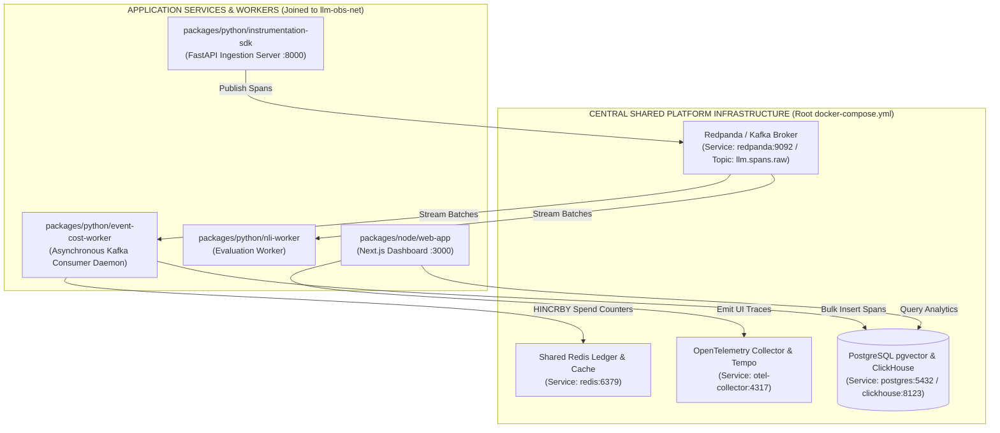
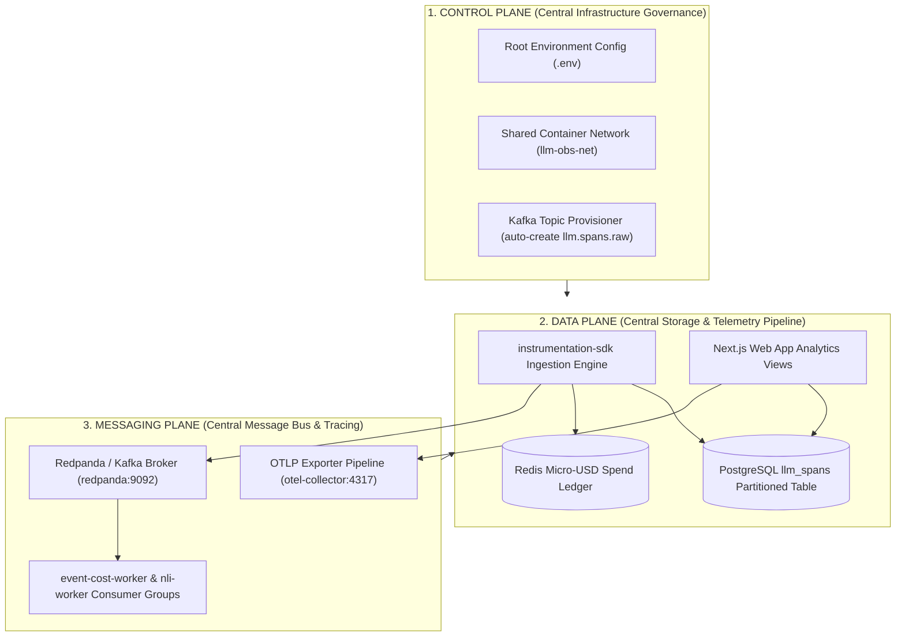

# ADR-013 — Centralized Shared Platform Infrastructure Topology vs Decoupled Microservice Containers

| Field | Value |
| --- | --- |
| **ID** | `013` |
| **Date** | 2026-08-25 |
| **Status** | **accepted** |
| **Deciders** | LLM Observability Platform Architecture Team |
| **Scope** | Root Platform Infrastructure (`docker-compose.yml`), `instrumentation-sdk`, `event-cost-worker`, `web-app`, `nli-worker`, `slo-burn-worker` |

---

## 1. Context & Problem Statement

As the platform expanded, multiple microservice packages (e.g. `packages/python/event-cost-worker`, `packages/python/instrumentation-sdk`) introduced localized `deploy/docker/docker-compose.yaml` files defining separate Redpanda/Kafka brokers, Redis containers, and PostgreSQL instances.

This decentralized infrastructure topology introduced severe architectural anti-patterns and production failure modes:

1. **Event Delivery Isolation & Siloing**:
   - `instrumentation-sdk` published span events to Redpanda Container A (listening on isolated network `sdk-net`).
   - `event-cost-worker` consumed from Redpanda Container B (listening on isolated network `worker-net`).
   - **Result**: `event-cost-worker` never received span events because the message broker was fragmented into two disconnected instances.

2. **Host Port Collisions & Conflict Errors**:
   - Multiple local `docker-compose.yaml` files attempted to bind the same host ports (`9092` for Kafka, `6379` for Redis, `5432` for Postgres, `4317` for OTLP).

3. **Resource Waste & Data Drift**:
   - Running 3+ Redpanda containers, 4+ Redis containers, and multiple database servers across package directories consumed excessive CPU/RAM and fragmented Redis financial spend counters (`org:id:spend`).

---

## 2. Decision & Architecture Overview

We adopt a **Single Central Shared Platform Infrastructure Architecture**:

1. **Single Central Platform Infrastructure Package (`packages/configs/llm-obs-infra/docker-compose.yml`)**:
   - **Kafka / Redpanda Broker** (`llmobs-kafka:9092` / host `31414`): Single message bus serving topic `llm.spans.raw` and DLQs for all services.
   - **Shared Redis Cache** (`llmobs-redis:6379`): Single key-value store for API key TTL caching, rate limiting, and real-time micro-USD cost ledgers.
   - **OpenTelemetry Collector & Tempo** (`llmobs-otel-collector:4318` / `llmobs-tempo:3200`): Central distributed tracing and metric collection pipeline.
   - **PostgreSQL + pgvector & ClickHouse** (`llmobs-postgres:5432` / `llmobs-clickhouse:8123`): Shared analytics DB servers housing partitioned logical schemas (`llm_spans`, `auth_ledger`).

2. **Application Microservices (`packages/python/*`, `packages/node/*`)**:
   - Contain **only** application code and worker logic containers.
   - Attach to the shared platform Docker network (`llm-obs-net`).
   - Point environment variables to central infrastructure endpoints (`KAFKA_BOOTSTRAP_SERVERS="redpanda:9092"`, `REDIS_URL="redis://redis:6379"`, `POSTGRES_URL="..."`).

3. **Package Local `docker-compose.dev.yaml` Policy**:
   - Sub-package docker-compose files are strictly restricted to isolated unit-test mocks or standalone SDK demos and MUST NOT be used in integrated multi-service environments.

---

## 3. High-Level Design (HLD) Architecture



---

## 4. Three-Plane Architectural Blueprint (Control, Data & Messaging)



---

## 5. End-to-End Call Stack Topology

```text
└── [Root Infrastructure Launch] docker compose -f docker-compose.yml up -d
    ├── 1. Launch Central Shared Services:
    │   ├── redpanda:9092          (Topic: llm.spans.raw)
    │   ├── redis:6379             (Key-Value Spend Ledger)
    │   ├── postgres:5432          (Database: llm_observability)
    │   ├── otel-collector:4317    (OTLP Receiver)
    │   └── tempo:31417            (Trace Waterfall Engine)
    │
    ├── 2. Launch Client Application LLM Call
    │   └── client.chat.completions.create(...)
    │       └── instrumentation-sdk :: ReliableKafkaSpanReporter.report(span)
    │           └── HTTP POST http://localhost:8000/v1/spans
    │               └── FastAPI Ingest -> Produce message to redpanda:9092 (llm.spans.raw)
    │
    ├── 3. Asynchronous Worker Execution
    │   └── event-cost-worker :: process_kafka_span_batch()
    │       ├── Poll batch from redpanda:9092
    │       ├── HINCRBY org:spend on redis:6379
    │       └── INSERT INTO llm_spans on postgres:5432
    │
    └── 4. Frontend Dashboard Visualization
        └── web-app :: GET http://localhost:3000/costs
            └── Next.js Server Route -> Query postgres:5432 -> Render Spend Charts
```

---

## 6. Consequences

### Positive
- **Guaranteed Event Delivery**: `instrumentation-sdk` and `event-cost-worker` communicate on the exact same Kafka topic (`llm.spans.raw`).
- **Eliminated Port Conflicts**: Single host binding for `9092`, `6379`, `5432`, and `4317`.
- **~60% RAM Reduction**: Eliminates 3 duplicate Kafka and 4 duplicate Redis containers during development.

### Negative
- Local package testing requires either attaching to the central root Docker stack or specifying `--env-file` overrides.
