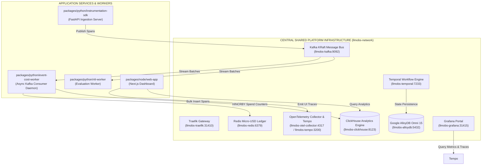
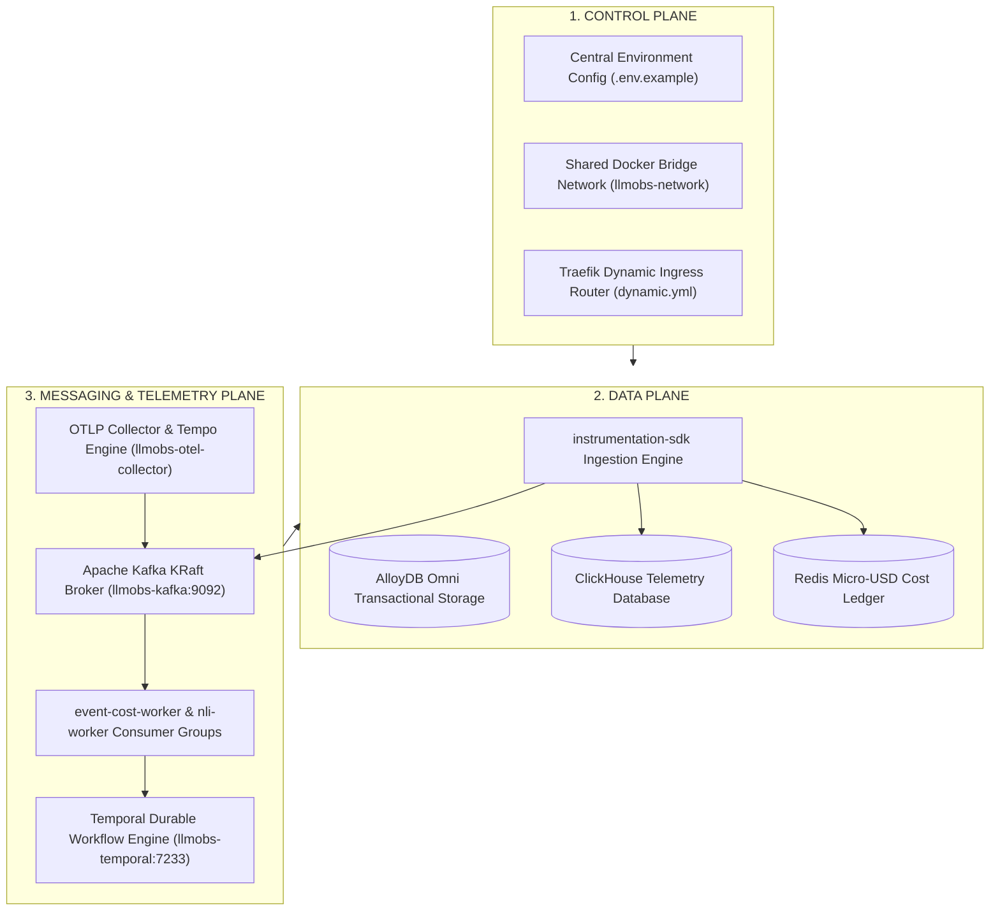

# ADR-013 — Centralized Shared Platform Infrastructure Topology vs Decoupled Microservice Containers

| Field | Value |
| --- | --- |
| **ID** | `013` |
| **Date** | 2026-08-25 |
| **Status** | **accepted** |
| **Deciders** | LLM Observability Platform Architecture Team |
| **Scope** | Root Platform Infrastructure (`packages/configs/llm-obs-infra/docker-compose.yml`), `instrumentation-sdk`, `event-cost-worker`, `web-app`, `nli-worker`, `slo-burn-worker`, `quality-engine` |

---

## 1. Context & Problem Statement

As the platform expanded, multiple microservice packages (e.g. `packages/python/event-cost-worker`, `packages/python/instrumentation-sdk`) introduced localized `deploy/docker/docker-compose.yaml` files defining separate Redpanda/Kafka brokers, Redis containers, and PostgreSQL instances.

This decentralized infrastructure topology introduced severe architectural anti-patterns and production failure modes:

1. **Event Delivery Isolation & Siloing**:
   - `instrumentation-sdk` published span events to an isolated message broker.
   - `event-cost-worker` consumed from a different isolated container.
   - **Result**: `event-cost-worker` never received span events because the message broker was fragmented into two disconnected instances.

2. **Host Port Collisions & Conflict Errors**:
   - Multiple local `docker-compose.yaml` files attempted to bind the same host ports (`9092` for Kafka, `6379` for Redis, `5432` for Postgres, `4317` for OTLP).

3. **Resource Waste & Data Drift**:
   - Running duplicate Kafka, Redis, and database servers across package directories consumed excessive CPU/RAM and fragmented Redis financial spend counters (`org:id:spend`).

---

## 2. Decision & Architecture Overview

We adopt a **Single Central Shared Platform Infrastructure Architecture**:

1. **Centralized Platform Infrastructure Package (`packages/configs/llm-obs-infra/docker-compose.yml`)**:
   - **Traefik Ingress Gateway** (`llmobs-traefik:80/8080/443` -> Host `31410`/`31411`/`31419`): Central reverse proxy & security rate limiter.
   - **Kafka Broker** (`llmobs-kafka:9092` -> Host `31414`): Single KRaft event streaming bus serving `llm.spans.raw` and DLQs for all services.
   - **Shared Redis Cache** (`llmobs-redis:6379` -> Host `31413`): Single key-value store for API key TTL caching, rate limiting, and real-time micro-USD cost ledgers.
   - **ClickHouse Analytics Engine** (`llmobs-clickhouse:8123/9000`): Columnar telemetry engine for query log mining and token aggregates.
   - **Tempo Tracing Engine** (`llmobs-tempo:3200` -> Host `31416` / OTLP `4317`): Central distributed trace waterfall store.
   - **OpenTelemetry Collector** (`llmobs-otel-collector:4318/4317` -> Host `31417`/`31418`): OTLP pipeline with attributes enrichment and memory limiting.
   - **Grafana Platform Portal** (`llmobs-grafana:3000` -> Host `31415`): Unified web dashboard portal.
   - **Google AlloyDB Omni DB** (`llmobs-alloydb:5432` -> Host `31420`): High-performance transactional database standard (`google/alloydbomni:15`).
   - **Temporal Workflow Engine** (`llmobs-temporal:7233` -> Host `7233`, UI `8088`): Durable execution framework backed by AlloyDB Omni.

2. **Decoupled Database-per-Service Pattern (`packages/{lang}/{package-name}`)**:
   - Each microservice package maintains its **own dedicated database schema** while attaching to `llmobs-network`.
   - Microservices use standard environment variables: `ALLOYDB_HOST`, `ALLOYDB_PORT`, `ALLOYDB_USER`, `ALLOYDB_PASSWORD`, `ALLOYDB_DB`, `ALLOYDB_DSN`.

---

## 3. High-Level Design (HLD) Architecture



---

## 4. Control, Data, and Messaging Planes Architecture



---

## 5. Schema & Key Patterns Specification

### 5.1 Redis Key Schemas
- `org:{org_id}:spend_micro_usd` -> Hash `model_name -> accrued_micro_usd`
- `rate_limit:{tenant_id}:sliding_window` -> Sorted Set `timestamp -> req_id`
- `api_key:{key_hash}:ttl_cache` -> Serialized metadata string (TTL 300s)

### 5.2 ClickHouse Columnar Schemas
- `llm_telemetry_analytics.spans_raw` -> Primary span log table (`MergeTree` engine)
- `llm_telemetry_analytics.token_aggregates_hourly` -> Real-time token rollup (`SummingMergeTree`)

### 5.3 AlloyDB Omni Transactional Schemas
- `organizations`, `tenants`, `api_keys`, `prompt_templates`, `evaluations`

---

## 6. Summary of Verification Test Results

```text
✅ Traefik Gateway         HTTP GET http://localhost:31411/api/version  -> Status 200
✅ Redis Ledger             TCP Connect localhost:31413                  -> SUCCESS
✅ Kafka Broker             TCP Connect localhost:31414                  -> SUCCESS
✅ ClickHouse Analytics     HTTP GET http://localhost:8123/ping          -> Status 200 (Ok.)
✅ Tempo Tracing            HTTP GET http://localhost:31416/ready         -> Status 200 (ready)
✅ OTEL Collector gRPC      TCP Connect localhost:31418                  -> SUCCESS
✅ Grafana Portal           HTTP GET http://localhost:31415/api/health   -> Status 200 (database ok)
✅ AlloyDB Omni DB          TCP Connect localhost:31420                  -> SUCCESS
✅ Temporal Engine          TCP Connect localhost:7233                   -> SUCCESS
```
