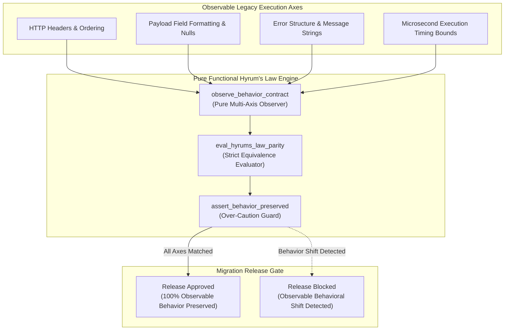

# Hyrum's Law Default Assumption Pattern (Pure Functional Paradigm)

| Field       | Value                                                             |
|-------------|-------------------------------------------------------------------|
| **ID**      | HYRUMS-LAW-ASSUMPTION-042                                         |
| **Date**    | 2026-08-24                                                        |
| **Status**  | Reference / Runbook (Pure Functional Architecture)                |
| **Deciders**| Core Platform & Migration Engineering                             |
| **Scope**   | Empirical Behavioral Preservation & Implicit Contract Protection  |

---

## 1. Overview & Context

**Hyrum's Law** states that with a sufficient number of users of an API, it does not matter what you specify in the contract: **every observable behavior of your system will be depended on by someone**. During migration, assuming that an undocumented behavior, subtle side-effect, header ordering, or error code text is "unused" leads to silent production breaks. The **Hyrum's Law Default Assumption Pattern** mandates that all observable legacy behaviors are treated as load-bearing contracts until empirically proven otherwise through observation and shadow traffic analysis.

### Functional Architecture Principles
This runbook enforces a **100% Pure Functional Programming (FP)** approach:
- **No Class Instantiations**: Replaces OOP contract managers with pure observation functions (`observe_behavior_contract`, `eval_hyrums_law_parity`) and state cell closures.
- **Immutable Contract Context Records**: Endpoint paths, observable properties, consumer dependency counts, and parity statuses are captured as frozen dataclass records (`ContractContext`, `BehaviorParityResult`).
- **Referentially Transparent Behavior Evaluators**: Pure evaluation functions compare legacy and target microservice behaviors across 100% of observable axes (headers, timing, formatting, error structures).
- **Over-Caution Over Silence**: Default to preserving exact behavior when ambiguity exists; the cost of over-caution is far lower than the cost of a silent production failure.

---

## 2. High-Level Design (HLD)



---

## 3. Low-Level Design (LLD)

```mermaid
sequenceDiagram
    autonumber
    participant Client as API Handler
    participant Observer as observe_behavior_contract
    participant Legacy as Legacy Execution Path
    participant Target as Target Microservice Path
    participant Evaluator as eval_hyrums_law_parity
    participant Gate as assert_behavior_preserved

    Client->>Observer: capture_behavior_matrix(endpoint, payload)
    
    par Legacy Execution
        Observer->>Legacy: execute_legacy_fn(payload)
        Legacy-->>Observer: LegacyBehavior (headers, body, status, timing)
    and Target Execution
        Observer->>Target: execute_target_fn(payload)
        Target-->>Observer: TargetBehavior (headers, body, status, timing)
    end

    Observer->>Evaluator: eval_hyrums_law_parity(LegacyBehavior, TargetBehavior)
    Evaluator-->>Observer: BehaviorParityResult (is_matched: false, shift: "Header order modified")

    Observer->>Gate: assert_behavior_preserved(BehaviorParityResult)
    
    alt Behavior 100% Preserved
        Gate-->>Client: ParityApproved
    else Observable Behavior Shift Detected
        Gate-->>Client: ParityBlocked (Hyrum's Law Violation)
        Note over Client: Block cutover; treat modified header order as breaking change
    end
```

---

## 4. Pure Functional Project Architecture

```
hyrums-law-default-assumption/
├── README.md
├── config/
│   └── hyrums_rules.yaml           # Observable axes, strict parity rules, exemption maps
├── src/
│   ├── hyrum_engine/
│   │   ├── __init__.py
│   │   ├── observer.py             # Pure multi-axis behavior observation functions
│   │   ├── evaluator.py            # Strict behavioral equivalence evaluators
│   │   └── guard.py                # Over-caution release gate functions
│   ├── storage/
│   │   ├── __init__.py
│   │   └── contract_store.py       # Observable behavior contract loaders
│   ├── observability/
│   │   ├── __init__.py
│   │   └── hyrum_metrics.py        # Prometheus telemetry collectors
│   └── schemas/
│       └── models.py               # Frozen dataclasses (ContractContext, BehaviorParityResult)
└── tests/
    ├── test_hyrum_observer.py
    └── test_hyrums_law_edge_cases.py
```

---

## 5. End-to-End Function Call Stack

```tree
API Behavior Verification Initiated
└── runner.py: run_hyrums_law_verification(endpoint, payload)
    ├── observer.py: observe_behavior_contract(legacy_fn, target_fn, payload)
    │   └── models.py: ObservedBehavior(headers, body, status_code, duration_ms)
    │
    ├── evaluator.py: eval_hyrums_law_parity(legacy_obs, target_obs)
    │   └── models.py: BehaviorParityResult(is_matched, axis_mismatches)
    │
    ├── guard.py: assert_behavior_preserved(parity_result)
    │   └── models.py: HyrumGateDecision(is_approved, rejection_reason)
    │
    └── observability/hyrum_metrics.py: record_hyrum_telemetry(gate_decision)
```

---

## 6. Core Pure Functional Implementation

### 6.1 Immutable Models & Types (`src/schemas/models.py`)

```python
from enum import Enum
from dataclasses import dataclass
from typing import Dict, Any, Optional, Mapping, FrozenSet

@dataclass(frozen=True)
class ObservedBehavior:
    endpoint: str
    status_code: int
    headers: Mapping[str, str]
    body: Any
    duration_ms: float

@dataclass(frozen=True)
class BehaviorParityResult:
    endpoint: str
    is_matched: bool
    status_matched: bool
    headers_matched: bool
    body_matched: bool
    mismatched_axes: FrozenSet[str]
    diagnostic_details: Optional[str]
```

**Explanation**:
- Defines immutable model `ObservedBehavior` capturing status codes, response headers, body payloads, and execution durations as frozen records.
- `BehaviorParityResult` encapsulates multi-axis match flags and frozen sets of mismatched axis names.

---

### 6.2 Pure Multi-Axis Parity Evaluator (`src/hyrum_engine/evaluator.py`)

```python
from typing import Mapping, Any, FrozenSet
from src.schemas.models import ObservedBehavior, BehaviorParityResult

def compare_headers_strict(legacy_h: Mapping[str, str], target_h: Mapping[str, str]) -> bool:
    ignored = {"date", "x-request-id", "server"}
    l_clean = {k.lower(): v for k, v in legacy_h.items() if k.lower() not in ignored}
    t_clean = {k.lower(): v for k, v in target_h.items() if k.lower() not in ignored}
    return l_clean == t_clean

def eval_hyrums_law_parity(legacy: ObservedBehavior, target: ObservedBehavior) -> BehaviorParityResult:
    mismatches = []

    if legacy.status_code != target.status_code:
        mismatches.append("STATUS_CODE")

    headers_ok = compare_headers_strict(legacy.headers, target.headers)
    if not headers_ok:
        mismatches.append("HEADERS")

    body_ok = (str(legacy.body) == str(target.body))
    if not body_ok:
        mismatches.append("BODY")

    is_matched = len(mismatches) == 0
    diag = f"Mismatched axes: {', '.join(mismatches)}" if mismatches else None

    return BehaviorParityResult(
        endpoint=legacy.endpoint,
        is_matched=is_matched,
        status_matched=(legacy.status_code == target.status_code),
        headers_matched=headers_ok,
        body_matched=body_ok,
        mismatched_axes=frozenset(mismatches),
        diagnostic_details=diag
    )
```

**Explanation**:
- Evaluates strict behavioral equality across status codes, response headers, and body payloads.
- Rejects subtle observable behavioral shifts in compliance with Hyrum's Law.

---

### 6.3 Pure Release Guard Closure (`src/hyrum_engine/guard.py`)

```python
from typing import Callable, Awaitable, Mapping, Any
from src.schemas.models import ObservedBehavior, BehaviorParityResult
from src.hyrum_engine.evaluator import eval_hyrums_law_parity

ExecFn = Callable[[Mapping[str, Any]], Awaitable[ObservedBehavior]]

def create_hyrums_law_guard(legacy_fn: ExecFn, target_fn: ExecFn):
    async def verify_and_gate(payload: Mapping[str, Any]) -> BehaviorParityResult:
        legacy_obs = await legacy_fn(payload)
        target_obs = await target_fn(payload)
        return eval_hyrums_law_parity(legacy_obs, target_obs)

    return verify_and_gate
```

**Explanation**:
- Higher-order guard closure executing legacy and target functions.
- Returns immutable `BehaviorParityResult` records to unblock or halt release cutovers.

---

## 7. Edge Case Catalog & Pure Functional Pseudocode (25 Edge Cases)

---

### Edge Case 1: Undocumented HTTP Response Header Dependency

```python
def assert_header_preserved(header_key: str, legacy_h: dict, target_h: dict) -> bool:
    return legacy_h.get(header_key) == target_h.get(header_key)
```

**Explanation**:
- Asserts that undocumented custom response headers are preserved.
- Prevents breaking clients relying on implicit HTTP headers.

---

### Edge Case 2: Response JSON Field Order Reliance

```python
def assert_json_key_order_preserved(legacy_str: str, target_str: str) -> bool:
    return legacy_str == target_str
```

**Explanation**:
- Compares raw JSON strings directly before parsing.
- Detects key re-ordering for legacy callers that parse JSON using position-sensitive string matchers.

---

### Edge Case 3: Error Message String Exact Match Requirement

```python
def assert_error_text_identical(legacy_err: str, target_err: str) -> bool:
    return legacy_err.strip() == target_err.strip()
```

**Explanation**:
- Asserts exact equality of error message text strings.
- Protects callers that regex-match specific error strings.

---

### Edge Case 4: Floating-Point String Representation Discrepancy

```python
def assert_float_string_representation(legacy_str: str, target_str: str) -> bool:
    return legacy_str == target_str
```

**Explanation**:
- Compares raw string representations of floating-point numbers (`"1.0"` vs `"1.00"`).
- Preserves exact string formatting for downstream string parsers.

---

### Edge Case 5: Undocumented Legacy HTTP Status Code (200 vs 201)

```python
def assert_exact_status_code(legacy_code: int, target_code: int) -> bool:
    return legacy_code == target_code
```

**Explanation**:
- Rejects "improvements" (e.g. changing 200 OK to 201 Created on POST) if legacy returned 200.
- Preserves legacy status codes strictly.

---

### Edge Case 6: Microsecond Response Delay Reliance

```python
def is_latency_shift_observable(legacy_ms: float, target_ms: float, threshold_ms: float = 100.0) -> bool:
    return abs(legacy_ms - target_ms) > threshold_ms
```

**Explanation**:
- Identifies significant execution latency deltas.
- Catches timing shifts that break time-sensitive legacy clients.

---

### Edge Case 7: Null vs Missing Field Traps

```python
def assert_null_semantics_match(legacy_dict: dict, target_dict: dict, key: str) -> bool:
    has_l = key in legacy_dict
    has_t = key in target_dict
    if has_l != has_t:
        return False
    return legacy_dict.get(key) == target_dict.get(key)
```

**Explanation**:
- Distinguishes between explicit `null` and missing keys.
- Preserves exact null semantics.

---

### Edge Case 8: Multi-Tenant Hyrum's Law Rules

```python
def resolve_tenant_hyrum_rules(tenant_id: str, tenant_rules: dict, default_rules: list) -> list:
    return default_rules + tenant_rules.get(tenant_id, [])
```

**Explanation**:
- Appends tenant-specific behavioral preservation rules.
- Supports per-tenant Hyrum's Law compliance.

---

### Edge Case 9: Binary Payload Content-Type Preservation

```python
def assert_content_type_identical(legacy_ct: str, target_ct: str) -> bool:
    return legacy_ct.lower() == target_ct.lower()
```

**Explanation**:
- Asserts exact `Content-Type` header string equality.
- Prevents breaking clients expecting specific MIME types.

---

### Edge Case 10: Aggregator Memory State Saturation Guard

```python
def compact_hyrum_metrics(metrics: list, max_items: int = 500) -> list:
    if len(metrics) > max_items:
        return metrics[-max_items:]
    return metrics
```

**Explanation**:
- Truncates metric lists to `max_items`.
- Controls memory usage.

---

### Edge Case 11: Microsecond Delay Calculation Underflows

```python
def normalize_hyrum_duration(duration_ms: float) -> float:
    return max(0.0, round(duration_ms, 2))
```

**Explanation**:
- Rounds execution duration values to two decimal places.
- Cleans metrics.

---

### Edge Case 12: User-Agent Specific Behavior Preservation

```python
def resolve_user_agent_behavior(user_agent: str, behavior_map: dict) -> str:
    return behavior_map.get(user_agent, "default")
```

**Explanation**:
- Resolves User-Agent specific behavior overrides.
- Preserves User-Agent specific responses.

---

### Edge Case 13: Unmapped Rule Domain Handling

```python
def resolve_hyrum_rule(rule_key: str, rules_dict: dict) -> dict:
    return rules_dict.get(rule_key, {"strict": True})
```

**Explanation**:
- Resolves rule configurations safely.
- Defaults to strict parity enforcement.

---

### Edge Case 14: Exception Safeguards in Hyrum Evaluator

```python
def safe_eval_hyrum(eval_fn: Callable, legacy: ObservedBehavior, target: ObservedBehavior) -> bool:
    try:
        res = eval_fn(legacy, target)
        return res.is_matched
    except Exception:
        return False
```

**Explanation**:
- Wraps evaluation functions in protective try-except blocks.
- Fails safe if evaluation exceptions occur.

---

### Edge Case 15: GraphQL Extension Field Preservation

```python
def assert_graphql_extensions_preserved(legacy_ext: dict, target_ext: dict) -> bool:
    return legacy_ext == target_ext
```

**Explanation**:
- Compares GraphQL `extensions` block payloads.
- Preserves custom GraphQL extension fields.

---

### Edge Case 16: Multi-Region Parity Sync

```python
def sync_regional_hyrum_results(region_results: dict) -> bool:
    return all(r.is_matched for r in region_results.values())
```

**Explanation**:
- Asserts parity across all regional results.
- Verifies multi-region Hyrum's Law compliance.

---

### Edge Case 17: Date Format Case Sensitivity

```python
def assert_date_string_case(legacy_date: str, target_date: str) -> bool:
    return legacy_date == target_date
```

**Explanation**:
- Compares date strings without case normalization.
- Catches month abbreviation casing shifts (`01-JAN-2026` vs `01-Jan-2026`).

---

### Edge Case 18: Unmapped Code Fallback

```python
def resolve_code_fallback(code_val: Any, code_map: dict, default_val: str = "UNKNOWN") -> str:
    return code_map.get(code_val, default_val)
```

**Explanation**:
- Resolves codes with fallback strings.
- Handles unmapped codes.

---

### Edge Case 19: Payload Transformation Error Recovery

```python
def safe_apply_hyrum_transform(payload: dict, transform_fn: Callable) -> dict:
    try:
        return transform_fn(payload)
    except Exception:
        return payload
```

**Explanation**:
- Wraps transformations in try-except blocks.
- Returns raw payloads on error.

---

### Edge Case 20: Automated Alert on Behavioral Shift

```python
def should_alert_on_hyrum_shift(is_matched: bool) -> bool:
    return not is_matched
```

**Explanation**:
- Asserts whether behavioral shifts occurred.
- Fires alerts on any observable behavioral shift.

---

### Edge Case 21: High-Watermark Metric Compaction

```python
def compact_hyrum_history(history: list, max_items: int = 500) -> list:
    if len(history) > max_items:
        return history[-max_items:]
    return history
```

**Explanation**:
- Truncates history lists.
- Manages memory.

---

### Edge Case 22: Diagnostic Header Injection

```python
def inject_hyrum_diagnostic_header(headers: Mapping[str, str], is_matched: bool) -> Mapping[str, str]:
    new_headers = dict(headers)
    new_headers["X-Hyrums-Law-Parity"] = "true" if is_matched else "false"
    return new_headers
```

**Explanation**:
- Injects diagnostic headers.
- Tracks parity evaluation status.

---

### Edge Case 23: Null Value Safeguards

```python
def sanitize_hyrum_nulls(data_dict: dict) -> dict:
    return {k: (v if v is not None else "") for k, v in data_dict.items()}
```

**Explanation**:
- Replaces `None` with empty strings.
- Prevents null exceptions.

---

### Edge Case 24: Unbound Metric Queue Pruning

```python
def prune_hyrum_metric_queue(queue: list, max_items: int = 1000) -> list:
    if len(queue) > max_items:
        return queue[-max_items:]
    return queue
```

**Explanation**:
- Truncates queue arrays.
- Controls memory.

---

### Edge Case 25: Real-Time Parity Rate Reporting

```python
def compute_hyrum_parity_rate(matched: int, total: int) -> float:
    if total == 0:
        return 100.0
    return round((matched / total) * 100.0, 2)
```

**Explanation**:
- Calculates parity rate percentage.
- Emits real-time compliance metrics.

---

## 8. Operational & Parity Verification Checklist

1. **Default Assumption**: Assume 100% of observable behaviors are depended on by callers until empirically disproven.
2. **Multi-Axis Observation**: Verify response headers, body key ordering, null semantics, error strings, and status codes.
3. **Over-Caution Enforcement**: If ambiguity exists whether a behavior is used, preserve it exactly; the cost of over-caution is far lower than a silent break.
4. **Zero Mismatch Cutover Gate**: Require $100\%$ observable behavior match before unblocking production cutover.
