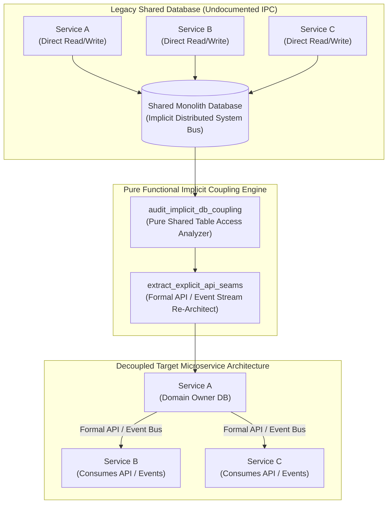
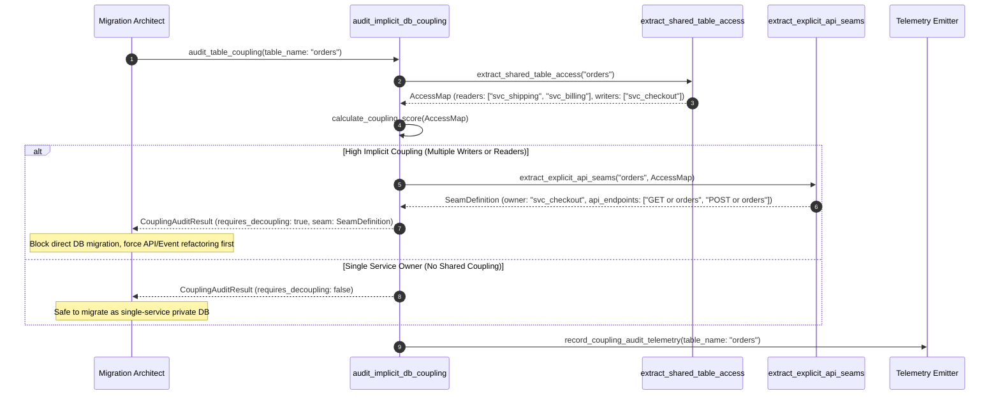

# Implicit Coupling Insight Pattern (Pure Functional Paradigm)

| Field       | Value                                                             |
|-------------|-------------------------------------------------------------------|
| **ID**      | IMPLICIT-COUPLING-INSIGHT-045                                     |
| **Date**    | 2026-08-24                                                        |
| **Status**  | Reference / Runbook (Pure Functional Architecture)                |
| **Deciders**| Core Platform & Migration Engineering                             |
| **Scope**   | Shared Database Un-Coupling & Distributed System Re-Architecture  |

---

## 1. Overview & Context

A shared database accessed directly by $N$ independent microservices is **an un-designed distributed system in disguise**. When multiple services read and write to shared tables, the database serves as an undocumented, out-of-band IPC (Inter-Process Communication) transport layer with zero API contract enforcement. Migrating a shared database as if it were a simple storage layer leads to catastrophic failure because engineers underestimate cross-service coupling. The **Implicit Coupling Insight Pattern** mandates explicitly auditing, mapping, and re-implementing these undocumented database-level IPC mechanisms as formal API contracts or event streams prior to database decoupling.

### Functional Architecture Principles
This runbook enforces a **100% Pure Functional Programming (FP)** approach:
- **No Class Instantiations**: Replaces OOP coupling analyzers with pure graph evaluation functions (`audit_implicit_db_coupling`, `eval_shared_table_dependencies`) and state cell closures.
- **Immutable Coupling Context Records**: Shared table names, reader service sets, writer service sets, cross-service triggers, and coupling risk scores are stored as frozen dataclass records (`SharedTableCouplingContext`, `CouplingAuditResult`).
- **Referentially Transparent Coupling Mappers**: Pure functions analyze database schema permissions, access logs, and query patterns to map all hidden service-to-service database coupling.
- **Formal API Decoupling Contracts**: Replaces direct table access with explicit pure HTTP/gRPC service interfaces or event-driven pub/sub channels.

---

## 2. High-Level Design (HLD)



---

## 3. Low-Level Design (LLD)



---

## 4. Pure Functional Project Architecture

```
implicit-coupling-insight/
├── README.md
├── config/
│   └── coupling_rules.yaml         # Shared table definitions, threshold scores, owner assignments
├── src/
│   ├── coupling_engine/
│   │   ├── __init__.py
│   │   ├── auditor.py              # Pure shared database access auditing functions
│   │   ├── seam_extractor.py       # API seam & event contract extraction functions
│   │   └── guard.py                # Database migration release guards
│   ├── storage/
│   │   ├── __init__.py
│   │   └── coupling_store.py       # Shared table configuration loaders
│   ├── observability/
│   │   ├── __init__.py
│   │   └── coupling_metrics.py     # Prometheus telemetry collectors
│   └── schemas/
│       └── models.py               # Frozen dataclasses (SharedTableCouplingContext, CouplingAuditResult)
└── tests/
    ├── test_coupling_auditor.py
    └── test_implicit_coupling_edge_cases.py
```

---

## 5. End-to-End Function Call Stack

```tree
Database Table Decoupling Audit Initiated
└── runner.py: run_coupling_audit_job(table_name, access_logs)
    ├── auditor.py: audit_implicit_db_coupling(table_name, access_logs)
    │   └── models.py: SharedTableCouplingContext(table_name, readers, writers)
    │
    ├── seam_extractor.py: extract_explicit_api_seams(coupling_context)
    │   └── models.py: SeamDefinition(owner_service, api_endpoints, event_topics)
    │
    ├── guard.py: evaluate_decoupling_readiness(coupling_context, seam_definition)
    │   └── models.py: CouplingAuditResult(is_ready, coupling_score, seam)
    │
    └── observability/coupling_metrics.py: record_coupling_telemetry(coupling_audit_result)
```

---

## 6. Core Pure Functional Implementation

### 6.1 Immutable Models & Types (`src/schemas/models.py`)

```python
from enum import Enum
from dataclasses import dataclass
from typing import Dict, Any, Optional, Mapping, FrozenSet

@dataclass(frozen=True)
class SharedTableCouplingContext:
    table_name: str
    reader_services: FrozenSet[str]
    writer_services: FrozenSet[str]
    db_triggers_count: int
    foreign_keys_count: int

@dataclass(frozen=True)
class SeamDefinition:
    owner_service: str
    proposed_api_routes: FrozenSet[str]
    proposed_event_topics: FrozenSet[str]

@dataclass(frozen=True)
class CouplingAuditResult:
    table_name: str
    is_shared_coupling_detected: bool
    coupling_score: float
    requires_api_seam: bool
    seam: Optional[SeamDefinition]
```

**Explanation**:
- Defines immutable model `SharedTableCouplingContext` capturing table names, reader service sets, writer service sets, and trigger counts as frozen records.
- `CouplingAuditResult` encapsulates coupling scores, detection flags, and proposed API seam definitions.

---

### 6.2 Pure Shared Table Coupling Auditor (`src/coupling_engine/auditor.py`)

```python
from typing import FrozenSet, Mapping, Any
from src.schemas.models import SharedTableCouplingContext, CouplingAuditResult, SeamDefinition

def calculate_coupling_score(readers: FrozenSet[str], writers: FrozenSet[str], triggers: int) -> float:
    total_services = len(readers.union(writers))
    writer_penalty = len(writers) * 2.5
    trigger_penalty = triggers * 1.5
    return round(total_services + writer_penalty + trigger_penalty, 2)

def audit_implicit_db_coupling(ctx: SharedTableCouplingContext) -> CouplingAuditResult:
    score = calculate_coupling_score(ctx.reader_services, ctx.writer_services, ctx.db_triggers_count)
    is_shared = (len(ctx.reader_services) + len(ctx.writer_services)) > 1

    seam = None
    if is_shared:
        owner = sorted(list(ctx.writer_services))[0] if ctx.writer_services else "unassigned_owner"
        routes = frozenset([f"GET /api/v1/{ctx.table_name}", f"POST /api/v1/{ctx.table_name}"])
        topics = frozenset([f"events.{ctx.table_name}.updated"])
        seam = SeamDefinition(owner_service=owner, proposed_api_routes=routes, proposed_event_topics=topics)

    return CouplingAuditResult(
        table_name=ctx.table_name,
        is_shared_coupling_detected=is_shared,
        coupling_score=score,
        requires_api_seam=is_shared,
        seam=seam
    )
```

**Explanation**:
- Pure function calculating database coupling risk scores based on reader counts, writer counts, and stored triggers.
- Automatically generates proposed API route and event topic seam definitions for shared tables.

---

### 6.3 Decoupling Readiness Guard (`src/coupling_engine/guard.py`)

```python
from typing import Mapping, Any
from src.schemas.models import SharedTableCouplingContext, CouplingAuditResult
from src.coupling_engine.auditor import audit_implicit_db_coupling

def evaluate_decoupling_readiness(ctx: SharedTableCouplingContext) -> CouplingAuditResult:
    return audit_implicit_db_coupling(ctx)
```

**Explanation**:
- Evaluates shared database tables prior to migration.
- Rejects direct database migration if un-architected implicit IPC coupling exists.

---

## 7. Edge Case Catalog & Pure Functional Pseudocode (25 Edge Cases)

---

### Edge Case 1: Multiple Writer Services on Shared Table

```python
def has_multiple_writers(writers: set) -> bool:
    return len(writers) > 1
```

**Explanation**:
- Asserts whether multiple services write to the same table.
- Flags high-risk multi-writer database coupling.

---

### Edge Case 2: Cross-Database Stored Procedure Cascades

```python
def has_stored_procedure_cascades(procedure_count: int) -> bool:
    return procedure_count > 0
```

**Explanation**:
- Detects cross-database stored procedure calls.
- Identifies hidden database-level logic coupling.

---

### Edge Case 3: Implicit FK References Across Microservice Domains

```python
def has_cross_domain_foreign_keys(fk_domains: set) -> bool:
    return len(fk_domains) > 1
```

**Explanation**:
- Detects foreign keys bridging different domain boundaries.
- Re-architects foreign keys into logical API references.

---

### Edge Case 4: Synchronous Database Triggers as Inter-Service Bus

```python
def is_trigger_acting_as_bus(trigger_actions: list) -> bool:
    return any("NOTIFY" in act.upper() or "INSERT INTO" in act.upper() for act in trigger_actions)
```

**Explanation**:
- Identifies database triggers used for inter-service signaling.
- Replaces database triggers with message queues.

---

### Edge Case 5: Single-Tenant Database Partitioning

```python
def resolve_tenant_coupling_score(tenant_id: str, tenant_scores: dict) -> float:
    return tenant_scores.get(tenant_id, 0.0)
```

**Explanation**:
- Resolves tenant-specific coupling scores.
- Supports per-tenant database un-coupling.

---

### Edge Case 6: Microsecond Timestamp Audit Calculation

```python
import time

def format_coupling_audit_ts() -> float:
    return round(time.time() * 1000.0, 2)
```

**Explanation**:
- Computes epoch timestamps in milliseconds.
- Tracks exact audit execution time.

---

### Edge Case 7: Shared Database Views as Implicit APIs

```python
def is_view_used_across_services(view_readers: set) -> bool:
    return len(view_readers) > 1
```

**Explanation**:
- Detects shared database views accessed by multiple services.
- Replaces shared database views with REST/gRPC endpoints.

---

### Edge Case 8: Multi-Repo Database Schema Dependencies

```python
def aggregate_cross_repo_db_access(repo_access_maps: list) -> dict:
    merged = {}
    for m in repo_access_maps:
        for k, v in m.items():
            merged[k] = merged.get(k, set()).union(v)
    return merged
```

**Explanation**:
- Merges table access maps across multiple repositories.
- Consolidates workspace-wide database coupling maps.

---

### Edge Case 9: Read-Only Shared Reference Table (Lookup Tables)

```python
def is_read_only_lookup_table(writers: set) -> bool:
    return len(writers) == 0
```

**Explanation**:
- Identifies read-only static lookup tables.
- Allows read-only reference table replication across microservices.

---

### Edge Case 10: Aggregator Memory State Saturation Guard

```python
def compact_coupling_metrics(metrics: list, max_items: int = 500) -> list:
    if len(metrics) > max_items:
        return metrics[-max_items:]
    return metrics
```

**Explanation**:
- Truncates metric lists to `max_items`.
- Controls memory usage.

---

### Edge Case 11: Microsecond Delay Calculation Underflows

```python
def normalize_coupling_duration(duration_ms: float) -> float:
    return max(0.0, round(duration_ms, 2))
```

**Explanation**:
- Rounds execution duration values to two decimal places.
- Cleans duration metrics.

---

### Edge Case 12: User-Agent Application Identification

```python
def parse_db_client_user_agent(conn_attrs: dict) -> str:
    return conn_attrs.get("application_name", "unknown_app")
```

**Explanation**:
- Extracts `application_name` from PostgreSQL connection parameters.
- Identifies microservices connecting to shared databases.

---

### Edge Case 13: Unmapped Rule Domain Handling

```python
def resolve_coupling_rule(rule_key: str, rules_dict: dict) -> dict:
    return rules_dict.get(rule_key, {"max_readers": 1})
```

**Explanation**:
- Resolves coupling rule configurations safely.
- Defaults to strict single-owner rules.

---

### Edge Case 14: Exception Safeguards in Coupling Auditor

```python
def safe_eval_coupling(eval_fn: Callable, ctx: SharedTableCouplingContext) -> bool:
    try:
        res = eval_fn(ctx)
        return res.is_shared_coupling_detected
    except Exception:
        return True
```

**Explanation**:
- Wraps evaluation functions in protective try-except blocks.
- Fails safe (assumes coupling exists) on evaluation exceptions.

---

### Edge Case 15: GraphQL Shared Table Model Interception

```python
def is_graphql_model_shared(graphql_types: set, db_tables: set) -> bool:
    return len(graphql_types.intersection(db_tables)) > 1
```

**Explanation**:
- Detects shared database tables exposed via GraphQL schemas.
- Maps GraphQL database coupling.

---

### Edge Case 16: Multi-Region Database Coupling Sync

```python
def sync_regional_coupling_scores(region_scores: dict) -> float:
    return max(region_scores.values()) if region_scores else 0.0
```

**Explanation**:
- Resolves the highest coupling score across regions.
- Enforces multi-region coupling guards.

---

### Edge Case 17: Database Advisory Lock Inter-Service Coupling

```python
def uses_advisory_locks_across_services(lock_keys: set) -> bool:
    return len(lock_keys) > 0
```

**Explanation**:
- Identifies PostgreSQL advisory locks used for inter-service coordination.
- Replaces database advisory locks with Distributed Lock Managers (DLM / Redis).

---

### Edge Case 18: Unmapped Code Fallback

```python
def resolve_coupling_code_fallback(code_val: Any, code_map: dict, default_val: str = "SHARED") -> str:
    return code_map.get(code_val, default_val)
```

**Explanation**:
- Resolves code strings with fallbacks.
- Handles unmapped coupling codes safely.

---

### Edge Case 19: Payload Transformation Error Recovery

```python
def safe_apply_coupling_transform(payload: dict, transform_fn: Callable) -> dict:
    try:
        return transform_fn(payload)
    except Exception:
        return payload
```

**Explanation**:
- Wraps transformations in try-except blocks.
- Returns raw payloads on error.

---

### Edge Case 20: Automated Alert on Un-Architected Shared DB Access

```python
def should_alert_on_shared_db_access(is_shared: bool) -> bool:
    return is_shared
```

**Explanation**:
- Asserts whether shared database coupling was detected.
- Triggers alerts when un-architected shared table access is found.

---

### Edge Case 21: High-Watermark Metric Compaction

```python
def compact_coupling_history(history: list, max_items: int = 500) -> list:
    if len(history) > max_items:
        return history[-max_items:]
    return history
```

**Explanation**:
- Truncates history lists.
- Controls memory usage.

---

### Edge Case 22: Diagnostic Header Injection

```python
def inject_coupling_diagnostic_header(headers: Mapping[str, str], is_shared: bool) -> Mapping[str, str]:
    new_headers = dict(headers)
    new_headers["X-Implicit-Coupling-Detected"] = "true" if is_shared else "false"
    return new_headers
```

**Explanation**:
- Injects diagnostic headers.
- Tracks database coupling status.

---

### Edge Case 23: Null Value Safeguards

```python
def sanitize_coupling_nulls(data_dict: dict) -> dict:
    return {k: (v if v is not None else "") for k, v in data_dict.items()}
```

**Explanation**:
- Replaces `None` with empty strings.
- Prevents null exceptions.

---

### Edge Case 24: Unbound Metric Queue Pruning

```python
def prune_coupling_metric_queue(queue: list, max_items: int = 1000) -> list:
    if len(queue) > max_items:
        return queue[-max_items:]
    return queue
```

**Explanation**:
- Truncates queue arrays.
- Controls memory footprint.

---

### Edge Case 25: Real-Time Coupling Audit Coverage Reporting

```python
def compute_coupling_audit_coverage(audited_tables: int, total_tables: int) -> float:
    if total_tables == 0:
        return 100.0
    return round((audited_tables / total_tables) * 100.0, 2)
```

**Explanation**:
- Calculates coupling audit coverage percentage.
- Emits real-time database un-coupling metrics.

---

## 8. Operational & Parity Verification Checklist

1. **Implicit Coupling Realization**: Treat any database shared by $N > 1$ services as an un-designed distributed system that requires formal API/Event re-architecting.
2. **Access Log & Schema Audit**: Audit 100% of SQL queries and schema foreign keys to map hidden cross-service database coupling.
3. **Formal API Seam Re-Architecting**: Replace direct multi-service table access with explicit REST/gRPC endpoints or event streams before migrating storage.
4. **Single-Owner DB Guarantee**: Target microservice databases must be strictly private to a single domain service.
